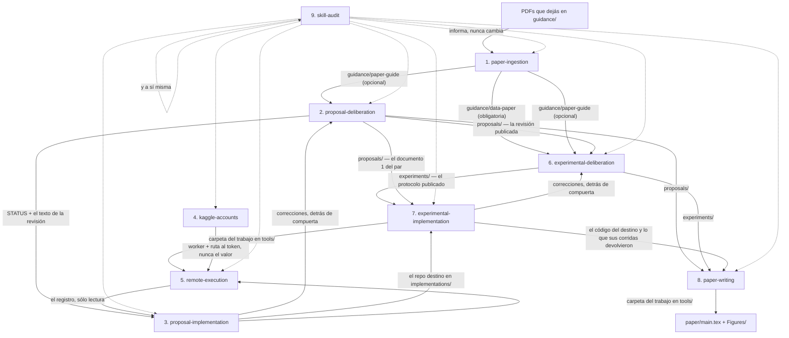
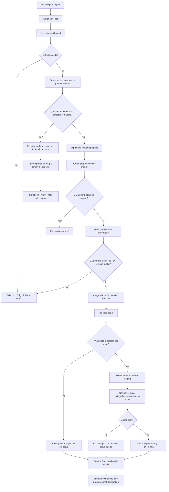
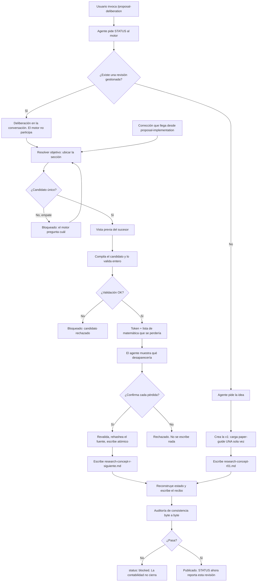
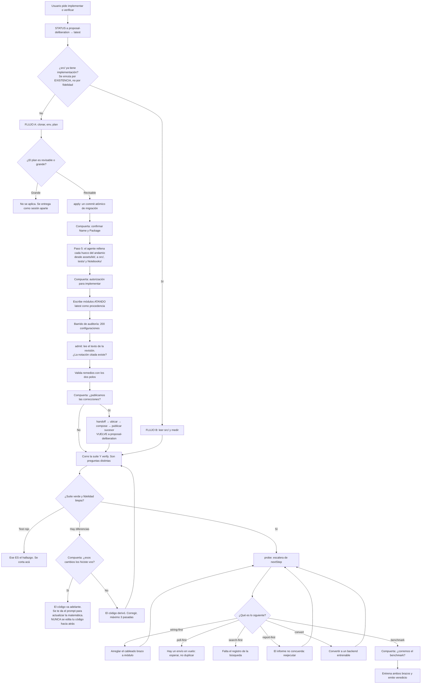
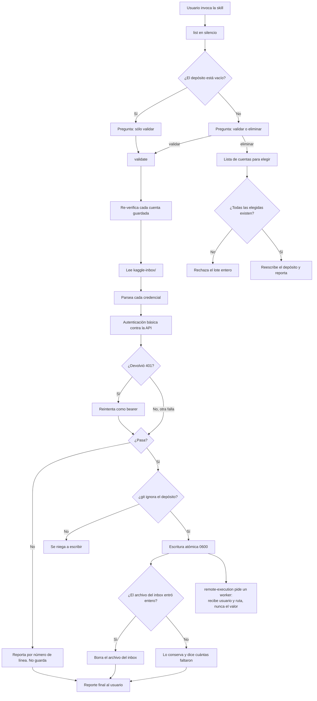
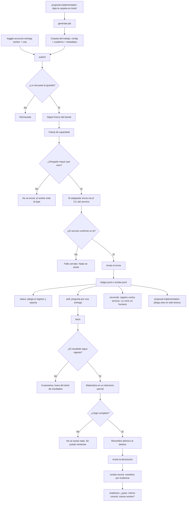
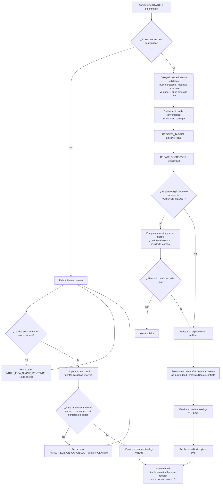
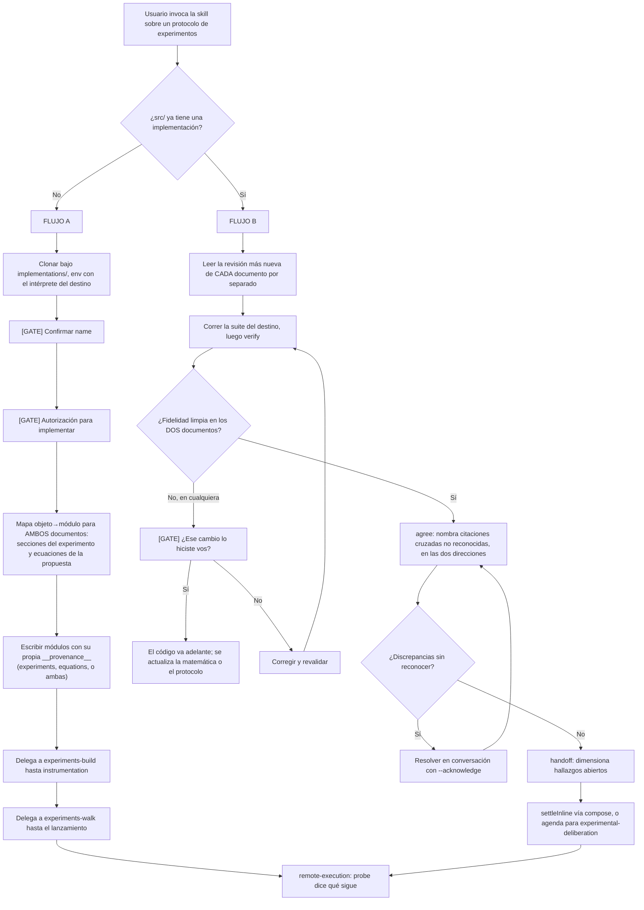
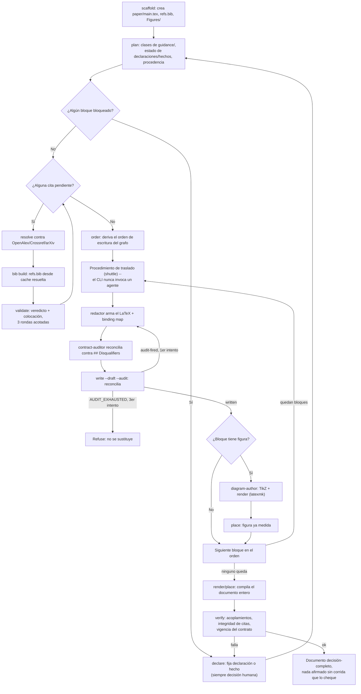
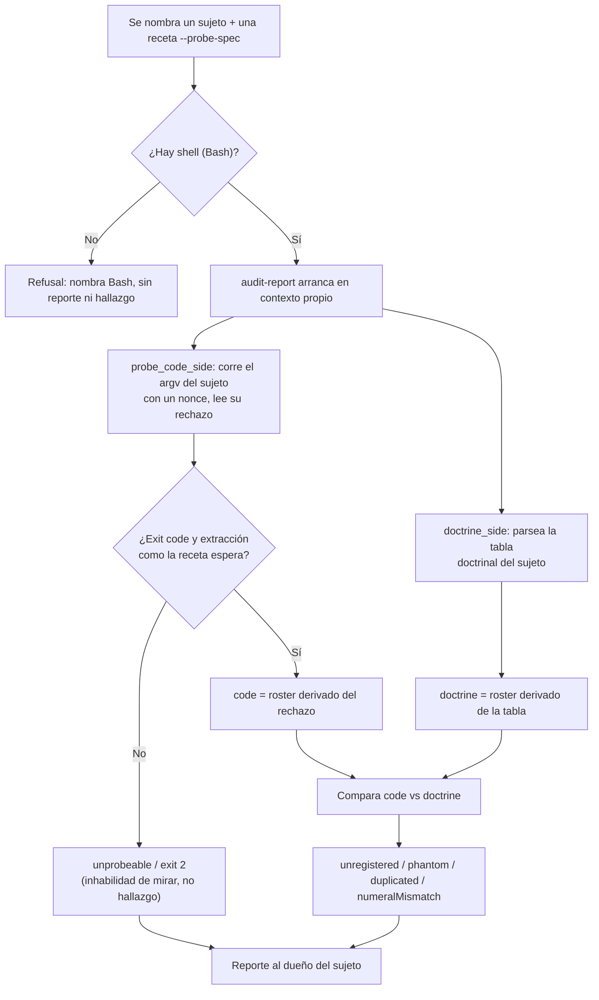

# papersmith-ai

> **Una forja de papers**: convierte PDFs de referencia en Markdown de alta fidelidad y legible por un agente (ecuaciones en LaTeX, tablas como tablas, figuras como archivos), y conduce la deliberación formal —matemática y de diseño experimental— hasta el código que se prueba solo y el paper compilado.

[](https://github.com/CarlosAndres12/papersmith-ai/actions/workflows/test.yml)
[](https://nodejs.org/)
[](https://www.python.org/)

Este README es el **manual completo, en español**: instalación, el workspace por
dentro, los once comandos del CLI, las nueve skills, los quince agentes,
cómputo remoto, desarrollo y solución de problemas.

## Índice

1. [Si es tu primera vez](#si-es-tu-primera-vez)
2. [Flujo de uso — el camino corto](#flujo-de-uso--el-camino-corto)
3. [Puesta en marcha](#puesta-en-marcha)
4. [Cómo funciona — el orden](#cómo-funciona--el-orden)
5. [El workspace por dentro](#el-workspace-por-dentro)
6. [Harnesses y proyección de skills](#harnesses-y-proyección-de-skills)
7. [Los agentes](#los-agentes)
8. [Anatomía de cada skill](#anatomía-de-cada-skill)
9. [Los comandos del CLI](#los-comandos-del-cli)
10. [Cómputo remoto, con cuidado](#cómputo-remoto-con-cuidado)
11. [Arquitectura](#arquitectura)
12. [Desarrollo y pruebas](#desarrollo-y-pruebas)
13. [Solución de problemas](#solución-de-problemas)
14. [Documentación relacionada](#documentación-relacionada)
15. [Licencia](#licencia)

## Si es tu primera vez

Bienvenido. Esta forja está pensada para que puedas ir de un PDF a un paper
compilado sin adivinar el orden. El camino mínimo:

1. **Instalá el CLI y prepará el entorno** — ver [Puesta en marcha](#puesta-en-marcha).
2. **Creá tu workspace** — `papersmith init ~/papers/mi-paper --title "…" --topic "…"`.
   Qué te deja adentro, en [El workspace por dentro](#el-workspace-por-dentro).
3. **Poné un PDF de referencia** en `guidance/reference-papers/` y corré
   `papersmith ingest <pdf>` — o pedí `/paper-ingestion` dentro de tu harness.
4. **Abrí la deliberación** con `/proposal-deliberation` y discutí la matemática
   con el agente.

No hace falta usar todas las skills ni en este orden: **cada una declara qué
necesita antes y se niega antes de hacer algo a medias**. Si le falta una
entrada no la inventa: sale con un código de rechazo que nombra qué falta. Un
`PAPER_ABSENT` no es un error tuyo; es la skill diciéndote qué le falta.

El mapa completo está en [Flujo de uso](#flujo-de-uso--el-camino-corto); la
ruta con detalle, en [Cómo funciona — el orden](#cómo-funciona--el-orden). Y si
vas a usar un agente de IA como copiloto, los que ya vienen definidos están en
[Los agentes](#los-agentes).

---

## Flujo de uso — el camino corto

Nueve skills. Se invocan por nombre en Claude Code (`/paper-ingestion`) o se piden en
castellano (*"ingerí los papers"*). **No hace falta usarlas todas ni en este orden**: cada
una declara qué necesita antes y se niega si falta, así que si arrancás por el medio te
lo va a decir ella.

El camino completo, de un PDF a un paper compilado:

| # | Invocás | Qué hace | Dónde deja el resultado |
|---|---------|----------|-------------------------|
| 1 | `/paper-ingestion` | Convierte los PDFs de referencia a Markdown legible (ecuaciones en LaTeX, tablas como tablas, figuras como archivos) | `guidance/<carpeta>/` |
| 2 | `/proposal-deliberation` | Discute la matemática con vos y publica cada acuerdo como una revisión gestionada | `proposals/` |
| 3 | `/experimental-deliberation` | Discute el diseño experimental que va a poner a prueba esa matemática | `experiments/` |
| 4 | `/proposal-implementation` | Convierte la propuesta en Python que se verifica contra el documento | `implementations/<repo>/` |
| 5 | `/experimental-implementation` | Convierte el protocolo en código y corre sus mediciones | el mismo repo destino |
| 6 | `/kaggle-accounts` | Prueba que las credenciales de Kaggle autentican de verdad | `store/` (nunca sale del disco) |
| 7 | `/remote-execution` | Manda trabajo a un worker remoto y lleva el registro de lo que volvió | el ledger del repo destino |
| 8 | `/paper-writing` | Escribe el paper bloque por bloque, con cada afirmación atada a su evidencia | `paper/` |
| 9 | `/skill-audit` | Audita cualquiera de las anteriores: qué acepta el código contra qué promete su documentación | un informe, nunca un cambio |

**Lo mínimo para empezar.** Si sólo querés probar la forja, alcanza con los pasos 1 y 2:
poné un PDF en `guidance/reference-papers/`, corré `/paper-ingestion`, y después
`/proposal-deliberation`. Los pasos 4 a 7 sólo tienen sentido cuando ya hay una propuesta
publicada y un repositorio destino donde implementarla.

**Tres cosas que conviene saber antes de la primera corrida.**

1. **Nada de lo que produzcas se sube.** `proposals/`, `experiments/`, `paper/` e
   `implementations/` viajan a GitHub **como carpetas vacías** y nada más; `guidance/`
   versiona sus carpetas y nunca los PDFs ni el Markdown de adentro. El andamiaje se
   versiona, el contenido no. Un paper a medio escribir es material de investigación, y
   publicarlo por accidente es una fuga.
2. **Cada skill se niega antes de hacer algo a medias.** Si le falta una entrada, no la
   inventa ni la saltea: sale con un código de rechazo que nombra qué falta. Un
   `PAPER_ABSENT` o un `SECTION_CONTRACTS_UNREADABLE` no es un error tuyo, es la skill
   diciéndote qué le falta.
3. **La deliberación la cerrás vos.** Las dos skills de deliberación proponen, discuten y
   preparan la edición, pero ninguna publica sin que vos aceptes. Eso no es una cortesía:
   está en el contrato de cada una y el motor lo hace cumplir.

---

## Puesta en marcha

Nada de esto requiere claves ni servicios externos: la forja corre localmente.

### 1. Instalá el CLI y prepará el entorno

```bash
# 1. El CLI, desde el checkout del framework
pipx install .

# 2. Runtime aislado de ingestión (micromamba: Python 3.12, PyTorch, Surya OCR, llama-server)
python3 scripts/setup_env.py install

# 3. Dependencias de Node y proyección de skills a los harnesses
npm install
npm run setup:harnesses
```

`scripts/setup_env.py install` provisiona **todo** el stack de ingestión en un
entorno micromamba aparte (CPU o CUDA, según lo que detecte), incluido el
binario `llama-server` que el OCR necesita — **no** es Ollama ni una
instalación de Homebrew. `npm run setup:harnesses` enlaza el árbol canónico
`skills/` dentro de `.claude/skills`, `.pi/skills`, `.opencode/skills` y
`.antigravity/skills`, con enlaces relativos e idempotentes (ver
[Harnesses y proyección de skills](#harnesses-y-proyección-de-skills)). La
primera corrida de `papersmith ingest` descarga ~1.5 GB de pesos de Surya si el
entorno no quedó pre-provisionado.

### 2. Creá un workspace

```bash
papersmith init ~/papers/sparse-ae \
  --title "Sparse Autoencoder Audit" \
  --topic "mechanistic interpretability" \
  --remote kaggle

cd ~/papers/sparse-ae
papersmith status
papersmith status --json          # snapshot legible por máquina
```

El workspace queda desacoplado del checkout del framework: el andamiaje se
sincroniza con `papersmith upgrade` y tus artefactos de investigación están
protegidos por contrato. Qué crea `init` exactamente —y qué se versiona— en
[El workspace por dentro](#el-workspace-por-dentro).

### 3. Ingerí literatura

```bash
papersmith ingest https://arxiv.org/abs/2309.08600    # arXiv, OpenReview o URL
papersmith ingest ~/Downloads/reference-paper.pdf     # PDF local
papersmith ingest ~/Downloads/escaneo.pdf --ocr       # escaneado: modo OCR balanceado
```

Cada PDF suelto termina en su propia carpeta, junto a su Markdown (texto +
LaTeX + tablas, con la bibliografía quitada) y las imágenes de sus figuras. El
detalle del pipeline, en la sección de `paper-ingestion` de la
[Anatomía](#anatomía-de-cada-skill).

### 4. Deliberá, implementá y ejecutá

```bash
papersmith deliberate . --action status                                   # estado de la propuesta gestionada
papersmith implement . --action verify --target implementations/mi-repo   # sobre un repo ya materializado
papersmith run smoke_and_invariants --dry-run                             # planifica; no despacha nada
```

Dentro de un harness, las mismas capacidades se piden por nombre de skill:
`/paper-ingestion`, `/proposal-deliberation`, `/experimental-deliberation`,
`/proposal-implementation`, `/experimental-implementation`, `/paper-writing`.
Y las que no dependen de un dominio — `/kaggle-accounts`, `/remote-execution`,
`/skill-audit` — hacen de portero, memoria y auditor de lo que mandás afuera.

---

## Cómo funciona — el orden

### Paso 1 — Colocar cada PDF en la carpeta según su rol

| Carpeta | Qué va acá |
|---------|------------|
| `guidance/paper-guide/` | **Papers guía** — las referencias metodológicas / de estilo. `proposal-deliberation` las carga como contexto al inicio de cada deliberación. |
| `guidance/reference-papers/` | **Corpus de referencia** — papers de apoyo, ingeridos a Markdown para consulta. No se cargan automáticamente en la deliberación. |
| `guidance/data-paper/` | **Paper de datos — obligatorio para `experimental-deliberation`.** Describe la base de datos de la investigación y es el **techo**: acota qué se puede afirmar. Una afirmación que los datos no sostienen no es un experimento. Sin esta carpeta poblada, `CREATE_INITIAL_REVISION` no puede arrancar. |

**Las tres carpetas viajan vacías.** Cada una llega a un clon con su `.gitkeep` y nada más: `guidance/*/*` está ignorado, con `!guidance/*/.gitkeep` como única escapatoria. El andamiaje se versiona, los PDFs y su Markdown no. `tests/test_forge_scaffolding.py` deriva las dos mitades —lo que los `profile.ts` declaran como fuente contra lo que git realmente rastrea— y se pone rojo si una carpeta declarada deja de viajar.

### Paso 2 — Ingerir los PDFs (PDF → Markdown)

En **Claude Code**, invocar la skill:

```
/paper-ingestion
```

(o simplemente pedir: *"ingerí los papers"*). Por cada PDF **suelto**, crea una
carpeta con el nombre del paper, mueve el PDF adentro y escribe un `<nombre>.md`
liviano (texto + LaTeX + tablas, con la bibliografía quitada) junto con las
imágenes de las figuras:

```
guidance/reference-papers/computers-13-00176-v2-1/
├── computers-13-00176-v2-1.pdf
├── computers-13-00176-v2-1.md
└── _page_4_Figure_2.jpeg   (figuras que el .md referencia)
```

Un **PDF suelto** (directamente en una carpeta raíz) está pendiente; un paper
que ya está dentro de su carpeta se saltea. Para re-ingerir, borrar la carpeta
del paper (dejando el PDF suelto) y volver a ejecutar la skill. La configuración
vive en `papersmith.yaml` (`source_roots`, `mode`, `strip_references`).

### Paso 3 — Deliberar sobre una propuesta (`proposal-deliberation`)

En **Claude Code**, invocar la skill:

```
/proposal-deliberation
```

En el primer turno carga automáticamente los Markdown de `guidance/paper-guide/`
como contexto y actúa como tutor matemático. Desde ahí se puede:

- describir una idea y pedir una primera versión,
- pedir ediciones a una propuesta gestionada,
- ejecutar el ciclo de vida de revisiones gestionadas.

Las propuestas viven en `proposals/`, una por revisión gestionada
(`research-concept-rNN.md`).

### Paso 4 — Llevar la propuesta a código (`proposal-implementation`)

En **Claude Code**, invocar la skill:

```
/proposal-implementation
```

Toma la revisión vigente y la materializa en un repositorio destino, que vive en
`implementations/` con su propio git y su propio entorno virtual. El flujo tiene
dos fases separadas:

1. **Estructura.** Si el repo trae contenido, lo lleva al layout y verifica
   —sin ejecutar nada— que cuadernos, rutas y referencias sigan resolviendo. No
   audita ni valida el código que ya estaba: es lo que hay, ordenado.
2. **Materialización.** Recién entonces implementa la matemática y la somete a
   la escalera de validación.

```
<repo>/
├── <Name>/            Notebooks/  Data/  Results/  Models/
├── src/<Package>/     una implementación por objeto matemático
├── tests/             smoke · invariantes · sintéticos · auditoría · remedios
└── pyproject.toml
```

La escalera tiene cinco niveles, del más barato al más caro: **smoke**,
**invariantes** (cada afirmación de la propuesta anclada a un test),
**sintéticos** (deterministas, semilla fija), **auditoría** (hallazgos sobre la
matemática, medidos sobre 200 configuraciones aleatorias) y **remedios** (cada
corrección propuesta validada con el mismo rigor). Un hallazgo sin remedio
validado no se reporta.

Eso es todo lo que hace falta para usar la forja. Si querés entender **qué pasa
adentro** de cada skill —sus pasos, sus piezas, cómo se conectan entre sí y qué
limitaciones tiene cada una— seguí en [Anatomía de cada
skill](#anatomía-de-cada-skill). Y para el contrato literal, el `SKILL.md` de cada
una.

---

## El workspace por dentro

`papersmith init` crea un directorio autocontenido —sin git inicializado y sin
tocar tu checkout— con esta forma:

```
mi-paper/
├── .papersmith/                 # estado del workspace (config, manifest, ledger)
│   ├── config.json              #   target y perfil activos, rutas del ledger
│   ├── manifest.json            #   hashes de todo lo que generó el framework
│   ├── runs_ledger.jsonl        #   cada corrida despachada, en orden
│   └── version                  #   versión del framework que lo creó
├── .claude/agents/              # los catorce subagentes (fuente única de verdad)
├── skills/                      # la copia del kit: las nueve skills + _core
│   └── _core/                   #   los dos motores compartidos (deliberación, implementación)
├── sections/                    # los diez contratos de sección (viajan CON contenido, como skills/)
├── guidance/
│   ├── reference-papers/        # drop-zone: dejá acá los PDFs de referencia
│   ├── paper-guide/             # papers guía de método y estilo (opcional pero recomendado)
│   └── data-paper/              # paper de datos (obligatorio para experimental-deliberation)
├── proposals/                   # revisiones gestionadas, plano: research-concept-rNN.md
├── paper/                       # el LaTeX del paper (paper-writing lo escribe acá)
├── experiments/                 # el protocolo experimental gestionado
├── implementations/             # repos destino; cada uno con su propio git
├── kaggle-inbox/                # lo que vuelve de los workers remotos
├── CLAUDE.md / OPENCODE.md / PI.md / .antigravity/rules.md   # routing de harnesses
├── papersmith.yaml              # configuración del workspace (la tuya, editable)
├── package.json                 # dependencias Node del workspace (jiti, typebox), la tuya, editable
├── requirements.txt
├── scripts/setup_env.py         # provisión del runtime de ingestión
└── README.md                    # descripción breve del workspace
```

Cada carpeta de investigación (`guidance/*/`, `proposals/`, `paper/`, `experiments/`,
`implementations/`) llega vacía, con su propio `.gitkeep`: el `.gitignore` del
workspace aplica la misma regla que este repositorio se aplica a sí mismo —la
carpeta se versiona, el contenido nunca.

### `papersmith.yaml` — la configuración que sí vas a tocar

El archivo viene con tres targets de ejemplo y tres perfiles de ejecución. Los
targets declaran **dónde** corre el trabajo; los perfiles, **qué** se corre y
cómo se reparte:

```yaml
compute_targets:
  default: "kaggle-gpu-pool"
  targets:
    local-workstation: { provider: "local", device: "cuda:0" }
    kaggle-gpu-pool:   { provider: "kaggle", accelerator: "GPU_T4_X2", ... }
    slurm-cluster:     { provider: "remote-ssh", host: "hpc.university.edu", ... }

execution_profiles:
  smoke_and_invariants:  { target: "local-workstation", entrypoint: "pytest …/tests/test_invariants.py" }
  sweep_training:        { target: "kaggle-gpu-pool", sharding: { … }, artifacts: { … } }
  benchmark_evaluation:  { target: "kaggle-gpu-pool", entrypoint: "papermill …/benchmark.ipynb" }

paper_ingestion:
  engine: marker
  mode: fast            # fast (CPU) | balanced (GPU, máxima fidelidad)
  strip_references: true
  source_base: guidance
```

El target y el perfil activos viven en `.papersmith/config.json`; `papersmith
target set` los cambia. El bloque `paper_ingestion` lo posee la skill de
ingestión y el orquestador lo trata como opaco (editalo con la skill, no a
mano).

### Qué se versiona y qué no

El contrato de preservación de `papersmith upgrade` es explícito: nunca toca
`guidance/`, `proposals/`, `paper/`, `experiments/`, `implementations/`,
`kaggle-inbox/`, `papersmith.yaml`, `package.json`, `README.md`
ni los archivos `.env*`. Todo lo demás es andamiaje del framework y `upgrade`
lo sincroniza —con `--force` si hace falta— dejando tus artefactos intactos.

En este repositorio la misma regla vale para Git: el andamiaje se versiona, el
contenido no. Las carpetas de investigación viajan con su `.gitkeep` y nada
más; `guidance/` versiona las carpetas y nunca los PDFs ni el Markdown
ingerido.

### El estado: `.papersmith/`

- **`manifest.json`** guarda el hash de cada archivo generado. `papersmith
  audit --check-drift` compara contra el disco y nombra lo que se desvió; la
  reparación es `papersmith upgrade`, nunca una edición a mano.
- **`runs_ledger.jsonl`** es append-only: cada corrida de `papersmith run` que
  se despacha queda registrada con su target, su perfil y su resultado.
- **`config.json`** guarda el target activo, el perfil activo y las rutas de
  configuración del ledger.

---

## Harnesses y proyección de skills

`skills/` en la raíz del repositorio es la **fuente única de verdad**. Cada
harness lee skills desde su propia carpeta, así que el script de proyección
enlaza el árbol canónico en cada una con enlaces **relativos** e idempotentes:
correrlo de nuevo converge al mismo layout y el checkout sigue siendo
relocalizable.

```bash
npm run setup:harnesses      # = bash scripts/setup-harnesses.sh
```

| Harness | Dónde lee las skills | Documento de routing (workspace) |
|---------|----------------------|-----------------------------------|
| Claude Code | `.claude/skills/` | `CLAUDE.md` |
| Pi | `.pi/skills/` | `PI.md` |
| OpenCode | `.opencode/skills/` | `OPENCODE.md` |
| Google Antigravity | `.antigravity/skills/` | `.antigravity/rules.md` |

Dentro de un **workspace** generado, la historia es ligeramente distinta y
conviene saberlo: el workspace embarca el árbol `skills/` completo y el de
agentes (`.claude/agents/`), y sus routing docs apuntan al árbol canónico
`skills/*/SKILL.md`. Los documentos de routing son generated projections: la
fuente real de cada agente es `.claude/agents/*.md` y la de cada skill es su
`SKILL.md`. No edites las proyecciones a mano; se regeneran (y
`papersmith audit --check-drift` avisa si una se desvió). Para que tu harness
liste las skills como comandos `/`, corré `npm run setup:harnesses` dentro del
workspace: enlaza el árbol embarcado en `.claude/skills`, `.pi/skills`,
`.opencode/skills` y `.antigravity/skills`, igual de relativo e idempotente que
en el checkout. En este checkout, las proyecciones de comandos slash
(`.claude/commands/`, `.opencode/commands/`) y el plugin de seguridad de OpenCode
se sincronizan con `python scripts/sync-repo-harness.py` (`--check` para CI; no
tiene script en `package.json` porque el kit lo embarca y el script es sólo del
repo).

---

## Los agentes

Un workspace trae **quince subagentes** en `.claude/agents/`. No son
reemplazos del CLI: son tiradas cortas de trabajo que tu harness lanza (por
ejemplo, con la Task tool) cuando vos se lo pedís. La forma es siempre la
misma — **una tirada entre dos compuertas del operador**: el agente decide
nada, pregunta nada, y termina reportando qué encontró y cuánto costó
establecerlo. Las compuertas las abrís y cerrás vos.

| Agente | Para qué entra | Skill que carga |
|--------|----------------|-----------------|
| `implementation-build` | Del mapa objeto→módulo aprobado al informe de hallazgos: materializa el scaffolding, escribe un módulo por objeto con su procedencia y sus tests de invariantes, y valida los remedios admitidos. | `proposal-implementation` |
| `implementation-walk` | Camina el flujo declarado acto por acto, en su orden: corre los pasos locales, registra cada producto y se detiene en el ensayo previo al lanzamiento. No tiene camino para enviar una campaña. | `proposal-implementation` |
| `deliberation-publish` | Desde que aceptás un cambio hasta que la revisión sucesora queda publicada y vigente — la única forma en que la matemática viaja. La deliberación en sí no está acá: sólo vos la cerrás. | `proposal-deliberation` |
| `experimental-publish` | Lo mismo que `deliberation-publish`, sobre el documento de experimentos. | `experimental-deliberation` |
| `experimental-validation` | La etapa `validated`: busca el protocolo de evaluación del área —métricas, baselines, dataset, semillas, test de significancia—, verifica cada baseline contra su repo y su venue, y fecha cada URL que usa. | `experimental-deliberation` |
| `experiments-build` | Del mapa aprobado de pasos del protocolo a comandos ejecutables: materializa lo que haga falta, cablea cada paso e instrumenta cada medición para que se pueda correr y leer. | `experimental-implementation` |
| `experiments-walk` | La caminata del protocolo, con las mismas compuertas y el mismo alto en el ensayo. | `experimental-implementation` |
| `paper-ingestion` | Convierte un paper a la forma en que se puede usar de verdad: ecuaciones LaTeX, tablas como tablas, figuras como archivos. Etapas: `filed`, `extracted`, `readable`. No le pregunta nada a nadie. | `paper-ingestion` |
| `contract-auditor` | Lee los `## Disqualifiers` de un contrato, literales, y juzga un bloque borrador contra cada uno: `fires`/`clear`/`undecidable`, con el pasaje citado en cada `fires`. | `paper-writing` |
| `redactor` | Redacta el LaTeX de un bloque a partir de exactamente cuatro entradas (la prosa del contrato, su evidence set, su modo y su style set) y devuelve un mapa de binding: de dónde sale cada oración. | `paper-writing` |
| `style-sampler` | Resuelve el bloque equivalente, completo, en cada carpeta de estilo de `guidance/` y lo devuelve verbatim, nunca recortado. Es la única material que un chequeo de solapamiento puede comparar. | `paper-writing` |
| `diagram-author` | Escribe un diagrama TikZ standalone (`<id>.tex` + `<id>.diagram.json`) y lo compila en su propio loop, hasta el presupuesto de reparaciones. Nunca dibuja un gráfico a partir de números medidos — eso es el verbo `place`. | `paper-writing` |
| `figure-auditor` | Compara los componentes declarados en el manifest contra la prosa de la sección y los pasos del pipeline; reporta veredicto estructurado. | `paper-writing` |
| `insumos-observer` | Lee las cuatro fuentes de entrada declaradas del paper —`proposals/`, `experiments/`, el código del repo destino y sus propias salidas de corrida— y reporta, por cada hecho observable, si se cumple y con qué evidencia. Nunca decide un valor ni corre `declare`. | `paper-writing` |
| `audit-report` | Audita un sujeto que enumera un conjunto cerrado —operaciones, subcomandos, códigos, assets— buscando la brecha entre lo que su código acepta y lo que su documentación promete. Reporta; nunca repara. | `skill-audit` |

Tres reglas que ordenan todo lo demás:

- **La fuente de verdad es `.claude/agents/`.** Los routing docs de cada
  harness (`CLAUDE.md`, `PI.md`, `OPENCODE.md`, `.antigravity/rules.md`) listan
  a los quince enteros, y se generan: si querés cambiar un agente, se cambia
  ahí, no en la proyección.
- **Cada agente declara la skill que carga** (`skills/<nombre>/SKILL.md`), y esa
  atadura se verifica: un agente que apunte a una skill que el workspace no
  embarca no llega.
- **Algunos agentes no son invocados por ningún camino de código**
  (`contract-auditor`, `redactor`, `style-sampler`): los lanzás vos, y es el
  verbo `write` el que juzga lo que devuelven — nunca confía en tu relato ni en
  el borrador por sí solos.

---

## Anatomía de cada skill

Las secciones de arriba cuentan **qué hacés**. Esta cuenta **qué pasa adentro**.
Está escrita para alguien que nunca vio el proyecto: cada skill se explica desde
cero y **entera** —sus pasos, sus piezas, sus conexiones con las demás, sus
limitaciones conocidas y su diagrama— sin mandarte a otra parte del documento.

Antes de entrar, dos cosas.

**Qué es una skill acá**, porque no es un programa que corrés y se acabó. Cada una
tiene dos mitades que hacen cosas distintas:

| Mitad | Qué es | Quién la ejecuta |
|-------|--------|------------------|
| `SKILL.md` | Un contrato en prosa: cuándo activarse, qué preguntar, qué no hacer nunca. No es código: es la instrucción de conducta. | **El agente** lo lee y se comporta según eso. |
| El motor (`scripts/`, `engine/`) | Código determinista: mismas entradas, misma salida. Sin modelo, sin red, sin claves. | **La máquina** lo ejecuta y devuelve un veredicto que el agente no puede negociar. |

Esa división es la idea central de toda la forja: **el agente decide, el motor
verifica**. El agente propone un cambio; el motor comprueba que ese cambio no
rompió nada y, si lo rompió, se niega. Un agente puede equivocarse. Un motor
determinista no cambia de opinión.

**Y cómo se encadenan.** Las nueve no son islas: cada una recibe algo concreto de
otra y le entrega algo concreto a la siguiente. Este es el mapa; cada skill explica
su propia costura en detalle, en su apartado. Las flechas dicen **qué** pasa por la
costura, no sólo que existe — y cada una de las etiquetas de abajo está leída de la
declaración de la skill que la recibe, no inferida del nombre de la carpeta.



**Tres cosas que el mapa dice y conviene leer despacio.**

*Los dos lazos hacia arriba son el corazón de la forja.* La matemática baja a código
y lo que el código descubre sube de vuelta al documento; lo mismo entre el protocolo
experimental y su implementación. En los dos casos la vuelta pasa por una compuerta
que **vos** abrís: el código propone la corrección, nunca la publica.

*Las cuatro de en medio son dos pares sobre dos motores.* La 2 y la 6 comparten un
motor de deliberación; la 3 y la 7, un motor de implementación. Lo único que cambia
entre los dos huéspedes de cada par es su `profile.ts` o su `impl_profile.py` — por
eso un defecto en un motor aparece en dos skills a la vez, y por eso las
limitaciones del motor están anotadas en las dos.

*La 8 es la única que lee de todo lo anterior a la vez*, y la 9 no está en la cadena:
se para al costado y mira a cualquiera, incluida a sí misma.

---

### 1. `paper-ingestion` — de PDF a Markdown

**Para qué está.** Los papers llegan como PDF, y un PDF es, para un agente, una
caja cerrada: el texto está mezclado con la maquetación, las ecuaciones son dibujos
y las tablas son líneas sueltas. Esta skill convierte cada PDF en Markdown limpio
—ecuaciones en LaTeX, tablas en Markdown, figuras como archivos de imagen aparte—
para que el resto de la forja pueda **leer** el paper en vez de intentar
descifrarlo. Todo corre localmente: sin claves, sin servicio externo.

**De dónde recibe y a quién le entrega.** Es el principio de la cadena: lo único que
recibe son los PDFs que vos dejás en `guidance/`. Lo que entrega tiene una
consecuencia que conviene entender antes de usarla:

- `guidance/paper-guide/` — lo que cae acá es lo que `proposal-deliberation` carga
  **automáticamente**, desde la constante `GUIDE_DIRECTORY = "guidance/paper-guide"`
  de su motor. Pero lo carga **una sola vez en toda la vida de la propuesta**: en la
  creación de la v1, y nunca más.
- `guidance/reference-papers/` — corpus de consulta. **Nunca se carga solo.** Está
  ahí para que vos o el agente lo lean cuando haga falta.

> **El orden importa, y esto no es obvio.** Si ingerís un paper guía **después** de
> haber creado la v1 de la propuesta, ese paper ya no entra por esa vía: la carga es
> irrepetible por diseño. Ingerí primero, deliberá después.

**Qué necesita antes.** Una única preparación por máquina: correr
`./.claude/skills/paper-ingestion/setup.sh`. Es idempotente y hace dos cosas:
instala el binario `llama-server` (el motor de OCR; no es un paquete de pip) y crea
el entorno virtual con `marker-pdf` adentro. La primera ingesta real descarga los
modelos (~1,5 GB) y los cachea; de ahí en más funciona offline.

**Las etapas que declara.** El flujo no es la lista de comandos: es lo que cada
etapa deja establecido, y cuándo podés darla por superada. Esta tabla está leída
de `OBJECTIVE_FLOW` en el script, que un test mantiene igual al `SKILL.md`.

| Etapa | Qué deja establecido | La tenés detrás cuando |
|---|---|---|
| `filed` | El PDF está dentro de una carpeta temática propia — eso es lo que lo vuelve un paper y no una descarga | deja de aparecer entre los sueltos |
| `extracted` | El Markdown existe al lado, con sus figuras escritas como archivos en vez de quedar dentro de la página | la carpeta del paper tiene el documento y sus imágenes |
| `readable` | Las ecuaciones son LaTeX y las tablas son Markdown, así un lector posterior puede **citar** una fórmula en vez de describir una foto de una | es la llegada; no está detrás de nadie |

**Llegada:** un documento que una persona puede leer y una sesión posterior puede
citar — que un PDF no es. Sus ecuaciones son dibujos y sus tablas son tinta.

**Una tensión declarada, que no es un error tuyo si la ves.** El campo
`humanStops` de esta skill está **vacío**: ninguna *etapa* se detiene a esperar a
una persona. Pero su Activation Contract dice *"Never ingest without asking
first"*, y la confirmación de la Fase 2 es obligatoria. Las dos cosas conviven
porque la confirmación ocurre **antes** de que el flujo arranque, y el script no
tiene mecanismo de consentimiento propio — la regla vive en el `SKILL.md` y la
hace cumplir el agente. Vale anotar que `kaggle-accounts`, que también escribe,
sí declara *"consentir la validación"* como parada de una persona: las dos skills
no describen igual el mismo consentimiento.

**El flujo, paso a paso.** El punto clave es que **son dos comandos, no uno**, y esa
división existe para que exista un momento de consentimiento.

*Fase 1 — Descubrir (gratis, no toca nada):*

1. El agente corre el script con `--list`. Esto lee `papersmith.yaml`, valida la
   configuración, descubre las carpetas fuente y busca PDFs sueltos. **No carga
   ningún modelo y no mueve ningún archivo**: el código corta antes.
2. Se imprime la lista: ruta relativa y cantidad de páginas de cada PDF.
3. Si hay PDFs tirados directamente en `guidance/` —fuera de toda carpeta temática—
   se reportan aparte, junto con los temas existentes como opciones.

*Fase 2 — Confirmar (obligatorio):*

4. El agente te pregunta **cuáles** ingerir, como selección múltiple. Esta regla vive
   en `SKILL.md`, no en el script: el script no tiene mecanismo de consentimiento. La
   división en dos comandos es lo que hace posible que exista el paso de aprobación.
5. Si no aprobás nada, se termina ahí. Nada se movió.

*Fase 3 — Ejecutar:*

6. El agente vuelve a correr el script con exactamente las rutas aprobadas. Cada ruta
   se valida **antes** de cargar el motor: que exista, que sea un `.pdf`, que siga
   suelta. Así un argumento mal escrito no cuesta una carga de modelo.
7. Se construye el conversor de Marker, explícitamente **sin servicio de LLM** — eso
   es lo que lo mantiene local y keyless.
8. Por cada paper, la conversión es **transaccional**: se arma todo en un directorio
   temporal al lado del PDF, y sólo cuando el `.md` y las figuras están completos se
   crea la carpeta final, se mueven los archivos, y **el PDF se mueve último**. Hasta
   que eso pasa, el paper sigue suelto y reintentar es simplemente volver a correr.
9. Si un paper falla, se reporta y **el lote sigue** con los demás. Si falla a mitad,
   se borra la carpeta sólo si la creó esta corrida.

*Reingerir:* no hay bandera de "forzar" ni archivo de estado. La idempotencia es
puramente estructural: un PDF está *suelto* cuando el nombre de su carpeta padre no
coincide con su propio nombre. Una vez que vive en `<nombre>/<nombre>.pdf`, dejó de
estar suelto y nadie lo vuelve a tocar. **Para reingerir, borrás la carpeta del
paper** y el PDF vuelve a quedar suelto para la próxima corrida.

**Los módulos.**

| Archivo | Qué hace y por qué existe |
|---------|---------------------------|
| `SKILL.md` | El contrato de conducta: correr `--list` primero, pedir aprobación por paper, cómo tratar un PDF sin archivar. El script no dice nada de esto — sólo devuelve códigos de salida. |
| `setup.sh` | Provisión del entorno, idempotente: instala `llama-server` y arma el `.venv`. Existe porque el OCR necesita un binario de sistema que pip no puede instalar. |
| `requirements.txt` | Fija `marker-pdf==2.0.0`. Sin ese pin, una versión nueva podría cambiar la API del conversor y romper la extracción en silencio. |
| `scripts/extract_pdf.py` | El motor completo: validación de configuración, descubrimiento, listado, archivado, conversión transaccional, quitado de bibliografía, escritura de figuras, y el contrato de códigos de salida. |

Las funciones que importan, si vas a leer el código: `is_loose()` —el chequeo de
idempotencia entero, en una línea—, `discover_source_roots()`, `find_loose_pdfs()`,
`resolve_single_target()` (la validación previa a cargar el motor),
`build_converter()`, `ingest_loose()` (la transacción) y `file_into()` (el archivado
de un PDF sin tema).

**Qué escribe en el disco.**

```
guidance/reference-papers/<nombre>/
├── <nombre>.pdf              el PDF original, movido acá al final
├── <nombre>.md               texto + LaTeX + tablas, sin bibliografía
└── _page_4_Figure_2.jpeg     las figuras que el .md referencia
```

Claves que respeta de `papersmith.yaml`, bajo el bloque `paper_ingestion:`: `engine`
(sólo `marker`), `mode` (`fast` o `balanced`), `strip_references` (bool, por defecto
`true`), `source_base` (por defecto `guidance`) y `source_roots`.

**Los seguros.**

- **Nunca convierte sin que se haya preguntado.** Protocolo del `SKILL.md`,
  habilitado por la división en dos comandos.
- **Falla cerrado ante configuración inválida.** Un `papersmith.yaml` malformado sale
  con código 2 sin tocar nada — elegido por sobre reportar "no hay nada que hacer",
  que sería indistinguible de un caso sano.
- **Nunca fusiona con una carpeta existente.** Si ya hay contenido, se niega. El único
  camino a reingerir es borrarla, que es explícito y se ve destructivo a propósito.
- **Nunca adivina el tema de un PDF sin archivar.** Convertirlo donde está lo
  convertiría permanentemente en una "carpeta temática" propia.
- **Sólo revierte lo que creó.** Una carpeta que ya existía nunca se borra.

**Limitaciones conocidas.** Ninguna abierta hoy. La que figuraba acá
—`.claude/agents/paper-ingestion.md` describía una interfaz que el script no tiene:
`--output-dir`, `--force`, un manifiesto versionado y extracción con PyMuPDF— **ya no
aplica**: esa definición se corrigió y hoy sólo nombra la skill y delega el contrato en
ella. Medido: el script expone `--list`, `--file` e `--into`, no importa PyMuPDF y no
escribe manifiesto; la única aparición de la palabra *manifest* en la definición del
agente es la nota que explica que dejó de restatear el contrato. Una regla escrita dos
veces son dos copias que se separan, y la vieja se lee tan autorizada como la nueva.

**Diagrama.**



---

### 2. `proposal-deliberation` — discutir la matemática y publicar revisiones

**Para qué está.** Escribir una propuesta de paper matemático es un ida y vuelta
largo: se discute una idea, se corrige una ecuación, se reordena una sección. El
riesgo es que en ese ida y vuelta un modelo reescriba una ecuación "de paso", sin que
nadie lo note. Esta skill hace dos cosas a la vez: convierte al agente en tutor
matemático que discute con vos, y pone un motor determinista entre esa discusión y el
archivo, para que **nada cambie salvo lo que aprobaste**.

**De dónde recibe y a quién le entrega.**

*Recibe de `paper-ingestion`:* los Markdown de `guidance/paper-guide/`, y **sólo en
la creación de la v1**. El motor los carga él mismo en esa única operación; el agente
no se los pasa. Para cualquier revisión que ya existe, esa carga **no se repite** — el
`SKILL.md` lo dice sin matices: ese ingreso se gasta una sola vez, en la creación
verdadera de la v1.

*Recibe de `proposal-implementation`:* correcciones. Cuando la implementación
encuentra un defecto en la matemática y lo valida, vuelve acá a publicarlo. Pero
**entra por la puerta normal**, sin atajo: ubica la sección, arma el reemplazo, y pasa
por la misma vista previa, la misma puerta de integridad matemática y la misma
auditoría que cualquier otro cambio. Que la corrección venga de una medición no la
exime de nada.

*Le entrega a todo el resto:* dos cosas. El archivo publicado
(`proposals/research-concept-rNN.md`) y —tanto o más importante— la operación
`STATUS`, que es de dónde **toda la forja** saca la respuesta a "cuál es la revisión
vigente". Nadie mira el directorio a ojo. Esa es una regla dura, y existe porque el
listado del directorio puede mostrar archivos que el motor considera inválidos.

**Qué necesita antes.** Nada más que Node. No usa claves de API ni llama a ningún
modelo: el motor es keyless. El "modelo" de esta skill es el agente que ya está en la
conversación — por eso el motor no necesita uno propio.

**Las etapas que declara.** Leídas del campo `objective` de su propio
`profile.ts`, que un test mantiene igual al `SKILL.md`. `STATUS` las reporta
arriba del inventario, y las dos rutas de error del motor también las llevan.

| Etapa | Qué deja establecido | La tenés detrás cuando |
|---|---|---|
| `bound` | Cuál revisión es la actual y cuál entrada de ella toca el cambio | `STATUS` nombró la última y el objetivo resolvió a una entrada |
| `deliberated` | El cambio se **discutió**, no se tipeó | **lo dijiste vos** — acá nada lo mide, y nada puede medirlo |
| `composed` | El reemplazo existe escrito COMO matemática —la ecuación, con su tag— y no como una descripción de ella | existe un bloque que lleva la ecuación y el tag donde aterriza |
| `published` | La sucesora existe con el marcador del artefacto y es la revisión actual | es la llegada; no está detrás de nadie |

**Llegada:** la revisión sucesora publicada y actual, que es la única forma en la
que viaja la matemática.

**`deliberated` es la parada de una persona, y es deliberado que no se pueda
medir.** El motor puede comprobar que existe un bloque; no puede comprobar que
lo discutiste. Por eso esa etapa avanza sólo cuando vos lo decís.

**El flujo, paso a paso.**

1. **Arranque.** Lo primero que hace el agente es pedirle al motor `STATUS` —una
   operación de sólo lectura— para saber cuál es la revisión vigente. No abre
   `proposals/` por su cuenta.
2. **Bifurcación.** Si no hay ninguna revisión gestionada, el camino es *crear la v1*.
   Si ya hay una (`r01`, `r05`, `r17`…), el camino es *editar*.
3. **Crear la v1.** El agente te pide la idea y manda la creación inicial. **Tu idea
   necesita al menos dos oraciones**: el motor saca el título de la primera y el
   encabezado de sección de la segunda, y con una sola los dos salen idénticos byte a
   byte — lo que dejaría el documento imposible de editar después, porque toda consulta
   que nombre un lugar sería ambigua. Con una sola oración se niega en el acto
   (`INITIAL_IDEA_SINGLE_SENTENCE`) y no escribe nada. Una oración termina en `.`, `!`
   o `?`; un salto de línea no alcanza. El motor
   carga los papers de `guidance/paper-guide/` **una sola vez** —acá y nunca más—,
   redacta el documento a partir de tu idea, toma un candado único de proyecto (para
   que dos ideas en paralelo no puedan crear dos v1) y escribe
   `proposals/research-concept-r01.md`. La v1 se publica directo: no hay nada previo
   que proteger.
4. **Deliberar.** Con una revisión ya existente, la discusión pasa **en la
   conversación**, no en el motor. El agente propone, refuta, exige necesidad
   matemática antes de formalizar. El motor no se entera de nada de esto, y así debe
   ser: el estado de la charla vive donde vos podés verlo.
5. **Ubicar el cambio.** Cuando algo queda aprobado hay que decirle al motor *dónde*
   aplica. Se lo nombra con palabras del encabezado, y el motor las puntúa contra la
   estructura real del documento. Si los dos mejores candidatos quedan demasiado
   cerca, **se bloquea y pregunta** en vez de elegir. Nunca adivina.
6. **Vista previa.** El agente arma la decisión concreta —`replace`, `insert`,
   `delete`, `move` o `copy`— y pide el sucesor. Acá el motor **no publica**: compila
   el documento candidato pegando los bytes aprobados en el offset exacto, lo revalida
   entero, y devuelve un token de un solo uso junto con —lo importante— la lista de
   **qué matemática desaparecería**.
7. **La puerta.** El agente te muestra en castellano llano cada ecuación, cada `\tag`
   y cada cita `(Ec. N)` que se perdería. Vos confirmás. Recién ahí se reenvía la
   misma operación con el token y con cada pérdida reconocida por nombre. Si falta una
   sola, se rechaza y no se escribe nada.
8. **Publicar.** El motor vuelve a leer el archivo fuente, verifica que su hash no
   cambió desde el paso 6, aplica los parches, valida el resultado, verifica el fuente
   **una segunda vez** justo antes de escribir, y recién entonces escribe
   `research-concept-r<N+1>.md` de forma atómica.
9. **Contabilidad.** Reconstruye los índices derivados y escribe un **recibo** con el
   sha256 del documento antes y después.
10. **Auditoría.** Después de cada publicación se releen *todas* las revisiones y se
    comprueba que cada archivo siga coincidiendo byte a byte con su recibo. Si algo no
    cuadra, el resultado se degrada a `blocked` aunque los bytes ya estén escritos — y
    eso es a propósito: el trabajo no está terminado hasta que la contabilidad cierra.

Además existe un **ciclo de vida de revisiones**: retirar una revisión la copia a una
cuarentena inmutable, mueve los artefactos públicos, marca la operación como pendiente
de auditoría y sólo la confirma si la auditoría pasa; restaurar es el espejo exacto.
La `r01` no se puede retirar nunca, ni tampoco una revisión que tenga descendientes.

**Los módulos.** El motor son unos 50 archivos TypeScript. Agrupados por trabajo:

| Grupo | Archivos | Qué hace y por qué existe |
|-------|----------|---------------------------|
| Puerta de entrada | `engine/cli.mjs` | El único punto de acceso al motor. Atiende `STATUS` y la resolución de objetivo él mismo, y despacha el resto. Se levanta una vez por deliberación para no pagar el arranque en cada llamada. |
| Enrutador público | `proposal-workspace.ts` | Registra la herramienta que el agente llama y decide a qué etapa va cada pedido. Contiene además las primitivas de escritura segura en disco. |
| Coordinador | `orchestrator.ts` | La máquina de estados: resuelve, previsualiza, acepta y publica. Su `publish()` es el **único** lugar del sistema por donde puede pasar una escritura. |
| Ubicación | `target-resolver.ts`, `ambiguity-gate.ts`, `document-index.ts` | Convierten "la sección de normalización" en un rango de bytes exacto. `ambiguity-gate` es el que se niega cuando hay empate. |
| Aplicación de bytes | `patch-compiler.ts`, `successor-composite-engine.ts`, `ambient-supplied-planner.ts` | Pegan el texto aprobado en el offset exacto y verifican, por separado, que todo lo que quedó afuera del cambio siga idéntico. |
| Puerta de preservación | `preservation.ts` (neutral) + `proposal-deliberation/preservation-math.ts` (extractor matemático) | Enumera los átomos que el perfil del dominio reconoce (para matemática: ecuaciones, `\tag`, macros y citas) antes y después. Reporta lo perdido, y **bloquea por su cuenta** ante violaciones de forma canónica: `$$` desbalanceado, delimitadores `\(...\)`, un símbolo Unicode de matemática metido adentro de un `$...$`. |
| Validación del candidato | `candidate-validator.ts` | Re-parsea el documento entero resultante: Markdown bien formado, etiquetas únicas, referencias que resuelven, símbolos sin conflicto, bytes de afuera intactos. |
| Auditoría | `consistency-audit.ts`, `self-audit.ts` | Recalculan el sha256 de cada revisión y lo cruzan contra su manifiesto y su recibo. De acá salen `RECEIPT_SHA_MISMATCH`, `ORPHAN_STATE` y compañía. |
| Recibos y estado | `revision-receipt.ts`, `derived-state-store.ts`, `derived-state-builder.ts` | Escriben y releen la contabilidad: qué se publicó, desde qué, con qué hash. |
| Ciclo de vida | `revision-lifecycle-store.ts`, `revision-lifecycle-transaction.ts` | Retiro y restauración transaccionales, con reversión en orden inverso si algo falla a mitad. |
| Concurrencia | `mutation-lock.ts` | Impide dos publicaciones simultáneas sobre el mismo archivo. |
| Token de aceptación | `successor-acceptance-registry.ts` | Ata una vista previa a su aceptación. Vive en memoria, es de un solo uso y muere con el proceso: no se puede aceptar mañana una previa de hoy. |
| Agente delegado | `.claude/agents/deliberation-publish.md` | El tramo **terminal**, y arranca recién después de que vos aceptaste: resuelve la entrada, compone el reemplazo sustituyendo **adentro** de ella en vez de devolver un bloque pelado, y publica. `Read`, `Bash`, `Glob`, `Grep` — **sin `Write` ni `Edit`**, porque sólo el motor escribe. La deliberación misma no está en su tramo y no puede estarlo: eso no lo cierra nada más que vos. |

**Qué escribe en el disco.**

```
proposals/research-concept-rNN.md           la revisión, con un marcador de artefacto al inicio
.proposal-deliberation/
├── state/research-concept-rNN.md.json      índices derivados + hashes
├── receipts/research-concept-rNN.md.json   el recibo: sha antes, sha después, qué parches
├── withdrawn/<uuid>/                       cuarentena inmutable de una revisión retirada
└── locks/initial-revision.lock             candado de creación de la v1
```

**Los seguros.**

- **Nada se pierde en silencio.** Una ecuación que desaparece exige que la reconozcas
  por nombre antes de publicar.
- **Se bloquea antes que adivinar.** Un objetivo ambiguo pregunta; no elige el más
  probable.
- **La auditoría es byte a byte.** Editar a mano una revisión publicada rompe su
  recibo, y el motor lo dice en la siguiente operación.
- **Sin claves.** Ninguna operación del motor sale a la red.
- **Falla cerrado.** Una operación desconocida se rechaza; no cae al camino por
  defecto.

**Limitaciones conocidas.** Vienen en tres grupos, y no las cuento acá a propósito: un
número escrito a mano al lado de una lista envejece la primera vez que alguien agrega una,
y este documento ya tuvo tres casos así. Primero las del **motor de edición** —qué pasa,
qué podés hacer igual, qué no, y cómo se arreglaría—; después las del **alcance de las
garantías**, o sea qué es lo que esta skill, medida, no puede afirmar; y al final las del
**motor compartido**, que valen igual para el otro dominio que lo usa.

*La consulta que ubica un cambio es sensible a cómo la escribís.* Para aplicar un
cambio hay que decirle a qué sección apunta. Esa consulta se compara **por substring
contra la línea del encabezado**, y eso tiene dos filos. Las **tildes cuentan**:
`Normalizacion terminos adaptacion` no encuentra `## 5. Normalización de los términos
de adaptación`, aunque sea la misma frase. Solo molesta cuando la palabra acentuada es
justo la que distingue: si quedan otras palabras distintivas sin tilde, resuelve
igual. Y la consulta se **corta en el primer signo de puntuación**, así que `Sección
3. Formulación…` se reduce a `3` antes de buscar nada. **Qué podés hacer:** escribir
la consulta como **palabras distintivas del encabezado**, sin puntuación, sin el
número de sección, y con las tildes tal como están escritas. `Normalización términos
adaptación` funciona; la frase completa con puntuación, no. Las palabras vacías (`de`,
`los`, `la`) ya se filtran solas. **Cómo se arregla:** comparando sin tildes de los dos
lados, y quedándose con la consulta completa en vez de cortarla en la puntuación.

*Mover o copiar nombrando una sección puede quedar ambiguo.* En un `move` o un `copy`,
la sección se busca con un puntuador distinto al de las ediciones normales: ese mira el
**cuerpo entero** de cada entrada, no solo su encabezado. Como los párrafos de una
sección contienen las mismas palabras que su título, la sección y sus propios párrafos
empatan y la operación se bloquea pidiéndote que desambigües. **Qué podés hacer y qué
no:** se bloquea, no se equivoca — nunca vas a mover algo distinto de lo que pediste
sin enterarte. Para desambiguar, nombrá el bloque concreto que querés mover en vez de
la sección completa. **Cómo se arregla:** haciendo que `move`/`copy` puntúe la línea
del encabezado, igual que ya lo hacen las ediciones normales.

*Un cambio se aplica sobre la sección completa.* La unidad mínima que se puede apuntar
es una sección `##`. Para corregir una sola ecuación, la skill entrega la sección
entera reescrita. Nada dentro de esa sección está protegido byte a byte: la garantía de
bytes idénticos cubre lo que queda **fuera** del cambio. **Qué podés hacer y qué no:**
lo que sí protege lo de adentro es la puerta de integridad matemática — antes de
publicar, la skill te lista cada ecuación, cada símbolo, cada `\tag` y cada cita `(Ec.
N)` que existía antes y ya no está, y **no publica** hasta que esa desaparición se
reconozca explícitamente. Una ecuación no se puede perder en silencio; sí puede cambiar
prosa alrededor sin que nadie lo señale. **Cómo se arregla:** con loci más finos —
poder apuntar a un párrafo o a una ecuación concreta, no solo a la sección que la
contiene.

*Mover contenido al lugar equivocado no lo detecta nadie.* La puerta de integridad
matemática compara qué había antes y qué hay después. Un `move` que se lleva el bloque
equivocado **no pierde** matemática: la reubica intacta. Como no falta nada, la puerta
no tiene nada que objetar. **Qué podés hacer y qué no:** el riesgo real bajó bastante
—hoy una consulta ambigua se bloquea en vez de resolver a lo que no era— pero aun así,
revisá el resultado de un `move` antes de seguir construyendo encima. **Cómo se
arregla:** comparando también **dónde** está cada bloque, no solo si sigue existiendo.

*Editar una revisión publicada a mano rompe la auditoría.* Abrís
`proposals/research-concept-r14.md` en el editor, corregís una palabra, guardás. La
próxima operación de la skill reporta `auditStatus: FAIL` y no te deja seguir. **Por
qué:** cada publicación deja un recibo en `.proposal-deliberation/receipts/` con el
sha256 del documento. Antes de cualquier operación, la auditoría relee el archivo, lo
vuelve a hashear y exige que sea byte-idéntico a lo que el motor publicó
(`consistency-audit.ts`, `RECEIPT_SHA_MISMATCH`). Una palabra distinta cambia el hash y
el recibo deja de respaldar nada. **No es un defecto: es la garantía funcionando.** Sin
recibos el motor no puede afirmar que una revisión sea lo que dice ser, y el linaje
byte-exacto se queda sin respaldo. Sacarlos no es una opción. **Qué podés hacer:** hoy,
o revertís la edición manual hasta que el archivo vuelva a coincidir, o reconciliás el
recibo a mano. Lo segundo es delicado y conviene evitarlo: un recibo actualizado sin
cuidado deja al linaje afirmando algo que nadie comprobó. **Cómo se arregla:** con una
operación de re-base autorizada —algo como `ADOPT_MANUAL_EDIT`: *"edité esta revisión a
propósito, adoptá los bytes actuales como nueva línea base"*— que actualice el recibo
tras confirmación explícita. Con eso, editar a mano dejaría de ser una ruptura y
pasaría a ser un acto declarado.

*Ninguna edición a mano está impedida; en el mejor caso se detecta después.* No hay en
la forja ninguna barrera que frene a alguien —o a un agente— que abra un archivo
gestionado y lo escriba por afuera del motor. `.claude/settings.json` tiene **un solo**
hook `PreToolUse` (`refuse_offpath_push.py`, con matcher `Bash`, y es de
`remote-execution`, no de esta skill), y su clave `permissions` **no tiene ninguna
entrada `deny`**. **Qué significa para vos:** todo lo que esta skill opone a una edición
manual llega después del hecho — la auditoría del punto anterior te avisa en la
operación siguiente, con los bytes ya escritos. **Qué no cubre:** el momento de la
escritura, ni nada de lo que pase entre esa escritura y la próxima vez que alguien
invoque el motor. **Cómo se arregla:** con una regla `deny` sobre `proposals/` y sobre
`.proposal-deliberation/`, para que la escritura por afuera del motor no llegue a
ocurrir.

*El índice persistido es un caché que se cura solo, no un guardia.* Es tentador leer
`.proposal-deliberation/state/<archivo>.json` —un manifiesto con el `documentSha256` del
documento entero y, por cada entrada de la estructura, su propio `textSha256` sobre un
rango de bytes— como una defensa contra una edición manual. **No lo es.**
`loadDocumentState` reconstruye **siempre** el estado a partir de los bytes que hay en
el disco, y sólo usa el guardado si valida contra ese mismo documento; si no valida —que
es exactamente lo que pasa después de una edición a mano— lo **sobrescribe en silencio**
con la reconstrucción fresca. Ningún error, ningún reporte, nada que llegue a quien
llamó. **Qué significa para vos:** el estado guardado no contradice una edición manual;
se acomoda a ella. **Qué no cubre:** `consistency-audit.ts` tiene un
`MANIFEST_SHA_MISMATCH`, pero no hay ninguna operación que puedas invocar para
preguntarlo, y para cuando la auditoría corre el caché ya se curó. Lo que de verdad nota
una edición a mano es el **recibo** —la limitación de más arriba—, no el índice. **Qué
lo contiene:** la skill de al lado. El bloque de posición de `proposal-implementation`
guarda el `sha256` de la revisión contra la que se derivó, así que cambiarle los bytes a
una propuesta levanta `POSITION_STALE` en `gate` y en `close` —comprobado por
ejecución—. El motor de deliberación no lo detecta; la implementación sí. **Cómo se
arregla:** haciendo que el caché, cuando no valida, lo diga antes de curarse.

*El estado no sobrevive a un clon.* `.proposal-deliberation/` es una entrada de
`.gitignore` (línea 40), así que nada de lo que hay adentro —ni los índices, ni los
recibos, ni la cuarentena— viaja en un clon nuevo. **Qué significa para vos:** un clon
fresco arranca sin contabilidad y la reconstruye a partir de los bytes que encuentra en
`proposals/`, aceptándolos tal como están. Si esos bytes venían editados a mano, el clon
no tiene contra qué notarlo: para él ese es el documento, y la auditoría cierra. **Qué
no cubre:** la verificación byte a byte es una propiedad **de la máquina donde se
publicó**, no del repositorio. Un linaje verificado acá no llega verificado allá. **Cómo
se arregla:** no está decidido. Habría que separar qué mitad de esa contabilidad es
historia del proyecto y cuál es estado de máquina, y versionar sólo la primera. Por
ahora está anotado, no resuelto.

*Nada prueba quién decidió.* El motor deja constancia de lo que se publicó, contra qué
base y con qué hash. Lo que no deja —ni puede dejar— es constancia de que la
confirmación de la puerta la haya dado una persona: el token de aceptación es de un solo
uso y ata una vista previa a su aprobación, pero lo consume quien llame al motor, y el
agente que armó la vista previa puede llamarlo. **Qué significa para vos:** una decisión
registrada prueba que llegó al registro, nunca que alguien la tomó. Un agente puede
abrir la pregunta y contestársela solo, y nadie más adelante en la cadena puede
distinguir ese caso del otro. **Qué no cubre:** cualquier lectura del registro como
"esto fue aprobado". Lo que dice es "esto quedó registrado". **Cómo se arregla:** no con
más registro. Haría falta que la confirmación entre por un canal que el motor no pueda
originar, y hoy no existe.

**Deuda de mantenimiento.** No limita a quien usa la skill; limita a quien la
modifique. *El nombre del directorio de estado está repetido.* La carpeta
`.proposal-deliberation/` guarda la contabilidad —`receipts/` y `state/`— en la raíz
del repositorio, y su nombre está escrito como texto literal en **21 puntos repartidos
en 7 archivos** del motor (`consistency-audit.ts` sola tiene 7). Los 21 dicen lo mismo,
así que la carpeta siempre se encuentra. **Qué sí funciona:** dos propuestas distintas
conviven sin problema, porque tanto los recibos como el estado se guardan en **un
archivo por revisión, nombrado con el archivo de la propuesta**
(`state/research-concept-r01.md.json`). Nombres distintos, archivos distintos, cero
colisión. **Qué no se puede:** tener el **mismo documento bajo dos deliberaciones
independientes** —dos estados aislados sobre los mismos archivos, para explorar dos
caminos en paralelo— ni mover el estado fuera de la raíz del repositorio. Las dos cosas
necesitan que la ubicación sea configurable, y hoy no lo es. **Y el modo de fallar es
feo:** si alguien renombra la carpeta y se olvida de uno de los 21 lugares, no falla
nada — la mitad de la contabilidad queda escribiéndose en la carpeta vieja, en
silencio, hasta que alguien nota que faltan recibos. **Cómo se arregla:** con un único
`stateRoot(root)` del que salgan los 21. Es un refactor chico y desbloquea las dos
cosas de arriba.

*Resuelto.* `proseReferenceText` era obligatorio a nivel de motor sin tener ningún lector
en el núcleo —su único lector real siempre fue el lado matemático
(`preservation-math.ts`)—, y el otro host lo declaraba porque debía, sin invocarlo jamás.
Ahora es opcional en `domain-profile.ts`; `preservation-math.ts` exige su propia
necesidad localmente (falla con `PROSE_REFERENCE_TEXT_REQUIRED` si no está), y el perfil
experimental dejó de declararlo. En el mismo archivo de entrada, `cli.mjs` importaba
`pathToFileURL` sin usarlo salvo por un `void pathToFileURL;` de cierre; ambos se
borraron.

**Diagrama.**



---

### 3. `proposal-implementation` — de la matemática al código que se prueba solo

**Para qué está.** Una propuesta publicada es un documento. Esta skill la convierte en
un repositorio Python que funciona, y después **demuestra mecánicamente** —no por
afirmación— que ese código es fiel a la matemática: que corre, que sus invariantes se
cumplen, que los defectos que reporta son reales, que las correcciones que propone
están validadas, y que sus informes dicen lo que los números dicen.

#### La conexión con `proposal-deliberation`

Es la costura más importante de la forja, va en los dos sentidos, y **se comporta
distinto en cada uno de los dos flujos**. Vale la pena verla entera antes que nada.

**De deliberación hacia acá, tres cosas distintas entran:**

1. **Cuál es la revisión vigente.** Paso 1 de **los dos** flujos, sin excepción:
   `node .claude/skills/proposal-deliberation/cli.mjs '{ "operation": "STATUS" }'`
   → se toma `latest`. La skill **nunca adivina la base y nunca mira `proposals/` a
   ojo**.
2. **El texto de la revisión.** El motor sí lee el archivo: `revision_source()` lo
   levanta del directorio de propuestas. Lo usa para juzgar **admisibilidad**: cada
   hallazgo declara qué notación *usa* —que tiene que aparecer textualmente en la
   revisión— y qué notación *introduce*. Una corrección que cita una ecuación que no
   existe, o que se apoya en notación que el documento nunca definió, no es un defecto
   a validar con un barrido: es una decisión que le pertenece a la deliberación, y la
   skill tiene prohibido reportarla como resuelta. (La ruta es configurable por entorno
   con `IMPLEMENTATION_PROPOSALS`, y la razón está escrita en el código: *una forja de
   papers no puede tener su suite de tests atada a la investigación de alguien*.)
3. **El sello de procedencia.** Cada módulo escrito declara contra qué revisión se
   escribió, y ese string tiene que ser igual a `latest`. Ese sello es lo que hace que
   la deriva sea **medible** en vez de opinable.

**De acá hacia deliberación, una sola vía, y con compuerta:** cuando la auditoría
encuentra un defecto real en la matemática y lo valida, la corrección vuelve al
documento. Detrás de una autorización explícita, esta sesión **maneja el motor de
deliberación**: `handoff` dimensiona cada hallazgo, se ubica la entrada, `compose` arma
el texto de reemplazo empatando por el `\tag{n}` de la ecuación, y se publica el
sucesor. Está detrás de compuerta porque **publicar avanza tu linaje real**. Y no hay
atajo: la corrección entra por la misma vista previa, la misma puerta de integridad
matemática y la misma auditoría que cualquier otro cambio.

**Y ahora lo que distingue a los dos flujos.** La skill enruta por **existencia, no por
fidelidad**: mira si `src/` tiene una implementación, y nada más. Eso es deliberado —
preguntar por fidelidad acá mandaría un repositorio atado a `r14`, con `latest` en
`r16`, a una primera pasada completa, reimplementando desde cero algo que sólo necesita
ponerse al día. **La deriva es el cuarto paso del flujo B, no una razón para empezar de
nuevo.**

| | **Flujo A — primera pasada** | **Flujo B — toda pasada posterior** |
|---|---|---|
| Cuándo | `src/` no tiene implementación | `src/` ya tiene una, atada a la revisión que sea |
| Qué hace con `latest` | **Ata**: se estampa como procedencia en cada módulo que se escribe | **Mide**: `verify` cruza lo declarado contra lo vigente y reporta la distancia |
| La vuelta a deliberación | Paso 14, detrás de compuerta: se publican las correcciones que salieron de la auditoría | Paso 5, si hay diferencias, y primero pregunta de quién son |
| Cómo termina | Paso 16: si es fiel, **no para** — sigue en el paso 3 del flujo B | En `probe`, que dice qué es lo siguiente |

Ese último renglón importa: **el flujo A desemboca en el flujo B**. Terminar en A haría
que la respuesta dependa de cómo llegaste en vez de qué hay en el repositorio.

**Y la compuerta más importante de toda la skill está en el flujo B**, cuando la
fidelidad no da: se te pregunta **si esos cambios los hiciste vos**.

- **Los hiciste vos** → el código va *adelante* de la propuesta. Se te recuerda
  actualizar la matemática y se te entrega el prompt que lo hace. **Nunca se edita tu
  código para que coincida con una propuesta vieja.**
- **No los hiciste vos** → el código derivó. Se corrige y se revalida, con un tope de
  tres pasadas.

Con un matiz fino que evita trabajo inventado: el reporte de deriva cruza qué secciones
cambiaron de verdad con qué secciones declara cada módulo. Un módulo atado a una
revisión vieja **cuyas propias secciones nunca se movieron** necesita **re-atarse, no
reescribirse** — contabilidad, no matemática. Decir "nueve módulos están viejos" cuando
cambió una ecuación informa que hay trabajo y nada sobre dónde.

#### La conexión con `remote-execution`

Mucho más angosta y de una sola dirección: **sólo lectura**. La skill importa por ruta
exactamente dos módulos —el registro y la puerta de entrada— y **nunca** el adaptador
ni nada bajo `adapters/`, que es el único lugar de aquella skill que nombra un
servicio. Con eso pliega el registro y reporta qué se mandó, qué volvió y qué quedó en
cuarentena. **Nunca envía, nunca reconcilia**: reconciliar es territorio de un humano
corriendo el comando de aquella skill, jamás de `verify`. Y nunca nombra un worker: sólo
reporta un conteo. De ese pliegue sale el peldaño `poll-first`.

**Qué necesita antes.** Una revisión publicada, y un repositorio destino bajo
`implementations/` que ya sea un repositorio git.

**El flujo, por etapas.** Esta sección no tenía ninguno. Las etapas están leídas
de `OBJECTIVE_FLOW`, que un test mantiene igual al `SKILL.md`, y son
deliberadamente **independientes de lo que haya en disco**: tienen que leerse
igual en un repositorio vacío que en uno a mitad de campaña. Existen para el
momento en que algo se rompe — una sesión que choca con un error se ubica acá,
resuelve lo que la bloquea y se reengancha, en vez de improvisar hacia adelante.

| Etapa | Qué deja establecido | La tenés detrás cuando |
|---|---|---|
| `standing` | Un repositorio donde escribir la matemática: aislado bajo `implementations/`, con intérprete propio, con la disposición que esta skill espera, los destinos del kit materializados, y **aprobado el mapa** de objeto matemático a módulo | `structure` no reporta huecos de andamiaje y la declaración del benchmark lleva la revisión y las premisas con las que se aprobó el mapa — que es lo que `materialize --stage objects` se niega a hacer sin ellas |
| `fidelity` | El código dice lo que dice la revisión ligada, y cada afirmación lleva un invariante con su test | `fidelity` está limpio y la suite propia del destino está verde bajo su propio intérprete |
| `audit` | Qué cosas la formulación hace mal, establecido sobre el barrido declarado, **cada remedio juzgado admisible antes de medirlo** y validado después | `audit` deja de estar `incomplete` |
| `declaration` | Qué compara el experimento, sobre qué unidad estadística, con qué métrica, y qué produce | la declaración del benchmark está contestada en vez de sentada en su valor vacío de andamiaje |
| `rehearsal` | El flujo declarado corre punta a punta con sus propios notebooks, y el documento que lee una persona coincide con la corrida | el piloto está completo y `report` da `ok` |
| `full-scale` | Cada paso ruteado a donde se decidió que corra, y ejecutado ahí a la escala que declara el protocolo | es la llegada; no está detrás de nadie |

**Llegada:** corridas completas a la escala declarada, locales o remotas según
lo declare cada paso, con el registro que dejan. **No** una verificación verde,
**no** un ensayo que pasó.

**Cuatro paradas son de una persona, y ninguna es un defecto a reparar.** Dos
están en la primera etapa y una sesión que arranca de cero las encuentra antes
que nada: **autorizar que se escriba código**, sin lo cual nada debajo de esa
compuerta puede empezar, y **aprobar el mapa** de objeto matemático a módulo,
con la revisión y las premisas anotadas al lado. Las otras dos están al final:
**publicar el commit** que un worker clonaría, y **autorizar un lanzamiento**.
Un agente que lea cualquiera de ellas como un bloqueo se va a trabar o la va a
saltear — las dos cosas están mal.

**Los comandos.** Todos con la misma forma:
`python3 .../implementation_cli.py <comando> --target implementations/<repo> [--name <Name>] [--revision research-concept-rNN.md]`.
**Ese `python3` tiene que ser 3.10 o más nuevo** — y no está forzado: bajo uno más viejo,
`verify` alcanza el adaptador de `remote-execution`, que evalúa `tuple[int, int] | None` al
importar, y el comando muere con un `TypeError` en vez de negarse. Peor: `main()` anota esa
excepción como un defecto abierto, y un defecto abierto niega otros ocho comandos hasta que
alguien lo cierre. No se cuentan acá a propósito: un número escrito a mano al lado de un
roster que la máquina publica envejece la primera vez que alguien agrega un comando, y esta
tabla decía nueve cuando ya eran veinte.

| Comando | Qué hace |
|---------|----------|
| `env` | Crea y verifica el entorno virtual **del repositorio destino** (se niega si lo corrés desde un intérprete de la forja). Reporta también el estado de los punteros de Git LFS — acá, porque es el primer comando después de un clon, justo cuando un repositorio lleno de marcadores parece completo. |
| `name` | Función pura, sin repositorio. Normaliza lo que escribiste a la forma de carpeta `<Name>/` y a la forma importable `src/<Package>/`. **Rechaza cualquier carácter que no sea ASCII alfanumérico** (`NAME_NOT_ALPHANUMERIC`, nombrando el carácter): antes esos caracteres se caían en silencio y el nombre salía mutilado — `Ñandú` daba `And`. Separadores y camelCase siguen funcionando igual. |
| `plan` | Plan de migración de **sólo lectura**: qué se renombra, qué se mueve, qué directorios faltan, qué referencias hay que reescribir, qué conflictos hay y qué archivos no sabe clasificar. Se niega sobre un árbol sucio. |
| `apply` | Ejecuta un plan **ya aprobado** como un único commit atómico. Revalida que el plan no haya quedado viejo; ante cualquier falla revierte duro y reporta. Nunca deja un árbol a medio migrar. |
| `admit` | Decide la **admisibilidad** de una corrección antes de medir si funciona: comprueba contra el texto de la revisión que la notación que cita exista de verdad. El veredicto se escribe en el destino; el texto de la propuesta se queda en la forja. |
| `handoff` | Mide cuánto alcance tiene cada hallazgo dentro del documento y decide si se puede resolver en el momento o si merece su propia sesión de deliberación. |
| `compose` | Arma el texto de reemplazo para llevar una corrección de vuelta a la propuesta, empatando por el `\tag{n}` de la ecuación. |
| `probe` | Informe de sólo lectura de qué falta para poder correr el benchmark. Acá vive la escalera de `nextStep`. |
| `verify` | El gran lector estático: cumplimiento del layout, fidelidad a la revisión, integridad del trabajo previo, acuerdos, prosa desactualizada, declaraciones de búsqueda, estado de la ejecución remota, contrato del informe, auditoría y escalera de validación. Todo en un solo JSON. |

**Las dos fases.** Están separadas a propósito:

1. **Estructura.** `plan` → `apply`: puramente mecánico. Renombres, creación de
   directorios, reescritura de referencias, un commit. **No toca la semántica del
   código.** Y si la reorganización necesita más decisiones de las que alguien puede
   leer de verdad, se niega a aplicarla directo y te la entrega como trabajo para una
   sesión aparte — porque una lista así de larga se aprueba sin leerla, y una
   aprobación sin lectura no es una aprobación. Lo que cuenta son las decisiones que
   vos leés, no los archivos arrastrados: renombrar una carpeta de doscientos archivos
   es **una** línea para leer y **un** comando para deshacer.
2. **Materialización.** Recién entonces se escribe la matemática, con aprobación
   humana en cada bisagra: el mapa de objeto a módulo, el nombre, y la autorización
   para implementar.

**La escalera de `nextStep`.** `probe` responde una sola pregunta: *¿qué es lo
siguiente?* Los peldaños base, en orden:

1. `nothing-to-compare` — no hay línea base. Y sin línea base el backend no es asunto
   de nadie: numpy es donde la matemática se prueba —sin autograd, sin dispositivo, sin
   optimizador que tape una fórmula equivocada— y para una propuesta que nadie va a
   entrenar, ahí es donde pertenece y donde puede quedarse. Es un estado legítimo, no
   un error.
2. `convert` — hay línea base pero la implementación calcula en numpy, o sea no es
   entrenable, o sea la comparación no puede ocurrir. Proponer el benchmark primero
   sería pedirte que apruebes una corrida que no puede pasar.
3. `piloted` — hay resultados, pero sólo a escala piloto. **Nunca se lee como
   "listo"**, y tampoco se te ofrece un menú de tres botones: el piloto existe
   justamente para que alguien mire, agregue un test, mueva una proporción y lo vuelva
   a correr corto.
4. `already-benchmarked` — hay un registro completo y vigente.
5. `benchmark` — el caso por defecto cuando todo lo demás está limpio.

Encima de eso se aplican cuatro bloqueos, y **el orden entre ellos está argumentado, no
es una preferencia**:

- `wiring-first` — un brazo declara matemática que nunca llama. Va primero porque
  cualquier número producido bajo un cableado roto está contestando la pregunta
  equivocada desde el arranque.
- `poll-first` — ya hay un envío afuera, en un worker remoto, sin nada terminal
  registrado. Existe para que no se mande un duplicado quemando cuota real por una
  pregunta que ya está en vuelo. Va *después* de `wiring-first` (esperar no arregla un
  cableado roto) y *antes* de `search-first` (el envío en vuelo puede ser justamente la
  búsqueda que ese peldaño te mandaría a repetir).
- `search-first` — la búsqueda declarada no tiene su registro en el disco: una corrida
  cuyo escalar de gobierno todavía no se eligió no tiene configuración con la cual
  arrancar.
- `report-first` — el informe no concuerda con la corrida. Va último porque es la falla
  más angosta —describe mal una corrida sana, se arregla con una frase— pero igual
  bloquea, porque una frase equivocada impresa con la autoridad de treinta repeticiones
  atrás es peor que ninguna frase.

**La escalera de validación, cinco niveles.** Del más barato al más caro, y ese orden
**es** el diseño: cada nivel falla más barato de diagnosticar que el siguiente, así que
la plata se gasta sólo cuando lo barato ya está limpio.

| Nivel | Qué prueba | Por qué está donde está |
|-------|------------|-------------------------|
| 1. Smoke | ¿Arranca? Sólo que el paquete importe y que cada módulo declare su procedencia. | No afirma nada matemático. Cuesta cero y agarra roturas de andamiaje antes de intentar nada serio. |
| 2. Invariantes | Un test por cada afirmación matemática de la propuesta, atado por nombre a la procedencia declarada del módulo. | Deterministas y baratos. `verify` cruza que toda invariante declarada tenga su test. |
| 3. Sintéticos | Deterministas, semilla fija, verdad conocida por construcción. La expectativa se escribe en el docstring **antes** de la afirmación. | Así un test que pasa no se puede confundir con una hipótesis ajustada después de ver el resultado. |
| 4. Auditoría | Que cada hallazgo declarado sea un defecto real: un barrido de **200 configuraciones** independientes por hallazgo, desplazadas por corrida para que dos corridas auditen configuraciones disjuntas. | El primer paso genuinamente caro. Sólo corre cuando ya se sabe que el código al menos importa y cumple lo que declara. |
| 5. Remedios | Cada corrección validada con el mismo rigor, y obligada a mostrar **los dos polos**: que el remedio cumple el criterio *y* que la formulación original no lo cumple. | Cerrado detrás de `admit`: nada caro se mide sobre un remedio inadmisible. Sin el polo de control, un test de remedio se estaría midiendo a sí mismo. |

Y hay una regla que `verify` no puede reemplazar: **correr la suite y verificar son dos
preguntas distintas**. `verify` *lee* —que cada módulo declare su revisión, que cada
invariante tenga test, que ninguna afirmación sea infalsificable, que el cuaderno se
haya ejecutado de verdad—; lo que no puede decirte es si alguno de esos tests **pasa**.
Saltear la corrida es exactamente cómo un repositorio llega a un benchmark con una
invariante rota: toda la procedencia intacta, todos los ids empatados, fidelidad limpia,
y una afirmación fallando abajo. Esa brecha es más ancha que nunca justo después de un
cambio de backend, que reescribe cómo se computa cada número dejando cada declaración
igual.

**Los módulos.**

| Archivo | Qué hace y por qué existe |
|---------|---------------------------|
| `scripts/implementation_cli.py` | El motor entero. Biblioteca estándar solamente, keyless, offline. **Nunca importa ni ejecuta el código del destino**: lee las declaraciones estáticamente con `ast`. |
| `scripts/materialize.py` | El andamiero **de la propia forja**, no un paso del Flujo A: el agente rellena los huecos leyendo el paso 5, y este script hace lo mismo para que la suite pueda examinar un destino recién andamiado. Copia el kit sustituyendo los marcadores, y sólo escribe las plantillas que ya se pueden escribir: las del paso 9 esperan al mapa de objetos. Acepta un kit alternativo, y la razón está escrita en su docstring: *una forja de papers no puede cargar con el contenido de un paper*. |
| `references/usage.md` | Invocaciones reales, copiables, de cada comando, con salidas de ejemplo y la tabla de códigos de rechazo. Existe para que el agente no invente banderas. |
| `assets/pyproject.template.toml` | El marcador de aislamiento. Sin su configuración de `pythonpath`, la suite del destino no puede importar su propio paquete offline. |
| `assets/requirements-dev.txt` | Lo que se instala en el `.venv` **del destino**, nunca en el de la forja. |
| `assets/kit/src/module.py` | Plantilla de un módulo: docstring, procedencia declarada (revisión, secciones, ecuaciones, invariantes) y un stub. La procedencia es lo que hace detectable la deriva contra la revisión. |
| `assets/kit/tests/*` | La escalera de cinco niveles completa, más sus fixtures compartidas y la compuerta de admisibilidad. Cada archivo que falte quita exactamente un peldaño. |
| `assets/kit/nb/benchmark.py` | Entrena las dos implementaciones bajo una misma reducción acotada. Se niega a correr bajo un intérprete ajeno —porque el tiempo de pared y la memoria pico **son** la medición— y se niega a correr sin cableado declarado. |
| `assets/kit/nb/verdict.py` | La lógica de juicio: sólo concede un ganador cuando las medias difieren más que el error estándar combinado, y por debajo de tres repeticiones **no da veredicto**, sólo imprime una estimación puntual. |
| `assets/kit/nb/report_digest.py` | Hashea todo `src/` en un sello que el informe imprime y que `verify` recalcula, para poder probar que un informe está atado al código exacto que lo produjo. |
| `.claude/agents/implementation-build.md` | El tramo **entre dos compuertas tuyas**: del mapa objeto-a-módulo aprobado al informe de hallazgos que vos decidís. Materializa el andamiaje, escribe un módulo por objeto matemático con su procedencia y sus tests de invariante, barre las configuraciones declaradas, y **falla sobre la admisibilidad de cada remedio ANTES de medirlo**. `Read`, `Write`, `Edit`, `Bash`, `Glob`, `Grep`. No decide ni pregunta: termina reportando qué encontró y cuánto costó establecerlo. |
| `.claude/agents/implementation-walk.md` | El tramo **de las colocaciones ya decididas al lanzamiento que vos tenés que autorizar**: camina el flujo declarado acto por acto en su propio orden, corre los pasos locales, commitea el producto de cada uno, refresca la posición, y genera las carpetas de trabajo que un paso remoto necesita. `Read`, `Bash`, `Glob`, `Grep` — sin `Write`. **Se detiene en el lanzamiento y no tiene camino para enviar una campaña**, ni para ejecutar un ensayo: ningún acto del motor realiza un ensayo, y `walk` dejó de prometerlo — se detiene ahí y te dice que lo corras a mano, que es lo que la doctrina prescribió siempre. |
| `walk` | Camina el flujo declarado hacia el rung al que apunta el encabezado de posición. Ejecuta los pasos locales, commitea el producto de cada uno y genera las carpetas de trabajo que un paso remoto necesita. **Se detiene en el lanzamiento**, y también en un ensayo: ningún acto del motor realiza uno. |
| `step` | Corre **un** paso local declarado, aislado, bajo el venv del propio destino. Nunca el intérprete de la forja. |
| `position` | El único escritor de la sección de posición de `<Name>/AGREED.md`. Marca qué se midió, qué falta y qué quedó sin medir, y ata cada marca a la revisión y a su sha256 — porque una revisión puede reescribirse en su lugar bajo el mismo nombre de archivo, y sólo el hash lo detecta. |
| `discuss` | La discusión como una operación con valor de retorno: publica una pregunta y devuelve el bucket en el que cae, en vez de dejarla en la conversación. |
| `settle` | Coloca **un** acuerdo saldado, y sólo uno, bajo un rótulo que nombra el llamador. |
| `close` | La precondición de cierre: escribe la posición y deja el ciclo cerrado. Una segunda llamada no vuelve a cerrar. |
| `propose` | La propuesta de campaña: qué trabajos, con qué workers, con qué justificación. Registra, no envía. |
| `gate` | El registro de autorización de lanzamiento. Es la compuerta que separa "listo para correr" de "corriendo", y la abre una persona. |
| `offer` | El menú de acciones derivado del estado: un conjunto cerrado de lo que puede pasar a continuación, calculado y no ofrecido de memoria. |
| `defect` | Declara que algún archivo de la forja está roto ahora mismo. Mientras siga abierto, ocho comandos se niegan con `FORGE_DEFECT_OPEN`; `probe`, `verify`, `position`, `plan`, `compose`, `handoff`, `discuss` y `propose` siguen alcanzables. `main()` también lo anota solo, cuando cualquier otra excepción lo alcanza. |
| `materialize` | Escribe el andamiaje aprobado por etapas (`scaffold`, `objects`, `harness`). `--plan` es una aprobación que da una persona, y `--seed` el número del que saca el experimento: ninguna skill elige eso por un repositorio. |

**Qué escribe en el disco.**

```
implementations/<repo>/           git propio, .venv propio, ignorado por la forja
├── <Name>/                       Notebooks/  Data/  Results/  Models/
├── src/<Package>/                una implementación por objeto matemático, cada una con su procedencia,
│                                 más __implementation__ (revisión/premisas) y las declaraciones propias
│                                 del flujo (__levels__/__steps__/__records__)
├── src/<Package>_Benchmark/      el arnés de la comparación — sólo existe una vez aceptada
├── tests/                        la escalera de cinco niveles
├── tools/                        sólo si hace falta: opera corridas, no implementa ecuaciones
└── pyproject.toml
```

`src/<Package>_Benchmark/` **no** es un destino del andamiaje inicial (`materialize --stage
scaffold`): un destino recién andamiado no tiene ese directorio. Lo escribe únicamente
`materialize --stage harness`, y sólo después de que se acepta una comparación —nunca
si se la rechaza, y nunca por correr el ensayo de validación de un solo brazo en su
lugar—. Declara qué secciones y ecuaciones ejercita cada brazo. **No declara
procedencia a propósito**: no implementa ninguna ecuación, y estamparle una
falsificaría justamente el chequeo que ata código a matemática. Lo escribe el agente
al cablear; lo leen `verify` y `probe`, siempre de forma estática. Contra qué revisión
se construyó el método, y bajo qué premisas, vive aparte, en `__implementation__`
dentro de `src/<Package>/__init__.py` —son hechos sobre el MÉTODO, no sobre la
comparación.

**Los seguros.**

- **Nunca ejecuta el código del destino** para inspeccionarlo. Todo se lee con `ast`.
- **Guardia de ruta.** El destino tiene que resolver dentro de `implementations/` y ya
  ser un repositorio git.
- **Nunca migra un árbol sucio.** Ni aplica un plan que quedó viejo.
- **Entorno aislado.** Se niega a construir el venv del destino desde un intérprete de
  la forja.
- **Un hallazgo sin remedio validado no se reporta.** Está impuesto estructuralmente: la
  auditoría queda `incomplete` mientras haya hallazgos sin remedio o sin test que lo
  valide.
- **Nunca escribe en `proposals/`.** Publicar es territorio exclusivo de
  `proposal-deliberation`, y sólo se llega ahí por la puerta descrita arriba.
- **Nunca nombra un worker remoto.** Sólo reporta un conteo.

**Limitaciones conocidas.**

*Los archivos bajo Git LFS llegan vacíos.* Clonás un repositorio que usa Git LFS y
parece completo: todas las rutas están, todos los archivos existen. Pero cada archivo
bajo LFS pesa unos cientos de bytes — es un marcador de texto, no el archivo. Lo primero
que lo abra como datos falla con un error sobre el **formato del archivo**, que no se
parece en nada a la causa real. **Por qué es a propósito:** el clon salta el filtro que
materializa esos archivos, y el salto queda fijado en la configuración local del clon.
Los marcadores alcanzan para reorganizar el repositorio y leer el código, y bajar
gigabytes sólo para moverlos de carpeta gasta una cuota de LFS que no vuelve. **Qué hace
la forja:** `env` te los reporta apenas termina el clon —el momento en que la ilusión es
más fuerte— y `verify` lo repite en cada pasada posterior, porque lo único peor que no
saberlo es olvidarlo. Cada marcador declara el tamaño del archivo real, así que el
reporte trae **un total, no una advertencia**. En este repositorio, por ejemplo: 18
marcadores, **5,09 GiB** si se bajaran. Nada del flujo los lee, ninguna prueba ni
cuaderno se escribe contra ellos, y **la descarga nunca se hace sola**: el comando se
imprime en vez de ejecutarse. **Ojo con el atajo que no existe:** bajarlos desde la
página de GitHub con el botón de descarga **cuesta exactamente lo mismo**. GitHub cuenta
todas las descargas contra el ancho de banda del dueño del repositorio, por cualquier
vía — el comando, el navegador, y hasta el zip del código fuente si contiene esos
objetos. La franquicia gratuita es de 1 GiB por mes. No hay ruta que la evite, y creer
que la hay es la forma más común de gastarse el mes sin querer. **Qué podés hacer antes
de gastarla:** mirá lo que `probe` reporta bajo `acquisition` — el material que el
repositorio se baja, clona o desempaqueta **por su cuenta** no cuesta cuota, y lo que
salió de un entrenamiento se vuelve a producir entrenando. La cuota se gasta sólo en lo
que de verdad no existe en ningún otro lado. **Qué no hace:** no puede impedir que un
cableado escrito a mano intente cargar uno —si pasa, el error habla del formato y el
reporte de `env` es donde está la razón— y no distingue un marcador de un archivo
genuinamente corrupto: los dos se leen como material ausente, que es la lectura
conservadora.

*Una corrida larga en esta máquina es invisible mientras corre.* `probe` sabe decir
que hay una submisión afuera cuya respuesta no volvió —es el peldaño `poll-first`— y lo
puede decir porque `remote-execution` mantiene un registro append-only que la forja lee.
Consultás en mitad de un envío, te lo dice, y te vas a hacer otra cosa. **Por qué en
local no pasa lo mismo:** una corrida en tu propia máquina deja lo que el repositorio
destino haya decidido dejar —un parcial, un checkpoint, un lock— con un nombre que sólo
ese repositorio conoce, y mirarlo obligaría a cablear el vocabulario de un paper dentro
de una herramienta que tiene que servir a todos. **Qué pasa entonces:** lanzás una
búsqueda o una campaña larga, consultás mientras corre, y `verify` lee que el registro
declarado no existe — reporta el trabajo como no empezado y `probe` te ofrece lanzarlo
otra vez. **Qué podés hacer mientras tanto:** mirar si el registro que tu declaración
nombra en `record` ya existe, o si al lado quedó un parcial; dos `ls` contestan la
pregunta. **Qué no hace:** no borra nada ni pisa la corrida en curso, y si el
repositorio destino sabe retomar desde su parcial el segundo lanzamiento salta lo ya
medido. Lo que falta no es la protección: es el aviso, que es justamente para lo que uno
consulta. **Qué necesitaría para cerrarse:** que el hecho sea **declarado y no
adivinado** —igual que hoy se declara dónde vive el registro— y que distinga *no hay
nada corriendo* de *este repositorio no lo declara*, porque un hecho cuyo valor vacío no
separa esos dos casos no sirve para gatillar nada. Es la misma razón por la que
`smokeReady` se reporta y nunca decide.

*`verify` compara nombres de revisión, no contenido.* El sello de procedencia que cada
módulo declara se contrasta contra la revisión vigente con una sola comparación:
`module["stale"] = bool(revision) and module["revision"] != revision`. Es una
comparación **de strings**, y el `__provenance__` del módulo no lleva ningún hash del
texto contra el que se escribió. **Qué significa para vos:** si una revisión se
reescribe **bajo su mismo nombre** —se corrige una ecuación y el archivo se sigue
llamando igual—, `verify` no ve nada: ningún módulo queda marcado como viejo y la pasada
sale limpia. La deriva recién aparece más tarde, en `gate` o en `close`, como
`POSITION_STALE` —"atada a una revisión cuyos bytes ya no coinciden"—, que sí compara
bytes. **Qué no cubre, y es lo importante:** un `verify` limpio **no significa que la
matemática se haya sostenido**. Significa que ningún módulo nombra una revisión distinta
de la vigente. **Cómo se arregla:** haciendo que el sello lleve también el hash del
contenido, para que la comparación sea contra los bytes y no contra la etiqueta.

*Un testigo prueba que el test existe, nunca que pasa.* Un acuerdo puede declarar qué
test lo respalda, con un token `test_<id>`. La CLI **no corre ninguna suite**: para
resolver ese token hace un recorrido `ast` sobre `tests/` y junta los nombres de las
funciones. Encontrar el nombre prueba que existe una función así, y nada más. **Qué
significa para vos:** un testigo bien formado cuyo test existe se reporta `unmeasured`,
y `unmeasured` es un estado **terminal** — lo único que puede sacarlo de ahí es que el
test desaparezca, y recién entonces, con el ítem tildado, pasa a `disagrees`. Cruzar un
testigo contra el resultado de una corrida no existe. **Qué no cubre:** un test que
existe y falla, o que existe y no prueba lo que dice. Los dos se leen igual que uno que
pasa. **Cómo se arregla:** con un cruce contra el resultado real de la suite, que hoy no
tiene por dónde entrar.

*Ninguna edición a mano está impedida, y acá ni siquiera se detecta.* Vale la misma
observación que en `proposal-deliberation` —un solo hook `PreToolUse`, que es de
`remote-execution`, y ninguna entrada `deny`—, pero la diferencia entre las dos skills
importa. Allá una edición manual rompe un recibo y se nota en la operación siguiente;
acá no hay recibo que romper. El `SKILL.md` de esta skill lo dice sin adornos sobre el
token de testigo: escribirlo a mano es doctrina no soportada, **no** una prevención
técnica — el parser no puede distinguir, y no distingue, un token escrito por la skill
de uno escrito a mano, y `verify` y `close` evalúan los dos exactamente igual. **Qué
significa para vos:** una marca o un testigo puestos a mano en el archivo de acuerdos
son indistinguibles de los que puso la herramienta. **Qué no cubre:** ni el momento de
la escritura, ni ninguna lectura posterior que los separe. **Qué lo contiene:** el
lanzamiento no depende de ese archivo. `gate` lee la escalera de posición, la
autorización, la propuesta de campaña y la elección — el archivo de acuerdos, **cero
veces**. Un acuerdo editado a mano corrompe el registro de lo que se decidió, pero **no
puede provocar un lanzamiento ni un gasto**: no llega a la acción. **Cómo se arregla:**
con una regla `deny` sobre el archivo de acuerdos, o con una contabilidad byte a byte
como la que sí tiene la otra skill.

*El registro no viaja en un clon.* `.implementation/` es una entrada obligatoria del
`.gitignore` del repositorio destino (en el destino de referencia de esta forja, la
línea 61). Para una mitad de lo que guarda eso es lo correcto: una autorización de
lanzamiento que aparece en un clon es una autorización que nadie en ese clon dio. Para
la otra mitad no lo es: la deliberación —lo que se preguntó, lo que se respondió, y por
eso los acuerdos dicen lo que dicen— es historia del proyecto, y el clon no recibe nada.
**Qué significa para vos:** un clon fresco arranca sin registro y toma el archivo de
acuerdos tal como está, sin nada con qué contrastarlo. **Qué no cubre:** todo lo que
dependa de haber visto la deliberación previa. **Cómo se arregla:** separando las dos
mitades, que es un cambio en lo que todo lector del registro espera encontrar en un solo
lugar. Está anotado en el `SKILL.md` de la skill, no resuelto.

*Nada prueba quién decidió.* La precondición de que un acuerdo haya sido discutido antes
de colocarse se satisface con **cualquier** evento de discusión respondido. Nada
comprueba que la respuesta haya venido de una persona. **Qué significa para vos:** vale
lo mismo que del otro lado de la costura — un acuerdo registrado prueba que llegó al
registro, nunca que alguien lo decidió. Un agente puede abrir la pregunta y
contestársela solo, y nadie más adelante en la cadena puede distinguir ese caso del
otro. **Qué no cubre:** cualquier lectura del registro como prueba de consentimiento.
**Cómo se arregla:** hace falta un canal de confirmación que la skill no pueda originar,
y hoy no existe.

**Deuda de mantenimiento.** *El inventario del `SKILL.md` nombra 5 de los 9 comandos.*
En su sección de referencias, la línea que describe `implementation_cli.py` lista `env`,
`plan`, `apply`, `admit` y `verify` — se quedaron afuera `name`, `handoff`, `compose` y
`probe`. No rompe nada, y la línea inmediatamente anterior ya apunta a
`references/usage.md`, que sí los documenta todos con ejemplos. Pero es una lista que
envejeció sin avisar, y la próxima que se agregue va a envejecer igual. **Cómo se
arregla:** completándola, o borrando la enumeración y dejando sólo el puntero a
`references/usage.md` — un inventario que se mantiene solo es mejor que uno que hay que
acordarse de actualizar.

*Resuelto: una ausencia ya no se lee como "no está vieja".* Bajo dos documentos,
el chequeo de vigencia de `admissibility_record` hacía `continue` cuando faltaba la
entrada de un documento declarado o cuando su fuente no se podía leer, y el registro
incompleto caía al retorno de abajo como vigente. Ahora cada uno de esos dos casos
responde `unknown` con su detalle. La forma de la falla es la que este repositorio
más repite: **una ausencia que hereda el valor bueno**.

*La rama "sin posición" devuelve una clave menos, y el candado que dice sostener la forma
no puede verla.* `position_state` devuelve 13 claves cuando no hay posición y 14 cuando
la hay: falta `unmeasurable`. Un consumidor que la lea directo revienta con `KeyError` —
`sequence_block_detail` ya se defiende con `.get`, que es la pista. El docstring dice que
la forma la sostiene una regla de acuerdo entre retornos, pero ese helper sólo lee
retornos que son **diccionarios literales**, y esta rama devuelve un nombre. **Cómo se
arregla:** que la rama ausente devuelva la clave, o que el candado sepa leer un `return
<nombre>`.

*Resuelto: `__benchmark__` tiene un solo lector otra vez.* `resolve_benchmark_declaration`
se llamaba a sí mismo "el único lugar del que todo lector saca `__benchmark__`" mientras
el script `INTROSPECT`, que corre dentro del intérprete del destino, lo leía del atributo
del módulo importado. Una declaración que vivía en `config.py` sin re-exportarse era real
para el resolver e inexistente para `INTROSPECT`: un hecho, dos lectores, veredictos
opuestos. `INTROSPECT` ahora sigue el mismo orden `__init__` → `config` que el resolver.

*"El único lugar" donde se leen `accelerator`/`localBudget` era falso al nacer.*
`cmd_gate` los arma por su cuenta desde su propio `run_config` y se los pasa al mismo
clasificador. Los dos sitios citan el mismo cambio de diseño, así que no es deriva: el
cuantificador nunca fue cierto. Hoy leen el mismo archivo igual, y nada los ata.
**Cómo se arregla:** un lector, o un test que falle si se separan.

*Resuelto: las tres piezas sueltas del kit, cada una con su propia respuesta.*
`ruled_revision` **se cableó**, porque cerraba una ventana real: `require_admissible`
miraba el veredicto y nunca la revisión, así que un fallo viejo pasaba al medir y recién
aparecía en `verify`. `resolve_device` **se borró**: cero referencias en toda la forja,
incluidas las notebooks. Y el fixture `rng` **se cableó donde entra** —`test_synthetic.py`,
que sí es un ítem que pytest recolecta— dejando el generador local de `sweep.py` con la
razón escrita: es una función plana, no puede recibir un fixture, y necesita semilla por
índice. Cablear, borrar y separar con su motivo son tres respuestas distintas a la misma
forma, y elegir una sola habría sido el error.

*Resuelto: seis justificaciones muertas y seis imports muertos.* Cuatro docstrings del
motor justificaban un patrón apelando a `raised_refusal_codes`, un barrido que no veía un
rechazo escondido dentro de un helper — y que ya había sido reemplazado por
`reachable_refusal_codes`, que sí lo ve. La ubicación del patrón estaba bien; la razón
escrita al lado estaba muerta. **Un comentario falso es un defecto con vida propia**,
porque el próximo que pasa le cree. Queda una pieza, y es de la misma clase: el test que
mantiene vivo a `latest_revision` se justifica con "cinco tests unitarios **y un llamador
de producción**", y ese llamador ya no existe.

*Seis imports muertos, y un test que mantiene vivo un símbolo citando un llamador que no
existe.* Tres líneas de import del motor traen siete nombres que no usa. Y
`latest_revision` está muerta en producción desde que un cambio reemplazó a su único
llamador por `revision_discovery` — nada la llama, y ningún despacho dinámico la alcanza.
Se mantiene viva a propósito, por una spec y ocho tests unitarios; el defecto está en el
pin mismo: el test que la sostiene se justifica diciendo *"cinco tests unitarios **y un
llamador de producción** la leen como `str | None`"*. Ese llamador se fue. Es prosa que
sobrevivió a su mecanismo **dentro del test que mantiene vivo al símbolo**. **Cómo se
arregla:** corregir la justificación del pin —o retirar el pin— y borrar los imports.

**Diagrama.**



---

### 4. `kaggle-accounts` — el portero de las credenciales

**Para qué está.** Los tokens de Kaggle vencen y rotan sin avisar: una cuenta que
funcionaba ayer puede fallar hoy a mitad de una corrida. Esta skill responde la única
pregunta que la máquina puede verificar de verdad —**¿esta credencial todavía
autentica?**— y mantiene un depósito chico, ignorado por git, con las que pasan.

**De dónde recibe y a quién le entrega.** Recibe archivos que **vos** dejás en
`kaggle-inbox/`: un `kaggle.json`, o un `.txt`/`.md` con una credencial por línea. Le
entrega a `remote-execution` dos cosas, y sólo dos:

- **Identidad de worker**, por su comando `list`, que devuelve **nada más que
  usuarios**. El diccionario de salida se reconstruye desde cero con sólo ese campo, así
  que una clave no puede llegar ahí ni por accidente.
- **Una ruta a un archivo de token**, nunca el valor. Su comando de entrega escribe el
  token como archivo suelto con permisos `0600` en un directorio `0700` e imprime **la
  ruta**.

Del otro lado, `remote-execution` no abre ese depósito jamás: corre estos dos comandos
como procesos hijo y lee su salida. Es una costura de una sola dirección y de una sola
forma.

**Qué necesita antes.** Python 3.10+ y red. **Nada más**: no hay entorno virtual, no hay
`pip install kaggle`. Todo se hace con la biblioteca estándar y una llamada HTTPS cruda.

**Las etapas que declara.** Leídas de `OBJECTIVE_FLOW`, que un test mantiene
igual al `SKILL.md`. `list` contesta *dónde estoy*; esto contesta *para qué es*,
que ninguna lista implica: una cuenta está en el almacén porque alguien la puso,
no porque funcione.

| Etapa | Qué deja establecido | La tenés detrás cuando |
|---|---|---|
| `taken-in` | Lo que entregaste está en el almacén, **de a una fila por vez**, así una fila mala nunca cuesta las de al lado | el inbox soltó todo lo que tenía y se consumió, o quedó porque todavía hay filas adentro |
| `proven` | Cada cuenta guardada se le preguntó al servicio, bajo cualquiera de los dos esquemas de token que use de verdad | cada cuenta lleva un veredicto **de esta corrida** |
| `decided` | Qué pasa con las que dejaron de funcionar — que es tu decisión y nunca un efecto secundario de preguntar | es la llegada; no está detrás de nadie |

**Llegada:** cada cuenta con un veredicto **actual**, y las que fallan
respondidas, no apenas reportadas. Un veredicto se vence: los tokens se rotan y
expiran, así que *"autenticó una vez"* tampoco es llegada. Una sesión que corre
`validate`, ve un fallo reportado y para, **no llegó**.

**Dos paradas son de una persona:** consentir la validación, porque escribe —
guarda credenciales y consume el inbox—, y decidir qué pasa con una cuenta que
dejó de funcionar. Una credencial muerta se reporta y **nunca se borra sola**,
a propósito: borrarla es tu otra opción, no una consecuencia de preguntar.

**El flujo.** Al activarse corre `list` en silencio para saber qué hay guardado, y
después hace **una sola pregunta**: validar o eliminar. La opción de eliminar sólo
aparece si hay algo que eliminar.

*Validar:*

1. Carga el depósito. Si está corrupto **falla cerrado** y no escribe nada — nunca lo
   trata como "vacío", porque eso permitiría que una escritura posterior pisara
   credenciales todavía buenas.
2. Re-verifica **cada cuenta ya guardada** contra la API real. Cada una da su propia
   línea de pase o falla.
3. Decide de dónde salen las nuevas: por defecto, lo que haya en `kaggle-inbox/`.
4. Parsea cada archivo. Un `kaggle.json` da una credencial; un `.txt` o `.md` da una por
   línea, y una línea mala se marca sin arruinar las demás.
5. Valida cada una: primero autenticación básica y, **sólo si vuelve un 401**, reintenta
   como token bearer. Un timeout de red no reintenta nada: una falla de red no es
   evidencia sobre la credencial.
6. La que pasa se guarda o reemplaza su clave; la que falla se reporta por número de
   línea.
7. Escribe el depósito de forma atómica, y sólo si el archivo está efectivamente
   ignorado por git.
8. Un archivo del inbox se borra **sólo si entró entero**. Si alguna fila quedó afuera,
   el archivo se conserva y te dice cuántas.
9. Una cuenta que dejó de autenticar se **reporta, no se borra**. Eliminar es una
   decisión tuya, aparte.

*Eliminar:* se listan las cuentas reales, elegís de una lista —nunca escribís un nombre
a mano— y si alguna de las elegidas no existe **se rechaza el lote entero**. Un borrado
parcial por un typo es peor que no borrar nada.

**Los módulos.**

| Archivo | Qué hace y por qué existe |
|---------|---------------------------|
| `SKILL.md` | El contrato de conducta: cuándo preguntar, qué no leer nunca, cómo reportar. Sin esto, el agente no tendría motivo para preguntar antes de escribir. |
| `scripts/accounts_cli.py` | La implementación entera, sin dependencias externas. Subcomandos: `list`, `discover`, `validate`, `remove` y `materialize`. Los cuatro primeros son para una persona; **`materialize` es para código**: escribe la credencial guardada de un worker a un archivo de texto plano y devuelve **dónde**, nunca **qué**. Ese es el contrato que deja que `remote-execution` use un token sin que ninguna skill lo lea ni lo imprima. |
| `store/accounts.json` | El depósito. Permisos `0600`, escritura atómica. |
| `store/.gitignore` | Ignora **todo** el contenido de `store/` por regla de contenido, no por nombre — así cubre también el temporal de la escritura atómica y cualquier archivo futuro. Está commiteado para que la regla exista *antes* de que se escriba la primera credencial. |
| `store/workers/<usuario>/token` | Se crea recién en la primera entrega. Contiene sólo el token, sin envoltorio JSON: es la forma que el cliente de Kaggle espera. |

**Los seguros.**

- **La credencial nunca cruza como valor.** `list` devuelve sólo usuarios; la entrega
  devuelve sólo una ruta.
- **No hay bandera para pasar la clave.** Un secreto como argumento quedaría en la lista
  de procesos y en el historial del shell. La entrada interactiva usa entrada oculta y
  **se niega si no hay una terminal real** — que es exactamente cómo detecta a un agente
  intentando hacerlo por vos.
- **No escribe si git no lo ignora.** Verifica la regla de ignorado *antes* de crear
  ningún directorio, así una negativa no deja ni el andamio.
- **Escritura atómica siempre**, con los permisos puestos antes del primer byte.
- **Nunca lee el depósito para contestar "qué cuentas hay".** Para eso está `list`.

**Limitaciones conocidas.**

*El auditor la mira, pero sólo de un lado.* La validación toca la API real, así que lo
que reporta es evidencia y no inferencia, y el punto flojo de la cadena está del otro lado
de la costura, en el adaptador de `remote-execution` (ver su apartado). Esta skill ya tiene
su receta `accepted-operations` en `skill-audit`, que deriva sus cinco operaciones del
propio rechazo del CLI. Lo que todavía no tiene es la otra mitad: su `SKILL.md` declara ese
conjunto en prosa y no en una tabla cerrada, así que el auditor responde
`comparison: not-run` — deriva lo que el código acepta y no puede compararlo contra lo que
el documento promete. **Cómo se arregla:** una tabla cerrada en el `SKILL.md`, como la que
`remote-execution` ya tiene.

**Diagrama.**



---

### 5. `remote-execution` — la memoria de lo que se mandó afuera

**Para qué está.** Mandar un entrenamiento a una máquina remota, hoy, se hace copiando
un comando, corriéndolo a mano y **recordando de memoria** si salió, si volvió, y si lo
que volvió sigue correspondiéndose con el código que lo produjo. Esta skill reemplaza
esa memoria humana por un registro durable y de sólo agregado: qué se mandó, qué volvió,
si ese resultado todavía es confiable contra el código actual, y cuántos trabajos puede
aceptar un worker a la vez.

**De dónde recibe y a quién le entrega.**

*Recibe de `kaggle-accounts`:* la identidad de los workers y la ruta de la credencial,
por las dos costuras descritas en aquel apartado. Vale la pena seguir el recorrido
entero del secreto, porque es el diseño más cuidado de la forja: el valor del token vive
en el depósito de `kaggle-accounts`; la entrega lo escribe como archivo suelto; esta
skill lee **sólo la ruta** de la salida de ese proceso hijo; esa ruta viaja adentro de un
handle congelado; y su único destino es una variable de entorno en el proceso hijo que
ejecuta el cliente del servicio. **El valor del secreto nunca entra en la memoria de esta
skill ni en la del agente.**

*Recibe de `proposal-implementation`:* la carpeta del trabajo, que vive bajo
`<destino>/tools/<servicio>/<trabajo>/` dentro del repositorio de la implementación.

*Le entrega a `proposal-implementation`:* el registro. Aquella skill lo pliega en modo
sólo lectura, reutilizando **este mismo** código de pliegue en vez de reimplementarlo —
dos definiciones de "este resultado ya no es vigente" sería una que deriva de la otra en
silencio. De ese pliegue sale su peldaño `poll-first`.

**Qué necesita antes.** Python 3.10+, biblioteca estándar, sin entorno virtual. Para
hablar con un servicio real hace falta un adaptador registrado y una credencial.

**El flujo, por etapas.** Esta sección tampoco tenía uno. Leídas de
`OBJECTIVE_FLOW`, independientes de todo ledger, carpeta de job o resultado en
disco: `status` contesta *dónde estoy* plegando lo que pasó, esto contesta *para
qué es*. Las catorce rutas de rechazo de este CLI la llevan, y para eso hubo que
crear el único lugar por el que todas llegan a un lector.

| Etapa | Qué deja establecido | La tenés detrás cuando |
|---|---|---|
| `reachable` | Una carpeta de job **fijada a un commit que el remoto declarado puede servir de verdad**, que es lo que un worker clona | `generate-job` escribió la carpeta — prueba el pin contra el remoto **antes de escribir un byte**, así que una carpeta que existe es un pin que se publicó |
| `wire` | Que este worker, en este pin, lleva corriente — pagado en minutos en vez de en las horas que cuesta una campaña | `readiness` dice listo, con un veredicto **derivado de la evidencia de un ensayo**, nunca afirmado |
| `authorized` | Un lanzamiento atado a este commit, este entrypoint y esta lista de unidades, con un token acuñado para él y consumido una sola vez | un registro de `gate` coincide; un hecho ligado que se movió lo vuelve stale, que no es lo mismo que pasar el tiempo |
| `sent` | La entrega salió y el ledger lo sabe, así ninguna segunda contesta una pregunta que ya se está contestando | el ledger lo tiene con un estado terminal |
| `returned` | El resultado está en disco, actual, y no en cuarentena | es la llegada; no está detrás de nadie |

**Llegada:** el resultado en disco y verificado como el actual — lo único de lo
que alguien puede leer un número. **No** la entrega aceptada: una entrega que el
servicio tomó es un recibo, no un resultado.

**`reconcile` no es una etapa y nunca avanza ninguna.** Es el camino de vuelta
cuando el ledger y el servicio dejan de coincidir —`drift`, o una línea que no
se pudo leer— y devuelve a `sent`.

**Dos paradas son de una persona:** **publicar el commit** que un worker
clonaría, sin el cual `generate-job` se niega y lo nombra con precisión, y
**autorizar el lanzamiento**, que son horas de la cuota de alguien.

**Los comandos.**

| Comando | Qué hace | Cuándo se usa |
|---------|----------|---------------|
| `generate-job` | Arma la carpeta del trabajo: configuración de corrida, cuaderno ejecutor y el archivo de metadatos del servicio. Se construye en un directorio parcial y se renombra atómicamente al terminar — **una carpeta a medio escribir no puede existir**. | Una vez, antes del primer envío. |
| `submit` | El camino de envío completo, en orden fijo: guardia de ruta → resolver el producto → digest fresco del fuente → clamp de capacidad → envío real → **y recién entonces** anotar en el registro. Anotar último significa que nunca se registra algo que no salió. `--smoke` marca la corrida como ensayo y la manda al registro de ensayos. | Cada vez que mandás trabajo. |
| `status` | Pliega el registro y muestra el estado por punto de entrada: pendiente, devuelto, con error, en cuarentena, en vuelo hace demasiado. **No recibe adaptador**: es estructuralmente incapaz de resolver nada, sólo reporta. | Cuando querés saber dónde estás parado. |
| `poll` | Pregunta por una entrega y **re-valida** que el estado devuelto esté dentro del vocabulario de cinco valores del seam. Una defensa contra un adaptador que se porte mal. | Mientras esperás. |
| `fetch` | Trae el resultado. Evalúa la vigencia **antes** de escribir nada; si el resultado ya no corresponde al código actual, se redirige a cuarentena. Materializa en un directorio parcial, verifica que esté completo, renombra, y sólo entonces anota la devolución. | Cuando la corrida terminó. |
| `reconcile` | Compara lo que el servicio dice tener contra lo que el registro cree, en las dos direcciones. Reporta huérfanos; nunca los adopta ni los cancela solo. | Cuando algo no cuadra. Siempre lo corre un humano. |
| `smoke record` | Anota el veredicto de un ensayo, y ese veredicto sale de **la evidencia del artefacto traído**, no de que alguien diga que anduvo. | Después de traer el ensayo. |
| `readiness` | Reporta —nunca envía— si un trabajo está listo para su corrida completa. Ata el último ensayo a tres cosas: que pasó, mismo commit, mismo worker. **No lee ningún reloj**: un ensayo caduca porque cambió el commit o el worker, jamás por tiempo transcurrido. | Antes de gastar una corrida grande. |

**El registro y su pliegue.** El registro es un archivo de una línea JSON por evento,
sólo de agregado. Se escribe con un descriptor crudo en modo de anexado, verificando que
la cantidad de bytes escritos sea la esperada, con un tope por evento. Nada se guarda
como "estado actual mutable": el estado se **deriva** releyendo el log en dos pasadas —
la primera resuelve cuál es el último envío de cada punto de entrada, la segunda decide
si cada resultado devuelto sigue vigente. Hacen falta dos pasadas porque **un resultado
que era vigente cuando llegó deja de serlo en el instante en que aterriza un reenvío
posterior**.

**El clamp de capacidad.** El empaquetador lee el tope directamente del adaptador —nunca
lo recibe por parámetro ni lo tiene escrito a mano—, arranca de lo pendiente según el
registro, y lo refina preguntándole al servicio qué tiene activo. La cuenta es
`otorgado = max(0, min(pedido, tope) - en_vuelo)`, y se reporta como cuatro números
distintos para que nadie confunda "pedí 5 y me dieron 2 porque el tope es 2" con "pedí
exactamente 2".

**Los módulos.**

| Archivo | Qué hace y por qué existe |
|---------|---------------------------|
| `scripts/adapter.py` | El seam: una clase abstracta con exactamente seis operaciones, las formas congeladas que la cruzan, y un registro de nombre a clase. Gracias a esto, todo lo que está arriba es ciego respecto de qué servicio hay abajo. Un backend nuevo entra sin tocar nada más. |
| `scripts/ledger.py` | El registro: el camino de escritura confiable y el pliegue que deriva el estado, incluida la vigencia. Es el módulo que `proposal-implementation` importa. |
| `scripts/packer.py` | El clamp de capacidad. El único lugar que combina lo que sabe el repositorio con lo que sabe el servicio. |
| `scripts/remote_cli.py` | La puerta de entrada. También la guardia de ruta, que resuelve los enlaces simbólicos **antes** de comprobar contención y admite exactamente dos formas de ruta. |
| `scripts/credentials.py` | El único productor de un handle de credencial. Importa nada más que `subprocess`, `json`, `pathlib` y el seam: **estructuralmente no puede leer un secreto**. |
| `scripts/jobfolder.py` | Genera y lee la carpeta del trabajo, y calcula la única condición de obsolescencia: que el fuente se haya movido más allá del commit fijado, dentro de las rutas declaradas. |
| `scripts/shard_io.py` | Un único predicado de completitud de evidencia, compartido por el registro de ensayos y por el paso de fusión posterior. Una sola definición, cero deriva. |
| `scripts/adapters/kaggle.py`, `colab.py` | Los adaptadores de servicio autorizados a nombrar un backend. Invocan el CLI oficial correspondiente (`kaggle` o `google-colab-cli`); nunca importan paquetes privados ni leen secretos directamente. |
| `assets/runner_bootstrap.py` | La celda 0 de todo cuaderno generado: valida la configuración, clona el commit fijado, pone `src/` en el path e importa los módulos declarados verificando que resuelvan **dentro del clon**. Corre en la máquina remota, antes que cualquier código tuyo. |
| `assets/runner_invoke.py` | La celda 1: elige el bloque normal o el de ensayo y llama al punto de entrada declarado. |
| `distribute` | Reparte las unidades declaradas entre los workers disponibles y devuelve el reparto, **sin enviar nada**. Es la respuesta a "¿en cuántos pedazos entra esto y quién corre cada uno?", separada de `submit` a propósito: decidir el reparto y gastar cuota son dos actos distintos. |

**Qué escribe en el disco.**

```
<destino>/<Producto>/.remote-execution/
├── ledger.jsonl              el registro principal
├── smoke.jsonl               los ensayos: archivo FÍSICAMENTE distinto
└── quarantine/<id>/          resultados que llegaron fuera de vigencia
<destino>/tools/<servicio>/<trabajo>/
├── run-config.json           qué se corre, con qué argumentos, en qué commit
├── runner.ipynb              el cuaderno que clona el commit fijado y ejecuta
└── <metadatos del servicio>
```

Los ensayos van a un archivo aparte y no a un cuarto tipo de evento en el registro
principal, y la razón es concreta: un envío de ensayo se convertiría en el "último
envío" del punto de entrada y **taparía en silencio una corrida real todavía
pendiente**.

**Los seguros.**

- **Sólo se agrega.** Un envío es un hecho una vez que ocurrió; un reenvío agrega una
  línea nueva, jamás borra la que supera.
- **Falla cerrado.** Un proceso hijo que sale con error o vence su tiempo es una
  negativa, nunca un estado inventado.
- **La cuarentena no se puede olvidar.** Un resultado fuera de vigencia se escribe
  estructuralmente afuera del único árbol que el lector de resultados recorre: no hay
  filtro que alguien pueda olvidarse de aplicar.
- **La preparación se prueba, no se declara.** El veredicto de un ensayo sale de la
  evidencia traída, y no hay ningún reloj involucrado en ninguna parte.
- **Sólo los adaptadores nombran un servicio.** `scripts/adapters/kaggle.py` y
  `scripts/adapters/colab.py` son los únicos lugares autorizados; hay guardas a
  nivel de código fuente que verifican que el resto de la skill sea ciego respecto
  del backend.

**Limitaciones conocidas.**

*El adaptador de Kaggle nunca se probó contra un servicio real.* Está verificado contra
la fuente del driver —hoy `kagglesdk==0.1.37` con token Bearer, no el camino Basic-auth
del CLI, que la skill retiró— y contra un binario falso en los tests, pero **ninguna
prueba de esta skill toca la red ni una cuenta real**. Eso último no es un descuido: un
test tripwire falla si aparece una llamada de red a nivel de módulo, y se prueba a sí
mismo contra un módulo envenenado. **Qué significa en
la práctica:** todo lo que está *arriba* del seam —el registro, el pliegue, la vigencia,
el clamp, la cuarentena— sí está probado, y esas son las partes cuyo error sería
silencioso. Lo que no está probado en vivo es el archivo de abajo, cuyos errores son
ruidosos: un comando mal formado falla y se ve. **Qué podés hacer:** si algo falla en
vivo por primera vez, empezá a buscar ahí y no en el seam. **Cómo se arregla:** con un
ensayo real —para eso existe `submit --smoke`—, que es exactamente el camino más barato
para descubrirlo antes de gastar una corrida grande.

*Resuelto: los nueve sitios de impresión llevan red.* `status` reventaba con
`TypeError: Object of type PosixPath is not JSON serializable` en cada invocación, porque
alguien le agregó un sub-bloque anidado y nadie revisó los sitios de impresión. El arreglo
—`json.dumps(..., default=str)`— llegó a cuatro de los nueve: **exactamente los cuatro que
tenían test de regresión**. Los otros cinco quedaron pelados, y tres de ellos se probaron
crasheables por mutación. Ahora los nueve tienen red y los nueve tienen su test. El
defecto nunca fue "tres comandos pueden reventar": era **un arreglo aplicado donde había
cobertura en vez de donde se repite la forma**.

**Diagrama.**



---

---

### 6. `experimental-deliberation` — discutir el diseño experimental y publicar el plan, nunca el resultado

**Para qué está.** Un paper matemático necesita experimentos que sostengan sus afirmaciones,
y ese diseño tiene su propia tentación: que un modelo escriba "el término adaptado supera al
baseline" antes de que nadie haya corrido nada, o que invente una URL de repositorio porque
suena plausible. Esta skill es el **segundo** dominio sobre el mismo motor que
`proposal-deliberation` — convierte al agente en tutor de diseño experimental y aplica los
cambios acordados a través del mismo motor determinista, byte-exacto. Comparten el andamio de
escritura entero: resolver un locus, parchear, previsualizar, reconocer, publicar. Lo que
**no** comparten es qué hace "suficiente" un cambio. Para la matemática, alcanza con derivarlo
y cerrarlo adentro del documento — una demostración no vence. Para un experimento, alcanza sólo
lo que una fuente real y vigente todavía dice — un repositorio se muda, un baseline queda
superado, un protocolo cambia. Esa diferencia es la razón de ser de esta skill, y por eso su
etapa central se llama `validated`, no `deliberated` a secas: el sitio donde el motor hermano no
tiene equivalente en absoluto.

**De dónde recibe y a quién le entrega.**

*Recibe de tres fuentes, dos obligatorias:*

- **`guidance/data-paper`** (obligatoria) — el paper de datos. Es el **techo**: acota qué se
  puede afirmar, y una afirmación que los datos no sostienen no es un experimento, es un deseo.
- **`proposals`** (obligatoria) — el directorio gestionado de `proposal-deliberation`, leído acá
  y nunca escrito. Pero el motor sólo exige que el directorio **exista**; el contenido nunca
  entra por el motor, porque los revisiones gestionadas son archivos `.md` sueltos y el cargador
  sólo desciende un nivel dentro de cada fuente. Las afirmaciones de la propuesta llegan al
  documento porque **vos** las llevás, en la idea que escribís y en la deliberación que sigue.

*Le entrega a `experimental-implementation`:* el archivo publicado
(`experiments/experiments-<slug>-vNN.md`) es, medido, el documento 0 que esa skill lee como su
"protocolo declarado" — así se llama en su propio perfil (`impl_profile.py`). Ninguna operación
del motor empuja ese archivo hacia el otro lado; `experimental-implementation` lo va a buscar
cuando corre.

*Le entrega a todo el resto:* la operación `STATUS`, de dónde sale la respuesta a "cuál es la
revisión vigente". Nadie abre el directorio a ojo.

**Qué necesita antes.** Nada más que Node. El motor es keyless — no llama a ningún modelo ni
usa `ANTHROPIC_API_KEY` — porque el "modelo" de esta deliberación es el agente ya sentado en la
conversación.

**Las etapas que declara.** Leídas del campo `objective` de su propio
`profile.ts`. Este dominio **no** dice el norte de su hermano matemático, y la
prueba es estructural: tiene una etapa, `validated`, de la que el hermano no
tiene equivalente ninguno.

| Etapa | Qué deja establecido | La tenés detrás cuando |
|---|---|---|
| `bound` | Cuál revisión es la actual y cuál entrada de ella toca el cambio | `STATUS` nombró la última y el objetivo resolvió a una entrada |
| `validated` | El protocolo, la métrica, el baseline, el dataset y el esquema están dichos y **salieron de una búsqueda, no de una suposición** | frena esta etapa: una URL sin tag fechado, un baseline sin repositorio o sin año de venue, una línea `**Dataset:**` no dada o dada dos veces, o un esquema que no muestre test, semillas o repeticiones |
| `deliberated` | El cambio se discutió, no se tipeó | **lo dijiste vos** — nada acá lo mide, y nada puede |
| `composed` | El reemplazo existe escrito **como el experimento**, no como una descripción de él | existe un bloque que lleva el experimento y lo que debe cumplir |
| `published` | La sucesora existe con el marcador del artefacto y es la revisión actual | es la llegada; no está detrás de nadie |

**Llegada:** la revisión sucesora publicada y actual, que es la única forma en la
que viajan los experimentos.

**`validated` es la etapa que justifica que esta skill exista aparte.** Un
protocolo inventado de memoria se lee igual que uno buscado; la diferencia sólo
aparece cuando alguien pide la fuente. Por eso la validación externa corre
**antes de cualquier borrador**, no después.

**El flujo.**

1. **Arranque.** `STATUS` sobre `experiments/`, de sólo lectura. Nunca se mira el directorio a
   mano.
2. **Bifurcación.** Cero revisiones gestionadas → crear v1. Ya hay una → editar.
3. **Crear v1.** El motor carga las tres fuentes una sola vez, las incluye verbatim bajo
   `## Reference Sources` (encabezado propio de este dominio; el motor compartido escribía
   `## Paper Guide Reference` para cualquier dominio hasta que este perfil declaró el suyo,
   finding L6), y compone el documento a partir de tu idea de texto. **La idea
   necesita al menos dos oraciones.** El título sale de la primera y el encabezado de sección de
   la segunda; con una sola oración las dos calculan el mismo texto, `# X` y `## X` quedan
   byte-idénticos, y cada consulta de locus posterior queda ambigua para siempre.
   `CREATE_INITIAL_REVISION` rechaza esto de entrada con `INITIAL_IDEA_SINGLE_SENTENCE`, sin
   escribir nada — no hay reparación posterior, porque el motor no puede escribir un encabezado
   que el autor no escribió. Y como v1 no tiene esqueleto ni rellena nada, el `**Dataset:**` y el
   `**Validation scheme:**` que el documento exige ya tienen que estar en la idea o en una fuente
   requerida, o v1 se rechaza igual, por la misma puerta de forma canónica que corre en cada
   sucesor — nunca una segunda puerta.
4. **Validar** (delegado al agente `experimental-validation`). Busca en la web el protocolo
   estándar del área, las métricas aceptadas, los baselines vigentes con repositorio, venue y
   año, y el esquema de validación que el área espera. **La búsqueda está acotada a los tres años
   anteriores a hoy**, calculados desde la fecha de la corrida, nunca de memoria. El acotamiento
   es sobre lo que se **busca**, no sobre lo que se puede citar: un protocolo fijado antes sigue
   siendo el que el área usa, siempre que la cita diga qué año lo fijó.
5. **Deliberar**, en la conversación, nunca en el motor. El agente propone, refuta, exige el
   baseline que un reviewor va a pedir.
6. **Ubicar el cambio** con `RESOLVE_TARGET`: palabras distintivas del encabezado, sin
   puntuación, sin número de sección.
7. **Vista previa** con `CREATE_SUCCESSOR`. El motor compila el candidato completo, lo valida
   contra la forma canónica, y devuelve un token de un solo uso junto con qué se perdería
   (`preservationDelta`) y qué conflicto de fuente detectó (`ACHIEVED_RESULT`, ver **Los
   seguros**).
8. **La puerta.** El agente muestra en castellano llano qué desaparece y qué frase leyó como un
   resultado logrado. Confirmás cada una por nombre.
9. **Publicar** (delegado al agente `experimental-publish`, que empieza recién después de que
   vos aceptaste). Reenvía la misma operación con el token, `acknowledgedRemovals` y
   `acknowledgedSourceConflicts`. Escribe `experiments-<slug>-vNN+1.md` de forma atómica.
10. **Auditoría.** Recibo con sha256 antes/después, y una relectura byte a byte de todas las
    revisiones.

**Los módulos.**

| Archivo | Qué hace y por qué existe |
|---------|---------------------------|
| `SKILL.md` | El contrato completo de esta deliberación: north de cinco etapas, qué delega y a quién, la puerta de validación externa, las reglas de forma canónica. Nada de esto vive en el motor compartido. |
| `references/usage.md` | Ejemplos de request/response y un transcript trabajado. Sostenido por su propio guard de deriva (`tests/experimental-deliberation-usage-doc-drift.test.mjs`): todo enlace `../SKILL.md#ancla` tiene que resolver a un encabezado real, y el ejemplo trabajado se extrae del documento y **se corre de verdad**, comparando la respuesta contra lo que el motor devuelve hoy. |
| `profile.ts` | El perfil de dominio: directorio `experiments`, rótulo de revisión `v` (no `r`), el detector `ACHIEVED_RESULT`, las tres fuentes con sus obligatoriedades, y el objetivo de cinco etapas (`bound` → `validated` → `deliberated` → `composed` → `published`). El motor bajo `_core/` no ganó ni una línea para admitir este segundo dominio. |
| `preservation-experimental.ts` | `extractAtoms`/`violations`: los seis átomos que no pueden desaparecer en silencio (tabla, baseline, criterio de éxito, figura, URL, dataset) y las reglas duras de forma — tag de verificación, celda vacía, baseline con URL y año, dataset/scheme declarados exactamente una vez. |
| `reference-experimental.ts` | `declares`/`cites`: un experimento declara `[exp:E1]`; una afirmación cita `[tests:E1]` o `(Exp. E1)` en prosa. Hace visible, mecánicamente, tanto la afirmación sin experimento como el experimento que no sostiene ninguna. |
| `cli.mjs` | 13 líneas. Fija `DELIBERATION_DOMAIN_PROFILE` a este `profile.ts` y delega el resto entero — argumentos, modo stdin, códigos de salida — al `cli.mjs` del motor compartido. |
| `.claude/agents/experimental-validation.md` | El tramo `validated`: busca y verifica, nunca compone. Termina cuando ningún hallazgo depende de la memoria en vez de una búsqueda de esta misma corrida. |
| `.claude/agents/experimental-publish.md` | El tramo terminal: empieza donde el operador ya aceptó el cambio, termina con el sucesor publicado y vigente. No tiene `Write` ni `Edit` — sólo el motor escribe. |
| `_core/deliberation/engine/` (~50 archivos TS) | El motor compartido con `proposal-deliberation`, sin cambios para admitir este dominio. Ver el desglose completo en la sección de `proposal-deliberation`; un solo archivo — `revision-lifecycle-store.ts` — todavía escribe el marcador de artefacto como literal, a propósito, para un guard Python de cruce de lenguaje (ver **Limitaciones conocidas**). |

**Los seguros.**

- **El tag de verificación es obligatorio, y su ausencia es la violación.** Toda URL externa
  lleva `[pending-verification]` o `[verified: YYYY-MM-DD]` inmediatamente después. Los bytes no
  pueden saber si alguien buscó; por eso el silencio es lo que se rechaza.
- **Ningún número en una celda de tabla de reporte.** Una tabla de reporte es una promesa sobre
  una corrida futura; un número ahí es un resultado que nadie midió. Las tablas de baselines
  están exentas — son referencia, no promesa — y se reconocen sólo porque su primer encabezado
  dice `Baseline`/`Baselines`.
- **El detector de resultado logrado es advertencia, no bloqueo duro.** `ACHIEVED_RESULT` busca
  `outperform`, `beats`, `state-of-the-art`, etc. Bloquea el turno de aceptar, no la vista previa
  — y existe la salida de reconocer el conflicto por escrito, para cuando el documento
  legítimamente cita el resultado publicado de otro.
- **Dataset y esquema de validación, exactamente una vez cada uno.** Cero y dos-o-más se
  rechazan igual — dos líneas son una ambigüedad sobre qué corre el plan, y el motor no elige por
  vos.
- **Una idea de una sola oración no llega a ser v1.** Ver el paso 3 de **El flujo**.
- **Nunca se inventa un repositorio, una URL, un venue o un año.** Lo que no salió de una
  búsqueda de esta corrida se marca `[pending-verification]`; una URL plausible es peor que una
  ausente, porque parece verificada.

**Limitaciones conocidas.** Las tres de abajo estaban abiertas y ya se resolvieron.

*Resuelto: el marcador del artefacto ya no está duplicado sin motivo.* `patch-compiler.ts` y
`draft-materialization.ts` escribían `<!-- proposal-workspace:artifact:v1 -->` como constante
literal en vez de leerla de `DOMAIN.artifact.marker` — el segundo, además, sin ningún lector: la
constante estaba muerta. El primero ahora lee `artifact.marker` como los demás sitios del motor;
el segundo perdió la constante entera. Sólo `revision-lifecycle-store.ts:19` sigue escribiendo el
literal, y a propósito: un guard Python de cruce de lenguaje lo lee por regex.

*Resuelto: el cargador del perfil de dominio ya no acepta secciones enteras vacías.*
`domain-profile.ts` revisaba que `REQUIRED` no tuviera claves de nivel superior `undefined`, y
volvía a revisar `artifact.*`/`objective.*` explícitamente, pero la misma lección no llegaba a
`vocabulary`, `preservation`, `references` ni `sources`, y la comprobación de `stages[].establishes`/
`.behindWhen` sólo probaba `=== undefined` (una cadena vacía la atravesaba). Ahora los ocho campos
de `vocabulary`, las funciones de `preservation`/`references`, una lista de `sources` no vacía y
bien formada, y cadenas no vacías en `objective.arrival`/`.purpose`/`.humanStops`/`stages[].*` se
revisan igual de explícitamente, con el mismo código de error nombrando el campo anidado. Esta
skill nunca lo sufrió — declara los ocho campos de `vocabulary` llenos — pero el motor ya se lo
exige a la próxima.

*Resuelto (decisión tomada): los siete contadores de auto-auditoría que nacían en cero se
retiraron.* `runtime-metrics.ts` definía `recordScientificMetric`, con cero llamadores de
producción y cero tests — la única ocurrencia del símbolo era su propia definición. Los siete
contadores que alimentaba viajaban sin cambiar hasta el bloque `metrics` que devuelve cada
auto-auditoría, indistinguibles de una medición real. Se retiraron (`scientificMetrics`,
`recordScientificMetric` y el tipo que los declaraba) en vez de inventarles sitios de llamada:
decidir DÓNDE instrumentar cada uno es una pregunta de diseño real que este arreglo no puede
responder por adivinanza, y una colocación equivocada seguiría siendo señal falsa, sólo que ya no
visiblemente en cero. `recordLifecycleMetric` (dos sitios de llamada reales, dos tests) queda como
el patrón a seguir si alguna vez se diseñan productores reales para estos siete.

**Diagrama.**



---

### 7. `experimental-implementation` — el segundo huésped, dos documentos, un motor sin tocar

**Para qué está.** Un protocolo de experimentos publicado (`experiments/experiments-<slug>-vNN.md`)
también es un documento. Esta skill lo convierte en un repositorio Python que corre, y
demuestra —no afirma— que ese código hace lo que el protocolo dice y que sus corridas
completas dejan un registro que concuerda con lo que el protocolo declara. Hasta ahí sería
un clon de `proposal-implementation`. Lo que la distingue es que **verifica dos documentos
declarados, cada uno bajo su propio vocabulario de reclamo**: `documents[0]` es
`experiments/`, con claves `experiments`/`remedy_experiments`; `documents[1]` es
`proposals/` —la matemática que ese protocolo responde—, con claves `equations`/
`remedy_equations`, la misma nomenclatura que ya usa el hermano. El propio
`impl_profile.py` lo deja escrito en su comentario: el documento 1 declara su overlay
completo (`claim_key`, `locus_key`, `remedy_locus_key`, `notation_keys`,
`citation_pattern`) **sin heredar nunca** los valores de `experiments` del documento 0.

**De dónde recibe y a quién le entrega.** Recibe un protocolo publicado bajo
`experiments/` y, a través de él, la propuesta matemática que ese protocolo cita. Sobre
`remote-execution` la costura es idéntica a la del hermano: sólo lectura, dos módulos por
ruta —registro y puerta de entrada—, nunca el adaptador. Y hacia `experimental-deliberation`
entrega hallazgos locales por `handoff`, nunca publica ella misma: la corrección vuelve al
documento por la misma compuerta que cualquier otro cambio.

**Qué necesita antes.** Un protocolo de experimentos publicado, y un repositorio destino
bajo `implementations/` que ya sea un repositorio git. Nada de entorno virtual propio de
la forja: el `.venv` es siempre del destino.

**Las etapas que declara.** Leídas de `OBJECTIVE_FLOW`, con la misma propiedad
que el norte de `proposal-implementation`: independientes de lo que haya en
disco, para que una sesión que chocó con un error se pueda ubicar y reenganchar.

| Etapa | Qué deja establecido | La tenés detrás cuando |
|---|---|---|
| `standing` | Un repositorio armado como esta skill espera, con intérprete propio y **los pasos declarados del protocolo puestos como comandos ejecutables** | `structure` no reporta huecos de andamiaje y el protocolo al que responde la corrida está nombrado y es legible |
| `binding` | El código que corre dice lo que dice la revisión de experimentos ligada, con cada paso declarado trazado a un comando ejecutable | `fidelity` está limpio contra esa revisión y la suite propia del destino está verde bajo su propio intérprete |
| `instrumentation` | **Cada medición que el protocolo declara tiene dónde aterrizar** — una métrica, un registro, un chequeo que pueda fallar | cada medición declarada resuelve a algo que se puede correr y volver a leer |
| `rehearsal` | El flujo declarado corre punta a punta a escala chica, y el registro que deja coincide con el documento que lee una persona | el ensayo está completo y su propio reporte da `ok` |
| `full-scale` | Cada paso ruteado a donde se decidió que corra, y ejecutado ahí a la escala que declara el protocolo | es la llegada; no está detrás de nadie |

**Llegada:** corridas completas a la escala declarada por el protocolo, con un
registro **contrastable contra la revisión de experimentos**. No una
verificación verde, no un ensayo que pasó.

**Cuatro paradas son de una persona, ninguna es un defecto a reparar:**
autorizar que se escriba código, aprobar el mapa de pasos declarados a comandos
ejecutables, publicar el commit que un worker clonaría, y autorizar un
lanzamiento — que son horas de la cuota de alguien.

**El flujo.** Esta skill **es** casi enteramente el motor compartido en
`_core/implementation/engine/` —unas 21.000 líneas en 12 archivos, la misma base que
sostiene a `proposal-implementation`— y lo que agrega son unos 300 bytes propios: un
perfil de dominio (`impl_profile.py`, 278 líneas), una copia byte-a-byte del lanzador del
hermano (`scripts/implementation_cli.py`, 24 líneas), este `SKILL.md`, dos agentes y su
propio corpus sellado bajo `tests/`. Ninguna línea del motor cambió para admitir este
segundo huésped.

Enruta igual que el hermano: por **existencia**, no por fidelidad. Si `src/` no tiene
implementación, Flujo A; si ya tiene una, Flujo B, que ahora mide deriva contra **los dos**
documentos antes de decidir nada.

*Flujo A —primera pasada.* Esta skill no envía `assets/kit/`: `materialize --stage
scaffold` no está disponible, así que el andamio del destino se escribe a mano. El resto
sigue la forma del hermano: clonar, `env`, pedir el nombre, compuerta de autorización,
presentar el mapa de objeto a módulo **para ambos documentos** —qué módulo implementa qué
sección del experimento y qué módulo implementa qué ecuación de la propuesta que ese
experimento responde—, escribir código con la clave de procedencia que corresponda
(`experiments`, `equations`, o ambas), y entregar a los dos agentes propios cuando toca.

*Flujo B —toda pasada posterior.* Lee `src/` y toma la revisión más nueva de **cada**
documento declarado por separado —nunca un solo nombre asumido para los dos—. Corre la
suite del destino y después `verify`. Una diferencia de fidelidad **en cualquiera de los
dos documentos** abre la misma compuerta del hermano ("¿ese cambio lo hiciste vos?"), sin
esperar a que el otro documento también discrepe. Con los dos limpios, `agree` —disponible
sólo porque esta skill siempre declara más de un documento— nombra cada citación cruzada
que un documento hace y el otro no reconoce, en las dos direcciones, y nunca falla un
veredicto sobre cuál lado debe cambiar. Recién con `agree` sin discrepancias pendientes,
`handoff` dimensiona los hallazgos abiertos hacia `experimental-deliberation`.

**Los módulos.**

| Archivo | Qué hace y por qué existe |
|---------|---------------------------|
| `impl_profile.py` | El perfil de dominio entero: dos documentos, cada uno con su propio overlay de vocabulario. Cada ruta se deriva de la ubicación de **este** archivo, nunca de la del motor —así la misma forma que usa el hermano resuelve a este perfil sin una sola línea específica de dominio. |
| `scripts/implementation_cli.py` | El lanzador, 24 líneas, byte a byte idéntico al del hermano. No hace nada propio: sólo fija `IMPLEMENTATION_DOMAIN_PROFILE` a este perfil antes de entregarle el control al motor compartido. Todo argumento, subcomando y código de salida es del motor. |
| `SKILL.md` | La doctrina de esta skill: los dos documentos, su vocabulario, el flujo A y B propios, y qué no está disponible (`materialize --stage scaffold`) y por qué. |
| `tests/test_experimental_implementation.py`, `tests/test_experimental_implementation_mutation.py` | El corpus sellado propio, fuera de esta carpeta (vive en `tests/` del repositorio), que ancla el comportamiento de dos documentos contra el motor compartido. |

**Los comandos.** Veintiuno, medidos con `implementation_cli.py -h`: `walk`, `env`,
`name`, `plan`, `apply`, `admit`, `handoff`, `compose`, `probe`, `verify`, `position`,
`discuss`, `propose`, `gate`, `offer`, `close`, `step`, `settle`, `defect`, `materialize`,
`agree`. El hermano sirve exactamente los mismos veinte y esta skill agrega el vigésimo
primero, `agree`, habilitado sólo cuando el perfil declara más de un documento —lo que
esta skill siempre hace y el hermano nunca.

**Los seguros.**

- **Nunca ejecuta el código del destino** para inspeccionarlo. Todo se lee con `ast`,
  igual que el hermano —es una propiedad del motor, no de este perfil.
- **Aislamiento no negociable.** Cada corrida trabaja dentro de `implementations/<repo>/`
  y usa el `.venv` de ese repositorio, nunca el de la forja ni el sistema.
- **`Data/` es demandable por producto, no por raíz.** Si la revisión de experimentos
  declara un `**Dataset:**`, `verify` exige `{Name}/Data` igual que ya exige
  `Notebooks/`, `Results/` y `Models/` —pero atado al método (`--name`), nunca al
  repositorio entero, porque el mismo clon puede alojar otro método sin esos datos.
- **Un hallazgo sin remedio validado no se reporta.** Estructural, compartido con el
  motor: la auditoría queda `incomplete` mientras algo quede sin medir.
- **`agree` nunca falla un veredicto.** Nombra las dos direcciones de discrepancia y
  deja la decisión de qué lado corregir a la conversación, nunca a la máquina.

**Limitaciones conocidas.**

*El vocabulario de dos documentos no llega a cuatro consumidores del motor compartido —
`cmd_admit`, `finding_impact`, `cmd_handoff` y las filas de auditoría de `verify`.* Estos
cuatro leían un hallazgo bajo las claves del documento 0 sin importar cuál documento
nombrara: un hallazgo de `documents[1]` que cita `equations: ['99']` se buscaba bajo
`experiments`, no encontraba nada, y una ausencia se leía como "sin objeción" —admitiendo
hallazgos falsos y rechazando hallazgos legítimos con razones inventadas. **Ya está
corregido**, en tres commits fechados el mismo día que esta sección: `e88afec` extrajo el
lector correcto (`finding_locus_scopes`/`finding_named_source`) que ya existía en
`remedy_compatibility` y lo puso a llamar `cmd_admit`; `5e8d277` hizo lo mismo para
`finding_impact`, con un matiz que el primer intento no tenía —leer la clave propia del
documento **cuando el hallazgo la declara**, y `remedy_loci` en el caso general—; y el
mismo par de lectores ahora alimenta `cmd_handoff` y las filas de auditoría de `verify`.
Se documenta aquí como el mecanismo vigente, no como historia.

*`walk` ya no promete un acto `rehearse` que nada ejecutaba.* Su roster incluía
`rehearse` entre los actos que "realiza", pero el despacho sólo tenía dos formas de
comando —una para pasos locales, otra para generar carpetas de trabajo— y la segunda
nunca pasaba `--regenerate`, así que en el único estado para el que `rehearse` existe
(la carpeta ya está creada y no está lista para correr) el comando se negaba a sí mismo.
**Corregido** en `7fdec85`: el acto se movió de "lo que `walk` realiza" a "lo que `walk`
se detiene a pedir", y el agente `experiments-walk` ya lo describe así —"generar las
carpetas de trabajo que un paso remoto necesita y detenerse en el ensayo, que ningún acto
acá realiza y la doctrina deja en manos de una persona". El ensayo se hace a mano, como
la doctrina siempre prescribió; lo que cambió es que la herramienta ya no promete
automatizarlo.

*`-h` ya no se presenta con el nombre del hermano.* El motor lee su propio docstring de
módulo para construir la ayuda de `argparse`, y ese docstring estaba escrito para
`proposal-implementation` —así que el frente de esta skill se introducía con el nombre
equivocado y describía 4 de sus 21 subcomandos. **Corregido** en `8e92d40`: el nombre
ahora sale de la raíz del perfil cargado (`kit.root`), así que un tercer huésped futuro
recibe su propio nombre el día que se escriba, sin nada que actualizar a mano; y la lista
de comandos se retiró en vez de corregirse, porque una copia hecha a mano de un roster que
`argparse` ya construye solo sólo puede estar bien por accidente.

*`admit` todavía puede admitir un hallazgo cuya notación citada no aparece en el
documento que nombra, si esa notación pertenece a otro documento válido.* Medido: el
motor comparte con `proposal-implementation` la comprobación de que la notación citada
exista en el texto, pero esa comprobación no distingue el documento correcto del
incorrecto salvo por las claves ya corregidas arriba; un hallazgo bien formado que cita
la notación real de un documento distinto al que nombra sigue sin tener una prueba
cruzada dedicada más allá de las que ya ejercitan la ruta corregida. **Cómo se
arregla:** un test que fije, con dos documentos reales y distintos, que una cita válida en
uno y ausente en el otro se rechace nombrando cuál.

*El seguro de "corpus sellado sin tocar" compara contra el índice de git, no contra lo
escrito en disco.* Igual que en el hermano, las pruebas que protegen `tests/seal/` corren
`git diff --exit-code`, así que un archivo plantado y nunca agregado al índice, o una
edición ya puesta en stage, pasan sin marcarse. Como este huésped comparte el mismo motor
y el mismo patrón de prueba, hereda la misma ventana. **Cómo se arregla:** cambiar la
comprobación a `git status --porcelain` (o `git diff HEAD` más un chequeo de no
rastreados), igual que se anota para el hermano.

*Resuelto: el guardia de intérprete ajeno ya se puede poner en rojo.*
`require_non_forge_interpreter` —la doctrina que los dos `SKILL.md` llaman "aislamiento no
negociable"— tenía una única llamada de producción y ninguna prueba capaz de fallar: se
podía retargetear su condición, dejando el `raise` intacto en el código fuente para que los
barridos de roster no lo notaran, y aceptaba en silencio un `sys.prefix` de la forja con
todas las suites verdes. Ahora hay un test que muta exactamente eso y se pone rojo.

*El módulo de reescritura de referencias puede volverse un no-op y ninguna suite lo
nota.* `scan_reference_updates`, `scan_stale_references` y el patrón de referencia
pueden vaciarse simultáneamente sin que ninguna de las suites que ejercitan este huésped
se ponga en rojo. Bajo esa mutación, `apply` dejaría de reescribir referencias tras un
renombre y un repositorio migrado conservaría imports rotos en silencio, y
`structure.staleReferences` de `verify` quedaría permanentemente vacío. Como el módulo
vive en el motor compartido, este huésped hereda la misma ventana ciega que el hermano.
**Cómo se arregla:** una prueba que mute cada una de las tres piezas por separado y
verifique que alguna suite se rompa.

*Resuelto: ese refusal ahora puede disparar, y lo que arreglaba era peor que publicarlo
de más.* `NAME_NOT_ALPHANUMERIC` estaba detrás de un patrón que sólo emitía tokens ya
alfanuméricos, así que no podía alcanzarse. El daño no era el refusal de adorno: los
caracteres que ningún patrón capturaba **se caían en silencio**, y el nombre salía
mutilado — `Ñandú` se convertía en `And`, `münchen` en `M-Nchen`, `test@here` en
`Testhere`. Se hizo alcanzable en vez de retirarlo, porque perder letras sin avisar es
peor que rechazar el nombre. Con un detalle que sin él no arreglaba nada: `str.isalnum()`
es Unicode-aware y aceptaba `é`, así que la comprobación necesitó `isascii()` además.

**Diagrama.**



---

### 8. `paper-writing` — de los contratos de sección al PDF, sin que nada se asuma

**Para qué está.** Escribir un paper a mano tiene un problema silencioso: una frase
sobrevive al dato que la sostenía, una cita queda sin resolver, un diagrama se
declara "compilado" sin haber compilado nunca. Esta skill lleva `paper/` de un
andamio vacío a un documento renderizado donde cada bloque, cada decisión y cada
cita quedan grabados y verificables — nunca asumidos. Es el reverso de
`paper-ingestion`: esa skill mete papers *hacia adentro* como Markdown legible; esta
saca prosa *hacia afuera* como LaTeX que compila, con la misma regla de fondo
(`no-claim-without-a-source-that-holds-it`) aplicada del otro lado.

**De dónde recibe y a quién le entrega.** Lee tres cosas que no escribe: los
contratos de sección en `sections/*.md` (front-matter JSON versionado, diez
archivos), lo que `proposals/` y `experiments/` declaran, y el código de un
repositorio de implementación objetivo. De ahí resuelve citas contra OpenAlex,
Crossref y arXiv, y le entrega al operador un `paper/main.tex` con cada bloque
sustituido, su `refs.bib` reconstruido desde metadata cacheada, y un PDF
compilado vía `latexmk`. No hay una skill "después" — `verify` es el último paso
antes de que el documento salga del repositorio.

**Qué necesita antes.** Python 3.10+ de biblioteca estándar únicamente — sin
`pip install` para nada del CLI. `render`/`place` necesitan `latexmk` instalado
(medido: `/Library/TeX/texbin/latexmk`, presente). `resolve` necesita red hacia
`api.openalex.org`, `api.crossref.org` y `export.arxiv.org` — sin API key, sin
secreto: OpenAlex sólo pide un contacto de cortesía (`papersmith.yaml`,
`paper_writing.contact`), nunca enviado como credencial. Verificado en vivo:

```
$ paper_cli.py resolve --identifier 10.1038/nature14539 --resolver crossref
{"status": "ok", "title": "Deep learning", "doi": "10.1038/nature14539", ...}
```

**El flujo, por grupos de verbos.** Esta skill no declara una tabla de etapas:
declara **diecinueve verbos detrás de una sola puerta** (`scripts/paper_cli.py`),
y el flujo es el orden en que esos grupos se habilitan entre sí.

| Grupo | Verbos | Qué deja establecido |
|---|---|---|
| El documento existe | `scaffold`, `status` | `paper/main.tex`, `refs.bib`, `Figures/`. `scaffold` es idempotente: una segunda corrida **nunca toca un byte existente**, ediciones a mano incluidas |
| El contrato de sección | `contract`, `readiness`, `order` | Qué debe cumplir cada sección. El contrato es **dato, no código** |
| Las decisiones del paper | `declare`, `observe`, `plan` | Lo que el paper decide sobre sí mismo. `observe` valida un informe de `insumos-observer` contra el esquema **antes** de que una persona corra `declare` |
| La evidencia que sostiene | `resolve`, `bib build`, `validate` | Resolución de citas, bibliografía con fuente, y la compuerta de veredicto/colocación: **ninguna afirmación sin una fuente que la sostenga** |
| Escribir y dibujar | `write`, `render`, `place`, `figure optimize`, `figure audit` | Redacción atada a evidencia, auditoría de contrato y prueba de fuga de estilo. Optimización de TikZ y auditoría semántica de figuras. `render`/`place`: un diagrama que compila o dice por qué, con su presupuesto de reparación |
| Comprobar | `verify` | Verificación de acoplamientos de sólo lectura, integridad de citas, consistencia semántica de figuras y vigencia del contrato |

**El motor de sustitución son cuatro de esos diecinueve** —`scaffold`, `status`,
`open`, `substitute`— y tienen una regla que conviene saber: **no existe
`--force`**. Nada acá descarta jamás el texto en disco de una persona a favor de
un cuerpo entrante. La única salida de un bloque editado a mano es `--adopt`,
que rebasa el digest y **deja el cuerpo intacto**.

**Y nunca afirma que el documento compile.** Un `substitute` exitoso siempre
agrega `"rendering": "unproven"`: este motor no tiene toolchain de LaTeX y no
hace ninguna afirmación sobre cómo queda la página.

**El flujo.** Siete etapas, declaradas en `paper_objective.OBJECTIVE_FLOW` y
leídas por los tests de los agentes, no por prosa suelta: `scaffold` crea
`paper/main.tex`, `refs.bib` y `Figures/` de forma idempotente, sin pisar jamás
un edit a mano; `plan` reporta de sólo lectura la clase de cada carpeta de
`guidance/`, el estado de cada declaración y hecho, y la procedencia de cada
bloque ya escrito; `declare` fija esas declaraciones y resoluciones de hecho —
siempre una decisión humana, nunca inferida de evidencia; `cite` resuelve,
reconstruye y valida cada cita que un bloque exige; `write` sustituye cada
bloque escribible, en el orden que `order` deriva del grafo de bloques, pero
nunca invocando un agente él mismo — eso lo hace un procedimiento de traslado
(*shuttle*) que corre fuera del CLI (ver Los seguros); `render`/`place` prueban
que el documento compila de verdad, no que "debería"; y `verify` cierra con un
reporte de sólo lectura sobre acoplamientos, integridad de citas y vigencia del
contrato, corrido de nuevo después de cualquier `substitute`, `render`, `place`
o `declare`. La llegada declarada: un documento renderizado y decisión-completo
donde nada quedó afirmado sin que una corrida lo haya chequeado.

**Los módulos.**

| Archivo | Qué hace y por qué existe |
|---------|---------------------------|
| `SKILL.md` | El contrato de conducta: los 19 verbos, sus refusals, el procedimiento de traslado hacia los 6 agentes. |
| `scripts/paper_cli.py` | El front door — 19 verbos: `scaffold, status, open, substitute, contract, readiness, order, declare, observe, resolve, bib, validate, plan, write, render, verify, place, figure optimize, figure audit`. Sin dependencias externas. |
| `scripts/paper_scaffold.py` | Crea y re-entra `paper/` sin clobbing — mismo patrón que `proposals/`/`experiments/`. |
| `scripts/paper_block.py` | Gramática de marcadores: delimita, ubica, sustituye y rechaza sobre bloques nombrados dentro de `main.tex`, byte a byte. |
| `scripts/paper_region.py` | La gramática compartida en la que se escriben las regiones `declarations`/`provenance`. |
| `scripts/paper_declarations.py` | La región `declarations` — valores del operador y resoluciones de hecho, fijados una vez grabados, reabiertos sólo por nombre. |
| `scripts/paper_provenance.py` | La región `provenance` — digest de contrato y generación de declaración con la que se escribió cada bloque, nunca reconstruida. |
| `scripts/paper_contract.py` | Gramática del front-matter y validación de esquema sobre `sections/*.md`. |
| `scripts/paper_graph.py` | Ensambla el corpus, el namespace plano de ids, resuelve los edges `after`, deriva el orden de escritura. |
| `scripts/paper_readiness.py` | Por bloque: escribible o bloqueado, dados los hechos y declaraciones ya satisfechos. |
| `scripts/paper_vocabulary.py` | Los tres vocabularios cerrados que un header de contrato puede usar — sin I/O, sin estado. |
| `scripts/paper_guidance.py` | Clasifica cada carpeta de `guidance/` como `style-reference` o `evidence` por su marcador propio. |
| `scripts/paper_evidence.py` | El registro claim↔fuente: un span citado verbatim de un `.md` ya ingerido, lo que vuelve una verdad de cita una medición y no una opinión. |
| `scripts/paper_bindings.py` | El contrato de entrada del redactor y su binding map — detecta "nada afirmado fuera del evidence set", no sólo lo instruye. |
| `scripts/paper_audit.py` | Extrae los `## Disqualifiers` verbatim y reconcilia la cuenta del auditor contra el borrador real. |
| `scripts/paper_style.py` | Resolución y registro del bloque equivalente en cada carpeta `style-reference` — el registro, no el contenido. |
| `scripts/paper_leak.py` | La prueba de tres borradores (distancia de registro + solapamiento de n-gramas) y el tripwire de ocho tokens — separados por firma a propósito, para que ajustar el tripwire nunca mueva la prueba. |
| `scripts/paper_write.py` | El pipeline `write`: readiness, gate, borrador, auditoría de evidencia, auditoría de contrato, `substitute --contract` — con exactamente un re-borrador acotado, controlado por una ledger en disco. |
| `scripts/paper_resolve.py` | Cliente `urllib` puro para resolver citas y metadata contra OpenAlex, Crossref y arXiv. Sin llave. |
| `scripts/paper_bib.py` | Reconstruye `paper/refs.bib` exclusivamente desde metadata cacheada y resuelta — "nunca a mano" es una propiedad chequeada. |
| `scripts/paper_validate.py` | El único gate de citas: veredicto, colocación por régimen, y un loop de búsqueda acotado a tres rondas que nunca deja pasar un bloque a medio citar. |
| `scripts/paper_obligation.py` | Qué debe contener un diagrama, leído de la declaración `figure:` del contrato — nunca hardcodeado contra un id de sección o bloque. |
| `scripts/paper_figure.py` | Layout de fuente/manifiesto de diagramas, el cruce de dos vías del manifiesto, y la ledger de presupuesto de reparación por figura. |
| `scripts/paper_tikz.py` | Optimizador de código TikZ: poda librerías no usadas, detecta librerías faltantes y factoriza estilos repetidos en `\tikzset`. |
| `scripts/paper_figure_audit.py` | Auditor semántico de figuras: compara nodos del manifiesto contra la prosa de la sección y las pipeline steps. |
| `scripts/paper_latex.py` | El único módulo al que esta skill le permite importar `subprocess` — descubrimiento de toolchain, la única llamada a `latexmk`, parseo de log, veredicto de tres señales. |
| `scripts/paper_coupling_evidence.py` | Toda lectura de disco que `verify` necesita, aislada acá y en ningún otro lado. |
| `scripts/paper_verify.py` | Ocho chequeos puros sobre esa evidencia (incluyendo `figure-semantics`) — cero I/O propio, reporte de sólo lectura. |
| `scripts/paper_objective.py` | El norte declarado: `OBJECTIVE_FLOW`, leído por `tests/test_agents.py` vía `ast.literal_eval` — literales puros, sin llamadas ni imports. |
| `sections/*.md` | Los diez contratos reales, versionados: front-matter JSON + prosa. Entrada real, no fixture. |
| `.claude/agents/insumos-observer.md` | Lee las **cuatro fuentes declaradas** del paper —`proposals/`, `experiments/`, el código del repo destino y lo que devolvieron sus corridas— y reporta, por cada hecho observable, si está satisfecho y **con qué evidencia**. `Read`, `Glob`, `Grep`. **Nunca decide un valor y nunca corre `declare`**: su informe es lo que una persona lee antes de correrlo ella. El informe se pasa por archivo y `observe` lo valida contra el esquema — nunca se le cree a un agente su propia cuenta. |
| `.claude/agents/style-sampler.md` | Resuelve el bloque equivalente, **entero**, de cada carpeta de `guidance/` que el registro clasifica como `style-reference`, y lo devuelve **verbatim, nunca recortado**. `Read`, `Glob`, `Grep`. Lo que devuelve es el único material contra el cual una prueba posterior de solapamiento puede comparar un borrador con estilo: si recortara, la prueba compararía contra algo que nadie escribió. |
| `.claude/agents/figure-auditor.md` | Audita diagramas TikZ contra la prosa de su sección y el manifiesto declarado; corre `figure audit` y reporta el veredicto estructurado. |

**Los seguros.**

- **El CLI nunca invoca un agente.** Un AST scan (`NoSubprocessScanTests`) certifica
  que ningún módulo bajo `scripts/` importa `subprocess`, `os.system`, `os.popen`,
  `os.exec*` ni `multiprocessing` — con una única excepción nombrada y hoy sin uso,
  reservada para `latexmk`. `write` no puede correr desatendido por construcción: el
  agente orquestador arma los cuatro insumos del redactor, delega, escribe el JSON a
  un archivo, y recién ahí corre `write --draft <path> --audit <path>`.
- **Un solo re-borrador, contado en disco.** `AUDIT_EXHAUSTED` refuta un tercer
  intento bajo el mismo contrato/evidencia/mode — el conteo vive en una ledger de
  archivo, no en memoria del proceso que podría reiniciarse.
- **La prueba de estilo y su tripwire están separados por firma a propósito**
  (`paper_leak.py`, Decision D6): ajustar el tripwire de ocho tokens nunca puede
  mover la prueba de tres borradores. Un canal de estilo todo-`noEquivalent`
  reporta `unmeasured`, no un pase silencioso.
- **`paper_verify.py` es puro:** cero `Path(`, `open(` ni `.read_` en el archivo —
  confirmado por grep directo, no por confiar en su docstring.
- **Descubrimiento de citas falla por nombre, no en silencio.** Con
  `paper_writing.roles.discovery: []` en `papersmith.yaml` y
  `.mcp.json`→`"mcpServers": {}`, cualquier intento de descubrimiento se rechaza
  `DISCOVERY_UNAVAILABLE`; un rol de resolución vacío se rechaza `RESOLVER_ROLE_EMPTY`.
  Nunca degrada a "no encontré nada" indistinguible de "no busqué".
- **Resolución de citas hoy anda:** `resolution` en `papersmith.yaml` trae
  `openalex`, `crossref` y `arxiv` cableados — verificado en vivo arriba, no sólo
  declarado.

**Limitaciones conocidas.**

*`SKILL.md` afirma un conteo que ya no es cierto sobre sus propios datos
shipeados.* `SKILL.md:453-454` dice hoy: *"A header declaring neither is
schema-valid — none of the ten shipped contracts carry `mode` yet"*. Medido
directamente: los 10 de 10 `sections/*.md` ya cargan `mode` en la forma exacta
que el mismo documento describe dos párrafos antes (`rg -n '"mode"' sections/*.md`
da diez matches). La deriva viene de dos commits (`d99ee93`, `9986e11`) que
llevaron la cobertura a 10/10 antes de que un commit posterior enfocado
explícitamente en "stale `SKILL.md` content" (`eab6496`) tocara ese mismo archivo
sin corregir esta frase.
**Cómo se arregla:** corregir la oración a "los 10 shipped contracts ya cargan
`mode`" y, si se quiere que no vuelva a driftear, que un test lea el conteo real
de `sections/*.md` en vez de que `SKILL.md` lo repita a mano.

*El build acumula símbolos sin un llamador de producción, y el conteo de cuántos
hay ya no es confiable ni citando el propio historial de commits.* Cuatro casos
recientes (`Verdict.__post_init__`, `register_distance_holds`,
`relative_overlap_holds`, `RedactorInput`) se auditaron y **no son defectos**:
son pruebas de mecanismo o contratos de forma para un fixture, documentados así
en su propio código. Pero el patrón es real y tiene historia: el commit
`eab6496` registró a `paper_contract.install_header` como *"la undécima
instancia de esa forma"* — sin embargo esa misma función ya había sido
**eliminada** en el commit `ab10c21`, anterior al que la citó como viva. El
número "once" quedó fosilizado en un mensaje de commit que ya estaba
desactualizado el día que se escribió.
**Cómo se arregla:** no volver a citar un conteo de un mensaje de commit; una
barrida por ocurrencia de identificador (`def`/`class` de nivel superior que no
aparece fuera de su propia línea de definición, sobre los 27 scripts + los
`tests/test_paper_*.py`) da el número real en el momento en que se corre, y ese
es el único número que vale la pena escribir.

**Diagrama.**



---

### 9. `skill-audit` — el auditor que deriva las dos mitades de un conjunto cerrado, nunca lee ninguna

**Para qué está.** Cualquier skill o CLI que declara un conjunto cerrado —los
subcomandos que acepta, los códigos de error que puede devolver, los archivos
que dice que embarca— corre el mismo riesgo: que ese conjunto se repita a mano
en más de un lugar y que, con el tiempo, esas repeticiones se separen entre sí
y de lo que el código realmente acepta. Esta skill busca exactamente eso, y
sólo eso. No lee el código para adivinar qué acepta, ni lee la documentación
para confiar en lo que dice: **deriva** el lado del código conduciendo el
sujeto como un proceso real y tomando el roster de su propio mensaje de
rechazo, y deriva el lado documentado parseando una tabla. Compara las dos
mitades y **se detiene ahí** — el reporte es lo que entrega, y la reparación
queda para quien es dueño del sujeto auditado.

**De dónde recibe y a quién le entrega.** Recibe un sujeto nombrado —una
skill, un CLI, cualquier cosa que enumere un conjunto cerrado— y una receta de
prueba (`--probe-spec`) que le dice cómo conducirlo y dónde leer su tabla
doctrinal. El trabajo real corre en el agente `audit-report`, delegado en un
contexto propio: el motivo no es cosmético, es de método. Un contexto que ya
cargó al sujeto ya vio una de las dos mitades antes de derivarla, lo mismo que
una fixture escrita y leída por la misma mano. El agente carga `SKILL.md`
entero antes de moverse, tiene `Read`, `Write`, `Bash`, `Glob`, `Grep` y **no
tiene `Edit`** — así que "reporta, nunca repara" deja de ser una frase y pasa a
ser un hecho sobre lo que puede alcanzar. Le entrega el reporte a quien pidió
la auditoría; no vuelve a tocar el sujeto después.

**Qué necesita antes.** Un shell real. Sin `Bash` la skill **se niega** —
nombra la capacidad que falta y no emite reporte, hallazgo, candidato ni
veredicto parcial. No hay entorno virtual: todo corre con la biblioteca
estándar. No toca red, con una sola excepción declarada: el paso `driver`
opcional de `structure`. La negativa sin shell no es una falla del audit, es
su salida correcta — un audit cuyas afirmaciones son puras lecturas no le dice
al usuario nada que no pudiera haber leído solo.

**El flujo, por etapas.** Una auditoría diferencial contra un segundo sujeto
corre en **seis etapas, de la más barata a la más cara**. Cada una es una fila de
una tabla, nunca un encabezado numerado, y **todo informe lleva las seis filas**,
sea diferencial o no.

| # | Etapa | Modelos que gasta | Qué exige |
|---|---|---|---|
| 0 | Congelar el sujeto | 0 | `frozen` |
| 1 | Decidir por herramienta | 0 | `undecidable` |
| 2 | Manejarlo desde la ignorancia | 1 | `user-drive` |
| 3 | Dos lecturas ciegas, sólo sobre esa lista | 2 | `reading-diff` |
| 4 | Manejo diferencial: una caja con la skill y una sin ella | 2 | `drives` |
| 5 | Partir las dos transcripciones | 1 | `found-by` |

**Seis corridas de modelo en total**, y sólo si cada etapa después de las tres
primeras efectivamente corre. Las dos primeras no gastan ninguna: el orden existe
para que lo que se puede decidir con una herramienta nunca cueste un modelo.

**La etapa 2 no es diferencial.** Exige que el sujeto se maneje desde la
ignorancia siempre que haya algo alcanzable que manejar — es lo que separa *"la
documentación dice X"* de *"el código hace X"*.

**El flujo.** `roster` es el verbo central y el que reconstruye las dos
mitades: `probe_code_side` (`audit_cli.py:308-372`) corre el argv propio del
sujeto con un nonce que no puede aceptar (`__AUDIT_NONCE__`), y saca el roster
del texto de su propio rechazo por regex — nunca abre ni parsea un archivo
fuente del sujeto para esto. `doctrine_side` (`audit_cli.py:92-135`) hace lo
simétrico del otro lado: parsea una tabla Markdown nombrada por su encabezado
y devuelve una columna, sin correr ningún proceso. El resultado compara
`code` contra `doctrine` y publica `unregistered`, `phantom`, `duplicated`,
`numeralMismatch`. Los otros ocho subcomandos —medidos vía `--help`, ver
tabla abajo— cubren dimensiones distintas del mismo problema: `structure`
compara lo declarado, lo que hay en disco y lo que un scaffold desde cero
produce; `walkthrough` conduce una receta paso a paso hasta el índice donde se
traba; `reading-diff` compara dos lecturas ya dadas de una misma superficie de
prosa; `sensitivity` varía una entrada declarada y mide si la salida se mueve;
`inversion` invierte un hecho guardado por un lock y observa si el lock
dispara; `exits` conduce, por cada estado que una receta declara, el acto
publicado que le corresponde; `enumeration-reach` clasifica si la fuente de
iteración de cada chequeo declarado está acotada o deriva del sujeto.

**Los módulos.**

| Archivo | Qué hace y por qué existe |
|---------|---------------------------|
| `SKILL.md` | La doctrina completa: los nueve subcomandos, sus códigos de salida, la tabla de archivos embarcados y las puertas de decisión. El agente la carga entera antes de moverse. |
| `scripts/audit_cli.py` | La implementación entera de los nueve verbos, sin dependencias externas. `doctrine_side` y `probe_code_side` son las dos derivaciones que nunca se leen entre sí. |
| `references/usage.md` | Una invocación resuelta por subcomando. |
| `references/example-report.md` | Un reporte que `check-report` acepta como válido — la forma contra la que se valida cualquier reporte nuevo. |
| `references/probes/skill-audit.*.json` (ocho archivos) | Las recetas de autoauditoría: `subcommands`, `structure`, `first-run`, `reading-a`/`reading-b`, `sensitivity`, `self-guarded-facts` (para `inversion`), `exits`, `enumeration-reach`. `skill-audit` es el único sujeto con las nueve dimensiones cubiertas. |
| `references/probes/proposal-deliberation.accepted-operations.json`, `proposal-implementation.accepted-operations.json` | Recetas `roster` contra sujetos ajenos, con su propia tabla doctrinal como lado documentado. |
| `references/probes/remote-execution.accepted-operations.json`, `remote-execution.smoke-subcommands.json` | Recetas `roster` contra `remote-execution`, top-level y anidada en `smoke record`. Las únicas dos que declaran `minInterpreterVersion` (ver Los seguros). |
| `.claude/agents/audit-report.md` | El agente que corre el stretch. Sin `Edit`; sin `stretch:` en su frontmatter, porque esta skill no declara un norte al que un agente pueda amarrar una etapa — es legítimo, no un descuido, y así lo dice el propio archivo. |

**Los seguros.**

- **Sin shell, refusal, no degradación.** No existe un modo "leer el código y
  describirlo" cuando `Bash` falta; eso produciría un documento con apariencia
  de audit y ninguna autoridad de audit.
- **Una extracción que no matchea nada, revienta.** `roster` nunca convierte
  "no encontré nada" en un conjunto vacío — devolver vacío convertiría cada
  fila documentada en un phantom finding, una probe rota disfrazada de
  resultado.
- **La inhabilidad de mirar nunca comparte código de salida con un hallazgo
  vacío.** Cada uno de los nueve subcomandos separa explícitamente sus
  motivos de exit `2` (no pudo mirar) de sus veredictos exit `0` (miró y
  reporta, incluso cuando el reporte es "no hay nada").
- **El agente no tiene `Edit`.** "Reporta, nunca repara" es una restricción de
  herramienta, no una promesa de conducta.
- **Un piso de intérprete, nombrado en vez de fallar en silencio.** Las dos
  recetas contra `remote-execution` corrían con `argv[0]="python3"` a secas;
  en esta máquina eso resuelve a 3.9.6, y `adapter.py:373` del sujeto necesita
  ≥3.10 al importar, así que moría antes de llegar a su propio rechazo y
  `roster` contestaba `{"status": "unprobeable"}` sin decir por qué. El commit
  `0275fa6` lo resolvió con un campo declarado, `minInterpreterVersion`, que
  `probe_code_side` usa para buscar en `PATH` el nombre y sus variantes con
  sufijo de versión y sustituir la primera que satisface el piso — o fallar
  **nombrando** qué versión hacía falta y cuáles encontró. El roster nunca
  estuvo mal; sólo la selección de intérprete.

**Limitaciones conocidas.**

*Una de nueve skills se audita entera; las otras ocho, a medias.* Medido el 2026-09-13
manejando cada receta: sólo `remote-execution` responde `comparison: run` —nueve
operaciones del código contra nueve de su tabla, sin sobrantes ni fantasmas—. Las otras
ocho responden `comparison: not-run` y nombran el motivo, `no-closed-roster`: sus
documentos declaran el roster **en prosa**, y la prosa es justo de donde el lado
documentado no puede leerse. Conviene leer bien lo que eso significa: el `unregistered: []`
que aparece al lado **no es un veredicto limpio**, es un campo vacío de una comparación que
nunca corrió. El auditor es honesto; lo que falta es la otra mitad del sujeto. **Cómo se
arregla:** cada `SKILL.md` publicando su roster en una tabla cerrada — trabajo dentro de
cada skill, no del auditor.

*Una receta ata una mutación a un número de línea exacto.*
`references/probes/skill-audit.self-guarded-facts.json` fija la mutación de
`inversion` en la línea 3873 de `audit_cli.py` (`REPORT_SCHEMA_VERSION = 1` →
`= 97`). Cualquier edición por encima de esa línea corre el número real y
rompe la receta sin tocar el hecho que dice guardar — ya pasó una vez: el
propio commit `0275fa6`, al agregar ochenta líneas más arriba, desplazó el
pin y dejó dos tests en rojo hasta que alguien lo corrigió a mano. La
fragilidad es real y sigue en pie; el commit la nombra explícitamente como
"dejada de pie porque rediseñarla no es este cambio". **Cómo se arregla:**
que la receta ancle por contenido (el literal `REPORT_SCHEMA_VERSION = 1`
buscado en el archivo) en vez de por número de línea, o que `inversion`
resuelva la línea buscando el literal antes de mutar.

**Diagrama.**



**Limitaciones conocidas.** La skill de auditoría no prueba contención por
contenido: dos comandos quedaron fuera por presupuesto y siguen fuera —
`manifest --root <dir> [--baseline <f>]` (huella `sha256` por archivo sobre una
carpeta declarada y, contra una foto previa, qué se agregó, se borró y cambió) y
`counts --before <f> --after <f>` (conteo de tests antes y después, **por separado
en las dos suites**, con el número que no sube tratado como hallazgo). Mientras no
estén, la prueba de que una carpeta de trabajo quedó limpia y de que
`implementations/Domain_Adaptation` no se tocó descansa en `git status`, que sobre
un directorio ignorado sale vacío **por construcción**: no prueba contención, solo
lo parece; y "la suite quedó verde" sigue valiendo como evidencia de cobertura
agregada, cuando lo que prueba es que el conteo suba. La decisión de diferirlos
está registrada en el cambio archivado `the-skill-that-audits-the-others` y es
explícita: *"The budget decision is made — do not reopen."* El cambio de
seguimiento que iba a recogerlos nunca se creó, y esa nota apuntaba a la nada;
este párrafo la reemplaza.

---

## Los comandos del CLI

Todos los comandos corren como `papersmith <comando> [opciones] [<dir>]`. `<dir>`
es el directorio actual por defecto y debe apuntar a un workspace inicializado
(salvo `init`). Flag global: `--version`.

| Comando | Qué hace |
|---------|----------|
| `init` | Crea un workspace de investigación standalone |
| `upgrade` | Sincroniza el andamiaje del framework preservando tu investigación |
| `status` | Muestra salud del workspace, propuestas, corridas e inbox |
| `ingest` | Ingesta un PDF o una URL de literatura a Markdown |
| `deliberate` | Habla con el motor de `proposal-deliberation` |
| `implement` | Delega al harness de `proposal-implementation` |
| `run` | Ejecuta un perfil de cómputo (local / Kaggle / Slurm) |
| `remote` | Empaca, envía y sigue trabajos remotos directamente |
| `target` | Lista, selecciona y chequea targets de cómputo |
| `audit` | Audita la estructura y detecta drift de lo generado |
| `mcp` | Expone el orquestador y los verbos del paper por Model Context Protocol |

### `papersmith init <dir>`

```bash
papersmith init ~/papers/sparse-ae \
  --title "Sparse Autoencoder Audit" \
  --topic "mechanistic interpretability" \
  --remote kaggle
```

| Flag | Efecto |
|------|--------|
| `--title TEXT` | Título del paper, escrito en los documentos del workspace |
| `--topic TEXT` | Tema de investigación |
| `--tools TEXT` | Runtimes a provisionar, separados por coma |
| `--remote {kaggle,local,slurm}` | Target de cómputo por defecto (por defecto: `kaggle`) |
| `--no-npm` | Saltea el `npm install` best-effort (uso offline/hermético) |

Crea `.papersmith/`, `guidance/{paper-guide,reference-papers,data-paper}/`,
`proposals/`, `paper/`, `experiments/`, `implementations/`, `kaggle-inbox/`,
más la copia del kit y su manifest. La forma completa del árbol está en
[El workspace por dentro](#el-workspace-por-dentro).

### `papersmith upgrade [<dir>]`

```bash
papersmith upgrade ~/papers/sparse-ae
```

| Flag | Efecto |
|------|--------|
| `--tools TEXT` | Reemplaza los generators de runtime activos |
| `--force` | Fuerza la escritura de archivos del framework |

Sólo toca archivos gestionados por el framework — jamás `guidance/`,
`proposals/`, `paper/`, `experiments/`, `implementations/`, `kaggle-inbox/`,
`papersmith.yaml`, `package.json`, `README.md` ni los `.env*`.
Contra un checkout del kit sin reinstalar:
`PAPERSMITH_KIT_ROOT=/ruta/al/papersmith-ai papersmith upgrade <dir>`.

### `papersmith status [<dir>]`

```bash
papersmith status --json
```

| Flag | Efecto |
|------|--------|
| `--json` | Snapshot legible por máquina (versiones, propuestas, corridas, inbox) |

Reporta los archivos desviados por nombre; el exit code queda en `0` mientras
hay drift reportado (que sea no-cero es un gap conocido, registrado como
follow-up).

### `papersmith ingest <file_or_url> [<dir>]`

```bash
papersmith ingest https://arxiv.org/abs/2309.08600
papersmith ingest ~/Downloads/reference-paper.pdf --ocr
```

| Flag | Efecto |
|------|--------|
| `--ocr` | Modo de extracción orientado a OCR, balanceado (más pesado, para escaneos) |

Descarga/clasifica la referencia, la extrae a Markdown con ecuaciones LaTeX y
archivos de figuras (una carpeta por paper) y refresca el índice. La primera
corrida descarga ~1.5 GB de pesos de Surya si el entorno no quedó
pre-provisionado.

### `papersmith deliberate [<dir>]`

```bash
papersmith deliberate . --action status
papersmith deliberate . --action init
papersmith deliberate . --request-file request.json
```

| Flag | Efecto |
|------|--------|
| `--action ACTION` | Operación real del motor (`status`, `init`, sucesoras…) o alias soportado |
| `--request JSON` / `--request-file FILE` | Objeto JSON crudo / archivo que lo contiene |
| `--serve` | Modo persistente por JSON-lines |
| `--revision FILE` | Archivo fuente gestionado al que aplica la operación |
| `--instruction TEXT`, `--query TEXT` | Payloads de instrucción / consulta |
| `--selected-entry-id ID`, `--decisions JSON` | Decisiones de edición resueltas, para operaciones de mutación |
| `--accept`, `--acceptance-token TOKEN` | Aceptar un preview de `CREATE_SUCCESSOR` |
| `--withdrawal-operation-id ID`, `--withdrawal-reason TEXT` | Retirar una revisión publicada |
| `--prior-conclusion TEXT` | Conclusión previa para operaciones de seguimiento |

Corre el motor de deliberación determinista y verificado por AST, keyless y
local (ninguna operación de estado llama a un modelo).

### `papersmith implement [<dir>]`

```bash
papersmith implement . --action verify --target implementations/demo
papersmith implement . --action probe --target implementations/demo
```

`--action` es obligatorio. Acciones comunes: `env`, `plan`, `apply` (alias
`materialize`), `admit`, `handoff`, `compose`, `probe` (alias `benchmark`),
`verify`. Flags de apoyo: `--target`, `--name`, `--plan`, `--finding`,
`--entry-text`, `--python`, `--shards`, `--revision`; lo que venga después de
los flags conocidos se reenvía como `extra` a `implementation_cli.py`.

### `papersmith run <profile> [<dir>]`

```bash
papersmith run smoke_and_invariants --dry-run
papersmith run sweep_training --target kaggle-gpu-pool --consent <token>
```

| Flag | Efecto |
|------|--------|
| `--target NAME` | Pisa el target de cómputo del perfil |
| `--dry-run` | Sólo planifica — registra el comando, no despacha nada |
| `--shard VALUE` | Corre un solo shard de la campaña |
| `--consent TOKEN` | Token de consentimiento para envío remoto (se reenvía, se hace cumplir aguas abajo) |

Despacha según el provider (subproceso local / submit a Kaggle / `sbatch` por
ssh) y agrega cada trabajo a `.papersmith/runs_ledger.jsonl`.

### `papersmith remote {pack,push,status,pull,sync} [<dir>]`

```bash
papersmith remote pack --target kaggle-gpu-pool --entrypoint train.py
papersmith remote status --job <job-id>
papersmith remote pull --job <job-id> --dest ./results
```

Flags clave: `--target`, `--entrypoint`, `--backend`, `--account`, `--job`,
`--submission-id`, `--dest`, `--consent`, `--smoke`, `--unit` (alcance de
campaña, repetible), `--force`, `--resolve`, más los flags de definición de
trabajo (`--service`, `--job-name`, `--product`, `--commit`, `--repo-url`,
`--repo-ref`, `--run-module`, `--run-function`, `--clone-path`,
`--regenerate`). Los tokens extra se reenvían a `remote_cli.py`. Un envío real
gasta cuota: preferí `--smoke` y `--dry-run` primero (ver
[Cómputo remoto, con cuidado](#cómputo-remoto-con-cuidado)).

### `papersmith target {list,set,check}`

```bash
papersmith target list
papersmith target set kaggle-gpu-pool
papersmith target check
papersmith target check slurm-cluster
```

- `list [<dir>]` — targets configurados, marcando el activo con `*`.
- `set <name> [<dir>]` — persiste el target por defecto en `.papersmith/config.json`.
- `check [name] [<dir>]` — prueba de conectividad: `local` busca Python, `kaggle`
  pasa por el helper de cuentas, `remote-ssh` intenta
  `ssh -o BatchMode=yes -o ConnectTimeout=5 <host> true`.

### `papersmith audit [<dir>]`

```bash
papersmith audit --check-drift
```

| Flag | Efecto |
|------|--------|
| `--check-drift` | Reporta también el drift de archivos generados como findings (nunca repara) |

Audita la estructura y consistencia del workspace. Hoy está atado al sujeto
`skill-audit`; el drift se reporta, no se arregla.

> **Nota:** `kaggle-accounts` (validate/remove/list/discover/materialize) no
> tiene todavía un subcomando `papersmith` — corre como
> `python3 skills/kaggle-accounts/scripts/accounts_cli.py …` o indirectamente
> vía `target check`.

### `papersmith mcp {serve,inspect,print-config}`

```bash
papersmith mcp serve --workspace ~/papers/sparse-ae
papersmith mcp inspect
papersmith mcp print-config --workspace ~/papers/sparse-ae
```

Expone el orquestador del workspace y los verbos de `paper-writing` a cualquier
cliente del Model Context Protocol sobre `stdio` (JSON-RPC 2.0).

- `serve --workspace <dir>` — arranca el servidor MCP sobre `stdio`, enlazado a un único workspace.
- `inspect` — imprime el catálogo de capacidades en JSON (fuente de verdad).
- `print-config [--workspace <dir>]` — emite el fragmento de configuración para el host que estés configurando (Claude Code, OpenCode).

El catálogo completo de 22 herramientas (11 de sólo lectura y 11 mutantes), los recursos `papersmith://` y el modelo de seguridad están documentados en detalle en **[docs/mcp.md](docs/mcp.md)**.

---

## Cómputo remoto, con cuidado

Antes de que un trabajo toque un worker real, la forja te da una escalera de
ensayos baratos. Bajala en orden; no la saltees:

1. `papersmith target list` — qué targets hay y cuál está activo.
2. `papersmith target check [nombre]` — ¿responde ese target?
3. `papersmith run <perfil> --dry-run` — planifica y registra el comando en el
   ledger; **no despacha nada**.
4. `papersmith remote … --smoke` — ensayo real contra el backend, sin gastar
   campaña.
5. Recién ahí, la corrida real (`--consent <token>` cuando corresponda).

Los targets y los perfiles son los de tu `papersmith.yaml` (ver
[El workspace por dentro](#el-workspace-por-dentro)). El ledger
`.papersmith/runs_ledger.jsonl` es append-only: cada corrida despachada queda
registrada con su target, su perfil y su resultado. Y `papersmith remote
status` / `pull` es la memoria de lo que se mandó afuera y lo que volvió — el
detalle de ese contrato vive en la sección de `remote-execution` de la
[Anatomía](#anatomía-de-cada-skill).

**Credenciales y backends.** `remote-execution` soporta múltiples backends (`kaggle`, `colab`):
- **Kaggle**: corre contra el pool de workers configurados. Sus credenciales viven en el store de `kaggle-accounts` (`skills/kaggle-accounts/store/accounts.json`), nunca salen del disco y nunca se imprimen: `materialize` escribe el token de un worker a un archivo de texto y te dice **dónde**, jamás **qué**. `/kaggle-accounts` valida o remueve cuentas, y `papersmith target check kaggle` las prueba de costado. Un subcomando `papersmith accounts` todavía no existe (follow-up registrado): se invoca como `python3 skills/kaggle-accounts/scripts/accounts_cli.py {list,discover,validate,remove,materialize}`.
- **Colab**: corre contra sesiones administradas por `google-colab-cli` (`papersmith remote push --backend colab ...`). No es un target de workspace (no se pasa a `init --remote` ni a `target check`), sino un backend directo de `remote-execution`. Requiere tener `google-colab-cli` en `PATH` y el token resuelto en `~/.config/colab-cli/token.json`.

**Cuota real.** Un envío real gasta cuota y horas de GPU. La doctrina de la casa
es simple: todo lo que se pueda ensayar con `--dry-run` y `--smoke`, se ensaya;
lo que quede después de eso, lo decidís vos.

---

## Arquitectura

```
papersmith-ai/
├── docs/                       # documentación complementaria (MCP server)
├── src/papersmith/             # el CLI orquestador (Python) y sus bridges de runtime
│   ├── core/                   # init, status, ingest, upgrade, executor, ledger
│   ├── bridges/                # Node, Python, deliberación, ejecución remota
│   └── mcp/                    # servidor stdio Model Context Protocol
├── skills/                     # árbol canónico de skills, proyectado a los harnesses
│   ├── _core/                  # motores compartidos de deliberación e implementación
│   ├── paper-ingestion/        # Marker + Surya OCR + llama-server
│   ├── proposal-deliberation/  # motor TypeScript: verificación por AST y máquina de estados
│   ├── proposal-implementation/# generación de código reproducible y sus tests
│   ├── experimental-deliberation/   # segundo dominio; mismo motor, otro norte
│   ├── experimental-implementation/ # segundo huésped de implementación; dos documentos, un motor
│   ├── paper-writing/          # contratos de sección → PDF, sin asumir nada
│   ├── remote-execution/       # despacho a cómputo distribuido (Kaggle T4/P100 / local)
│   ├── kaggle-accounts/        # guardián de credenciales: identidades, nunca valores
│   └── skill-audit/            # meta-auditor de superficies y promesas
├── guidance/                   # papers de referencia y lineamientos de dominio
├── tests/                      # suites Node.js + pytest (meta-auditorías incluidas)
└── scripts/                    # provisión de entorno y setup de harnesses
```

### Garantías de ingeniería

- **Invariantes de AST y fronteras**: las ecuaciones y secciones se siguen por
  IDs estables y cadenas de revisión inmutables. No hay borrados, reubicaciones
  ni fusiones de frontera no autorizadas.
- **Keyless y local-first**: la ingesta corre completamente offline y local, con
  Marker y `llama.cpp`.
- **Proyección agnóstica de harness**: el árbol canónico `skills/` se proyecta a
  `.claude/skills`, `.pi/skills`, `.opencode/skills` y `.antigravity/skills`.

---

## Desarrollo y pruebas

Son **dos suites**, no una. Correr una sola y dar un veredicto es un error que
este repositorio ya cometió, así que las dos van acá con su invocación exacta:

```bash
npm test                                  # motor compartido de deliberación — 647 tests
.venv/bin/python -m pytest                # todo lo demás — 4172 passed, 7 skipped (4179 tests)
npm run test:all                          # las dos, en orden
```

Medido el 2026-09-20: **647/647** del lado Node y
**4172 passed** (7 salteados, 4179 recolectados) del lado Python (con `requirements.txt` provisionado).
`npm run typecheck` corre `tsc` sobre el motor de deliberación y sale limpio.

**Dos trampas que parecen defectos del repositorio y no lo son.**

*El script de npm fija el perfil de dominio.* `npm test` exporta
`DELIBERATION_DOMAIN_PROFILE` antes de invocar `node --test`. Llamar `node
--test` a secas falla cerrado, porque el motor no sirve ningún dominio propio y
se niega a arrancar sin uno. Es la invocación la que está mal, no el motor. Lo
mismo vale del lado Python: los motores de implementación exigen
`IMPLEMENTATION_DOMAIN_PROFILE`, y por eso el CLI que los lanza lo fija — y por
eso `tests/domain_profile.py` lo siembra y lo restaura por import.

*`tests/` no tiene `__init__.py`.* La forma que uno escribiría de memoria,
`discover -s tests -t .`, muere con `ImportError: Start directory is not
importable`. La forma que funciona es la de arriba, sin `-t .`.

**Qué prueba cada cosa.** `tests/` cubre **el tooling de la forja**: los dos
motores compartidos, los nueve `SKILL.md` y sus scripts, la atadura entre cada
skill y sus agentes en las dos direcciones, y una serie *from-scratch* que
genera un workspace con el CLI y recorre cada comando, cada skill embarcada y
cada subagente dentro de él (`tests/test_workspace_{commands,skills,agents}_e2e.py`).
Los tests de una implementación materializada viven en su repositorio destino y
en ningún otro lado; borrarlo borra sus tests.

**Un ensayo live, opt-in.** Todo lo de arriba es hermético. Para probar los
motores reales —`npm install`, provisión de entorno, una ingesta y un agente—
está `scripts/cli-paper-live-smoke.sh`, que se niega a correr sin
`PAPERSMITH_LIVE=1` (y acepta `PAPERSMITH_LIVE_INGEST=<pdf>` y
`PAPERSMITH_LIVE_AGENT=<nombre>` para extender el recorrido).

**Dos corpus sellados.** `tests/seal/` y `tests/experiments_seal/` guardan la
salida exacta de una batería de comandos como digests dorados. No son tests de
unidad: existen para que un cambio en el motor compartido no altere en silencio
lo que cada host produce. Valen lo que cuestan — durante el último arreglo,
cuatro digests se movieron y dijeron que la corrección era equivocada, en una
dirección que ningún test de unidad veía.

`proposal-implementation` se validó además con un arnés de escenarios propio
—las situaciones en las que puede caer un clon, más el ciclo completo hasta
publicar la revisión que produce un hallazgo— construido para cerrar la v1.5 y
retirado al cerrarla. Era andamiaje, no parte de la forja. Queda en la historia:
el commit que lo saca lo dice, y `git revert` lo trae de vuelta si alguna vez
hay que volver a correrlo.

---

## Solución de problemas

**"La skill se negó a arrancar."** Es el comportamiento esperado: cada skill
declara qué necesita antes y sale con un código de rechazo que nombra lo que
falta, en vez de inventarlo o saltearlo. Leé el código como una lista de
tareas — dice exactamente qué entrada falta. No es un error tuyo.

**"`node --test` a secas falla."** Por diseño: el motor de deliberación se niega
a servir sin un perfil de dominio. Usá `npm test` (que lo fija) o el CLI de la
skill. Lo mismo vale para los motores de implementación:
`IMPLEMENTATION_DOMAIN_PROFILE_REQUIRED` significa que los estás invocando
directo en vez de a través de `implementation_cli.py`, que es quien los arranca
con su perfil.

**"El workspace no tiene `.claude/skills`."** Es el estado por defecto: un
workspace embarca el árbol `skills/` completo y `.claude/agents/`, y sus
documentos de routing apuntan al árbol canónico `skills/*/SKILL.md`; los
agentes leen las skills desde ahí. Si querés que tu harness las liste como
comandos `/`, corré `npm run setup:harnesses` dentro del workspace: crea las
proyecciones de los cuatro harness, relativas e idempotentes.

**"`papersmith audit` reporta drift."** Algún archivo generado cambió respecto
del manifest. No lo edites a mano: corré `papersmith upgrade` (y `--force` si
hace falta) para volver a la versión del framework.

**"No puedo correr `papersmith accounts`."** Todavía no existe (follow-up
registrado). Usá
`python3 skills/kaggle-accounts/scripts/accounts_cli.py {list,discover,validate,remove,materialize}`.

**"`status` sale con código 0 aunque haya drift."** Gap conocido y registrado:
hoy el exit code no es estricto. Para un gate de CI, mirá el JSON (`--json`) en
vez del código de salida.

**"La primera ingesta descarga ~1.5 GB."** Son los pesos de Surya si el entorno
no quedó pre-provisionado. Corré `python3 scripts/setup_env.py install` antes de
la primera ingesta.

---

## Documentación relacionada

- **Cada skill, su contrato literal**: `skills/<nombre>/SKILL.md` — la fuente de
  verdad de lo que una skill acepta y promete.
- **Contexto del proyecto para agentes**: `openspec/project-context.md`.
- **Lineamientos de dominio**: `guidance/paper-guide/` — la drop-zone que
  `proposal-deliberation` carga como contexto al inicio de cada deliberación.
- **Provisión del entorno y de los harnesses**: `scripts/setup_env.py` y
  `scripts/setup-harnesses.sh`.
- **Suites y gates**: `tests/` y los scripts de `package.json` (`test`,
  `test:all`, `typecheck`).
- **Servidor MCP y catálogo de herramientas**: [docs/mcp.md](docs/mcp.md).

---

## Licencia

Apache-2.0 — el texto completo está en [`LICENSE`](LICENSE).
