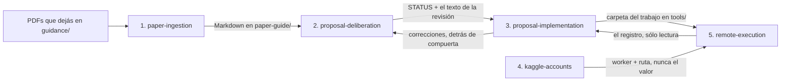
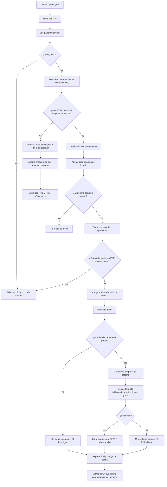
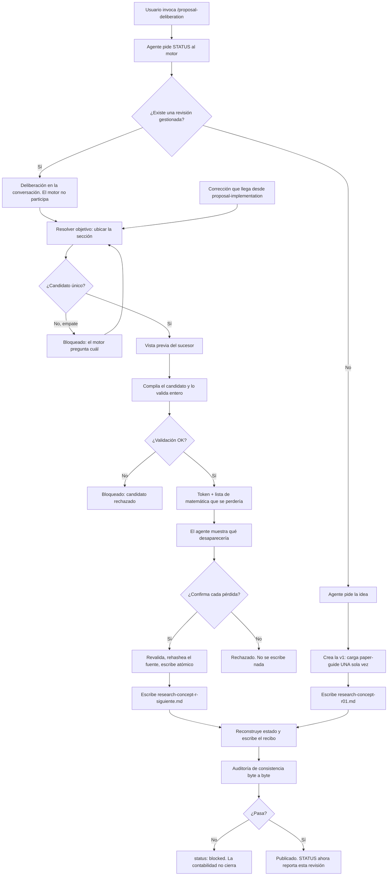
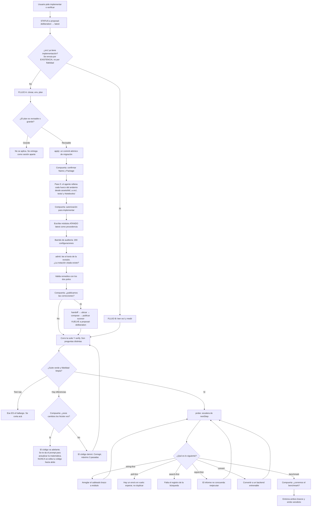
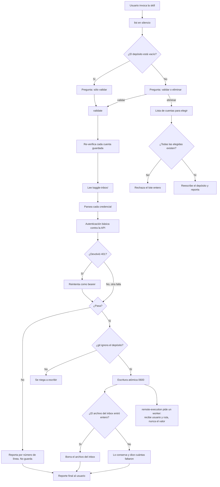
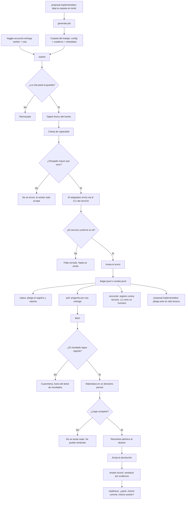

# papersmith-ai

Una forja de papers: ingiere PDFs de referencia a Markdown de alta fidelidad y
legible por un agente (ecuaciones en LaTeX, tablas en Markdown, figuras como
archivos) y luego delibera sobre propuestas de papers matemáticos. La ingesta
corre **localmente** con [Marker](https://github.com/datalab-to/marker).

---

## 1. Instalar las dependencias

Se necesitan tres cosas: **Python 3.10–3.13**, el binario **`llama-server`** (el
motor de OCR de la ingesta — no es un paquete de pip; es `llama.cpp`, **no
Ollama**) y los **paquetes de Python**.

> **La primera corrida descarga un modelo.** En la primera ingesta, Marker
> descarga desde Hugging Face los pesos de los modelos de Surya —OCR y layout,
> **~1.5 GB**— y los cachea en `~/.cache/huggingface`. No se descarga nada al
> instalar: el modelo llega en la primera corrida real y, de ahí en más, todo
> funciona offline. `llama.cpp` es el **motor**; los archivos `.gguf` de Surya
> son el **modelo** que ese motor ejecuta. Surya detecta `llama-server` en el
> `PATH` automáticamente; no hay que apuntar a ningún modelo a mano.

### `llama-server` (motor de OCR, requerido)

| SO | Cómo |
|----|------|
| macOS | `brew install llama.cpp` |
| Windows | Descargar un build `llama-*-bin-win-*.zip` de <https://github.com/ggml-org/llama.cpp/releases>, extraerlo y agregar la carpeta (con `llama-server.exe`) al `PATH`. `winget`/`scoop` también pueden tenerlo. |
| Linux | `brew install llama.cpp`, el paquete de la distribución, o un build de release. |

Si no está en el `PATH`, definir `LLAMA_CPP_BINARY` con la ruta completa al
binario. Verificar con `llama-server --version` (macOS/Linux) o
`where llama-server` (Windows).

### Python 3.12

macOS: `brew install python@3.12`. Windows: instalar desde
<https://www.python.org/downloads/> (marcar "Add to PATH").

## 2. Crear los entornos

Son **dos**, y hacen cosas distintas. Confundirlos es el error caro: instalar
todo en uno solo mezcla el stack de ML de la ingesta con el intérprete que la
forja usa para verificar repos destino, que es exactamente lo que
`require_non_forge_interpreter()` existe para impedir.

| Entorno | Qué corre | Manifiesto |
|---------|-----------|------------|
| `node_modules/` | El motor de `proposal-deliberation` (TypeScript vía jiti) | `package.json` |
| `.venv/` (raíz) | Los CLI de `proposal-implementation`, `remote-execution`, `kaggle-accounts`, `skill-audit`, y la suite de tests en Python | `requirements.txt` |
| `.claude/skills/paper-ingestion/.venv/` | Solo Marker: el stack de OCR | `.claude/skills/paper-ingestion/requirements.txt` |

### 2.1 — La forja

```bash
npm install                      # jiti + typebox: el motor de deliberación
python3.12 -m venv .venv
.venv/bin/pip install -r requirements.txt
```

`requirements.txt` incluye `torch`, y eso sorprende hasta que se ve por qué: no
es la dependencia del benchmark —ese corre en el repo destino, bajo el
intérprete del destino— sino de la suite de tests de la forja, que ejecuta el
kit bajo ESTE intérprete a propósito para probar que el guard lo rechaza. Sin
`torch`, `benchmark.py` muere en su `import` de línea 35 antes de que el guard
llegue a hablar, y veinte tests reportan un módulo faltante donde debían
observar un rechazo.

### 2.2 — La ingesta

El motor de OCR vive en un entorno aislado para no tocar el Python del sistema.

**macOS / Linux:**

```bash
python3.12 -m venv .claude/skills/paper-ingestion/.venv
source .claude/skills/paper-ingestion/.venv/bin/activate
pip install -r .claude/skills/paper-ingestion/requirements.txt
```

**Windows (PowerShell):**

```powershell
py -3.12 -m venv .claude\skills\paper-ingestion\.venv
.claude\skills\paper-ingestion\.venv\Scripts\Activate.ps1
pip install -r .claude\skills\paper-ingestion\requirements.txt
```

El entorno solo necesita existir: la skill lo usa internamente, no hace falta
activarlo a mano. (Recordatorio: la primera ingesta descarga los modelos de
Surya, ~1.5 GB, cacheados a partir de ahí.)

> Sin `.env` ni claves de API. La ingesta es completamente local y keyless.

---

## Cómo funciona — el orden

### Paso 1 — Colocar cada PDF en la carpeta según su rol

| Carpeta | Qué va acá |
|---------|------------|
| `guidance/paper-guide/` | **Papers guía** — las referencias metodológicas / de estilo. `proposal-deliberation` las carga como contexto al inicio de cada deliberación. |
| `guidance/reference-papers/` | **Corpus de referencia** — papers de apoyo, ingeridos a Markdown para consulta. No se cargan automáticamente en la deliberación. |
| `guidance/data/` (paper del dataset) | **⏳ Pendiente — todavía no conectado.** El paper que describe la base de datos de la investigación. Planeado; dejar para más adelante. |

### Paso 2 — Ingerir los PDFs (PDF → Markdown)

En **Claude Code**, invocar la skill:

```
/paper-ingestion
```

(o simplemente pedir: *"ingerí los papers"*). Por cada PDF **suelto**, crea una
carpeta con el nombre del paper, mueve el PDF adentro y escribe un `<nombre>.md`
liviano (texto + LaTeX + tablas, con la bibliografía quitada) junto con las
imágenes de las figuras:

```
guidance/reference-papers/computers-13-00176-v2-1/
├── computers-13-00176-v2-1.pdf
├── computers-13-00176-v2-1.md
└── _page_4_Figure_2.jpeg   (figuras que el .md referencia)
```

Un **PDF suelto** (directamente en una carpeta raíz) está pendiente; un paper
que ya está dentro de su carpeta se saltea. Para re-ingerir, borrar la carpeta
del paper (dejando el PDF suelto) y volver a ejecutar la skill. La configuración
vive en `papersmith.yaml` (`source_roots`, `mode`, `strip_references`).

### Paso 3 — Deliberar sobre una propuesta (`proposal-deliberation`)

En **Claude Code**, invocar la skill:

```
/proposal-deliberation
```

En el primer turno carga automáticamente los Markdown de `guidance/paper-guide/`
como contexto y actúa como tutor matemático. Desde ahí se puede:

- describir una idea y pedir una primera versión,
- pedir ediciones a una propuesta gestionada,
- ejecutar el ciclo de vida de revisiones gestionadas.

Las propuestas viven en `proposals/`, una por revisión gestionada
(`research-concept-rNN.md`).

### Paso 4 — Llevar la propuesta a código (`proposal-implementation`)

En **Claude Code**, invocar la skill:

```
/proposal-implementation
```

Toma la revisión vigente y la materializa en un repositorio destino, que vive en
`implementations/` con su propio git y su propio entorno virtual. El flujo tiene
dos fases separadas:

1. **Estructura.** Si el repo trae contenido, lo lleva al layout y verifica
   —sin ejecutar nada— que cuadernos, rutas y referencias sigan resolviendo. No
   audita ni valida el código que ya estaba: es lo que hay, ordenado.
2. **Materialización.** Recién entonces implementa la matemática y la somete a
   la escalera de validación.

```
<repo>/
├── <Name>/            Notebooks/  Data/  Results/  Models/
├── src/<Package>/     una implementación por objeto matemático
├── tests/             smoke · invariantes · sintéticos · auditoría · remedios
└── pyproject.toml
```

La escalera tiene cinco niveles, del más barato al más caro: **smoke**,
**invariantes** (cada afirmación de la propuesta anclada a un test),
**sintéticos** (deterministas, semilla fija), **auditoría** (hallazgos sobre la
matemática, medidos sobre 200 configuraciones aleatorias) y **remedios** (cada
corrección propuesta validada con el mismo rigor). Un hallazgo sin remedio
validado no se reporta.

Eso es todo lo que hace falta para usar la forja. Si querés entender **qué pasa
adentro** de cada skill —sus pasos, sus piezas, cómo se conectan entre sí y qué
limitaciones tiene cada una— seguí en [Anatomía de cada
skill](#anatomía-de-cada-skill). Y para el contrato literal, el `SKILL.md` de cada
una.

---

## Anatomía de cada skill

Las secciones de arriba cuentan **qué hacés**. Esta cuenta **qué pasa adentro**.
Está escrita para alguien que nunca vio el proyecto: cada skill se explica desde
cero y **entera** —sus pasos, sus piezas, sus conexiones con las demás, sus
limitaciones conocidas y su diagrama— sin mandarte a otra parte del documento.

Antes de entrar, dos cosas.

**Qué es una skill acá**, porque no es un programa que corrés y se acabó. Cada una
tiene dos mitades que hacen cosas distintas:

| Mitad | Qué es | Quién la ejecuta |
|-------|--------|------------------|
| `SKILL.md` | Un contrato en prosa: cuándo activarse, qué preguntar, qué no hacer nunca. No es código: es la instrucción de conducta. | **El agente** lo lee y se comporta según eso. |
| El motor (`scripts/`, `engine/`) | Código determinista: mismas entradas, misma salida. Sin modelo, sin red, sin claves. | **La máquina** lo ejecuta y devuelve un veredicto que el agente no puede negociar. |

Esa división es la idea central de toda la forja: **el agente decide, el motor
verifica**. El agente propone un cambio; el motor comprueba que ese cambio no
rompió nada y, si lo rompió, se niega. Un agente puede equivocarse. Un motor
determinista no cambia de opinión.

**Y cómo se encadenan.** Las cinco no son islas: cada una recibe algo concreto de
otra y le entrega algo concreto a la siguiente. Este es el mapa; cada skill explica
su propia costura en detalle, en su apartado.



El lazo entre la 2 y la 3 es el corazón de la forja, y va en los dos sentidos: la
matemática baja a código, y lo que el código descubre sube de vuelta al documento.

---

### 1. `paper-ingestion` — de PDF a Markdown

**Para qué está.** Los papers llegan como PDF, y un PDF es, para un agente, una
caja cerrada: el texto está mezclado con la maquetación, las ecuaciones son dibujos
y las tablas son líneas sueltas. Esta skill convierte cada PDF en Markdown limpio
—ecuaciones en LaTeX, tablas en Markdown, figuras como archivos de imagen aparte—
para que el resto de la forja pueda **leer** el paper en vez de intentar
descifrarlo. Todo corre localmente: sin claves, sin servicio externo.

**De dónde recibe y a quién le entrega.** Es el principio de la cadena: lo único que
recibe son los PDFs que vos dejás en `guidance/`. Lo que entrega tiene una
consecuencia que conviene entender antes de usarla:

- `guidance/paper-guide/` — lo que cae acá es lo que `proposal-deliberation` carga
  **automáticamente**, desde la constante `GUIDE_DIRECTORY = "guidance/paper-guide"`
  de su motor. Pero lo carga **una sola vez en toda la vida de la propuesta**: en la
  creación de la v1, y nunca más.
- `guidance/reference-papers/` — corpus de consulta. **Nunca se carga solo.** Está
  ahí para que vos o el agente lo lean cuando haga falta.

> **El orden importa, y esto no es obvio.** Si ingerís un paper guía **después** de
> haber creado la v1 de la propuesta, ese paper ya no entra por esa vía: la carga es
> irrepetible por diseño. Ingerí primero, deliberá después.

**Qué necesita antes.** Una única preparación por máquina: correr
`./.claude/skills/paper-ingestion/setup.sh`. Es idempotente y hace dos cosas:
instala el binario `llama-server` (el motor de OCR; no es un paquete de pip) y crea
el entorno virtual con `marker-pdf` adentro. La primera ingesta real descarga los
modelos (~1,5 GB) y los cachea; de ahí en más funciona offline.

**El flujo, paso a paso.** El punto clave es que **son dos comandos, no uno**, y esa
división existe para que exista un momento de consentimiento.

*Fase 1 — Descubrir (gratis, no toca nada):*

1. El agente corre el script con `--list`. Esto lee `papersmith.yaml`, valida la
   configuración, descubre las carpetas fuente y busca PDFs sueltos. **No carga
   ningún modelo y no mueve ningún archivo**: el código corta antes.
2. Se imprime la lista: ruta relativa y cantidad de páginas de cada PDF.
3. Si hay PDFs tirados directamente en `guidance/` —fuera de toda carpeta temática—
   se reportan aparte, junto con los temas existentes como opciones.

*Fase 2 — Confirmar (obligatorio):*

4. El agente te pregunta **cuáles** ingerir, como selección múltiple. Esta regla vive
   en `SKILL.md`, no en el script: el script no tiene mecanismo de consentimiento. La
   división en dos comandos es lo que hace posible que exista el paso de aprobación.
5. Si no aprobás nada, se termina ahí. Nada se movió.

*Fase 3 — Ejecutar:*

6. El agente vuelve a correr el script con exactamente las rutas aprobadas. Cada ruta
   se valida **antes** de cargar el motor: que exista, que sea un `.pdf`, que siga
   suelta. Así un argumento mal escrito no cuesta una carga de modelo.
7. Se construye el conversor de Marker, explícitamente **sin servicio de LLM** — eso
   es lo que lo mantiene local y keyless.
8. Por cada paper, la conversión es **transaccional**: se arma todo en un directorio
   temporal al lado del PDF, y sólo cuando el `.md` y las figuras están completos se
   crea la carpeta final, se mueven los archivos, y **el PDF se mueve último**. Hasta
   que eso pasa, el paper sigue suelto y reintentar es simplemente volver a correr.
9. Si un paper falla, se reporta y **el lote sigue** con los demás. Si falla a mitad,
   se borra la carpeta sólo si la creó esta corrida.

*Reingerir:* no hay bandera de "forzar" ni archivo de estado. La idempotencia es
puramente estructural: un PDF está *suelto* cuando el nombre de su carpeta padre no
coincide con su propio nombre. Una vez que vive en `<nombre>/<nombre>.pdf`, dejó de
estar suelto y nadie lo vuelve a tocar. **Para reingerir, borrás la carpeta del
paper** y el PDF vuelve a quedar suelto para la próxima corrida.

**Los módulos.**

| Archivo | Qué hace y por qué existe |
|---------|---------------------------|
| `SKILL.md` | El contrato de conducta: correr `--list` primero, pedir aprobación por paper, cómo tratar un PDF sin archivar. El script no dice nada de esto — sólo devuelve códigos de salida. |
| `setup.sh` | Provisión del entorno, idempotente: instala `llama-server` y arma el `.venv`. Existe porque el OCR necesita un binario de sistema que pip no puede instalar. |
| `requirements.txt` | Fija `marker-pdf==2.0.0`. Sin ese pin, una versión nueva podría cambiar la API del conversor y romper la extracción en silencio. |
| `scripts/extract_pdf.py` | El motor completo: validación de configuración, descubrimiento, listado, archivado, conversión transaccional, quitado de bibliografía, escritura de figuras, y el contrato de códigos de salida. |

Las funciones que importan, si vas a leer el código: `is_loose()` —el chequeo de
idempotencia entero, en una línea—, `discover_source_roots()`, `find_loose_pdfs()`,
`resolve_single_target()` (la validación previa a cargar el motor),
`build_converter()`, `ingest_loose()` (la transacción) y `file_into()` (el archivado
de un PDF sin tema).

**Qué escribe en el disco.**

```
guidance/reference-papers/<nombre>/
├── <nombre>.pdf              el PDF original, movido acá al final
├── <nombre>.md               texto + LaTeX + tablas, sin bibliografía
└── _page_4_Figure_2.jpeg     las figuras que el .md referencia
```

Claves que respeta de `papersmith.yaml`, bajo el bloque `paper_ingestion:`: `engine`
(sólo `marker`), `mode` (`fast` o `balanced`), `strip_references` (bool, por defecto
`true`), `source_base` (por defecto `guidance`) y `source_roots`.

**Los seguros.**

- **Nunca convierte sin que se haya preguntado.** Protocolo del `SKILL.md`,
  habilitado por la división en dos comandos.
- **Falla cerrado ante configuración inválida.** Un `papersmith.yaml` malformado sale
  con código 2 sin tocar nada — elegido por sobre reportar "no hay nada que hacer",
  que sería indistinguible de un caso sano.
- **Nunca fusiona con una carpeta existente.** Si ya hay contenido, se niega. El único
  camino a reingerir es borrarla, que es explícito y se ve destructivo a propósito.
- **Nunca adivina el tema de un PDF sin archivar.** Convertirlo donde está lo
  convertiría permanentemente en una "carpeta temática" propia.
- **Sólo revierte lo que creó.** Una carpeta que ya existía nunca se borra.

**Limitaciones conocidas y deuda.**

*Hay una definición de agente que describe un contrato que no existe.* No molesta
mientras se invoque la skill por su nombre, pero
`.claude/agents/paper-ingestion.md` describe una interfaz distinta de la real:
menciona `--output-dir`, `--force`, un manifiesto versionado y extracción de
evidencia con PyMuPDF. **Ninguna de esas cosas existe** en `scripts/extract_pdf.py`:
el script no tiene esas banderas, no escribe manifiesto y no usa PyMuPDF. Es una foto
de un diseño anterior o planeado. Mientras nadie despache contra esa definición, no
pasa nada; pero un orquestador que la tome como verdad va a fallar en la primera
invocación, y el error va a hablar de una bandera desconocida en vez de hablar de
documentación vieja. **Cómo se arregla:** o se actualiza esa definición al contrato
real —dos comandos, `--list` primero y rutas aprobadas después— o se borra. Lo que no
conviene es dejarla: una interfaz documentada que no existe es peor que ninguna.

**Diagrama.**



---

### 2. `proposal-deliberation` — discutir la matemática y publicar revisiones

**Para qué está.** Escribir una propuesta de paper matemático es un ida y vuelta
largo: se discute una idea, se corrige una ecuación, se reordena una sección. El
riesgo es que en ese ida y vuelta un modelo reescriba una ecuación "de paso", sin que
nadie lo note. Esta skill hace dos cosas a la vez: convierte al agente en tutor
matemático que discute con vos, y pone un motor determinista entre esa discusión y el
archivo, para que **nada cambie salvo lo que aprobaste**.

**De dónde recibe y a quién le entrega.**

*Recibe de `paper-ingestion`:* los Markdown de `guidance/paper-guide/`, y **sólo en
la creación de la v1**. El motor los carga él mismo en esa única operación; el agente
no se los pasa. Para cualquier revisión que ya existe, esa carga **no se repite** — el
`SKILL.md` lo dice sin matices: ese ingreso se gasta una sola vez, en la creación
verdadera de la v1.

*Recibe de `proposal-implementation`:* correcciones. Cuando la implementación
encuentra un defecto en la matemática y lo valida, vuelve acá a publicarlo. Pero
**entra por la puerta normal**, sin atajo: ubica la sección, arma el reemplazo, y pasa
por la misma vista previa, la misma puerta de integridad matemática y la misma
auditoría que cualquier otro cambio. Que la corrección venga de una medición no la
exime de nada.

*Le entrega a todo el resto:* dos cosas. El archivo publicado
(`proposals/research-concept-rNN.md`) y —tanto o más importante— la operación
`STATUS`, que es de dónde **toda la forja** saca la respuesta a "cuál es la revisión
vigente". Nadie mira el directorio a ojo. Esa es una regla dura, y existe porque el
listado del directorio puede mostrar archivos que el motor considera inválidos.

**Qué necesita antes.** Nada más que Node. No usa claves de API ni llama a ningún
modelo: el motor es keyless. El "modelo" de esta skill es el agente que ya está en la
conversación — por eso el motor no necesita uno propio.

**El flujo, paso a paso.**

1. **Arranque.** Lo primero que hace el agente es pedirle al motor `STATUS` —una
   operación de sólo lectura— para saber cuál es la revisión vigente. No abre
   `proposals/` por su cuenta.
2. **Bifurcación.** Si no hay ninguna revisión gestionada, el camino es *crear la v1*.
   Si ya hay una (`r01`, `r05`, `r17`…), el camino es *editar*.
3. **Crear la v1.** El agente te pide la idea y manda la creación inicial. El motor
   carga los papers de `guidance/paper-guide/` **una sola vez** —acá y nunca más—,
   redacta el documento a partir de tu idea, toma un candado único de proyecto (para
   que dos ideas en paralelo no puedan crear dos v1) y escribe
   `proposals/research-concept-r01.md`. La v1 se publica directo: no hay nada previo
   que proteger.
4. **Deliberar.** Con una revisión ya existente, la discusión pasa **en la
   conversación**, no en el motor. El agente propone, refuta, exige necesidad
   matemática antes de formalizar. El motor no se entera de nada de esto, y así debe
   ser: el estado de la charla vive donde vos podés verlo.
5. **Ubicar el cambio.** Cuando algo queda aprobado hay que decirle al motor *dónde*
   aplica. Se lo nombra con palabras del encabezado, y el motor las puntúa contra la
   estructura real del documento. Si los dos mejores candidatos quedan demasiado
   cerca, **se bloquea y pregunta** en vez de elegir. Nunca adivina.
6. **Vista previa.** El agente arma la decisión concreta —`replace`, `insert`,
   `delete`, `move` o `copy`— y pide el sucesor. Acá el motor **no publica**: compila
   el documento candidato pegando los bytes aprobados en el offset exacto, lo revalida
   entero, y devuelve un token de un solo uso junto con —lo importante— la lista de
   **qué matemática desaparecería**.
7. **La puerta.** El agente te muestra en castellano llano cada ecuación, cada `\tag`
   y cada cita `(Ec. N)` que se perdería. Vos confirmás. Recién ahí se reenvía la
   misma operación con el token y con cada pérdida reconocida por nombre. Si falta una
   sola, se rechaza y no se escribe nada.
8. **Publicar.** El motor vuelve a leer el archivo fuente, verifica que su hash no
   cambió desde el paso 6, aplica los parches, valida el resultado, verifica el fuente
   **una segunda vez** justo antes de escribir, y recién entonces escribe
   `research-concept-r<N+1>.md` de forma atómica.
9. **Contabilidad.** Reconstruye los índices derivados y escribe un **recibo** con el
   sha256 del documento antes y después.
10. **Auditoría.** Después de cada publicación se releen *todas* las revisiones y se
    comprueba que cada archivo siga coincidiendo byte a byte con su recibo. Si algo no
    cuadra, el resultado se degrada a `blocked` aunque los bytes ya estén escritos — y
    eso es a propósito: el trabajo no está terminado hasta que la contabilidad cierra.

Además existe un **ciclo de vida de revisiones**: retirar una revisión la copia a una
cuarentena inmutable, mueve los artefactos públicos, marca la operación como pendiente
de auditoría y sólo la confirma si la auditoría pasa; restaurar es el espejo exacto.
La `r01` no se puede retirar nunca, ni tampoco una revisión que tenga descendientes.

**Los módulos.** El motor son unos 50 archivos TypeScript. Agrupados por trabajo:

| Grupo | Archivos | Qué hace y por qué existe |
|-------|----------|---------------------------|
| Puerta de entrada | `engine/cli.mjs` | El único punto de acceso al motor. Atiende `STATUS` y la resolución de objetivo él mismo, y despacha el resto. Se levanta una vez por deliberación para no pagar el arranque en cada llamada. |
| Enrutador público | `proposal-workspace.ts` | Registra la herramienta que el agente llama y decide a qué etapa va cada pedido. Contiene además las primitivas de escritura segura en disco. |
| Coordinador | `orchestrator.ts` | La máquina de estados: resuelve, previsualiza, acepta y publica. Su `publish()` es el **único** lugar del sistema por donde puede pasar una escritura. |
| Ubicación | `target-resolver.ts`, `ambiguity-gate.ts`, `document-index.ts` | Convierten "la sección de normalización" en un rango de bytes exacto. `ambiguity-gate` es el que se niega cuando hay empate. |
| Aplicación de bytes | `patch-compiler.ts`, `successor-composite-engine.ts`, `ambient-supplied-planner.ts` | Pegan el texto aprobado en el offset exacto y verifican, por separado, que todo lo que quedó afuera del cambio siga idéntico. |
| Integridad matemática | `math-integrity.ts` | Enumera ecuaciones, `\tag`, macros y citas antes y después. Reporta lo perdido, y **bloquea por su cuenta** ante violaciones de forma canónica: `$$` desbalanceado, delimitadores `\(...\)`, un símbolo Unicode de matemática metido adentro de un `$...$`. |
| Validación del candidato | `candidate-validator.ts` | Re-parsea el documento entero resultante: Markdown bien formado, etiquetas únicas, referencias que resuelven, símbolos sin conflicto, bytes de afuera intactos. |
| Auditoría | `consistency-audit.ts`, `self-audit.ts` | Recalculan el sha256 de cada revisión y lo cruzan contra su manifiesto y su recibo. De acá salen `RECEIPT_SHA_MISMATCH`, `ORPHAN_STATE` y compañía. |
| Recibos y estado | `revision-receipt.ts`, `derived-state-store.ts`, `derived-state-builder.ts` | Escriben y releen la contabilidad: qué se publicó, desde qué, con qué hash. |
| Ciclo de vida | `revision-lifecycle-store.ts`, `revision-lifecycle-transaction.ts` | Retiro y restauración transaccionales, con reversión en orden inverso si algo falla a mitad. |
| Concurrencia | `mutation-lock.ts` | Impide dos publicaciones simultáneas sobre el mismo archivo. |
| Token de aceptación | `successor-acceptance-registry.ts` | Ata una vista previa a su aceptación. Vive en memoria, es de un solo uso y muere con el proceso: no se puede aceptar mañana una previa de hoy. |

**Qué escribe en el disco.**

```
proposals/research-concept-rNN.md           la revisión, con un marcador de artefacto al inicio
.proposal-deliberation/
├── state/research-concept-rNN.md.json      índices derivados + hashes
├── receipts/research-concept-rNN.md.json   el recibo: sha antes, sha después, qué parches
├── withdrawn/<uuid>/                       cuarentena inmutable de una revisión retirada
└── locks/initial-revision.lock             candado de creación de la v1
```

**Los seguros.**

- **Nada se pierde en silencio.** Una ecuación que desaparece exige que la reconozcas
  por nombre antes de publicar.
- **Se bloquea antes que adivinar.** Un objetivo ambiguo pregunta; no elige el más
  probable.
- **La auditoría es byte a byte.** Editar a mano una revisión publicada rompe su
  recibo, y el motor lo dice en la siguiente operación.
- **Sin claves.** Ninguna operación del motor sale a la red.
- **Falla cerrado.** Una operación desconocida se rechaza; no cae al camino por
  defecto.

**Limitaciones conocidas.** Nueve. Las cinco primeras son del motor de edición, y cada
una dice qué pasa, qué podés hacer igual, qué no, y cómo se arreglaría. Las cuatro
últimas son sobre el alcance de las garantías: qué es lo que esta skill, medida, no
puede afirmar.

*La consulta que ubica un cambio es sensible a cómo la escribís.* Para aplicar un
cambio hay que decirle a qué sección apunta. Esa consulta se compara **por substring
contra la línea del encabezado**, y eso tiene dos filos. Las **tildes cuentan**:
`Normalizacion terminos adaptacion` no encuentra `## 5. Normalización de los términos
de adaptación`, aunque sea la misma frase. Solo molesta cuando la palabra acentuada es
justo la que distingue: si quedan otras palabras distintivas sin tilde, resuelve
igual. Y la consulta se **corta en el primer signo de puntuación**, así que `Sección
3. Formulación…` se reduce a `3` antes de buscar nada. **Qué podés hacer:** escribir
la consulta como **palabras distintivas del encabezado**, sin puntuación, sin el
número de sección, y con las tildes tal como están escritas. `Normalización términos
adaptación` funciona; la frase completa con puntuación, no. Las palabras vacías (`de`,
`los`, `la`) ya se filtran solas. **Cómo se arregla:** comparando sin tildes de los dos
lados, y quedándose con la consulta completa en vez de cortarla en la puntuación.

*Mover o copiar nombrando una sección puede quedar ambiguo.* En un `move` o un `copy`,
la sección se busca con un puntuador distinto al de las ediciones normales: ese mira el
**cuerpo entero** de cada entrada, no solo su encabezado. Como los párrafos de una
sección contienen las mismas palabras que su título, la sección y sus propios párrafos
empatan y la operación se bloquea pidiéndote que desambigües. **Qué podés hacer y qué
no:** se bloquea, no se equivoca — nunca vas a mover algo distinto de lo que pediste
sin enterarte. Para desambiguar, nombrá el bloque concreto que querés mover en vez de
la sección completa. **Cómo se arregla:** haciendo que `move`/`copy` puntúe la línea
del encabezado, igual que ya lo hacen las ediciones normales.

*Un cambio se aplica sobre la sección completa.* La unidad mínima que se puede apuntar
es una sección `##`. Para corregir una sola ecuación, la skill entrega la sección
entera reescrita. Nada dentro de esa sección está protegido byte a byte: la garantía de
bytes idénticos cubre lo que queda **fuera** del cambio. **Qué podés hacer y qué no:**
lo que sí protege lo de adentro es la puerta de integridad matemática — antes de
publicar, la skill te lista cada ecuación, cada símbolo, cada `\tag` y cada cita `(Ec.
N)` que existía antes y ya no está, y **no publica** hasta que esa desaparición se
reconozca explícitamente. Una ecuación no se puede perder en silencio; sí puede cambiar
prosa alrededor sin que nadie lo señale. **Cómo se arregla:** con loci más finos —
poder apuntar a un párrafo o a una ecuación concreta, no solo a la sección que la
contiene.

*Mover contenido al lugar equivocado no lo detecta nadie.* La puerta de integridad
matemática compara qué había antes y qué hay después. Un `move` que se lleva el bloque
equivocado **no pierde** matemática: la reubica intacta. Como no falta nada, la puerta
no tiene nada que objetar. **Qué podés hacer y qué no:** el riesgo real bajó bastante
—hoy una consulta ambigua se bloquea en vez de resolver a lo que no era— pero aun así,
revisá el resultado de un `move` antes de seguir construyendo encima. **Cómo se
arregla:** comparando también **dónde** está cada bloque, no solo si sigue existiendo.

*Editar una revisión publicada a mano rompe la auditoría.* Abrís
`proposals/research-concept-r14.md` en el editor, corregís una palabra, guardás. La
próxima operación de la skill reporta `auditStatus: FAIL` y no te deja seguir. **Por
qué:** cada publicación deja un recibo en `.proposal-deliberation/receipts/` con el
sha256 del documento. Antes de cualquier operación, la auditoría relee el archivo, lo
vuelve a hashear y exige que sea byte-idéntico a lo que el motor publicó
(`consistency-audit.ts`, `RECEIPT_SHA_MISMATCH`). Una palabra distinta cambia el hash y
el recibo deja de respaldar nada. **No es un defecto: es la garantía funcionando.** Sin
recibos el motor no puede afirmar que una revisión sea lo que dice ser, y el linaje
byte-exacto se queda sin respaldo. Sacarlos no es una opción. **Qué podés hacer:** hoy,
o revertís la edición manual hasta que el archivo vuelva a coincidir, o reconciliás el
recibo a mano. Lo segundo es delicado y conviene evitarlo: un recibo actualizado sin
cuidado deja al linaje afirmando algo que nadie comprobó. **Cómo se arregla:** con una
operación de re-base autorizada —algo como `ADOPT_MANUAL_EDIT`: *"edité esta revisión a
propósito, adoptá los bytes actuales como nueva línea base"*— que actualice el recibo
tras confirmación explícita. Con eso, editar a mano dejaría de ser una ruptura y
pasaría a ser un acto declarado.

*Ninguna edición a mano está impedida; en el mejor caso se detecta después.* No hay en
la forja ninguna barrera que frene a alguien —o a un agente— que abra un archivo
gestionado y lo escriba por afuera del motor. `.claude/settings.json` tiene **un solo**
hook `PreToolUse` (`refuse_offpath_push.py`, con matcher `Bash`, y es de
`remote-execution`, no de esta skill), y su clave `permissions` **no tiene ninguna
entrada `deny`**. **Qué significa para vos:** todo lo que esta skill opone a una edición
manual llega después del hecho — la auditoría del punto anterior te avisa en la
operación siguiente, con los bytes ya escritos. **Qué no cubre:** el momento de la
escritura, ni nada de lo que pase entre esa escritura y la próxima vez que alguien
invoque el motor. **Cómo se arregla:** con una regla `deny` sobre `proposals/` y sobre
`.proposal-deliberation/`, para que la escritura por afuera del motor no llegue a
ocurrir.

*El índice persistido es un caché que se cura solo, no un guardia.* Es tentador leer
`.proposal-deliberation/state/<archivo>.json` —un manifiesto con el `documentSha256` del
documento entero y, por cada entrada de la estructura, su propio `textSha256` sobre un
rango de bytes— como una defensa contra una edición manual. **No lo es.**
`loadDocumentState` reconstruye **siempre** el estado a partir de los bytes que hay en
el disco, y sólo usa el guardado si valida contra ese mismo documento; si no valida —que
es exactamente lo que pasa después de una edición a mano— lo **sobrescribe en silencio**
con la reconstrucción fresca. Ningún error, ningún reporte, nada que llegue a quien
llamó. **Qué significa para vos:** el estado guardado no contradice una edición manual;
se acomoda a ella. **Qué no cubre:** `consistency-audit.ts` tiene un
`MANIFEST_SHA_MISMATCH`, pero no hay ninguna operación que puedas invocar para
preguntarlo, y para cuando la auditoría corre el caché ya se curó. Lo que de verdad nota
una edición a mano es el **recibo** —la limitación de más arriba—, no el índice. **Qué
lo contiene:** la skill de al lado. El bloque de posición de `proposal-implementation`
guarda el `sha256` de la revisión contra la que se derivó, así que cambiarle los bytes a
una propuesta levanta `POSITION_STALE` en `gate` y en `close` —comprobado por
ejecución—. El motor de deliberación no lo detecta; la implementación sí. **Cómo se
arregla:** haciendo que el caché, cuando no valida, lo diga antes de curarse.

*El estado no sobrevive a un clon.* `.proposal-deliberation/` es una entrada de
`.gitignore` (línea 40), así que nada de lo que hay adentro —ni los índices, ni los
recibos, ni la cuarentena— viaja en un clon nuevo. **Qué significa para vos:** un clon
fresco arranca sin contabilidad y la reconstruye a partir de los bytes que encuentra en
`proposals/`, aceptándolos tal como están. Si esos bytes venían editados a mano, el clon
no tiene contra qué notarlo: para él ese es el documento, y la auditoría cierra. **Qué
no cubre:** la verificación byte a byte es una propiedad **de la máquina donde se
publicó**, no del repositorio. Un linaje verificado acá no llega verificado allá. **Cómo
se arregla:** no está decidido. Habría que separar qué mitad de esa contabilidad es
historia del proyecto y cuál es estado de máquina, y versionar sólo la primera. Por
ahora está anotado, no resuelto.

*Nada prueba quién decidió.* El motor deja constancia de lo que se publicó, contra qué
base y con qué hash. Lo que no deja —ni puede dejar— es constancia de que la
confirmación de la puerta la haya dado una persona: el token de aceptación es de un solo
uso y ata una vista previa a su aprobación, pero lo consume quien llame al motor, y el
agente que armó la vista previa puede llamarlo. **Qué significa para vos:** una decisión
registrada prueba que llegó al registro, nunca que alguien la tomó. Un agente puede
abrir la pregunta y contestársela solo, y nadie más adelante en la cadena puede
distinguir ese caso del otro. **Qué no cubre:** cualquier lectura del registro como
"esto fue aprobado". Lo que dice es "esto quedó registrado". **Cómo se arregla:** no con
más registro. Haría falta que la confirmación entre por un canal que el motor no pueda
originar, y hoy no existe.

**Deuda de mantenimiento.** No limita a quien usa la skill; limita a quien la
modifique. *El nombre del directorio de estado está repetido.* La carpeta
`.proposal-deliberation/` guarda la contabilidad —`receipts/` y `state/`— en la raíz
del repositorio, y su nombre está escrito como texto literal en **21 puntos repartidos
en 7 archivos** del motor (`consistency-audit.ts` sola tiene 7). Los 21 dicen lo mismo,
así que la carpeta siempre se encuentra. **Qué sí funciona:** dos propuestas distintas
conviven sin problema, porque tanto los recibos como el estado se guardan en **un
archivo por revisión, nombrado con el archivo de la propuesta**
(`state/research-concept-r01.md.json`). Nombres distintos, archivos distintos, cero
colisión. **Qué no se puede:** tener el **mismo documento bajo dos deliberaciones
independientes** —dos estados aislados sobre los mismos archivos, para explorar dos
caminos en paralelo— ni mover el estado fuera de la raíz del repositorio. Las dos cosas
necesitan que la ubicación sea configurable, y hoy no lo es. **Y el modo de fallar es
feo:** si alguien renombra la carpeta y se olvida de uno de los 21 lugares, no falla
nada — la mitad de la contabilidad queda escribiéndose en la carpeta vieja, en
silencio, hasta que alguien nota que faltan recibos. **Cómo se arregla:** con un único
`stateRoot(root)` del que salgan los 21. Es un refactor chico y desbloquea las dos
cosas de arriba.

**Diagrama.**



---

### 3. `proposal-implementation` — de la matemática al código que se prueba solo

**Para qué está.** Una propuesta publicada es un documento. Esta skill la convierte en
un repositorio Python que funciona, y después **demuestra mecánicamente** —no por
afirmación— que ese código es fiel a la matemática: que corre, que sus invariantes se
cumplen, que los defectos que reporta son reales, que las correcciones que propone
están validadas, y que sus informes dicen lo que los números dicen.

#### La conexión con `proposal-deliberation`

Es la costura más importante de la forja, va en los dos sentidos, y **se comporta
distinto en cada uno de los dos flujos**. Vale la pena verla entera antes que nada.

**De deliberación hacia acá, tres cosas distintas entran:**

1. **Cuál es la revisión vigente.** Paso 1 de **los dos** flujos, sin excepción:
   `node .claude/skills/proposal-deliberation/cli.mjs '{ "operation": "STATUS" }'`
   → se toma `latest`. La skill **nunca adivina la base y nunca mira `proposals/` a
   ojo**.
2. **El texto de la revisión.** El motor sí lee el archivo: `revision_source()` lo
   levanta del directorio de propuestas. Lo usa para juzgar **admisibilidad**: cada
   hallazgo declara qué notación *usa* —que tiene que aparecer textualmente en la
   revisión— y qué notación *introduce*. Una corrección que cita una ecuación que no
   existe, o que se apoya en notación que el documento nunca definió, no es un defecto
   a validar con un barrido: es una decisión que le pertenece a la deliberación, y la
   skill tiene prohibido reportarla como resuelta. (La ruta es configurable por entorno
   con `IMPLEMENTATION_PROPOSALS`, y la razón está escrita en el código: *una forja de
   papers no puede tener su suite de tests atada a la investigación de alguien*.)
3. **El sello de procedencia.** Cada módulo escrito declara contra qué revisión se
   escribió, y ese string tiene que ser igual a `latest`. Ese sello es lo que hace que
   la deriva sea **medible** en vez de opinable.

**De acá hacia deliberación, una sola vía, y con compuerta:** cuando la auditoría
encuentra un defecto real en la matemática y lo valida, la corrección vuelve al
documento. Detrás de una autorización explícita, esta sesión **maneja el motor de
deliberación**: `handoff` dimensiona cada hallazgo, se ubica la entrada, `compose` arma
el texto de reemplazo empatando por el `\tag{n}` de la ecuación, y se publica el
sucesor. Está detrás de compuerta porque **publicar avanza tu linaje real**. Y no hay
atajo: la corrección entra por la misma vista previa, la misma puerta de integridad
matemática y la misma auditoría que cualquier otro cambio.

**Y ahora lo que distingue a los dos flujos.** La skill enruta por **existencia, no por
fidelidad**: mira si `src/` tiene una implementación, y nada más. Eso es deliberado —
preguntar por fidelidad acá mandaría un repositorio atado a `r14`, con `latest` en
`r16`, a una primera pasada completa, reimplementando desde cero algo que sólo necesita
ponerse al día. **La deriva es el cuarto paso del flujo B, no una razón para empezar de
nuevo.**

| | **Flujo A — primera pasada** | **Flujo B — toda pasada posterior** |
|---|---|---|
| Cuándo | `src/` no tiene implementación | `src/` ya tiene una, atada a la revisión que sea |
| Qué hace con `latest` | **Ata**: se estampa como procedencia en cada módulo que se escribe | **Mide**: `verify` cruza lo declarado contra lo vigente y reporta la distancia |
| La vuelta a deliberación | Paso 14, detrás de compuerta: se publican las correcciones que salieron de la auditoría | Paso 5, si hay diferencias, y primero pregunta de quién son |
| Cómo termina | Paso 16: si es fiel, **no para** — sigue en el paso 3 del flujo B | En `probe`, que dice qué es lo siguiente |

Ese último renglón importa: **el flujo A desemboca en el flujo B**. Terminar en A haría
que la respuesta dependa de cómo llegaste en vez de qué hay en el repositorio.

**Y la compuerta más importante de toda la skill está en el flujo B**, cuando la
fidelidad no da: se te pregunta **si esos cambios los hiciste vos**.

- **Los hiciste vos** → el código va *adelante* de la propuesta. Se te recuerda
  actualizar la matemática y se te entrega el prompt que lo hace. **Nunca se edita tu
  código para que coincida con una propuesta vieja.**
- **No los hiciste vos** → el código derivó. Se corrige y se revalida, con un tope de
  tres pasadas.

Con un matiz fino que evita trabajo inventado: el reporte de deriva cruza qué secciones
cambiaron de verdad con qué secciones declara cada módulo. Un módulo atado a una
revisión vieja **cuyas propias secciones nunca se movieron** necesita **re-atarse, no
reescribirse** — contabilidad, no matemática. Decir "nueve módulos están viejos" cuando
cambió una ecuación informa que hay trabajo y nada sobre dónde.

#### La conexión con `remote-execution`

Mucho más angosta y de una sola dirección: **sólo lectura**. La skill importa por ruta
exactamente dos módulos —el registro y la puerta de entrada— y **nunca** el adaptador
ni nada bajo `adapters/`, que es el único lugar de aquella skill que nombra un
servicio. Con eso pliega el registro y reporta qué se mandó, qué volvió y qué quedó en
cuarentena. **Nunca envía, nunca reconcilia**: reconciliar es territorio de un humano
corriendo el comando de aquella skill, jamás de `verify`. Y nunca nombra un worker: sólo
reporta un conteo. De ese pliegue sale el peldaño `poll-first`.

**Qué necesita antes.** Una revisión publicada, y un repositorio destino bajo
`implementations/` que ya sea un repositorio git.

**Los comandos.** Nueve, todos con la misma forma:
`python3 .../implementation_cli.py <comando> --target implementations/<repo> [--name <Name>] [--revision research-concept-rNN.md]`.

| Comando | Qué hace |
|---------|----------|
| `env` | Crea y verifica el entorno virtual **del repositorio destino** (se niega si lo corrés desde un intérprete de la forja). Reporta también el estado de los punteros de Git LFS — acá, porque es el primer comando después de un clon, justo cuando un repositorio lleno de marcadores parece completo. |
| `name` | Función pura, sin repositorio. Normaliza lo que escribiste a la forma de carpeta `<Name>/` y a la forma importable `src/<Package>/`. |
| `plan` | Plan de migración de **sólo lectura**: qué se renombra, qué se mueve, qué directorios faltan, qué referencias hay que reescribir, qué conflictos hay y qué archivos no sabe clasificar. Se niega sobre un árbol sucio. |
| `apply` | Ejecuta un plan **ya aprobado** como un único commit atómico. Revalida que el plan no haya quedado viejo; ante cualquier falla revierte duro y reporta. Nunca deja un árbol a medio migrar. |
| `admit` | Decide la **admisibilidad** de una corrección antes de medir si funciona: comprueba contra el texto de la revisión que la notación que cita exista de verdad. El veredicto se escribe en el destino; el texto de la propuesta se queda en la forja. |
| `handoff` | Mide cuánto alcance tiene cada hallazgo dentro del documento y decide si se puede resolver en el momento o si merece su propia sesión de deliberación. |
| `compose` | Arma el texto de reemplazo para llevar una corrección de vuelta a la propuesta, empatando por el `\tag{n}` de la ecuación. |
| `probe` | Informe de sólo lectura de qué falta para poder correr el benchmark. Acá vive la escalera de `nextStep`. |
| `verify` | El gran lector estático: cumplimiento del layout, fidelidad a la revisión, integridad del trabajo previo, acuerdos, prosa desactualizada, declaraciones de búsqueda, estado de la ejecución remota, contrato del informe, auditoría y escalera de validación. Todo en un solo JSON. |

**Las dos fases.** Están separadas a propósito:

1. **Estructura.** `plan` → `apply`: puramente mecánico. Renombres, creación de
   directorios, reescritura de referencias, un commit. **No toca la semántica del
   código.** Y si la reorganización necesita más decisiones de las que alguien puede
   leer de verdad, se niega a aplicarla directo y te la entrega como trabajo para una
   sesión aparte — porque una lista así de larga se aprueba sin leerla, y una
   aprobación sin lectura no es una aprobación. Lo que cuenta son las decisiones que
   vos leés, no los archivos arrastrados: renombrar una carpeta de doscientos archivos
   es **una** línea para leer y **un** comando para deshacer.
2. **Materialización.** Recién entonces se escribe la matemática, con aprobación
   humana en cada bisagra: el mapa de objeto a módulo, el nombre, y la autorización
   para implementar.

**La escalera de `nextStep`.** `probe` responde una sola pregunta: *¿qué es lo
siguiente?* Los peldaños base, en orden:

1. `nothing-to-compare` — no hay línea base. Y sin línea base el backend no es asunto
   de nadie: numpy es donde la matemática se prueba —sin autograd, sin dispositivo, sin
   optimizador que tape una fórmula equivocada— y para una propuesta que nadie va a
   entrenar, ahí es donde pertenece y donde puede quedarse. Es un estado legítimo, no
   un error.
2. `convert` — hay línea base pero la implementación calcula en numpy, o sea no es
   entrenable, o sea la comparación no puede ocurrir. Proponer el benchmark primero
   sería pedirte que apruebes una corrida que no puede pasar.
3. `piloted` — hay resultados, pero sólo a escala piloto. **Nunca se lee como
   "listo"**, y tampoco se te ofrece un menú de tres botones: el piloto existe
   justamente para que alguien mire, agregue un test, mueva una proporción y lo vuelva
   a correr corto.
4. `already-benchmarked` — hay un registro completo y vigente.
5. `benchmark` — el caso por defecto cuando todo lo demás está limpio.

Encima de eso se aplican cuatro bloqueos, y **el orden entre ellos está argumentado, no
es una preferencia**:

- `wiring-first` — un brazo declara matemática que nunca llama. Va primero porque
  cualquier número producido bajo un cableado roto está contestando la pregunta
  equivocada desde el arranque.
- `poll-first` — ya hay un envío afuera, en un worker remoto, sin nada terminal
  registrado. Existe para que no se mande un duplicado quemando cuota real por una
  pregunta que ya está en vuelo. Va *después* de `wiring-first` (esperar no arregla un
  cableado roto) y *antes* de `search-first` (el envío en vuelo puede ser justamente la
  búsqueda que ese peldaño te mandaría a repetir).
- `search-first` — la búsqueda declarada no tiene su registro en el disco: una corrida
  cuyo escalar de gobierno todavía no se eligió no tiene configuración con la cual
  arrancar.
- `report-first` — el informe no concuerda con la corrida. Va último porque es la falla
  más angosta —describe mal una corrida sana, se arregla con una frase— pero igual
  bloquea, porque una frase equivocada impresa con la autoridad de treinta repeticiones
  atrás es peor que ninguna frase.

**La escalera de validación, cinco niveles.** Del más barato al más caro, y ese orden
**es** el diseño: cada nivel falla más barato de diagnosticar que el siguiente, así que
la plata se gasta sólo cuando lo barato ya está limpio.

| Nivel | Qué prueba | Por qué está donde está |
|-------|------------|-------------------------|
| 1. Smoke | ¿Arranca? Sólo que el paquete importe y que cada módulo declare su procedencia. | No afirma nada matemático. Cuesta cero y agarra roturas de andamiaje antes de intentar nada serio. |
| 2. Invariantes | Un test por cada afirmación matemática de la propuesta, atado por nombre a la procedencia declarada del módulo. | Deterministas y baratos. `verify` cruza que toda invariante declarada tenga su test. |
| 3. Sintéticos | Deterministas, semilla fija, verdad conocida por construcción. La expectativa se escribe en el docstring **antes** de la afirmación. | Así un test que pasa no se puede confundir con una hipótesis ajustada después de ver el resultado. |
| 4. Auditoría | Que cada hallazgo declarado sea un defecto real: un barrido de **200 configuraciones** independientes por hallazgo, desplazadas por corrida para que dos corridas auditen configuraciones disjuntas. | El primer paso genuinamente caro. Sólo corre cuando ya se sabe que el código al menos importa y cumple lo que declara. |
| 5. Remedios | Cada corrección validada con el mismo rigor, y obligada a mostrar **los dos polos**: que el remedio cumple el criterio *y* que la formulación original no lo cumple. | Cerrado detrás de `admit`: nada caro se mide sobre un remedio inadmisible. Sin el polo de control, un test de remedio se estaría midiendo a sí mismo. |

Y hay una regla que `verify` no puede reemplazar: **correr la suite y verificar son dos
preguntas distintas**. `verify` *lee* —que cada módulo declare su revisión, que cada
invariante tenga test, que ninguna afirmación sea infalsificable, que el cuaderno se
haya ejecutado de verdad—; lo que no puede decirte es si alguno de esos tests **pasa**.
Saltear la corrida es exactamente cómo un repositorio llega a un benchmark con una
invariante rota: toda la procedencia intacta, todos los ids empatados, fidelidad limpia,
y una afirmación fallando abajo. Esa brecha es más ancha que nunca justo después de un
cambio de backend, que reescribe cómo se computa cada número dejando cada declaración
igual.

**Los módulos.**

| Archivo | Qué hace y por qué existe |
|---------|---------------------------|
| `scripts/implementation_cli.py` | El motor entero. Biblioteca estándar solamente, keyless, offline. **Nunca importa ni ejecuta el código del destino**: lee las declaraciones estáticamente con `ast`. |
| `scripts/materialize.py` | El andamiero **de la propia forja**, no un paso del Flujo A: el agente rellena los huecos leyendo el paso 5, y este script hace lo mismo para que la suite pueda examinar un destino recién andamiado. Copia el kit sustituyendo los marcadores, y sólo escribe las plantillas que ya se pueden escribir: las del paso 9 esperan al mapa de objetos. Acepta un kit alternativo, y la razón está escrita en su docstring: *una forja de papers no puede cargar con el contenido de un paper*. |
| `references/usage.md` | Invocaciones reales, copiables, de cada comando, con salidas de ejemplo y la tabla de códigos de rechazo. Existe para que el agente no invente banderas. |
| `assets/pyproject.template.toml` | El marcador de aislamiento. Sin su configuración de `pythonpath`, la suite del destino no puede importar su propio paquete offline. |
| `assets/requirements-dev.txt` | Lo que se instala en el `.venv` **del destino**, nunca en el de la forja. |
| `assets/kit/src/module.py` | Plantilla de un módulo: docstring, procedencia declarada (revisión, secciones, ecuaciones, invariantes) y un stub. La procedencia es lo que hace detectable la deriva contra la revisión. |
| `assets/kit/tests/*` | La escalera de cinco niveles completa, más sus fixtures compartidas y la compuerta de admisibilidad. Cada archivo que falte quita exactamente un peldaño. |
| `assets/kit/nb/benchmark.py` | Entrena las dos implementaciones bajo una misma reducción acotada. Se niega a correr bajo un intérprete ajeno —porque el tiempo de pared y la memoria pico **son** la medición— y se niega a correr sin cableado declarado. |
| `assets/kit/nb/verdict.py` | La lógica de juicio: sólo concede un ganador cuando las medias difieren más que el error estándar combinado, y por debajo de tres repeticiones **no da veredicto**, sólo imprime una estimación puntual. |
| `assets/kit/nb/report_digest.py` | Hashea todo `src/` en un sello que el informe imprime y que `verify` recalcula, para poder probar que un informe está atado al código exacto que lo produjo. |

**Qué escribe en el disco.**

```
implementations/<repo>/           git propio, .venv propio, ignorado por la forja
├── <Name>/                       Notebooks/  Data/  Results/  Models/
├── src/<Package>/                una implementación por objeto matemático, cada una con su procedencia
├── src/<Package>_Benchmark/      el arnés: declara qué ejercita, nunca declara procedencia
├── tests/                        la escalera de cinco niveles
├── tools/                        sólo si hace falta: opera corridas, no implementa ecuaciones
└── pyproject.toml
```

El paquete de benchmark declara contra qué revisión se construyó y qué secciones y
ecuaciones ejercita cada brazo. **No declara procedencia a propósito**: no implementa
ninguna ecuación, y estamparle una falsificaría justamente el chequeo que ata código a
matemática. Lo escribe el agente al cablear; lo leen `verify` y `probe`, siempre de
forma estática.

**Los seguros.**

- **Nunca ejecuta el código del destino** para inspeccionarlo. Todo se lee con `ast`.
- **Guardia de ruta.** El destino tiene que resolver dentro de `implementations/` y ya
  ser un repositorio git.
- **Nunca migra un árbol sucio.** Ni aplica un plan que quedó viejo.
- **Entorno aislado.** Se niega a construir el venv del destino desde un intérprete de
  la forja.
- **Un hallazgo sin remedio validado no se reporta.** Está impuesto estructuralmente: la
  auditoría queda `incomplete` mientras haya hallazgos sin remedio o sin test que lo
  valide.
- **Nunca escribe en `proposals/`.** Publicar es territorio exclusivo de
  `proposal-deliberation`, y sólo se llega ahí por la puerta descrita arriba.
- **Nunca nombra un worker remoto.** Sólo reporta un conteo.

**Limitaciones conocidas.**

*Los archivos bajo Git LFS llegan vacíos.* Clonás un repositorio que usa Git LFS y
parece completo: todas las rutas están, todos los archivos existen. Pero cada archivo
bajo LFS pesa unos cientos de bytes — es un marcador de texto, no el archivo. Lo primero
que lo abra como datos falla con un error sobre el **formato del archivo**, que no se
parece en nada a la causa real. **Por qué es a propósito:** el clon salta el filtro que
materializa esos archivos, y el salto queda fijado en la configuración local del clon.
Los marcadores alcanzan para reorganizar el repositorio y leer el código, y bajar
gigabytes sólo para moverlos de carpeta gasta una cuota de LFS que no vuelve. **Qué hace
la forja:** `env` te los reporta apenas termina el clon —el momento en que la ilusión es
más fuerte— y `verify` lo repite en cada pasada posterior, porque lo único peor que no
saberlo es olvidarlo. Cada marcador declara el tamaño del archivo real, así que el
reporte trae **un total, no una advertencia**. En este repositorio, por ejemplo: 18
marcadores, **5,09 GiB** si se bajaran. Nada del flujo los lee, ninguna prueba ni
cuaderno se escribe contra ellos, y **la descarga nunca se hace sola**: el comando se
imprime en vez de ejecutarse. **Ojo con el atajo que no existe:** bajarlos desde la
página de GitHub con el botón de descarga **cuesta exactamente lo mismo**. GitHub cuenta
todas las descargas contra el ancho de banda del dueño del repositorio, por cualquier
vía — el comando, el navegador, y hasta el zip del código fuente si contiene esos
objetos. La franquicia gratuita es de 1 GiB por mes. No hay ruta que la evite, y creer
que la hay es la forma más común de gastarse el mes sin querer. **Qué podés hacer antes
de gastarla:** mirá lo que `probe` reporta bajo `acquisition` — el material que el
repositorio se baja, clona o desempaqueta **por su cuenta** no cuesta cuota, y lo que
salió de un entrenamiento se vuelve a producir entrenando. La cuota se gasta sólo en lo
que de verdad no existe en ningún otro lado. **Qué no hace:** no puede impedir que un
cableado escrito a mano intente cargar uno —si pasa, el error habla del formato y el
reporte de `env` es donde está la razón— y no distingue un marcador de un archivo
genuinamente corrupto: los dos se leen como material ausente, que es la lectura
conservadora.

*Una corrida larga en esta máquina es invisible mientras corre.* `probe` sabe decir
que hay una submisión afuera cuya respuesta no volvió —es el peldaño `poll-first`— y lo
puede decir porque `remote-execution` mantiene un registro append-only que la forja lee.
Consultás en mitad de un envío, te lo dice, y te vas a hacer otra cosa. **Por qué en
local no pasa lo mismo:** una corrida en tu propia máquina deja lo que el repositorio
destino haya decidido dejar —un parcial, un checkpoint, un lock— con un nombre que sólo
ese repositorio conoce, y mirarlo obligaría a cablear el vocabulario de un paper dentro
de una herramienta que tiene que servir a todos. **Qué pasa entonces:** lanzás una
búsqueda o una campaña larga, consultás mientras corre, y `verify` lee que el registro
declarado no existe — reporta el trabajo como no empezado y `probe` te ofrece lanzarlo
otra vez. **Qué podés hacer mientras tanto:** mirar si el registro que tu declaración
nombra en `record` ya existe, o si al lado quedó un parcial; dos `ls` contestan la
pregunta. **Qué no hace:** no borra nada ni pisa la corrida en curso, y si el
repositorio destino sabe retomar desde su parcial el segundo lanzamiento salta lo ya
medido. Lo que falta no es la protección: es el aviso, que es justamente para lo que uno
consulta. **Qué necesitaría para cerrarse:** que el hecho sea **declarado y no
adivinado** —igual que hoy se declara dónde vive el registro— y que distinga *no hay
nada corriendo* de *este repositorio no lo declara*, porque un hecho cuyo valor vacío no
separa esos dos casos no sirve para gatillar nada. Es la misma razón por la que
`smokeReady` se reporta y nunca decide.

*`verify` compara nombres de revisión, no contenido.* El sello de procedencia que cada
módulo declara se contrasta contra la revisión vigente con una sola comparación:
`module["stale"] = bool(revision) and module["revision"] != revision`. Es una
comparación **de strings**, y el `__provenance__` del módulo no lleva ningún hash del
texto contra el que se escribió. **Qué significa para vos:** si una revisión se
reescribe **bajo su mismo nombre** —se corrige una ecuación y el archivo se sigue
llamando igual—, `verify` no ve nada: ningún módulo queda marcado como viejo y la pasada
sale limpia. La deriva recién aparece más tarde, en `gate` o en `close`, como
`POSITION_STALE` —"atada a una revisión cuyos bytes ya no coinciden"—, que sí compara
bytes. **Qué no cubre, y es lo importante:** un `verify` limpio **no significa que la
matemática se haya sostenido**. Significa que ningún módulo nombra una revisión distinta
de la vigente. **Cómo se arregla:** haciendo que el sello lleve también el hash del
contenido, para que la comparación sea contra los bytes y no contra la etiqueta.

*Un testigo prueba que el test existe, nunca que pasa.* Un acuerdo puede declarar qué
test lo respalda, con un token `test_<id>`. La CLI **no corre ninguna suite**: para
resolver ese token hace un recorrido `ast` sobre `tests/` y junta los nombres de las
funciones. Encontrar el nombre prueba que existe una función así, y nada más. **Qué
significa para vos:** un testigo bien formado cuyo test existe se reporta `unmeasured`,
y `unmeasured` es un estado **terminal** — lo único que puede sacarlo de ahí es que el
test desaparezca, y recién entonces, con el ítem tildado, pasa a `disagrees`. Cruzar un
testigo contra el resultado de una corrida no existe. **Qué no cubre:** un test que
existe y falla, o que existe y no prueba lo que dice. Los dos se leen igual que uno que
pasa. **Cómo se arregla:** con un cruce contra el resultado real de la suite, que hoy no
tiene por dónde entrar.

*Ninguna edición a mano está impedida, y acá ni siquiera se detecta.* Vale la misma
observación que en `proposal-deliberation` —un solo hook `PreToolUse`, que es de
`remote-execution`, y ninguna entrada `deny`—, pero la diferencia entre las dos skills
importa. Allá una edición manual rompe un recibo y se nota en la operación siguiente;
acá no hay recibo que romper. El `SKILL.md` de esta skill lo dice sin adornos sobre el
token de testigo: escribirlo a mano es doctrina no soportada, **no** una prevención
técnica — el parser no puede distinguir, y no distingue, un token escrito por la skill
de uno escrito a mano, y `verify` y `close` evalúan los dos exactamente igual. **Qué
significa para vos:** una marca o un testigo puestos a mano en el archivo de acuerdos
son indistinguibles de los que puso la herramienta. **Qué no cubre:** ni el momento de
la escritura, ni ninguna lectura posterior que los separe. **Qué lo contiene:** el
lanzamiento no depende de ese archivo. `gate` lee la escalera de posición, la
autorización, la propuesta de campaña y la elección — el archivo de acuerdos, **cero
veces**. Un acuerdo editado a mano corrompe el registro de lo que se decidió, pero **no
puede provocar un lanzamiento ni un gasto**: no llega a la acción. **Cómo se arregla:**
con una regla `deny` sobre el archivo de acuerdos, o con una contabilidad byte a byte
como la que sí tiene la otra skill.

*El registro no viaja en un clon.* `.implementation/` es una entrada obligatoria del
`.gitignore` del repositorio destino (en el destino de referencia de esta forja, la
línea 61). Para una mitad de lo que guarda eso es lo correcto: una autorización de
lanzamiento que aparece en un clon es una autorización que nadie en ese clon dio. Para
la otra mitad no lo es: la deliberación —lo que se preguntó, lo que se respondió, y por
eso los acuerdos dicen lo que dicen— es historia del proyecto, y el clon no recibe nada.
**Qué significa para vos:** un clon fresco arranca sin registro y toma el archivo de
acuerdos tal como está, sin nada con qué contrastarlo. **Qué no cubre:** todo lo que
dependa de haber visto la deliberación previa. **Cómo se arregla:** separando las dos
mitades, que es un cambio en lo que todo lector del registro espera encontrar en un solo
lugar. Está anotado en el `SKILL.md` de la skill, no resuelto.

*Nada prueba quién decidió.* La precondición de que un acuerdo haya sido discutido antes
de colocarse se satisface con **cualquier** evento de discusión respondido. Nada
comprueba que la respuesta haya venido de una persona. **Qué significa para vos:** vale
lo mismo que del otro lado de la costura — un acuerdo registrado prueba que llegó al
registro, nunca que alguien lo decidió. Un agente puede abrir la pregunta y
contestársela solo, y nadie más adelante en la cadena puede distinguir ese caso del
otro. **Qué no cubre:** cualquier lectura del registro como prueba de consentimiento.
**Cómo se arregla:** hace falta un canal de confirmación que la skill no pueda originar,
y hoy no existe.

**Deuda de mantenimiento.** *El inventario del `SKILL.md` nombra 5 de los 9 comandos.*
En su sección de referencias, la línea que describe `implementation_cli.py` lista `env`,
`plan`, `apply`, `admit` y `verify` — se quedaron afuera `name`, `handoff`, `compose` y
`probe`. No rompe nada, y la línea inmediatamente anterior ya apunta a
`references/usage.md`, que sí los documenta todos con ejemplos. Pero es una lista que
envejeció sin avisar, y la próxima que se agregue va a envejecer igual. **Cómo se
arregla:** completándola, o borrando la enumeración y dejando sólo el puntero a
`references/usage.md` — un inventario que se mantiene solo es mejor que uno que hay que
acordarse de actualizar.

**Diagrama.**



---

### 4. `kaggle-accounts` — el portero de las credenciales

**Para qué está.** Los tokens de Kaggle vencen y rotan sin avisar: una cuenta que
funcionaba ayer puede fallar hoy a mitad de una corrida. Esta skill responde la única
pregunta que la máquina puede verificar de verdad —**¿esta credencial todavía
autentica?**— y mantiene un depósito chico, ignorado por git, con las que pasan.

**De dónde recibe y a quién le entrega.** Recibe archivos que **vos** dejás en
`kaggle-inbox/`: un `kaggle.json`, o un `.txt`/`.md` con una credencial por línea. Le
entrega a `remote-execution` dos cosas, y sólo dos:

- **Identidad de worker**, por su comando `list`, que devuelve **nada más que
  usuarios**. El diccionario de salida se reconstruye desde cero con sólo ese campo, así
  que una clave no puede llegar ahí ni por accidente.
- **Una ruta a un archivo de token**, nunca el valor. Su comando de entrega escribe el
  token como archivo suelto con permisos `0600` en un directorio `0700` e imprime **la
  ruta**.

Del otro lado, `remote-execution` no abre ese depósito jamás: corre estos dos comandos
como procesos hijo y lee su salida. Es una costura de una sola dirección y de una sola
forma.

**Qué necesita antes.** Python 3.10+ y red. **Nada más**: no hay entorno virtual, no hay
`pip install kaggle`. Todo se hace con la biblioteca estándar y una llamada HTTPS cruda.

**El flujo.** Al activarse corre `list` en silencio para saber qué hay guardado, y
después hace **una sola pregunta**: validar o eliminar. La opción de eliminar sólo
aparece si hay algo que eliminar.

*Validar:*

1. Carga el depósito. Si está corrupto **falla cerrado** y no escribe nada — nunca lo
   trata como "vacío", porque eso permitiría que una escritura posterior pisara
   credenciales todavía buenas.
2. Re-verifica **cada cuenta ya guardada** contra la API real. Cada una da su propia
   línea de pase o falla.
3. Decide de dónde salen las nuevas: por defecto, lo que haya en `kaggle-inbox/`.
4. Parsea cada archivo. Un `kaggle.json` da una credencial; un `.txt` o `.md` da una por
   línea, y una línea mala se marca sin arruinar las demás.
5. Valida cada una: primero autenticación básica y, **sólo si vuelve un 401**, reintenta
   como token bearer. Un timeout de red no reintenta nada: una falla de red no es
   evidencia sobre la credencial.
6. La que pasa se guarda o reemplaza su clave; la que falla se reporta por número de
   línea.
7. Escribe el depósito de forma atómica, y sólo si el archivo está efectivamente
   ignorado por git.
8. Un archivo del inbox se borra **sólo si entró entero**. Si alguna fila quedó afuera,
   el archivo se conserva y te dice cuántas.
9. Una cuenta que dejó de autenticar se **reporta, no se borra**. Eliminar es una
   decisión tuya, aparte.

*Eliminar:* se listan las cuentas reales, elegís de una lista —nunca escribís un nombre
a mano— y si alguna de las elegidas no existe **se rechaza el lote entero**. Un borrado
parcial por un typo es peor que no borrar nada.

**Los módulos.**

| Archivo | Qué hace y por qué existe |
|---------|---------------------------|
| `SKILL.md` | El contrato de conducta: cuándo preguntar, qué no leer nunca, cómo reportar. Sin esto, el agente no tendría motivo para preguntar antes de escribir. |
| `scripts/accounts_cli.py` | La implementación entera, sin dependencias externas. Subcomandos: `list`, `discover`, `validate`, `remove`, y el no-interactivo de entrega. |
| `store/accounts.json` | El depósito. Permisos `0600`, escritura atómica. |
| `store/.gitignore` | Ignora **todo** el contenido de `store/` por regla de contenido, no por nombre — así cubre también el temporal de la escritura atómica y cualquier archivo futuro. Está commiteado para que la regla exista *antes* de que se escriba la primera credencial. |
| `store/workers/<usuario>/token` | Se crea recién en la primera entrega. Contiene sólo el token, sin envoltorio JSON: es la forma que el cliente de Kaggle espera. |

**Los seguros.**

- **La credencial nunca cruza como valor.** `list` devuelve sólo usuarios; la entrega
  devuelve sólo una ruta.
- **No hay bandera para pasar la clave.** Un secreto como argumento quedaría en la lista
  de procesos y en el historial del shell. La entrada interactiva usa entrada oculta y
  **se niega si no hay una terminal real** — que es exactamente cómo detecta a un agente
  intentando hacerlo por vos.
- **No escribe si git no lo ignora.** Verifica la regla de ignorado *antes* de crear
  ningún directorio, así una negativa no deja ni el andamio.
- **Escritura atómica siempre**, con los permisos puestos antes del primer byte.
- **Nunca lee el depósito para contestar "qué cuentas hay".** Para eso está `list`.

**Limitaciones conocidas.** Ninguna anotada. La validación toca la API real, así que lo
que reporta es evidencia y no inferencia; el punto flojo de la cadena está del otro lado
de la costura, en el adaptador de `remote-execution` (ver su apartado).

**Diagrama.**



---

### 5. `remote-execution` — la memoria de lo que se mandó afuera

**Para qué está.** Mandar un entrenamiento a una máquina remota, hoy, se hace copiando
un comando, corriéndolo a mano y **recordando de memoria** si salió, si volvió, y si lo
que volvió sigue correspondiéndose con el código que lo produjo. Esta skill reemplaza
esa memoria humana por un registro durable y de sólo agregado: qué se mandó, qué volvió,
si ese resultado todavía es confiable contra el código actual, y cuántos trabajos puede
aceptar un worker a la vez.

**De dónde recibe y a quién le entrega.**

*Recibe de `kaggle-accounts`:* la identidad de los workers y la ruta de la credencial,
por las dos costuras descritas en aquel apartado. Vale la pena seguir el recorrido
entero del secreto, porque es el diseño más cuidado de la forja: el valor del token vive
en el depósito de `kaggle-accounts`; la entrega lo escribe como archivo suelto; esta
skill lee **sólo la ruta** de la salida de ese proceso hijo; esa ruta viaja adentro de un
handle congelado; y su único destino es una variable de entorno en el proceso hijo que
ejecuta el cliente del servicio. **El valor del secreto nunca entra en la memoria de esta
skill ni en la del agente.**

*Recibe de `proposal-implementation`:* la carpeta del trabajo, que vive bajo
`<destino>/tools/<servicio>/<trabajo>/` dentro del repositorio de la implementación.

*Le entrega a `proposal-implementation`:* el registro. Aquella skill lo pliega en modo
sólo lectura, reutilizando **este mismo** código de pliegue en vez de reimplementarlo —
dos definiciones de "este resultado ya no es vigente" sería una que deriva de la otra en
silencio. De ese pliegue sale su peldaño `poll-first`.

**Qué necesita antes.** Python 3.10+, biblioteca estándar, sin entorno virtual. Para
hablar con un servicio real hace falta un adaptador registrado y una credencial.

**Los comandos.**

| Comando | Qué hace | Cuándo se usa |
|---------|----------|---------------|
| `generate-job` | Arma la carpeta del trabajo: configuración de corrida, cuaderno ejecutor y el archivo de metadatos del servicio. Se construye en un directorio parcial y se renombra atómicamente al terminar — **una carpeta a medio escribir no puede existir**. | Una vez, antes del primer envío. |
| `submit` | El camino de envío completo, en orden fijo: guardia de ruta → resolver el producto → digest fresco del fuente → clamp de capacidad → envío real → **y recién entonces** anotar en el registro. Anotar último significa que nunca se registra algo que no salió. `--smoke` marca la corrida como ensayo y la manda al registro de ensayos. | Cada vez que mandás trabajo. |
| `status` | Pliega el registro y muestra el estado por punto de entrada: pendiente, devuelto, con error, en cuarentena, en vuelo hace demasiado. **No recibe adaptador**: es estructuralmente incapaz de resolver nada, sólo reporta. | Cuando querés saber dónde estás parado. |
| `poll` | Pregunta por una entrega y **re-valida** que el estado devuelto esté dentro del vocabulario de cinco valores del seam. Una defensa contra un adaptador que se porte mal. | Mientras esperás. |
| `fetch` | Trae el resultado. Evalúa la vigencia **antes** de escribir nada; si el resultado ya no corresponde al código actual, se redirige a cuarentena. Materializa en un directorio parcial, verifica que esté completo, renombra, y sólo entonces anota la devolución. | Cuando la corrida terminó. |
| `reconcile` | Compara lo que el servicio dice tener contra lo que el registro cree, en las dos direcciones. Reporta huérfanos; nunca los adopta ni los cancela solo. | Cuando algo no cuadra. Siempre lo corre un humano. |
| `smoke record` | Anota el veredicto de un ensayo, y ese veredicto sale de **la evidencia del artefacto traído**, no de que alguien diga que anduvo. | Después de traer el ensayo. |
| `readiness` | Reporta —nunca envía— si un trabajo está listo para su corrida completa. Ata el último ensayo a tres cosas: que pasó, mismo commit, mismo worker. **No lee ningún reloj**: un ensayo caduca porque cambió el commit o el worker, jamás por tiempo transcurrido. | Antes de gastar una corrida grande. |

**El registro y su pliegue.** El registro es un archivo de una línea JSON por evento,
sólo de agregado. Se escribe con un descriptor crudo en modo de anexado, verificando que
la cantidad de bytes escritos sea la esperada, con un tope por evento. Nada se guarda
como "estado actual mutable": el estado se **deriva** releyendo el log en dos pasadas —
la primera resuelve cuál es el último envío de cada punto de entrada, la segunda decide
si cada resultado devuelto sigue vigente. Hacen falta dos pasadas porque **un resultado
que era vigente cuando llegó deja de serlo en el instante en que aterriza un reenvío
posterior**.

**El clamp de capacidad.** El empaquetador lee el tope directamente del adaptador —nunca
lo recibe por parámetro ni lo tiene escrito a mano—, arranca de lo pendiente según el
registro, y lo refina preguntándole al servicio qué tiene activo. La cuenta es
`otorgado = max(0, min(pedido, tope) - en_vuelo)`, y se reporta como cuatro números
distintos para que nadie confunda "pedí 5 y me dieron 2 porque el tope es 2" con "pedí
exactamente 2".

**Los módulos.**

| Archivo | Qué hace y por qué existe |
|---------|---------------------------|
| `scripts/adapter.py` | El seam: una clase abstracta con exactamente seis operaciones, las formas congeladas que la cruzan, y un registro de nombre a clase. Gracias a esto, todo lo que está arriba es ciego respecto de qué servicio hay abajo. Un backend nuevo entra sin tocar nada más. |
| `scripts/ledger.py` | El registro: el camino de escritura confiable y el pliegue que deriva el estado, incluida la vigencia. Es el módulo que `proposal-implementation` importa. |
| `scripts/packer.py` | El clamp de capacidad. El único lugar que combina lo que sabe el repositorio con lo que sabe el servicio. |
| `scripts/remote_cli.py` | La puerta de entrada. También la guardia de ruta, que resuelve los enlaces simbólicos **antes** de comprobar contención y admite exactamente dos formas de ruta. |
| `scripts/credentials.py` | El único productor de un handle de credencial. Importa nada más que `subprocess`, `json`, `pathlib` y el seam: **estructuralmente no puede leer un secreto**. |
| `scripts/jobfolder.py` | Genera y lee la carpeta del trabajo, y calcula la única condición de obsolescencia: que el fuente se haya movido más allá del commit fijado, dentro de las rutas declaradas. |
| `scripts/shard_io.py` | Un único predicado de completitud de evidencia, compartido por el registro de ensayos y por el paso de fusión posterior. Una sola definición, cero deriva. |
| `scripts/adapters/kaggle.py` | El **único** archivo de toda la skill autorizado a nombrar un servicio. Invoca el binario de línea de comandos; nunca importa el paquete. |
| `assets/runner_bootstrap.py` | La celda 0 de todo cuaderno generado: valida la configuración, clona el commit fijado, pone `src/` en el path e importa los módulos declarados verificando que resuelvan **dentro del clon**. Corre en la máquina remota, antes que cualquier código tuyo. |
| `assets/runner_invoke.py` | La celda 1: elige el bloque normal o el de ensayo y llama al punto de entrada declarado. |

**Qué escribe en el disco.**

```
<destino>/<Producto>/.remote-execution/
├── ledger.jsonl              el registro principal
├── smoke.jsonl               los ensayos: archivo FÍSICAMENTE distinto
└── quarantine/<id>/          resultados que llegaron fuera de vigencia
<destino>/tools/<servicio>/<trabajo>/
├── run-config.json           qué se corre, con qué argumentos, en qué commit
├── runner.ipynb              el cuaderno que clona el commit fijado y ejecuta
└── <metadatos del servicio>
```

Los ensayos van a un archivo aparte y no a un cuarto tipo de evento en el registro
principal, y la razón es concreta: un envío de ensayo se convertiría en el "último
envío" del punto de entrada y **taparía en silencio una corrida real todavía
pendiente**.

**Los seguros.**

- **Sólo se agrega.** Un envío es un hecho una vez que ocurrió; un reenvío agrega una
  línea nueva, jamás borra la que supera.
- **Falla cerrado.** Un proceso hijo que sale con error o vence su tiempo es una
  negativa, nunca un estado inventado.
- **La cuarentena no se puede olvidar.** Un resultado fuera de vigencia se escribe
  estructuralmente afuera del único árbol que el lector de resultados recorre: no hay
  filtro que alguien pueda olvidarse de aplicar.
- **La preparación se prueba, no se declara.** El veredicto de un ensayo sale de la
  evidencia traída, y no hay ningún reloj involucrado en ninguna parte.
- **Un solo archivo nombra un servicio.** Y hay guardas a nivel de código fuente que lo
  verifican en los otros ocho.

**Limitaciones conocidas.**

*El adaptador de Kaggle nunca se probó contra un servicio real.* Está verificado contra
la propia fuente del cliente de línea de comandos y contra un binario falso en los tests,
pero **ninguna prueba de esta skill toca la red ni una cuenta real**. **Qué significa en
la práctica:** todo lo que está *arriba* del seam —el registro, el pliegue, la vigencia,
el clamp, la cuarentena— sí está probado, y esas son las partes cuyo error sería
silencioso. Lo que no está probado en vivo es el archivo de abajo, cuyos errores son
ruidosos: un comando mal formado falla y se ve. **Qué podés hacer:** si algo falla en
vivo por primera vez, empezá a buscar ahí y no en el seam. **Cómo se arregla:** con un
ensayo real —para eso existe `submit --smoke`—, que es exactamente el camino más barato
para descubrirlo antes de gastar una corrida grande.

**Diagrama.**



---

## Tests

El repositorio declara su propio gate en `openspec/config.yaml`, en tres sitios
que tienen que decir lo mismo (`rules.apply`, `rules.verify`, `testing.runner`).
Ese comando, y no otro, es el que hay que correr:

```bash
npm test && .venv/bin/python -m unittest discover -s tests -p 'test_*.py'
```

Son 386 tests del lado Node y 2100 del lado Python.

> **Correr los módulos por nombre no es equivalente.** `python -m unittest
> tests.test_forge_gate tests.test_remote_execution` falla un test que
> `discover` pasa: `discover` inserta `tests/` como raíz del path, y nombrar los
> módulos deja `adapter.py` alcanzable por dos rutas distintas, así que el
> adaptador que un test escribe en disco se registra en una instancia del módulo
> y se busca en la otra. El síntoma —`KeyError: no adapter registered under
> 'zz_fixture_backend_for_test'`— apunta al registro y no al `sys.path`, que es
> lo que lo hace caro de diagnosticar. Usar el comando declarado.

Lo que prueba cada cosa: `tests/` cubre **el tooling de la forja** — el motor de
deliberación y los helpers de ingestión. Los tests de una implementación
materializada viven en su repositorio destino y en ningún otro lado; borrarlo
borra sus tests.

`proposal-implementation` se validó con un arnés de escenarios propio —catorce
situaciones en las que puede caer un clon, más el ciclo completo hasta publicar
la revisión que produce un hallazgo— construido para cerrar la v1.5 y retirado
al cerrarla. Era andamiaje, no parte de la forja. Queda en la historia: el
commit que lo saca lo dice, y `git revert` lo trae de vuelta si alguna vez hay
que volver a correrlo.
