# Li_2026_Prog._Biomed._Eng._8_022013

## Source
- PDF: `/Users/diego/Desktop/Proyectos/papersmith-ai/guidance/paper-guide/source/Li_2026_Prog._Biomed._Eng._8_022013.pdf`
- Source SHA-256: `0615fb1b937eddef5eb1608455b7373ec1461c3d855bb23b94fd18ada9c0c16c`
- Rendered pages: 20 at 200 DPI (PyMuPDF).
- Confidence threshold: 0.85.
- Table policy: lite evidence only. Possible tables are retained only as exact raw page text and rendered page images; no rows, columns, cells, or inferred values are extracted.
- Equation policy: equation candidates retain exact raw extracted text; this extractor does not synthesize LaTeX.

## Page 1


### Extraction assessment
- **Confidence:** 0.75 (below the configured 0.85 threshold; human review required).
- Embedded images require visual review; captions remain page-level text evidence only.

### Raw extracted text
```
Progress in Biomedical
Engineering
     
TOPICAL REVIEW • OPEN ACCESS
Cross-subject generalization for EEG decoding: a
survey of deep learning methods
To cite this article: Taida Li et al 2026 Prog. Biomed. Eng. 8 022013
 
View the article online for updates and enhancements.
You may also like
Latent alignment in deep learning models
for EEG decoding
Stylianos Bakas, Siegfried Ludwig,
Dimitrios A Adamos et al.
-
A class alignment network based on self-
attention for cross-subject EEG
classification
Sufan Ma, Dongxiao Zhang, Jiayi Wang et
al.
-
Dual-channel TRCA-net based on cross-
subject positive transfer for SSVEP-BCI
Hui Xiong, Shuaiqi Chang and Jinzhen Liu
-
This content was downloaded from IP address 152.201.58.34 on 16/07/2026 at 06:12

```

### Embedded images
- `page-001-image-001` — embedded image metadata: 696 × 161 px, xref 14; visual review required.
- `page-001-image-002` — embedded image metadata: 696 × 161 px, xref 15; visual review required.

## Page 2
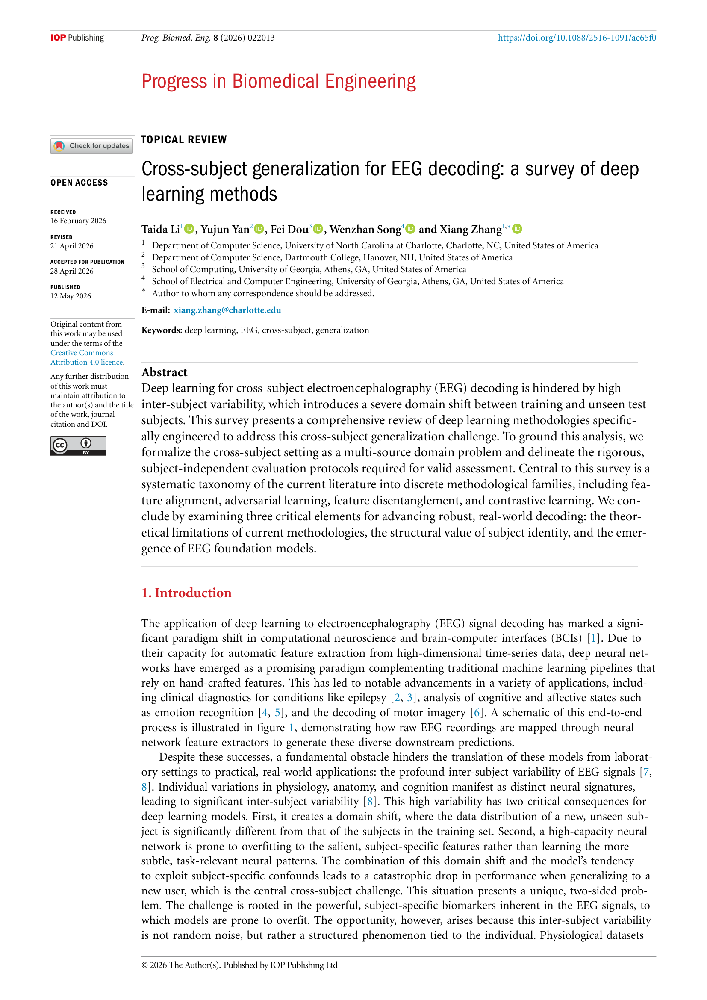

### Extraction assessment
- **Confidence:** 0.95 (meets the configured threshold).
- Machine-readable text was preserved with page-image provenance.

### Raw extracted text
```
Prog. Biomed. Eng. 8 (2026) 022013
https://doi.org/10.1088/2516-1091/ae65f0
Progress in Biomedical Engineering
OPEN ACCESS
RECEIVED
16 February 2026
REVISED
21 April 2026
ACCEPTED FOR PUBLICATION
28 April 2026
PUBLISHED
12 May 2026
Original content from
this work may be used
under the terms of the
Creative Commons
Attribution 4.0 licence.
Any further distribution
of this work must
maintain attribution to
the author(s) and the title
of the work, journal
citation and DOI.
TOPICAL REVIEW
Cross-subject generalization for EEG decoding: a survey of deep
learning methods
Taida Li1, Yujun Yan2, Fei Dou3, Wenzhan Song4and Xiang Zhang1,∗
1 Department of Computer Science, University of North Carolina at Charlotte, Charlotte, NC, United States of America
2 Department of Computer Science, Dartmouth College, Hanover, NH, United States of America
3 School of Computing, University of Georgia, Athens, GA, United States of America
4 School of Electrical and Computer Engineering, University of Georgia, Athens, GA, United States of America
∗Author to whom any correspondence should be addressed.
E-mail: xiang.zhang@charlotte.edu
Keywords: deep learning, EEG, cross-subject, generalization
Abstract
Deep learning for cross-subject electroencephalography (EEG) decoding is hindered by high
inter-subject variability, which introduces a severe domain shift between training and unseen test
subjects. This survey presents a comprehensive review of deep learning methodologies specific-
ally engineered to address this cross-subject generalization challenge. To ground this analysis, we
formalize the cross-subject setting as a multi-source domain problem and delineate the rigorous,
subject-independent evaluation protocols required for valid assessment. Central to this survey is a
systematic taxonomy of the current literature into discrete methodological families, including fea-
ture alignment, adversarial learning, feature disentanglement, and contrastive learning. We con-
clude by examining three critical elements for advancing robust, real-world decoding: the theor-
etical limitations of current methodologies, the structural value of subject identity, and the emer-
gence of EEG foundation models.
1. Introduction
The application of deep learning to electroencephalography (EEG) signal decoding has marked a signi-
ficant paradigm shift in computational neuroscience and brain-computer interfaces (BCIs) [1]. Due to
their capacity for automatic feature extraction from high-dimensional time-series data, deep neural net-
works have emerged as a promising paradigm complementing traditional machine learning pipelines that
rely on hand-crafted features. This has led to notable advancements in a variety of applications, includ-
ing clinical diagnostics for conditions like epilepsy [2, 3], analysis of cognitive and affective states such
as emotion recognition [4, 5], and the decoding of motor imagery [6]. A schematic of this end-to-end
process is illustrated in figure 1, demonstrating how raw EEG recordings are mapped through neural
network feature extractors to generate these diverse downstream predictions.
Despite these successes, a fundamental obstacle hinders the translation of these models from laborat-
ory settings to practical, real-world applications: the profound inter-subject variability of EEG signals [7,
8]. Individual variations in physiology, anatomy, and cognition manifest as distinct neural signatures,
leading to significant inter-subject variability [8]. This high variability has two critical consequences for
deep learning models. First, it creates a domain shift, where the data distribution of a new, unseen sub-
ject is significantly different from that of the subjects in the training set. Second, a high-capacity neural
network is prone to overfitting to the salient, subject-specific features rather than learning the more
subtle, task-relevant neural patterns. The combination of this domain shift and the model’s tendency
to exploit subject-specific confounds leads to a catastrophic drop in performance when generalizing to a
new user, which is the central cross-subject challenge. This situation presents a unique, two-sided prob-
lem. The challenge is rooted in the powerful, subject-specific biomarkers inherent in the EEG signals, to
which models are prone to overfit. The opportunity, however, arises because this inter-subject variability
is not random noise, but rather a structured phenomenon tied to the individual. Physiological datasets
© 2026 The Author(s). Published by IOP Publishing Ltd

```

## Page 3
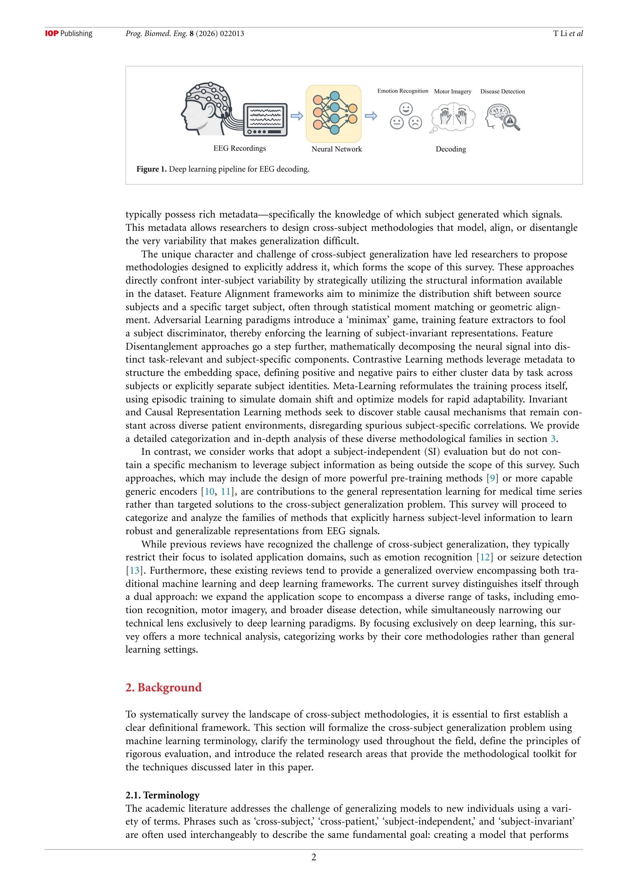

### Extraction assessment
- **Confidence:** 0.75 (below the configured 0.85 threshold; human review required).
- Embedded images require visual review; captions remain page-level text evidence only.

### Raw extracted text
```
Prog. Biomed. Eng. 8 (2026) 022013
T Li et al
Figure 1. Deep learning pipeline for EEG decoding.
typically possess rich metadata—specifically the knowledge of which subject generated which signals.
This metadata allows researchers to design cross-subject methodologies that model, align, or disentangle
the very variability that makes generalization difficult.
The unique character and challenge of cross-subject generalization have led researchers to propose
methodologies designed to explicitly address it, which forms the scope of this survey. These approaches
directly confront inter-subject variability by strategically utilizing the structural information available
in the dataset. Feature Alignment frameworks aim to minimize the distribution shift between source
subjects and a specific target subject, often through statistical moment matching or geometric align-
ment. Adversarial Learning paradigms introduce a ‘minimax’ game, training feature extractors to fool
a subject discriminator, thereby enforcing the learning of subject-invariant representations. Feature
Disentanglement approaches go a step further, mathematically decomposing the neural signal into dis-
tinct task-relevant and subject-specific components. Contrastive Learning methods leverage metadata to
structure the embedding space, defining positive and negative pairs to either cluster data by task across
subjects or explicitly separate subject identities. Meta-Learning reformulates the training process itself,
using episodic training to simulate domain shift and optimize models for rapid adaptability. Invariant
and Causal Representation Learning methods seek to discover stable causal mechanisms that remain con-
stant across diverse patient environments, disregarding spurious subject-specific correlations. We provide
a detailed categorization and in-depth analysis of these diverse methodological families in section 3.
In contrast, we consider works that adopt a subject-independent (SI) evaluation but do not con-
tain a specific mechanism to leverage subject information as being outside the scope of this survey. Such
approaches, which may include the design of more powerful pre-training methods [9] or more capable
generic encoders [10, 11], are contributions to the general representation learning for medical time series
rather than targeted solutions to the cross-subject generalization problem. This survey will proceed to
categorize and analyze the families of methods that explicitly harness subject-level information to learn
robust and generalizable representations from EEG signals.
While previous reviews have recognized the challenge of cross-subject generalization, they typically
restrict their focus to isolated application domains, such as emotion recognition [12] or seizure detection
[13]. Furthermore, these existing reviews tend to provide a generalized overview encompassing both tra-
ditional machine learning and deep learning frameworks. The current survey distinguishes itself through
a dual approach: we expand the application scope to encompass a diverse range of tasks, including emo-
tion recognition, motor imagery, and broader disease detection, while simultaneously narrowing our
technical lens exclusively to deep learning paradigms. By focusing exclusively on deep learning, this sur-
vey offers a more technical analysis, categorizing works by their core methodologies rather than general
learning settings.
2. Background
To systematically survey the landscape of cross-subject methodologies, it is essential to first establish a
clear definitional framework. This section will formalize the cross-subject generalization problem using
machine learning terminology, clarify the terminology used throughout the field, define the principles of
rigorous evaluation, and introduce the related research areas that provide the methodological toolkit for
the techniques discussed later in this paper.
2.1. Terminology
The academic literature addresses the challenge of generalizing models to new individuals using a vari-
ety of terms. Phrases such as ‘cross-subject,’ ‘cross-patient,’ ‘subject-independent,’ and ‘subject-invariant’
are often used interchangeably to describe the same fundamental goal: creating a model that performs
2

```

### Textual figure-caption evidence
- Figure 1. Deep learning pipeline for EEG decoding.
- Captions are page-level text evidence and are not associated with embedded images.

### Embedded images
- `page-003-image-001` — embedded image metadata: 2115 × 469 px, xref 34; visual review required.

## Page 4
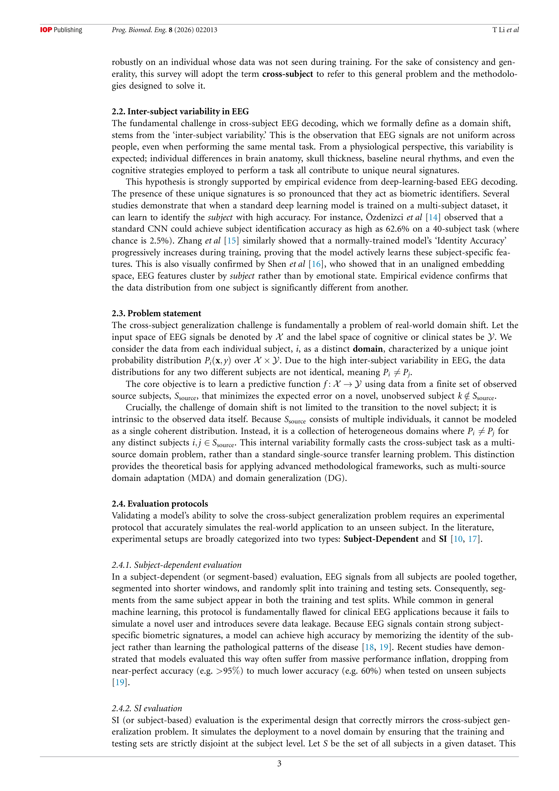

### Extraction assessment
- **Confidence:** 0.65 (below the configured 0.85 threshold; human review required).
- One or more equation candidates are ambiguous in raw extraction.

### Raw extracted text
```
Prog. Biomed. Eng. 8 (2026) 022013
T Li et al
robustly on an individual whose data was not seen during training. For the sake of consistency and gen-
erality, this survey will adopt the term cross-subject to refer to this general problem and the methodolo-
gies designed to solve it.
2.2. Inter-subject variability in EEG
The fundamental challenge in cross-subject EEG decoding, which we formally define as a domain shift,
stems from the ‘inter-subject variability.’ This is the observation that EEG signals are not uniform across
people, even when performing the same mental task. From a physiological perspective, this variability is
expected; individual differences in brain anatomy, skull thickness, baseline neural rhythms, and even the
cognitive strategies employed to perform a task all contribute to unique neural signatures.
This hypothesis is strongly supported by empirical evidence from deep-learning-based EEG decoding.
The presence of these unique signatures is so pronounced that they act as biometric identifiers. Several
studies demonstrate that when a standard deep learning model is trained on a multi-subject dataset, it
can learn to identify the subject with high accuracy. For instance, Özdenizci et al [14] observed that a
standard CNN could achieve subject identification accuracy as high as 62.6% on a 40-subject task (where
chance is 2.5%). Zhang et al [15] similarly showed that a normally-trained model’s ‘Identity Accuracy’
progressively increases during training, proving that the model actively learns these subject-specific fea-
tures. This is also visually confirmed by Shen et al [16], who showed that in an unaligned embedding
space, EEG features cluster by subject rather than by emotional state. Empirical evidence confirms that
the data distribution from one subject is significantly different from another.
2.3. Problem statement
The cross-subject generalization challenge is fundamentally a problem of real-world domain shift. Let the
input space of EEG signals be denoted by X and the label space of cognitive or clinical states be Y. We
consider the data from each individual subject, i, as a distinct domain, characterized by a unique joint
probability distribution Pi(x,y) over X × Y. Due to the high inter-subject variability in EEG, the data
distributions for any two different subjects are not identical, meaning Pi ̸= Pj.
The core objective is to learn a predictive function f : X →Y using data from a finite set of observed
source subjects, Ssource, that minimizes the expected error on a novel, unobserved subject k /∈Ssource.
Crucially, the challenge of domain shift is not limited to the transition to the novel subject; it is
intrinsic to the observed data itself. Because Ssource consists of multiple individuals, it cannot be modeled
as a single coherent distribution. Instead, it is a collection of heterogeneous domains where Pi ̸= Pj for
any distinct subjects i,j ∈Ssource. This internal variability formally casts the cross-subject task as a multi-
source domain problem, rather than a standard single-source transfer learning problem. This distinction
provides the theoretical basis for applying advanced methodological frameworks, such as multi-source
domain adaptation (MDA) and domain generalization (DG).
2.4. Evaluation protocols
Validating a model’s ability to solve the cross-subject generalization problem requires an experimental
protocol that accurately simulates the real-world application to an unseen subject. In the literature,
experimental setups are broadly categorized into two types: Subject-Dependent and SI [10, 17].
2.4.1. Subject-dependent evaluation
In a subject-dependent (or segment-based) evaluation, EEG signals from all subjects are pooled together,
segmented into shorter windows, and randomly split into training and testing sets. Consequently, seg-
ments from the same subject appear in both the training and test splits. While common in general
machine learning, this protocol is fundamentally flawed for clinical EEG applications because it fails to
simulate a novel user and introduces severe data leakage. Because EEG signals contain strong subject-
specific biometric signatures, a model can achieve high accuracy by memorizing the identity of the sub-
ject rather than learning the pathological patterns of the disease [18, 19]. Recent studies have demon-
strated that models evaluated this way often suffer from massive performance inflation, dropping from
near-perfect accuracy (e.g. >95%) to much lower accuracy (e.g. 60%) when tested on unseen subjects
[19].
2.4.2. SI evaluation
SI (or subject-based) evaluation is the experimental design that correctly mirrors the cross-subject gen-
eralization problem. It simulates the deployment to a novel domain by ensuring that the training and
testing sets are strictly disjoint at the subject level. Let S be the set of all subjects in a given dataset. This
3

```

### Equation candidates
- `page-004-equation-001` — review_required (confidence 0.45; page 4).
```
probability distribution Pi(x,y) over X × Y. Due to the high inter-subject variability in EEG, the data
```
- `page-004-equation-002` — review_required (confidence 0.45; page 4).
```
distributions for any two different subjects are not identical, meaning Pi ̸= Pj.
```
- `page-004-equation-003` — review_required (confidence 0.45; page 4).
```
source subjects, Ssource, that minimizes the expected error on a novel, unobserved subject k /∈Ssource.
```
- `page-004-equation-004` — review_required (confidence 0.45; page 4).
```
as a single coherent distribution. Instead, it is a collection of heterogeneous domains where Pi ̸= Pj for
```
- `page-004-equation-005` — review_required (confidence 0.45; page 4).
```
any distinct subjects i,j ∈Ssource. This internal variability formally casts the cross-subject task as a multi-
```

## Page 5
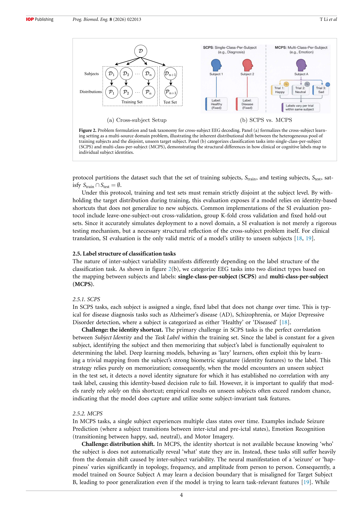

### Extraction assessment
- **Confidence:** 0.65 (below the configured 0.85 threshold; human review required).
- One or more equation candidates are ambiguous in raw extraction. Embedded images require visual review; captions remain page-level text evidence only.

### Raw extracted text
```
Prog. Biomed. Eng. 8 (2026) 022013
T Li et al
Figure 2. Problem formulation and task taxonomy for cross-subject EEG decoding. Panel (a) formalizes the cross-subject learn-
ing setting as a multi-source domain problem, illustrating the inherent distributional shift between the heterogeneous pool of
training subjects and the disjoint, unseen target subject. Panel (b) categorizes classification tasks into single-class-per-subject
(SCPS) and multi-class-per-subject (MCPS), demonstrating the structural differences in how clinical or cognitive labels map to
individual subject identities.
protocol partitions the dataset such that the set of training subjects, Strain, and testing subjects, Stest, sat-
isfy Strain ∩Stest = ∅.
Under this protocol, training and test sets must remain strictly disjoint at the subject level. By with-
holding the target distribution during training, this evaluation exposes if a model relies on identity-based
shortcuts that does not generalize to new subjects. Common implementations of the SI evaluation pro-
tocol include leave-one-subject-out cross-validation, group K-fold cross validation and fixed hold-out
sets. Since it accurately simulates deployment to a novel domain, a SI evaluation is not merely a rigorous
testing mechanism, but a necessary structural reflection of the cross-subject problem itself. For clinical
translation, SI evaluation is the only valid metric of a model’s utility to unseen subjects [18, 19].
2.5. Label structure of classification tasks
The nature of inter-subject variability manifests differently depending on the label structure of the
classification task. As shown in figure 2(b), we categorize EEG tasks into two distinct types based on
the mapping between subjects and labels: single-class-per-subject (SCPS) and multi-class-per-subject
(MCPS).
2.5.1. SCPS
In SCPS tasks, each subject is assigned a single, fixed label that does not change over time. This is typ-
ical for disease diagnosis tasks such as Alzheimer’s disease (AD), Schizophrenia, or Major Depressive
Disorder detection, where a subject is categorized as either ‘Healthy’ or ‘Diseased’ [18].
Challenge: the identity shortcut. The primary challenge in SCPS tasks is the perfect correlation
between Subject Identity and the Task Label within the training set. Since the label is constant for a given
subject, identifying the subject and then memorizing that subject’s label is functionally equivalent to
determining the label. Deep learning models, behaving as ‘lazy’ learners, often exploit this by learn-
ing a trivial mapping from the subject’s strong biometric signature (identity features) to the label. This
strategy relies purely on memorization; consequently, when the model encounters an unseen subject
in the test set, it detects a novel identity signature for which it has established no correlation with any
task label, causing this identity-based decision rule to fail. However, it is important to qualify that mod-
els rarely rely solely on this shortcut; empirical results on unseen subjects often exceed random chance,
indicating that the model does capture and utilize some subject-invariant task features.
2.5.2. MCPS
In MCPS tasks, a single subject experiences multiple class states over time. Examples include Seizure
Prediction (where a subject transitions between inter-ictal and pre-ictal states), Emotion Recognition
(transitioning between happy, sad, neutral), and Motor Imagery.
Challenge: distribution shift. In MCPS, the identity shortcut is not available because knowing ‘who’
the subject is does not automatically reveal ‘what’ state they are in. Instead, these tasks still suffer heavily
from the domain shift caused by inter-subject variability. The neural manifestation of a ‘seizure’ or ‘hap-
piness’ varies significantly in topology, frequency, and amplitude from person to person. Consequently, a
model trained on Source Subject A may learn a decision boundary that is misaligned for Target Subject
B, leading to poor generalization even if the model is trying to learn task-relevant features [19]. While
4

```

### Textual figure-caption evidence
- Figure 2. Problem formulation and task taxonomy for cross-subject EEG decoding. Panel (a) formalizes the cross-subject learn-
- Captions are page-level text evidence and are not associated with embedded images.

### Equation candidates
- `page-005-equation-001` — review_required (confidence 0.45; page 5).
```
isfy Strain ∩Stest = ∅.
```

### Embedded images
- `page-005-image-001` — embedded image metadata: 1323 × 696 px, xref 48; visual review required.

## Page 6
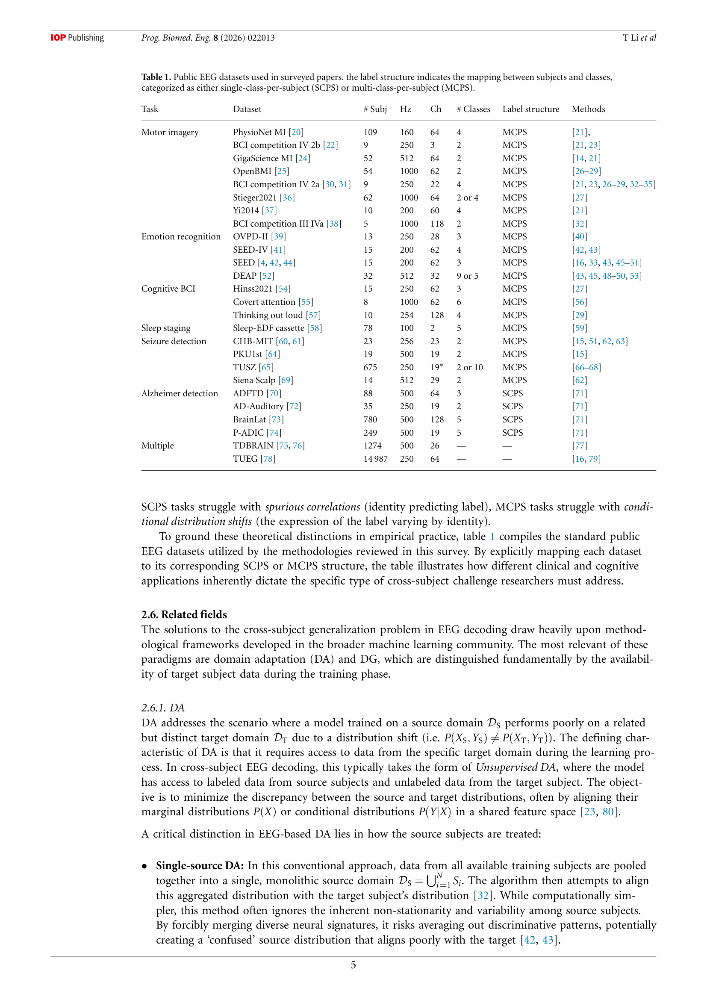

### Extraction assessment
- **Confidence:** 0.65 (below the configured 0.85 threshold; human review required).
- One or more equation candidates are ambiguous in raw extraction.

### Raw extracted text
```
Prog. Biomed. Eng. 8 (2026) 022013
T Li et al
Table 1. Public EEG datasets used in surveyed papers. the label structure indicates the mapping between subjects and classes,
categorized as either single-class-per-subject (SCPS) or multi-class-per-subject (MCPS).
Task
Dataset
# Subj
Hz
Ch
# Classes
Label structure
Methods
Motor imagery
PhysioNet MI [20]
109
160
64
4
MCPS
[21],
BCI competition IV 2b [22]
9
250
3
2
MCPS
[21, 23]
GigaScience MI [24]
52
512
64
2
MCPS
[14, 21]
OpenBMI [25]
54
1000
62
2
MCPS
[26–29]
BCI competition IV 2a [30, 31]
9
250
22
4
MCPS
[21, 23, 26–29, 32–35]
Stieger2021 [36]
62
1000
64
2 or 4
MCPS
[27]
Yi2014 [37]
10
200
60
4
MCPS
[21]
BCI competition III IVa [38]
5
1000
118
2
MCPS
[32]
Emotion recognition
OVPD-II [39]
13
250
28
3
MCPS
[40]
SEED-IV [41]
15
200
62
4
MCPS
[42, 43]
SEED [4, 42, 44]
15
200
62
3
MCPS
[16, 33, 43, 45–51]
DEAP [52]
32
512
32
9 or 5
MCPS
[43, 45, 48–50, 53]
Cognitive BCI
Hinss2021 [54]
15
250
62
3
MCPS
[27]
Covert attention [55]
8
1000
62
6
MCPS
[56]
Thinking out loud [57]
10
254
128
4
MCPS
[29]
Sleep staging
Sleep-EDF cassette [58]
78
100
2
5
MCPS
[59]
Seizure detection
CHB-MIT [60, 61]
23
256
23
2
MCPS
[15, 51, 62, 63]
PKU1st [64]
19
500
19
2
MCPS
[15]
TUSZ [65]
675
250
19∗
2 or 10
MCPS
[66–68]
Siena Scalp [69]
14
512
29
2
MCPS
[62]
Alzheimer detection
ADFTD [70]
88
500
64
3
SCPS
[71]
AD-Auditory [72]
35
250
19
2
SCPS
[71]
BrainLat [73]
780
500
128
5
SCPS
[71]
P-ADIC [74]
249
500
19
5
SCPS
[71]
Multiple
TDBRAIN [75, 76]
1274
500
26
—
—
[77]
TUEG [78]
14 987
250
64
—
—
[16, 79]
SCPS tasks struggle with spurious correlations (identity predicting label), MCPS tasks struggle with condi-
tional distribution shifts (the expression of the label varying by identity).
To ground these theoretical distinctions in empirical practice, table 1 compiles the standard public
EEG datasets utilized by the methodologies reviewed in this survey. By explicitly mapping each dataset
to its corresponding SCPS or MCPS structure, the table illustrates how different clinical and cognitive
applications inherently dictate the specific type of cross-subject challenge researchers must address.
2.6. Related fields
The solutions to the cross-subject generalization problem in EEG decoding draw heavily upon method-
ological frameworks developed in the broader machine learning community. The most relevant of these
paradigms are domain adaptation (DA) and DG, which are distinguished fundamentally by the availabil-
ity of target subject data during the training phase.
2.6.1. DA
DA addresses the scenario where a model trained on a source domain DS performs poorly on a related
but distinct target domain DT due to a distribution shift (i.e. P(XS,YS) ̸= P(XT,YT)). The defining char-
acteristic of DA is that it requires access to data from the specific target domain during the learning pro-
cess. In cross-subject EEG decoding, this typically takes the form of Unsupervised DA, where the model
has access to labeled data from source subjects and unlabeled data from the target subject. The object-
ive is to minimize the discrepancy between the source and target distributions, often by aligning their
marginal distributions P(X) or conditional distributions P(Y|X) in a shared feature space [23, 80].
A critical distinction in EEG-based DA lies in how the source subjects are treated:
• Single-source DA: In this conventional approach, data from all available training subjects are pooled
together into a single, monolithic source domain DS = ∪N
i=1 Si. The algorithm then attempts to align
this aggregated distribution with the target subject’s distribution [32]. While computationally sim-
pler, this method often ignores the inherent non-stationarity and variability among source subjects.
By forcibly merging diverse neural signatures, it risks averaging out discriminative patterns, potentially
creating a ‘confused’ source distribution that aligns poorly with the target [42, 43].
5

```

### Equation candidates
- `page-006-equation-001` — review_required (confidence 0.45; page 6).
```
but distinct target domain DT due to a distribution shift (i.e. P(XS,YS) ̸= P(XT,YT)). The defining char-
```
- `page-006-equation-002` — review_required (confidence 0.45; page 6).
```
together into a single, monolithic source domain DS = ∪N
```
- `page-006-equation-003` — raw_text_preserved (confidence 0.98; page 6).
```
i=1 Si. The algorithm then attempts to align
```

## Page 7
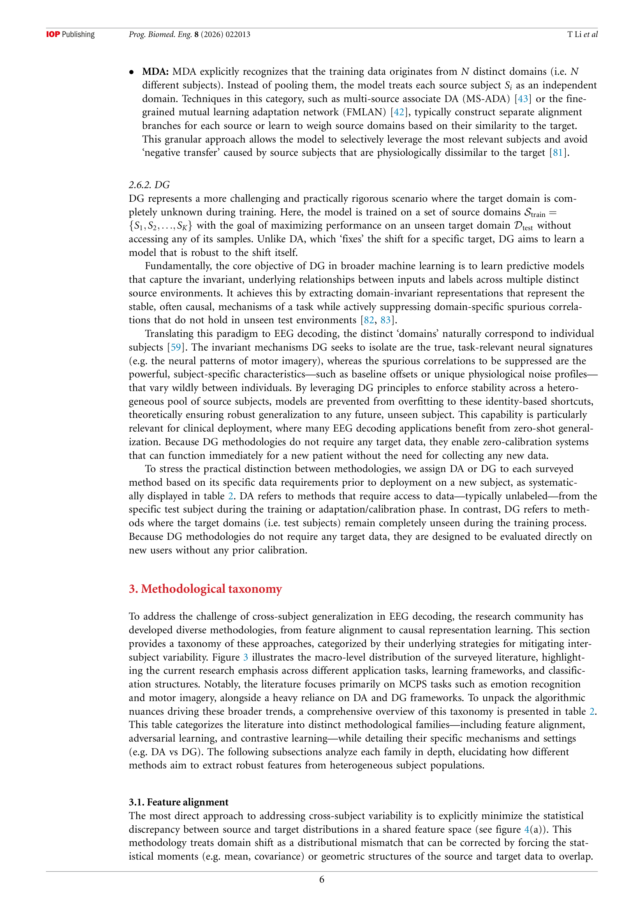

### Extraction assessment
- **Confidence:** 0.65 (below the configured 0.85 threshold; human review required).
- One or more equation candidates are ambiguous in raw extraction.

### Raw extracted text
```
Prog. Biomed. Eng. 8 (2026) 022013
T Li et al
• MDA: MDA explicitly recognizes that the training data originates from N distinct domains (i.e. N
different subjects). Instead of pooling them, the model treats each source subject Si as an independent
domain. Techniques in this category, such as multi-source associate DA (MS-ADA) [43] or the fine-
grained mutual learning adaptation network (FMLAN) [42], typically construct separate alignment
branches for each source or learn to weigh source domains based on their similarity to the target.
This granular approach allows the model to selectively leverage the most relevant subjects and avoid
‘negative transfer’ caused by source subjects that are physiologically dissimilar to the target [81].
2.6.2. DG
DG represents a more challenging and practically rigorous scenario where the target domain is com-
pletely unknown during training. Here, the model is trained on a set of source domains Strain =
{S1,S2,...,SK} with the goal of maximizing performance on an unseen target domain Dtest without
accessing any of its samples. Unlike DA, which ‘fixes’ the shift for a specific target, DG aims to learn a
model that is robust to the shift itself.
Fundamentally, the core objective of DG in broader machine learning is to learn predictive models
that capture the invariant, underlying relationships between inputs and labels across multiple distinct
source environments. It achieves this by extracting domain-invariant representations that represent the
stable, often causal, mechanisms of a task while actively suppressing domain-specific spurious correla-
tions that do not hold in unseen test environments [82, 83].
Translating this paradigm to EEG decoding, the distinct ‘domains’ naturally correspond to individual
subjects [59]. The invariant mechanisms DG seeks to isolate are the true, task-relevant neural signatures
(e.g. the neural patterns of motor imagery), whereas the spurious correlations to be suppressed are the
powerful, subject-specific characteristics—such as baseline offsets or unique physiological noise profiles—
that vary wildly between individuals. By leveraging DG principles to enforce stability across a hetero-
geneous pool of source subjects, models are prevented from overfitting to these identity-based shortcuts,
theoretically ensuring robust generalization to any future, unseen subject. This capability is particularly
relevant for clinical deployment, where many EEG decoding applications benefit from zero-shot general-
ization. Because DG methodologies do not require any target data, they enable zero-calibration systems
that can function immediately for a new patient without the need for collecting any new data.
To stress the practical distinction between methodologies, we assign DA or DG to each surveyed
method based on its specific data requirements prior to deployment on a new subject, as systematic-
ally displayed in table 2. DA refers to methods that require access to data—typically unlabeled—from the
specific test subject during the training or adaptation/calibration phase. In contrast, DG refers to meth-
ods where the target domains (i.e. test subjects) remain completely unseen during the training process.
Because DG methodologies do not require any target data, they are designed to be evaluated directly on
new users without any prior calibration.
3. Methodological taxonomy
To address the challenge of cross-subject generalization in EEG decoding, the research community has
developed diverse methodologies, from feature alignment to causal representation learning. This section
provides a taxonomy of these approaches, categorized by their underlying strategies for mitigating inter-
subject variability. Figure 3 illustrates the macro-level distribution of the surveyed literature, highlight-
ing the current research emphasis across different application tasks, learning frameworks, and classific-
ation structures. Notably, the literature focuses primarily on MCPS tasks such as emotion recognition
and motor imagery, alongside a heavy reliance on DA and DG frameworks. To unpack the algorithmic
nuances driving these broader trends, a comprehensive overview of this taxonomy is presented in table 2.
This table categorizes the literature into distinct methodological families—including feature alignment,
adversarial learning, and contrastive learning—while detailing their specific mechanisms and settings
(e.g. DA vs DG). The following subsections analyze each family in depth, elucidating how different
methods aim to extract robust features from heterogeneous subject populations.
3.1. Feature alignment
The most direct approach to addressing cross-subject variability is to explicitly minimize the statistical
discrepancy between source and target distributions in a shared feature space (see figure 4(a)). This
methodology treats domain shift as a distributional mismatch that can be corrected by forcing the stat-
istical moments (e.g. mean, covariance) or geometric structures of the source and target data to overlap.
6

```

### Equation candidates
- `page-007-equation-001` — review_required (confidence 0.45; page 7).
```
pletely unknown during training. Here, the model is trained on a set of source domains Strain =
```

## Page 8
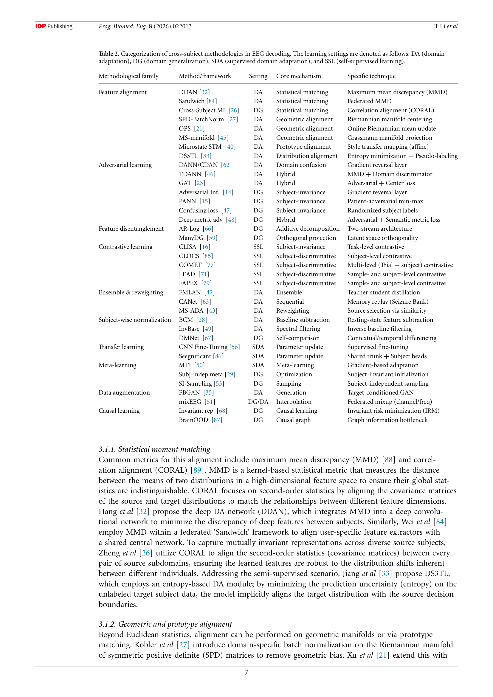

### Extraction assessment
- **Confidence:** 0.95 (meets the configured threshold).
- Machine-readable text was preserved with page-image provenance.

### Raw extracted text
```
Prog. Biomed. Eng. 8 (2026) 022013
T Li et al
Table 2. Categorization of cross-subject methodologies in EEG decoding. The learning settings are denoted as follows: DA (domain
adaptation), DG (domain generalization), SDA (supervised domain adaptation), and SSL (self-supervised learning).
Methodological family
Method/framework
Setting
Core mechanism
Specific technique
Feature alignment
DDAN [32]
DA
Statistical matching
Maximum mean discrepancy (MMD)
Sandwich [84]
DA
Statistical matching
Federated MMD
Cross-Subject MI [26]
DG
Statistical matching
Correlation alignment (CORAL)
SPD-BatchNorm [27]
DA
Geometric alignment
Riemannian manifold centering
OPS [21]
DA
Geometric alignment
Online Riemannian mean update
MS-manifold [45]
DA
Geometric alignment
Grassmann manifold projection
Microstate STM [40]
DA
Prototype alignment
Style transfer mapping (affine)
DS3TL [33]
DA
Distribution alignment
Entropy minimization + Pseudo-labeling
Adversarial learning
DANN/CDAN [62]
DA
Domain confusion
Gradient reversal layer
TDANN [46]
DA
Hybrid
MMD + Domain discriminator
GAT [23]
DA
Hybrid
Adversarial + Center loss
Adversarial Inf. [14]
DG
Subject-invariance
Gradient reversal layer
PANN [15]
DG
Subject-invariance
Patient-adversarial min-max
Confusing loss [47]
DG
Subject-invariance
Randomized subject labels
Deep metric adv [48]
DG
Hybrid
Adversarial + Semantic metric loss
Feature disentanglement
AR-Log [66]
DG
Additive decomposition
Two-stream architecture
ManyDG [59]
DG
Orthogonal projection
Latent space orthogonality
Contrastive learning
CLISA [16]
SSL
Subject-invariance
Task-level contrastive
CLOCS [85]
SSL
Subject-discriminative
Subject-level contrastive
COMET [77]
SSL
Subject-discriminative
Multi-level (Trial + subject) contrastive
LEAD [71]
SSL
Subject-discriminative
Sample- and subject-level contrastive
FAPEX [79]
SSL
Subject-discriminative
Sample- and subject-level contrastive
Ensemble & reweighting
FMLAN [42]
DA
Ensemble
Teacher-student distillation
CANet [63]
DA
Sequential
Memory replay (Seizure Bank)
MS-ADA [43]
DA
Reweighting
Source selection via similarity
Subject-wise normalization
BCM [28]
DA
Baseline subtraction
Resting-state feature subtraction
InvBase [49]
DA
Spectral filtering
Inverse baseline filtering
DMNet [67]
DG
Self-comparison
Contextual/temporal differencing
Transfer learning
CNN Fine-Tuning [56]
SDA
Parameter update
Supervised fine-tuning
Seegnificant [86]
SDA
Parameter update
Shared trunk + Subject heads
Meta-learning
MTL [50]
SDA
Meta-learning
Gradient-based adaptation
Subj-indep meta [29]
DG
Optimization
Subject-invariant initialization
SI-Sampling [53]
DG
Sampling
Subject-independent sampling
Data augmentation
FBGAN [35]
DA
Generation
Target-conditioned GAN
mixEEG [51]
DG/DA
Interpolation
Federated mixup (channel/freq)
Causal learning
Invariant rep [68]
DG
Causal learning
Invariant risk minimization (IRM)
BrainOOD [87]
DG
Causal graph
Graph information bottleneck
3.1.1. Statistical moment matching
Common metrics for this alignment include maximum mean discrepancy (MMD) [88] and correl-
ation alignment (CORAL) [89]. MMD is a kernel-based statistical metric that measures the distance
between the means of two distributions in a high-dimensional feature space to ensure their global stat-
istics are indistinguishable. CORAL focuses on second-order statistics by aligning the covariance matrices
of the source and target distributions to match the relationships between different feature dimensions.
Hang et al [32] propose the deep DA network (DDAN), which integrates MMD into a deep convolu-
tional network to minimize the discrepancy of deep features between subjects. Similarly, Wei et al [84]
employ MMD within a federated ‘Sandwich’ framework to align user-specific feature extractors with
a shared central network. To capture mutually invariant representations across diverse source subjects,
Zheng et al [26] utilize CORAL to align the second-order statistics (covariance matrices) between every
pair of source subdomains, ensuring the learned features are robust to the distribution shifts inherent
between different individuals. Addressing the semi-supervised scenario, Jiang et al [33] propose DS3TL,
which employs an entropy-based DA module; by minimizing the prediction uncertainty (entropy) on the
unlabeled target subject data, the model implicitly aligns the target distribution with the source decision
boundaries.
3.1.2. Geometric and prototype alignment
Beyond Euclidean statistics, alignment can be performed on geometric manifolds or via prototype
matching. Kobler et al [27] introduce domain-specific batch normalization on the Riemannian manifold
of symmetric positive definite (SPD) matrices to remove geometric bias. Xu et al [21] extend this with
7

```

## Page 9
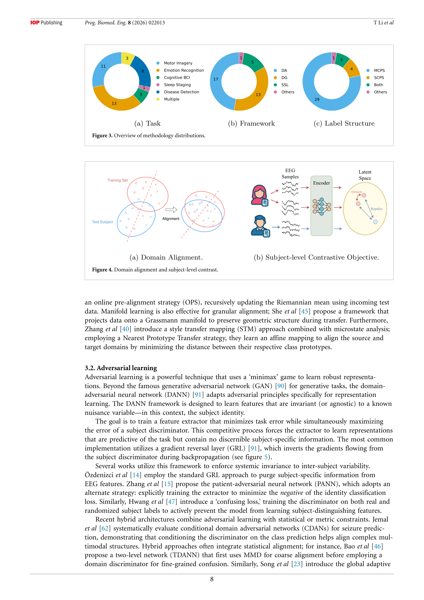

### Extraction assessment
- **Confidence:** 0.75 (below the configured 0.85 threshold; human review required).
- Embedded images require visual review; captions remain page-level text evidence only.

### Raw extracted text
```
Prog. Biomed. Eng. 8 (2026) 022013
T Li et al
Figure 3. Overview of methodology distributions.
Figure 4. Domain alignment and subject-level contrast.
an online pre-alignment strategy (OPS), recursively updating the Riemannian mean using incoming test
data. Manifold learning is also effective for granular alignment; She et al [45] propose a framework that
projects data onto a Grassmann manifold to preserve geometric structure during transfer. Furthermore,
Zhang et al [40] introduce a style transfer mapping (STM) approach combined with microstate analysis;
employing a Nearest Prototype Transfer strategy, they learn an affine mapping to align the source and
target domains by minimizing the distance between their respective class prototypes.
3.2. Adversarial learning
Adversarial learning is a powerful technique that uses a ‘minimax’ game to learn robust representa-
tions. Beyond the famous generative adversarial network (GAN) [90] for generative tasks, the domain-
adversarial neural network (DANN) [91] adapts adversarial principles specifically for representation
learning. The DANN framework is designed to learn features that are invariant (or agnostic) to a known
nuisance variable—in this context, the subject identity.
The goal is to train a feature extractor that minimizes task error while simultaneously maximizing
the error of a subject discriminator. This competitive process forces the extractor to learn representations
that are predictive of the task but contain no discernible subject-specific information. The most common
implementation utilizes a gradient reversal layer (GRL) [91], which inverts the gradients flowing from
the subject discriminator during backpropagation (see figure 5).
Several works utilize this framework to enforce systemic invariance to inter-subject variability.
Özdenizci et al [14] employ the standard GRL approach to purge subject-specific information from
EEG features. Zhang et al [15] propose the patient-adversarial neural network (PANN), which adopts an
alternate strategy: explicitly training the extractor to minimize the negative of the identity classification
loss. Similarly, Hwang et al [47] introduce a ‘confusing loss,’ training the discriminator on both real and
randomized subject labels to actively prevent the model from learning subject-distinguishing features.
Recent hybrid architectures combine adversarial learning with statistical or metric constraints. Jemal
et al [62] systematically evaluate conditional domain adversarial networks (CDANs) for seizure predic-
tion, demonstrating that conditioning the discriminator on the class prediction helps align complex mul-
timodal structures. Hybrid approaches often integrate statistical alignment; for instance, Bao et al [46]
propose a two-level network (TDANN) that first uses MMD for coarse alignment before employing a
domain discriminator for fine-grained confusion. Similarly, Song et al [23] introduce the global adaptive
8

```

### Textual figure-caption evidence
- Figure 3. Overview of methodology distributions.
- Figure 4. Domain alignment and subject-level contrast.
- Captions are page-level text evidence and are not associated with embedded images.

### Embedded images
- `page-009-image-001` — embedded image metadata: 2319 × 599 px, xref 80; visual review required.

## Page 10
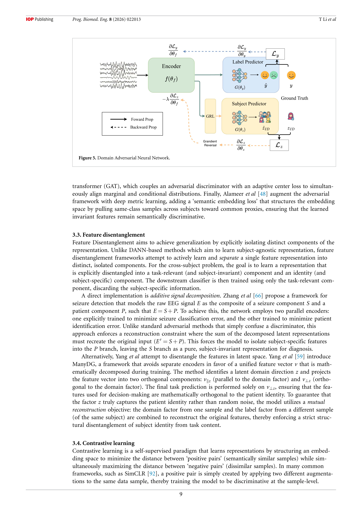

### Extraction assessment
- **Confidence:** 0.65 (below the configured 0.85 threshold; human review required).
- One or more equation candidates are ambiguous in raw extraction. Embedded images require visual review; captions remain page-level text evidence only.

### Raw extracted text
```
Prog. Biomed. Eng. 8 (2026) 022013
T Li et al
Figure 5. Domain Adversarial Neural Network.
transformer (GAT), which couples an adversarial discriminator with an adaptive center loss to simultan-
eously align marginal and conditional distributions. Finally, Alameer et al [48] augment the adversarial
framework with deep metric learning, adding a ‘semantic embedding loss’ that structures the embedding
space by pulling same-class samples across subjects toward common proxies, ensuring that the learned
invariant features remain semantically discriminative.
3.3. Feature disentanglement
Feature Disentanglement aims to achieve generalization by explicitly isolating distinct components of the
representation. Unlike DANN-based methods which aim to learn subject-agnostic representation, feature
disentanglement frameworks attempt to actively learn and separate a single feature representation into
distinct, isolated components. For the cross-subject problem, the goal is to learn a representation that
is explicitly disentangled into a task-relevant (and subject-invariant) component and an identity (and
subject-specific) component. The downstream classifier is then trained using only the task-relevant com-
ponent, discarding the subject-specific information.
A direct implementation is additive signal decomposition. Zhang et al [66] propose a framework for
seizure detection that models the raw EEG signal E as the composite of a seizure component S and a
patient component P, such that E = S + P. To achieve this, the network employs two parallel encoders:
one explicitly trained to minimize seizure classification error, and the other trained to minimize patient
identification error. Unlike standard adversarial methods that simply confuse a discriminator, this
approach enforces a reconstruction constraint where the sum of the decomposed latent representations
must recreate the original input (E′ = S + P). This forces the model to isolate subject-specific features
into the P branch, leaving the S branch as a pure, subject-invariant representation for diagnosis.
Alternatively, Yang et al attempt to disentangle the features in latent space. Yang et al [59] introduce
ManyDG, a framework that avoids separate encoders in favor of a unified feature vector v that is math-
ematically decomposed during training. The method identifies a latent domain direction z and projects
the feature vector into two orthogonal components: v∥z (parallel to the domain factor) and v⊥z (ortho-
gonal to the domain factor). The final task prediction is performed solely on v⊥z, ensuring that the fea-
tures used for decision-making are mathematically orthogonal to the patient identity. To guarantee that
the factor z truly captures the patient identity rather than random noise, the model utilizes a mutual
reconstruction objective: the domain factor from one sample and the label factor from a different sample
(of the same subject) are combined to reconstruct the original features, thereby enforcing a strict struc-
tural disentanglement of subject identity from task content.
3.4. Contrastive learning
Contrastive learning is a self-supervised paradigm that learns representations by structuring an embed-
ding space to minimize the distance between ‘positive pairs’ (semantically similar samples) while sim-
ultaneously maximizing the distance between ‘negative pairs’ (dissimilar samples). In many common
frameworks, such as SimCLR [92], a positive pair is simply created by applying two different augmenta-
tions to the same data sample, thereby training the model to be discriminative at the sample-level.
9

```

### Textual figure-caption evidence
- Figure 5. Domain Adversarial Neural Network.
- Captions are page-level text evidence and are not associated with embedded images.

### Equation candidates
- `page-010-equation-001` — review_required (confidence 0.45; page 10).
```
patient component P, such that E = S + P. To achieve this, the network employs two parallel encoders:
```
- `page-010-equation-002` — review_required (confidence 0.45; page 10).
```
must recreate the original input (E′ = S + P). This forces the model to isolate subject-specific features
```

### Embedded images
- `page-010-image-001` — embedded image metadata: 1990 × 1082 px, xref 91; visual review required.

## Page 11
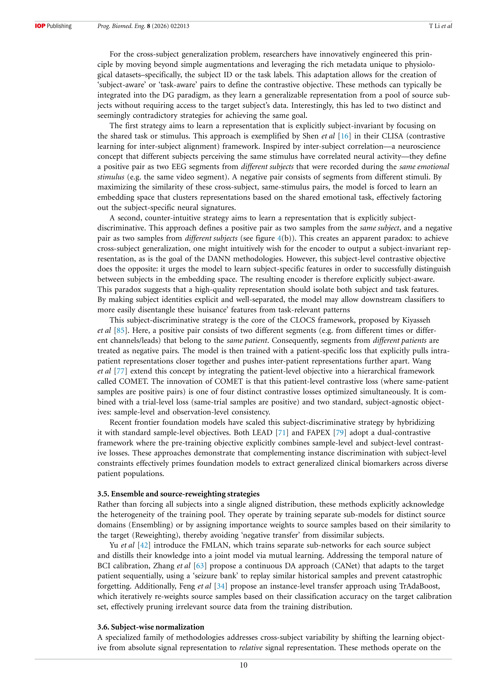

### Extraction assessment
- **Confidence:** 0.95 (meets the configured threshold).
- Machine-readable text was preserved with page-image provenance.

### Raw extracted text
```
Prog. Biomed. Eng. 8 (2026) 022013
T Li et al
For the cross-subject generalization problem, researchers have innovatively engineered this prin-
ciple by moving beyond simple augmentations and leveraging the rich metadata unique to physiolo-
gical datasets–specifically, the subject ID or the task labels. This adaptation allows for the creation of
‘subject-aware’ or ‘task-aware’ pairs to define the contrastive objective. These methods can typically be
integrated into the DG paradigm, as they learn a generalizable representation from a pool of source sub-
jects without requiring access to the target subject’s data. Interestingly, this has led to two distinct and
seemingly contradictory strategies for achieving the same goal.
The first strategy aims to learn a representation that is explicitly subject-invariant by focusing on
the shared task or stimulus. This approach is exemplified by Shen et al [16] in their CLISA (contrastive
learning for inter-subject alignment) framework. Inspired by inter-subject correlation—a neuroscience
concept that different subjects perceiving the same stimulus have correlated neural activity—they define
a positive pair as two EEG segments from different subjects that were recorded during the same emotional
stimulus (e.g. the same video segment). A negative pair consists of segments from different stimuli. By
maximizing the similarity of these cross-subject, same-stimulus pairs, the model is forced to learn an
embedding space that clusters representations based on the shared emotional task, effectively factoring
out the subject-specific neural signatures.
A second, counter-intuitive strategy aims to learn a representation that is explicitly subject-
discriminative. This approach defines a positive pair as two samples from the same subject, and a negative
pair as two samples from different subjects (see figure 4(b)). This creates an apparent paradox: to achieve
cross-subject generalization, one might intuitively wish for the encoder to output a subject-invariant rep-
resentation, as is the goal of the DANN methodologies. However, this subject-level contrastive objective
does the opposite: it urges the model to learn subject-specific features in order to successfully distinguish
between subjects in the embedding space. The resulting encoder is therefore explicitly subject-aware.
This paradox suggests that a high-quality representation should isolate both subject and task features.
By making subject identities explicit and well-separated, the model may allow downstream classifiers to
more easily disentangle these ’nuisance’ features from task-relevant patterns
This subject-discriminative strategy is the core of the CLOCS framework, proposed by Kiyasseh
et al [85]. Here, a positive pair consists of two different segments (e.g. from different times or differ-
ent channels/leads) that belong to the same patient. Consequently, segments from different patients are
treated as negative pairs. The model is then trained with a patient-specific loss that explicitly pulls intra-
patient representations closer together and pushes inter-patient representations further apart. Wang
et al [77] extend this concept by integrating the patient-level objective into a hierarchical framework
called COMET. The innovation of COMET is that this patient-level contrastive loss (where same-patient
samples are positive pairs) is one of four distinct contrastive losses optimized simultaneously. It is com-
bined with a trial-level loss (same-trial samples are positive) and two standard, subject-agnostic object-
ives: sample-level and observation-level consistency.
Recent frontier foundation models have scaled this subject-discriminative strategy by hybridizing
it with standard sample-level objectives. Both LEAD [71] and FAPEX [79] adopt a dual-contrastive
framework where the pre-training objective explicitly combines sample-level and subject-level contrast-
ive losses. These approaches demonstrate that complementing instance discrimination with subject-level
constraints effectively primes foundation models to extract generalized clinical biomarkers across diverse
patient populations.
3.5. Ensemble and source-reweighting strategies
Rather than forcing all subjects into a single aligned distribution, these methods explicitly acknowledge
the heterogeneity of the training pool. They operate by training separate sub-models for distinct source
domains (Ensembling) or by assigning importance weights to source samples based on their similarity to
the target (Reweighting), thereby avoiding ‘negative transfer’ from dissimilar subjects.
Yu et al [42] introduce the FMLAN, which trains separate sub-networks for each source subject
and distills their knowledge into a joint model via mutual learning. Addressing the temporal nature of
BCI calibration, Zhang et al [63] propose a continuous DA approach (CANet) that adapts to the target
patient sequentially, using a ‘seizure bank’ to replay similar historical samples and prevent catastrophic
forgetting. Additionally, Feng et al [34] propose an instance-level transfer approach using TrAdaBoost,
which iteratively re-weights source samples based on their classification accuracy on the target calibration
set, effectively pruning irrelevant source data from the training distribution.
3.6. Subject-wise normalization
A specialized family of methodologies addresses cross-subject variability by shifting the learning object-
ive from absolute signal representation to relative signal representation. These methods operate on the
10

```

## Page 12
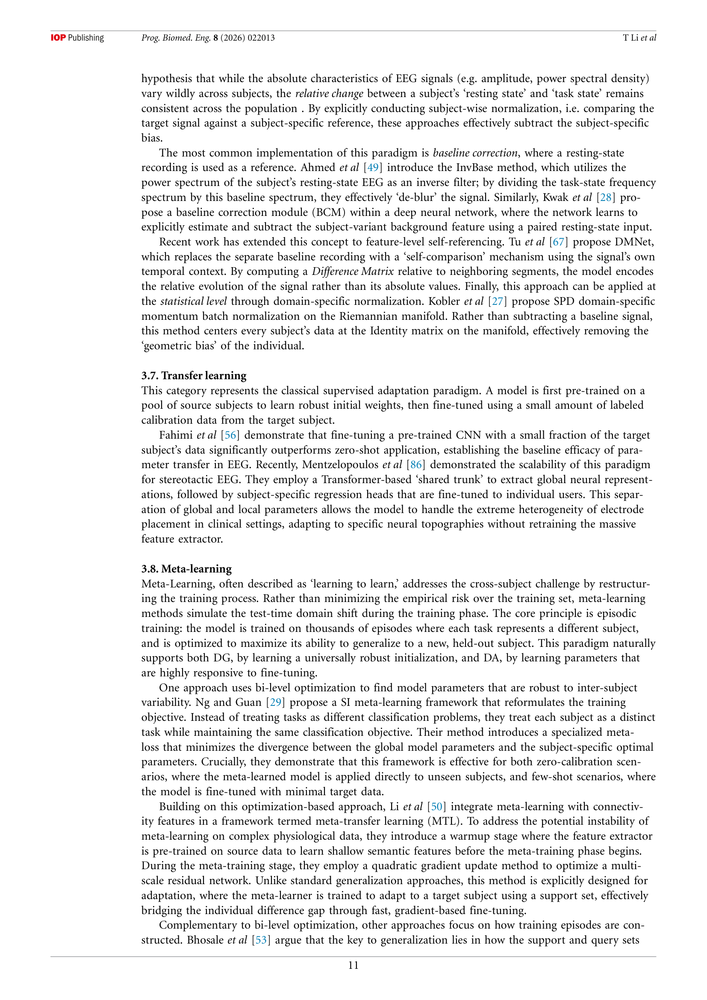

### Extraction assessment
- **Confidence:** 0.95 (meets the configured threshold).
- Machine-readable text was preserved with page-image provenance.

### Raw extracted text
```
Prog. Biomed. Eng. 8 (2026) 022013
T Li et al
hypothesis that while the absolute characteristics of EEG signals (e.g. amplitude, power spectral density)
vary wildly across subjects, the relative change between a subject’s ‘resting state’ and ‘task state’ remains
consistent across the population . By explicitly conducting subject-wise normalization, i.e. comparing the
target signal against a subject-specific reference, these approaches effectively subtract the subject-specific
bias.
The most common implementation of this paradigm is baseline correction, where a resting-state
recording is used as a reference. Ahmed et al [49] introduce the InvBase method, which utilizes the
power spectrum of the subject’s resting-state EEG as an inverse filter; by dividing the task-state frequency
spectrum by this baseline spectrum, they effectively ‘de-blur’ the signal. Similarly, Kwak et al [28] pro-
pose a baseline correction module (BCM) within a deep neural network, where the network learns to
explicitly estimate and subtract the subject-variant background feature using a paired resting-state input.
Recent work has extended this concept to feature-level self-referencing. Tu et al [67] propose DMNet,
which replaces the separate baseline recording with a ‘self-comparison’ mechanism using the signal’s own
temporal context. By computing a Difference Matrix relative to neighboring segments, the model encodes
the relative evolution of the signal rather than its absolute values. Finally, this approach can be applied at
the statistical level through domain-specific normalization. Kobler et al [27] propose SPD domain-specific
momentum batch normalization on the Riemannian manifold. Rather than subtracting a baseline signal,
this method centers every subject’s data at the Identity matrix on the manifold, effectively removing the
‘geometric bias’ of the individual.
3.7. Transfer learning
This category represents the classical supervised adaptation paradigm. A model is first pre-trained on a
pool of source subjects to learn robust initial weights, then fine-tuned using a small amount of labeled
calibration data from the target subject.
Fahimi et al [56] demonstrate that fine-tuning a pre-trained CNN with a small fraction of the target
subject’s data significantly outperforms zero-shot application, establishing the baseline efficacy of para-
meter transfer in EEG. Recently, Mentzelopoulos et al [86] demonstrated the scalability of this paradigm
for stereotactic EEG. They employ a Transformer-based ‘shared trunk’ to extract global neural represent-
ations, followed by subject-specific regression heads that are fine-tuned to individual users. This separ-
ation of global and local parameters allows the model to handle the extreme heterogeneity of electrode
placement in clinical settings, adapting to specific neural topographies without retraining the massive
feature extractor.
3.8. Meta-learning
Meta-Learning, often described as ‘learning to learn,’ addresses the cross-subject challenge by restructur-
ing the training process. Rather than minimizing the empirical risk over the training set, meta-learning
methods simulate the test-time domain shift during the training phase. The core principle is episodic
training: the model is trained on thousands of episodes where each task represents a different subject,
and is optimized to maximize its ability to generalize to a new, held-out subject. This paradigm naturally
supports both DG, by learning a universally robust initialization, and DA, by learning parameters that
are highly responsive to fine-tuning.
One approach uses bi-level optimization to find model parameters that are robust to inter-subject
variability. Ng and Guan [29] propose a SI meta-learning framework that reformulates the training
objective. Instead of treating tasks as different classification problems, they treat each subject as a distinct
task while maintaining the same classification objective. Their method introduces a specialized meta-
loss that minimizes the divergence between the global model parameters and the subject-specific optimal
parameters. Crucially, they demonstrate that this framework is effective for both zero-calibration scen-
arios, where the meta-learned model is applied directly to unseen subjects, and few-shot scenarios, where
the model is fine-tuned with minimal target data.
Building on this optimization-based approach, Li et al [50] integrate meta-learning with connectiv-
ity features in a framework termed meta-transfer learning (MTL). To address the potential instability of
meta-learning on complex physiological data, they introduce a warmup stage where the feature extractor
is pre-trained on source data to learn shallow semantic features before the meta-training phase begins.
During the meta-training stage, they employ a quadratic gradient update method to optimize a multi-
scale residual network. Unlike standard generalization approaches, this method is explicitly designed for
adaptation, where the meta-learner is trained to adapt to a target subject using a support set, effectively
bridging the individual difference gap through fast, gradient-based fine-tuning.
Complementary to bi-level optimization, other approaches focus on how training episodes are con-
structed. Bhosale et al [53] argue that the key to generalization lies in how the support and query sets
11

```

## Page 13
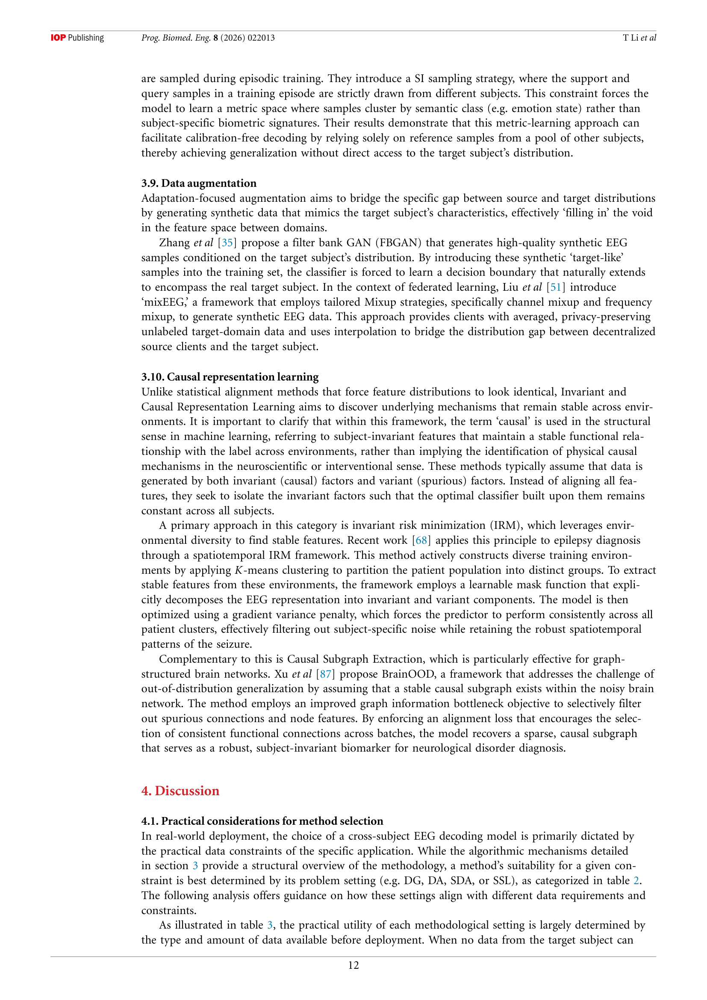

### Extraction assessment
- **Confidence:** 0.95 (meets the configured threshold).
- Machine-readable text was preserved with page-image provenance.

### Raw extracted text
```
Prog. Biomed. Eng. 8 (2026) 022013
T Li et al
are sampled during episodic training. They introduce a SI sampling strategy, where the support and
query samples in a training episode are strictly drawn from different subjects. This constraint forces the
model to learn a metric space where samples cluster by semantic class (e.g. emotion state) rather than
subject-specific biometric signatures. Their results demonstrate that this metric-learning approach can
facilitate calibration-free decoding by relying solely on reference samples from a pool of other subjects,
thereby achieving generalization without direct access to the target subject’s distribution.
3.9. Data augmentation
Adaptation-focused augmentation aims to bridge the specific gap between source and target distributions
by generating synthetic data that mimics the target subject’s characteristics, effectively ‘filling in’ the void
in the feature space between domains.
Zhang et al [35] propose a filter bank GAN (FBGAN) that generates high-quality synthetic EEG
samples conditioned on the target subject’s distribution. By introducing these synthetic ‘target-like’
samples into the training set, the classifier is forced to learn a decision boundary that naturally extends
to encompass the real target subject. In the context of federated learning, Liu et al [51] introduce
‘mixEEG,’ a framework that employs tailored Mixup strategies, specifically channel mixup and frequency
mixup, to generate synthetic EEG data. This approach provides clients with averaged, privacy-preserving
unlabeled target-domain data and uses interpolation to bridge the distribution gap between decentralized
source clients and the target subject.
3.10. Causal representation learning
Unlike statistical alignment methods that force feature distributions to look identical, Invariant and
Causal Representation Learning aims to discover underlying mechanisms that remain stable across envir-
onments. It is important to clarify that within this framework, the term ‘causal’ is used in the structural
sense in machine learning, referring to subject-invariant features that maintain a stable functional rela-
tionship with the label across environments, rather than implying the identification of physical causal
mechanisms in the neuroscientific or interventional sense. These methods typically assume that data is
generated by both invariant (causal) factors and variant (spurious) factors. Instead of aligning all fea-
tures, they seek to isolate the invariant factors such that the optimal classifier built upon them remains
constant across all subjects.
A primary approach in this category is invariant risk minimization (IRM), which leverages envir-
onmental diversity to find stable features. Recent work [68] applies this principle to epilepsy diagnosis
through a spatiotemporal IRM framework. This method actively constructs diverse training environ-
ments by applying K-means clustering to partition the patient population into distinct groups. To extract
stable features from these environments, the framework employs a learnable mask function that expli-
citly decomposes the EEG representation into invariant and variant components. The model is then
optimized using a gradient variance penalty, which forces the predictor to perform consistently across all
patient clusters, effectively filtering out subject-specific noise while retaining the robust spatiotemporal
patterns of the seizure.
Complementary to this is Causal Subgraph Extraction, which is particularly effective for graph-
structured brain networks. Xu et al [87] propose BrainOOD, a framework that addresses the challenge of
out-of-distribution generalization by assuming that a stable causal subgraph exists within the noisy brain
network. The method employs an improved graph information bottleneck objective to selectively filter
out spurious connections and node features. By enforcing an alignment loss that encourages the selec-
tion of consistent functional connections across batches, the model recovers a sparse, causal subgraph
that serves as a robust, subject-invariant biomarker for neurological disorder diagnosis.
4. Discussion
4.1. Practical considerations for method selection
In real-world deployment, the choice of a cross-subject EEG decoding model is primarily dictated by
the practical data constraints of the specific application. While the algorithmic mechanisms detailed
in section 3 provide a structural overview of the methodology, a method’s suitability for a given con-
straint is best determined by its problem setting (e.g. DG, DA, SDA, or SSL), as categorized in table 2.
The following analysis offers guidance on how these settings align with different data requirements and
constraints.
As illustrated in table 3, the practical utility of each methodological setting is largely determined by
the type and amount of data available before deployment. When no data from the target subject can
12

```

## Page 14
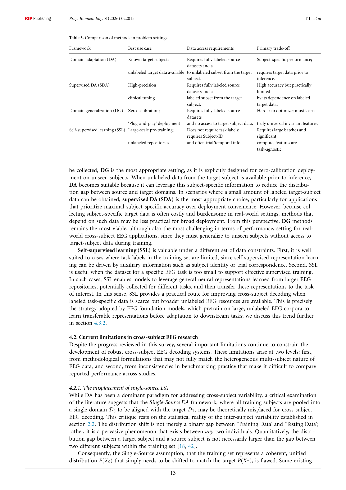

### Extraction assessment
- **Confidence:** 0.95 (meets the configured threshold).
- Machine-readable text was preserved with page-image provenance.

### Raw extracted text
```
Prog. Biomed. Eng. 8 (2026) 022013
T Li et al
Table 3. Comparison of methods in problem settings.
Framework
Best use case
Data access requirements
Primary trade-off
Domain adaptation (DA)
Known target subject;
Requires fully labeled source
datasets and a
Subject-specific performance;
unlabeled target data available to unlabeled subset from the target
subject.
requires target data prior to
inference.
Supervised DA (SDA)
High-precision
Requires fully labeled source
datasets and a
High accuracy but practically
limited
clinical tuning
labeled subset from the target
subject.
by its dependence on labeled
target data.
Domain generalization (DG)
Zero-calibration;
Requires fully labeled source
datasets
Harder to optimize; must learn
‘Plug-and-play’ deployment
and no access to target subject data.
truly universal invariant features.
Self-supervised learning (SSL) Large-scale pre-training;
Does not require task labels;
requires Subject-ID
Requires large batches and
significant
unlabeled repositories
and often trial/temporal info.
compute; features are
task-agnostic.
be collected, DG is the most appropriate setting, as it is explicitly designed for zero-calibration deploy-
ment on unseen subjects. When unlabeled data from the target subject is available prior to inference,
DA becomes suitable because it can leverage this subject-specific information to reduce the distribu-
tion gap between source and target domains. In scenarios where a small amount of labeled target-subject
data can be obtained, supervised DA (SDA) is the most appropriate choice, particularly for applications
that prioritize maximal subject-specific accuracy over deployment convenience. However, because col-
lecting subject-specific target data is often costly and burdensome in real-world settings, methods that
depend on such data may be less practical for broad deployment. From this perspective, DG methods
remains the most viable, although also the most challenging in terms of performance, setting for real-
world cross-subject EEG applications, since they must generalize to unseen subjects without access to
target-subject data during training.
Self-supervised learning (SSL) is valuable under a different set of data constraints. First, it is well
suited to cases where task labels in the training set are limited, since self-supervised representation learn-
ing can be driven by auxiliary information such as subject identity or trial correspondence. Second, SSL
is useful when the dataset for a specific EEG task is too small to support effective supervised training.
In such cases, SSL enables models to leverage general neural representations learned from larger EEG
repositories, potentially collected for different tasks, and then transfer these representations to the task
of interest. In this sense, SSL provides a practical route for improving cross-subject decoding when
labeled task-specific data is scarce but broader unlabeled EEG resources are available. This is precisely
the strategy adopted by EEG foundation models, which pretrain on large, unlabeled EEG corpora to
learn transferable representations before adaptation to downstream tasks; we discuss this trend further
in section 4.3.2.
4.2. Current limitations in cross-subject EEG research
Despite the progress reviewed in this survey, several important limitations continue to constrain the
development of robust cross-subject EEG decoding systems. These limitations arise at two levels: first,
from methodological formulations that may not fully match the heterogeneous multi-subject nature of
EEG data, and second, from inconsistencies in benchmarking practice that make it difficult to compare
reported performance across studies.
4.2.1. The misplacement of single-source DA
While DA has been a dominant paradigm for addressing cross-subject variability, a critical examination
of the literature suggests that the Single-Source DA framework, where all training subjects are pooled into
a single domain DS to be aligned with the target DT, may be theoretically misplaced for cross-subject
EEG decoding. This critique rests on the statistical reality of the inter-subject variability established in
section 2.2. The distribution shift is not merely a binary gap between ‘Training Data’ and ‘Testing Data’;
rather, it is a pervasive phenomenon that exists between any two individuals. Quantitatively, the distri-
bution gap between a target subject and a source subject is not necessarily larger than the gap between
two different subjects within the training set [18, 42].
Consequently, the Single-Source assumption, that the training set represents a coherent, unified
distribution P(XS) that simply needs to be shifted to match the target P(XT), is flawed. Some existing
13

```

## Page 15
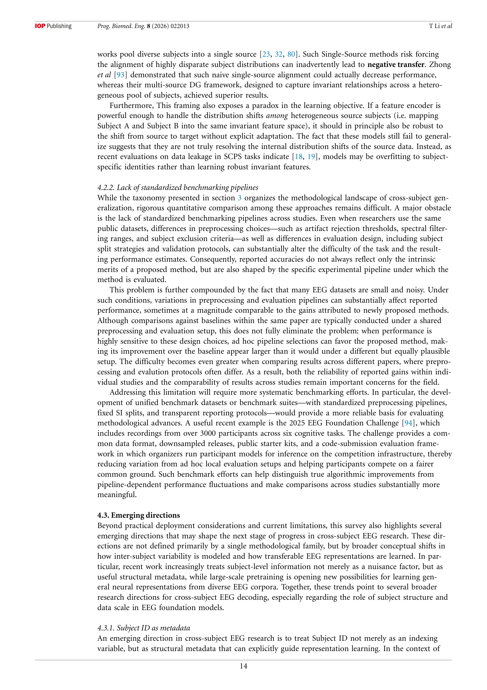

### Extraction assessment
- **Confidence:** 0.95 (meets the configured threshold).
- Machine-readable text was preserved with page-image provenance.

### Raw extracted text
```
Prog. Biomed. Eng. 8 (2026) 022013
T Li et al
works pool diverse subjects into a single source [23, 32, 80]. Such Single-Source methods risk forcing
the alignment of highly disparate subject distributions can inadvertently lead to negative transfer. Zhong
et al [93] demonstrated that such naive single-source alignment could actually decrease performance,
whereas their multi-source DG framework, designed to capture invariant relationships across a hetero-
geneous pool of subjects, achieved superior results.
Furthermore, This framing also exposes a paradox in the learning objective. If a feature encoder is
powerful enough to handle the distribution shifts among heterogeneous source subjects (i.e. mapping
Subject A and Subject B into the same invariant feature space), it should in principle also be robust to
the shift from source to target without explicit adaptation. The fact that these models still fail to general-
ize suggests that they are not truly resolving the internal distribution shifts of the source data. Instead, as
recent evaluations on data leakage in SCPS tasks indicate [18, 19], models may be overfitting to subject-
specific identities rather than learning robust invariant features.
4.2.2. Lack of standardized benchmarking pipelines
While the taxonomy presented in section 3 organizes the methodological landscape of cross-subject gen-
eralization, rigorous quantitative comparison among these approaches remains difficult. A major obstacle
is the lack of standardized benchmarking pipelines across studies. Even when researchers use the same
public datasets, differences in preprocessing choices—such as artifact rejection thresholds, spectral filter-
ing ranges, and subject exclusion criteria—as well as differences in evaluation design, including subject
split strategies and validation protocols, can substantially alter the difficulty of the task and the result-
ing performance estimates. Consequently, reported accuracies do not always reflect only the intrinsic
merits of a proposed method, but are also shaped by the specific experimental pipeline under which the
method is evaluated.
This problem is further compounded by the fact that many EEG datasets are small and noisy. Under
such conditions, variations in preprocessing and evaluation pipelines can substantially affect reported
performance, sometimes at a magnitude comparable to the gains attributed to newly proposed methods.
Although comparisons against baselines within the same paper are typically conducted under a shared
preprocessing and evaluation setup, this does not fully eliminate the problem: when performance is
highly sensitive to these design choices, ad hoc pipeline selections can favor the proposed method, mak-
ing its improvement over the baseline appear larger than it would under a different but equally plausible
setup. The difficulty becomes even greater when comparing results across different papers, where prepro-
cessing and evalution protocols often differ. As a result, both the reliability of reported gains within indi-
vidual studies and the comparability of results across studies remain important concerns for the field.
Addressing this limitation will require more systematic benchmarking efforts. In particular, the devel-
opment of unified benchmark datasets or benchmark suites—with standardized preprocessing pipelines,
fixed SI splits, and transparent reporting protocols—would provide a more reliable basis for evaluating
methodological advances. A useful recent example is the 2025 EEG Foundation Challenge [94], which
includes recordings from over 3000 participants across six cognitive tasks. The challenge provides a com-
mon data format, downsampled releases, public starter kits, and a code-submission evaluation frame-
work in which organizers run participant models for inference on the competition infrastructure, thereby
reducing variation from ad hoc local evaluation setups and helping participants compete on a fairer
common ground. Such benchmark efforts can help distinguish true algorithmic improvements from
pipeline-dependent performance fluctuations and make comparisons across studies substantially more
meaningful.
4.3. Emerging directions
Beyond practical deployment considerations and current limitations, this survey also highlights several
emerging directions that may shape the next stage of progress in cross-subject EEG research. These dir-
ections are not defined primarily by a single methodological family, but by broader conceptual shifts in
how inter-subject variability is modeled and how transferable EEG representations are learned. In par-
ticular, recent work increasingly treats subject-level information not merely as a nuisance factor, but as
useful structural metadata, while large-scale pretraining is opening new possibilities for learning gen-
eral neural representations from diverse EEG corpora. Together, these trends point to several broader
research directions for cross-subject EEG decoding, especially regarding the role of subject structure and
data scale in EEG foundation models.
4.3.1. Subject ID as metadata
An emerging direction in cross-subject EEG research is to treat Subject ID not merely as an indexing
variable, but as structural metadata that can explicitly guide representation learning. In the context of
14

```

## Page 16
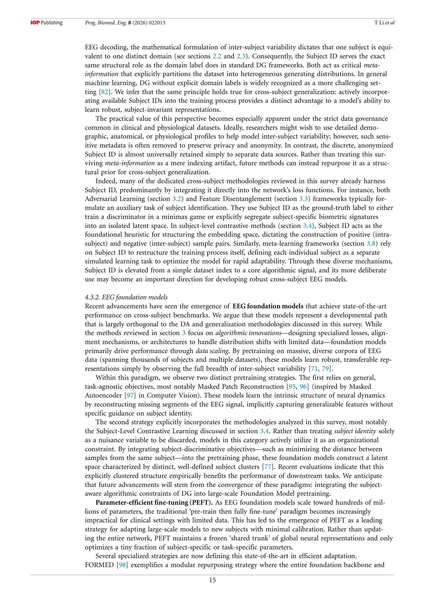

### Extraction assessment
- **Confidence:** 0.95 (meets the configured threshold).
- Machine-readable text was preserved with page-image provenance.

### Raw extracted text
```
Prog. Biomed. Eng. 8 (2026) 022013
T Li et al
EEG decoding, the mathematical formulation of inter-subject variability dictates that one subject is equi-
valent to one distinct domain (see sections 2.2 and 2.3). Consequently, the Subject ID serves the exact
same structural role as the domain label does in standard DG frameworks. Both act as critical meta-
information that explicitly partitions the dataset into heterogeneous generating distributions. In general
machine learning, DG without explicit domain labels is widely recognized as a more challenging set-
ting [82]. We infer that the same principle holds true for cross-subject generalization: actively incorpor-
ating available Subject IDs into the training process provides a distinct advantage to a model’s ability to
learn robust, subject-invariant representations.
The practical value of this perspective becomes especially apparent under the strict data governance
common in clinical and physiological datasets. Ideally, researchers might wish to use detailed demo-
graphic, anatomical, or physiological profiles to help model inter-subject variability; however, such sens-
itive metadata is often removed to preserve privacy and anonymity. In contrast, the discrete, anonymized
Subject ID is almost universally retained simply to separate data sources. Rather than treating this sur-
viving meta-information as a mere indexing artifact, future methods can instead repurpose it as a struc-
tural prior for cross-subject generalization.
Indeed, many of the dedicated cross-subject methodologies reviewed in this survey already harness
Subject ID, predominantly by integrating it directly into the network’s loss functions. For instance, both
Adversarial Learning (section 3.2) and Feature Disentanglement (section 3.3) frameworks typically for-
mulate an auxiliary task of subject identification. They use Subject ID as the ground-truth label to either
train a discriminator in a minimax game or explicitly segregate subject-specific biometric signatures
into an isolated latent space. In subject-level contrastive methods (section 3.4), Subject ID acts as the
foundational heuristic for structuring the embedding space, dictating the construction of positive (intra-
subject) and negative (inter-subject) sample pairs. Similarly, meta-learning frameworks (section 3.8) rely
on Subject ID to restructure the training process itself, defining each individual subject as a separate
simulated learning task to optimize the model for rapid adaptability. Through these diverse mechanisms,
Subject ID is elevated from a simple dataset index to a core algorithmic signal, and its more deliberate
use may become an important direction for developing robust cross-subject EEG models.
4.3.2. EEG foundation models
Recent advancements have seen the emergence of EEG foundation models that achieve state-of-the-art
performance on cross-subject benchmarks. We argue that these models represent a developmental path
that is largely orthogonal to the DA and generalization methodologies discussed in this survey. While
the methods reviewed in section 3 focus on algorithmic innovations—designing specialized losses, align-
ment mechanisms, or architectures to handle distribution shifts with limited data—foundation models
primarily drive performance through data scaling. By pretraining on massive, diverse corpora of EEG
data (spanning thousands of subjects and multiple datasets), these models learn robust, transferable rep-
resentations simply by observing the full breadth of inter-subject variability [71, 79].
Within this paradigm, we observe two distinct pretraining strategies. The first relies on general,
task-agnostic objectives, most notably Masked Patch Reconstruction [95, 96] (inspired by Masked
Autoencoder [97] in Computer Vision). These models learn the intrinsic structure of neural dynamics
by reconstructing missing segments of the EEG signal, implicitly capturing generalizable features without
specific guidance on subject identity.
The second strategy explicitly incorporates the methodologies analyzed in this survey, most notably
the Subject-Level Contrastive Learning discussed in section 3.4. Rather than treating subject identity solely
as a nuisance variable to be discarded, models in this category actively utilize it as an organizational
constraint. By integrating subject-discriminative objectives—such as minimizing the distance between
samples from the same subject—into the pretraining phase, these foundation models construct a latent
space characterized by distinct, well-defined subject clusters [77]. Recent evaluations indicate that this
explicitly clustered structure empirically benefits the performance of downstream tasks. We anticipate
that future advancements will stem from the convergence of these paradigms: integrating the subject-
aware algorithmic constraints of DG into large-scale Foundation Model pretraining.
Parameter-efficient fine-tuning (PEFT). As EEG foundation models scale toward hundreds of mil-
lions of parameters, the traditional ‘pre-train then fully fine-tune’ paradigm becomes increasingly
impractical for clinical settings with limited data. This has led to the emergence of PEFT as a leading
strategy for adapting large-scale models to new subjects with minimal calibration. Rather than updat-
ing the entire network, PEFT maintains a frozen ‘shared trunk’ of global neural representations and only
optimizes a tiny fraction of subject-specific or task-specific parameters.
Several specialized strategies are now defining this state-of-the-art in efficient adaptation.
FORMED [98] exemplifies a modular repurposing strategy where the entire foundation backbone and
15

```

## Page 17
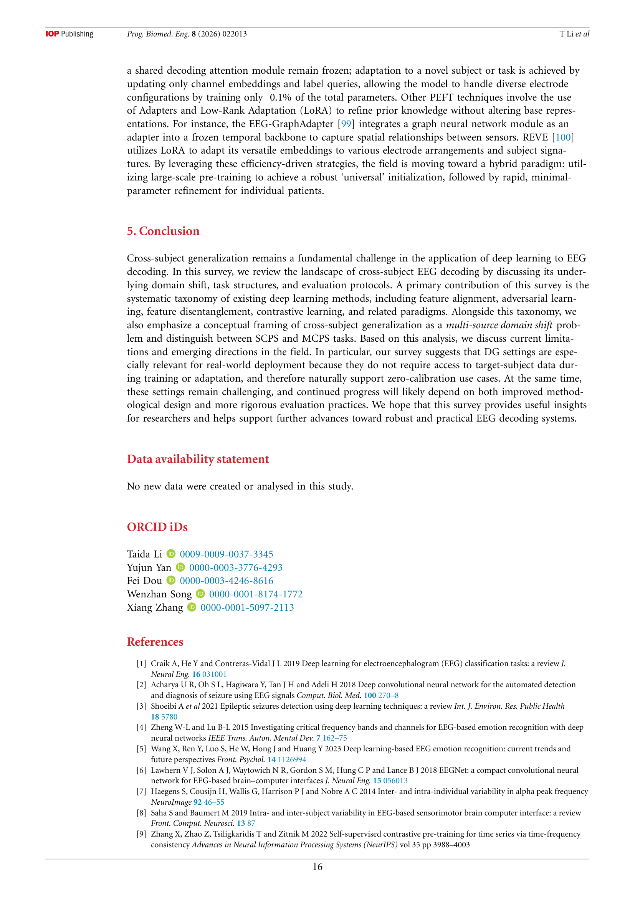

### Extraction assessment
- **Confidence:** 0.95 (meets the configured threshold).
- Machine-readable text was preserved with page-image provenance.

### Raw extracted text
```
Prog. Biomed. Eng. 8 (2026) 022013
T Li et al
a shared decoding attention module remain frozen; adaptation to a novel subject or task is achieved by
updating only channel embeddings and label queries, allowing the model to handle diverse electrode
configurations by training only 0.1% of the total parameters. Other PEFT techniques involve the use
of Adapters and Low-Rank Adaptation (LoRA) to refine prior knowledge without altering base repres-
entations. For instance, the EEG-GraphAdapter [99] integrates a graph neural network module as an
adapter into a frozen temporal backbone to capture spatial relationships between sensors. REVE [100]
utilizes LoRA to adapt its versatile embeddings to various electrode arrangements and subject signa-
tures. By leveraging these efficiency-driven strategies, the field is moving toward a hybrid paradigm: util-
izing large-scale pre-training to achieve a robust ‘universal’ initialization, followed by rapid, minimal-
parameter refinement for individual patients.
5. Conclusion
Cross-subject generalization remains a fundamental challenge in the application of deep learning to EEG
decoding. In this survey, we review the landscape of cross-subject EEG decoding by discussing its under-
lying domain shift, task structures, and evaluation protocols. A primary contribution of this survey is the
systematic taxonomy of existing deep learning methods, including feature alignment, adversarial learn-
ing, feature disentanglement, contrastive learning, and related paradigms. Alongside this taxonomy, we
also emphasize a conceptual framing of cross-subject generalization as a multi-source domain shift prob-
lem and distinguish between SCPS and MCPS tasks. Based on this analysis, we discuss current limita-
tions and emerging directions in the field. In particular, our survey suggests that DG settings are espe-
cially relevant for real-world deployment because they do not require access to target-subject data dur-
ing training or adaptation, and therefore naturally support zero-calibration use cases. At the same time,
these settings remain challenging, and continued progress will likely depend on both improved method-
ological design and more rigorous evaluation practices. We hope that this survey provides useful insights
for researchers and helps support further advances toward robust and practical EEG decoding systems.
Data availability statement
No new data were created or analysed in this study.
ORCID iDs
Taida Li 0009-0009-0037-3345
Yujun Yan 0000-0003-3776-4293
Fei Dou 0000-0003-4246-8616
Wenzhan Song 0000-0001-8174-1772
Xiang Zhang 0000-0001-5097-2113
References
[1] Craik A, He Y and Contreras-Vidal J L 2019 Deep learning for electroencephalogram (EEG) classification tasks: a review J.
Neural Eng. 16 031001
[2] Acharya U R, Oh S L, Hagiwara Y, Tan J H and Adeli H 2018 Deep convolutional neural network for the automated detection
and diagnosis of seizure using EEG signals Comput. Biol. Med. 100 270–8
[3] Shoeibi A et al 2021 Epileptic seizures detection using deep learning techniques: a review Int. J. Environ. Res. Public Health
18 5780
[4] Zheng W-L and Lu B-L 2015 Investigating critical frequency bands and channels for EEG-based emotion recognition with deep
neural networks IEEE Trans. Auton. Mental Dev. 7 162–75
[5] Wang X, Ren Y, Luo S, He W, Hong J and Huang Y 2023 Deep learning-based EEG emotion recognition: current trends and
future perspectives Front. Psychol. 14 1126994
[6] Lawhern V J, Solon A J, Waytowich N R, Gordon S M, Hung C P and Lance B J 2018 EEGNet: a compact convolutional neural
network for EEG-based brain–computer interfaces J. Neural Eng. 15 056013
[7] Haegens S, Cousijn H, Wallis G, Harrison P J and Nobre A C 2014 Inter- and intra-individual variability in alpha peak frequency
NeuroImage 92 46–55
[8] Saha S and Baumert M 2019 Intra- and inter-subject variability in EEG-based sensorimotor brain computer interface: a review
Front. Comput. Neurosci. 13 87
[9] Zhang X, Zhao Z, Tsiligkaridis T and Zitnik M 2022 Self-supervised contrastive pre-training for time series via time-frequency
consistency Advances in Neural Information Processing Systems (NeurIPS) vol 35 pp 3988–4003
16

```

## Page 18


### Extraction assessment
- **Confidence:** 0.95 (meets the configured threshold).
- Machine-readable text was preserved with page-image provenance.

### Raw extracted text
```
Prog. Biomed. Eng. 8 (2026) 022013
T Li et al
[10] Wang Y, Huang N, Li T, Yan Y and Zhang X 2024 Medformer: a multi-granularity patching transformer for medical time-series
classification Advances in Neural Information Processing Systems
[11] Fan W, Fei J, Guo D, Yi K, Song X, Xiang H, Ye H and Li M 2025 MedGNN: towards multi-resolution spatiotemporal graph
learning for medical time series classification (arXiv:2502.04515)
[12] Apicella A, Arpaia P, D’Errico G, Marocco D, Mastrati G, Moccaldi N and Prevete R 2024 Toward cross-subject and cross-session
generalization in EEG-based emotion recognition: systematic review, taxonomy and methods Neurocomputing 604 128354
[13] Shafiezadeh S, Duma G M, Pozza M and Testolin A 2024 A systematic review of cross-patient approaches for EEG epileptic
seizure prediction J. Neural Eng. 21 061004
[14] Özdenizci O, Wang Y, Koike-Akino T and Erdo˘gmus¸ D 2020 Learning invariant representations from EEG via adversarial infer-
ence IEEE Access 8 27074–85
[15] Zhang Z, Ji T, Xiao M, Wang W, Yu G, Lin T, Jiang Y, Zhou X and Lin Z 2024 Cross-patient automatic epileptic seizure detection
using patient-adversarial neural networks with spatio-temporal EEG augmentation Biomed. Signal Process. Control 89 105664
[16] Shen X, Liu X, Hu X, Zhang D and Song S 2023 Contrastive learning of subject-invariant EEG representations for cross-subject
emotion recognition IEEE Trans. Affect. Comput. 14 2496–511
[17] Fazli S, Grozea C, Danoczy M, Blankertz B, Popescu F and Müller K-R 2009 Subject independent EEG-based BCI decoding
Advances in Neural Information Processing Systems (NIPS) vol 22 pp 513–21
[18] Wang Y, Li T, Yan Y, Song W and Zhang X 2024 How to evaluate your medical time series classification? (arXiv:2410.03057)
[19] Brookshire G, Kasper J, Blauch N M, Wu Y C, Glatt R M, Merrill D A, Gerrol S, Yoder K J, Quirk C and Lucero C 2024 Data leak-
age in deep learning studies of translational EEG Front. Neurosci. 18 1373515
[20] Schalk G, McFarland D J, Hinterberger T, Birbaumer N and Wolpaw J R 2004 Bci2000: a general-purpose brain-computer inter-
face (BCI) system IEEE Trans. Biomed. Eng. 51 1034–43
[21] Xu L, Xu M, Ke Y, An X, Liu S and Ming D 2020 Cross-dataset variability problem in EEG decoding with deep learning Front.
Hum. Neurosci. 14 103
[22] Leeb R, Brunner C, Müller-Putz G, Schlögl A and Pfurtscheller G 2008 BCI Competition 2008–Graz Data Set B vol 16 (Graz
University of Technology) pp 1–6
[23] Song Y, Zheng Q, Wang Q, Gao X and Heng P-A 2023 Global adaptive transformer for cross-subject enhanced EEG classification
IEEE Trans. Neural Syst. Rehabil. Eng. 31 2767–77
[24] Cho H, Ahn M, Ahn S, Kwon M and Jun S C 2017 EEG datasets for motor imagery brain–computer interface GigaScience
6 gix034
[25] Lee M-H, Kwon O-Y, Kim Y-J, Kim H-K, Lee Y-E, Williamson J, Fazli S and Lee S-W 2019 EEG dataset and OpenBMI toolbox
for three BCI paradigms: an investigation into BCI illiteracy GigaScience 8 giz002
[26] Zheng Y, Wu S, Chen J, Yao Q and Zheng S 2025 Cross-subject motor imagery electroencephalogram decoding with domain
generalization Bioengineering 12 495
[27] Kobler R J, Hirayama J-I, Zhao Q and Kawanabe M 2022 SPD domain-specific batch normalization to crack interpretable unsu-
pervised domain adaptation in EEG Advances in Neural Information Processing Systems (NeurIPS) vol 35 pp 10664–77
[28] Kwak Y, Kong K, Song W-J and Kim S-E 2023 Subject-invariant deep neural networks based on baseline correction for EEG
motor imagery BCI IEEE J. Biomed. Health Inform. 27 1801–12
[29] Ng H W and Guan C 2024 Subject-independent meta-learning framework towards optimal training of EEG-based classifiers
Neural Netw. 172 106108
[30] Brunner C, Leeb R, Müller-Putz G, Schlögl A and Pfurtscheller G 2008 BCI Competition 2008–Graz Data Set A vol 16 (Institute
for Knowledge Discovery (Laboratory of Brain-Computer Interfaces), Graz University of Technology) p 34
[31] Tangermann M et al 2012 Review of the BCI competition IV Front. Neurosci. 6 55
[32] Hang W, Feng W, Du R, Liang S, Chen Y, Wang Q and Liu X 2019 Cross-subject EEG signal recognition using deep domain
adaptation network IEEE Access 7 128273–82
[33] Jiang X, Meng L, Wang Z and Wu D 2024 Deep source semi-supervised transfer learning (DS3TL) for cross-subject EEG classi-
fication IEEE Trans. Biomed. Eng. 71 1308–18
[34] Feng J, Li Y, Jiang C, Liu Y, Li M and Hu Q 2022 Classification of motor imagery electroencephalogram signals by using adaptive
cross-subject transfer learning Front. Hum. Neurosci. 16 1068165
[35] Zhang H, Ji H, Yu J, Li J, Jin L, Liu L, Bai Z and Ye C 2023 Subject-independent EEG classification based on a hybrid neural net-
work Front. Neurosci. 17 1124089
[36] Stieger J R, Engel S A and He B 2021 Continuous sensorimotor rhythm based brain computer interface learning in a large popu-
lation Sci. Data 8 98
[37] Weibo Y 2014 EEG data of simple and compound limb motor imagery (Harvard Dataverse) https://doi.org/10.7910/DVN/27306
[38] Dornhege G, Blankertz B, Curio G and Muller K-R 2004 Boosting bit rates in noninvasive EEG single-trial classifications by fea-
ture combination and multiclass paradigms IEEE Trans. Biomed. Eng. 51 993–1002
[39] Xue J, Wang J, Hu S, Bi N and Lv Z 2022 OVPD: odor-video elicited physiological signal database for emotion recognition IEEE
Trans. Instrum. Meas. 71 1–12
[40] Zhang L, Xiao D, Guo X, Li F, Liang W and Zhou B 2023 Cross-subject emotion EEG signal recognition based on source micro-
state analysis Front. Neurosci. 17 1288580
[41] Zheng W, Liu W, Lu Y, Lu B and Cichocki A 2018 EmotionMeter: a multimodal framework for recognizing human emotions
IEEE Trans. Cybern. 49 1110–22
[42] Yu P, He X, Li H, Dou H, Tan Y, Wu H and Chen B 2025 FMLAN: a novel framework for cross-subject and cross-session EEG
emotion recognition Biomed. Signal Process. Control 100 106912
[43] She Q, Zhang C, Fang F, Ma Y and Zhang Y 2023 Multisource associate domain adaptation for cross-subject and cross-session
EEG emotion recognition IEEE Trans. Instrum. Meas. 72 2515512
[44] Duan R-N, Zhu J-Y and Lu B-L 2013 Differential entropy feature for EEG-based emotion classification 6th Int. IEEE/EMBS Conf.
on Neural Engineering (NER) (IEEE) pp 81–84
[45] She Q, Shi X, Fang F, Ma Y and Zhang Y 2023 Cross-subject EEG emotion recognition using multi-source domain manifold fea-
ture selection Comput. Biol. Med. 159 106860
[46] Bao G, Zhuang N, Tong L, Yan B, Shu J, Wang L, Zeng Y and Shen Z 2021 Two-level domain adaptation neural network for EEG-
based emotion recognition Front. Hum. Neurosci. 14 605246
[47] Hwang S, Ki M, Hong K and Byun H 2020 Subject-independent EEG-based emotion recognition using adversarial learning 2020
8th Int. Winter Conf. on Brain-Computer Interface (BCI) (IEEE) pp 1–4
17

```

## Page 19


### Extraction assessment
- **Confidence:** 0.95 (meets the configured threshold).
- Machine-readable text was preserved with page-image provenance.

### Raw extracted text
```
Prog. Biomed. Eng. 8 (2026) 022013
T Li et al
[48] Alameer H R A, Salehpour P, Aghdasi S H and Feizi-Derakhshi M-R 2024 Cross-subject EEG-based emotion recognition using
deep metric learning and adversarial training IEEE Access 12 130241–52
[49] Ahmed Md Z I, Sinha N, Ghaderpour E, Phadikar S and Ghosh R 2023 A novel baseline removal paradigm for subject-
independent features in emotion classification using EEG Bioengineering 10 54
[50] Li J, Hua H, Xu Z, Shu L, Xu X, Kuang F and Wu S 2022 Cross-subject EEG emotion recognition combined with connectivity
features and meta-transfer learning Comput. Biol. Med. 145 105519
[51] Liu X-H, Lu B-L and Zheng W-L 2025 mixEEG: enhancing EEG federated learning for cross-subject EEG classification with
tailored mixup Proc. Annual Meeting of the Cognitive Science Society vol 47
[52] Koelstra S, Muhl C, Soleymani M, Lee J-S, Yazdani A, Ebrahimi T, Pun T, Nijholt A and Patras I 2011 Deap: a database for emo-
tion analysis; using physiological signals IEEE Trans. Affect. Comput. 3 18–31
[53] Bhosale S, Chakraborty R and Kopparapu S K 2022 Calibration free meta learning based approach for subject independent EEG
emotion recognition Biomed. Signal Process. Control 72 103289
[54] Hinss M F, Darmet L, Somon B, Jahanpour E, Lotte F, Ladouce S and Roy R N 2021 An EEG dataset for cross-session mental
workload estimation: passive BCI competition of the neuroergonomics conference 2021 Zenodo https://doi.org/10.5281/zenodo.
4917217
[55] Treder M S, Bahramisharif A, Schmidt N M, Van Gerven M A J and Blankertz B 2011 Brain-computer interfacing using modula-
tions of alpha activity induced by covert shifts of attention J. Neuroeng. Rehabil. 8 24
[56] Fahimi F, Zhang Z, Goh W B, Lee T-S, Ang K K and Guan C 2019 Inter-subject transfer learning with an end-to-end deep con-
volutional neural network for EEG-based BCI J. Neural Eng. 16 026007
[57] Nieto N, Peterson V, Rufiner H L, Kamienkowski J E and Spies R 2022 Thinking out loud, an open-access EEG-based BCI dataset
for inner speech recognition Sci. Data 9 52
[58] Kemp B 2013 Sleep-EDF database expanded (version 1.0.0) (PhysioNet) (available at: https://physionet.org/content/sleep-
edfx/1.0.0/)
[59] Yang C, Westover M B and Sun J 2023 ManyDG: many-domain generalization for healthcare applications 11th Int. Conf. on
Learning Representations
[60] Guttag J 2010 CHB-MIT scalp EEG database (version 1.0.0) (PhysioNet) (https://doi.org/10.13026/C2K01R)
[61] Shoeb A H 2009 Application of machine learning to epileptic seizure onset detection and treatment PhD Thesis Massachusetts
Institute of Technology
[62] Jemal I, Abou-Abbas L, Henni K, Mitiche A and Mezghani N 2024 Domain adaptation for EEG-based, cross-subject epileptic
seizure prediction Front. Neuroinform. 18 1303380
[63] Zhang Z, Liu A, Gao Y, Qian R and Chen X 2025 Cross-patient seizure prediction via continuous domain adaptation and similar
sample replay Cogn. Neurodyn. 19 26
[64] Ke N, Lin T, Lin Z, Zhou X and Ji T 2022 Convolutional transformer networks for epileptic seizure detection Proc. 31st ACM Int.
Conf. on Information & Knowledge Management (Atlanta, GA, USA, 17–21 October 2022) ed M A Hasan and L Xiong (ACM) pp
4109–13
[65] Albaqami H, Hassan G M and Datta A 2025 Dataset: TUH EEG seizure corpus (TUSZ) (Dataset) https://doi.org/10.57702/
vqllyj31
[66] Zhang X, Yao L, Dong M, Liu Z, Zhang Y and Li Y 2020 Adversarial representation learning for robust patient-independent epi-
leptic seizure detection IEEE J. Biomed. Health Inform. 24 2852–9
[67] Tu S, Cao L, Zhang D, Chen J, Ma L, Zhang Y and Yang Y 2024 DMNet: self-comparison driven model for subject-independent
seizure detection Advances in Neural Information Processing Systems (NeurIPS) vol 37 pp 28254–80
[68] Wu Y, Yang Y, Xiao J S, Zhou C, Sui H and Li H 2024 Invariant spatiotemporal representation learning for cross-patient seizure
classification NeurIPS 2024 Workshop on NeuroAI
[69] Detti P 2020 Siena scalp EEG database (version 1.0.0) (PhysioNet) (available at: https://physionet.org/content/siena-scalp-
eeg/1.0.0/)
[70] Miltiadous A et al 2023 A dataset of scalp EEG recordings of Alzheimer’s disease, frontotemporal dementia and healthy subjects
from routine EEG Data 8 95
[71] Wang Y, Huang N, Mammone N, Cecchi M and Zhang X 2025 LEAD: large foundation model for EEG-based Alzheimer’s dis-
ease detection (arXiv:2502.01678)
[72] Lahijanian M, Aghajan H and Vahabi Z 2024 40Hz auditory entrainment (OpenNeuro) https://doi.org/10.18112/openneuro.
ds005048.v1.0.0
[73] Prado P et al 2023 The brainlat project, a multimodal neuroimaging dataset of neurodegeneration from underrepresented back-
grounds Sci. Data 10 889
[74] Shor O, Glik A, Yaniv-Rosenfeld A, Valevski A, Weizman A, Khrennikov A and Benninger F 2021 EEG p-adic quantum potential
accurately identifies depression, schizophrenia and cognitive decline PLoS One 16 e0255529
[75] van Dijk H, van Wingen G, Denys D, Olbrich S, van Ruth R and Arns M 2022 The two decades brainclinics research archive for
insights in neurophysiology (TDBRAIN) database Sci. Data 9 333
[76] van Dijk H, van Wingen G, Denys D, Olbrich S, van Ruth R and Arns M 2021 Two decades—brainclinics research archive for
insights in neurophysiology (TD-BRAIN) (Dataset (Synapse)) https://doi.org/10.7303/syn25671079
[77] Wang Y, Han Y, Wang H and Zhang X 2023 Contrast everything: a hierarchical contrastive framework for medical time-series
Advances in Neural Information Processing Systems (NeurIPS) vol 36 pp 64601–24
[78] Obeid I and Picone J 2016 The Temple University Hospital EEG data corpus Front. Neurosci. 10 196
[79] Zheng R, Mao L, Han D, Luo T, Wang Y, Ding J and Yu Y 2025 FAPEX: fractional amplitude-phase expressor for robust cross-
subject seizure prediction Advances in Neural Information Processing Systems (NeurIPS)
[80] Li J, Zhang K, Yang S, Wang Y, Li Q and Ma K-K 2022 Dynamic domain adaptation for class-aware cross-subject and cross-
session EEG emotion recognition IEEE Trans. Instrum. Meas. 71 5964–73
[81] Shi X, She Q, Fang F, Meng M, Tan T and Zhang Y 2024 Enhancing cross-subject EEG emotion recognition through multi-
source manifold metric transfer learning Comput. Biol. Med. 174 108445
[82] Zhou K, Liu Z, Qiao Y, Xiang T and Loy C C 2022 Domain generalization: a survey IEEE Trans. Pattern Anal. Mach. Intell.
45 4396–415
[83] Wang J, Lan C, Liu C, Ouyang Y, Qin T, Lu W, Chen Y, Zeng W and Yu P S 2022 Generalizing to unseen domains: a survey on
domain generalization IEEE Trans. Knowl. Data Eng. 35 8052–72
18

```

## Page 20


### Extraction assessment
- **Confidence:** 0.95 (meets the configured threshold).
- Machine-readable text was preserved with page-image provenance.

### Raw extracted text
```
Prog. Biomed. Eng. 8 (2026) 022013
T Li et al
[84] Wei X, Narayan J and Faisal A A 2025 The sandwich meta-framework for architecture agnostic deep privacy-preserving transfer
learning for non-invasive brainwave decoding J. Neural Eng. 22 016014
[85] Kiyasseh D, Zhu T and Clifton D A 2021 CLOCS: contrastive learning of cardiac signals across space, time and patients Proc. 38th
Int. Conf. on Machine Learning (ICML) (Proc. Machine Learning Research) vol 139 (PMLR) pp 5606–15
[86] Mentzelopoulos G, Chatzipantazis E, Ramayya A G, Hedlund M J, Buch V P, Daniilidis K, Kording K P and Vitale F 2024 Neural
decoding from stereotactic EEG: accounting for electrode variability across subjects Advances in Neural Information Processing
Systems (NeurIPS) vol 37 pp 108600–24
[87] Xu J, Chen Y, Dong X, Lan M, Huang T, Bian Q, Cheng J and Ke Y 2025 BrainOOD: out-of-distribution generalizable brain net-
work analysis 13th Int. Conf. on Learning Representations (ICLR)
[88] Long M, Cao Y, Wang J and Jordan M 2015 Learning transferable features with deep adaptation networks Int. Conf. on Machine
Learning (PMLR) pp 97–105
[89] Sun B and Saenko K 2016 Deep coral: correlation alignment for deep domain adaptation European Conf. on Computer Vision
(Springer) pp 443–50
[90] Goodfellow I J, Pouget-Abadie J, Mirza M, Xu B, Warde-Farley D, Ozair S, Courville A and Bengio Y 2014 Generative adversarial
nets Advances in Neural Information Processing Systems vol 27
[91] Ganin Y and Lempitsky V 2015 Unsupervised domain adaptation by backpropagation Proc. 32nd Int. Conf. on Machine Learning
(ICML) vol 37 pp 1180–9
[92] Chen T, Kornblith S, Norouzi M and Hinton G 2020 A simple framework for contrastive learning of visual representations Int.
Conf. on Machine Learning (PMLR) pp 1597–607
[93] Zhong X-C, Wang Q, Liu D, Chen Z, Liao J-X, Sun J, Zhang Y and Fan F-L 2024 EEG-DG: a multi-source domain generalization
framework for motor imagery EEG classification IEEE J. Biomed. Health Inform. 29 2484–95
[94] Aristimunha B et al 2025 EEG foundation challenge: from cross-task to cross-subject EEG decoding (arXiv:2506.19141)
[95] Jiang W-B, Zhao L-M and Lu B-L 2024 Large brain model for learning generic representations with tremendous EEG data in
BCI 12th Int. Conf. on Learning Representations
[96] Wang J, Zhao S, Luo Z, Zhou Y, Jiang H, Li S, Li T and Pan G 2024 CBraMod: a criss-cross brain foundation model for EEG
decoding (arXiv:2412.07236)
[97] He K, Chen X, Xie S, Li Y, Dollár P and Girshick R 2022 Masked autoencoders are scalable vision learners Proc. IEEE/CVF Conf.
on Computer Vision and Pattern Recognition pp 16000–9
[98] Huang N, Wang H, He Z, Zitnik M and Zhang X 2026 Repurposing foundation model for generalizable medical time series clas-
sification 14th Int. Conf. on Learning Representations
[99] Suzumura T, Kanezashi H and Akahori S 2024 Graph adapter of EEG foundation models for parameter efficient fine tuning
(arXiv:2411.16155)
[100] Ouahidi Y E, Lys J, Thölke P, Farrugia N, Pasdeloup B, Gripon V, Jerbi K and Lioi G 2025 REVE: a foundation model for EEG—
adapting to any setup with large-scale pretraining on 25,000 subjects 39th Annual Conf. on Neural Information Processing Systems
19

```
