# brainsci-16-00363

## Source
- PDF: `/Users/diego/Desktop/Proyectos/papersmith-ai/guidance/paper-guide/source/brainsci-16-00363.pdf`
- Source SHA-256: `ee139be2960bdfdfde414da8ff30edefe9077f255d7f69cfbaf923386c1a1f04`
- Rendered pages: 23 at 200 DPI (PyMuPDF).
- Confidence threshold: 0.85.
- Table policy: lite evidence only. Possible tables are retained only as exact raw page text and rendered page images; no rows, columns, cells, or inferred values are extracted.
- Equation policy: equation candidates retain exact raw extracted text; this extractor does not synthesize LaTeX.

## Page 1
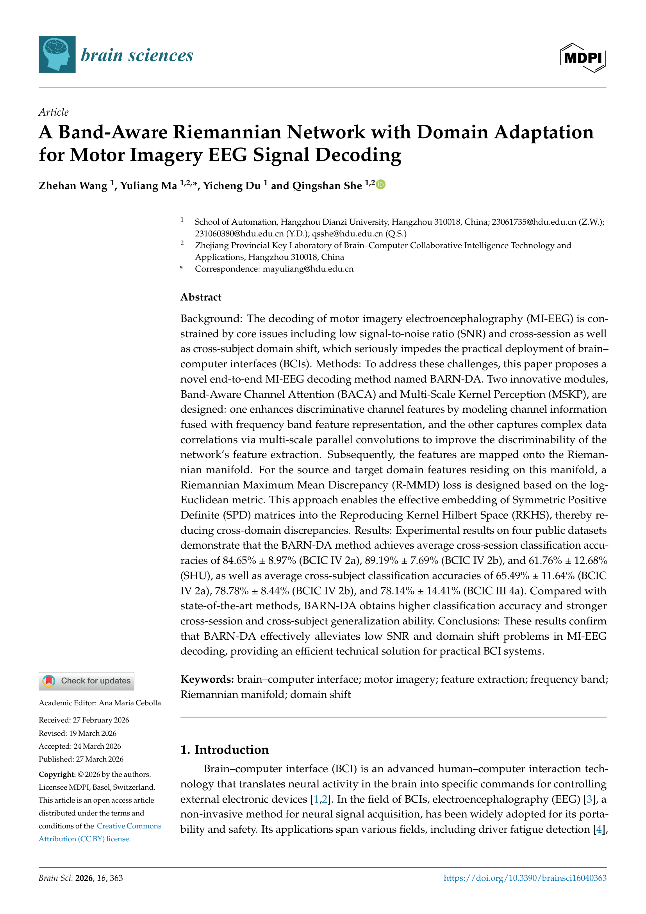

### Extraction assessment
- **Confidence:** 0.65 (below the configured 0.85 threshold; human review required).
- One or more equation candidates are ambiguous in raw extraction.

### Raw extracted text
```
Academic Editor: Ana Maria Cebolla
Received: 27 February 2026
Revised: 19 March 2026
Accepted: 24 March 2026
Published: 27 March 2026
Copyright: © 2026 by the authors.
Licensee MDPI, Basel, Switzerland.
This article is an open access article
distributed under the terms and
conditions of the Creative Commons
Attribution (CC BY) license.
Article
A Band-Aware Riemannian Network with Domain Adaptation
for Motor Imagery EEG Signal Decoding
Zhehan Wang 1, Yuliang Ma 1,2,*, Yicheng Du 1 and Qingshan She 1,2
1
School of Automation, Hangzhou Dianzi University, Hangzhou 310018, China; 23061735@hdu.edu.cn (Z.W.);
231060380@hdu.edu.cn (Y.D.); qsshe@hdu.edu.cn (Q.S.)
2
Zhejiang Provincial Key Laboratory of Brain–Computer Collaborative Intelligence Technology and
Applications, Hangzhou 310018, China
*
Correspondence: mayuliang@hdu.edu.cn
Abstract
Background: The decoding of motor imagery electroencephalography (MI-EEG) is con-
strained by core issues including low signal-to-noise ratio (SNR) and cross-session as well
as cross-subject domain shift, which seriously impedes the practical deployment of brain–
computer interfaces (BCIs). Methods: To address these challenges, this paper proposes a
novel end-to-end MI-EEG decoding method named BARN-DA. Two innovative modules,
Band-Aware Channel Attention (BACA) and Multi-Scale Kernel Perception (MSKP), are
designed: one enhances discriminative channel features by modeling channel information
fused with frequency band feature representation, and the other captures complex data
correlations via multi-scale parallel convolutions to improve the discriminability of the
network’s feature extraction. Subsequently, the features are mapped onto the Rieman-
nian manifold. For the source and target domain features residing on this manifold, a
Riemannian Maximum Mean Discrepancy (R-MMD) loss is designed based on the log-
Euclidean metric. This approach enables the effective embedding of Symmetric Positive
Definite (SPD) matrices into the Reproducing Kernel Hilbert Space (RKHS), thereby re-
ducing cross-domain discrepancies. Results: Experimental results on four public datasets
demonstrate that the BARN-DA method achieves average cross-session classification accu-
racies of 84.65% ± 8.97% (BCIC IV 2a), 89.19% ± 7.69% (BCIC IV 2b), and 61.76% ± 12.68%
(SHU), as well as average cross-subject classification accuracies of 65.49% ± 11.64% (BCIC
IV 2a), 78.78% ± 8.44% (BCIC IV 2b), and 78.14% ± 14.41% (BCIC III 4a). Compared with
state-of-the-art methods, BARN-DA obtains higher classification accuracy and stronger
cross-session and cross-subject generalization ability. Conclusions: These results confirm
that BARN-DA effectively alleviates low SNR and domain shift problems in MI-EEG
decoding, providing an efficient technical solution for practical BCI systems.
Keywords: brain–computer interface; motor imagery; feature extraction; frequency band;
Riemannian manifold; domain shift
1. Introduction
Brain–computer interface (BCI) is an advanced human–computer interaction tech-
nology that translates neural activity in the brain into specific commands for controlling
external electronic devices [1,2]. In the field of BCIs, electroencephalography (EEG) [3], a
non-invasive method for neural signal acquisition, has been widely adopted for its porta-
bility and safety. Its applications span various fields, including driver fatigue detection [4],
Brain Sci. 2026, 16, 363
https://doi.org/10.3390/brainsci16040363

```

### Equation candidates
- `page-001-equation-001` — review_required (confidence 0.45; page 1).
```
racies of 84.65% ± 8.97% (BCIC IV 2a), 89.19% ± 7.69% (BCIC IV 2b), and 61.76% ± 12.68%
```
- `page-001-equation-002` — review_required (confidence 0.45; page 1).
```
(SHU), as well as average cross-subject classification accuracies of 65.49% ± 11.64% (BCIC
```
- `page-001-equation-003` — review_required (confidence 0.45; page 1).
```
IV 2a), 78.78% ± 8.44% (BCIC IV 2b), and 78.14% ± 14.41% (BCIC III 4a). Compared with
```

## Page 2
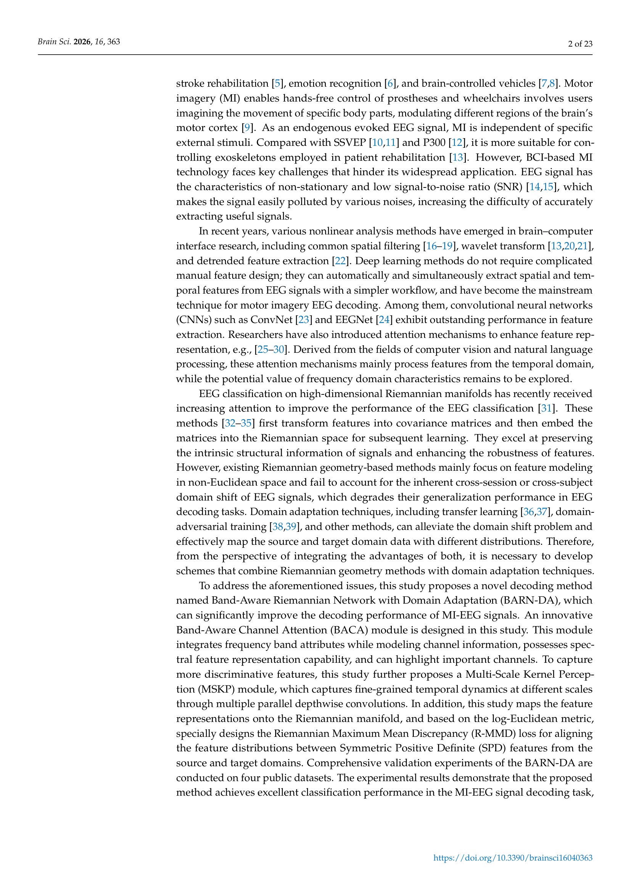

### Extraction assessment
- **Confidence:** 0.95 (meets the configured threshold).
- Machine-readable text was preserved with page-image provenance.

### Raw extracted text
```
Brain Sci. 2026, 16, 363
2 of 23
stroke rehabilitation [5], emotion recognition [6], and brain-controlled vehicles [7,8]. Motor
imagery (MI) enables hands-free control of prostheses and wheelchairs involves users
imagining the movement of specific body parts, modulating different regions of the brain’s
motor cortex [9]. As an endogenous evoked EEG signal, MI is independent of specific
external stimuli. Compared with SSVEP [10,11] and P300 [12], it is more suitable for con-
trolling exoskeletons employed in patient rehabilitation [13]. However, BCI-based MI
technology faces key challenges that hinder its widespread application. EEG signal has
the characteristics of non-stationary and low signal-to-noise ratio (SNR) [14,15], which
makes the signal easily polluted by various noises, increasing the difficulty of accurately
extracting useful signals.
In recent years, various nonlinear analysis methods have emerged in brain–computer
interface research, including common spatial filtering [16–19], wavelet transform [13,20,21],
and detrended feature extraction [22]. Deep learning methods do not require complicated
manual feature design; they can automatically and simultaneously extract spatial and tem-
poral features from EEG signals with a simpler workflow, and have become the mainstream
technique for motor imagery EEG decoding. Among them, convolutional neural networks
(CNNs) such as ConvNet [23] and EEGNet [24] exhibit outstanding performance in feature
extraction. Researchers have also introduced attention mechanisms to enhance feature rep-
resentation, e.g., [25–30]. Derived from the fields of computer vision and natural language
processing, these attention mechanisms mainly process features from the temporal domain,
while the potential value of frequency domain characteristics remains to be explored.
EEG classification on high-dimensional Riemannian manifolds has recently received
increasing attention to improve the performance of the EEG classification [31]. These
methods [32–35] first transform features into covariance matrices and then embed the
matrices into the Riemannian space for subsequent learning. They excel at preserving
the intrinsic structural information of signals and enhancing the robustness of features.
However, existing Riemannian geometry-based methods mainly focus on feature modeling
in non-Euclidean space and fail to account for the inherent cross-session or cross-subject
domain shift of EEG signals, which degrades their generalization performance in EEG
decoding tasks. Domain adaptation techniques, including transfer learning [36,37], domain-
adversarial training [38,39], and other methods, can alleviate the domain shift problem and
effectively map the source and target domain data with different distributions. Therefore,
from the perspective of integrating the advantages of both, it is necessary to develop
schemes that combine Riemannian geometry methods with domain adaptation techniques.
To address the aforementioned issues, this study proposes a novel decoding method
named Band-Aware Riemannian Network with Domain Adaptation (BARN-DA), which
can significantly improve the decoding performance of MI-EEG signals. An innovative
Band-Aware Channel Attention (BACA) module is designed in this study. This module
integrates frequency band attributes while modeling channel information, possesses spec-
tral feature representation capability, and can highlight important channels. To capture
more discriminative features, this study further proposes a Multi-Scale Kernel Percep-
tion (MSKP) module, which captures fine-grained temporal dynamics at different scales
through multiple parallel depthwise convolutions. In addition, this study maps the feature
representations onto the Riemannian manifold, and based on the log-Euclidean metric,
specially designs the Riemannian Maximum Mean Discrepancy (R-MMD) loss for aligning
the feature distributions between Symmetric Positive Definite (SPD) features from the
source and target domains. Comprehensive validation experiments of the BARN-DA are
conducted on four public datasets. The experimental results demonstrate that the proposed
method achieves excellent classification performance in the MI-EEG signal decoding task,
https://doi.org/10.3390/brainsci16040363

```

## Page 3
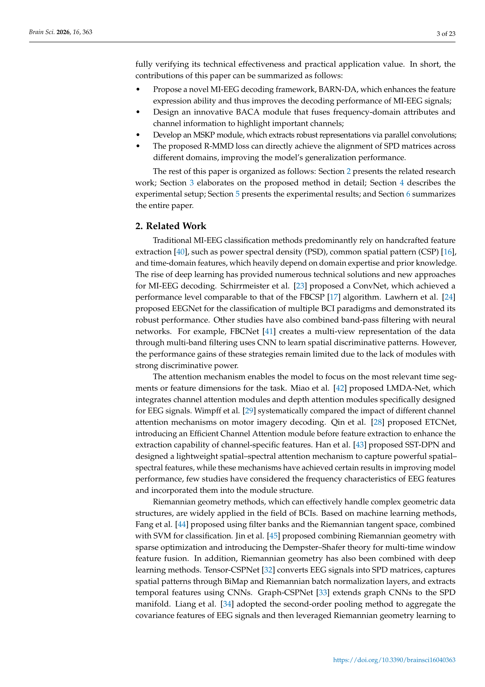

### Extraction assessment
- **Confidence:** 0.95 (meets the configured threshold).
- Machine-readable text was preserved with page-image provenance.

### Raw extracted text
```
Brain Sci. 2026, 16, 363
3 of 23
fully verifying its technical effectiveness and practical application value. In short, the
contributions of this paper can be summarized as follows:
•
Propose a novel MI-EEG decoding framework, BARN-DA, which enhances the feature
expression ability and thus improves the decoding performance of MI-EEG signals;
•
Design an innovative BACA module that fuses frequency-domain attributes and
channel information to highlight important channels;
•
Develop an MSKP module, which extracts robust representations via parallel convolutions;
•
The proposed R-MMD loss can directly achieve the alignment of SPD matrices across
different domains, improving the model’s generalization performance.
The rest of this paper is organized as follows: Section 2 presents the related research
work; Section 3 elaborates on the proposed method in detail; Section 4 describes the
experimental setup; Section 5 presents the experimental results; and Section 6 summarizes
the entire paper.
2. Related Work
Traditional MI-EEG classification methods predominantly rely on handcrafted feature
extraction [40], such as power spectral density (PSD), common spatial pattern (CSP) [16],
and time-domain features, which heavily depend on domain expertise and prior knowledge.
The rise of deep learning has provided numerous technical solutions and new approaches
for MI-EEG decoding. Schirrmeister et al. [23] proposed a ConvNet, which achieved a
performance level comparable to that of the FBCSP [17] algorithm. Lawhern et al. [24]
proposed EEGNet for the classification of multiple BCI paradigms and demonstrated its
robust performance. Other studies have also combined band-pass filtering with neural
networks. For example, FBCNet [41] creates a multi-view representation of the data
through multi-band filtering uses CNN to learn spatial discriminative patterns. However,
the performance gains of these strategies remain limited due to the lack of modules with
strong discriminative power.
The attention mechanism enables the model to focus on the most relevant time seg-
ments or feature dimensions for the task. Miao et al. [42] proposed LMDA-Net, which
integrates channel attention modules and depth attention modules specifically designed
for EEG signals. Wimpff et al. [29] systematically compared the impact of different channel
attention mechanisms on motor imagery decoding. Qin et al. [28] proposed ETCNet,
introducing an Efficient Channel Attention module before feature extraction to enhance the
extraction capability of channel-specific features. Han et al. [43] proposed SST-DPN and
designed a lightweight spatial–spectral attention mechanism to capture powerful spatial–
spectral features, while these mechanisms have achieved certain results in improving model
performance, few studies have considered the frequency characteristics of EEG features
and incorporated them into the module structure.
Riemannian geometry methods, which can effectively handle complex geometric data
structures, are widely applied in the field of BCIs. Based on machine learning methods,
Fang et al. [44] proposed using filter banks and the Riemannian tangent space, combined
with SVM for classification. Jin et al. [45] proposed combining Riemannian geometry with
sparse optimization and introducing the Dempster–Shafer theory for multi-time window
feature fusion. In addition, Riemannian geometry has also been combined with deep
learning methods. Tensor-CSPNet [32] converts EEG signals into SPD matrices, captures
spatial patterns through BiMap and Riemannian batch normalization layers, and extracts
temporal features using CNNs. Graph-CSPNet [33] extends graph CNNs to the SPD
manifold. Liang et al. [34] adopted the second-order pooling method to aggregate the
covariance features of EEG signals and then leveraged Riemannian geometry learning to
https://doi.org/10.3390/brainsci16040363

```

## Page 4
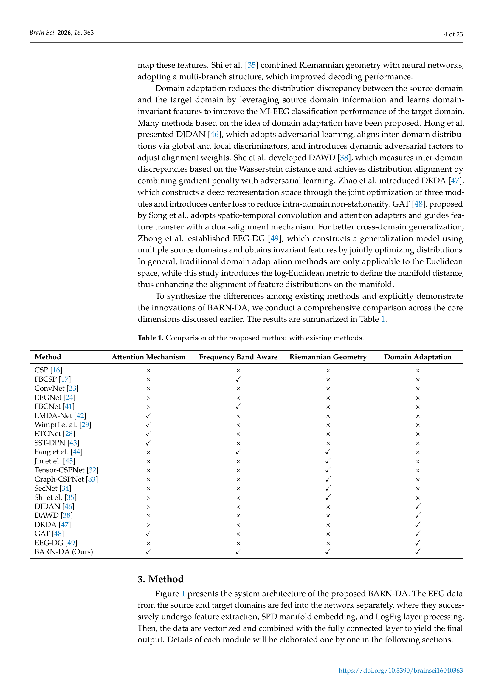

### Extraction assessment
- **Confidence:** 0.65 (below the configured 0.85 threshold; human review required).
- One or more equation candidates are ambiguous in raw extraction.

### Raw extracted text
```
Brain Sci. 2026, 16, 363
4 of 23
map these features. Shi et al. [35] combined Riemannian geometry with neural networks,
adopting a multi-branch structure, which improved decoding performance.
Domain adaptation reduces the distribution discrepancy between the source domain
and the target domain by leveraging source domain information and learns domain-
invariant features to improve the MI-EEG classification performance of the target domain.
Many methods based on the idea of domain adaptation have been proposed. Hong et al.
presented DJDAN [46], which adopts adversarial learning, aligns inter-domain distribu-
tions via global and local discriminators, and introduces dynamic adversarial factors to
adjust alignment weights. She et al. developed DAWD [38], which measures inter-domain
discrepancies based on the Wasserstein distance and achieves distribution alignment by
combining gradient penalty with adversarial learning. Zhao et al. introduced DRDA [47],
which constructs a deep representation space through the joint optimization of three mod-
ules and introduces center loss to reduce intra-domain non-stationarity. GAT [48], proposed
by Song et al., adopts spatio-temporal convolution and attention adapters and guides fea-
ture transfer with a dual-alignment mechanism. For better cross-domain generalization,
Zhong et al. established EEG-DG [49], which constructs a generalization model using
multiple source domains and obtains invariant features by jointly optimizing distributions.
In general, traditional domain adaptation methods are only applicable to the Euclidean
space, while this study introduces the log-Euclidean metric to define the manifold distance,
thus enhancing the alignment of feature distributions on the manifold.
To synthesize the differences among existing methods and explicitly demonstrate
the innovations of BARN-DA, we conduct a comprehensive comparison across the core
dimensions discussed earlier. The results are summarized in Table 1.
Table 1. Comparison of the proposed method with existing methods.
Method
Attention Mechanism
Frequency Band Aware
Riemannian Geometry
Domain Adaptation
CSP [16]
×
×
×
×
FBCSP [17]
×
✓
×
×
ConvNet [23]
×
×
×
×
EEGNet [24]
×
×
×
×
FBCNet [41]
×
✓
×
×
LMDA-Net [42]
✓
×
×
×
Wimpff et al. [29]
✓
×
×
×
ETCNet [28]
✓
×
×
×
SST-DPN [43]
✓
×
×
×
Fang et el. [44]
×
✓
✓
×
Jin et el. [45]
×
×
✓
×
Tensor-CSPNet [32]
×
×
✓
×
Graph-CSPNet [33]
×
×
✓
×
SecNet [34]
×
×
✓
×
Shi et el. [35]
×
×
✓
×
DJDAN [46]
×
×
×
✓
DAWD [38]
×
×
×
✓
DRDA [47]
×
×
×
✓
GAT [48]
✓
×
×
✓
EEG-DG [49]
×
×
×
✓
BARN-DA (Ours)
✓
✓
✓
✓
3. Method
Figure 1 presents the system architecture of the proposed BARN-DA. The EEG data
from the source and target domains are fed into the network separately, where they succes-
sively undergo feature extraction, SPD manifold embedding, and LogEig layer processing.
Then, the data are vectorized and combined with the fully connected layer to yield the final
output. Details of each module will be elaborated one by one in the following sections.
https://doi.org/10.3390/brainsci16040363

```

### Equation candidates
- `page-004-equation-001` — review_required (confidence 0.45; page 4).
```
×
```
- `page-004-equation-002` — review_required (confidence 0.45; page 4).
```
×
```
- `page-004-equation-003` — review_required (confidence 0.45; page 4).
```
×
```
- `page-004-equation-004` — review_required (confidence 0.45; page 4).
```
×
```
- `page-004-equation-005` — review_required (confidence 0.45; page 4).
```
×
```
- `page-004-equation-006` — review_required (confidence 0.45; page 4).
```
×
```
- `page-004-equation-007` — review_required (confidence 0.45; page 4).
```
×
```
- `page-004-equation-008` — review_required (confidence 0.45; page 4).
```
×
```
- `page-004-equation-009` — review_required (confidence 0.45; page 4).
```
×
```
- `page-004-equation-010` — review_required (confidence 0.45; page 4).
```
×
```
- `page-004-equation-011` — review_required (confidence 0.45; page 4).
```
×
```
- `page-004-equation-012` — review_required (confidence 0.45; page 4).
```
×
```
- `page-004-equation-013` — review_required (confidence 0.45; page 4).
```
×
```
- `page-004-equation-014` — review_required (confidence 0.45; page 4).
```
×
```
- `page-004-equation-015` — review_required (confidence 0.45; page 4).
```
×
```
- `page-004-equation-016` — review_required (confidence 0.45; page 4).
```
×
```
- `page-004-equation-017` — review_required (confidence 0.45; page 4).
```
×
```
- `page-004-equation-018` — review_required (confidence 0.45; page 4).
```
×
```
- `page-004-equation-019` — review_required (confidence 0.45; page 4).
```
×
```
- `page-004-equation-020` — review_required (confidence 0.45; page 4).
```
×
```
- `page-004-equation-021` — review_required (confidence 0.45; page 4).
```
×
```
- `page-004-equation-022` — review_required (confidence 0.45; page 4).
```
×
```
- `page-004-equation-023` — review_required (confidence 0.45; page 4).
```
×
```
- `page-004-equation-024` — review_required (confidence 0.45; page 4).
```
×
```
- `page-004-equation-025` — review_required (confidence 0.45; page 4).
```
×
```
- `page-004-equation-026` — review_required (confidence 0.45; page 4).
```
×
```
- `page-004-equation-027` — review_required (confidence 0.45; page 4).
```
×
```
- `page-004-equation-028` — review_required (confidence 0.45; page 4).
```
×
```
- `page-004-equation-029` — review_required (confidence 0.45; page 4).
```
×
```
- `page-004-equation-030` — review_required (confidence 0.45; page 4).
```
×
```
- `page-004-equation-031` — review_required (confidence 0.45; page 4).
```
×
```
- `page-004-equation-032` — review_required (confidence 0.45; page 4).
```
×
```
- `page-004-equation-033` — review_required (confidence 0.45; page 4).
```
×
```
- `page-004-equation-034` — review_required (confidence 0.45; page 4).
```
×
```
- `page-004-equation-035` — review_required (confidence 0.45; page 4).
```
×
```
- `page-004-equation-036` — review_required (confidence 0.45; page 4).
```
×
```
- `page-004-equation-037` — review_required (confidence 0.45; page 4).
```
×
```
- `page-004-equation-038` — review_required (confidence 0.45; page 4).
```
×
```
- `page-004-equation-039` — review_required (confidence 0.45; page 4).
```
×
```
- `page-004-equation-040` — review_required (confidence 0.45; page 4).
```
×
```
- `page-004-equation-041` — review_required (confidence 0.45; page 4).
```
×
```
- `page-004-equation-042` — review_required (confidence 0.45; page 4).
```
×
```
- `page-004-equation-043` — review_required (confidence 0.45; page 4).
```
×
```
- `page-004-equation-044` — review_required (confidence 0.45; page 4).
```
×
```
- `page-004-equation-045` — review_required (confidence 0.45; page 4).
```
×
```
- `page-004-equation-046` — review_required (confidence 0.45; page 4).
```
×
```
- `page-004-equation-047` — review_required (confidence 0.45; page 4).
```
×
```
- `page-004-equation-048` — review_required (confidence 0.45; page 4).
```
×
```
- `page-004-equation-049` — review_required (confidence 0.45; page 4).
```
×
```
- `page-004-equation-050` — review_required (confidence 0.45; page 4).
```
×
```
- `page-004-equation-051` — review_required (confidence 0.45; page 4).
```
×
```
- `page-004-equation-052` — review_required (confidence 0.45; page 4).
```
×
```
- `page-004-equation-053` — review_required (confidence 0.45; page 4).
```
×
```
- `page-004-equation-054` — review_required (confidence 0.45; page 4).
```
×
```
- `page-004-equation-055` — review_required (confidence 0.45; page 4).
```
×
```
- `page-004-equation-056` — review_required (confidence 0.45; page 4).
```
×
```
- `page-004-equation-057` — review_required (confidence 0.45; page 4).
```
×
```
- `page-004-equation-058` — review_required (confidence 0.45; page 4).
```
×
```
- `page-004-equation-059` — review_required (confidence 0.45; page 4).
```
×
```
- `page-004-equation-060` — review_required (confidence 0.45; page 4).
```
×
```
- `page-004-equation-061` — review_required (confidence 0.45; page 4).
```
×
```

## Page 5
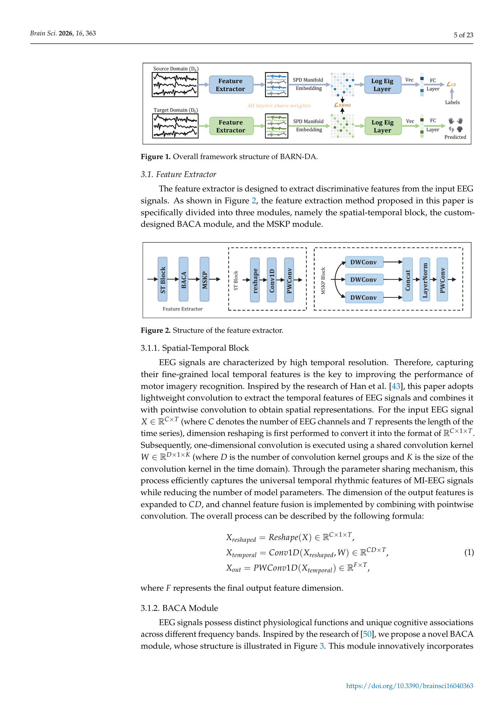

### Extraction assessment
- **Confidence:** 0.65 (below the configured 0.85 threshold; human review required).
- One or more equation candidates are ambiguous in raw extraction. Embedded images require visual review; captions remain page-level text evidence only.

### Raw extracted text
```
Brain Sci. 2026, 16, 363
5 of 23
Figure 1. Overall framework structure of BARN-DA.
3.1. Feature Extractor
The feature extractor is designed to extract discriminative features from the input EEG
signals. As shown in Figure 2, the feature extraction method proposed in this paper is
specifically divided into three modules, namely the spatial-temporal block, the custom-
designed BACA module, and the MSKP module.
Figure 2. Structure of the feature extractor.
3.1.1. Spatial-Temporal Block
EEG signals are characterized by high temporal resolution. Therefore, capturing
their fine-grained local temporal features is the key to improving the performance of
motor imagery recognition. Inspired by the research of Han et al. [43], this paper adopts
lightweight convolution to extract the temporal features of EEG signals and combines it
with pointwise convolution to obtain spatial representations. For the input EEG signal
X ∈RC×T (where C denotes the number of EEG channels and T represents the length of the
time series), dimension reshaping is first performed to convert it into the format of RC×1×T.
Subsequently, one-dimensional convolution is executed using a shared convolution kernel
W ∈RD×1×K (where D is the number of convolution kernel groups and K is the size of the
convolution kernel in the time domain). Through the parameter sharing mechanism, this
process efficiently captures the universal temporal rhythmic features of MI-EEG signals
while reducing the number of model parameters. The dimension of the output features is
expanded to CD, and channel feature fusion is implemented by combining with pointwise
convolution. The overall process can be described by the following formula:
Xreshaped = Reshape(X) ∈RC×1×T,
Xtemporal = Conv1D(Xreshaped, W) ∈RCD×T,
Xout = PWConv1D(Xtemporal) ∈RF×T,
(1)
where F represents the final output feature dimension.
3.1.2. BACA Module
EEG signals possess distinct physiological functions and unique cognitive associations
across different frequency bands. Inspired by the research of [50], we propose a novel BACA
module, whose structure is illustrated in Figure 3. This module innovatively incorporates
https://doi.org/10.3390/brainsci16040363

```

### Textual figure-caption evidence
- Figure 1. Overall framework structure of BARN-DA.
- Figure 2. Structure of the feature extractor.
- Captions are page-level text evidence and are not associated with embedded images.

### Equation candidates
- `page-005-equation-001` — review_required (confidence 0.45; page 5).
```
X ∈RC×T (where C denotes the number of EEG channels and T represents the length of the
```
- `page-005-equation-002` — review_required (confidence 0.45; page 5).
```
time series), dimension reshaping is first performed to convert it into the format of RC×1×T.
```
- `page-005-equation-003` — review_required (confidence 0.45; page 5).
```
W ∈RD×1×K (where D is the number of convolution kernel groups and K is the size of the
```
- `page-005-equation-004` — review_required (confidence 0.45; page 5).
```
Xreshaped = Reshape(X) ∈RC×1×T,
```
- `page-005-equation-005` — review_required (confidence 0.45; page 5).
```
Xtemporal = Conv1D(Xreshaped, W) ∈RCD×T,
```
- `page-005-equation-006` — review_required (confidence 0.45; page 5).
```
Xout = PWConv1D(Xtemporal) ∈RF×T,
```

### Embedded images
- `page-005-image-001` — embedded image metadata: 3301 × 846 px, xref 302; visual review required.
- `page-005-image-002` — embedded image metadata: 3294 × 788 px, xref 321; visual review required.

## Page 6
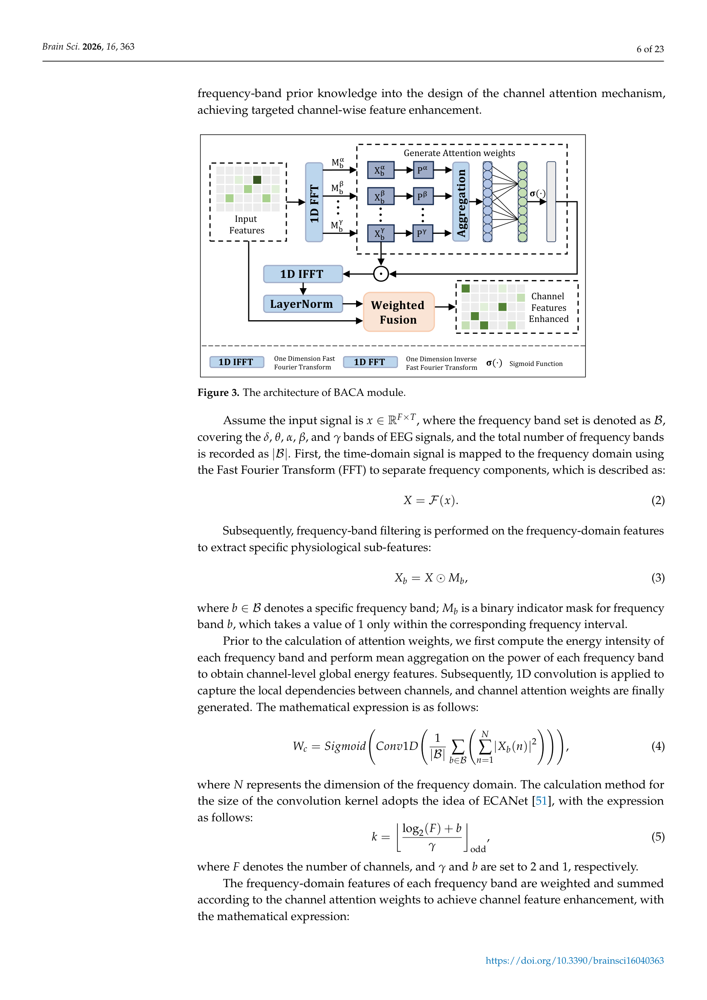

### Extraction assessment
- **Confidence:** 0.65 (below the configured 0.85 threshold; human review required).
- One or more equation candidates are ambiguous in raw extraction.

### Raw extracted text
```
Brain Sci. 2026, 16, 363
6 of 23
frequency-band prior knowledge into the design of the channel attention mechanism,
achieving targeted channel-wise feature enhancement.
𝟏𝐃𝐅𝐅𝐓
𝟏𝐃𝐈𝐅𝐅𝐓
Xb
β
Xb
α
Xb
γ
Pα
Pβ
Pγ
𝐀𝐠𝐠𝐫𝐞𝐠𝐚𝐭𝐢𝐨𝐧
𝛔(·)
•••
•••
•••
Mb
α
Mb
β
Mb
γ
Generate Attention weights
⊙
𝐋𝐚𝐲𝐞𝐫𝐍𝐨𝐫𝐦
𝐖𝐞𝐢𝐠𝐡𝐭𝐞𝐝
𝐅𝐮𝐬𝐢𝐨𝐧
Input
Features
Channel
Features
Enhanced
𝟏𝐃𝐈𝐅𝐅𝐓
𝟏𝐃𝐅𝐅𝐓
𝛔(·)
One Dimension Fast
Fourier Transform
One Dimension Inverse
Fast Fourier Transform
Sigmoid Function
Figure 3. The architecture of BACA module.
Assume the input signal is x ∈RF×T, where the frequency band set is denoted as B,
covering the δ, θ, α, β, and γ bands of EEG signals, and the total number of frequency bands
is recorded as |B|. First, the time-domain signal is mapped to the frequency domain using
the Fast Fourier Transform (FFT) to separate frequency components, which is described as:
X = F(x).
(2)
Subsequently, frequency-band filtering is performed on the frequency-domain features
to extract specific physiological sub-features:
Xb = X ⊙Mb,
(3)
where b ∈B denotes a specific frequency band; Mb is a binary indicator mask for frequency
band b, which takes a value of 1 only within the corresponding frequency interval.
Prior to the calculation of attention weights, we first compute the energy intensity of
each frequency band and perform mean aggregation on the power of each frequency band
to obtain channel-level global energy features. Subsequently, 1D convolution is applied to
capture the local dependencies between channels, and channel attention weights are finally
generated. The mathematical expression is as follows:
Wc = Sigmoid
 
Conv1D
 
1
|B| ∑
b∈B
 
N
∑
n=1
|Xb(n)|2
!!!
,
(4)
where N represents the dimension of the frequency domain. The calculation method for
the size of the convolution kernel adopts the idea of ECANet [51], with the expression
as follows:
k =
log2(F) + b
γ

odd
,
(5)
where F denotes the number of channels, and γ and b are set to 2 and 1, respectively.
The frequency-domain features of each frequency band are weighted and summed
according to the channel attention weights to achieve channel feature enhancement, with
the mathematical expression:
https://doi.org/10.3390/brainsci16040363

```

### Textual figure-caption evidence
- Figure 3. The architecture of BACA module.
- Captions are page-level text evidence and are not associated with embedded images.

### Equation candidates
- `page-006-equation-001` — review_required (confidence 0.45; page 6).
```
Assume the input signal is x ∈RF×T, where the frequency band set is denoted as B,
```
- `page-006-equation-002` — raw_text_preserved (confidence 0.98; page 6).
```
X = F(x).
```
- `page-006-equation-003` — review_required (confidence 0.45; page 6).
```
Xb = X ⊙Mb,
```
- `page-006-equation-004` — review_required (confidence 0.45; page 6).
```
where b ∈B denotes a specific frequency band; Mb is a binary indicator mask for frequency
```
- `page-006-equation-005` — raw_text_preserved (confidence 0.98; page 6).
```
Wc = Sigmoid
```
- `page-006-equation-006` — review_required (confidence 0.45; page 6).
```
|B| ∑
```
- `page-006-equation-007` — raw_text_preserved (confidence 0.98; page 6).
```
b∈B
```
- `page-006-equation-008` — review_required (confidence 0.45; page 6).
```
∑
```
- `page-006-equation-009` — raw_text_preserved (confidence 0.98; page 6).
```
n=1
```
- `page-006-equation-010` — review_required (confidence 0.45; page 6).
```
k =
```

## Page 7
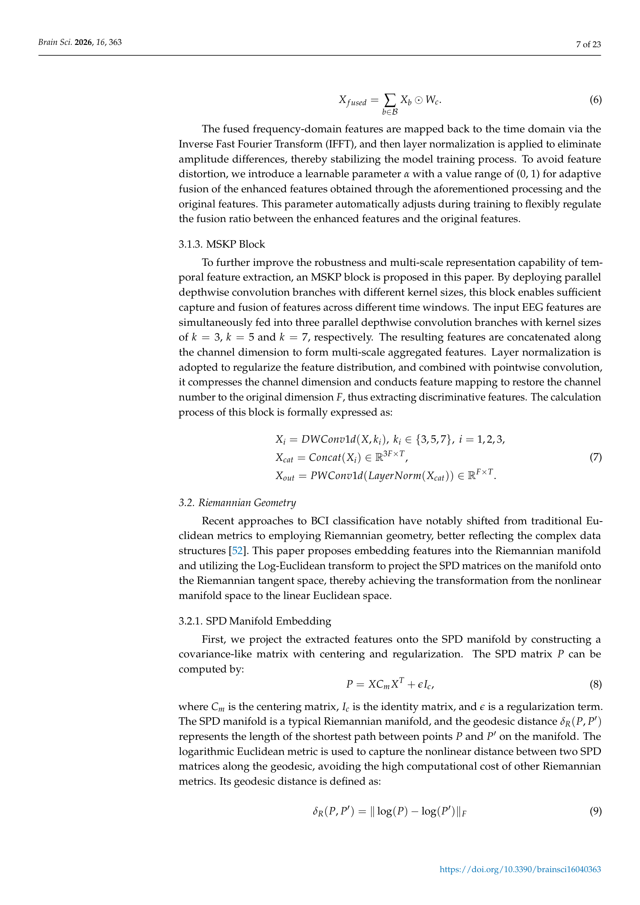

### Extraction assessment
- **Confidence:** 0.65 (below the configured 0.85 threshold; human review required).
- One or more equation candidates are ambiguous in raw extraction.

### Raw extracted text
```
Brain Sci. 2026, 16, 363
7 of 23
Xf used = ∑
b∈B
Xb ⊙Wc.
(6)
The fused frequency-domain features are mapped back to the time domain via the
Inverse Fast Fourier Transform (IFFT), and then layer normalization is applied to eliminate
amplitude differences, thereby stabilizing the model training process. To avoid feature
distortion, we introduce a learnable parameter α with a value range of (0, 1) for adaptive
fusion of the enhanced features obtained through the aforementioned processing and the
original features. This parameter automatically adjusts during training to flexibly regulate
the fusion ratio between the enhanced features and the original features.
3.1.3. MSKP Block
To further improve the robustness and multi-scale representation capability of tem-
poral feature extraction, an MSKP block is proposed in this paper. By deploying parallel
depthwise convolution branches with different kernel sizes, this block enables sufficient
capture and fusion of features across different time windows. The input EEG features are
simultaneously fed into three parallel depthwise convolution branches with kernel sizes
of k = 3, k = 5 and k = 7, respectively. The resulting features are concatenated along
the channel dimension to form multi-scale aggregated features. Layer normalization is
adopted to regularize the feature distribution, and combined with pointwise convolution,
it compresses the channel dimension and conducts feature mapping to restore the channel
number to the original dimension F, thus extracting discriminative features. The calculation
process of this block is formally expressed as:
Xi = DWConv1d(X, ki), ki ∈{3, 5, 7}, i = 1, 2, 3,
Xcat = Concat(Xi) ∈R3F×T,
Xout = PWConv1d(LayerNorm(Xcat)) ∈RF×T.
(7)
3.2. Riemannian Geometry
Recent approaches to BCI classification have notably shifted from traditional Eu-
clidean metrics to employing Riemannian geometry, better reflecting the complex data
structures [52]. This paper proposes embedding features into the Riemannian manifold
and utilizing the Log-Euclidean transform to project the SPD matrices on the manifold onto
the Riemannian tangent space, thereby achieving the transformation from the nonlinear
manifold space to the linear Euclidean space.
3.2.1. SPD Manifold Embedding
First, we project the extracted features onto the SPD manifold by constructing a
covariance-like matrix with centering and regularization.
The SPD matrix P can be
computed by:
P = XCmXT + ϵIc,
(8)
where Cm is the centering matrix, Ic is the identity matrix, and ϵ is a regularization term.
The SPD manifold is a typical Riemannian manifold, and the geodesic distance δR(P, P′)
represents the length of the shortest path between points P and P′ on the manifold. The
logarithmic Euclidean metric is used to capture the nonlinear distance between two SPD
matrices along the geodesic, avoiding the high computational cost of other Riemannian
metrics. Its geodesic distance is defined as:
δR(P, P′) = ∥log(P) −log(P′)∥F
(9)
https://doi.org/10.3390/brainsci16040363

```

### Equation candidates
- `page-007-equation-001` — review_required (confidence 0.45; page 7).
```
Xf used = ∑
```
- `page-007-equation-002` — raw_text_preserved (confidence 0.98; page 7).
```
b∈B
```
- `page-007-equation-003` — review_required (confidence 0.45; page 7).
```
of k = 3, k = 5 and k = 7, respectively. The resulting features are concatenated along
```
- `page-007-equation-004` — review_required (confidence 0.45; page 7).
```
Xi = DWConv1d(X, ki), ki ∈{3, 5, 7}, i = 1, 2, 3,
```
- `page-007-equation-005` — review_required (confidence 0.45; page 7).
```
Xcat = Concat(Xi) ∈R3F×T,
```
- `page-007-equation-006` — raw_text_preserved (confidence 0.98; page 7).
```
Xout = PWConv1d(LayerNorm(Xcat)) ∈RF×T.
```
- `page-007-equation-007` — review_required (confidence 0.45; page 7).
```
P = XCmXT + ϵIc,
```
- `page-007-equation-008` — raw_text_preserved (confidence 0.98; page 7).
```
δR(P, P′) = ∥log(P) −log(P′)∥F
```

## Page 8
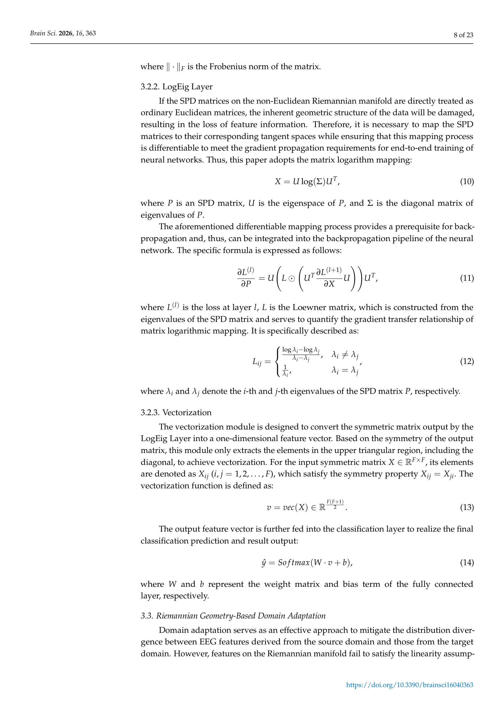

### Extraction assessment
- **Confidence:** 0.65 (below the configured 0.85 threshold; human review required).
- One or more equation candidates are ambiguous in raw extraction.

### Raw extracted text
```
Brain Sci. 2026, 16, 363
8 of 23
where ∥· ∥F is the Frobenius norm of the matrix.
3.2.2. LogEig Layer
If the SPD matrices on the non-Euclidean Riemannian manifold are directly treated as
ordinary Euclidean matrices, the inherent geometric structure of the data will be damaged,
resulting in the loss of feature information. Therefore, it is necessary to map the SPD
matrices to their corresponding tangent spaces while ensuring that this mapping process
is differentiable to meet the gradient propagation requirements for end-to-end training of
neural networks. Thus, this paper adopts the matrix logarithm mapping:
X = U log(Σ)UT,
(10)
where P is an SPD matrix, U is the eigenspace of P, and Σ is the diagonal matrix of
eigenvalues of P.
The aforementioned differentiable mapping process provides a prerequisite for back-
propagation and, thus, can be integrated into the backpropagation pipeline of the neural
network. The specific formula is expressed as follows:
∂L(l)
∂P
= U
 
L ⊙
 
UT ∂L(l+1)
∂X
U
!!
UT,
(11)
where L(l) is the loss at layer l, L is the Loewner matrix, which is constructed from the
eigenvalues of the SPD matrix and serves to quantify the gradient transfer relationship of
matrix logarithmic mapping. It is specifically described as:
Lij =



log λi−log λj
λi−λj
,
λi ̸= λj
1
λi ,
λi = λj
,
(12)
where λi and λj denote the i-th and j-th eigenvalues of the SPD matrix P, respectively.
3.2.3. Vectorization
The vectorization module is designed to convert the symmetric matrix output by the
LogEig Layer into a one-dimensional feature vector. Based on the symmetry of the output
matrix, this module only extracts the elements in the upper triangular region, including the
diagonal, to achieve vectorization. For the input symmetric matrix X ∈RF×F, its elements
are denoted as Xij (i, j = 1, 2, . . . , F), which satisfy the symmetry property Xij = Xji. The
vectorization function is defined as:
v = vec(X) ∈R
F(F+1)
2
.
(13)
The output feature vector is further fed into the classification layer to realize the final
classification prediction and result output:
ˆy = So f tmax(W · v + b),
(14)
where W and b represent the weight matrix and bias term of the fully connected
layer, respectively.
3.3. Riemannian Geometry-Based Domain Adaptation
Domain adaptation serves as an effective approach to mitigate the distribution diver-
gence between EEG features derived from the source domain and those from the target
domain. However, features on the Riemannian manifold fail to satisfy the linearity assump-
https://doi.org/10.3390/brainsci16040363

```

### Equation candidates
- `page-008-equation-001` — review_required (confidence 0.45; page 8).
```
X = U log(Σ)UT,
```
- `page-008-equation-002` — review_required (confidence 0.45; page 8).
```
= U
```
- `page-008-equation-003` — review_required (confidence 0.45; page 8).
```
Lij =
```
- `page-008-equation-004` — review_required (confidence 0.45; page 8).
```
λi ̸= λj
```
- `page-008-equation-005` — raw_text_preserved (confidence 0.98; page 8).
```
λi = λj
```
- `page-008-equation-006` — review_required (confidence 0.45; page 8).
```
diagonal, to achieve vectorization. For the input symmetric matrix X ∈RF×F, its elements
```
- `page-008-equation-007` — review_required (confidence 0.45; page 8).
```
are denoted as Xij (i, j = 1, 2, . . . , F), which satisfy the symmetry property Xij = Xji. The
```
- `page-008-equation-008` — raw_text_preserved (confidence 0.98; page 8).
```
v = vec(X) ∈R
```
- `page-008-equation-009` — review_required (confidence 0.45; page 8).
```
ˆy = So f tmax(W · v + b),
```

## Page 9
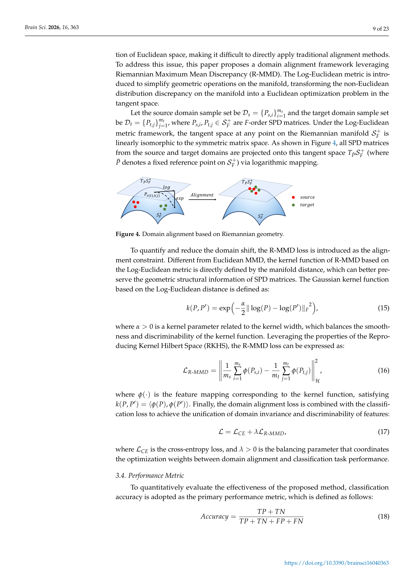

### Extraction assessment
- **Confidence:** 0.65 (below the configured 0.85 threshold; human review required).
- One or more equation candidates are ambiguous in raw extraction. Embedded images require visual review; captions remain page-level text evidence only.

### Raw extracted text
```
Brain Sci. 2026, 16, 363
9 of 23
tion of Euclidean space, making it difficult to directly apply traditional alignment methods.
To address this issue, this paper proposes a domain alignment framework leveraging
Riemannian Maximum Mean Discrepancy (R-MMD). The Log-Euclidean metric is intro-
duced to simplify geometric operations on the manifold, transforming the non-Euclidean
distribution discrepancy on the manifold into a Euclidean optimization problem in the
tangent space.
Let the source domain sample set be Ds = {Ps,i}ms
i=1 and the target domain sample set
be Dt = {Pt,j}mt
j=1, where Ps,i, Pt,j ∈S+
F are F-order SPD matrices. Under the Log-Euclidean
metric framework, the tangent space at any point on the Riemannian manifold S+
F is
linearly isomorphic to the symmetric matrix space. As shown in Figure 4, all SPD matrices
from the source and target domains are projected onto this tangent space T ¯PS+
F (where
¯P denotes a fixed reference point on S+
F ) via logarithmic mapping.
𝑆𝐹
+
𝑇ത𝑃𝑆𝐹
+
𝑙𝑜𝑔
𝑒𝑥𝑝
𝑃𝑠(𝑡),𝑖(𝑗)
𝑆𝐹
+
𝑇ത𝑃𝑆𝐹
+
𝑠𝑜𝑢𝑟𝑐𝑒
𝑡𝑎𝑟𝑔𝑒𝑡
𝐴𝑙𝑖𝑔𝑛𝑚𝑒𝑛𝑡
Figure 4. Domain alignment based on Riemannian geometry.
To quantify and reduce the domain shift, the R-MMD loss is introduced as the align-
ment constraint. Different from Euclidean MMD, the kernel function of R-MMD based on
the Log-Euclidean metric is directly defined by the manifold distance, which can better pre-
serve the geometric structural information of SPD matrices. The Gaussian kernel function
based on the Log-Euclidean distance is defined as:
k(P, P′) = exp

−α
2 ∥log(P) −log(P′)∥F
2
,
(15)
where α > 0 is a kernel parameter related to the kernel width, which balances the smooth-
ness and discriminability of the kernel function. Leveraging the properties of the Repro-
ducing Kernel Hilbert Space (RKHS), the R-MMD loss can be expressed as:
LR-MMD =




1
ms
ms
∑
i=1
ϕ(Ps,i) −1
mt
mt
∑
j=1
ϕ(Pt,j)




2
H
,
(16)
where ϕ(·) is the feature mapping corresponding to the kernel function, satisfying
k(P, P′) = ⟨ϕ(P), ϕ(P′)⟩. Finally, the domain alignment loss is combined with the classifi-
cation loss to achieve the unification of domain invariance and discriminability of features:
L = LCE + λLR-MMD,
(17)
where LCE is the cross-entropy loss, and λ > 0 is the balancing parameter that coordinates
the optimization weights between domain alignment and classification task performance.
3.4. Performance Metric
To quantitatively evaluate the effectiveness of the proposed method, classification
accuracy is adopted as the primary performance metric, which is defined as follows:
Accuracy =
TP + TN
TP + TN + FP + FN
(18)
https://doi.org/10.3390/brainsci16040363

```

### Textual figure-caption evidence
- Figure 4. Domain alignment based on Riemannian geometry.
- Captions are page-level text evidence and are not associated with embedded images.

### Equation candidates
- `page-009-equation-001` — review_required (confidence 0.45; page 9).
```
Let the source domain sample set be Ds = {Ps,i}ms
```
- `page-009-equation-002` — raw_text_preserved (confidence 0.98; page 9).
```
i=1 and the target domain sample set
```
- `page-009-equation-003` — review_required (confidence 0.45; page 9).
```
be Dt = {Pt,j}mt
```
- `page-009-equation-004` — review_required (confidence 0.45; page 9).
```
j=1, where Ps,i, Pt,j ∈S+
```
- `page-009-equation-005` — raw_text_preserved (confidence 0.98; page 9).
```
k(P, P′) = exp
```
- `page-009-equation-006` — review_required (confidence 0.45; page 9).
```
LR-MMD =
```
- `page-009-equation-007` — review_required (confidence 0.45; page 9).
```
∑
```
- `page-009-equation-008` — raw_text_preserved (confidence 0.98; page 9).
```
i=1
```
- `page-009-equation-009` — review_required (confidence 0.45; page 9).
```
∑
```
- `page-009-equation-010` — raw_text_preserved (confidence 0.98; page 9).
```
j=1
```
- `page-009-equation-011` — review_required (confidence 0.45; page 9).
```
k(P, P′) = ⟨ϕ(P), ϕ(P′)⟩. Finally, the domain alignment loss is combined with the classifi-
```
- `page-009-equation-012` — review_required (confidence 0.45; page 9).
```
L = LCE + λLR-MMD,
```
- `page-009-equation-013` — review_required (confidence 0.45; page 9).
```
Accuracy =
```

### Embedded images
- `page-009-image-001` — embedded image metadata: 735 × 456 px, xref 442; visual review required.
- `page-009-image-002` — embedded image metadata: 849 × 274 px, xref 443; visual review required.
- `page-009-image-003` — embedded image metadata: 736 × 456 px, xref 444; visual review required.

## Page 10
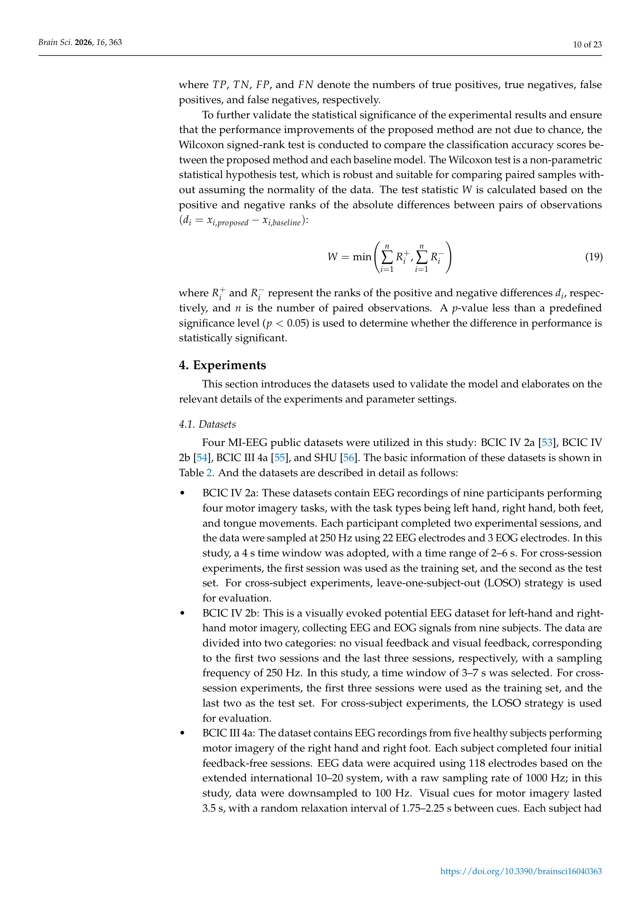

### Extraction assessment
- **Confidence:** 0.65 (below the configured 0.85 threshold; human review required).
- One or more equation candidates are ambiguous in raw extraction.

### Raw extracted text
```
Brain Sci. 2026, 16, 363
10 of 23
where TP, TN, FP, and FN denote the numbers of true positives, true negatives, false
positives, and false negatives, respectively.
To further validate the statistical significance of the experimental results and ensure
that the performance improvements of the proposed method are not due to chance, the
Wilcoxon signed-rank test is conducted to compare the classification accuracy scores be-
tween the proposed method and each baseline model. The Wilcoxon test is a non-parametric
statistical hypothesis test, which is robust and suitable for comparing paired samples with-
out assuming the normality of the data. The test statistic W is calculated based on the
positive and negative ranks of the absolute differences between pairs of observations
(di = xi,proposed −xi,baseline):
W = min
 
n
∑
i=1
R+
i ,
n
∑
i=1
R−
i
!
(19)
where R+
i and R−
i represent the ranks of the positive and negative differences di, respec-
tively, and n is the number of paired observations. A p-value less than a predefined
significance level (p < 0.05) is used to determine whether the difference in performance is
statistically significant.
4. Experiments
This section introduces the datasets used to validate the model and elaborates on the
relevant details of the experiments and parameter settings.
4.1. Datasets
Four MI-EEG public datasets were utilized in this study: BCIC IV 2a [53], BCIC IV
2b [54], BCIC III 4a [55], and SHU [56]. The basic information of these datasets is shown in
Table 2. And the datasets are described in detail as follows:
•
BCIC IV 2a: These datasets contain EEG recordings of nine participants performing
four motor imagery tasks, with the task types being left hand, right hand, both feet,
and tongue movements. Each participant completed two experimental sessions, and
the data were sampled at 250 Hz using 22 EEG electrodes and 3 EOG electrodes. In this
study, a 4 s time window was adopted, with a time range of 2–6 s. For cross-session
experiments, the first session was used as the training set, and the second as the test
set. For cross-subject experiments, leave-one-subject-out (LOSO) strategy is used
for evaluation.
•
BCIC IV 2b: This is a visually evoked potential EEG dataset for left-hand and right-
hand motor imagery, collecting EEG and EOG signals from nine subjects. The data are
divided into two categories: no visual feedback and visual feedback, corresponding
to the first two sessions and the last three sessions, respectively, with a sampling
frequency of 250 Hz. In this study, a time window of 3–7 s was selected. For cross-
session experiments, the first three sessions were used as the training set, and the
last two as the test set. For cross-subject experiments, the LOSO strategy is used
for evaluation.
•
BCIC III 4a: The dataset contains EEG recordings from five healthy subjects performing
motor imagery of the right hand and right foot. Each subject completed four initial
feedback-free sessions. EEG data were acquired using 118 electrodes based on the
extended international 10–20 system, with a raw sampling rate of 1000 Hz; in this
study, data were downsampled to 100 Hz. Visual cues for motor imagery lasted
3.5 s, with a random relaxation interval of 1.75–2.25 s between cues. Each subject had
https://doi.org/10.3390/brainsci16040363

```

### Equation candidates
- `page-010-equation-001` — review_required (confidence 0.45; page 10).
```
(di = xi,proposed −xi,baseline):
```
- `page-010-equation-002` — raw_text_preserved (confidence 0.98; page 10).
```
W = min
```
- `page-010-equation-003` — review_required (confidence 0.45; page 10).
```
∑
```
- `page-010-equation-004` — raw_text_preserved (confidence 0.98; page 10).
```
i=1
```
- `page-010-equation-005` — review_required (confidence 0.45; page 10).
```
∑
```
- `page-010-equation-006` — raw_text_preserved (confidence 0.98; page 10).
```
i=1
```

## Page 11
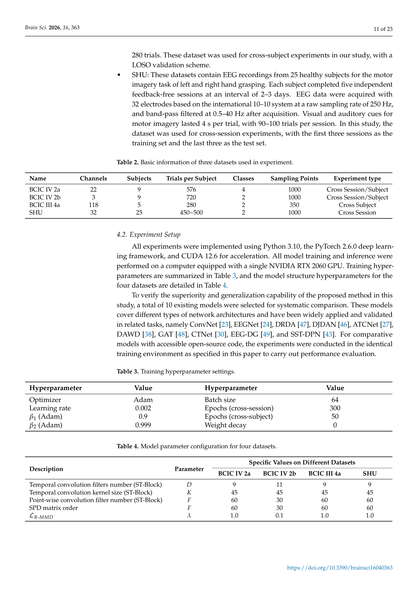

### Extraction assessment
- **Confidence:** 0.95 (meets the configured threshold).
- Machine-readable text was preserved with page-image provenance.

### Raw extracted text
```
Brain Sci. 2026, 16, 363
11 of 23
280 trials. These dataset was used for cross-subject experiments in our study, with a
LOSO validation scheme.
•
SHU: These datasets contain EEG recordings from 25 healthy subjects for the motor
imagery task of left and right hand grasping. Each subject completed five independent
feedback-free sessions at an interval of 2–3 days. EEG data were acquired with
32 electrodes based on the international 10–10 system at a raw sampling rate of 250 Hz,
and band-pass filtered at 0.5–40 Hz after acquisition. Visual and auditory cues for
motor imagery lasted 4 s per trial, with 90–100 trials per session. In this study, the
dataset was used for cross-session experiments, with the first three sessions as the
training set and the last three as the test set.
Table 2. Basic information of three datasets used in experiment.
Name
Channels
Subjects
Trials per Subject
Classes
Sampling Points
Experiment type
BCIC IV 2a
22
9
576
4
1000
Cross Session/Subject
BCIC IV 2b
3
9
720
2
1000
Cross Session/Subject
BCIC III 4a
118
5
280
2
350
Cross Subject
SHU
32
25
450~500
2
1000
Cross Session
4.2. Experiment Setup
All experiments were implemented using Python 3.10, the PyTorch 2.6.0 deep learn-
ing framework, and CUDA 12.6 for acceleration. All model training and inference were
performed on a computer equipped with a single NVIDIA RTX 2060 GPU. Training hyper-
parameters are summarized in Table 3, and the model structure hyperparameters for the
four datasets are detailed in Table 4.
To verify the superiority and generalization capability of the proposed method in this
study, a total of 10 existing models were selected for systematic comparison. These models
cover different types of network architectures and have been widely applied and validated
in related tasks, namely ConvNet [23], EEGNet [24], DRDA [47], DJDAN [46], ATCNet [27],
DAWD [38], GAT [48], CTNet [30], EEG-DG [49], and SST-DPN [43]. For comparative
models with accessible open-source code, the experiments were conducted in the identical
training environment as specified in this paper to carry out performance evaluation.
Table 3. Training hyperparameter settings.
Hyperparameter
Value
Hyperparameter
Value
Optimizer
Adam
Batch size
64
Learning rate
0.002
Epochs (cross-session)
300
β1 (Adam)
0.9
Epochs (cross-subject)
50
β2 (Adam)
0.999
Weight decay
0
Table 4. Model parameter configuration for four datasets.
Description
Parameter
Specific Values on Different Datasets
BCIC IV 2a
BCIC IV 2b
BCIC III 4a
SHU
Temporal convolution filters number (ST-Block)
D
9
11
9
9
Temporal convolution kernel size (ST-Block)
K
45
45
45
45
Point-wise convolution filter number (ST-Block)
F
60
30
60
60
SPD matrix order
F
60
30
60
60
LR-MMD
λ
1.0
0.1
1.0
1.0
https://doi.org/10.3390/brainsci16040363

```

## Page 12
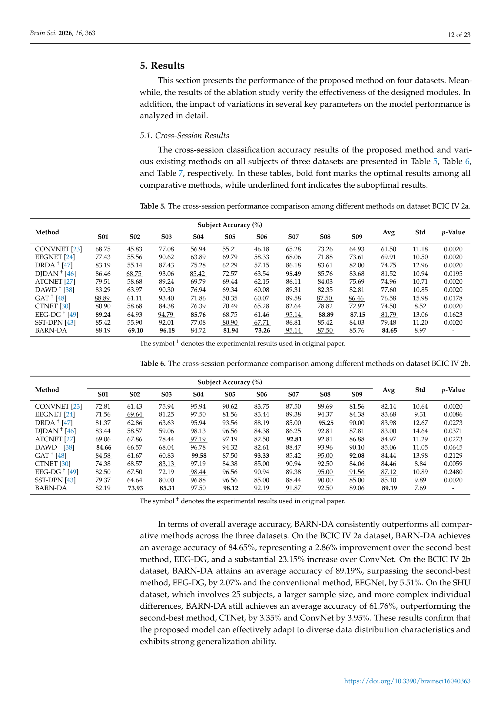

### Extraction assessment
- **Confidence:** 0.95 (meets the configured threshold).
- Machine-readable text was preserved with page-image provenance.

### Raw extracted text
```
Brain Sci. 2026, 16, 363
12 of 23
5. Results
This section presents the performance of the proposed method on four datasets. Mean-
while, the results of the ablation study verify the effectiveness of the designed modules. In
addition, the impact of variations in several key parameters on the model performance is
analyzed in detail.
5.1. Cross-Session Results
The cross-session classification accuracy results of the proposed method and vari-
ous existing methods on all subjects of three datasets are presented in Table 5, Table 6,
and Table 7, respectively. In these tables, bold font marks the optimal results among all
comparative methods, while underlined font indicates the suboptimal results.
Table 5. The cross-session performance comparison among different methods on dataset BCIC IV 2a.
Method
Subject Accuracy (%)
Avg
Std
p-Value
S01
S02
S03
S04
S05
S06
S07
S08
S09
CONVNET [23]
68.75
45.83
77.08
56.94
55.21
46.18
65.28
73.26
64.93
61.50
11.18
0.0020
EEGNET [24]
77.43
55.56
90.62
63.89
69.79
58.33
68.06
71.88
73.61
69.91
10.50
0.0020
DRDA † [47]
83.19
55.14
87.43
75.28
62.29
57.15
86.18
83.61
82.00
74.75
12.96
0.0020
DJDAN † [46]
86.46
68.75
93.06
85.42
72.57
63.54
95.49
85.76
83.68
81.52
10.94
0.0195
ATCNET [27]
79.51
58.68
89.24
69.79
69.44
62.15
86.11
84.03
75.69
74.96
10.71
0.0020
DAWD † [38]
83.29
63.97
90.30
76.94
69.34
60.08
89.31
82.35
82.81
77.60
10.85
0.0020
GAT † [48]
88.89
61.11
93.40
71.86
50.35
60.07
89.58
87.50
86.46
76.58
15.98
0.0178
CTNET [30]
80.90
58.68
84.38
76.39
70.49
65.28
82.64
78.82
72.92
74.50
8.52
0.0020
EEG-DG † [49]
89.24
64.93
94.79
85.76
68.75
61.46
95.14
88.89
87.15
81.79
13.06
0.1623
SST-DPN [43]
85.42
55.90
92.01
77.08
80.90
67.71
86.81
85.42
84.03
79.48
11.20
0.0020
BARN-DA
88.19
69.10
96.18
84.72
81.94
73.26
95.14
87.50
85.76
84.65
8.97
-
The symbol † denotes the experimental results used in original paper.
Table 6. The cross-session performance comparison among different methods on dataset BCIC IV 2b.
Method
Subject Accuracy (%)
Avg
Std
p-Value
S01
S02
S03
S04
S05
S06
S07
S08
S09
CONVNET [23]
72.81
61.43
75.94
95.94
90.62
83.75
87.50
89.69
81.56
82.14
10.64
0.0020
EEGNET [24]
71.56
69.64
81.25
97.50
81.56
83.44
89.38
94.37
84.38
83.68
9.31
0.0086
DRDA † [47]
81.37
62.86
63.63
95.94
93.56
88.19
85.00
95.25
90.00
83.98
12.67
0.0273
DJDAN † [46]
83.44
58.57
59.06
98.13
96.56
84.38
86.25
92.81
87.81
83.00
14.64
0.0371
ATCNET [27]
69.06
67.86
78.44
97.19
97.19
82.50
92.81
92.81
86.88
84.97
11.29
0.0273
DAWD † [38]
84.66
66.57
68.04
96.78
94.32
82.61
88.47
93.96
90.10
85.06
11.05
0.0645
GAT † [48]
84.58
61.67
60.83
99.58
87.50
93.33
85.42
95.00
92.08
84.44
13.98
0.2129
CTNET [30]
74.38
68.57
83.13
97.19
84.38
85.00
90.94
92.50
84.06
84.46
8.84
0.0059
EEG-DG † [49]
82.50
67.50
72.19
98.44
96.56
90.94
89.38
95.00
91.56
87.12
10.89
0.2480
SST-DPN [43]
79.37
64.64
80.00
96.88
96.56
85.00
88.44
90.00
85.00
85.10
9.89
0.0020
BARN-DA
82.19
73.93
85.31
97.50
98.12
92.19
91.87
92.50
89.06
89.19
7.69
-
The symbol † denotes the experimental results used in original paper.
In terms of overall average accuracy, BARN-DA consistently outperforms all compar-
ative methods across the three datasets. On the BCIC IV 2a dataset, BARN-DA achieves
an average accuracy of 84.65%, representing a 2.86% improvement over the second-best
method, EEG-DG, and a substantial 23.15% increase over ConvNet. On the BCIC IV 2b
dataset, BARN-DA attains an average accuracy of 89.19%, surpassing the second-best
method, EEG-DG, by 2.07% and the conventional method, EEGNet, by 5.51%. On the SHU
dataset, which involves 25 subjects, a larger sample size, and more complex individual
differences, BARN-DA still achieves an average accuracy of 61.76%, outperforming the
second-best method, CTNet, by 3.35% and ConvNet by 3.95%. These results confirm that
the proposed model can effectively adapt to diverse data distribution characteristics and
exhibits strong generalization ability.
https://doi.org/10.3390/brainsci16040363

```

## Page 13
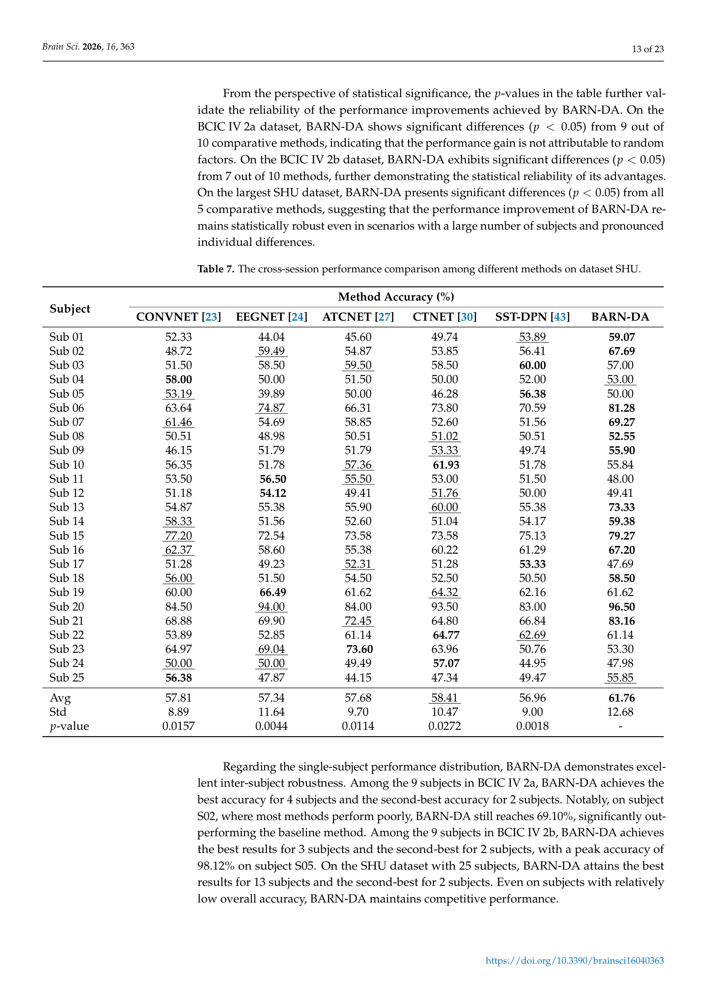

### Extraction assessment
- **Confidence:** 0.95 (meets the configured threshold).
- Machine-readable text was preserved with page-image provenance.

### Raw extracted text
```
Brain Sci. 2026, 16, 363
13 of 23
From the perspective of statistical significance, the p-values in the table further val-
idate the reliability of the performance improvements achieved by BARN-DA. On the
BCIC IV 2a dataset, BARN-DA shows significant differences (p < 0.05) from 9 out of
10 comparative methods, indicating that the performance gain is not attributable to random
factors. On the BCIC IV 2b dataset, BARN-DA exhibits significant differences (p < 0.05)
from 7 out of 10 methods, further demonstrating the statistical reliability of its advantages.
On the largest SHU dataset, BARN-DA presents significant differences (p < 0.05) from all
5 comparative methods, suggesting that the performance improvement of BARN-DA re-
mains statistically robust even in scenarios with a large number of subjects and pronounced
individual differences.
Table 7. The cross-session performance comparison among different methods on dataset SHU.
Subject
Method Accuracy (%)
CONVNET [23]
EEGNET [24]
ATCNET [27]
CTNET [30]
SST-DPN [43]
BARN-DA
Sub 01
52.33
44.04
45.60
49.74
53.89
59.07
Sub 02
48.72
59.49
54.87
53.85
56.41
67.69
Sub 03
51.50
58.50
59.50
58.50
60.00
57.00
Sub 04
58.00
50.00
51.50
50.00
52.00
53.00
Sub 05
53.19
39.89
50.00
46.28
56.38
50.00
Sub 06
63.64
74.87
66.31
73.80
70.59
81.28
Sub 07
61.46
54.69
58.85
52.60
51.56
69.27
Sub 08
50.51
48.98
50.51
51.02
50.51
52.55
Sub 09
46.15
51.79
51.79
53.33
49.74
55.90
Sub 10
56.35
51.78
57.36
61.93
51.78
55.84
Sub 11
53.50
56.50
55.50
53.00
51.50
48.00
Sub 12
51.18
54.12
49.41
51.76
50.00
49.41
Sub 13
54.87
55.38
55.90
60.00
55.38
73.33
Sub 14
58.33
51.56
52.60
51.04
54.17
59.38
Sub 15
77.20
72.54
73.58
73.58
75.13
79.27
Sub 16
62.37
58.60
55.38
60.22
61.29
67.20
Sub 17
51.28
49.23
52.31
51.28
53.33
47.69
Sub 18
56.00
51.50
54.50
52.50
50.50
58.50
Sub 19
60.00
66.49
61.62
64.32
62.16
61.62
Sub 20
84.50
94.00
84.00
93.50
83.00
96.50
Sub 21
68.88
69.90
72.45
64.80
66.84
83.16
Sub 22
53.89
52.85
61.14
64.77
62.69
61.14
Sub 23
64.97
69.04
73.60
63.96
50.76
53.30
Sub 24
50.00
50.00
49.49
57.07
44.95
47.98
Sub 25
56.38
47.87
44.15
47.34
49.47
55.85
Avg
57.81
57.34
57.68
58.41
56.96
61.76
Std
8.89
11.64
9.70
10.47
9.00
12.68
p-value
0.0157
0.0044
0.0114
0.0272
0.0018
-
Regarding the single-subject performance distribution, BARN-DA demonstrates excel-
lent inter-subject robustness. Among the 9 subjects in BCIC IV 2a, BARN-DA achieves the
best accuracy for 4 subjects and the second-best accuracy for 2 subjects. Notably, on subject
S02, where most methods perform poorly, BARN-DA still reaches 69.10%, significantly out-
performing the baseline method. Among the 9 subjects in BCIC IV 2b, BARN-DA achieves
the best results for 3 subjects and the second-best for 2 subjects, with a peak accuracy of
98.12% on subject S05. On the SHU dataset with 25 subjects, BARN-DA attains the best
results for 13 subjects and the second-best for 2 subjects. Even on subjects with relatively
low overall accuracy, BARN-DA maintains competitive performance.
https://doi.org/10.3390/brainsci16040363

```

## Page 14
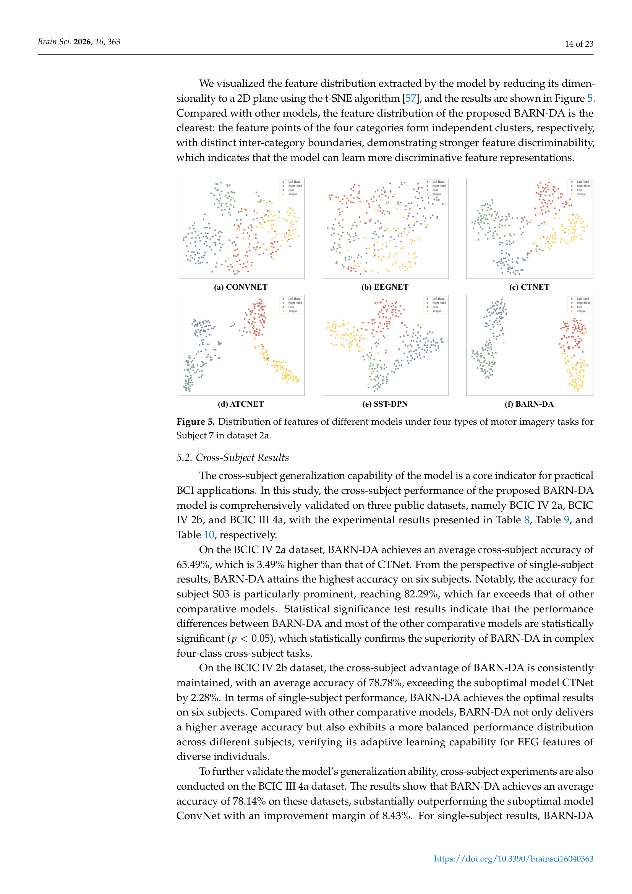

### Extraction assessment
- **Confidence:** 0.75 (below the configured 0.85 threshold; human review required).
- Embedded images require visual review; captions remain page-level text evidence only.

### Raw extracted text
```
Brain Sci. 2026, 16, 363
14 of 23
We visualized the feature distribution extracted by the model by reducing its dimen-
sionality to a 2D plane using the t-SNE algorithm [57], and the results are shown in Figure 5.
Compared with other models, the feature distribution of the proposed BARN-DA is the
clearest: the feature points of the four categories form independent clusters, respectively,
with distinct inter-category boundaries, demonstrating stronger feature discriminability,
which indicates that the model can learn more discriminative feature representations.
(f) BARN-DA
(e) SST-DPN
(d) ATCNET
(c) CTNET
(b) EEGNET
(a) CONVNET
Figure 5. Distribution of features of different models under four types of motor imagery tasks for
Subject 7 in dataset 2a.
5.2. Cross-Subject Results
The cross-subject generalization capability of the model is a core indicator for practical
BCI applications. In this study, the cross-subject performance of the proposed BARN-DA
model is comprehensively validated on three public datasets, namely BCIC IV 2a, BCIC
IV 2b, and BCIC III 4a, with the experimental results presented in Table 8, Table 9, and
Table 10, respectively.
On the BCIC IV 2a dataset, BARN-DA achieves an average cross-subject accuracy of
65.49%, which is 3.49% higher than that of CTNet. From the perspective of single-subject
results, BARN-DA attains the highest accuracy on six subjects. Notably, the accuracy for
subject S03 is particularly prominent, reaching 82.29%, which far exceeds that of other
comparative models. Statistical significance test results indicate that the performance
differences between BARN-DA and most of the other comparative models are statistically
significant (p < 0.05), which statistically confirms the superiority of BARN-DA in complex
four-class cross-subject tasks.
On the BCIC IV 2b dataset, the cross-subject advantage of BARN-DA is consistently
maintained, with an average accuracy of 78.78%, exceeding the suboptimal model CTNet
by 2.28%. In terms of single-subject performance, BARN-DA achieves the optimal results
on six subjects. Compared with other comparative models, BARN-DA not only delivers
a higher average accuracy but also exhibits a more balanced performance distribution
across different subjects, verifying its adaptive learning capability for EEG features of
diverse individuals.
To further validate the model’s generalization ability, cross-subject experiments are also
conducted on the BCIC III 4a dataset. The results show that BARN-DA achieves an average
accuracy of 78.14% on these datasets, substantially outperforming the suboptimal model
ConvNet with an improvement margin of 8.43%. For single-subject results, BARN-DA
https://doi.org/10.3390/brainsci16040363

```

### Textual figure-caption evidence
- Figure 5. Distribution of features of different models under four types of motor imagery tasks for
- Captions are page-level text evidence and are not associated with embedded images.

### Embedded images
- `page-014-image-001` — embedded image metadata: 685 × 547 px, xref 554; visual review required.
- `page-014-image-002` — embedded image metadata: 685 × 547 px, xref 555; visual review required.
- `page-014-image-003` — embedded image metadata: 685 × 547 px, xref 556; visual review required.
- `page-014-image-004` — embedded image metadata: 685 × 547 px, xref 557; visual review required.
- `page-014-image-005` — embedded image metadata: 685 × 547 px, xref 558; visual review required.
- `page-014-image-006` — embedded image metadata: 685 × 547 px, xref 559; visual review required.

## Page 15
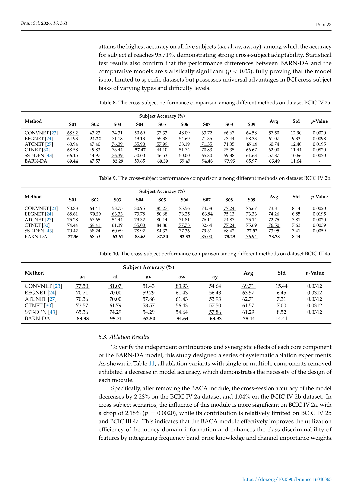

### Extraction assessment
- **Confidence:** 0.65 (below the configured 0.85 threshold; human review required).
- One or more equation candidates are ambiguous in raw extraction.

### Raw extracted text
```
Brain Sci. 2026, 16, 363
15 of 23
attains the highest accuracy on all five subjects (aa, al, av, aw, ay), among which the accuracy
for subject al reaches 95.71%, demonstrating strong cross-subject adaptability. Statistical
test results also confirm that the performance differences between BARN-DA and the
comparative models are statistically significant (p < 0.05), fully proving that the model
is not limited to specific datasets but possesses universal advantages in BCI cross-subject
tasks of varying types and difficulty levels.
Table 8. The cross-subject performance comparison among different methods on dataset BCIC IV 2a.
Method
Subject Accuracy (%)
Avg
Std
p-Value
S01
S02
S03
S04
S05
S06
S07
S08
S09
CONVNET [23]
68.92
43.23
74.31
50.69
37.33
48.09
63.72
66.67
64.58
57.50
12.90
0.0020
EEGNET [24]
64.93
51.22
71.18
49.13
55.38
54.69
71.35
73.44
58.33
61.07
9.33
0.0098
ATCNET [27]
60.94
47.40
76.39
55.90
57.99
38.19
71.35
71.35
67.19
60.74
12.40
0.0195
CTNET [30]
68.58
49.83
73.44
57.47
44.10
51.74
70.83
75.35
66.67
62.00
11.44
0.0820
SST-DPN [43]
66.15
44.97
76.39
50.00
46.53
50.00
65.80
59.38
61.63
57.87
10.66
0.0020
BARN-DA
69.44
47.57
82.29
53.65
60.59
57.47
74.48
77.95
65.97
65.49
11.64
-
Table 9. The cross-subject performance comparison among different methods on dataset BCIC IV 2b.
Method
Subject Accuracy (%)
Avg
Std
p-Value
S01
S02
S03
S04
S05
S06
S07
S08
S09
CONVNET [23]
70.83
64.41
58.75
80.95
85.27
75.56
74.58
77.24
76.67
73.81
8.14
0.0020
EEGNET [24]
68.61
70.29
63.33
73.78
80.68
76.25
86.94
75.13
73.33
74.26
6.85
0.0195
ATCNET [27]
75.28
67.65
54.44
79.32
80.14
71.81
76.11
74.87
75.14
72.75
7.81
0.0020
CTNET [30]
74.44
69.41
61.39
85.00
84.86
77.78
82.64
77.24
75.69
76.50
7.63
0.0039
SST-DPN [43]
70.42
68.24
60.69
78.92
84.32
77.36
79.31
68.42
77.92
73.95
7.41
0.0059
BARN-DA
77.36
68.53
63.61
88.65
87.30
83.33
85.00
78.29
76.94
78.78
8.44
-
Table 10. The cross-subject performance comparison among different methods on dataset BCIC III 4a.
Method
Subject Accuracy (%)
Avg
Std
p-Value
aa
al
av
aw
ay
CONVNET [23]
77.50
81.07
51.43
83.93
54.64
69.71
15.44
0.0312
EEGNET [24]
70.71
70.00
59.29
61.43
56.43
63.57
6.45
0.0312
ATCNET [27]
70.36
70.00
57.86
61.43
53.93
62.71
7.31
0.0312
CTNET [30]
73.57
61.79
58.57
56.43
57.50
61.57
7.00
0.0312
SST-DPN [43]
65.36
74.29
54.29
54.64
57.86
61.29
8.52
0.0312
BARN-DA
83.93
95.71
62.50
84.64
63.93
78.14
14.41
-
5.3. Ablation Results
To verify the independent contributions and synergistic effects of each core component
of the BARN-DA model, this study designed a series of systematic ablation experiments.
As shown in Table 11, all ablation variants with single or multiple components removed
exhibited a decrease in model accuracy, which demonstrates the necessity of the design of
each module.
Specifically, after removing the BACA module, the cross-session accuracy of the model
decreases by 2.28% on the BCIC IV 2a dataset and 1.04% on the BCIC IV 2b dataset. In
cross-subject scenarios, the influence of this module is more significant on BCIC IV 2a, with
a drop of 2.18% (p = 0.0020), while its contribution is relatively limited on BCIC IV 2b
and BCIC III 4a. This indicates that the BACA module effectively improves the utilization
efficiency of frequency-domain information and enhances the class discriminability of
features by integrating frequency band prior knowledge and channel importance weights.
https://doi.org/10.3390/brainsci16040363

```

### Equation candidates
- `page-015-equation-001` — review_required (confidence 0.45; page 15).
```
a drop of 2.18% (p = 0.0020), while its contribution is relatively limited on BCIC IV 2b
```

## Page 16
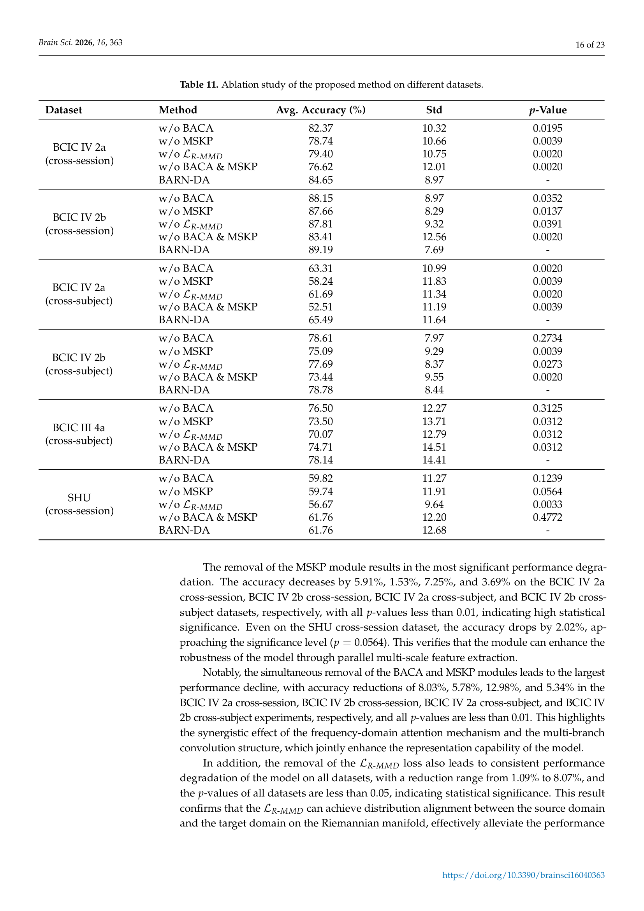

### Extraction assessment
- **Confidence:** 0.65 (below the configured 0.85 threshold; human review required).
- One or more equation candidates are ambiguous in raw extraction.

### Raw extracted text
```
Brain Sci. 2026, 16, 363
16 of 23
Table 11. Ablation study of the proposed method on different datasets.
Dataset
Method
Avg. Accuracy (%)
Std
p-Value
BCIC IV 2a
(cross-session)
w/o BACA
82.37
10.32
0.0195
w/o MSKP
78.74
10.66
0.0039
w/o LR-MMD
79.40
10.75
0.0020
w/o BACA & MSKP
76.62
12.01
0.0020
BARN-DA
84.65
8.97
-
BCIC IV 2b
(cross-session)
w/o BACA
88.15
8.97
0.0352
w/o MSKP
87.66
8.29
0.0137
w/o LR-MMD
87.81
9.32
0.0391
w/o BACA & MSKP
83.41
12.56
0.0020
BARN-DA
89.19
7.69
-
BCIC IV 2a
(cross-subject)
w/o BACA
63.31
10.99
0.0020
w/o MSKP
58.24
11.83
0.0039
w/o LR-MMD
61.69
11.34
0.0020
w/o BACA & MSKP
52.51
11.19
0.0039
BARN-DA
65.49
11.64
-
BCIC IV 2b
(cross-subject)
w/o BACA
78.61
7.97
0.2734
w/o MSKP
75.09
9.29
0.0039
w/o LR-MMD
77.69
8.37
0.0273
w/o BACA & MSKP
73.44
9.55
0.0020
BARN-DA
78.78
8.44
-
BCIC III 4a
(cross-subject)
w/o BACA
76.50
12.27
0.3125
w/o MSKP
73.50
13.71
0.0312
w/o LR-MMD
70.07
12.79
0.0312
w/o BACA & MSKP
74.71
14.51
0.0312
BARN-DA
78.14
14.41
-
SHU
(cross-session)
w/o BACA
59.82
11.27
0.1239
w/o MSKP
59.74
11.91
0.0564
w/o LR-MMD
56.67
9.64
0.0033
w/o BACA & MSKP
61.76
12.20
0.4772
BARN-DA
61.76
12.68
-
The removal of the MSKP module results in the most significant performance degra-
dation. The accuracy decreases by 5.91%, 1.53%, 7.25%, and 3.69% on the BCIC IV 2a
cross-session, BCIC IV 2b cross-session, BCIC IV 2a cross-subject, and BCIC IV 2b cross-
subject datasets, respectively, with all p-values less than 0.01, indicating high statistical
significance. Even on the SHU cross-session dataset, the accuracy drops by 2.02%, ap-
proaching the significance level (p = 0.0564). This verifies that the module can enhance the
robustness of the model through parallel multi-scale feature extraction.
Notably, the simultaneous removal of the BACA and MSKP modules leads to the largest
performance decline, with accuracy reductions of 8.03%, 5.78%, 12.98%, and 5.34% in the
BCIC IV 2a cross-session, BCIC IV 2b cross-session, BCIC IV 2a cross-subject, and BCIC IV
2b cross-subject experiments, respectively, and all p-values are less than 0.01. This highlights
the synergistic effect of the frequency-domain attention mechanism and the multi-branch
convolution structure, which jointly enhance the representation capability of the model.
In addition, the removal of the LR-MMD loss also leads to consistent performance
degradation of the model on all datasets, with a reduction range from 1.09% to 8.07%, and
the p-values of all datasets are less than 0.05, indicating statistical significance. This result
confirms that the LR-MMD can achieve distribution alignment between the source domain
and the target domain on the Riemannian manifold, effectively alleviate the performance
https://doi.org/10.3390/brainsci16040363

```

### Equation candidates
- `page-016-equation-001` — review_required (confidence 0.45; page 16).
```
proaching the significance level (p = 0.0564). This verifies that the module can enhance the
```

## Page 17
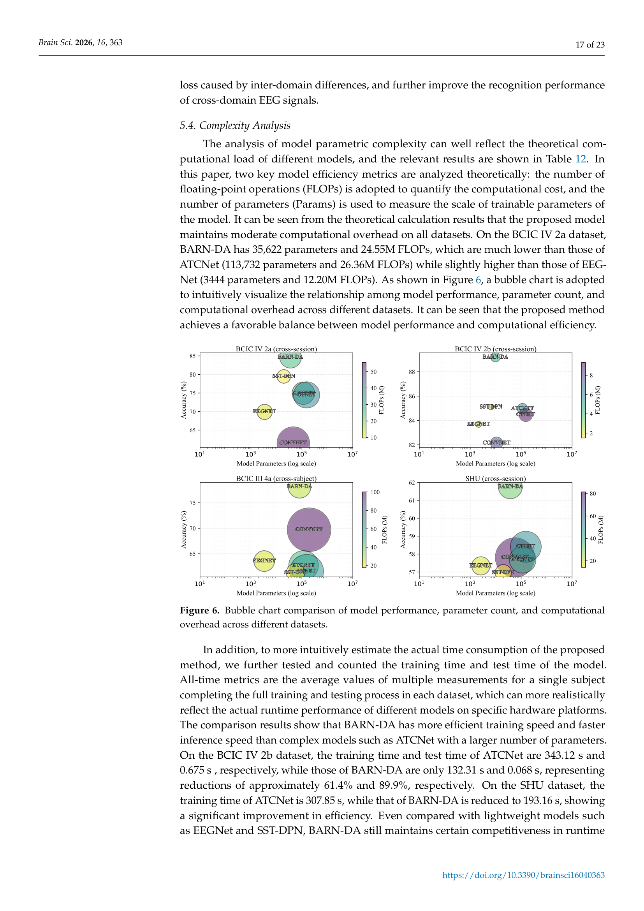

### Extraction assessment
- **Confidence:** 0.75 (below the configured 0.85 threshold; human review required).
- Embedded images require visual review; captions remain page-level text evidence only.

### Raw extracted text
```
Brain Sci. 2026, 16, 363
17 of 23
loss caused by inter-domain differences, and further improve the recognition performance
of cross-domain EEG signals.
5.4. Complexity Analysis
The analysis of model parametric complexity can well reflect the theoretical com-
putational load of different models, and the relevant results are shown in Table 12. In
this paper, two key model efficiency metrics are analyzed theoretically: the number of
floating-point operations (FLOPs) is adopted to quantify the computational cost, and the
number of parameters (Params) is used to measure the scale of trainable parameters of
the model. It can be seen from the theoretical calculation results that the proposed model
maintains moderate computational overhead on all datasets. On the BCIC IV 2a dataset,
BARN-DA has 35,622 parameters and 24.55M FLOPs, which are much lower than those of
ATCNet (113,732 parameters and 26.36M FLOPs) while slightly higher than those of EEG-
Net (3444 parameters and 12.20M FLOPs). As shown in Figure 6, a bubble chart is adopted
to intuitively visualize the relationship among model performance, parameter count, and
computational overhead across different datasets. It can be seen that the proposed method
achieves a favorable balance between model performance and computational efficiency.
101
103
105
107
Model Parameters (log scale)
65
70
75
80
85
Accuracy (%)
CONVNET
CONVNET
CONVNET
CONVNET
CONVNET
CONVNET
CONVNET
CONVNET
CONVNET
EEGNET
EEGNET
EEGNET
EEGNET
EEGNET
EEGNET
EEGNET
EEGNET
EEGNET
ATCNET
ATCNET
ATCNET
ATCNET
ATCNET
ATCNET
ATCNET
ATCNET
ATCNET
CTNET
CTNET
CTNET
CTNET
CTNET
CTNET
CTNET
CTNET
CTNET
SST-DPN
SST-DPN
SST-DPN
SST-DPN
SST-DPN
SST-DPN
SST-DPN
SST-DPN
SST-DPN
BARN-DA
BARN-DA
BARN-DA
BARN-DA
BARN-DA
BARN-DA
BARN-DA
BARN-DA
BARN-DA
BCIC IV 2a (cross-session)
101
103
105
107
Model Parameters (log scale)
82
84
86
88
Accuracy (%)
CONVNET
CONVNET
CONVNET
CONVNET
CONVNET
CONVNET
CONVNET
CONVNET
CONVNET
EEGNET
EEGNET
EEGNET
EEGNET
EEGNET
EEGNET
EEGNET
EEGNET
EEGNET
ATCNET
ATCNET
ATCNET
ATCNET
ATCNET
ATCNET
ATCNET
ATCNET
ATCNET
CTNET
CTNET
CTNET
CTNET
CTNET
CTNET
CTNET
CTNET
CTNET
SST-DPN
SST-DPN
SST-DPN
SST-DPN
SST-DPN
SST-DPN
SST-DPN
SST-DPN
SST-DPN
BARN-DA
BARN-DA
BARN-DA
BARN-DA
BARN-DA
BARN-DA
BARN-DA
BARN-DA
BARN-DA
BCIC IV 2b (cross-session)
101
103
105
107
Model Parameters (log scale)
65
70
75
Accuracy (%)
CONVNET
CONVNET
CONVNET
CONVNET
CONVNET
CONVNET
CONVNET
CONVNET
CONVNET
EEGNET
EEGNET
EEGNET
EEGNET
EEGNET
EEGNET
EEGNET
EEGNET
EEGNET
ATCNET
ATCNET
ATCNET
ATCNET
ATCNET
ATCNET
ATCNET
ATCNET
ATCNET
CTNET
CTNET
CTNET
CTNET
CTNET
CTNET
CTNET
CTNET
CTNET
SST-DPN
SST-DPN
SST-DPN
SST-DPN
SST-DPN
SST-DPN
SST-DPN
SST-DPN
SST-DPN
BARN-DA
BARN-DA
BARN-DA
BARN-DA
BARN-DA
BARN-DA
BARN-DA
BARN-DA
BARN-DA
BCIC III 4a (cross-subject)
101
103
105
107
Model Parameters (log scale)
57
58
59
60
61
62
Accuracy (%)
CONVNET
CONVNET
CONVNET
CONVNET
CONVNET
CONVNET
CONVNET
CONVNET
CONVNET
EEGNET
EEGNET
EEGNET
EEGNET
EEGNET
EEGNET
EEGNET
EEGNET
EEGNET
ATCNET
ATCNET
ATCNET
ATCNET
ATCNET
ATCNET
ATCNET
ATCNET
ATCNET
CTNET
CTNET
CTNET
CTNET
CTNET
CTNET
CTNET
CTNET
CTNET
SST-DPN
SST-DPN
SST-DPN
SST-DPN
SST-DPN
SST-DPN
SST-DPN
SST-DPN
SST-DPN
BARN-DA
BARN-DA
BARN-DA
BARN-DA
BARN-DA
BARN-DA
BARN-DA
BARN-DA
BARN-DA
SHU (cross-session)
10
20
30
40
50
FLOPs (M)
2
4
6
8
FLOPs (M)
20
40
60
80
100
FLOPs (M)
20
40
60
80
FLOPs (M)
Figure 6. Bubble chart comparison of model performance, parameter count, and computational
overhead across different datasets.
In addition, to more intuitively estimate the actual time consumption of the proposed
method, we further tested and counted the training time and test time of the model.
All-time metrics are the average values of multiple measurements for a single subject
completing the full training and testing process in each dataset, which can more realistically
reflect the actual runtime performance of different models on specific hardware platforms.
The comparison results show that BARN-DA has more efficient training speed and faster
inference speed than complex models such as ATCNet with a larger number of parameters.
On the BCIC IV 2b dataset, the training time and test time of ATCNet are 343.12 s and
0.675 s , respectively, while those of BARN-DA are only 132.31 s and 0.068 s, representing
reductions of approximately 61.4% and 89.9%, respectively. On the SHU dataset, the
training time of ATCNet is 307.85 s, while that of BARN-DA is reduced to 193.16 s, showing
a significant improvement in efficiency. Even compared with lightweight models such
as EEGNet and SST-DPN, BARN-DA still maintains certain competitiveness in runtime
https://doi.org/10.3390/brainsci16040363

```

### Textual figure-caption evidence
- Figure 6. Bubble chart comparison of model performance, parameter count, and computational
- Captions are page-level text evidence and are not associated with embedded images.

### Embedded images
- `page-017-image-001` — embedded image metadata: 26 × 512 px, xref 600; visual review required.
- `page-017-image-002` — embedded image metadata: 26 × 512 px, xref 601; visual review required.
- `page-017-image-003` — embedded image metadata: 26 × 512 px, xref 602; visual review required.
- `page-017-image-004` — embedded image metadata: 26 × 512 px, xref 603; visual review required.

## Page 18
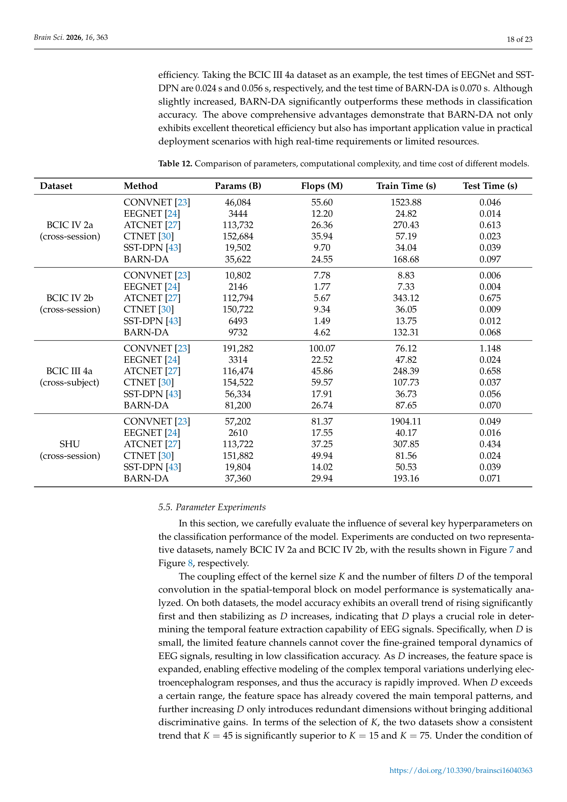

### Extraction assessment
- **Confidence:** 0.65 (below the configured 0.85 threshold; human review required).
- One or more equation candidates are ambiguous in raw extraction.

### Raw extracted text
```
Brain Sci. 2026, 16, 363
18 of 23
efficiency. Taking the BCIC III 4a dataset as an example, the test times of EEGNet and SST-
DPN are 0.024 s and 0.056 s, respectively, and the test time of BARN-DA is 0.070 s. Although
slightly increased, BARN-DA significantly outperforms these methods in classification
accuracy. The above comprehensive advantages demonstrate that BARN-DA not only
exhibits excellent theoretical efficiency but also has important application value in practical
deployment scenarios with high real-time requirements or limited resources.
Table 12. Comparison of parameters, computational complexity, and time cost of different models.
Dataset
Method
Params (B)
Flops (M)
Train Time (s)
Test Time (s)
BCIC IV 2a
(cross-session)
CONVNET [23]
46,084
55.60
1523.88
0.046
EEGNET [24]
3444
12.20
24.82
0.014
ATCNET [27]
113,732
26.36
270.43
0.613
CTNET [30]
152,684
35.94
57.19
0.023
SST-DPN [43]
19,502
9.70
34.04
0.039
BARN-DA
35,622
24.55
168.68
0.097
BCIC IV 2b
(cross-session)
CONVNET [23]
10,802
7.78
8.83
0.006
EEGNET [24]
2146
1.77
7.33
0.004
ATCNET [27]
112,794
5.67
343.12
0.675
CTNET [30]
150,722
9.34
36.05
0.009
SST-DPN [43]
6493
1.49
13.75
0.012
BARN-DA
9732
4.62
132.31
0.068
BCIC III 4a
(cross-subject)
CONVNET [23]
191,282
100.07
76.12
1.148
EEGNET [24]
3314
22.52
47.82
0.024
ATCNET [27]
116,474
45.86
248.39
0.658
CTNET [30]
154,522
59.57
107.73
0.037
SST-DPN [43]
56,334
17.91
36.73
0.056
BARN-DA
81,200
26.74
87.65
0.070
SHU
(cross-session)
CONVNET [23]
57,202
81.37
1904.11
0.049
EEGNET [24]
2610
17.55
40.17
0.016
ATCNET [27]
113,722
37.25
307.85
0.434
CTNET [30]
151,882
49.94
81.56
0.024
SST-DPN [43]
19,804
14.02
50.53
0.039
BARN-DA
37,360
29.94
193.16
0.071
5.5. Parameter Experiments
In this section, we carefully evaluate the influence of several key hyperparameters on
the classification performance of the model. Experiments are conducted on two representa-
tive datasets, namely BCIC IV 2a and BCIC IV 2b, with the results shown in Figure 7 and
Figure 8, respectively.
The coupling effect of the kernel size K and the number of filters D of the temporal
convolution in the spatial-temporal block on model performance is systematically ana-
lyzed. On both datasets, the model accuracy exhibits an overall trend of rising significantly
first and then stabilizing as D increases, indicating that D plays a crucial role in deter-
mining the temporal feature extraction capability of EEG signals. Specifically, when D is
small, the limited feature channels cannot cover the fine-grained temporal dynamics of
EEG signals, resulting in low classification accuracy. As D increases, the feature space is
expanded, enabling effective modeling of the complex temporal variations underlying elec-
troencephalogram responses, and thus the accuracy is rapidly improved. When D exceeds
a certain range, the feature space has already covered the main temporal patterns, and
further increasing D only introduces redundant dimensions without bringing additional
discriminative gains. In terms of the selection of K, the two datasets show a consistent
trend that K = 45 is significantly superior to K = 15 and K = 75. Under the condition of
https://doi.org/10.3390/brainsci16040363

```

### Equation candidates
- `page-018-equation-001` — review_required (confidence 0.45; page 18).
```
trend that K = 45 is significantly superior to K = 15 and K = 75. Under the condition of
```

## Page 19
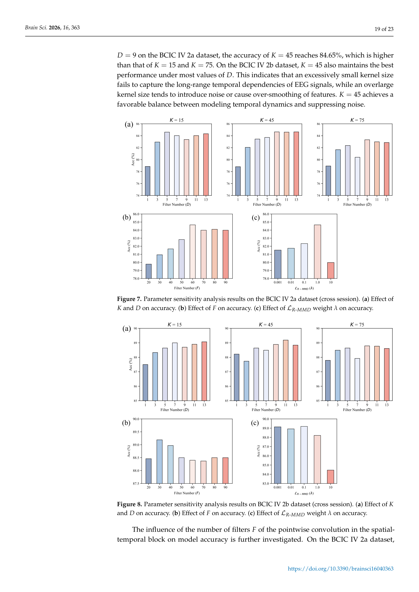

### Extraction assessment
- **Confidence:** 0.65 (below the configured 0.85 threshold; human review required).
- One or more equation candidates are ambiguous in raw extraction.

### Raw extracted text
```
Brain Sci. 2026, 16, 363
19 of 23
D = 9 on the BCIC IV 2a dataset, the accuracy of K = 45 reaches 84.65%, which is higher
than that of K = 15 and K = 75. On the BCIC IV 2b dataset, K = 45 also maintains the best
performance under most values of D. This indicates that an excessively small kernel size
fails to capture the long-range temporal dependencies of EEG signals, while an overlarge
kernel size tends to introduce noise or cause over-smoothing of features. K = 45 achieves a
favorable balance between modeling temporal dynamics and suppressing noise.
1
3
5
7
9
11
13
Filter Number (D)
74
76
78
80
82
84
86
Acc (%)
K = 15
1
3
5
7
9
11
13
Filter Number (D)
74
76
78
80
82
84
86
K = 45
1
3
5
7
9
11
13
Filter Number (D)
74
76
78
80
82
84
86
K = 75
(a)
20
30
40
50
60
70
80
90
Filter Number (F)
78.0
79.0
80.0
81.0
82.0
83.0
84.0
85.0
86.0
Acc (%)
0.001
0.01
0.1
1.0
10
R
MMD ( )
78.0
79.0
80.0
81.0
82.0
83.0
84.0
85.0
86.0
Acc (%)
(b)
(c)
Figure 7. Parameter sensitivity analysis results on the BCIC IV 2a dataset (cross session). (a) Effect of
K and D on accuracy. (b) Effect of F on accuracy. (c) Effect of LR-MMD weight λ on accuracy.
1
3
5
7
9
11
13
Filter Number (D)
85
86
87
88
89
90
Acc (%)
K = 15
1
3
5
7
9
11
13
Filter Number (D)
85
86
87
88
89
90
K = 45
1
3
5
7
9
11
13
Filter Number (D)
85
86
87
88
89
90
K = 75
(a)
20
30
40
50
60
70
80
90
Filter Number (F)
87.5
88.0
88.5
89.0
89.5
90.0
Acc (%)
0.001
0.01
0.1
1.0
10
R
MMD ( )
83.0
84.0
85.0
86.0
87.0
88.0
89.0
90.0
Acc (%)
(b)
(c)
Figure 8. Parameter sensitivity analysis results on BCIC IV 2b dataset (cross session). (a) Effect of K
and D on accuracy. (b) Effect of F on accuracy. (c) Effect of LR-MMD weight λ on accuracy.
The influence of the number of filters F of the pointwise convolution in the spatial-
temporal block on model accuracy is further investigated. On the BCIC IV 2a dataset,
https://doi.org/10.3390/brainsci16040363

```

### Textual figure-caption evidence
- Figure 7. Parameter sensitivity analysis results on the BCIC IV 2a dataset (cross session). (a) Effect of
- Figure 8. Parameter sensitivity analysis results on BCIC IV 2b dataset (cross session). (a) Effect of K
- Captions are page-level text evidence and are not associated with embedded images.

### Equation candidates
- `page-019-equation-001` — raw_text_preserved (confidence 0.98; page 19).
```
D = 9 on the BCIC IV 2a dataset, the accuracy of K = 45 reaches 84.65%, which is higher
```
- `page-019-equation-002` — review_required (confidence 0.45; page 19).
```
than that of K = 15 and K = 75. On the BCIC IV 2b dataset, K = 45 also maintains the best
```
- `page-019-equation-003` — review_required (confidence 0.45; page 19).
```
kernel size tends to introduce noise or cause over-smoothing of features. K = 45 achieves a
```
- `page-019-equation-004` — raw_text_preserved (confidence 0.98; page 19).
```
K = 15
```
- `page-019-equation-005` — raw_text_preserved (confidence 0.98; page 19).
```
K = 45
```
- `page-019-equation-006` — raw_text_preserved (confidence 0.98; page 19).
```
K = 75
```
- `page-019-equation-007` — raw_text_preserved (confidence 0.98; page 19).
```
K = 15
```
- `page-019-equation-008` — raw_text_preserved (confidence 0.98; page 19).
```
K = 45
```
- `page-019-equation-009` — raw_text_preserved (confidence 0.98; page 19).
```
K = 75
```

## Page 20
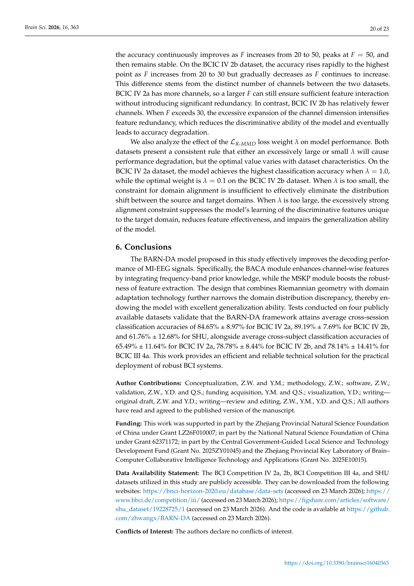

### Extraction assessment
- **Confidence:** 0.65 (below the configured 0.85 threshold; human review required).
- One or more equation candidates are ambiguous in raw extraction.

### Raw extracted text
```
Brain Sci. 2026, 16, 363
20 of 23
the accuracy continuously improves as F increases from 20 to 50, peaks at F = 50, and
then remains stable. On the BCIC IV 2b dataset, the accuracy rises rapidly to the highest
point as F increases from 20 to 30 but gradually decreases as F continues to increase.
This difference stems from the distinct number of channels between the two datasets.
BCIC IV 2a has more channels, so a larger F can still ensure sufficient feature interaction
without introducing significant redundancy. In contrast, BCIC IV 2b has relatively fewer
channels. When F exceeds 30, the excessive expansion of the channel dimension intensifies
feature redundancy, which reduces the discriminative ability of the model and eventually
leads to accuracy degradation.
We also analyze the effect of the LR-MMD loss weight λ on model performance. Both
datasets present a consistent rule that either an excessively large or small λ will cause
performance degradation, but the optimal value varies with dataset characteristics. On the
BCIC IV 2a dataset, the model achieves the highest classification accuracy when λ = 1.0,
while the optimal weight is λ = 0.1 on the BCIC IV 2b dataset. When λ is too small, the
constraint for domain alignment is insufficient to effectively eliminate the distribution
shift between the source and target domains. When λ is too large, the excessively strong
alignment constraint suppresses the model’s learning of the discriminative features unique
to the target domain, reduces feature effectiveness, and impairs the generalization ability
of the model.
6. Conclusions
The BARN-DA model proposed in this study effectively improves the decoding perfor-
mance of MI-EEG signals. Specifically, the BACA module enhances channel-wise features
by integrating frequency-band prior knowledge, while the MSKP module boosts the robust-
ness of feature extraction. The design that combines Riemannian geometry with domain
adaptation technology further narrows the domain distribution discrepancy, thereby en-
dowing the model with excellent generalization ability. Tests conducted on four publicly
available datasets validate that the BARN-DA framework attains average cross-session
classification accuracies of 84.65% ± 8.97% for BCIC IV 2a, 89.19% ± 7.69% for BCIC IV 2b,
and 61.76% ± 12.68% for SHU, alongside average cross-subject classification accuracies of
65.49% ± 11.64% for BCIC IV 2a, 78.78% ± 8.44% for BCIC IV 2b, and 78.14% ± 14.41% for
BCIC III 4a. This work provides an efficient and reliable technical solution for the practical
deployment of robust BCI systems.
Author Contributions: Conceptualization, Z.W. and Y.M.; methodology, Z.W.; software, Z.W.;
validation, Z.W., Y.D. and Q.S.; funding acquisition, Y.M. and Q.S.; visualization, Y.D.; writing—
original draft, Z.W. and Y.D.; writing—review and editing, Z.W., Y.M., Y.D. and Q.S.; All authors
have read and agreed to the published version of the manuscript.
Funding: This work was supported in part by the Zhejiang Provincial Natural Science Foundation
of China under Grant LZ26F010007; in part by the National Natural Science Foundation of China
under Grant 62371172; in part by the Central Government-Guided Local Science and Technology
Development Fund (Grant No. 2025ZY01045) and the Zhejiang Provincial Key Laboratory of Brain–
Computer Collaborative Intelligence Technology and Applications (Grant No. 2025E10015).
Data Availability Statement: The BCI Competition IV 2a, 2b, BCI Competition III 4a, and SHU
datasets utilized in this study are publicly accessible. They can be downloaded from the following
websites: https://bnci-horizon-2020.eu/database/data-sets (accessed on 23 March 2026); https://
www.bbci.de/competition/iii/ (accessed on 23 March 2026); https://figshare.com/articles/software/
shu_dataset/19228725/1 (accessed on 23 March 2026). And the code is available at https://github.
com/zhwangx/BARN-DA (accessed on 23 March 2026).
Conflicts of Interest: The authors declare no conflicts of interest.
https://doi.org/10.3390/brainsci16040363

```

### Equation candidates
- `page-020-equation-001` — review_required (confidence 0.45; page 20).
```
the accuracy continuously improves as F increases from 20 to 50, peaks at F = 50, and
```
- `page-020-equation-002` — review_required (confidence 0.45; page 20).
```
BCIC IV 2a dataset, the model achieves the highest classification accuracy when λ = 1.0,
```
- `page-020-equation-003` — review_required (confidence 0.45; page 20).
```
while the optimal weight is λ = 0.1 on the BCIC IV 2b dataset. When λ is too small, the
```
- `page-020-equation-004` — review_required (confidence 0.45; page 20).
```
classification accuracies of 84.65% ± 8.97% for BCIC IV 2a, 89.19% ± 7.69% for BCIC IV 2b,
```
- `page-020-equation-005` — review_required (confidence 0.45; page 20).
```
and 61.76% ± 12.68% for SHU, alongside average cross-subject classification accuracies of
```
- `page-020-equation-006` — review_required (confidence 0.45; page 20).
```
65.49% ± 11.64% for BCIC IV 2a, 78.78% ± 8.44% for BCIC IV 2b, and 78.14% ± 14.41% for
```
- `page-020-equation-007` — review_required (confidence 0.45; page 20).
```
shu_dataset/19228725/1 (accessed on 23 March 2026). And the code is available at https://github.
```

## Page 21
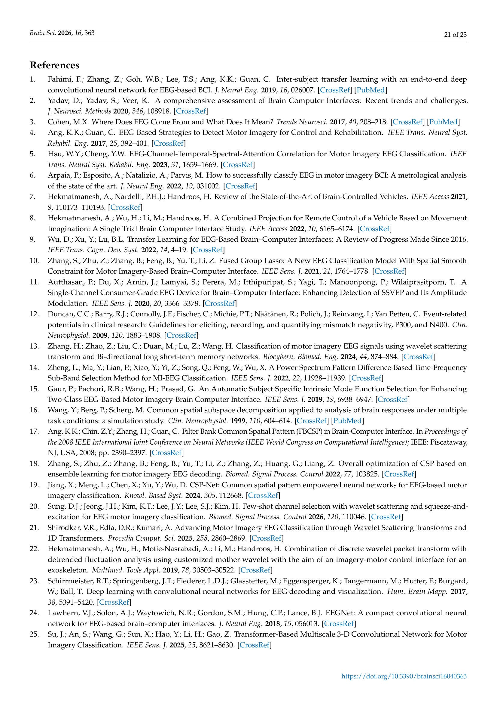

### Extraction assessment
- **Confidence:** 0.95 (meets the configured threshold).
- Machine-readable text was preserved with page-image provenance.

### Raw extracted text
```
Brain Sci. 2026, 16, 363
21 of 23
References
1.
Fahimi, F.; Zhang, Z.; Goh, W.B.; Lee, T.S.; Ang, K.K.; Guan, C. Inter-subject transfer learning with an end-to-end deep
convolutional neural network for EEG-based BCI. J. Neural Eng. 2019, 16, 026007. [CrossRef] [PubMed]
2.
Yadav, D.; Yadav, S.; Veer, K. A comprehensive assessment of Brain Computer Interfaces: Recent trends and challenges.
J. Neurosci. Methods 2020, 346, 108918. [CrossRef]
3.
Cohen, M.X. Where Does EEG Come From and What Does It Mean? Trends Neurosci. 2017, 40, 208–218. [CrossRef] [PubMed]
4.
Ang, K.K.; Guan, C. EEG-Based Strategies to Detect Motor Imagery for Control and Rehabilitation. IEEE Trans. Neural Syst.
Rehabil. Eng. 2017, 25, 392–401. [CrossRef]
5.
Hsu, W.Y.; Cheng, Y.W. EEG-Channel-Temporal-Spectral-Attention Correlation for Motor Imagery EEG Classification. IEEE
Trans. Neural Syst. Rehabil. Eng. 2023, 31, 1659–1669. [CrossRef]
6.
Arpaia, P.; Esposito, A.; Natalizio, A.; Parvis, M. How to successfully classify EEG in motor imagery BCI: A metrological analysis
of the state of the art. J. Neural Eng. 2022, 19, 031002. [CrossRef]
7.
Hekmatmanesh, A.; Nardelli, P.H.J.; Handroos, H. Review of the State-of-the-Art of Brain-Controlled Vehicles. IEEE Access 2021,
9, 110173–110193. [CrossRef]
8.
Hekmatmanesh, A.; Wu, H.; Li, M.; Handroos, H. A Combined Projection for Remote Control of a Vehicle Based on Movement
Imagination: A Single Trial Brain Computer Interface Study. IEEE Access 2022, 10, 6165–6174. [CrossRef]
9.
Wu, D.; Xu, Y.; Lu, B.L. Transfer Learning for EEG-Based Brain–Computer Interfaces: A Review of Progress Made Since 2016.
IEEE Trans. Cogn. Dev. Syst. 2022, 14, 4–19. [CrossRef]
10.
Zhang, S.; Zhu, Z.; Zhang, B.; Feng, B.; Yu, T.; Li, Z. Fused Group Lasso: A New EEG Classification Model With Spatial Smooth
Constraint for Motor Imagery-Based Brain–Computer Interface. IEEE Sens. J. 2021, 21, 1764–1778. [CrossRef]
11.
Autthasan, P.; Du, X.; Arnin, J.; Lamyai, S.; Perera, M.; Itthipuripat, S.; Yagi, T.; Manoonpong, P.; Wilaiprasitporn, T. A
Single-Channel Consumer-Grade EEG Device for Brain–Computer Interface: Enhancing Detection of SSVEP and Its Amplitude
Modulation. IEEE Sens. J. 2020, 20, 3366–3378. [CrossRef]
12.
Duncan, C.C.; Barry, R.J.; Connolly, J.F.; Fischer, C.; Michie, P.T.; Näätänen, R.; Polich, J.; Reinvang, I.; Van Petten, C. Event-related
potentials in clinical research: Guidelines for eliciting, recording, and quantifying mismatch negativity, P300, and N400. Clin.
Neurophysiol. 2009, 120, 1883–1908. [CrossRef]
13.
Zhang, H.; Zhao, Z.; Liu, C.; Duan, M.; Lu, Z.; Wang, H. Classification of motor imagery EEG signals using wavelet scattering
transform and Bi-directional long short-term memory networks. Biocybern. Biomed. Eng. 2024, 44, 874–884. [CrossRef]
14.
Zheng, L.; Ma, Y.; Lian, P.; Xiao, Y.; Yi, Z.; Song, Q.; Feng, W.; Wu, X. A Power Spectrum Pattern Difference-Based Time-Frequency
Sub-Band Selection Method for MI-EEG Classification. IEEE Sens. J. 2022, 22, 11928–11939. [CrossRef]
15.
Gaur, P.; Pachori, R.B.; Wang, H.; Prasad, G. An Automatic Subject Specific Intrinsic Mode Function Selection for Enhancing
Two-Class EEG-Based Motor Imagery-Brain Computer Interface. IEEE Sens. J. 2019, 19, 6938–6947. [CrossRef]
16.
Wang, Y.; Berg, P.; Scherg, M. Common spatial subspace decomposition applied to analysis of brain responses under multiple
task conditions: a simulation study. Clin. Neurophysiol. 1999, 110, 604–614. [CrossRef] [PubMed]
17.
Ang, K.K.; Chin, Z.Y.; Zhang, H.; Guan, C. Filter Bank Common Spatial Pattern (FBCSP) in Brain-Computer Interface. In Proceedings of
the 2008 IEEE International Joint Conference on Neural Networks (IEEE World Congress on Computational Intelligence); IEEE: Piscataway,
NJ, USA, 2008; pp. 2390–2397. [CrossRef]
18.
Zhang, S.; Zhu, Z.; Zhang, B.; Feng, B.; Yu, T.; Li, Z.; Zhang, Z.; Huang, G.; Liang, Z. Overall optimization of CSP based on
ensemble learning for motor imagery EEG decoding. Biomed. Signal Process. Control 2022, 77, 103825. [CrossRef]
19.
Jiang, X.; Meng, L.; Chen, X.; Xu, Y.; Wu, D. CSP-Net: Common spatial pattern empowered neural networks for EEG-based motor
imagery classification. Knowl. Based Syst. 2024, 305, 112668. [CrossRef]
20.
Sung, D.J.; Jeong, J.H.; Kim, K.T.; Lee, J.Y.; Lee, S.J.; Kim, H. Few-shot channel selection with wavelet scattering and squeeze-and-
excitation for EEG motor imagery classification. Biomed. Signal Process. Control 2026, 120, 110046. [CrossRef]
21.
Shirodkar, V.R.; Edla, D.R.; Kumari, A. Advancing Motor Imagery EEG Classification through Wavelet Scattering Transforms and
1D Transformers. Procedia Comput. Sci. 2025, 258, 2860–2869. [CrossRef]
22.
Hekmatmanesh, A.; Wu, H.; Motie-Nasrabadi, A.; Li, M.; Handroos, H. Combination of discrete wavelet packet transform with
detrended fluctuation analysis using customized mother wavelet with the aim of an imagery-motor control interface for an
exoskeleton. Multimed. Tools Appl. 2019, 78, 30503–30522. [CrossRef]
23.
Schirrmeister, R.T.; Springenberg, J.T.; Fiederer, L.D.J.; Glasstetter, M.; Eggensperger, K.; Tangermann, M.; Hutter, F.; Burgard,
W.; Ball, T. Deep learning with convolutional neural networks for EEG decoding and visualization. Hum. Brain Mapp. 2017,
38, 5391–5420. [CrossRef]
24.
Lawhern, V.J.; Solon, A.J.; Waytowich, N.R.; Gordon, S.M.; Hung, C.P.; Lance, B.J. EEGNet: A compact convolutional neural
network for EEG-based brain–computer interfaces. J. Neural Eng. 2018, 15, 056013. [CrossRef]
25.
Su, J.; An, S.; Wang, G.; Sun, X.; Hao, Y.; Li, H.; Gao, Z. Transformer-Based Multiscale 3-D Convolutional Network for Motor
Imagery Classification. IEEE Sens. J. 2025, 25, 8621–8630. [CrossRef]
https://doi.org/10.3390/brainsci16040363

```

## Page 22
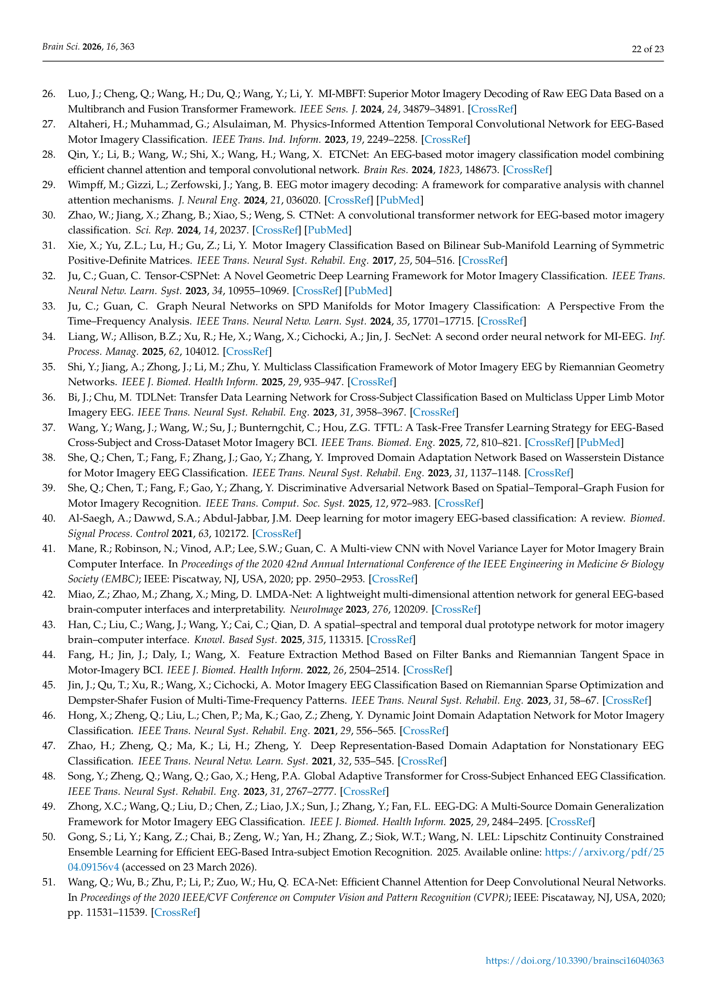

### Extraction assessment
- **Confidence:** 0.95 (meets the configured threshold).
- Machine-readable text was preserved with page-image provenance.

### Raw extracted text
```
Brain Sci. 2026, 16, 363
22 of 23
26.
Luo, J.; Cheng, Q.; Wang, H.; Du, Q.; Wang, Y.; Li, Y. MI-MBFT: Superior Motor Imagery Decoding of Raw EEG Data Based on a
Multibranch and Fusion Transformer Framework. IEEE Sens. J. 2024, 24, 34879–34891. [CrossRef]
27.
Altaheri, H.; Muhammad, G.; Alsulaiman, M. Physics-Informed Attention Temporal Convolutional Network for EEG-Based
Motor Imagery Classification. IEEE Trans. Ind. Inform. 2023, 19, 2249–2258. [CrossRef]
28.
Qin, Y.; Li, B.; Wang, W.; Shi, X.; Wang, H.; Wang, X. ETCNet: An EEG-based motor imagery classification model combining
efficient channel attention and temporal convolutional network. Brain Res. 2024, 1823, 148673. [CrossRef]
29.
Wimpff, M.; Gizzi, L.; Zerfowski, J.; Yang, B. EEG motor imagery decoding: A framework for comparative analysis with channel
attention mechanisms. J. Neural Eng. 2024, 21, 036020. [CrossRef] [PubMed]
30.
Zhao, W.; Jiang, X.; Zhang, B.; Xiao, S.; Weng, S. CTNet: A convolutional transformer network for EEG-based motor imagery
classification. Sci. Rep. 2024, 14, 20237. [CrossRef] [PubMed]
31.
Xie, X.; Yu, Z.L.; Lu, H.; Gu, Z.; Li, Y. Motor Imagery Classification Based on Bilinear Sub-Manifold Learning of Symmetric
Positive-Definite Matrices. IEEE Trans. Neural Syst. Rehabil. Eng. 2017, 25, 504–516. [CrossRef]
32.
Ju, C.; Guan, C. Tensor-CSPNet: A Novel Geometric Deep Learning Framework for Motor Imagery Classification. IEEE Trans.
Neural Netw. Learn. Syst. 2023, 34, 10955–10969. [CrossRef] [PubMed]
33.
Ju, C.; Guan, C.
Graph Neural Networks on SPD Manifolds for Motor Imagery Classification: A Perspective From the
Time–Frequency Analysis. IEEE Trans. Neural Netw. Learn. Syst. 2024, 35, 17701–17715. [CrossRef]
34.
Liang, W.; Allison, B.Z.; Xu, R.; He, X.; Wang, X.; Cichocki, A.; Jin, J. SecNet: A second order neural network for MI-EEG. Inf.
Process. Manag. 2025, 62, 104012. [CrossRef]
35.
Shi, Y.; Jiang, A.; Zhong, J.; Li, M.; Zhu, Y. Multiclass Classification Framework of Motor Imagery EEG by Riemannian Geometry
Networks. IEEE J. Biomed. Health Inform. 2025, 29, 935–947. [CrossRef]
36.
Bi, J.; Chu, M. TDLNet: Transfer Data Learning Network for Cross-Subject Classification Based on Multiclass Upper Limb Motor
Imagery EEG. IEEE Trans. Neural Syst. Rehabil. Eng. 2023, 31, 3958–3967. [CrossRef]
37.
Wang, Y.; Wang, J.; Wang, W.; Su, J.; Bunterngchit, C.; Hou, Z.G. TFTL: A Task-Free Transfer Learning Strategy for EEG-Based
Cross-Subject and Cross-Dataset Motor Imagery BCI. IEEE Trans. Biomed. Eng. 2025, 72, 810–821. [CrossRef] [PubMed]
38.
She, Q.; Chen, T.; Fang, F.; Zhang, J.; Gao, Y.; Zhang, Y. Improved Domain Adaptation Network Based on Wasserstein Distance
for Motor Imagery EEG Classification. IEEE Trans. Neural Syst. Rehabil. Eng. 2023, 31, 1137–1148. [CrossRef]
39.
She, Q.; Chen, T.; Fang, F.; Gao, Y.; Zhang, Y. Discriminative Adversarial Network Based on Spatial–Temporal–Graph Fusion for
Motor Imagery Recognition. IEEE Trans. Comput. Soc. Syst. 2025, 12, 972–983. [CrossRef]
40.
Al-Saegh, A.; Dawwd, S.A.; Abdul-Jabbar, J.M. Deep learning for motor imagery EEG-based classification: A review. Biomed.
Signal Process. Control 2021, 63, 102172. [CrossRef]
41.
Mane, R.; Robinson, N.; Vinod, A.P.; Lee, S.W.; Guan, C. A Multi-view CNN with Novel Variance Layer for Motor Imagery Brain
Computer Interface. In Proceedings of the 2020 42nd Annual International Conference of the IEEE Engineering in Medicine & Biology
Society (EMBC); IEEE: Piscatway, NJ, USA, 2020; pp. 2950–2953. [CrossRef]
42.
Miao, Z.; Zhao, M.; Zhang, X.; Ming, D. LMDA-Net: A lightweight multi-dimensional attention network for general EEG-based
brain-computer interfaces and interpretability. NeuroImage 2023, 276, 120209. [CrossRef]
43.
Han, C.; Liu, C.; Wang, J.; Wang, Y.; Cai, C.; Qian, D. A spatial–spectral and temporal dual prototype network for motor imagery
brain–computer interface. Knowl. Based Syst. 2025, 315, 113315. [CrossRef]
44.
Fang, H.; Jin, J.; Daly, I.; Wang, X. Feature Extraction Method Based on Filter Banks and Riemannian Tangent Space in
Motor-Imagery BCI. IEEE J. Biomed. Health Inform. 2022, 26, 2504–2514. [CrossRef]
45.
Jin, J.; Qu, T.; Xu, R.; Wang, X.; Cichocki, A. Motor Imagery EEG Classification Based on Riemannian Sparse Optimization and
Dempster-Shafer Fusion of Multi-Time-Frequency Patterns. IEEE Trans. Neural Syst. Rehabil. Eng. 2023, 31, 58–67. [CrossRef]
46.
Hong, X.; Zheng, Q.; Liu, L.; Chen, P.; Ma, K.; Gao, Z.; Zheng, Y. Dynamic Joint Domain Adaptation Network for Motor Imagery
Classification. IEEE Trans. Neural Syst. Rehabil. Eng. 2021, 29, 556–565. [CrossRef]
47.
Zhao, H.; Zheng, Q.; Ma, K.; Li, H.; Zheng, Y.
Deep Representation-Based Domain Adaptation for Nonstationary EEG
Classification. IEEE Trans. Neural Netw. Learn. Syst. 2021, 32, 535–545. [CrossRef]
48.
Song, Y.; Zheng, Q.; Wang, Q.; Gao, X.; Heng, P.A. Global Adaptive Transformer for Cross-Subject Enhanced EEG Classification.
IEEE Trans. Neural Syst. Rehabil. Eng. 2023, 31, 2767–2777. [CrossRef]
49.
Zhong, X.C.; Wang, Q.; Liu, D.; Chen, Z.; Liao, J.X.; Sun, J.; Zhang, Y.; Fan, F.L. EEG-DG: A Multi-Source Domain Generalization
Framework for Motor Imagery EEG Classification. IEEE J. Biomed. Health Inform. 2025, 29, 2484–2495. [CrossRef]
50.
Gong, S.; Li, Y.; Kang, Z.; Chai, B.; Zeng, W.; Yan, H.; Zhang, Z.; Siok, W.T.; Wang, N. LEL: Lipschitz Continuity Constrained
Ensemble Learning for Efficient EEG-Based Intra-subject Emotion Recognition. 2025. Available online: https://arxiv.org/pdf/25
04.09156v4 (accessed on 23 March 2026).
51.
Wang, Q.; Wu, B.; Zhu, P.; Li, P.; Zuo, W.; Hu, Q. ECA-Net: Efficient Channel Attention for Deep Convolutional Neural Networks.
In Proceedings of the 2020 IEEE/CVF Conference on Computer Vision and Pattern Recognition (CVPR); IEEE: Piscataway, NJ, USA, 2020;
pp. 11531–11539. [CrossRef]
https://doi.org/10.3390/brainsci16040363

```

## Page 23


### Extraction assessment
- **Confidence:** 0.65 (below the configured 0.85 threshold; human review required).
- One or more equation candidates are ambiguous in raw extraction.

### Raw extracted text
```
Brain Sci. 2026, 16, 363
23 of 23
52.
Tibermacine, I.E.; Russo, S.; Tibermacine, A.; Rabehi, A.; Nail, B.; Kadri, K.; Napoli, C. Riemannian Geometry-Based EEG
Approaches: A Literature Review. arXiv 2024, arXiv:2407.20250.
53.
Brunner, C.; Leeb, R.; Müller-Putz, G.; Schlögl, A.; Pfurtscheller, G. BCI Competition 2008–Graz data set A. Technical Report Graz
data set A, IEEE Dataport. 2008. Available online: https://ieee-dataport.org/documents/bci-competition-2008-graz-data-set
(accessed on 23 March 2026).
54.
Leeb, R.; Brunner, C.; Müller-Putz, G.; Schlösgl, A.; Pfurtscheller, G. BCI Competition 2008–Graz Data Set B. Technical
Report 16, Graz University of Technology. 2008. Available online: https://www.bbci.de/competition/iv/desc_2b.pdf (accessed
on 23 March 2026).
55.
Blankertz, B.; Muller, K.R.; Krusienski, D.; Schalk, G.; Wolpaw, J.; Schlogl, A.; Pfurtscheller, G.; Millan, J.; Schroder, M.; Birbaumer,
N. The BCI competition III: Validating alternative approaches to actual BCI problems. IEEE Trans. Neural Syst. Rehabil. Eng. 2006,
14, 153–159. [CrossRef] [PubMed]
56.
Ma, J.; Yang, B.; Qiu, W.; Li, Y.; Gao, S.; Xia, X. A large EEG dataset for studying cross-session variability in motor imagery
brain-computer interface. Sci. Data 2022, 9, 531. [CrossRef]
57.
van der Maaten, L.; Hinton, G. Visualizing Data using t-SNE. J. Mach. Learn. Res. 2008, 9, 2579–2605.
Disclaimer/Publisher’s Note: The statements, opinions and data contained in all publications are solely those of the individual
author(s) and contributor(s) and not of MDPI and/or the editor(s). MDPI and/or the editor(s) disclaim responsibility for any injury to
people or property resulting from any ideas, methods, instructions or products referred to in the content.
https://doi.org/10.3390/brainsci16040363

```

### Equation candidates
- `page-023-equation-001` — review_required (confidence 0.45; page 23).
```
Report 16, Graz University of Technology. 2008. Available online: https://www.bbci.de/competition/iv/desc_2b.pdf (accessed
```
