# computation-13-00116-v2

## Source
- PDF: `/Users/diego/Desktop/Proyectos/papersmith-ai/guidance/reference-papers/source/computation-13-00116-v2.pdf`
- Source SHA-256: `9c08e20f18c788a8037e610c2dc72741db01002e3335bfb99e78bdf6e75df332`
- Rendered pages: 28 at 200 DPI (PyMuPDF).
- Confidence threshold: 0.85.
- Table policy: lite evidence only. Possible tables are retained only as exact raw page text and rendered page images; no rows, columns, cells, or inferred values are extracted.
- Equation policy: equation candidates retain exact raw extracted text; this extractor does not synthesize LaTeX.

## Page 1
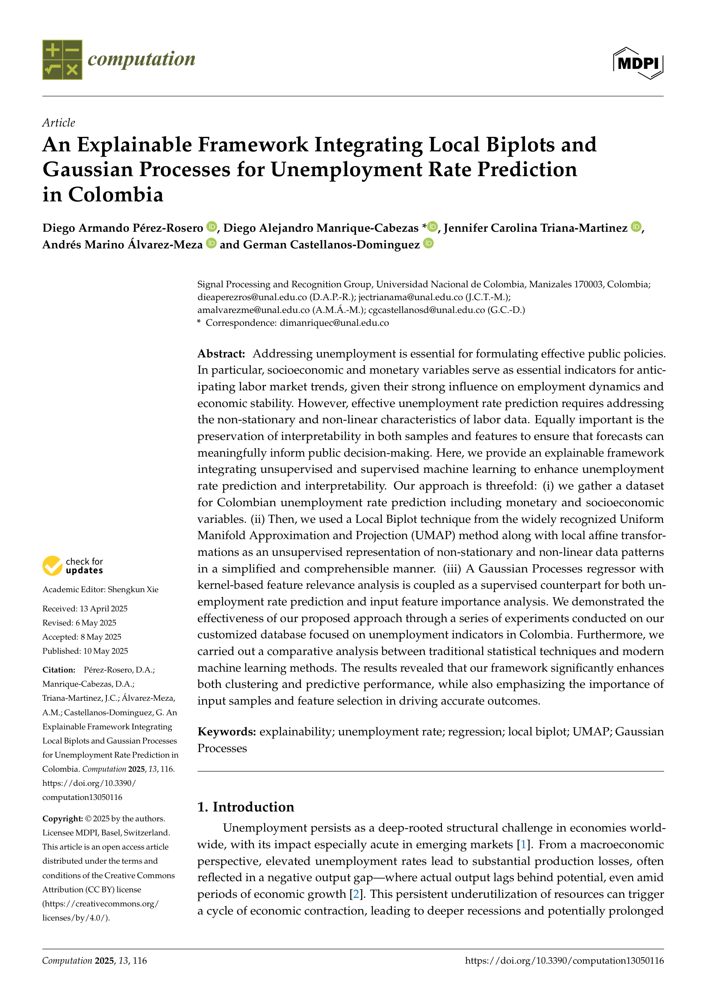

### Extraction assessment
- **Confidence:** 0.95 (meets the configured threshold).
- Machine-readable text was preserved with page-image provenance.

### Raw extracted text
```
Academic Editor: Shengkun Xie
Received: 13 April 2025
Revised: 6 May 2025
Accepted: 8 May 2025
Published: 10 May 2025
Citation:
Pérez-Rosero, D.A.;
Manrique-Cabezas, D.A.;
Triana-Martinez, J.C.; Álvarez-Meza,
A.M.; Castellanos-Dominguez, G. An
Explainable Framework Integrating
Local Biplots and Gaussian Processes
for Unemployment Rate Prediction in
Colombia. Computation 2025, 13, 116.
https://doi.org/10.3390/
computation13050116
Copyright: © 2025 by the authors.
Licensee MDPI, Basel, Switzerland.
This article is an open access article
distributed under the terms and
conditions of the Creative Commons
Attribution (CC BY) license
(https://creativecommons.org/
licenses/by/4.0/).
Article
An Explainable Framework Integrating Local Biplots and
Gaussian Processes for Unemployment Rate Prediction
in Colombia
Diego Armando Pérez-Rosero
, Diego Alejandro Manrique-Cabezas *
, Jennifer Carolina Triana-Martinez
,
Andrés Marino Álvarez-Meza
and German Castellanos-Dominguez
Signal Processing and Recognition Group, Universidad Nacional de Colombia, Manizales 170003, Colombia;
dieaperezros@unal.edu.co (D.A.P.-R.); jectrianama@unal.edu.co (J.C.T.-M.);
amalvarezme@unal.edu.co (A.M.Á.-M.); cgcastellanosd@unal.edu.co (G.C.-D.)
* Correspondence: dimanriquec@unal.edu.co
Abstract: Addressing unemployment is essential for formulating effective public policies.
In particular, socioeconomic and monetary variables serve as essential indicators for antic-
ipating labor market trends, given their strong influence on employment dynamics and
economic stability. However, effective unemployment rate prediction requires addressing
the non-stationary and non-linear characteristics of labor data. Equally important is the
preservation of interpretability in both samples and features to ensure that forecasts can
meaningfully inform public decision-making. Here, we provide an explainable framework
integrating unsupervised and supervised machine learning to enhance unemployment
rate prediction and interpretability. Our approach is threefold: (i) we gather a dataset
for Colombian unemployment rate prediction including monetary and socioeconomic
variables. (ii) Then, we used a Local Biplot technique from the widely recognized Uniform
Manifold Approximation and Projection (UMAP) method along with local affine transfor-
mations as an unsupervised representation of non-stationary and non-linear data patterns
in a simplified and comprehensible manner. (iii) A Gaussian Processes regressor with
kernel-based feature relevance analysis is coupled as a supervised counterpart for both un-
employment rate prediction and input feature importance analysis. We demonstrated the
effectiveness of our proposed approach through a series of experiments conducted on our
customized database focused on unemployment indicators in Colombia. Furthermore, we
carried out a comparative analysis between traditional statistical techniques and modern
machine learning methods. The results revealed that our framework significantly enhances
both clustering and predictive performance, while also emphasizing the importance of
input samples and feature selection in driving accurate outcomes.
Keywords: explainability; unemployment rate; regression; local biplot; UMAP; Gaussian
Processes
1. Introduction
Unemployment persists as a deep-rooted structural challenge in economies world-
wide, with its impact especially acute in emerging markets [1]. From a macroeconomic
perspective, elevated unemployment rates lead to substantial production losses, often
reflected in a negative output gap—where actual output lags behind potential, even amid
periods of economic growth [2]. This persistent underutilization of resources can trigger
a cycle of economic contraction, leading to deeper recessions and potentially prolonged
Computation 2025, 13, 116
https://doi.org/10.3390/computation13050116

```

## Page 2


### Extraction assessment
- **Confidence:** 0.95 (meets the configured threshold).
- Machine-readable text was preserved with page-image provenance.

### Raw extracted text
```
Computation 2025, 13, 116
2 of 28
depressions, especially in vulnerable emerging economies [3]. Furthermore, rising un-
employment exacerbates socio-economic challenges by diminishing both individual and
collective incomes, thereby escalating poverty rates and worsening financial inequality [4].
For instance, in response to the unfavorable economic climate of 2023, central banks world-
wide implemented aggressive monetary policies, marking the most rapid escalation of
intervention interest rates since the 1980s [5].
Specifically for Colombia, the unemployment rate has reached alarming levels, peak-
ing at a historical high of 26% during the 1999 financial crisis and remaining elevated at
13.25% throughout 2023. This contrasts sharply with the global unemployment rate, which
was 5.1% in 2023, revealing a stark employment dissatisfaction gap that affected nearly
435 million people worldwide [6]. Despite numerous policy initiatives, Colombia’s unem-
ployment rate has consistently remained near 10%, underscoring the limited effectiveness
of existing employment generation strategies in fostering meaningful improvements in
national labor market outcomes. This sustained high level of unemployment points to
deeper structural deficiencies, where prevailing policies have failed to disrupt the cycle of
joblessness. As a result, a substantial segment of the population continues to be excluded
from formal labor market participation, reinforcing patterns of economic marginalization
and social inequality [7].
Hence, accurately predicting unemployment rates is essential for governments to
formulate effective policies that enhance well-being and foster sustainable development.
Precise forecasts enable policymakers to foresee economic difficulties and formulate ways to
alleviate the detrimental impacts on society and economy [8]. Such information is especially
critical in countries characterized by diverse and rapidly changing socio-economic condi-
tions, i.e., Colombia, where reliable forecasting plays a central role in shaping responsive
and effective policy interventions [9]. The success of these policies is intrinsically linked
to the accuracy of unemployment projections, as robust forecasts enable more informed
decision-making and efficient allocation of public resources [10]. Therefore, enhancing the
precision of unemployment forecasting is not merely a technical endeavor but a strategic
imperative for sound economic planning and policy design [11].
Nevertheless, accurate unemployment forecasting necessitates the integration of both
monetary and socioeconomic variables, as these indicators capture key labor market dynam-
ics and the broader impact of economic policies [12]. Moreover, incorporating data from
multiple, heterogeneous sources is essential, as it provides critical insights into economic
activity, inflation, interest rates, and employment conditions. To ensure the robustness
and reliability of predictive models, it is also vital to harmonize data both spatially and
temporally—aligning measurements across consistent geographic regions and timeframes
to preserve coherence and comparability [13]. The quality and accessibility of these data
sources are pivotal for building comprehensive and representative datasets to support the
development of more targeted and effective policy responses [14].
In Colombia, the Departamento Administrativo Nacional de Estadística (DANE)
produces official labor market statistics using methodologies aligned with international
standards, thereby ensuring consistency and cross-national comparability [15]. However,
the absence of binding regulations mandating the synchronization of statistical data across
governmental entities poses a risk to the reliability and coherence of unemployment rate
predictive models. As the principal authority of the Sistema Estadístico Nacional (SEN),
DANE is entrusted with coordinating, regulating, and modernizing national statistical
processes. While it holds the mandate to oversee data review and methodological updates,
the lack of explicit institutional requirements for inter-agency data harmonization continues
to hinder the consistency and integration of labor market information [16].

```

## Page 3
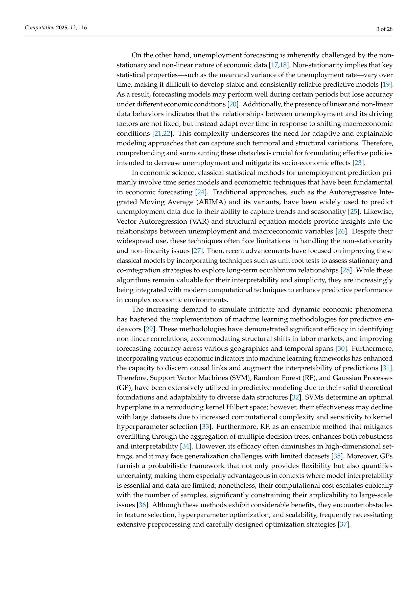

### Extraction assessment
- **Confidence:** 0.95 (meets the configured threshold).
- Machine-readable text was preserved with page-image provenance.

### Raw extracted text
```
Computation 2025, 13, 116
3 of 28
On the other hand, unemployment forecasting is inherently challenged by the non-
stationary and non-linear nature of economic data [17,18]. Non-stationarity implies that key
statistical properties—such as the mean and variance of the unemployment rate—vary over
time, making it difficult to develop stable and consistently reliable predictive models [19].
As a result, forecasting models may perform well during certain periods but lose accuracy
under different economic conditions [20]. Additionally, the presence of linear and non-linear
data behaviors indicates that the relationships between unemployment and its driving
factors are not fixed, but instead adapt over time in response to shifting macroeconomic
conditions [21,22]. This complexity underscores the need for adaptive and explainable
modeling approaches that can capture such temporal and structural variations. Therefore,
comprehending and surmounting these obstacles is crucial for formulating effective policies
intended to decrease unemployment and mitigate its socio-economic effects [23].
In economic science, classical statistical methods for unemployment prediction pri-
marily involve time series models and econometric techniques that have been fundamental
in economic forecasting [24]. Traditional approaches, such as the Autoregressive Inte-
grated Moving Average (ARIMA) and its variants, have been widely used to predict
unemployment data due to their ability to capture trends and seasonality [25]. Likewise,
Vector Autoregression (VAR) and structural equation models provide insights into the
relationships between unemployment and macroeconomic variables [26]. Despite their
widespread use, these techniques often face limitations in handling the non-stationarity
and non-linearity issues [27]. Then, recent advancements have focused on improving these
classical models by incorporating techniques such as unit root tests to assess stationary and
co-integration strategies to explore long-term equilibrium relationships [28]. While these
algorithms remain valuable for their interpretability and simplicity, they are increasingly
being integrated with modern computational techniques to enhance predictive performance
in complex economic environments.
The increasing demand to simulate intricate and dynamic economic phenomena
has hastened the implementation of machine learning methodologies for predictive en-
deavors [29]. These methodologies have demonstrated significant efficacy in identifying
non-linear correlations, accommodating structural shifts in labor markets, and improving
forecasting accuracy across various geographies and temporal spans [30]. Furthermore,
incorporating various economic indicators into machine learning frameworks has enhanced
the capacity to discern causal links and augment the interpretability of predictions [31].
Therefore, Support Vector Machines (SVM), Random Forest (RF), and Gaussian Processes
(GP), have been extensively utilized in predictive modeling due to their solid theoretical
foundations and adaptability to diverse data structures [32]. SVMs determine an optimal
hyperplane in a reproducing kernel Hilbert space; however, their effectiveness may decline
with large datasets due to increased computational complexity and sensitivity to kernel
hyperparameter selection [33]. Furthermore, RF, as an ensemble method that mitigates
overfitting through the aggregation of multiple decision trees, enhances both robustness
and interpretability [34]. However, its efficacy often diminishes in high-dimensional set-
tings, and it may face generalization challenges with limited datasets [35]. Moreover, GPs
furnish a probabilistic framework that not only provides flexibility but also quantifies
uncertainty, making them especially advantageous in contexts where model interpretability
is essential and data are limited; nonetheless, their computational cost escalates cubically
with the number of samples, significantly constraining their applicability to large-scale
issues [36]. Although these methods exhibit considerable benefits, they encounter obstacles
in feature selection, hyperparameter optimization, and scalability, frequently necessitating
extensive preprocessing and carefully designed optimization strategies [37].

```

## Page 4


### Extraction assessment
- **Confidence:** 0.95 (meets the configured threshold).
- Machine-readable text was preserved with page-image provenance.

### Raw extracted text
```
Computation 2025, 13, 116
4 of 28
Recently, Deep Learning models have been proposed to improve the accuracy of
forecasts [38]. Namely, Long Short-Term Memory (LSTM) networks have shown promise
in capturing complex patterns and dependencies in unemployment data due to their ability
to handle large datasets and non-linear relationships [39]. Additionally, hybrid models,
which combine ARIMA with machine learning techniques like GARCH corrections or
Markov chains, address issues like heteroscedasticity and non-stationarity [40]. Recent
studies demonstrate that hybrid models outperform traditional approaches in managing
the dynamic nature of unemployment trends across different economic contexts and specific
geographic regions [41]. This progress indicates a growing recognition of the importance
of advanced analytical tools in informing economic policies and strategies to mitigate
unemployment [42]. Nevertheless, Deep Learning approaches are often prone to overfitting
and suffer from a lack of transparent interpretability, which can hinder their applicability
in policy-driven contexts where model explainability is crucial [43].
In this work, we propose an explainable and integrative machine learning framework
that combines both unsupervised and supervised approaches to improve the prediction
and interpretability of unemployment rates in Colombia. Our methodology unfolds in
three main stages:
•
We construct a comprehensive dataset tailored for unemployment rate prediction in
Colombia, incorporating monetary and socioeconomic indicators.
•
We apply a local biplot technique based on the widely adopted unsuperviseed
non-linear dimensionality reduction method, the Uniform Manifold Approximation
and Projection (UMAP), enriched with local affine transformations, to capture non-
stationary and non-linear data patterns in a low-dimensional and interpretable space.
•
We deploy a Gaussian Process regressor enhanced with kernel-based relevance analy-
sis to perform accurate predictions and assess feature importance within the super-
vised learning component.
Our framework is evaluated through extensive experiments on a curated database of
Colombian unemployment indicators. We also conduct a comparative analysis between
conventional statistical models and modern machine learning techniques. Results show
that our approach not only outperforms traditional methods in terms of clustering quality
and predictive error but also provides valuable insights into the contribution of individual
features and data samples, fostering transparency and informed decision-making.
The remainder of this paper is organized as follows: Section 2 introduces the materials
and methods. Sections 3 and 4 discuss the experiments and results. Finally, Section 5
outlines the concluding remarks.
2. Materials and Methods
2.1. Colombian Unemployment Rate Prediction Dataset
We constructed a comprehensive database comprising statistical records from January
2005 to December 2023, aimed at predicting unemployment rates in Colombia by integrating
both monetary and socioeconomic variables. Monetary indicators, such as interest rates
and inflation, play a pivotal role in shaping economic cycles and influencing labor market
demand, making them essential components for forecasting unemployment trends [44].
In parallel, socioeconomic factors—including educational attainment, household income,
and other structural indicators—offer valuable insights into the long-term dynamics of
labor market participation and worker mobility [45]. Despite the acknowledged relevance
of these variables, their joint inclusion in predictive unemployment models remains limited
in the literature. Our methodology addresses this gap by combining macroeconomic and
social dimensions, enabling a more holistic understanding of the multifaceted drivers of
unemployment [46].

```

## Page 5
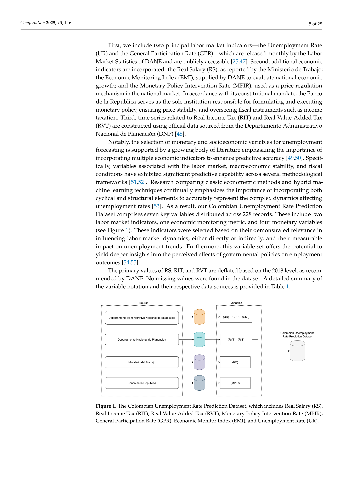

### Extraction assessment
- **Confidence:** 0.95 (meets the configured threshold).
- Machine-readable text was preserved with page-image provenance.

### Raw extracted text
```
Computation 2025, 13, 116
5 of 28
First, we include two principal labor market indicators—the Unemployment Rate
(UR) and the General Participation Rate (GPR)—which are released monthly by the Labor
Market Statistics of DANE and are publicly accessible [25,47]. Second, additional economic
indicators are incorporated: the Real Salary (RS), as reported by the Ministerio de Trabajo;
the Economic Monitoring Index (EMI), supplied by DANE to evaluate national economic
growth; and the Monetary Policy Intervention Rate (MPIR), used as a price regulation
mechanism in the national market. In accordance with its constitutional mandate, the Banco
de la República serves as the sole institution responsible for formulating and executing
monetary policy, ensuring price stability, and overseeing fiscal instruments such as income
taxation. Third, time series related to Real Income Tax (RIT) and Real Value-Added Tax
(RVT) are constructed using official data sourced from the Departamento Administrativo
Nacional de Planeación (DNP) [48].
Notably, the selection of monetary and socioeconomic variables for unemployment
forecasting is supported by a growing body of literature emphasizing the importance of
incorporating multiple economic indicators to enhance predictive accuracy [49,50]. Specif-
ically, variables associated with the labor market, macroeconomic stability, and fiscal
conditions have exhibited significant predictive capability across several methodological
frameworks [51,52]. Research comparing classic econometric methods and hybrid ma-
chine learning techniques continually emphasizes the importance of incorporating both
cyclical and structural elements to accurately represent the complex dynamics affecting
unemployment rates [53]. As a result, our Colombian Unemployment Rate Prediction
Dataset comprises seven key variables distributed across 228 records. These include two
labor market indicators, one economic monitoring metric, and four monetary variables
(see Figure 1). These indicators were selected based on their demonstrated relevance in
influencing labor market dynamics, either directly or indirectly, and their measurable
impact on unemployment trends. Furthermore, this variable set offers the potential to
yield deeper insights into the perceived effects of governmental policies on employment
outcomes [54,55].
The primary values of RS, RIT, and RVT are deflated based on the 2018 level, as recom-
mended by DANE. No missing values were found in the dataset. A detailed summary of
the variable notation and their respective data sources is provided in Table 1.
(UR) - (GPR) - (GMI)
(RVT) - (RIT)
(RS)
(MPIR)
Departamento Administrativo Nacional de Estadística
Departamento Nacional de Planeación
Ministerio del Trabajo
Banco de la República
Colombian Unemployment 
Rate Prediction Dataset
Source
Variables
Figure 1. The Colombian Unemployment Rate Prediction Dataset, which includes Real Salary (RS),
Real Income Tax (RIT), Real Value-Added Tax (RVT), Monetary Policy Intervention Rate (MPIR),
General Participation Rate (GPR), Economic Monitor Index (EMI), and Unemployment Rate (UR).

```

### Textual figure-caption evidence
- Figure 1. The Colombian Unemployment Rate Prediction Dataset, which includes Real Salary (RS),
- Captions are page-level text evidence and are not associated with embedded images.

## Page 6
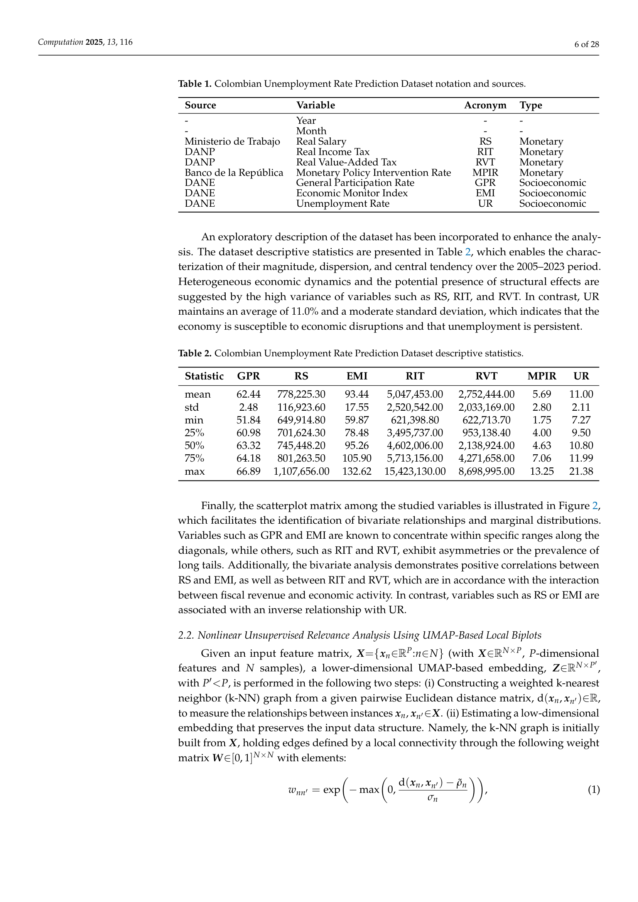

### Extraction assessment
- **Confidence:** 0.65 (below the configured 0.85 threshold; human review required).
- One or more equation candidates are ambiguous in raw extraction.

### Raw extracted text
```
Computation 2025, 13, 116
6 of 28
Table 1. Colombian Unemployment Rate Prediction Dataset notation and sources.
Source
Variable
Acronym
Type
-
Year
-
-
-
Month
-
-
Ministerio de Trabajo
Real Salary
RS
Monetary
DANP
Real Income Tax
RIT
Monetary
DANP
Real Value-Added Tax
RVT
Monetary
Banco de la República
Monetary Policy Intervention Rate
MPIR
Monetary
DANE
General Participation Rate
GPR
Socioeconomic
DANE
Economic Monitor Index
EMI
Socioeconomic
DANE
Unemployment Rate
UR
Socioeconomic
An exploratory description of the dataset has been incorporated to enhance the analy-
sis. The dataset descriptive statistics are presented in Table 2, which enables the charac-
terization of their magnitude, dispersion, and central tendency over the 2005–2023 period.
Heterogeneous economic dynamics and the potential presence of structural effects are
suggested by the high variance of variables such as RS, RIT, and RVT. In contrast, UR
maintains an average of 11.0% and a moderate standard deviation, which indicates that the
economy is susceptible to economic disruptions and that unemployment is persistent.
Table 2. Colombian Unemployment Rate Prediction Dataset descriptive statistics.
Statistic
GPR
RS
EMI
RIT
RVT
MPIR
UR
mean
62.44
778,225.30
93.44
5,047,453.00
2,752,444.00
5.69
11.00
std
2.48
116,923.60
17.55
2,520,542.00
2,033,169.00
2.80
2.11
min
51.84
649,914.80
59.87
621,398.80
622,713.70
1.75
7.27
25%
60.98
701,624.30
78.48
3,495,737.00
953,138.40
4.00
9.50
50%
63.32
745,448.20
95.26
4,602,006.00
2,138,924.00
4.63
10.80
75%
64.18
801,263.50
105.90
5,713,156.00
4,271,658.00
7.06
11.99
max
66.89
1,107,656.00
132.62
15,423,130.00
8,698,995.00
13.25
21.38
Finally, the scatterplot matrix among the studied variables is illustrated in Figure 2,
which facilitates the identification of bivariate relationships and marginal distributions.
Variables such as GPR and EMI are known to concentrate within specific ranges along the
diagonals, while others, such as RIT and RVT, exhibit asymmetries or the prevalence of
long tails. Additionally, the bivariate analysis demonstrates positive correlations between
RS and EMI, as well as between RIT and RVT, which are in accordance with the interaction
between fiscal revenue and economic activity. In contrast, variables such as RS or EMI are
associated with an inverse relationship with UR.
2.2. Nonlinear Unsupervised Relevance Analysis Using UMAP-Based Local Biplots
Given an input feature matrix, X={xn∈RP:n∈N} (with X∈RN×P, P-dimensional
features and N samples), a lower-dimensional UMAP-based embedding, Z∈RN×P′,
with P′<P, is performed in the following two steps: (i) Constructing a weighted k-nearest
neighbor (k-NN) graph from a given pairwise Euclidean distance matrix, d(xn, xn′)∈R,
to measure the relationships between instances xn, xn′∈X. (ii) Estimating a low-dimensional
embedding that preserves the input data structure. Namely, the k-NN graph is initially
built from X, holding edges defined by a local connectivity through the following weight
matrix W∈[0, 1]N×N with elements:
wnn′ = exp

−max

0, d(xn, xn′) −˜ρn
σn

,
(1)

```

### Equation candidates
- `page-006-equation-001` — review_required (confidence 0.45; page 6).
```
Given an input feature matrix, X={xn∈RP:n∈N} (with X∈RN×P, P-dimensional
```
- `page-006-equation-002` — review_required (confidence 0.45; page 6).
```
features and N samples), a lower-dimensional UMAP-based embedding, Z∈RN×P′,
```
- `page-006-equation-003` — review_required (confidence 0.45; page 6).
```
neighbor (k-NN) graph from a given pairwise Euclidean distance matrix, d(xn, xn′)∈R,
```
- `page-006-equation-004` — review_required (confidence 0.45; page 6).
```
to measure the relationships between instances xn, xn′∈X. (ii) Estimating a low-dimensional
```
- `page-006-equation-005` — review_required (confidence 0.45; page 6).
```
matrix W∈[0, 1]N×N with elements:
```
- `page-006-equation-006` — review_required (confidence 0.45; page 6).
```
wnn′ = exp
```

## Page 7
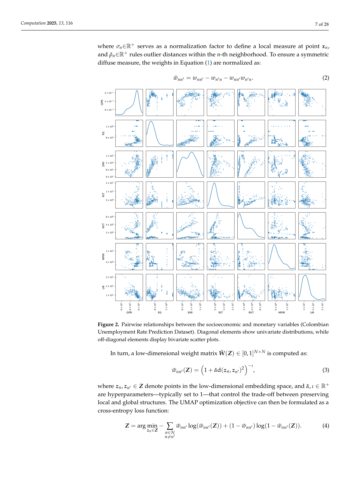

### Extraction assessment
- **Confidence:** 0.65 (below the configured 0.85 threshold; human review required).
- One or more equation candidates are ambiguous in raw extraction.

### Raw extracted text
```
Computation 2025, 13, 116
7 of 28
where σn∈R+ serves as a normalization factor to define a local measure at point xn,
and ˜ρn∈R+ rules outlier distances within the n-th neighborhood. To ensure a symmetric
diffuse measure, the weights in Equation (1) are normalized as:
˘wnn′ = wnn′ −wn′n −wnn′wn′n.
(2)
4 × 10
2
1 × 10
1
2 × 10
1
GPR
8 × 105
1 × 106
RS
6 × 101
8 × 101
1 × 102
1 × 102
EMI
5 × 106
1 × 107
2 × 107
RIT
2 × 106
5 × 106
8 × 106
RVT
5 × 100
1 × 101
MPIR
6 × 101
6 × 101
6 × 101
GPR
1 × 101
2 × 101
2 × 101
UR
8 × 105
1 × 106
RS
8 × 101
1 × 102
1 × 102
EMI
5 × 106
1 × 107
2 × 107
RIT
2 × 106
5 × 106
8 × 106
RVT
5 × 100
1 × 101
MPIR
1 × 101
2 × 101
2 × 101
UR
Figure 2. Pairwise relationships between the socioeconomic and monetary variables (Colombian
Unemployment Rate Prediction Dataset). Diagonal elements show univariate distributions, while
off-diagonal elements display bivariate scatter plots.
In turn, a low-dimensional weight matrix ˜W(Z) ∈[0, 1]N×N is computed as:
˜wnn′(Z) =

1 + ˜αd(zn, zn′)2−ι
,
(3)
where zn, zn′ ∈Z denote points in the low-dimensional embedding space, and ˜α, ι ∈R+
are hyperparameters—typically set to 1—that control the trade-off between preserving
local and global structures. The UMAP optimization objective can then be formulated as a
cross-entropy loss function:
Z = arg min
zn∈Z −∑
n∈N
n̸=n′
˘wnn′ log( ˜wnn′(Z)) + (1 −˘wnn′) log(1 −˜wnn′(Z)).
(4)

```

### Textual figure-caption evidence
- Figure 2. Pairwise relationships between the socioeconomic and monetary variables (Colombian
- Captions are page-level text evidence and are not associated with embedded images.

### Equation candidates
- `page-007-equation-001` — review_required (confidence 0.45; page 7).
```
where σn∈R+ serves as a normalization factor to define a local measure at point xn,
```
- `page-007-equation-002` — review_required (confidence 0.45; page 7).
```
and ˜ρn∈R+ rules outlier distances within the n-th neighborhood. To ensure a symmetric
```
- `page-007-equation-003` — review_required (confidence 0.45; page 7).
```
˘wnn′ = wnn′ −wn′n −wnn′wn′n.
```
- `page-007-equation-004` — review_required (confidence 0.45; page 7).
```
4 × 10
```
- `page-007-equation-005` — review_required (confidence 0.45; page 7).
```
1 × 10
```
- `page-007-equation-006` — review_required (confidence 0.45; page 7).
```
2 × 10
```
- `page-007-equation-007` — review_required (confidence 0.45; page 7).
```
8 × 105
```
- `page-007-equation-008` — review_required (confidence 0.45; page 7).
```
1 × 106
```
- `page-007-equation-009` — review_required (confidence 0.45; page 7).
```
6 × 101
```
- `page-007-equation-010` — review_required (confidence 0.45; page 7).
```
8 × 101
```
- `page-007-equation-011` — review_required (confidence 0.45; page 7).
```
1 × 102
```
- `page-007-equation-012` — review_required (confidence 0.45; page 7).
```
1 × 102
```
- `page-007-equation-013` — review_required (confidence 0.45; page 7).
```
5 × 106
```
- `page-007-equation-014` — review_required (confidence 0.45; page 7).
```
1 × 107
```
- `page-007-equation-015` — review_required (confidence 0.45; page 7).
```
2 × 107
```
- `page-007-equation-016` — review_required (confidence 0.45; page 7).
```
2 × 106
```
- `page-007-equation-017` — review_required (confidence 0.45; page 7).
```
5 × 106
```
- `page-007-equation-018` — review_required (confidence 0.45; page 7).
```
8 × 106
```
- `page-007-equation-019` — review_required (confidence 0.45; page 7).
```
5 × 100
```
- `page-007-equation-020` — review_required (confidence 0.45; page 7).
```
1 × 101
```
- `page-007-equation-021` — review_required (confidence 0.45; page 7).
```
6 × 101
```
- `page-007-equation-022` — review_required (confidence 0.45; page 7).
```
6 × 101
```
- `page-007-equation-023` — review_required (confidence 0.45; page 7).
```
6 × 101
```
- `page-007-equation-024` — review_required (confidence 0.45; page 7).
```
1 × 101
```
- `page-007-equation-025` — review_required (confidence 0.45; page 7).
```
2 × 101
```
- `page-007-equation-026` — review_required (confidence 0.45; page 7).
```
2 × 101
```
- `page-007-equation-027` — review_required (confidence 0.45; page 7).
```
8 × 105
```
- `page-007-equation-028` — review_required (confidence 0.45; page 7).
```
1 × 106
```
- `page-007-equation-029` — review_required (confidence 0.45; page 7).
```
8 × 101
```
- `page-007-equation-030` — review_required (confidence 0.45; page 7).
```
1 × 102
```
- `page-007-equation-031` — review_required (confidence 0.45; page 7).
```
1 × 102
```
- `page-007-equation-032` — review_required (confidence 0.45; page 7).
```
5 × 106
```
- `page-007-equation-033` — review_required (confidence 0.45; page 7).
```
1 × 107
```
- `page-007-equation-034` — review_required (confidence 0.45; page 7).
```
2 × 107
```
- `page-007-equation-035` — review_required (confidence 0.45; page 7).
```
2 × 106
```
- `page-007-equation-036` — review_required (confidence 0.45; page 7).
```
5 × 106
```
- `page-007-equation-037` — review_required (confidence 0.45; page 7).
```
8 × 106
```
- `page-007-equation-038` — review_required (confidence 0.45; page 7).
```
5 × 100
```
- `page-007-equation-039` — review_required (confidence 0.45; page 7).
```
1 × 101
```
- `page-007-equation-040` — review_required (confidence 0.45; page 7).
```
1 × 101
```
- `page-007-equation-041` — review_required (confidence 0.45; page 7).
```
2 × 101
```
- `page-007-equation-042` — review_required (confidence 0.45; page 7).
```
2 × 101
```
- `page-007-equation-043` — review_required (confidence 0.45; page 7).
```
In turn, a low-dimensional weight matrix ˜W(Z) ∈[0, 1]N×N is computed as:
```
- `page-007-equation-044` — review_required (confidence 0.45; page 7).
```
˜wnn′(Z) =
```
- `page-007-equation-045` — review_required (confidence 0.45; page 7).
```
where zn, zn′ ∈Z denote points in the low-dimensional embedding space, and ˜α, ι ∈R+
```
- `page-007-equation-046` — raw_text_preserved (confidence 0.98; page 7).
```
Z = arg min
```
- `page-007-equation-047` — raw_text_preserved (confidence 0.98; page 7).
```
zn∈Z −∑
```
- `page-007-equation-048` — raw_text_preserved (confidence 0.98; page 7).
```
n∈N
```
- `page-007-equation-049` — review_required (confidence 0.45; page 7).
```
n̸=n′
```

## Page 8
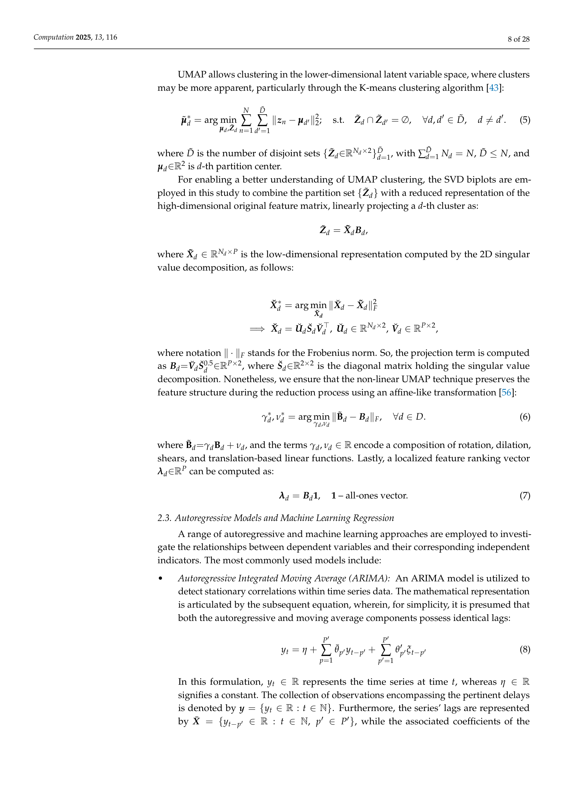

### Extraction assessment
- **Confidence:** 0.65 (below the configured 0.85 threshold; human review required).
- One or more equation candidates are ambiguous in raw extraction.

### Raw extracted text
```
Computation 2025, 13, 116
8 of 28
UMAP allows clustering in the lower-dimensional latent variable space, where clusters
may be more apparent, particularly through the K-means clustering algorithm [43]:
˜µ∗
d = arg min
µd, ˜Zd
N
∑
n=1
˜D
∑
d′=1
∥zn −µd′∥2
2;
s.t.
˜Zd ∩˜Zd′ = ∅,
∀d, d′ ∈˜D,
d ̸= d′.
(5)
where ˜D is the number of disjoint sets { ˜Zd∈RNd×2} ˜D
d=1, with ∑
˜D
d=1 Nd = N, ˜D ≤N, and
µd∈R2 is d-th partition center.
For enabling a better understanding of UMAP clustering, the SVD biplots are em-
ployed in this study to combine the partition set { ˜Zd} with a reduced representation of the
high-dimensional original feature matrix, linearly projecting a d-th cluster as:
˜Zd = ˜XdBd,
where ˜Xd ∈RNd×P is the low-dimensional representation computed by the 2D singular
value decomposition, as follows:
˘X∗
d = arg min
˘Xd
∥˘Xd −˜Xd∥2
F
=⇒
˘Xd = ˘Ud ˘Sd ˘V⊤
d , ˘Ud ∈RNd×2, ˘Vd ∈RP×2,
where notation ∥· ∥F stands for the Frobenius norm. So, the projection term is computed
as Bd= ˘Vd ˘S0.5
d ∈RP×2, where ˘Sd∈R2×2 is the diagonal matrix holding the singular value
decomposition. Nonetheless, we ensure that the non-linear UMAP technique preserves the
feature structure during the reduction process using an affine-like transformation [56]:
γ∗
d, ν∗
d = arg min
γd,νd ∥˜Bd −Bd∥F,
∀d ∈D.
(6)
where ˜Bd=γdBd + νd, and the terms γd, νd ∈R encode a composition of rotation, dilation,
shears, and translation-based linear functions. Lastly, a localized feature ranking vector
λd∈RP can be computed as:
λd = Bd1,
1 – all-ones vector.
(7)
2.3. Autoregressive Models and Machine Learning Regression
A range of autoregressive and machine learning approaches are employed to investi-
gate the relationships between dependent variables and their corresponding independent
indicators. The most commonly used models include:
•
Autoregressive Integrated Moving Average (ARIMA): An ARIMA model is utilized to
detect stationary correlations within time series data. The mathematical representation
is articulated by the subsequent equation, wherein, for simplicity, it is presumed that
both the autoregressive and moving average components possess identical lags:
yt = η +
P′
∑
p=1
¯θp′yt−p′ +
P′
∑
p′=1
θ′
p′ξt−p′
(8)
In this formulation, yt ∈R represents the time series at time t, whereas η ∈R
signifies a constant. The collection of observations encompassing the pertinent delays
is denoted by y = {yt ∈R : t ∈N}. Furthermore, the series’ lags are represented
by ¯X = {yt−p′ ∈R : t ∈N, p′ ∈P′}, while the associated coefficients of the

```

### Equation candidates
- `page-008-equation-001` — raw_text_preserved (confidence 0.98; page 8).
```
d = arg min
```
- `page-008-equation-002` — review_required (confidence 0.45; page 8).
```
∑
```
- `page-008-equation-003` — raw_text_preserved (confidence 0.98; page 8).
```
n=1
```
- `page-008-equation-004` — review_required (confidence 0.45; page 8).
```
∑
```
- `page-008-equation-005` — review_required (confidence 0.45; page 8).
```
d′=1
```
- `page-008-equation-006` — review_required (confidence 0.45; page 8).
```
˜Zd ∩˜Zd′ = ∅,
```
- `page-008-equation-007` — review_required (confidence 0.45; page 8).
```
∀d, d′ ∈˜D,
```
- `page-008-equation-008` — review_required (confidence 0.45; page 8).
```
d ̸= d′.
```
- `page-008-equation-009` — review_required (confidence 0.45; page 8).
```
where ˜D is the number of disjoint sets { ˜Zd∈RNd×2} ˜D
```
- `page-008-equation-010` — raw_text_preserved (confidence 0.98; page 8).
```
d=1, with ∑
```
- `page-008-equation-011` — raw_text_preserved (confidence 0.98; page 8).
```
d=1 Nd = N, ˜D ≤N, and
```
- `page-008-equation-012` — review_required (confidence 0.45; page 8).
```
µd∈R2 is d-th partition center.
```
- `page-008-equation-013` — review_required (confidence 0.45; page 8).
```
˜Zd = ˜XdBd,
```
- `page-008-equation-014` — review_required (confidence 0.45; page 8).
```
where ˜Xd ∈RNd×P is the low-dimensional representation computed by the 2D singular
```
- `page-008-equation-015` — raw_text_preserved (confidence 0.98; page 8).
```
d = arg min
```
- `page-008-equation-016` — review_required (confidence 0.45; page 8).
```
=⇒
```
- `page-008-equation-017` — review_required (confidence 0.45; page 8).
```
˘Xd = ˘Ud ˘Sd ˘V⊤
```
- `page-008-equation-018` — review_required (confidence 0.45; page 8).
```
d , ˘Ud ∈RNd×2, ˘Vd ∈RP×2,
```
- `page-008-equation-019` — review_required (confidence 0.45; page 8).
```
as Bd= ˘Vd ˘S0.5
```
- `page-008-equation-020` — raw_text_preserved (confidence 0.98; page 8).
```
d ∈RP×2, where ˘Sd∈R2×2 is the diagonal matrix holding the singular value
```
- `page-008-equation-021` — raw_text_preserved (confidence 0.98; page 8).
```
d = arg min
```
- `page-008-equation-022` — review_required (confidence 0.45; page 8).
```
∀d ∈D.
```
- `page-008-equation-023` — review_required (confidence 0.45; page 8).
```
where ˜Bd=γdBd + νd, and the terms γd, νd ∈R encode a composition of rotation, dilation,
```
- `page-008-equation-024` — raw_text_preserved (confidence 0.98; page 8).
```
λd∈RP can be computed as:
```
- `page-008-equation-025` — review_required (confidence 0.45; page 8).
```
λd = Bd1,
```
- `page-008-equation-026` — review_required (confidence 0.45; page 8).
```
yt = η +
```
- `page-008-equation-027` — review_required (confidence 0.45; page 8).
```
∑
```
- `page-008-equation-028` — raw_text_preserved (confidence 0.98; page 8).
```
p=1
```
- `page-008-equation-029` — review_required (confidence 0.45; page 8).
```
∑
```
- `page-008-equation-030` — review_required (confidence 0.45; page 8).
```
p′=1
```
- `page-008-equation-031` — review_required (confidence 0.45; page 8).
```
In this formulation, yt ∈R represents the time series at time t, whereas η ∈R
```
- `page-008-equation-032` — review_required (confidence 0.45; page 8).
```
is denoted by y = {yt ∈R : t ∈N}. Furthermore, the series’ lags are represented
```
- `page-008-equation-033` — review_required (confidence 0.45; page 8).
```
by ¯X = {yt−p′ ∈R : t ∈N, p′ ∈P′}, while the associated coefficients of the
```

## Page 9
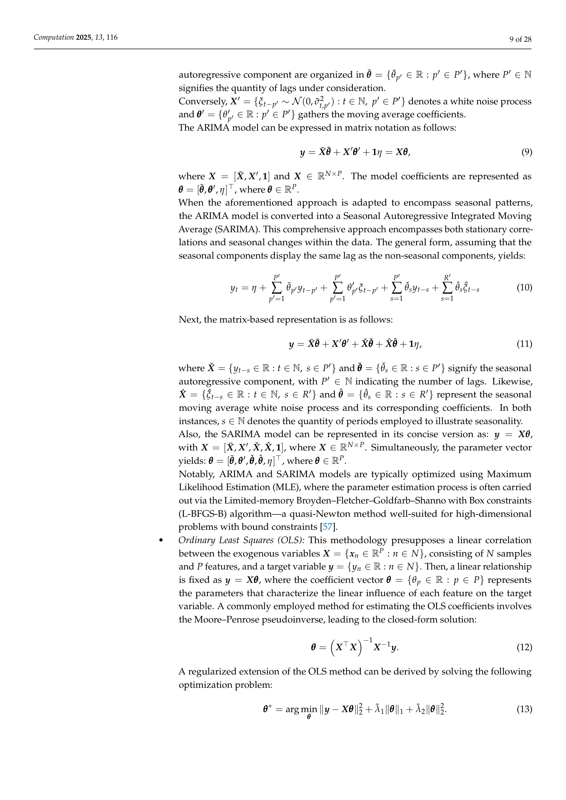

### Extraction assessment
- **Confidence:** 0.65 (below the configured 0.85 threshold; human review required).
- One or more equation candidates are ambiguous in raw extraction.

### Raw extracted text
```
Computation 2025, 13, 116
9 of 28
autoregressive component are organized in ¯θ = { ¯θp′ ∈R : p′ ∈P′}, where P′ ∈N
signifies the quantity of lags under consideration.
Conversely, X′ = {ξt−p′ ∼N (0, ˜σ2
t,p′) : t ∈N, p′ ∈P′} denotes a white noise process
and θ′ = {θ′
p′ ∈R : p′ ∈P′} gathers the moving average coefficients.
The ARIMA model can be expressed in matrix notation as follows:
y = ¯X ¯θ + X′θ′ + 1η = Xθ,
(9)
where X = [ ¯X, X′, 1] and X ∈RN×P. The model coefficients are represented as
θ = [¯θ,θ′, η]⊤, where θ ∈RP.
When the aforementioned approach is adapted to encompass seasonal patterns,
the ARIMA model is converted into a Seasonal Autoregressive Integrated Moving
Average (SARIMA). This comprehensive approach encompasses both stationary corre-
lations and seasonal changes within the data. The general form, assuming that the
seasonal components display the same lag as the non-seasonal components, yields:
yt = η +
P′
∑
p′=1
¯θp′yt−p′ +
P′
∑
p′=1
θ′
p′ξt−p′ +
P′
∑
s=1
ˇθsyt−s +
R′
∑
s=1
ˆθs ˆξt−s
(10)
Next, the matrix-based representation is as follows:
y = ¯X ¯θ + X′θ′ + ˇX ˇθ + ˆX ˆθ + 1η,
(11)
where ˇX = {yt−s ∈R : t ∈N, s ∈P′} and ˇθ = { ˇθs ∈R : s ∈P′} signify the seasonal
autoregressive component, with P′ ∈N indicating the number of lags. Likewise,
ˆX = { ˆξt−s ∈R : t ∈N, s ∈R′} and ˆθ = { ˆθs ∈R : s ∈R′} represent the seasonal
moving average white noise process and its corresponding coefficients. In both
instances, s ∈N denotes the quantity of periods employed to illustrate seasonality.
Also, the SARIMA model can be represented in its concise version as: y = Xθ,
with X = [ ¯X, X′, ˇX, ˆX, 1], where X ∈RN×P. Simultaneously, the parameter vector
yields: θ = [¯θ,θ′, ˇθ, ˆθ, η]⊤, where θ ∈RP.
Notably, ARIMA and SARIMA models are typically optimized using Maximum
Likelihood Estimation (MLE), where the parameter estimation process is often carried
out via the Limited-memory Broyden–Fletcher–Goldfarb–Shanno with Box constraints
(L-BFGS-B) algorithm—a quasi-Newton method well-suited for high-dimensional
problems with bound constraints [57].
•
Ordinary Least Squares (OLS): This methodology presupposes a linear correlation
between the exogenous variables X = {xn ∈RP : n ∈N}, consisting of N samples
and P features, and a target variable y = {yn ∈R : n ∈N}. Then, a linear relationship
is fixed as y = Xθ, where the coefficient vector θ = {θp ∈R : p ∈P} represents
the parameters that characterize the linear influence of each feature on the target
variable. A commonly employed method for estimating the OLS coefficients involves
the Moore–Penrose pseudoinverse, leading to the closed-form solution:
θ =

X⊤X
−1
X−1y.
(12)
A regularized extension of the OLS method can be derived by solving the following
optimization problem:
θ∗= arg min
θ
∥y −Xθ∥2
2 + ˜λ1∥θ∥1 + ˜λ2∥θ∥2
2.
(13)

```

### Equation candidates
- `page-009-equation-001` — review_required (confidence 0.45; page 9).
```
autoregressive component are organized in ¯θ = { ¯θp′ ∈R : p′ ∈P′}, where P′ ∈N
```
- `page-009-equation-002` — review_required (confidence 0.45; page 9).
```
Conversely, X′ = {ξt−p′ ∼N (0, ˜σ2
```
- `page-009-equation-003` — review_required (confidence 0.45; page 9).
```
t,p′) : t ∈N, p′ ∈P′} denotes a white noise process
```
- `page-009-equation-004` — review_required (confidence 0.45; page 9).
```
and θ′ = {θ′
```
- `page-009-equation-005` — review_required (confidence 0.45; page 9).
```
p′ ∈R : p′ ∈P′} gathers the moving average coefficients.
```
- `page-009-equation-006` — review_required (confidence 0.45; page 9).
```
y = ¯X ¯θ + X′θ′ + 1η = Xθ,
```
- `page-009-equation-007` — review_required (confidence 0.45; page 9).
```
where X = [ ¯X, X′, 1] and X ∈RN×P. The model coefficients are represented as
```
- `page-009-equation-008` — raw_text_preserved (confidence 0.98; page 9).
```
θ = [¯θ,θ′, η]⊤, where θ ∈RP.
```
- `page-009-equation-009` — review_required (confidence 0.45; page 9).
```
yt = η +
```
- `page-009-equation-010` — review_required (confidence 0.45; page 9).
```
∑
```
- `page-009-equation-011` — review_required (confidence 0.45; page 9).
```
p′=1
```
- `page-009-equation-012` — review_required (confidence 0.45; page 9).
```
∑
```
- `page-009-equation-013` — review_required (confidence 0.45; page 9).
```
p′=1
```
- `page-009-equation-014` — review_required (confidence 0.45; page 9).
```
∑
```
- `page-009-equation-015` — raw_text_preserved (confidence 0.98; page 9).
```
s=1
```
- `page-009-equation-016` — review_required (confidence 0.45; page 9).
```
∑
```
- `page-009-equation-017` — raw_text_preserved (confidence 0.98; page 9).
```
s=1
```
- `page-009-equation-018` — review_required (confidence 0.45; page 9).
```
y = ¯X ¯θ + X′θ′ + ˇX ˇθ + ˆX ˆθ + 1η,
```
- `page-009-equation-019` — review_required (confidence 0.45; page 9).
```
where ˇX = {yt−s ∈R : t ∈N, s ∈P′} and ˇθ = { ˇθs ∈R : s ∈P′} signify the seasonal
```
- `page-009-equation-020` — review_required (confidence 0.45; page 9).
```
autoregressive component, with P′ ∈N indicating the number of lags. Likewise,
```
- `page-009-equation-021` — review_required (confidence 0.45; page 9).
```
ˆX = { ˆξt−s ∈R : t ∈N, s ∈R′} and ˆθ = { ˆθs ∈R : s ∈R′} represent the seasonal
```
- `page-009-equation-022` — review_required (confidence 0.45; page 9).
```
instances, s ∈N denotes the quantity of periods employed to illustrate seasonality.
```
- `page-009-equation-023` — review_required (confidence 0.45; page 9).
```
Also, the SARIMA model can be represented in its concise version as: y = Xθ,
```
- `page-009-equation-024` — review_required (confidence 0.45; page 9).
```
with X = [ ¯X, X′, ˇX, ˆX, 1], where X ∈RN×P. Simultaneously, the parameter vector
```
- `page-009-equation-025` — review_required (confidence 0.45; page 9).
```
yields: θ = [¯θ,θ′, ˇθ, ˆθ, η]⊤, where θ ∈RP.
```
- `page-009-equation-026` — review_required (confidence 0.45; page 9).
```
between the exogenous variables X = {xn ∈RP : n ∈N}, consisting of N samples
```
- `page-009-equation-027` — review_required (confidence 0.45; page 9).
```
and P features, and a target variable y = {yn ∈R : n ∈N}. Then, a linear relationship
```
- `page-009-equation-028` — review_required (confidence 0.45; page 9).
```
is fixed as y = Xθ, where the coefficient vector θ = {θp ∈R : p ∈P} represents
```
- `page-009-equation-029` — review_required (confidence 0.45; page 9).
```
θ =
```
- `page-009-equation-030` — review_required (confidence 0.45; page 9).
```
θ∗= arg min
```

## Page 10
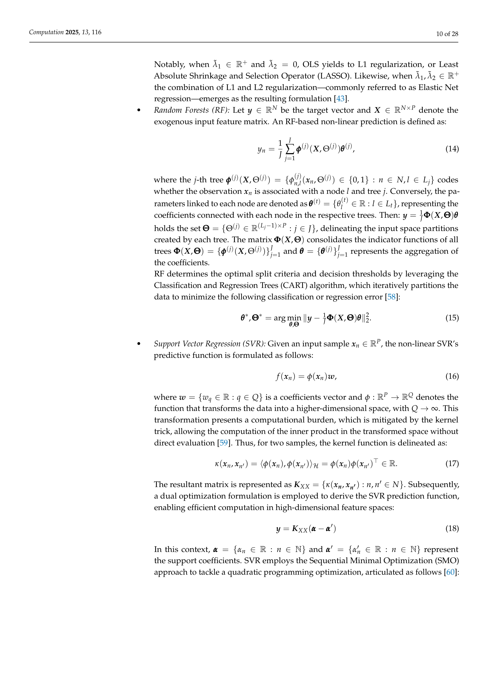

### Extraction assessment
- **Confidence:** 0.65 (below the configured 0.85 threshold; human review required).
- One or more equation candidates are ambiguous in raw extraction.

### Raw extracted text
```
Computation 2025, 13, 116
10 of 28
Notably, when ˜λ1 ∈R+ and ˜λ2 = 0, OLS yields to L1 regularization, or Least
Absolute Shrinkage and Selection Operator (LASSO). Likewise, when ˜λ1, ˜λ2 ∈R+
the combination of L1 and L2 regularization—commonly referred to as Elastic Net
regression—emerges as the resulting formulation [43].
•
Random Forests (RF): Let y ∈RN be the target vector and X ∈RN×P denote the
exogenous input feature matrix. An RF-based non-linear prediction is defined as:
yn = 1
J
J
∑
j=1
ϕ(j)(X, Θ(j))θ(j),
(14)
where the j-th tree ϕ(j)(X, Θ(j)) = {ϕ(j)
n,l(xn, Θ(j)) ∈{0, 1} : n ∈N, l ∈Lj} codes
whether the observation xn is associated with a node l and tree j. Conversely, the pa-
rameters linked to each node are denoted as θ(t) = {θ(t)
l
∈R : l ∈Lt}, representing the
coefficients connected with each node in the respective trees. Then: y = 1
JΦ(X,Θ)θ
holds the set Θ = {Θ(j) ∈R(Lj−1)×P : j ∈J}, delineating the input space partitions
created by each tree. The matrix Φ(X,Θ) consolidates the indicator functions of all
trees Φ(X,Θ) = {ϕ(j)(X, Θ(j))}J
j=1 and θ = {θ(j)}J
j=1 represents the aggregation of
the coefficients.
RF determines the optimal split criteria and decision thresholds by leveraging the
Classification and Regression Trees (CART) algorithm, which iteratively partitions the
data to minimize the following classification or regression error [58]:
θ∗,Θ∗= arg min
θ,Θ ∥y −1
JΦ(X,Θ)θ∥2
2.
(15)
•
Support Vector Regression (SVR): Given an input sample xn ∈RP, the non-linear SVR’s
predictive function is formulated as follows:
f (xn) = ϕ(xn)w,
(16)
where w = {wq ∈R : q ∈Q} is a coefficients vector and ϕ : RP →RQ denotes the
function that transforms the data into a higher-dimensional space, with Q →∞. This
transformation presents a computational burden, which is mitigated by the kernel
trick, allowing the computation of the inner product in the transformed space without
direct evaluation [59]. Thus, for two samples, the kernel function is delineated as:
κ(xn, xn′) = ⟨ϕ(xn), ϕ(xn′)⟩H = ϕ(xn)ϕ(xn′)⊤∈R.
(17)
The resultant matrix is represented as KXX = {κ(xn, xn′) : n, n′ ∈N}. Subsequently,
a dual optimization formulation is employed to derive the SVR prediction function,
enabling efficient computation in high-dimensional feature spaces:
y = KXX(α −α′)
(18)
In this context, α = {αn ∈R : n ∈N} and α′ = {α′
n ∈R : n ∈N} represent
the support coefficients. SVR employs the Sequential Minimal Optimization (SMO)
approach to tackle a quadratic programming optimization, articulated as follows [60]:

```

### Equation candidates
- `page-010-equation-001` — review_required (confidence 0.45; page 10).
```
Notably, when ˜λ1 ∈R+ and ˜λ2 = 0, OLS yields to L1 regularization, or Least
```
- `page-010-equation-002` — review_required (confidence 0.45; page 10).
```
Absolute Shrinkage and Selection Operator (LASSO). Likewise, when ˜λ1, ˜λ2 ∈R+
```
- `page-010-equation-003` — review_required (confidence 0.45; page 10).
```
Random Forests (RF): Let y ∈RN be the target vector and X ∈RN×P denote the
```
- `page-010-equation-004` — raw_text_preserved (confidence 0.98; page 10).
```
yn = 1
```
- `page-010-equation-005` — review_required (confidence 0.45; page 10).
```
∑
```
- `page-010-equation-006` — raw_text_preserved (confidence 0.98; page 10).
```
j=1
```
- `page-010-equation-007` — review_required (confidence 0.45; page 10).
```
where the j-th tree ϕ(j)(X, Θ(j)) = {ϕ(j)
```
- `page-010-equation-008` — review_required (confidence 0.45; page 10).
```
n,l(xn, Θ(j)) ∈{0, 1} : n ∈N, l ∈Lj} codes
```
- `page-010-equation-009` — review_required (confidence 0.45; page 10).
```
rameters linked to each node are denoted as θ(t) = {θ(t)
```
- `page-010-equation-010` — review_required (confidence 0.45; page 10).
```
∈R : l ∈Lt}, representing the
```
- `page-010-equation-011` — review_required (confidence 0.45; page 10).
```
coefficients connected with each node in the respective trees. Then: y = 1
```
- `page-010-equation-012` — review_required (confidence 0.45; page 10).
```
holds the set Θ = {Θ(j) ∈R(Lj−1)×P : j ∈J}, delineating the input space partitions
```
- `page-010-equation-013` — review_required (confidence 0.45; page 10).
```
trees Φ(X,Θ) = {ϕ(j)(X, Θ(j))}J
```
- `page-010-equation-014` — raw_text_preserved (confidence 0.98; page 10).
```
j=1 and θ = {θ(j)}J
```
- `page-010-equation-015` — raw_text_preserved (confidence 0.98; page 10).
```
j=1 represents the aggregation of
```
- `page-010-equation-016` — review_required (confidence 0.45; page 10).
```
θ∗,Θ∗= arg min
```
- `page-010-equation-017` — review_required (confidence 0.45; page 10).
```
Support Vector Regression (SVR): Given an input sample xn ∈RP, the non-linear SVR’s
```
- `page-010-equation-018` — review_required (confidence 0.45; page 10).
```
f (xn) = ϕ(xn)w,
```
- `page-010-equation-019` — review_required (confidence 0.45; page 10).
```
where w = {wq ∈R : q ∈Q} is a coefficients vector and ϕ : RP →RQ denotes the
```
- `page-010-equation-020` — review_required (confidence 0.45; page 10).
```
function that transforms the data into a higher-dimensional space, with Q →∞. This
```
- `page-010-equation-021` — raw_text_preserved (confidence 0.98; page 10).
```
κ(xn, xn′) = ⟨ϕ(xn), ϕ(xn′)⟩H = ϕ(xn)ϕ(xn′)⊤∈R.
```
- `page-010-equation-022` — review_required (confidence 0.45; page 10).
```
The resultant matrix is represented as KXX = {κ(xn, xn′) : n, n′ ∈N}. Subsequently,
```
- `page-010-equation-023` — raw_text_preserved (confidence 0.98; page 10).
```
y = KXX(α −α′)
```
- `page-010-equation-024` — review_required (confidence 0.45; page 10).
```
In this context, α = {αn ∈R : n ∈N} and α′ = {α′
```
- `page-010-equation-025` — raw_text_preserved (confidence 0.98; page 10).
```
n ∈R : n ∈N} represent
```

## Page 11
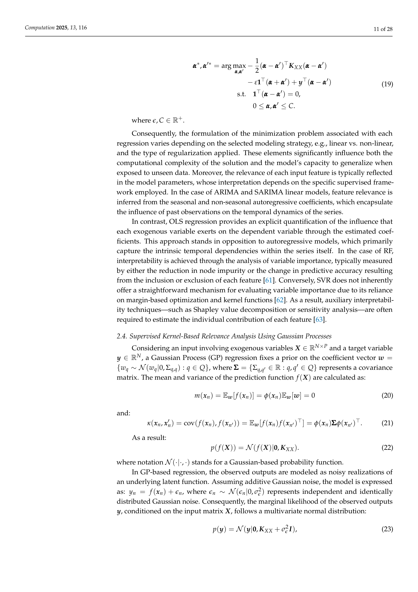

### Extraction assessment
- **Confidence:** 0.65 (below the configured 0.85 threshold; human review required).
- One or more equation candidates are ambiguous in raw extraction.

### Raw extracted text
```
Computation 2025, 13, 116
11 of 28
α∗,α′∗= arg max
α,α′ −1
2(α −α′)⊤KXX(α −α′)
−ε1⊤(α + α′) + y⊤(α −α′)
s.t.
1⊤(α −α′) = 0,
0 ≤α,α′ ≤C.
(19)
where ϵ, C ∈R+.
Consequently, the formulation of the minimization problem associated with each
regression varies depending on the selected modeling strategy, e.g., linear vs. non-linear,
and the type of regularization applied. These elements significantly influence both the
computational complexity of the solution and the model’s capacity to generalize when
exposed to unseen data. Moreover, the relevance of each input feature is typically reflected
in the model parameters, whose interpretation depends on the specific supervised frame-
work employed. In the case of ARIMA and SARIMA linear models, feature relevance is
inferred from the seasonal and non-seasonal autoregressive coefficients, which encapsulate
the influence of past observations on the temporal dynamics of the series.
In contrast, OLS regression provides an explicit quantification of the influence that
each exogenous variable exerts on the dependent variable through the estimated coef-
ficients. This approach stands in opposition to autoregressive models, which primarily
capture the intrinsic temporal dependencies within the series itself. In the case of RF,
interpretability is achieved through the analysis of variable importance, typically measured
by either the reduction in node impurity or the change in predictive accuracy resulting
from the inclusion or exclusion of each feature [61]. Conversely, SVR does not inherently
offer a straightforward mechanism for evaluating variable importance due to its reliance
on margin-based optimization and kernel functions [62]. As a result, auxiliary interpretabil-
ity techniques—such as Shapley value decomposition or sensitivity analysis—are often
required to estimate the individual contribution of each feature [63].
2.4. Supervised Kernel-Based Relevance Analysis Using Gaussian Processes
Considering an input involving exogenous variables X ∈RN×P and a target variable
y ∈RN, a Gaussian Process (GP) regression fixes a prior on the coefficient vector w =
{wq ∼N (wq|0, Σq,q) : q ∈Q}, where Σ = {Σq,q′ ∈R : q, q′ ∈Q} represents a covariance
matrix. The mean and variance of the prediction function f (X) are calculated as:
m(xn) = Ew[ f (xn)] = ϕ(xn)Ew[w] = 0
(20)
and:
κ(xn, x′
n) = cov( f (xn), f (xn′)) = Ew[ f (xn) f (xn′)⊤] = ϕ(xn)Σϕ(xn′)⊤.
(21)
As a result:
p( f (X)) = N ( f (X)|0, KXX).
(22)
where notation N (·|·, ·) stands for a Gaussian-based probability function.
In GP-based regression, the observed outputs are modeled as noisy realizations of
an underlying latent function. Assuming additive Gaussian noise, the model is expressed
as: yn = f (xn) + ϵn, where ϵn ∼N (ϵn|0, σ2
ϵ ) represents independent and identically
distributed Gaussian noise. Consequently, the marginal likelihood of the observed outputs
y, conditioned on the input matrix X, follows a multivariate normal distribution:
p(y) = N (y|0, KXX + σ2
ϵ I),
(23)

```

### Equation candidates
- `page-011-equation-001` — review_required (confidence 0.45; page 11).
```
α∗,α′∗= arg max
```
- `page-011-equation-002` — review_required (confidence 0.45; page 11).
```
1⊤(α −α′) = 0,
```
- `page-011-equation-003` — review_required (confidence 0.45; page 11).
```
0 ≤α,α′ ≤C.
```
- `page-011-equation-004` — review_required (confidence 0.45; page 11).
```
where ϵ, C ∈R+.
```
- `page-011-equation-005` — review_required (confidence 0.45; page 11).
```
Considering an input involving exogenous variables X ∈RN×P and a target variable
```
- `page-011-equation-006` — review_required (confidence 0.45; page 11).
```
y ∈RN, a Gaussian Process (GP) regression fixes a prior on the coefficient vector w =
```
- `page-011-equation-007` — review_required (confidence 0.45; page 11).
```
{wq ∼N (wq|0, Σq,q) : q ∈Q}, where Σ = {Σq,q′ ∈R : q, q′ ∈Q} represents a covariance
```
- `page-011-equation-008` — raw_text_preserved (confidence 0.98; page 11).
```
m(xn) = Ew[ f (xn)] = ϕ(xn)Ew[w] = 0
```
- `page-011-equation-009` — review_required (confidence 0.45; page 11).
```
n) = cov( f (xn), f (xn′)) = Ew[ f (xn) f (xn′)⊤] = ϕ(xn)Σϕ(xn′)⊤.
```
- `page-011-equation-010` — review_required (confidence 0.45; page 11).
```
p( f (X)) = N ( f (X)|0, KXX).
```
- `page-011-equation-011` — review_required (confidence 0.45; page 11).
```
as: yn = f (xn) + ϵn, where ϵn ∼N (ϵn|0, σ2
```
- `page-011-equation-012` — review_required (confidence 0.45; page 11).
```
p(y) = N (y|0, KXX + σ2
```

## Page 12
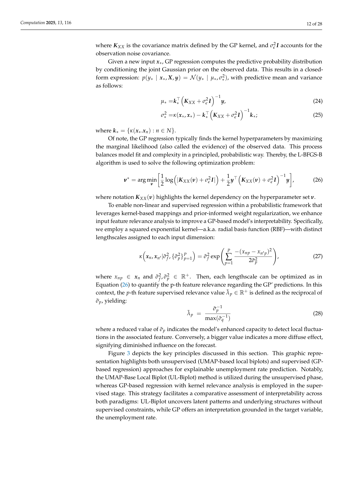

### Extraction assessment
- **Confidence:** 0.65 (below the configured 0.85 threshold; human review required).
- One or more equation candidates are ambiguous in raw extraction.

### Raw extracted text
```
Computation 2025, 13, 116
12 of 28
where KXX is the covariance matrix defined by the GP kernel, and σ2
ϵ I accounts for the
observation noise covariance.
Given a new input x∗, GP regression computes the predictive probability distribution
by conditioning the joint Gaussian prior on the observed data. This results in a closed-
form expression: p(y∗| x∗, X, y) = N (y∗| µ∗, σ2∗), with predictive mean and variance
as follows:
µ∗=k⊤
∗

KXX + σ2
ϵ I
−1
y,
(24)
σ2
∗=κ(x∗, x∗) −k⊤
∗

KXX + σ2
ϵ I
−1
k∗;
(25)
where k∗= {κ(x∗.xn) : n ∈N}.
Of note, the GP regression typically finds the kernel hyperparameters by maximizing
the marginal likelihood (also called the evidence) of the observed data. This process
balances model fit and complexity in a principled, probabilistic way. Thereby, the L-BFGS-B
algorithm is used to solve the following optimization problem:
ν∗= arg min
ν
1
2 log

|KXX(ν) + σ2
ϵ I|

+ 1
2y⊤
KXX(ν) + σ2
ϵ I
−1
y

,
(26)
where notation KXX(ν) highlights the kernel dependency on the hyperparameter set ν.
To enable non-linear and supervised regression within a probabilistic framework that
leverages kernel-based mappings and prior-informed weight regularization, we enhance
input feature relevance analysis to improve a GP-based model’s interpretability. Specifically,
we employ a squared exponential kernel—a.k.a. radial basis function (RBF)—with distinct
lengthscales assigned to each input dimension:
κ

xn, xn′|˜σ2
f , {˜σ2
p}P
p=1

= ˜σ2
f exp
 
P
∑
p=1
−(xnp −xn′p)2
2˜σ2p
!
,
(27)
where xnp ∈xn and ˜σ2
f , ˜σ2
p ∈R+.
Then, each lengthscale can be optimized as in
Equation (26) to quantify the p-th feature relevance regarding the GP’ predictions. In this
context, the p-th feature supervised relevance value ˜λp ∈R+ is defined as the reciprocal of
˜σp, yielding:
˜λp =
˜σ−1
p
max(˜σ−1
q )
(28)
where a reduced value of ˜σp indicates the model’s enhanced capacity to detect local fluctua-
tions in the associated feature. Conversely, a bigger value indicates a more diffuse effect,
signifying diminished influence on the forecast.
Figure 3 depicts the key principles discussed in this section. This graphic repre-
sentation highlights both unsupervised (UMAP-based local biplots) and supervised (GP-
based regression) approaches for explainable unemployment rate prediction. Notably,
the UMAP-Base Local Biplot (UL-Biplot) method is utilized during the unsupervised phase,
whereas GP-based regression with kernel relevance analysis is employed in the super-
vised stage. This strategy facilitates a comparative assessment of interpretability across
both paradigms: UL-Biplot uncovers latent patterns and underlying structures without
supervised constraints, while GP offers an interpretation grounded in the target variable,
the unemployment rate.

```

### Equation candidates
- `page-012-equation-001` — review_required (confidence 0.45; page 12).
```
form expression: p(y∗| x∗, X, y) = N (y∗| µ∗, σ2∗), with predictive mean and variance
```
- `page-012-equation-002` — review_required (confidence 0.45; page 12).
```
µ∗=k⊤
```
- `page-012-equation-003` — review_required (confidence 0.45; page 12).
```
∗=κ(x∗, x∗) −k⊤
```
- `page-012-equation-004` — review_required (confidence 0.45; page 12).
```
where k∗= {κ(x∗.xn) : n ∈N}.
```
- `page-012-equation-005` — review_required (confidence 0.45; page 12).
```
ν∗= arg min
```
- `page-012-equation-006` — raw_text_preserved (confidence 0.98; page 12).
```
p=1
```
- `page-012-equation-007` — review_required (confidence 0.45; page 12).
```
= ˜σ2
```
- `page-012-equation-008` — review_required (confidence 0.45; page 12).
```
∑
```
- `page-012-equation-009` — raw_text_preserved (confidence 0.98; page 12).
```
p=1
```
- `page-012-equation-010` — review_required (confidence 0.45; page 12).
```
where xnp ∈xn and ˜σ2
```
- `page-012-equation-011` — raw_text_preserved (confidence 0.98; page 12).
```
p ∈R+.
```
- `page-012-equation-012` — review_required (confidence 0.45; page 12).
```
context, the p-th feature supervised relevance value ˜λp ∈R+ is defined as the reciprocal of
```
- `page-012-equation-013` — review_required (confidence 0.45; page 12).
```
˜λp =
```

## Page 13
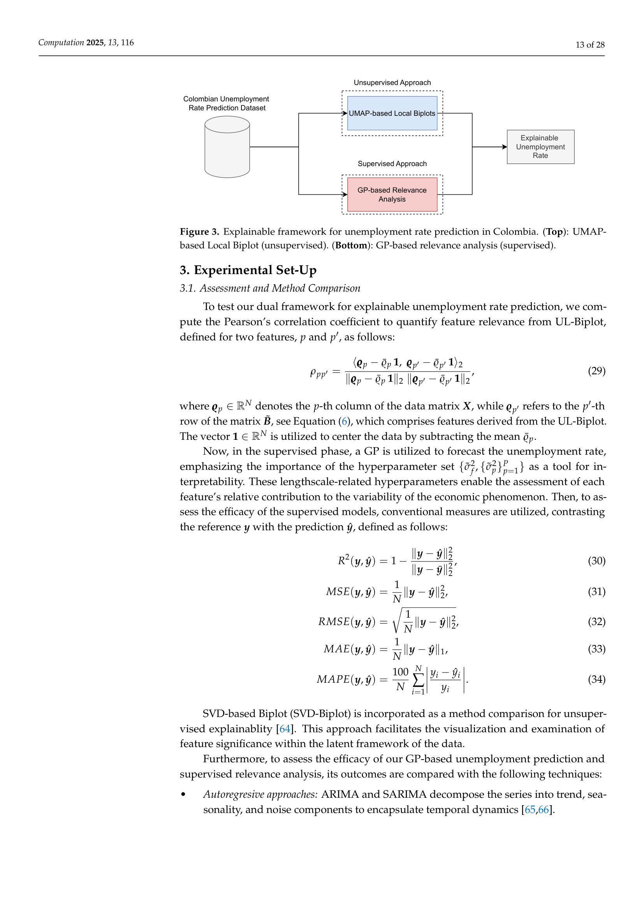

### Extraction assessment
- **Confidence:** 0.65 (below the configured 0.85 threshold; human review required).
- One or more equation candidates are ambiguous in raw extraction.

### Raw extracted text
```
Computation 2025, 13, 116
13 of 28
Colombian Unemployment
 Rate Prediction Dataset
Explainable 
Unemployment
Rate
GP-based Relevance
Analysis
UMAP-based Local Biplots
Unsupervised Approach
Supervised Approach
Figure 3. Explainable framework for unemployment rate prediction in Colombia. (Top): UMAP-
based Local Biplot (unsupervised). (Bottom): GP-based relevance analysis (supervised).
3. Experimental Set-Up
3.1. Assessment and Method Comparison
To test our dual framework for explainable unemployment rate prediction, we com-
pute the Pearson’s correlation coefficient to quantify feature relevance from UL-Biplot,
defined for two features, p and p′, as follows:
ρpp′ =
⟨ϱp −¯ϱp 1, ϱp′ −¯ϱp′ 1⟩2
∥ϱp −¯ϱp 1∥2 ∥ϱp′ −¯ϱp′ 1∥2
,
(29)
where ϱp ∈RN denotes the p-th column of the data matrix X, while ϱp′ refers to the p′-th
row of the matrix ˜B, see Equation (6), which comprises features derived from the UL-Biplot.
The vector 1 ∈RN is utilized to center the data by subtracting the mean ¯ϱp.
Now, in the supervised phase, a GP is utilized to forecast the unemployment rate,
emphasizing the importance of the hyperparameter set {˜σ2
f , {˜σ2
p}P
p=1} as a tool for in-
terpretability. These lengthscale-related hyperparameters enable the assessment of each
feature’s relative contribution to the variability of the economic phenomenon. Then, to as-
sess the efficacy of the supervised models, conventional measures are utilized, contrasting
the reference y with the prediction ˆy, defined as follows:
R2(y, ˆy) = 1 −∥y −ˆy∥2
2
∥y −¯y∥2
2
,
(30)
MSE(y, ˆy) = 1
N ∥y −ˆy∥2
2,
(31)
RMSE(y, ˆy) =
r
1
N ∥y −ˆy∥2
2,
(32)
MAE(y, ˆy) = 1
N ∥y −ˆy∥1,
(33)
MAPE(y, ˆy) = 100
N
N
∑
i=1

yi −ˆyi
yi
.
(34)
SVD-based Biplot (SVD-Biplot) is incorporated as a method comparison for unsuper-
vised explainablity [64]. This approach facilitates the visualization and examination of
feature significance within the latent framework of the data.
Furthermore, to assess the efficacy of our GP-based unemployment prediction and
supervised relevance analysis, its outcomes are compared with the following techniques:
•
Autoregresive approaches: ARIMA and SARIMA decompose the series into trend, sea-
sonality, and noise components to encapsulate temporal dynamics [65,66].

```

### Textual figure-caption evidence
- Figure 3. Explainable framework for unemployment rate prediction in Colombia. (Top): UMAP-
- Captions are page-level text evidence and are not associated with embedded images.

### Equation candidates
- `page-013-equation-001` — review_required (confidence 0.45; page 13).
```
ρpp′ =
```
- `page-013-equation-002` — review_required (confidence 0.45; page 13).
```
where ϱp ∈RN denotes the p-th column of the data matrix X, while ϱp′ refers to the p′-th
```
- `page-013-equation-003` — review_required (confidence 0.45; page 13).
```
The vector 1 ∈RN is utilized to center the data by subtracting the mean ¯ϱp.
```
- `page-013-equation-004` — review_required (confidence 0.45; page 13).
```
p=1} as a tool for in-
```
- `page-013-equation-005` — raw_text_preserved (confidence 0.98; page 13).
```
R2(y, ˆy) = 1 −∥y −ˆy∥2
```
- `page-013-equation-006` — raw_text_preserved (confidence 0.98; page 13).
```
MSE(y, ˆy) = 1
```
- `page-013-equation-007` — review_required (confidence 0.45; page 13).
```
RMSE(y, ˆy) =
```
- `page-013-equation-008` — raw_text_preserved (confidence 0.98; page 13).
```
MAE(y, ˆy) = 1
```
- `page-013-equation-009` — raw_text_preserved (confidence 0.98; page 13).
```
MAPE(y, ˆy) = 100
```
- `page-013-equation-010` — review_required (confidence 0.45; page 13).
```
∑
```
- `page-013-equation-011` — raw_text_preserved (confidence 0.98; page 13).
```
i=1
```

## Page 14
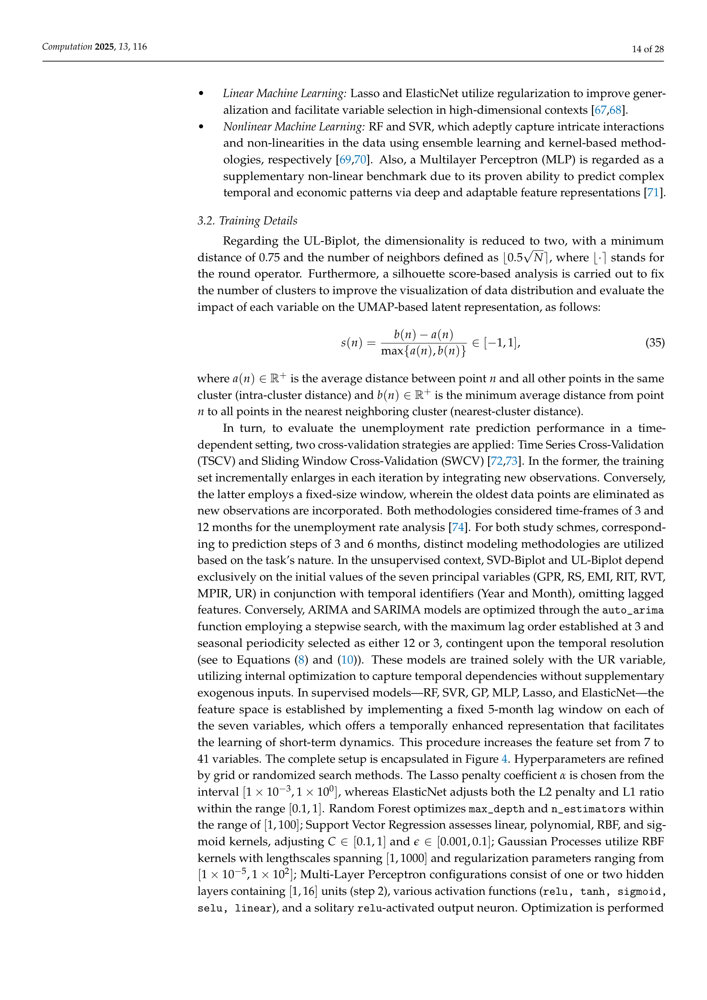

### Extraction assessment
- **Confidence:** 0.65 (below the configured 0.85 threshold; human review required).
- One or more equation candidates are ambiguous in raw extraction.

### Raw extracted text
```
Computation 2025, 13, 116
14 of 28
•
Linear Machine Learning: Lasso and ElasticNet utilize regularization to improve gener-
alization and facilitate variable selection in high-dimensional contexts [67,68].
•
Nonlinear Machine Learning: RF and SVR, which adeptly capture intricate interactions
and non-linearities in the data using ensemble learning and kernel-based method-
ologies, respectively [69,70]. Also, a Multilayer Perceptron (MLP) is regarded as a
supplementary non-linear benchmark due to its proven ability to predict complex
temporal and economic patterns via deep and adaptable feature representations [71].
3.2. Training Details
Regarding the UL-Biplot, the dimensionality is reduced to two, with a minimum
distance of 0.75 and the number of neighbors defined as ⌊0.5
√
N⌉, where ⌊·⌉stands for
the round operator. Furthermore, a silhouette score-based analysis is carried out to fix
the number of clusters to improve the visualization of data distribution and evaluate the
impact of each variable on the UMAP-based latent representation, as follows:
s(n) =
b(n) −a(n)
max{a(n), b(n)} ∈[−1, 1],
(35)
where a(n) ∈R+ is the average distance between point n and all other points in the same
cluster (intra-cluster distance) and b(n) ∈R+ is the minimum average distance from point
n to all points in the nearest neighboring cluster (nearest-cluster distance).
In turn, to evaluate the unemployment rate prediction performance in a time-
dependent setting, two cross-validation strategies are applied: Time Series Cross-Validation
(TSCV) and Sliding Window Cross-Validation (SWCV) [72,73]. In the former, the training
set incrementally enlarges in each iteration by integrating new observations. Conversely,
the latter employs a fixed-size window, wherein the oldest data points are eliminated as
new observations are incorporated. Both methodologies considered time-frames of 3 and
12 months for the unemployment rate analysis [74]. For both study schmes, correspond-
ing to prediction steps of 3 and 6 months, distinct modeling methodologies are utilized
based on the task’s nature. In the unsupervised context, SVD-Biplot and UL-Biplot depend
exclusively on the initial values of the seven principal variables (GPR, RS, EMI, RIT, RVT,
MPIR, UR) in conjunction with temporal identifiers (Year and Month), omitting lagged
features. Conversely, ARIMA and SARIMA models are optimized through the auto_arima
function employing a stepwise search, with the maximum lag order established at 3 and
seasonal periodicity selected as either 12 or 3, contingent upon the temporal resolution
(see to Equations (8) and (10)). These models are trained solely with the UR variable,
utilizing internal optimization to capture temporal dependencies without supplementary
exogenous inputs. In supervised models—RF, SVR, GP, MLP, Lasso, and ElasticNet—the
feature space is established by implementing a fixed 5-month lag window on each of
the seven variables, which offers a temporally enhanced representation that facilitates
the learning of short-term dynamics. This procedure increases the feature set from 7 to
41 variables. The complete setup is encapsulated in Figure 4. Hyperparameters are refined
by grid or randomized search methods. The Lasso penalty coefficient α is chosen from the
interval [1 × 10−3, 1 × 100], whereas ElasticNet adjusts both the L2 penalty and L1 ratio
within the range [0.1, 1]. Random Forest optimizes max_depth and n_estimators within
the range of [1, 100]; Support Vector Regression assesses linear, polynomial, RBF, and sig-
moid kernels, adjusting C ∈[0.1, 1] and ϵ ∈[0.001, 0.1]; Gaussian Processes utilize RBF
kernels with lengthscales spanning [1, 1000] and regularization parameters ranging from
[1 × 10−5, 1 × 102]; Multi-Layer Perceptron configurations consist of one or two hidden
layers containing [1, 16] units (step 2), various activation functions (relu, tanh, sigmoid,
selu, linear), and a solitary relu-activated output neuron. Optimization is performed

```

### Equation candidates
- `page-014-equation-001` — review_required (confidence 0.45; page 14).
```
√
```
- `page-014-equation-002` — review_required (confidence 0.45; page 14).
```
s(n) =
```
- `page-014-equation-003` — review_required (confidence 0.45; page 14).
```
max{a(n), b(n)} ∈[−1, 1],
```
- `page-014-equation-004` — review_required (confidence 0.45; page 14).
```
where a(n) ∈R+ is the average distance between point n and all other points in the same
```
- `page-014-equation-005` — review_required (confidence 0.45; page 14).
```
cluster (intra-cluster distance) and b(n) ∈R+ is the minimum average distance from point
```
- `page-014-equation-006` — review_required (confidence 0.45; page 14).
```
features. Conversely, ARIMA and SARIMA models are optimized through the auto_arima
```
- `page-014-equation-007` — review_required (confidence 0.45; page 14).
```
interval [1 × 10−3, 1 × 100], whereas ElasticNet adjusts both the L2 penalty and L1 ratio
```
- `page-014-equation-008` — review_required (confidence 0.45; page 14).
```
within the range [0.1, 1]. Random Forest optimizes max_depth and n_estimators within
```
- `page-014-equation-009` — review_required (confidence 0.45; page 14).
```
moid kernels, adjusting C ∈[0.1, 1] and ϵ ∈[0.001, 0.1]; Gaussian Processes utilize RBF
```
- `page-014-equation-010` — review_required (confidence 0.45; page 14).
```
[1 × 10−5, 1 × 102]; Multi-Layer Perceptron configurations consist of one or two hidden
```

## Page 15
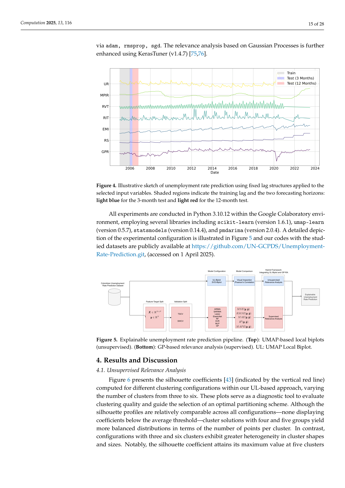

### Extraction assessment
- **Confidence:** 0.95 (meets the configured threshold).
- Machine-readable text was preserved with page-image provenance.

### Raw extracted text
```
Computation 2025, 13, 116
15 of 28
via adam, rmsprop, sgd. The relevance analysis based on Gaussian Processes is further
enhanced using KerasTuner (v1.4.7) [75,76].
2006
2008
2010
2012
2014
2016
2018
2020
2022
2024
Date
GPR
RS
EMI
RIT
RVT
MPIR
UR
Train
Test (3 Months)
Test (12 Months)
Figure 4. Illustrative sketch of unemployment rate prediction using fixed lag structures applied to the
selected input variables. Shaded regions indicate the training lag and the two forecasting horizons:
light blue for the 3-month test and light red for the 12-month test.
All experiments are conducted in Python 3.10.12 within the Google Colaboratory envi-
ronment, employing several libraries including scikit-learn (version 1.6.1), umap-learn
(version 0.5.7), statsmodels (version 0.14.4), and pmdarima (version 2.0.4). A detailed depic-
tion of the experimental configuration is illustrated in Figure 5 and our codes with the stud-
ied datasets are publicly available at https://github.com/UN-GCPDS/Unemployment-
Rate-Prediction.git, (accessed on 1 April 2025).
Colombian Unemployment
 Rate Prediction Dataset
UL-Biplot
SVD-Biplot
ARIMA
SARIMA
Lasso
ElasticNet
RF
SVR
MLP
GP
Feature-Target Split
Validation Split
TSCV
SWCV
Supervised
Relevance Analysis
Unsupervised
Relevance Analysis
Model Configuration
Visual Inspection
/Pearson's Correlation
Model Comparison
Explainable 
Unemployment
Rate Prediction
Hybrid Framework 
Integrating UL-Biplot and GP-RA
Figure 5. Explainable unemployment rate prediction pipeline. (Top): UMAP-based local biplots
(unsupervised). (Bottom): GP-based relevance analysis (supervised). UL: UMAP Local Biplot.
4. Results and Discussion
4.1. Unsupervised Relevance Analysis
Figure 6 presents the silhouette coefficients [43] (indicated by the vertical red line)
computed for different clustering configurations within our UL-based approach, varying
the number of clusters from three to six. These plots serve as a diagnostic tool to evaluate
clustering quality and guide the selection of an optimal partitioning scheme. Although the
silhouette profiles are relatively comparable across all configurations—none displaying
coefficients below the average threshold—cluster solutions with four and five groups yield
more balanced distributions in terms of the number of points per cluster. In contrast,
configurations with three and six clusters exhibit greater heterogeneity in cluster shapes
and sizes. Notably, the silhouette coefficient attains its maximum value at five clusters

```

### Textual figure-caption evidence
- Figure 4. Illustrative sketch of unemployment rate prediction using fixed lag structures applied to the
- Figure 5. Explainable unemployment rate prediction pipeline. (Top): UMAP-based local biplots
- Captions are page-level text evidence and are not associated with embedded images.

## Page 16
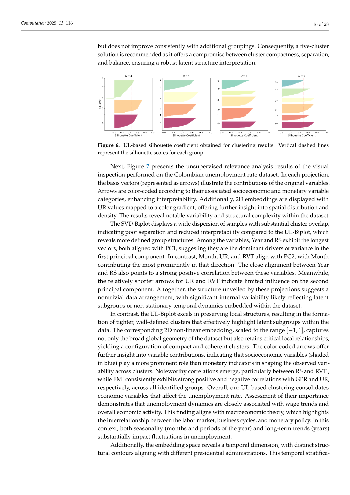

### Extraction assessment
- **Confidence:** 0.95 (meets the configured threshold).
- Machine-readable text was preserved with page-image provenance.

### Raw extracted text
```
Computation 2025, 13, 116
16 of 28
but does not improve consistently with additional groupings. Consequently, a five-cluster
solution is recommended as it offers a compromise between cluster compactness, separation,
and balance, ensuring a robust latent structure interpretation.
0.0
0.2
0.4
0.6
0.8
1.0
Silhouette Coefficient
0
1
2
3
4
5
Cluster
D = 3
0.0
0.2
0.4
0.6
0.8
1.0
Silhouette Coefficient
0
1
2
3
4
5
D = 4
0.0
0.2
0.4
0.6
0.8
1.0
Silhouette Coefficient
0
1
2
3
4
5
D = 5
0.0
0.2
0.4
0.6
0.8
1.0
Silhouette Coefficient
0
1
2
3
4
5
D = 6
Figure 6. UL-based silhouette coefficient obtained for clustering results. Vertical dashed lines
represent the silhouette scores for each group.
Next, Figure 7 presents the unsupervised relevance analysis results of the visual
inspection performed on the Colombian unemployment rate dataset. In each projection,
the basis vectors (represented as arrows) illustrate the contributions of the original variables.
Arrows are color-coded according to their associated socioeconomic and monetary variable
categories, enhancing interpretability. Additionally, 2D embeddings are displayed with
UR values mapped to a color gradient, offering further insight into spatial distribution and
density. The results reveal notable variability and structural complexity within the dataset.
The SVD-Biplot displays a wide dispersion of samples with substantial cluster overlap,
indicating poor separation and reduced interpretability compared to the UL-Biplot, which
reveals more defined group structures. Among the variables, Year and RS exhibit the longest
vectors, both aligned with PC1, suggesting they are the dominant drivers of variance in the
first principal component. In contrast, Month, UR, and RVT align with PC2, with Month
contributing the most prominently in that direction. The close alignment between Year
and RS also points to a strong positive correlation between these variables. Meanwhile,
the relatively shorter arrows for UR and RVT indicate limited influence on the second
principal component. Altogether, the structure unveiled by these projections suggests a
nontrivial data arrangement, with significant internal variability likely reflecting latent
subgroups or non-stationary temporal dynamics embedded within the dataset.
In contrast, the UL-Biplot excels in preserving local structures, resulting in the forma-
tion of tighter, well-defined clusters that effectively highlight latent subgroups within the
data. The corresponding 2D non-linear embedding, scaled to the range [−1, 1], captures
not only the broad global geometry of the dataset but also retains critical local relationships,
yielding a configuration of compact and coherent clusters. The color-coded arrows offer
further insight into variable contributions, indicating that socioeconomic variables (shaded
in blue) play a more prominent role than monetary indicators in shaping the observed vari-
ability across clusters. Noteworthy correlations emerge, particularly between RS and RVT ,
while EMI consistently exhibits strong positive and negative correlations with GPR and UR,
respectively, across all identified groups. Overall, our UL-based clustering consolidates
economic variables that affect the unemployment rate. Assessment of their importance
demonstrates that unemployment dynamics are closely associated with wage trends and
overall economic activity. This finding aligns with macroeconomic theory, which highlights
the interrelationship between the labor market, business cycles, and monetary policy. In this
context, both seasonality (months and periods of the year) and long-term trends (years)
substantially impact fluctuations in unemployment.
Additionally, the embedding space reveals a temporal dimension, with distinct struc-
tural contours aligning with different presidential administrations. This temporal stratifica-

```

### Textual figure-caption evidence
- Figure 6. UL-based silhouette coefficient obtained for clustering results. Vertical dashed lines
- Captions are page-level text evidence and are not associated with embedded images.

### Equation candidates
- `page-016-equation-001` — raw_text_preserved (confidence 0.98; page 16).
```
D = 3
```
- `page-016-equation-002` — raw_text_preserved (confidence 0.98; page 16).
```
D = 4
```
- `page-016-equation-003` — raw_text_preserved (confidence 0.98; page 16).
```
D = 5
```
- `page-016-equation-004` — raw_text_preserved (confidence 0.98; page 16).
```
D = 6
```

## Page 17
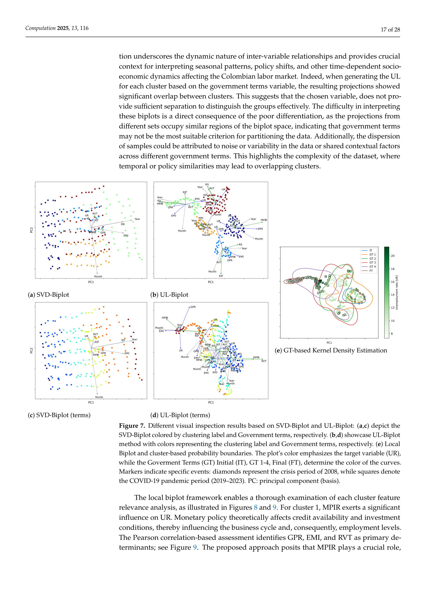

### Extraction assessment
- **Confidence:** 0.75 (below the configured 0.85 threshold; human review required).
- Embedded images require visual review; captions remain page-level text evidence only.

### Raw extracted text
```
Computation 2025, 13, 116
17 of 28
tion underscores the dynamic nature of inter-variable relationships and provides crucial
context for interpreting seasonal patterns, policy shifts, and other time-dependent socio-
economic dynamics affecting the Colombian labor market. Indeed, when generating the UL
for each cluster based on the government terms variable, the resulting projections showed
significant overlap between clusters. This suggests that the chosen variable, does not pro-
vide sufficient separation to distinguish the groups effectively. The difficulty in interpreting
these biplots is a direct consequence of the poor differentiation, as the projections from
different sets occupy similar regions of the biplot space, indicating that government terms
may not be the most suitable criterion for partitioning the data. Additionally, the dispersion
of samples could be attributed to noise or variability in the data or shared contextual factors
across different government terms. This highlights the complexity of the dataset, where
temporal or policy similarities may lead to overlapping clusters.
PC1
PC2
Year
Month
GPR
RS
EMI
RIT
RVT
MPIR
UR
(a) SVD-Biplot
PC1
PC2
Year
Month
GPR
RS
EMI
RIT
RVT
MPIR
UR
(c) SVD-Biplot (terms)
PC1
Year
Month
GPR
RS
EMI
RIT
RVT
MPIR
UR
Year
Month
GPR
RS
EMI
RIT
RVT
MPIR
UR
Year
Month
GPR
RS
EMI
RIT
RVT
MPIR
UR
Year
Month
GPR
RS
EMI
RIT
RVT
MPIR
UR
Year
Month
GPR
RS
EMI
RIT
RVT
MPIR
UR
(b) UL-Biplot
PC1
Month
GPR
RS
EMI
RIT
RVT
MPIR
UR
Year
Month
GPR
RS
EMI
RVT
MPIR
UR
Year
Month
GPR
RS
EMI
RIT
RVT
MPIR
UR
Year
Month
GPR
RS
EMI
RIT
RVT
MPIR
UR
Year
Month
GPR
RS
EMI
RIT
RVT
MPIR
UR
Year
Month
GPR
RS
EMI
RIT
RVT
MPIR
UR
(d) UL-Biplot (terms)
PC1
IT
GT 1
GT 2
GT 3
GT 4
FT
8
10
12
14
16
18
20
Unemployment rate (UR)
(e) GT-based Kernel Density Estimation
Figure 7. Different visual inspection results based on SVD-Biplot and UL-Biplot: (a,c) depict the
SVD-Biplot colored by clustering label and Government terms, respectively. (b,d) showcase UL-Biplot
method with colors representing the clustering label and Government terms, respectively. (e) Local
Biplot and cluster-based probability boundaries. The plot’s color emphasizes the target variable (UR),
while the Goverment Terms (GT) Initial (IT), GT 1-4, Final (FT), determine the color of the curves.
Markers indicate specific events: diamonds represent the crisis period of 2008, while squares denote
the COVID-19 pandemic period (2019–2023). PC: principal component (basis).
The local biplot framework enables a thorough examination of each cluster feature
relevance analysis, as illustrated in Figures 8 and 9. For cluster 1, MPIR exerts a significant
influence on UR. Monetary policy theoretically affects credit availability and investment
conditions, thereby influencing the business cycle and, consequently, employment levels.
The Pearson correlation-based assessment identifies GPR, EMI, and RVT as primary de-
terminants; see Figure 9. The proposed approach posits that MPIR plays a crucial role,

```

### Textual figure-caption evidence
- Figure 7. Different visual inspection results based on SVD-Biplot and UL-Biplot: (a,c) depict the
- Captions are page-level text evidence and are not associated with embedded images.

### Embedded images
- `page-017-image-001` — embedded image metadata: 24 × 462 px, xref 3484; visual review required.

## Page 18
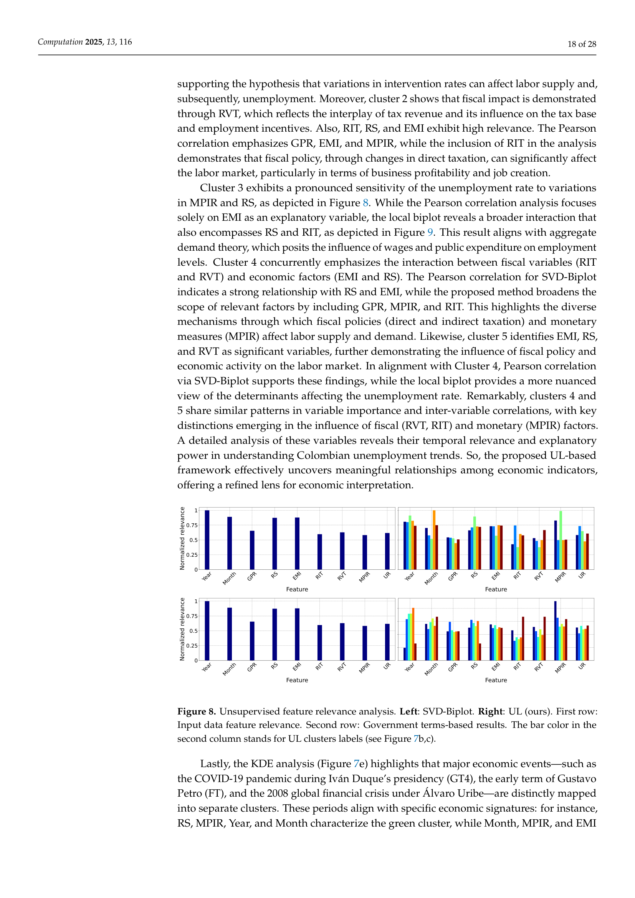

### Extraction assessment
- **Confidence:** 0.95 (meets the configured threshold).
- Machine-readable text was preserved with page-image provenance.

### Raw extracted text
```
Computation 2025, 13, 116
18 of 28
supporting the hypothesis that variations in intervention rates can affect labor supply and,
subsequently, unemployment. Moreover, cluster 2 shows that fiscal impact is demonstrated
through RVT, which reflects the interplay of tax revenue and its influence on the tax base
and employment incentives. Also, RIT, RS, and EMI exhibit high relevance. The Pearson
correlation emphasizes GPR, EMI, and MPIR, while the inclusion of RIT in the analysis
demonstrates that fiscal policy, through changes in direct taxation, can significantly affect
the labor market, particularly in terms of business profitability and job creation.
Cluster 3 exhibits a pronounced sensitivity of the unemployment rate to variations
in MPIR and RS, as depicted in Figure 8. While the Pearson correlation analysis focuses
solely on EMI as an explanatory variable, the local biplot reveals a broader interaction that
also encompasses RS and RIT, as depicted in Figure 9. This result aligns with aggregate
demand theory, which posits the influence of wages and public expenditure on employment
levels. Cluster 4 concurrently emphasizes the interaction between fiscal variables (RIT
and RVT) and economic factors (EMI and RS). The Pearson correlation for SVD-Biplot
indicates a strong relationship with RS and EMI, while the proposed method broadens the
scope of relevant factors by including GPR, MPIR, and RIT. This highlights the diverse
mechanisms through which fiscal policies (direct and indirect taxation) and monetary
measures (MPIR) affect labor supply and demand. Likewise, cluster 5 identifies EMI, RS,
and RVT as significant variables, further demonstrating the influence of fiscal policy and
economic activity on the labor market. In alignment with Cluster 4, Pearson correlation
via SVD-Biplot supports these findings, while the local biplot provides a more nuanced
view of the determinants affecting the unemployment rate. Remarkably, clusters 4 and
5 share similar patterns in variable importance and inter-variable correlations, with key
distinctions emerging in the influence of fiscal (RVT, RIT) and monetary (MPIR) factors.
A detailed analysis of these variables reveals their temporal relevance and explanatory
power in understanding Colombian unemployment trends. So, the proposed UL-based
framework effectively uncovers meaningful relationships among economic indicators,
offering a refined lens for economic interpretation.
Year
Month
GPR
RS
EMI
RIT
RVT
MPIR
UR
Feature
0
0.25
0.5
0.75
1
Normalized relevance
Year
Month
GPR
RS
EMI
RIT
RVT
MPIR
UR
Feature
Year
Month
GPR
RS
EMI
RIT
RVT
MPIR
UR
Feature
0
0.25
0.5
0.75
1
Normalized relevance
Year
Month
GPR
RS
EMI
RIT
RVT
MPIR
UR
Feature
Figure 8. Unsupervised feature relevance analysis. Left: SVD-Biplot. Right: UL (ours). First row:
Input data feature relevance. Second row: Government terms-based results. The bar color in the
second column stands for UL clusters labels (see Figure 7b,c).
Lastly, the KDE analysis (Figure 7e) highlights that major economic events—such as
the COVID-19 pandemic during Iván Duque’s presidency (GT4), the early term of Gustavo
Petro (FT), and the 2008 global financial crisis under Álvaro Uribe—are distinctly mapped
into separate clusters. These periods align with specific economic signatures: for instance,
RS, MPIR, Year, and Month characterize the green cluster, while Month, MPIR, and EMI

```

### Textual figure-caption evidence
- Figure 8. Unsupervised feature relevance analysis. Left: SVD-Biplot. Right: UL (ours). First row:
- Captions are page-level text evidence and are not associated with embedded images.

## Page 19
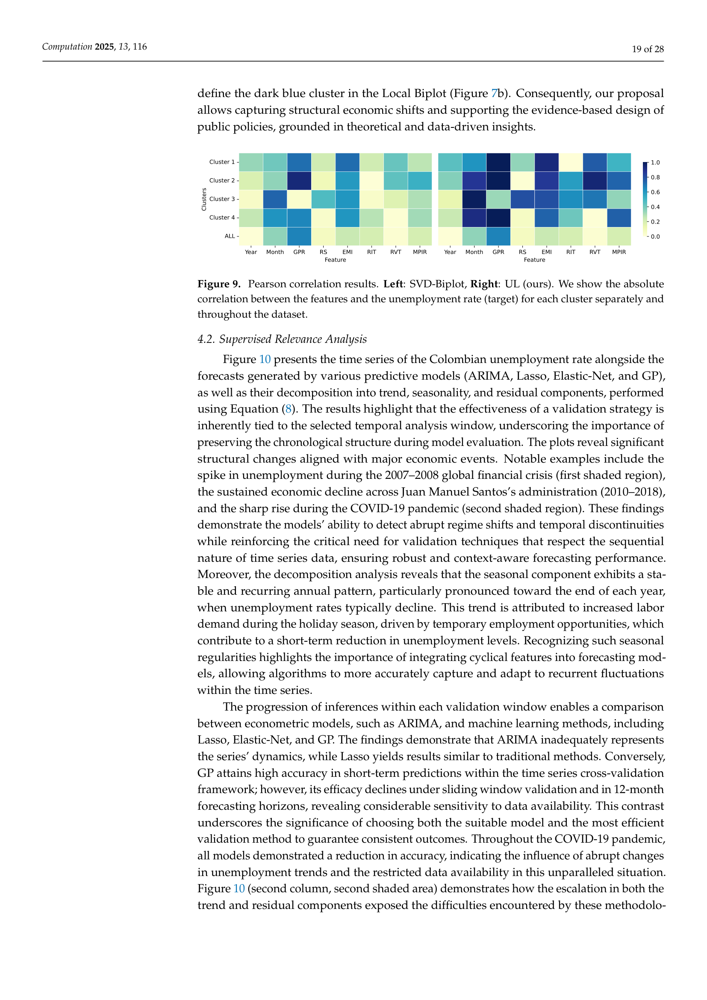

### Extraction assessment
- **Confidence:** 0.75 (below the configured 0.85 threshold; human review required).
- Embedded images require visual review; captions remain page-level text evidence only.

### Raw extracted text
```
Computation 2025, 13, 116
19 of 28
define the dark blue cluster in the Local Biplot (Figure 7b). Consequently, our proposal
allows capturing structural economic shifts and supporting the evidence-based design of
public policies, grounded in theoretical and data-driven insights.
Year
Month
GPR
RS
EMI
RIT
RVT
MPIR
Feature
Cluster 1
Cluster 2
Cluster 3
Cluster 4
ALL
Clusters
Year
Month
GPR
RS
EMI
RIT
RVT
MPIR
Feature
0.0
0.2
0.4
0.6
0.8
1.0
Figure 9. Pearson correlation results. Left: SVD-Biplot, Right: UL (ours). We show the absolute
correlation between the features and the unemployment rate (target) for each cluster separately and
throughout the dataset.
4.2. Supervised Relevance Analysis
Figure 10 presents the time series of the Colombian unemployment rate alongside the
forecasts generated by various predictive models (ARIMA, Lasso, Elastic-Net, and GP),
as well as their decomposition into trend, seasonality, and residual components, performed
using Equation (8). The results highlight that the effectiveness of a validation strategy is
inherently tied to the selected temporal analysis window, underscoring the importance of
preserving the chronological structure during model evaluation. The plots reveal significant
structural changes aligned with major economic events. Notable examples include the
spike in unemployment during the 2007–2008 global financial crisis (first shaded region),
the sustained economic decline across Juan Manuel Santos’s administration (2010–2018),
and the sharp rise during the COVID-19 pandemic (second shaded region). These findings
demonstrate the models’ ability to detect abrupt regime shifts and temporal discontinuities
while reinforcing the critical need for validation techniques that respect the sequential
nature of time series data, ensuring robust and context-aware forecasting performance.
Moreover, the decomposition analysis reveals that the seasonal component exhibits a sta-
ble and recurring annual pattern, particularly pronounced toward the end of each year,
when unemployment rates typically decline. This trend is attributed to increased labor
demand during the holiday season, driven by temporary employment opportunities, which
contribute to a short-term reduction in unemployment levels. Recognizing such seasonal
regularities highlights the importance of integrating cyclical features into forecasting mod-
els, allowing algorithms to more accurately capture and adapt to recurrent fluctuations
within the time series.
The progression of inferences within each validation window enables a comparison
between econometric models, such as ARIMA, and machine learning methods, including
Lasso, Elastic-Net, and GP. The findings demonstrate that ARIMA inadequately represents
the series’ dynamics, while Lasso yields results similar to traditional methods. Conversely,
GP attains high accuracy in short-term predictions within the time series cross-validation
framework; however, its efficacy declines under sliding window validation and in 12-month
forecasting horizons, revealing considerable sensitivity to data availability. This contrast
underscores the significance of choosing both the suitable model and the most efficient
validation method to guarantee consistent outcomes. Throughout the COVID-19 pandemic,
all models demonstrated a reduction in accuracy, indicating the influence of abrupt changes
in unemployment trends and the restricted data availability in this unparalleled situation.
Figure 10 (second column, second shaded area) demonstrates how the escalation in both the
trend and residual components exposed the difficulties encountered by these methodolo-

```

### Textual figure-caption evidence
- Figure 9. Pearson correlation results. Left: SVD-Biplot, Right: UL (ours). We show the absolute
- Captions are page-level text evidence and are not associated with embedded images.

### Embedded images
- `page-019-image-001` — embedded image metadata: 9 × 181 px, xref 5458; visual review required.

## Page 20
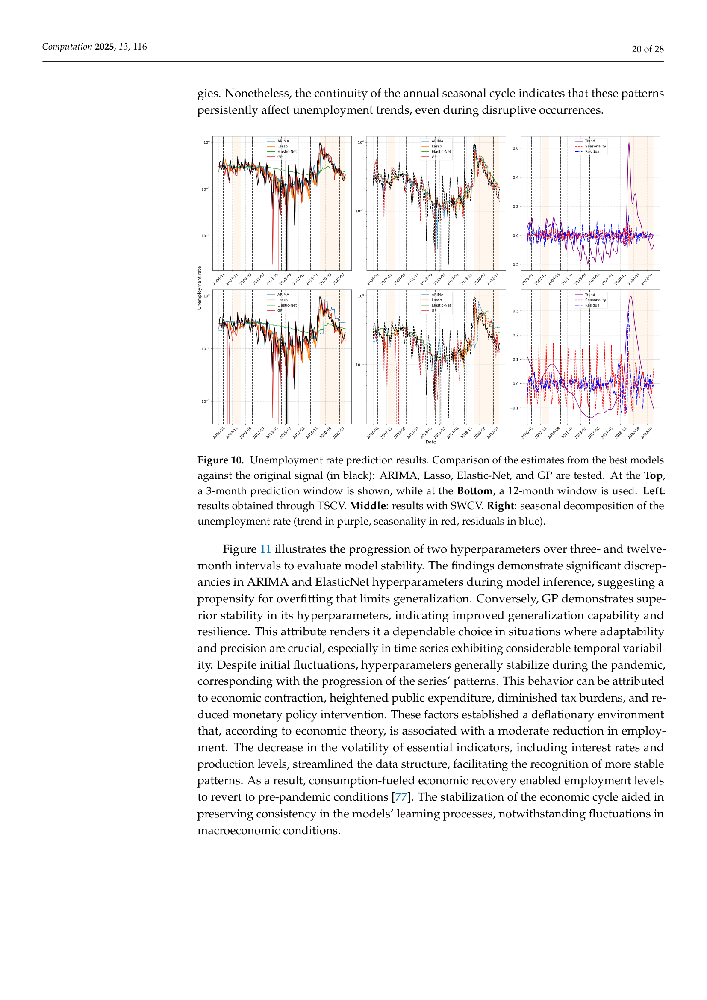

### Extraction assessment
- **Confidence:** 0.95 (meets the configured threshold).
- Machine-readable text was preserved with page-image provenance.

### Raw extracted text
```
Computation 2025, 13, 116
20 of 28
gies. Nonetheless, the continuity of the annual seasonal cycle indicates that these patterns
persistently affect unemployment trends, even during disruptive occurrences.
2006-01
2007-11
2009-09
2011-07
2013-05
2015-03
2017-01
2018-11
2020-09
2022-07
10
2
10
1
100
ARIMA
Lasso
Elastic-Net
GP
2006-01
2007-11
2009-09
2011-07
2013-05
2015-03
2017-01
2018-11
2020-09
2022-07
10
1
100
ARIMA
Lasso
Elastic-Net
GP
2006-01
2007-11
2009-09
2011-07
2013-05
2015-03
2017-01
2018-11
2020-09
2022-07
0.2
0.0
0.2
0.4
0.6
Trend
Seasonality
Residual
2006-01
2007-11
2009-09
2011-07
2013-05
2015-03
2017-01
2018-11
2020-09
2022-07
10
2
10
1
100
ARIMA
Lasso
Elastic-Net
GP
2006-01
2007-11
2009-09
2011-07
2013-05
2015-03
2017-01
2018-11
2020-09
2022-07
10
1
100
ARIMA
Lasso
Elastic-Net
GP
2006-01
2007-11
2009-09
2011-07
2013-05
2015-03
2017-01
2018-11
2020-09
2022-07
0.1
0.0
0.1
0.2
0.3
Trend
Seasonality
Residual
Date
Unemployment rate
Figure 10. Unemployment rate prediction results. Comparison of the estimates from the best models
against the original signal (in black): ARIMA, Lasso, Elastic-Net, and GP are tested. At the Top,
a 3-month prediction window is shown, while at the Bottom, a 12-month window is used. Left:
results obtained through TSCV. Middle: results with SWCV. Right: seasonal decomposition of the
unemployment rate (trend in purple, seasonality in red, residuals in blue).
Figure 11 illustrates the progression of two hyperparameters over three- and twelve-
month intervals to evaluate model stability. The findings demonstrate significant discrep-
ancies in ARIMA and ElasticNet hyperparameters during model inference, suggesting a
propensity for overfitting that limits generalization. Conversely, GP demonstrates supe-
rior stability in its hyperparameters, indicating improved generalization capability and
resilience. This attribute renders it a dependable choice in situations where adaptability
and precision are crucial, especially in time series exhibiting considerable temporal variabil-
ity. Despite initial fluctuations, hyperparameters generally stabilize during the pandemic,
corresponding with the progression of the series’ patterns. This behavior can be attributed
to economic contraction, heightened public expenditure, diminished tax burdens, and re-
duced monetary policy intervention. These factors established a deflationary environment
that, according to economic theory, is associated with a moderate reduction in employ-
ment. The decrease in the volatility of essential indicators, including interest rates and
production levels, streamlined the data structure, facilitating the recognition of more stable
patterns. As a result, consumption-fueled economic recovery enabled employment levels
to revert to pre-pandemic conditions [77]. The stabilization of the economic cycle aided in
preserving consistency in the models’ learning processes, notwithstanding fluctuations in
macroeconomic conditions.

```

### Textual figure-caption evidence
- Figure 10. Unemployment rate prediction results. Comparison of the estimates from the best models
- Captions are page-level text evidence and are not associated with embedded images.

## Page 21
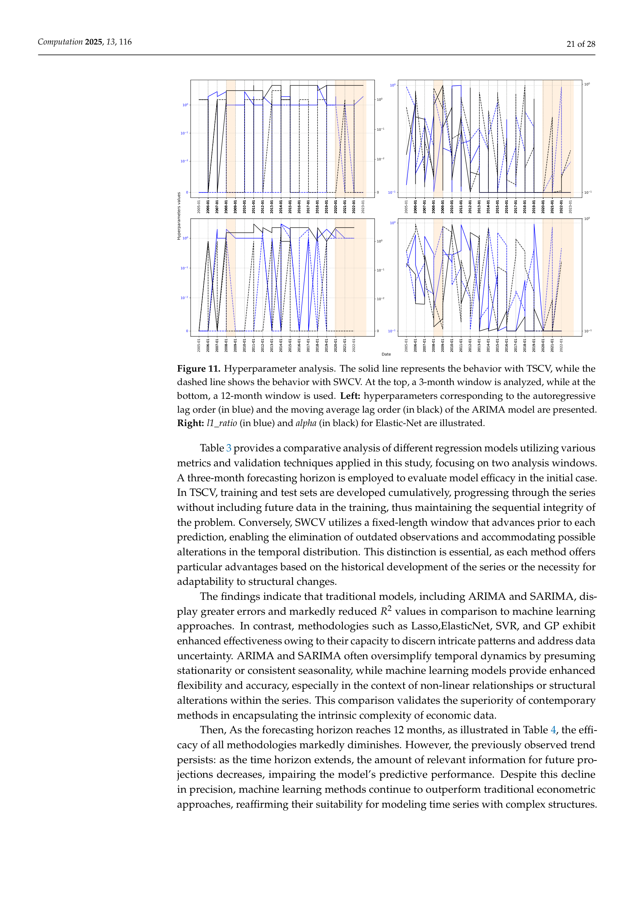

### Extraction assessment
- **Confidence:** 0.65 (below the configured 0.85 threshold; human review required).
- One or more equation candidates are ambiguous in raw extraction.

### Raw extracted text
```
Computation 2025, 13, 116
21 of 28
2005-01
2006-01
2006-01
2006-01
2006-01
2007-01
2007-01
2007-01
2007-01
2008-01
2008-01
2008-01
2008-01
2009-01
2009-01
2009-01
2009-01
2010-01
2010-01
2010-01
2010-01
2011-01
2011-01
2011-01
2011-01
2012-01
2012-01
2012-01
2012-01
2013-01
2013-01
2013-01
2013-01
2014-01
2014-01
2014-01
2014-01
2015-01
2015-01
2015-01
2015-01
2016-01
2016-01
2016-01
2016-01
2017-01
2017-01
2017-01
2017-01
2018-01
2018-01
2018-01
2018-01
2019-01
2019-01
2019-01
2019-01
2020-01
2020-01
2020-01
2020-01
2021-01
2021-01
2021-01
2021-01
2022-01
2022-01
2022-01
2022-01
2023-01
0
10
2
10
1
100
2005-01
2006-01
2006-01
2006-01
2006-01
2007-01
2007-01
2007-01
2007-01
2008-01
2008-01
2008-01
2008-01
2009-01
2009-01
2009-01
2009-01
2010-01
2010-01
2010-01
2010-01
2011-01
2011-01
2011-01
2011-01
2012-01
2012-01
2012-01
2012-01
2013-01
2013-01
2013-01
2013-01
2014-01
2014-01
2014-01
2014-01
2015-01
2015-01
2015-01
2015-01
2016-01
2016-01
2016-01
2016-01
2017-01
2017-01
2017-01
2017-01
2018-01
2018-01
2018-01
2018-01
2019-01
2019-01
2019-01
2019-01
2020-01
2020-01
2020-01
2020-01
2021-01
2021-01
2021-01
2021-01
2022-01
2022-01
2022-01
2022-01
2023-01
10
1
100
2005-01
2006-01
2006-01
2007-01
2007-01
2008-01
2008-01
2009-01
2009-01
2010-01
2010-01
2011-01
2011-01
2012-01
2012-01
2013-01
2013-01
2014-01
2014-01
2015-01
2015-01
2016-01
2016-01
2017-01
2017-01
2018-01
2018-01
2019-01
2019-01
2020-01
2020-01
2021-01
2021-01
2022-01
0
10
2
10
1
100
2005-01
2006-01
2006-01
2007-01
2007-01
2008-01
2008-01
2009-01
2009-01
2010-01
2010-01
2011-01
2011-01
2012-01
2012-01
2013-01
2013-01
2014-01
2014-01
2015-01
2015-01
2016-01
2016-01
2017-01
2017-01
2018-01
2018-01
2019-01
2019-01
2020-01
2020-01
2021-01
2021-01
2022-01
10
1
100
0
10
2
10
1
100
10
1
100
0
10
2
10
1
100
10
1
100
Date
Hyperparameters values
Figure 11. Hyperparameter analysis. The solid line represents the behavior with TSCV, while the
dashed line shows the behavior with SWCV. At the top, a 3-month window is analyzed, while at the
bottom, a 12-month window is used. Left: hyperparameters corresponding to the autoregressive
lag order (in blue) and the moving average lag order (in black) of the ARIMA model are presented.
Right: l1_ratio (in blue) and alpha (in black) for Elastic-Net are illustrated.
Table 3 provides a comparative analysis of different regression models utilizing various
metrics and validation techniques applied in this study, focusing on two analysis windows.
A three-month forecasting horizon is employed to evaluate model efficacy in the initial case.
In TSCV, training and test sets are developed cumulatively, progressing through the series
without including future data in the training, thus maintaining the sequential integrity of
the problem. Conversely, SWCV utilizes a fixed-length window that advances prior to each
prediction, enabling the elimination of outdated observations and accommodating possible
alterations in the temporal distribution. This distinction is essential, as each method offers
particular advantages based on the historical development of the series or the necessity for
adaptability to structural changes.
The findings indicate that traditional models, including ARIMA and SARIMA, dis-
play greater errors and markedly reduced R2 values in comparison to machine learning
approaches. In contrast, methodologies such as Lasso,ElasticNet, SVR, and GP exhibit
enhanced effectiveness owing to their capacity to discern intricate patterns and address data
uncertainty. ARIMA and SARIMA often oversimplify temporal dynamics by presuming
stationarity or consistent seasonality, while machine learning models provide enhanced
flexibility and accuracy, especially in the context of non-linear relationships or structural
alterations within the series. This comparison validates the superiority of contemporary
methods in encapsulating the intrinsic complexity of economic data.
Then, As the forecasting horizon reaches 12 months, as illustrated in Table 4, the effi-
cacy of all methodologies markedly diminishes. However, the previously observed trend
persists: as the time horizon extends, the amount of relevant information for future pro-
jections decreases, impairing the model’s predictive performance. Despite this decline
in precision, machine learning methods continue to outperform traditional econometric
approaches, reaffirming their suitability for modeling time series with complex structures.

```

### Textual figure-caption evidence
- Figure 11. Hyperparameter analysis. The solid line represents the behavior with TSCV, while the
- Captions are page-level text evidence and are not associated with embedded images.

### Equation candidates
- `page-021-equation-001` — review_required (confidence 0.45; page 21).
```
Right: l1_ratio (in blue) and alpha (in black) for Elastic-Net are illustrated.
```

## Page 22
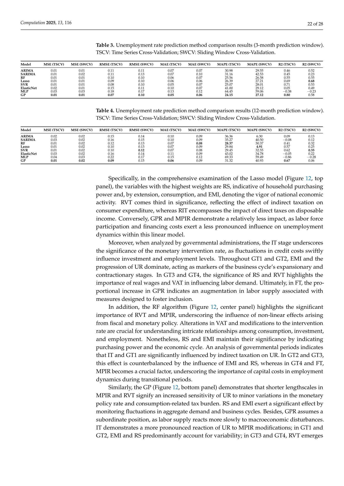

### Extraction assessment
- **Confidence:** 0.95 (meets the configured threshold).
- Machine-readable text was preserved with page-image provenance.

### Raw extracted text
```
Computation 2025, 13, 116
22 of 28
Table 3. Unemployment rate prediction method comparison results (3-month prediction window).
TSCV: Time Series Cross-Validation; SWCV: Sliding Window Cross-Validation.
Model
MSE (TSCV)
MSE (SWCV)
RMSE (TSCV)
RMSE (SWCV)
MAE (TSCV)
MAE (SWCV)
MAPE (TSCV)
MAPE (SWCV)
R2 (TSCV)
R2 (SWCV)
ARIMA
0.01
0.01
0.11
0.11
0.07
0.07
30.98
29.55
0.46
0.52
SARIMA
0.01
0.02
0.11
0.13
0.07
0.10
31.16
42.53
0.45
0.23
RF
0.01
0.01
0.10
0.10
0.06
0.07
25.56
26.58
0.55
0.55
Lasso
0.01
0.01
0.09
0.10
0.06
0.06
26.39
27.21
0.69
0.68
SVR
0.01
0.01
0.08
0.10
0.05
0.07
25.07
28.01
0.71
0.53
ElasticNet
0.02
0.01
0.15
0.11
0.10
0.07
41.00
29.12
0.05
0.49
MLP
0.03
0.03
0.18
0.17
0.13
0.12
64.45
59.06
−0.38
−0.23
GP
0.01
0.01
0.07
0.10
0.05
0.06
24.15
27.12
0.80
0.58
Table 4. Unemployment rate prediction method comparison results (12-month prediction window).
TSCV: Time Series Cross-Validation; SWCV: Sliding Window Cross-Validation.
Model
MSE (TSCV)
MSE (SWCV)
RMSE (TSCV)
RMSE (SWCV)
MAE (TSCV)
MAE (SWCV)
MAPE (TSCV)
MAPE (SWCV)
R2 (TSCV)
R2 (SWCV)
ARIMA
0.02
0.02
0.15
0.14
0.10
0.09
36.36
6.30
0.09
0.13
SARIMA
0.03
0.02
0.16
0.15
0.10
0.09
35.27
40.50
−0.08
0.12
RF
0.01
0.02
0.12
0.13
0.07
0.08
28.37
30.37
0.41
0.32
Lasso
0.01
0.02
0.10
0.13
0.07
0.09
29.84
4.91
0.57
0.25
SVR
0.01
0.02
0.10
0.12
0.07
0.08
29.45
32.55
0.62
0.35
ElasticNet
0.03
0.02
0.16
0.14
0.11
0.09
43.02
34.78
−0.05
0.22
MLP
0.04
0.03
0.22
0.17
0.15
0.12
69.33
59.49
−0.86
−0.28
GP
0.01
0.02
0.09
0.15
0.06
0.09
31.32
40.93
0.67
0.06
Specifically, in the comprehensive examination of the Lasso model (Figure 12, top
panel), the variables with the highest weights are RS, indicative of household purchasing
power and, by extension, consumption, and EMI, denoting the vigor of national economic
activity. RVT comes third in significance, reflecting the effect of indirect taxation on
consumer expenditure, whereas RIT encompasses the impact of direct taxes on disposable
income. Conversely, GPR and MPIR demonstrate a relatively less impact, as labor force
participation and financing costs exert a less pronounced influence on unemployment
dynamics within this linear model.
Moreover, when analyzed by governmental administrations, the IT stage underscores
the significance of the monetary intervention rate, as fluctuations in credit costs swiftly
influence investment and employment levels. Throughout GT1 and GT2, EMI and the
progression of UR dominate, acting as markers of the business cycle’s expansionary and
contractionary stages. In GT3 and GT4, the significance of RS and RVT highlights the
importance of real wages and VAT in influencing labor demand. Ultimately, in FT, the pro-
portional increase in GPR indicates an augmentation in labor supply associated with
measures designed to foster inclusion.
In addition, the RF algorithm (Figure 12, center panel) highlights the significant
importance of RVT and MPIR, underscoring the influence of non-linear effects arising
from fiscal and monetary policy. Alterations in VAT and modifications to the intervention
rate are crucial for understanding intricate relationships among consumption, investment,
and employment. Nonetheless, RS and EMI maintain their significance by indicating
purchasing power and the economic cycle. An analysis of governmental periods indicates
that IT and GT1 are significantly influenced by indirect taxation on UR. In GT2 and GT3,
this effect is counterbalanced by the influence of EMI and RS, whereas in GT4 and FT,
MPIR becomes a crucial factor, underscoring the importance of capital costs in employment
dynamics during transitional periods.
Similarly, the GP (Figure 12, bottom panel) demonstrates that shorter lengthscales in
MPIR and RVT signify an increased sensitivity of UR to minor variations in the monetary
policy rate and consumption-related tax burden. RS and EMI exert a significant effect by
monitoring fluctuations in aggregate demand and business cycles. Besides, GPR assumes a
subordinate position, as labor supply reacts more slowly to macroeconomic disturbances.
IT demonstrates a more pronounced reaction of UR to MPIR modifications; in GT1 and
GT2, EMI and RS predominantly account for variability; in GT3 and GT4, RVT emerges

```

## Page 23
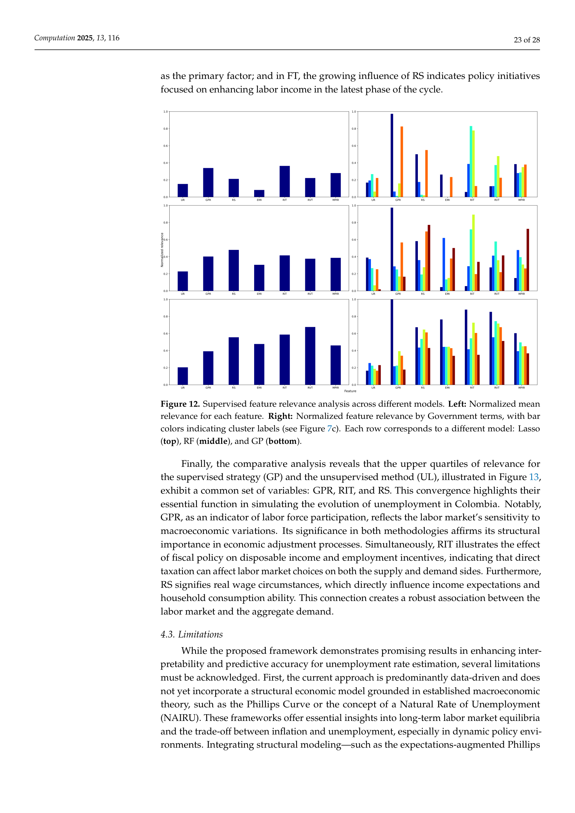

### Extraction assessment
- **Confidence:** 0.95 (meets the configured threshold).
- Machine-readable text was preserved with page-image provenance.

### Raw extracted text
```
Computation 2025, 13, 116
23 of 28
as the primary factor; and in FT, the growing influence of RS indicates policy initiatives
focused on enhancing labor income in the latest phase of the cycle.
UR
GPR
RS
EMI
RIT
RVT
MPIR
0.0
0.2
0.4
0.6
0.8
1.0
UR
GPR
RS
EMI
RIT
RVT
MPIR
0.0
0.2
0.4
0.6
0.8
1.0
UR
GPR
RS
EMI
RIT
RVT
MPIR
0.0
0.2
0.4
0.6
0.8
1.0
UR
GPR
RS
EMI
RIT
RVT
MPIR
0.0
0.2
0.4
0.6
0.8
1.0
UR
GPR
RS
EMI
RIT
RVT
MPIR
0.0
0.2
0.4
0.6
0.8
1.0
UR
GPR
RS
EMI
RIT
RVT
MPIR
0.0
0.2
0.4
0.6
0.8
1.0
Feature
Normalized relevance
Figure 12. Supervised feature relevance analysis across different models. Left: Normalized mean
relevance for each feature. Right: Normalized feature relevance by Government terms, with bar
colors indicating cluster labels (see Figure 7c). Each row corresponds to a different model: Lasso
(top), RF (middle), and GP (bottom).
Finally, the comparative analysis reveals that the upper quartiles of relevance for
the supervised strategy (GP) and the unsupervised method (UL), illustrated in Figure 13,
exhibit a common set of variables: GPR, RIT, and RS. This convergence highlights their
essential function in simulating the evolution of unemployment in Colombia. Notably,
GPR, as an indicator of labor force participation, reflects the labor market’s sensitivity to
macroeconomic variations. Its significance in both methodologies affirms its structural
importance in economic adjustment processes. Simultaneously, RIT illustrates the effect
of fiscal policy on disposable income and employment incentives, indicating that direct
taxation can affect labor market choices on both the supply and demand sides. Furthermore,
RS signifies real wage circumstances, which directly influence income expectations and
household consumption ability. This connection creates a robust association between the
labor market and the aggregate demand.
4.3. Limitations
While the proposed framework demonstrates promising results in enhancing inter-
pretability and predictive accuracy for unemployment rate estimation, several limitations
must be acknowledged. First, the current approach is predominantly data-driven and does
not yet incorporate a structural economic model grounded in established macroeconomic
theory, such as the Phillips Curve or the concept of a Natural Rate of Unemployment
(NAIRU). These frameworks offer essential insights into long-term labor market equilibria
and the trade-off between inflation and unemployment, especially in dynamic policy envi-
ronments. Integrating structural modeling—such as the expectations-augmented Phillips

```

### Textual figure-caption evidence
- Figure 12. Supervised feature relevance analysis across different models. Left: Normalized mean
- Captions are page-level text evidence and are not associated with embedded images.

## Page 24
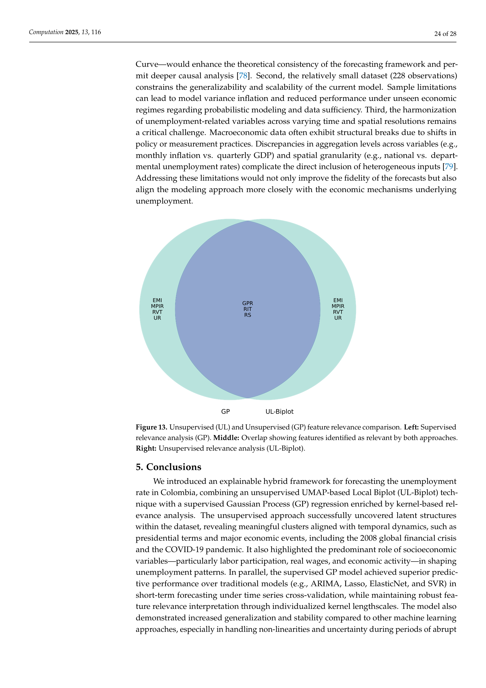

### Extraction assessment
- **Confidence:** 0.95 (meets the configured threshold).
- Machine-readable text was preserved with page-image provenance.

### Raw extracted text
```
Computation 2025, 13, 116
24 of 28
Curve—would enhance the theoretical consistency of the forecasting framework and per-
mit deeper causal analysis [78]. Second, the relatively small dataset (228 observations)
constrains the generalizability and scalability of the current model. Sample limitations
can lead to model variance inflation and reduced performance under unseen economic
regimes regarding probabilistic modeling and data sufficiency. Third, the harmonization
of unemployment-related variables across varying time and spatial resolutions remains
a critical challenge. Macroeconomic data often exhibit structural breaks due to shifts in
policy or measurement practices. Discrepancies in aggregation levels across variables (e.g.,
monthly inflation vs. quarterly GDP) and spatial granularity (e.g., national vs. depart-
mental unemployment rates) complicate the direct inclusion of heterogeneous inputs [79].
Addressing these limitations would not only improve the fidelity of the forecasts but also
align the modeling approach more closely with the economic mechanisms underlying
unemployment.
EMI
MPIR
RVT
UR
EMI
MPIR
RVT
UR
GPR
RIT
RS
GP
UL-Biplot
Figure 13. Unsupervised (UL) and Unsupervised (GP) feature relevance comparison. Left: Supervised
relevance analysis (GP). Middle: Overlap showing features identified as relevant by both approaches.
Right: Unsupervised relevance analysis (UL-Biplot).
5. Conclusions
We introduced an explainable hybrid framework for forecasting the unemployment
rate in Colombia, combining an unsupervised UMAP-based Local Biplot (UL-Biplot) tech-
nique with a supervised Gaussian Process (GP) regression enriched by kernel-based rel-
evance analysis. The unsupervised approach successfully uncovered latent structures
within the dataset, revealing meaningful clusters aligned with temporal dynamics, such as
presidential terms and major economic events, including the 2008 global financial crisis
and the COVID-19 pandemic. It also highlighted the predominant role of socioeconomic
variables—particularly labor participation, real wages, and economic activity—in shaping
unemployment patterns. In parallel, the supervised GP model achieved superior predic-
tive performance over traditional models (e.g., ARIMA, Lasso, ElasticNet, and SVR) in
short-term forecasting under time series cross-validation, while maintaining robust fea-
ture relevance interpretation through individualized kernel lengthscales. The model also
demonstrated increased generalization and stability compared to other machine learning
approaches, especially in handling non-linearities and uncertainty during periods of abrupt

```

### Textual figure-caption evidence
- Figure 13. Unsupervised (UL) and Unsupervised (GP) feature relevance comparison. Left: Supervised
- Captions are page-level text evidence and are not associated with embedded images.

## Page 25


### Extraction assessment
- **Confidence:** 0.95 (meets the configured threshold).
- Machine-readable text was preserved with page-image provenance.

### Raw extracted text
```
Computation 2025, 13, 116
25 of 28
economic change. Indeed, presidential terms exhibit a clear correlation with our findings,
offering valuable context for interpreting the temporal dynamics and structural shifts in
Colombia’s unemployment rate. Of note, the recurrent appearance of RS, RIT, RVT, GPR,
EMI, and MPIR across various methodological approaches—from traditional econometric
models such as ARIMA and SARIMA to regularized machine learning algorithms like
Lasso and Elastic-Net, as well as the hybrid UL-Biplot and GP proposal—highlights their
crucial influence on the dynamics of Colombian unemployment.
Beyond methodological advancements, the proposed integration of GP-based regres-
sion and UL-based unsupervised relevance analysis offers substantial political value for
public decision-making. By generating interpretable predictions of unemployment levels,
policymakers are empowered to not only anticipate labor market stressors but also to
trace back the contributing socioeconomic and monetary factors in a transparent manner.
The predictions provided favor the formulation of risk-aware policies, while the UL frame-
work visually maps economic patterns and latent clusters, enabling the identification of
vulnerable groups or periods of systemic fragility. Together, these tools support the design
of targeted, evidence-driven interventions that can improve labor participation, stabilize
employment conditions, and reduce structural inequality—especially in policy contexts
where responsiveness, fairness, and accountability are paramount.
As future work, we propose extending the dataset to include regional indicators, which
may uncover localized patterns and support the development of more targeted public
policies. Additionally, we suggest exploring probabilistic deep learning models, such as
GP Deep Kernel Learning or interpretable attention-based architectures, to preserve model
explainability while improving generalization under high temporal variability [80,81]. Ad-
ditionally, key drivers of the predicted unemployment rate—such as government expendi-
ture, foreign investment, and manufacturing employment—will be incorporated for deeper
analysis of unemployment trends. Finally, incorporating qualitative information—such
as regulatory changes, sociopolitical events, or labor market perception surveys—could
enrich the proposed models and enhance their value as decision-making tools grounded in
data and economic theory.
Author Contributions: Conceptualization, D.A.P.-R., D.A.M.-C. and A.M.Á.-M.; data curation,
D.A.P.-R., D.A.M.-C. and J.C.T.-M.; methodology, A.M.Á.-M. and G.C.-D.; project administration,
A.M.Á.-M.; supervision, A.M.Á.-M. and G.C.-D.; resources, D.A.P.-R., J.C.T.-M. and A.M.Á.-M. All
authors have read and agreed to the published version of the manuscript.
Funding: Under grants provived by the project: Sistema de visión artificial para el monitoreo y
seguimiento de efectos analgésicos y anestésicos administrados vía neuroaxial epidural en población
obstétrica durante labores de parto para el fortalecimiento de servicios de salud materna del Hospital
Universitario de Caldas - SES HUC (funded by Universidad Nacional de Colombia, HERMES-57661).
Data Availability Statement: The publicly available dataset analyzed in this study can be found at
https://github.com/UN-GCPDS/Unemployment-Rate-Prediction.git (accessed on 1 April 2025).
Conflicts of Interest: The authors declare no conflicts of interest.
References
1.
Zamanzadeh, A.; Chan, M.K.; Ehsani, M.A.; Ganjali, M. Unemployment duration, Fiscal and monetary policies, and the output
gap: How do the quantile relationships look like? Econ. Model. 2020, 91, 613–632. [CrossRef]
2.
Chodorow-Reich, G.; Coglianese, J.; Karabarbounis, L. The macro effects of unemployment benefit extensions: A measurement
error approach. Q. J. Econ. 2019, 134, 227–279. [CrossRef]
3.
Ozili, P.; Oladipo, O. Impact of credit expansion and contraction on unemployment. Int. J. Soc. Econ. 2025, 52, 205–219. [CrossRef]
4.
Sakamoto, T. Poverty, inequality, and redistribution: An analysis of the equalizing effects of social investment policy. Int. J. Comp.
Sociol. 2024, 65, 310–334. [CrossRef]

```

## Page 26


### Extraction assessment
- **Confidence:** 0.65 (below the configured 0.85 threshold; human review required).
- One or more equation candidates are ambiguous in raw extraction.

### Raw extracted text
```
Computation 2025, 13, 116
26 of 28
5.
Hidalgo Villota, M.E. Business cycles in Colombia: Stylized facts. Tendencias 2024, 25, 26–56. [CrossRef]
6.
Sullivan, M. Comprender y predecir la elección del marco de política monetaria en los países en desarrollo. Model. Econ. 2024,
139, 106783. [CrossRef]
7.
Mamo, D.K.; Ayele, E.A.; Teklu, S.W. Modelling and Analysis of the Impact of Corruption on Economic Growth and Unemploy-
ment. In Proceedings of the Operations Research Forum; Springer: Berlin/Heidelberg, Germany, 2024; Volume 5, p. 36.
8.
Patwa, P.; Bhardwaj, M.; Guptha, V.; Kumari, G.; Sharma, S.; Pykl, S.; Das, A.; Ekbal, A.; Akhtar, M.S.; Chakraborty, T. Overview
of constraint 2021 shared tasks: Detecting english covid-19 fake news and hindi hostile posts. In Proceedings of the Combating
Online Hostile Posts in Regional Languages During Emergency Situation: First International Workshop, CONSTRAINT 2021,
Collocated with AAAI 2021, Virtual Event, 8 February 2021; Revised Selected Papers 1; Springer: Berlin/Heidelberg, Germany,
2021; pp. 42–53.
9.
Papi´c-Blagojevi´c, N.; Stankov, B. Analysis of Trends in Youth Unemployment in the European Union: The Role and Importance of
Youth Entrepreneurship. In Entrepreneurship and Development for a Green Resilient Economy; Emerald Publishing Limited: Bingley,
UK, 2024; pp. 181–204. [CrossRef]
10.
Olschewski, S.; Luckman, A.; Mason, A.; Ludvig, E.A.; Konstantinidis, E. The future of decisions from experience: Connecting
real-world decision problems to cognitive processes. Perspect. Psychol. Sci. 2024, 19, 82–102. [CrossRef]
11.
Carrino, L.; Farnia, L.; Giove, S. Measuring Social Inclusion in Europe: A non-additive approach with the expert-preferences of
public policy planners. J. R. Stat. Soc. Ser. A Stat. Soc. 2024, 187, 231–259. [CrossRef]
12.
Masoud, N. Artificial intelligence and unemployment dynamics: An econometric analysis in high-income economies. Technol.
Sustain. 2025, 4, 30–50. [CrossRef]
13.
Da Re, D.; Marini, G.; Bonannella, C.; Laurini, F.; Manica, M.; Anicic, N.; Albieri, A.; Angelini, P.; Arnoldi, D.; Bertola, F.; et al.
Modelling the seasonal dynamics of Aedes albopictus populations using a spatio-temporal stacked machine learning model. Sci.
Rep. 2025, 15, 3750. [CrossRef]
14.
Chen, X.S.; Kim, M.G.; Lin, C.H.; Na, H.J. Development of per Capita GDP Forecasting Model Using Deep Learning: Including
Consumer Goods Index and Unemployment Rate. Sustainability 2025, 17, 843.
15.
Departamento Administrativo Nacional de Estadística (DANE). Metodología de Estadísticas Laborales. 2025. Available online:
https://bibliotecadoctecnica.dane.gov.co/static/documentos/DIG/DEE/DEE_Metodolog (accessed on 1 April 2025).
16.
Departamento Administrativo Nacional de Estadística (DANE). Metodología de Encuestas Económicas y de Empleo. 2025.
Available online: https://bibliotecadoctecnica.dane.gov.co/static/documentos/DCD/EEVV/EEVV_Metodolog (accessed on 1
April 2025). [CrossRef]
17.
Pigazo-López, F.; del Carmen Ruiz-Puente, M. Analysis of the Dynamic Relationships Between Industrial and Environmental
Factors and Unemployment Rate. An Econometric Approach. Dyna. Energía Sostenibilidad 2024, 13, 1–13. [CrossRef]
18.
Chakraborty, T.; Chakraborty, A.K.; Biswas, M.; Banerjee, S.; Bhattacharya, S. Unemployment rate forecasting: A hybrid approach.
Comput. Econ. 2021, 57, 183–201.
19.
Woan-Lin, B.; Hui-Mei, T. Economic Impact on Palm Oil Stock Returns in Malaysia, Singapore, and Indonesia: A Nardl Model
Analysis. J. Sustain. Sci. Manag. 2024, 19, 195–202. [CrossRef]
20.
Shi, X.; Wang, J.; Zhang, B. A fuzzy time series forecasting model with both accuracy and interpretability is used to forecast wind
power. Appl. Energy 2024, 353, 122015. [CrossRef]
21.
Onatunji, O.G.; Adeleke, O.K.; Adejumo, A.V. Non-linearity in the Phillips curve: Evidence from Nigeria. Afr. J. Econ. Manag.
Stud. 2024, 15, 132–144. [CrossRef]
22.
Gallegati, M.; Gallegati, S. Why does economics need complexity? Soft Comput. 2025, 1–10. [CrossRef].
23.
Nosike, C.J.; Ojobor, O.S.N. Effects of Government Policies on Recessions: Fiscal and Monetary Policy Impact on Unemployment,
Poverty, and Inequality. Interdiscip. J. Afr. Asian Stud. (IJAAS) 2024, 10, 1–12.
24.
Advani, B.; Sachan, A.; Sahu, U.K.; Pradhan, A.K. Forecasting Major Macroeconomic Variables of the Indian Economy. In
Modeling Economic Growth in Contemporary India; Emerald Publishing Limited: Bingley, UK, 2024; pp. 1–24. [CrossRef]
25.
Mero, K.; Salgado, N.; Meza, J.; Pacheco-Delgado, J.; Ventura, S. Unemployment Rate Prediction Using a Hybrid Model of
Recurrent Neural Networks and Genetic Algorithms. Appl. Sci. 2024, 14, 3174. [CrossRef]
26.
Mohamed, A.A.; Abdi, A.H. Exploring the dynamics of inflation, unemployment, and economic growth in Somalia: A VECM
analysis. Cogent Econ. Financ. 2024, 12, 2385644. [CrossRef]
27.
Saâdaoui, F.; Rabbouch, H. Financial forecasting improvement with LSTM-ARFIMA hybrid models and non-Gaussian distribu-
tions. Technol. Forecast. Soc. Change 2024, 206, 123539. [CrossRef]
28.
Boundi-Chraki, F.; Perrotini-Hernández, I. Revisiting the Classical Theory of Investment: An Empirical Assessment from the
European Union. J. Quant. Econ. 2024, 22, 63–89. [CrossRef]
29.
Mutascu, M.; Hegerty, S.W. Predicting the contribution of artificial intelligence to unemployment rates: An artificial neural
network approach. J. Econ. Financ. 2023, 47, 400–416. [CrossRef]

```

### Equation candidates
- `page-026-equation-001` — review_required (confidence 0.45; page 26).
```
https://bibliotecadoctecnica.dane.gov.co/static/documentos/DIG/DEE/DEE_Metodolog (accessed on 1 April 2025).
```
- `page-026-equation-002` — review_required (confidence 0.45; page 26).
```
Available online: https://bibliotecadoctecnica.dane.gov.co/static/documentos/DCD/EEVV/EEVV_Metodolog (accessed on 1
```

## Page 27


### Extraction assessment
- **Confidence:** 0.65 (below the configured 0.85 threshold; human review required).
- One or more equation candidates are ambiguous in raw extraction.

### Raw extracted text
```
Computation 2025, 13, 116
27 of 28
30.
Capello, R.; Caragliu, A.; Dellisanti, R. Integrating digital and global transformations in forecasting regional growth: The MASST5
model. Spat. Econ. Anal. 2024, 19, 133–160.
31.
Shavvalpour, S.; Mohseni, R.; Kordtabar Firouzjaei, H. Analysis of the Asymmetric impact of Oil prices, Exchange rates, and their
Uncertainty on Unemployment in Oil-Exporting countries. Macroecon. Res. Lett. 2024, 19. [CrossRef]
32.
Sow, A.; Traore, I.; Diallo, T.; Traore, M.; Ba, A. Comparison of Gaussian process regression, partial least squares, random forest
and support vector machines for a near infrared calibration of paracetamol samples. Results Chem. 2022, 4, 100508.
33.
Shamsi, M.; Beheshti, S. Separability and scatteredness (S&S) ratio-based efficient SVM regularization parameter, kernel, and
kernel parameter selection. Pattern Anal. Appl. 2025, 28, 33. [CrossRef]
34.
Xu, B.; Huang, J.Z.; Williams, G.; Wang, Q.; Ye, Y. Classifying very high-dimensional data with random forests built from small
subspaces. Int. J. Data Warehous. Min. (IJDWM) 2012, 8, 44–63. [CrossRef]
35.
Wang, Q.; Nguyen, T.T.; Huang, J.Z.; Nguyen, T.T. An efficient random forests algorithm for high dimensional data classification.
Adv. Data Anal. Classif. 2018, 12, 953–972. [CrossRef]
36.
Liu, H.; Ong, Y.S.; Shen, X.; Cai, J. When Gaussian Process Meets Big Data: A Review of Scalable GPs. IEEE Trans. Neural Networks
Learn. Syst. 2020, 31, 4405–4423. [CrossRef]
37.
Açıkkar, M.; Tokgöz, S. Improving multi-class classification: Scaled extensions of harmonic mean-based adaptive k-nearest
neighbors. Appl. Intell. 2025, 55, 1–25.
38.
Shaker, M.T.; El-Batanouny, H.; Abdelsalam, M.; Helmy, Y. Systematic Review of Machine Learning Approaches in Forecasting
Economic Growth and Enhancing Decent Work Opportunities: A Comprehensive Analysis. In Proceedings of the 2024 6th
International Conference on Computing and Informatics (ICCI), Cairo, Egypt, 6–7 March 2024; pp. 377–392.
39.
Aoujil, Z.; Hanine, M. A Review on Artificial Intelligence and Behavioral Macroeconomics. In Proceedings of the International
Conference on Smart City Applications, Kuala Lumpur, Malaysia, 17–19 May 2024; Springer: Berlin/Heidelberg, Germany, 2024;
pp. 332–341. [CrossRef]
40.
Alaminos, D.; Salas, M.B.; Partal-Ureña, A. Hybrid ARMA-GARCH-Neural Networks for intraday strategy exploration in
high-frequency trading. Pattern Recognit. 2024, 148, 110139. [CrossRef]
41.
Soltani, A.; Lee, C.L. The non-linear dynamics of South Australian regional housing markets: A machine learning approach.
Appl. Geogr. 2024, 166, 103248. [CrossRef]
42.
Jung, J.; Wang, Y.; Sanchez Barrioluengo, M. A scoping review on graduate employability in an era of ‘Technological Unemploy-
ment’. High. Educ. Res. Dev. 2024, 43, 542–562.
43.
Murphy, K.P. Probabilistic Machine Learning: An Introduction; MIT Press: Cambridge, MA, USA, 2022. [CrossRef]
44.
Simionescu, M. Machine Learning vs. Econometric Models to Forecast Inflation Rate in Romania? The Role of Sentiment Analysis.
Mathematics 2025, 13, 168. [CrossRef]
45.
Mutie, C.K.; Macharia, J.N. Gendered Analysis of the Effect of Displacement on Labor Market Outcomes: A Focus on Nairobi
County, Kenya. Economies 2025, 13, 51. [CrossRef]
46.
Orozco-Castañeda, J.M.; Sierra-Suárez, L.P.; Vidal, P. Labor market forecasting in unprecedented times: A machine learning
approach. Bull. Econ. Res. 2024, 76, 893–915.
47.
Departamento Administrativo Nacional de Estadística (DANE). Estadísticas del Mercado Laboral. 2025. Available online:
https://www.dane.gov.co/index.php/estadisticas-por-tema/mercado-laboral (accessed on 1 April 2025).
48.
Departamento Nacional de Planeación (DNP). Información Fiscal y Tributaria. 2025. Available online: https://www.dnp.gov.co/
(accessed on 1 April 2025). [CrossRef]
49.
Güler, M.; Kabakçı, A.; Koç, Ö.; Eraslan, E.; Derin, K.H.; Güler, M.; Ünlü, R.; Türkan, Y.S.; Namlı, E. Forecasting of the
Unemployment Rate in Turkey: Comparison of the Machine Learning Models. Sustainability 2024, 16, 6509. [CrossRef]
50.
Davidescu, A.A.; Apostu, S.A.; Marin, A. Forecasting the romanian unemployment rate in time of health crisis—A univariate vs.
multivariate time series approach. Int. J. Environ. Res. Public Health 2021, 18, 11165. [CrossRef]
51.
Nguyen, P.H.; Tsai, J.F.; Kayral, I.E.; Lin, M.H. Unemployment rates forecasting with grey-based models in the post-COVID-19
period: A case study from Vietnam. Sustainability 2021, 13, 7879. [CrossRef]
52.
Popîrlan, C.I.; Tudor, I.V.; Dinu, C.C.; Stoian, G.; Popîrlan, C.; D˘anciulescu, D. Hybrid model for unemployment impact on social
life. Mathematics 2021, 9, 2278. [CrossRef] [PubMed]
53.
Davidescu, A.A.; Apostu, S.A.; Paul, A. Comparative analysis of different univariate forecasting methods in modelling and
predicting the romanian unemployment rate for the period 2021–2022. Entropy 2021, 23, 325. [CrossRef]
54.
Chappell, H.W., Jr.; Keech, W.R. The unemployment rate consequences of partisan monetary policies. South. Econ. J. 1988,
55, 107–122.
55.
Onwuka, C.E. The impact of fiscal and monetary policy on unemployment rate in Nigeria.
SSRN 2021. Available online:
https://papers.ssrn.com/sol3/papers.cfm?abstract_id=3959996 (accessed on 1 April 2025).
56.
House, D.; Keyser, J.C. Foundations of Physically Based Modeling and Animation; AK Peters/CRC Press: Boca Raton, FL, USA, 2016.
57.
Hyndman, R.J.; Athanasopoulos, G. Forecasting: Principles and Practice; OTexts: Melbourne, VIC, Australia, 2018. [CrossRef]

```

### Equation candidates
- `page-027-equation-001` — review_required (confidence 0.45; page 27).
```
https://papers.ssrn.com/sol3/papers.cfm?abstract_id=3959996 (accessed on 1 April 2025).
```

## Page 28


### Extraction assessment
- **Confidence:** 0.95 (meets the configured threshold).
- Machine-readable text was preserved with page-image provenance.

### Raw extracted text
```
Computation 2025, 13, 116
28 of 28
58.
Ozcan, M.; Peker, S. A classification and regression tree algorithm for heart disease modeling and prediction. Healthc. Anal. 2023,
3, 100130. [CrossRef]
59.
Chen, X.; Li, L.; Li, Z.; Liu, M.; Li, Q.; Qi, H.; Ma, D.; Wen, Y.; Cao, G.; Yu, P.L. KD loss: Enhancing discriminability of features
with kernel trick for object detection in VHR remote sensing images. Eng. Appl. Artif. Intell. 2024, 129, 107641. [CrossRef]
60.
El Mamoun, M. An effective combination of convolutional neural network and support vector machine classifier for Arabic
handwritten recognition. Autom. Control Comput. Sci. 2023, 57, 267–275.
61.
Li, X.; Wang, Y.; Basu, S.; Kumbier, K.; Yu, B. A debiased MDI feature importance measure for random forests. Adv. Neural Inf.
Process. Syst. 2019, 32, 8049–8059. [CrossRef]
62.
Alizamir, M.; Wang, M.; Adnan Ikram, R.M.; Kim, S.; Ahmed, K.O.; Heddam, S. Developing an efficient explainable artificial
intelligence approach for accurate reverse osmosis desalination plant performance prediction: Application of SHAP analysis.
Eng. Appl. Comput. Fluid Mech. 2024, 18, 2422060.
63.
Molnar, C. Interpretable Machine Learning; Lulu: Morrisville, NC, USA, 2020. [CrossRef]
64.
Fukuyama, J. Local biplots for multidimensional scaling, with application to the microbiome. J. Comput. Graph. Stat. 2022,
31, 779–789.
65.
Shumway, R.H.; Stoffer, D.S.; Shumway, R.H.; Stoffer, D.S. ARIMA models. Time Series Analysis and Its Applications: With R
Examples; Springer Nature: Berlin, Germany, 2017; pp. 75–163. [CrossRef]
66.
Divisekara, R.W.; Jayasinghe, G.; Kumari, K. Forecasting the red lentils commodity market price using SARIMA models. SN Bus.
Econ. 2020, 1, 20. [CrossRef]
67.
Yang, X.; Wen, W. Ridge and lasso regression models for cross-version defect prediction. IEEE Trans. Reliab. 2018, 67, 885–896.
[CrossRef]
68.
Chamlal, H.; Benzmane, A.; Ouaderhman, T. Elastic net-based high dimensional data selection for regression. Expert Syst. Appl.
2024, 244, 122958. [CrossRef] [PubMed]
69.
Nachouki, M.; Mohamed, E.A.; Mehdi, R.; Abou Naaj, M. Student course grade prediction using the random forest algorithm:
Analysis of predictors’ importance. Trends Neurosci. Educ. 2023, 33, 100214. [CrossRef]
70.
Dash, R.K.; Nguyen, T.N.; Cengiz, K.; Sharma, A. Fine-tuned support vector regression model for stock predictions. Neural
Comput. Appl. 2023, 35, 23295–23309. [CrossRef]
71.
Alzubaidi, L.; Mohammed, L. Short-Term Forecasting of Oil Prices Using Artificial Neural Networks. Sustainability 2024, 16, 6509.
[CrossRef]
72.
Sulandari, W.; Yudhanto, Y.; Subanti, S.; Zukhronah, E.; Subarkah, M.Z. Implementing Time Series Cross Validation to Evaluate
the Forecasting Model Performance. KnE Life Sci. 2024, 1, 229–238.
73.
Kingphai, K.; Moshfeghi, Y. On time series cross-validation for deep learning classification model of mental workload levels
based on EEG signals. In Proceedings of the International Conference on Machine Learning, Optimization, and Data Science; Springer:
Berlin/Heidelberg, Germany, 2022; pp. 402–416. [CrossRef]
74.
Gabrikova, B.; Svabova, L.; Kramarova, K. Machine learning ensemble modelling for predicting unemployment duration. Appl.
Sci. 2023, 13, 10146.
75.
O’Malley, T.; Bursztein, E.; Long, J.; Chollet, F.; Jin, H.; Invernizzi, L. KerasTuner. 2019. Available online: https://github.com/
keras-team/keras-tuner (accessed on 1 April 2025).
76.
Wu, J.; Chen, X.Y.; Zhang, H.; Xiong, L.D.; Lei, H.; Deng, S.H. Hyperparameter optimization for machine learning models based
on Bayesian optimization. J. Electron. Sci. Technol. 2019, 17, 26–40. [CrossRef]
77.
Cardona-Arenas, C.D.; Sierra-Suárez, L.P. Impacto de la política monetaria en el equilibrio del mercado de trabajo: Países de la
Alianza del Pacífico. Rev. Finanz. Y Política Económica 2020, 12, 491–521.
78.
Ros,oiu, I.; Ros,oiu, A. The relation between unemployment rate and economic growth in USA. Int. J. Econ. Pract. Theor. 2014,
4, 162–167. [CrossRef]
79.
Wright, R.; Kircher, P.; Julien, B.; Guerrieri, V. Directed search and competitive search equilibrium: A guided tour. J. Econ. Lit.
2021, 59, 90–148. [CrossRef]
80.
Noack, M.M.; Luo, H.; Risser, M.D. A unifying perspective on non-stationary kernels for deeper Gaussian processes. APL Mach.
Learn. 2024, 2, 010902. [CrossRef] [PubMed]
81.
Jahin, M.A.; Shovon, M.S.H.; Mridha, M.; Islam, M.R.; Watanobe, Y. A hybrid transformer and attention based recurrent neural
network for robust and interpretable sentiment analysis of tweets. Sci. Rep. 2024, 14, 24882.
Disclaimer/Publisher’s Note: The statements, opinions and data contained in all publications are solely those of the individual
author(s) and contributor(s) and not of MDPI and/or the editor(s). MDPI and/or the editor(s) disclaim responsibility for any injury to
people or property resulting from any ideas, methods, instructions or products referred to in the content.

```
