# computation-14-00002-v3

## Source
- PDF: `/Users/diego/Desktop/Proyectos/papersmith-ai/guidance/reference-papers/source/computation-14-00002-v3.pdf`
- Source SHA-256: `fc6a7c472d40281e56213824d822ba4f9bdefe047c80eb37ca9f867b6c888404`
- Rendered pages: 37 at 200 DPI (PyMuPDF).
- Confidence threshold: 0.85.
- Table policy: lite evidence only. Possible tables are retained only as exact raw page text and rendered page images; no rows, columns, cells, or inferred values are extracted.
- Equation policy: equation candidates retain exact raw extracted text; this extractor does not synthesize LaTeX.

## Page 1
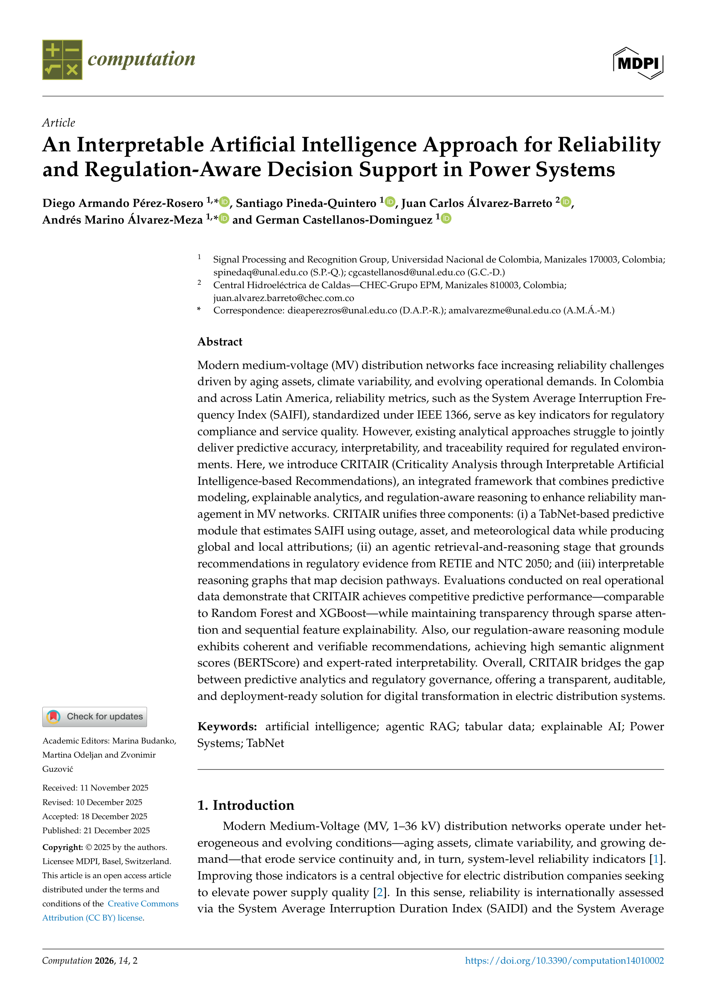

### Extraction assessment
- **Confidence:** 0.95 (meets the configured threshold).
- Machine-readable text was preserved with page-image provenance.

### Raw extracted text
```
Academic Editors: Marina Budanko,
Martina Odeljan and Zvonimir
Guzovi´c
Received: 11 November 2025
Revised: 10 December 2025
Accepted: 18 December 2025
Published: 21 December 2025
Copyright: © 2025 by the authors.
Licensee MDPI, Basel, Switzerland.
This article is an open access article
distributed under the terms and
conditions of the Creative Commons
Attribution (CC BY) license.
Article
An Interpretable Artificial Intelligence Approach for Reliability
and Regulation-Aware Decision Support in Power Systems
Diego Armando Pérez-Rosero 1,*
, Santiago Pineda-Quintero 1
, Juan Carlos Álvarez-Barreto 2
,
Andrés Marino Álvarez-Meza 1,*
and German Castellanos-Dominguez 1
1
Signal Processing and Recognition Group, Universidad Nacional de Colombia, Manizales 170003, Colombia;
spinedaq@unal.edu.co (S.P.-Q.); cgcastellanosd@unal.edu.co (G.C.-D.)
2
Central Hidroeléctrica de Caldas—CHEC-Grupo EPM, Manizales 810003, Colombia;
juan.alvarez.barreto@chec.com.co
*
Correspondence: dieaperezros@unal.edu.co (D.A.P.-R.); amalvarezme@unal.edu.co (A.M.Á.-M.)
Abstract
Modern medium-voltage (MV) distribution networks face increasing reliability challenges
driven by aging assets, climate variability, and evolving operational demands. In Colombia
and across Latin America, reliability metrics, such as the System Average Interruption Fre-
quency Index (SAIFI), standardized under IEEE 1366, serve as key indicators for regulatory
compliance and service quality. However, existing analytical approaches struggle to jointly
deliver predictive accuracy, interpretability, and traceability required for regulated environ-
ments. Here, we introduce CRITAIR (Criticality Analysis through Interpretable Artificial
Intelligence-based Recommendations), an integrated framework that combines predictive
modeling, explainable analytics, and regulation-aware reasoning to enhance reliability man-
agement in MV networks. CRITAIR unifies three components: (i) a TabNet-based predictive
module that estimates SAIFI using outage, asset, and meteorological data while producing
global and local attributions; (ii) an agentic retrieval-and-reasoning stage that grounds
recommendations in regulatory evidence from RETIE and NTC 2050; and (iii) interpretable
reasoning graphs that map decision pathways. Evaluations conducted on real operational
data demonstrate that CRITAIR achieves competitive predictive performance—comparable
to Random Forest and XGBoost—while maintaining transparency through sparse atten-
tion and sequential feature explainability. Also, our regulation-aware reasoning module
exhibits coherent and verifiable recommendations, achieving high semantic alignment
scores (BERTScore) and expert-rated interpretability. Overall, CRITAIR bridges the gap
between predictive analytics and regulatory governance, offering a transparent, auditable,
and deployment-ready solution for digital transformation in electric distribution systems.
Keywords: artificial intelligence; agentic RAG; tabular data; explainable AI; Power
Systems; TabNet
1. Introduction
Modern Medium-Voltage (MV, 1–36 kV) distribution networks operate under het-
erogeneous and evolving conditions—aging assets, climate variability, and growing de-
mand—that erode service continuity and, in turn, system-level reliability indicators [1].
Improving those indicators is a central objective for electric distribution companies seeking
to elevate power supply quality [2]. In this sense, reliability is internationally assessed
via the System Average Interruption Duration Index (SAIDI) and the System Average
Computation 2026, 14, 2
https://doi.org/10.3390/computation14010002

```

## Page 2
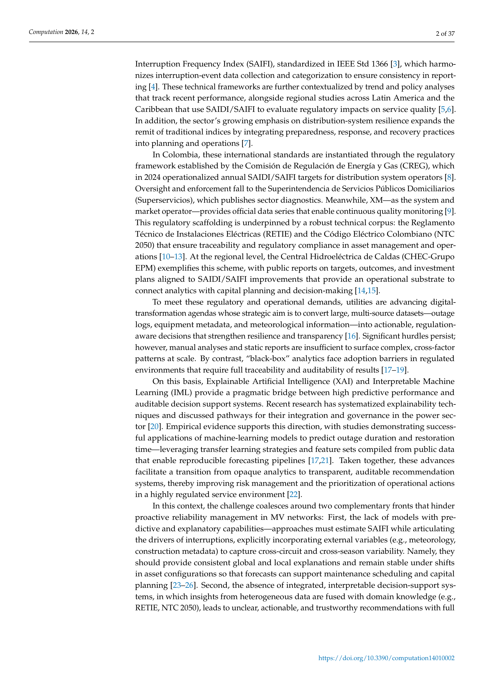

### Extraction assessment
- **Confidence:** 0.95 (meets the configured threshold).
- Machine-readable text was preserved with page-image provenance.

### Raw extracted text
```
Computation 2026, 14, 2
2 of 37
Interruption Frequency Index (SAIFI), standardized in IEEE Std 1366 [3], which harmo-
nizes interruption-event data collection and categorization to ensure consistency in report-
ing [4]. These technical frameworks are further contextualized by trend and policy analyses
that track recent performance, alongside regional studies across Latin America and the
Caribbean that use SAIDI/SAIFI to evaluate regulatory impacts on service quality [5,6].
In addition, the sector’s growing emphasis on distribution-system resilience expands the
remit of traditional indices by integrating preparedness, response, and recovery practices
into planning and operations [7].
In Colombia, these international standards are instantiated through the regulatory
framework established by the Comisión de Regulación de Energía y Gas (CREG), which
in 2024 operationalized annual SAIDI/SAIFI targets for distribution system operators [8].
Oversight and enforcement fall to the Superintendencia de Servicios Públicos Domiciliarios
(Superservicios), which publishes sector diagnostics. Meanwhile, XM—as the system and
market operator—provides official data series that enable continuous quality monitoring [9].
This regulatory scaffolding is underpinned by a robust technical corpus: the Reglamento
Técnico de Instalaciones Eléctricas (RETIE) and the Código Eléctrico Colombiano (NTC
2050) that ensure traceability and regulatory compliance in asset management and oper-
ations [10–13]. At the regional level, the Central Hidroeléctrica de Caldas (CHEC-Grupo
EPM) exemplifies this scheme, with public reports on targets, outcomes, and investment
plans aligned to SAIDI/SAIFI improvements that provide an operational substrate to
connect analytics with capital planning and decision-making [14,15].
To meet these regulatory and operational demands, utilities are advancing digital-
transformation agendas whose strategic aim is to convert large, multi-source datasets—outage
logs, equipment metadata, and meteorological information—into actionable, regulation-
aware decisions that strengthen resilience and transparency [16]. Significant hurdles persist;
however, manual analyses and static reports are insufficient to surface complex, cross-factor
patterns at scale. By contrast, “black-box” analytics face adoption barriers in regulated
environments that require full traceability and auditability of results [17–19].
On this basis, Explainable Artificial Intelligence (XAI) and Interpretable Machine
Learning (IML) provide a pragmatic bridge between high predictive performance and
auditable decision support systems. Recent research has systematized explainability tech-
niques and discussed pathways for their integration and governance in the power sec-
tor [20]. Empirical evidence supports this direction, with studies demonstrating success-
ful applications of machine-learning models to predict outage duration and restoration
time—leveraging transfer learning strategies and feature sets compiled from public data
that enable reproducible forecasting pipelines [17,21]. Taken together, these advances
facilitate a transition from opaque analytics to transparent, auditable recommendation
systems, thereby improving risk management and the prioritization of operational actions
in a highly regulated service environment [22].
In this context, the challenge coalesces around two complementary fronts that hinder
proactive reliability management in MV networks: First, the lack of models with pre-
dictive and explanatory capabilities—approaches must estimate SAIFI while articulating
the drivers of interruptions, explicitly incorporating external variables (e.g., meteorology,
construction metadata) to capture cross-circuit and cross-season variability. Namely, they
should provide consistent global and local explanations and remain stable under shifts
in asset configurations so that forecasts can support maintenance scheduling and capital
planning [23–26]. Second, the absence of integrated, interpretable decision-support sys-
tems, in which insights from heterogeneous data are fused with domain knowledge (e.g.,
RETIE, NTC 2050), leads to unclear, actionable, and trustworthy recommendations with full
https://doi.org/10.3390/computation14010002

```

## Page 3
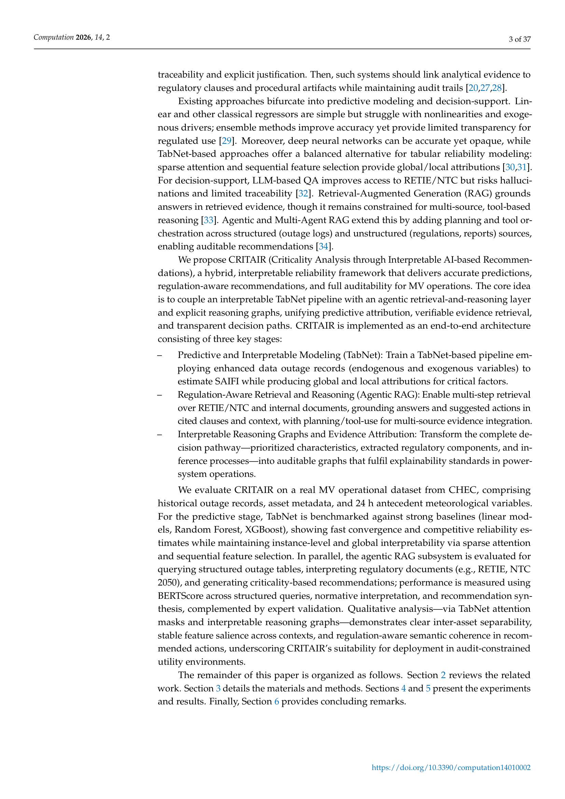

### Extraction assessment
- **Confidence:** 0.95 (meets the configured threshold).
- Machine-readable text was preserved with page-image provenance.

### Raw extracted text
```
Computation 2026, 14, 2
3 of 37
traceability and explicit justification. Then, such systems should link analytical evidence to
regulatory clauses and procedural artifacts while maintaining audit trails [20,27,28].
Existing approaches bifurcate into predictive modeling and decision-support. Lin-
ear and other classical regressors are simple but struggle with nonlinearities and exoge-
nous drivers; ensemble methods improve accuracy yet provide limited transparency for
regulated use [29]. Moreover, deep neural networks can be accurate yet opaque, while
TabNet-based approaches offer a balanced alternative for tabular reliability modeling:
sparse attention and sequential feature selection provide global/local attributions [30,31].
For decision-support, LLM-based QA improves access to RETIE/NTC but risks halluci-
nations and limited traceability [32]. Retrieval-Augmented Generation (RAG) grounds
answers in retrieved evidence, though it remains constrained for multi-source, tool-based
reasoning [33]. Agentic and Multi-Agent RAG extend this by adding planning and tool or-
chestration across structured (outage logs) and unstructured (regulations, reports) sources,
enabling auditable recommendations [34].
We propose CRITAIR (Criticality Analysis through Interpretable AI-based Recommen-
dations), a hybrid, interpretable reliability framework that delivers accurate predictions,
regulation-aware recommendations, and full auditability for MV operations. The core idea
is to couple an interpretable TabNet pipeline with an agentic retrieval-and-reasoning layer
and explicit reasoning graphs, unifying predictive attribution, verifiable evidence retrieval,
and transparent decision paths. CRITAIR is implemented as an end-to-end architecture
consisting of three key stages:
–
Predictive and Interpretable Modeling (TabNet): Train a TabNet-based pipeline em-
ploying enhanced data outage records (endogenous and exogenous variables) to
estimate SAIFI while producing global and local attributions for critical factors.
–
Regulation-Aware Retrieval and Reasoning (Agentic RAG): Enable multi-step retrieval
over RETIE/NTC and internal documents, grounding answers and suggested actions in
cited clauses and context, with planning/tool-use for multi-source evidence integration.
–
Interpretable Reasoning Graphs and Evidence Attribution: Transform the complete de-
cision pathway—prioritized characteristics, extracted regulatory components, and in-
ference processes—into auditable graphs that fulfil explainability standards in power-
system operations.
We evaluate CRITAIR on a real MV operational dataset from CHEC, comprising
historical outage records, asset metadata, and 24 h antecedent meteorological variables.
For the predictive stage, TabNet is benchmarked against strong baselines (linear mod-
els, Random Forest, XGBoost), showing fast convergence and competitive reliability es-
timates while maintaining instance-level and global interpretability via sparse attention
and sequential feature selection. In parallel, the agentic RAG subsystem is evaluated for
querying structured outage tables, interpreting regulatory documents (e.g., RETIE, NTC
2050), and generating criticality-based recommendations; performance is measured using
BERTScore across structured queries, normative interpretation, and recommendation syn-
thesis, complemented by expert validation. Qualitative analysis—via TabNet attention
masks and interpretable reasoning graphs—demonstrates clear inter-asset separability,
stable feature salience across contexts, and regulation-aware semantic coherence in recom-
mended actions, underscoring CRITAIR’s suitability for deployment in audit-constrained
utility environments.
The remainder of this paper is organized as follows. Section 2 reviews the related
work. Section 3 details the materials and methods. Sections 4 and 5 present the experiments
and results. Finally, Section 6 provides concluding remarks.
https://doi.org/10.3390/computation14010002

```

## Page 4
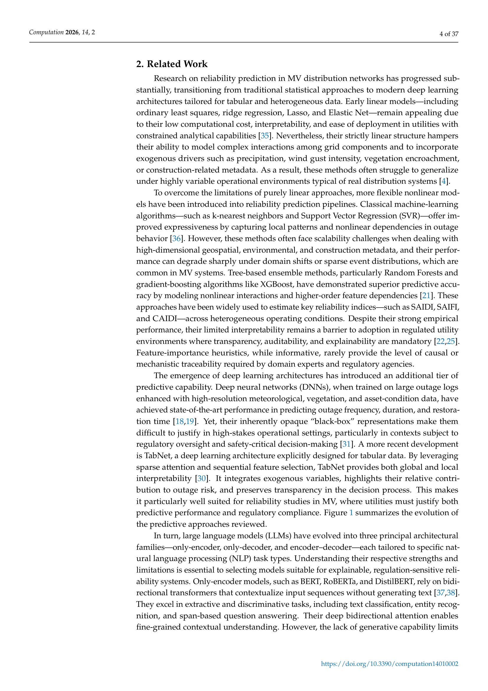

### Extraction assessment
- **Confidence:** 0.95 (meets the configured threshold).
- Machine-readable text was preserved with page-image provenance.

### Raw extracted text
```
Computation 2026, 14, 2
4 of 37
2. Related Work
Research on reliability prediction in MV distribution networks has progressed sub-
stantially, transitioning from traditional statistical approaches to modern deep learning
architectures tailored for tabular and heterogeneous data. Early linear models—including
ordinary least squares, ridge regression, Lasso, and Elastic Net—remain appealing due
to their low computational cost, interpretability, and ease of deployment in utilities with
constrained analytical capabilities [35]. Nevertheless, their strictly linear structure hampers
their ability to model complex interactions among grid components and to incorporate
exogenous drivers such as precipitation, wind gust intensity, vegetation encroachment,
or construction-related metadata. As a result, these methods often struggle to generalize
under highly variable operational environments typical of real distribution systems [4].
To overcome the limitations of purely linear approaches, more flexible nonlinear mod-
els have been introduced into reliability prediction pipelines. Classical machine-learning
algorithms—such as k-nearest neighbors and Support Vector Regression (SVR)—offer im-
proved expressiveness by capturing local patterns and nonlinear dependencies in outage
behavior [36]. However, these methods often face scalability challenges when dealing with
high-dimensional geospatial, environmental, and construction metadata, and their perfor-
mance can degrade sharply under domain shifts or sparse event distributions, which are
common in MV systems. Tree-based ensemble methods, particularly Random Forests and
gradient-boosting algorithms like XGBoost, have demonstrated superior predictive accu-
racy by modeling nonlinear interactions and higher-order feature dependencies [21]. These
approaches have been widely used to estimate key reliability indices—such as SAIDI, SAIFI,
and CAIDI—across heterogeneous operating conditions. Despite their strong empirical
performance, their limited interpretability remains a barrier to adoption in regulated utility
environments where transparency, auditability, and explainability are mandatory [22,25].
Feature-importance heuristics, while informative, rarely provide the level of causal or
mechanistic traceability required by domain experts and regulatory agencies.
The emergence of deep learning architectures has introduced an additional tier of
predictive capability. Deep neural networks (DNNs), when trained on large outage logs
enhanced with high-resolution meteorological, vegetation, and asset-condition data, have
achieved state-of-the-art performance in predicting outage frequency, duration, and restora-
tion time [18,19]. Yet, their inherently opaque “black-box” representations make them
difficult to justify in high-stakes operational settings, particularly in contexts subject to
regulatory oversight and safety-critical decision-making [31]. A more recent development
is TabNet, a deep learning architecture explicitly designed for tabular data. By leveraging
sparse attention and sequential feature selection, TabNet provides both global and local
interpretability [30]. It integrates exogenous variables, highlights their relative contri-
bution to outage risk, and preserves transparency in the decision process. This makes
it particularly well suited for reliability studies in MV, where utilities must justify both
predictive performance and regulatory compliance. Figure 1 summarizes the evolution of
the predictive approaches reviewed.
In turn, large language models (LLMs) have evolved into three principal architectural
families—only-encoder, only-decoder, and encoder–decoder—each tailored to specific nat-
ural language processing (NLP) task types. Understanding their respective strengths and
limitations is essential to selecting models suitable for explainable, regulation-sensitive reli-
ability systems. Only-encoder models, such as BERT, RoBERTa, and DistilBERT, rely on bidi-
rectional transformers that contextualize input sequences without generating text [37,38].
They excel in extractive and discriminative tasks, including text classification, entity recog-
nition, and span-based question answering. Their deep bidirectional attention enables
fine-grained contextual understanding. However, the lack of generative capability limits
https://doi.org/10.3390/computation14010002

```

## Page 5
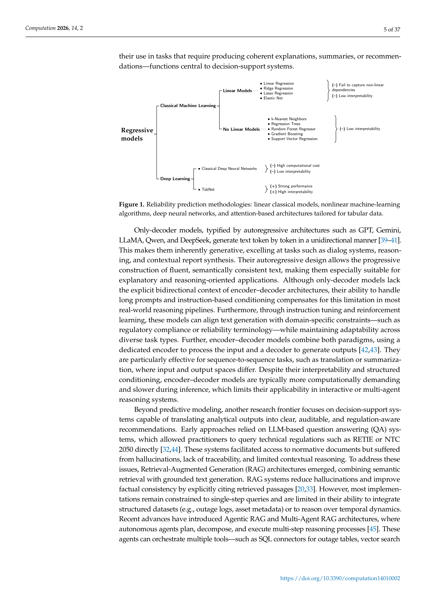

### Extraction assessment
- **Confidence:** 0.95 (meets the configured threshold).
- Machine-readable text was preserved with page-image provenance.

### Raw extracted text
```
Computation 2026, 14, 2
5 of 37
their use in tasks that require producing coherent explanations, summaries, or recommen-
dations—functions central to decision-support systems.
Regressive
models
Classical Machine Learning
Deep Learning
Linear Models
No Linear Models
• Linear Regression
• Ridge Regression
• Lasso Regression
• Elastic Net
• k-Nearest Neighbors
• Regression Trees
• Random Forest Regressor
• Gradient Boosting
• Support Vector Regression
• Classical Deep Neural Networks
• TabNet
(–) Fail to capture non-linear
dependencies
(–) Low interpretability
(–) Low interpretability
(–) High computational cost
(–) Low interpretability
(+) Strong performance
(+) High interpretability
Figure 1. Reliability prediction methodologies: linear classical models, nonlinear machine-learning
algorithms, deep neural networks, and attention-based architectures tailored for tabular data.
Only-decoder models, typified by autoregressive architectures such as GPT, Gemini,
LLaMA, Qwen, and DeepSeek, generate text token by token in a unidirectional manner [39–41].
This makes them inherently generative, excelling at tasks such as dialog systems, reason-
ing, and contextual report synthesis. Their autoregressive design allows the progressive
construction of fluent, semantically consistent text, making them especially suitable for
explanatory and reasoning-oriented applications. Although only-decoder models lack
the explicit bidirectional context of encoder–decoder architectures, their ability to handle
long prompts and instruction-based conditioning compensates for this limitation in most
real-world reasoning pipelines. Furthermore, through instruction tuning and reinforcement
learning, these models can align text generation with domain-specific constraints—such as
regulatory compliance or reliability terminology—while maintaining adaptability across
diverse task types. Further, encoder–decoder models combine both paradigms, using a
dedicated encoder to process the input and a decoder to generate outputs [42,43]. They
are particularly effective for sequence-to-sequence tasks, such as translation or summariza-
tion, where input and output spaces differ. Despite their interpretability and structured
conditioning, encoder–decoder models are typically more computationally demanding
and slower during inference, which limits their applicability in interactive or multi-agent
reasoning systems.
Beyond predictive modeling, another research frontier focuses on decision-support sys-
tems capable of translating analytical outputs into clear, auditable, and regulation-aware
recommendations. Early approaches relied on LLM-based question answering (QA) sys-
tems, which allowed practitioners to query technical regulations such as RETIE or NTC
2050 directly [32,44]. These systems facilitated access to normative documents but suffered
from hallucinations, lack of traceability, and limited contextual reasoning. To address these
issues, Retrieval-Augmented Generation (RAG) architectures emerged, combining semantic
retrieval with grounded text generation. RAG systems reduce hallucinations and improve
factual consistency by explicitly citing retrieved passages [20,33]. However, most implemen-
tations remain constrained to single-step queries and are limited in their ability to integrate
structured datasets (e.g., outage logs, asset metadata) or to reason over temporal dynamics.
Recent advances have introduced Agentic RAG and Multi-Agent RAG architectures, where
autonomous agents plan, decompose, and execute multi-step reasoning processes [45]. These
agents can orchestrate multiple tools—such as SQL connectors for outage tables, vector search
https://doi.org/10.3390/computation14010002

```

### Textual figure-caption evidence
- Figure 1. Reliability prediction methodologies: linear classical models, nonlinear machine-learning
- Captions are page-level text evidence and are not associated with embedded images.

## Page 6
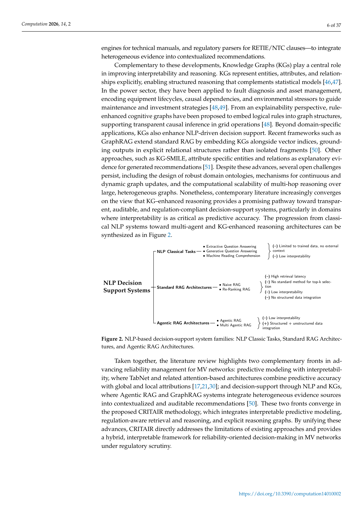

### Extraction assessment
- **Confidence:** 0.95 (meets the configured threshold).
- Machine-readable text was preserved with page-image provenance.

### Raw extracted text
```
Computation 2026, 14, 2
6 of 37
engines for technical manuals, and regulatory parsers for RETIE/NTC clauses—to integrate
heterogeneous evidence into contextualized recommendations.
Complementary to these developments, Knowledge Graphs (KGs) play a central role
in improving interpretability and reasoning. KGs represent entities, attributes, and relation-
ships explicitly, enabling structured reasoning that complements statistical models [46,47].
In the power sector, they have been applied to fault diagnosis and asset management,
encoding equipment lifecycles, causal dependencies, and environmental stressors to guide
maintenance and investment strategies [48,49]. From an explainability perspective, rule-
enhanced cognitive graphs have been proposed to embed logical rules into graph structures,
supporting transparent causal inference in grid operations [48]. Beyond domain-specific
applications, KGs also enhance NLP-driven decision support. Recent frameworks such as
GraphRAG extend standard RAG by embedding KGs alongside vector indices, ground-
ing outputs in explicit relational structures rather than isolated fragments [50]. Other
approaches, such as KG-SMILE, attribute specific entities and relations as explanatory evi-
dence for generated recommendations [51]. Despite these advances, several open challenges
persist, including the design of robust domain ontologies, mechanisms for continuous and
dynamic graph updates, and the computational scalability of multi-hop reasoning over
large, heterogeneous graphs. Nonetheless, contemporary literature increasingly converges
on the view that KG–enhanced reasoning provides a promising pathway toward transpar-
ent, auditable, and regulation-compliant decision-support systems, particularly in domains
where interpretability is as critical as predictive accuracy. The progression from classi-
cal NLP systems toward multi-agent and KG-enhanced reasoning architectures can be
synthesized as in Figure 2.
NLP Decision
Support Systems
NLP Classical Tasks
Standard RAG Architectures
Agentic RAG Architectures
• Extractive Question Answering
• Generative Question Answering
• Machine Reading Comprehension
• Naive RAG
• Re-Ranking RAG
• Agentic RAG
• Multi Agentic RAG
(–) Limited to trained data, no external
context
(–) Low interpretability
(–) High retrieval latency
(–) No standard method for top-k selec-
tion
(–) Low interpretability
(–) No structured data integration
(–) Low interpretability
(+) Structured + unstructured data
integration
Figure 2. NLP-based decision-support system families: NLP Classic Tasks, Standard RAG Architec-
tures, and Agentic RAG Architectures.
Taken together, the literature review highlights two complementary fronts in ad-
vancing reliability management for MV networks: predictive modeling with interpretabil-
ity, where TabNet and related attention-based architectures combine predictive accuracy
with global and local attributions [17,21,30]; and decision-support through NLP and KGs,
where Agentic RAG and GraphRAG systems integrate heterogeneous evidence sources
into contextualized and auditable recommendations [50]. These two fronts converge in
the proposed CRITAIR methodology, which integrates interpretable predictive modeling,
regulation-aware retrieval and reasoning, and explicit reasoning graphs. By unifying these
advances, CRITAIR directly addresses the limitations of existing approaches and provides
a hybrid, interpretable framework for reliability-oriented decision-making in MV networks
under regulatory scrutiny.
https://doi.org/10.3390/computation14010002

```

### Textual figure-caption evidence
- Figure 2. NLP-based decision-support system families: NLP Classic Tasks, Standard RAG Architec-
- Captions are page-level text evidence and are not associated with embedded images.

## Page 7
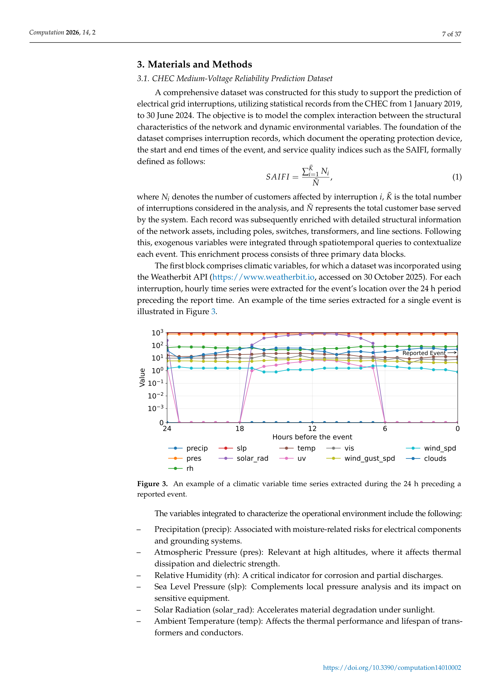

### Extraction assessment
- **Confidence:** 0.65 (below the configured 0.85 threshold; human review required).
- One or more equation candidates are ambiguous in raw extraction.

### Raw extracted text
```
Computation 2026, 14, 2
7 of 37
3. Materials and Methods
3.1. CHEC Medium-Voltage Reliability Prediction Dataset
A comprehensive dataset was constructed for this study to support the prediction of
electrical grid interruptions, utilizing statistical records from the CHEC from 1 January 2019,
to 30 June 2024. The objective is to model the complex interaction between the structural
characteristics of the network and dynamic environmental variables. The foundation of the
dataset comprises interruption records, which document the operating protection device,
the start and end times of the event, and service quality indices such as the SAIFI, formally
defined as follows:
SAIFI = ∑
˜K
i=1 Ni
˜N
,
(1)
where Ni denotes the number of customers affected by interruption i, ˜K is the total number
of interruptions considered in the analysis, and ˜N represents the total customer base served
by the system. Each record was subsequently enriched with detailed structural information
of the network assets, including poles, switches, transformers, and line sections. Following
this, exogenous variables were integrated through spatiotemporal queries to contextualize
each event. This enrichment process consists of three primary data blocks.
The first block comprises climatic variables, for which a dataset was incorporated using
the Weatherbit API (https://www.weatherbit.io, accessed on 30 October 2025). For each
interruption, hourly time series were extracted for the event’s location over the 24 h period
preceding the report time. An example of the time series extracted for a single event is
illustrated in Figure 3.
24
18
12
6
0
Hours before the event
0
10
3
10
2
10
1
100
101
102
103
Value
Reported Event
precip
pres
rh
slp
solar_rad
temp
uv
vis
wind_gust_spd
wind_spd
clouds
Figure 3. An example of a climatic variable time series extracted during the 24 h preceding a
reported event.
The variables integrated to characterize the operational environment include the following:
–
Precipitation (precip): Associated with moisture-related risks for electrical components
and grounding systems.
–
Atmospheric Pressure (pres): Relevant at high altitudes, where it affects thermal
dissipation and dielectric strength.
–
Relative Humidity (rh): A critical indicator for corrosion and partial discharges.
–
Sea Level Pressure (slp): Complements local pressure analysis and its impact on
sensitive equipment.
–
Solar Radiation (solar_rad): Accelerates material degradation under sunlight.
–
Ambient Temperature (temp): Affects the thermal performance and lifespan of trans-
formers and conductors.
https://doi.org/10.3390/computation14010002

```

### Textual figure-caption evidence
- Figure 3. An example of a climatic variable time series extracted during the 24 h preceding a
- Captions are page-level text evidence and are not associated with embedded images.

### Equation candidates
- `page-007-equation-001` — raw_text_preserved (confidence 0.98; page 7).
```
SAIFI = ∑
```
- `page-007-equation-002` — raw_text_preserved (confidence 0.98; page 7).
```
i=1 Ni
```
- `page-007-equation-003` — review_required (confidence 0.45; page 7).
```
solar_rad
```
- `page-007-equation-004` — review_required (confidence 0.45; page 7).
```
wind_gust_spd
```
- `page-007-equation-005` — review_required (confidence 0.45; page 7).
```
wind_spd
```
- `page-007-equation-006` — review_required (confidence 0.45; page 7).
```
Solar Radiation (solar_rad): Accelerates material degradation under sunlight.
```

## Page 8
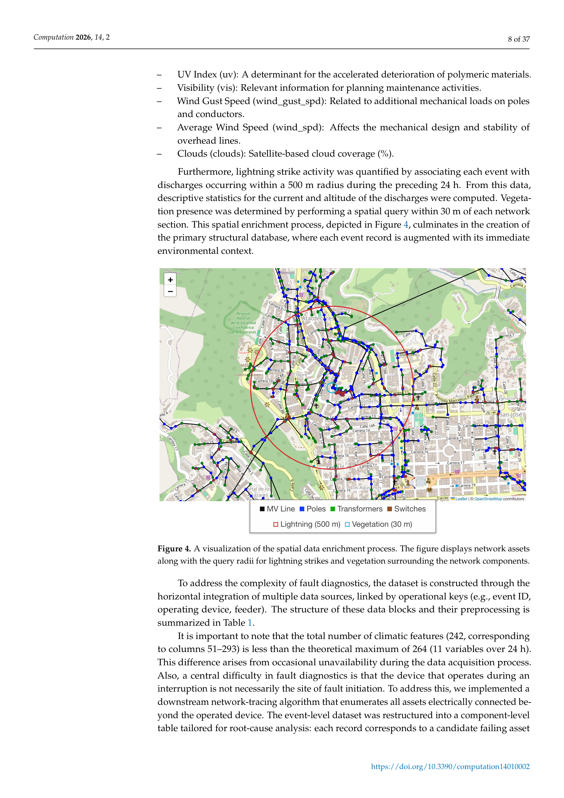

### Extraction assessment
- **Confidence:** 0.65 (below the configured 0.85 threshold; human review required).
- One or more equation candidates are ambiguous in raw extraction. Embedded images require visual review; captions remain page-level text evidence only.

### Raw extracted text
```
Computation 2026, 14, 2
8 of 37
–
UV Index (uv): A determinant for the accelerated deterioration of polymeric materials.
–
Visibility (vis): Relevant information for planning maintenance activities.
–
Wind Gust Speed (wind_gust_spd): Related to additional mechanical loads on poles
and conductors.
–
Average Wind Speed (wind_spd): Affects the mechanical design and stability of
overhead lines.
–
Clouds (clouds): Satellite-based cloud coverage (%).
Furthermore, lightning strike activity was quantified by associating each event with
discharges occurring within a 500 m radius during the preceding 24 h. From this data,
descriptive statistics for the current and altitude of the discharges were computed. Vegeta-
tion presence was determined by performing a spatial query within 30 m of each network
section. This spatial enrichment process, depicted in Figure 4, culminates in the creation of
the primary structural database, where each event record is augmented with its immediate
environmental context.
+
−
 Leaflet | © OpenStreetMap contributors
MV Line
Poles
Transformers
Switches
Lightning (500 m)
Vegetation (30 m)
Figure 4. A visualization of the spatial data enrichment process. The figure displays network assets
along with the query radii for lightning strikes and vegetation surrounding the network components.
To address the complexity of fault diagnostics, the dataset is constructed through the
horizontal integration of multiple data sources, linked by operational keys (e.g., event ID,
operating device, feeder). The structure of these data blocks and their preprocessing is
summarized in Table 1.
It is important to note that the total number of climatic features (242, corresponding
to columns 51–293) is less than the theoretical maximum of 264 (11 variables over 24 h).
This difference arises from occasional unavailability during the data acquisition process.
Also, a central difficulty in fault diagnostics is that the device that operates during an
interruption is not necessarily the site of fault initiation. To address this, we implemented a
downstream network-tracing algorithm that enumerates all assets electrically connected be-
yond the operated device. The event-level dataset was restructured into a component-level
table tailored for root-cause analysis: each record corresponds to a candidate failing asset
https://doi.org/10.3390/computation14010002

```

### Textual figure-caption evidence
- Figure 4. A visualization of the spatial data enrichment process. The figure displays network assets
- Captions are page-level text evidence and are not associated with embedded images.

### Equation candidates
- `page-008-equation-001` — review_required (confidence 0.45; page 8).
```
Wind Gust Speed (wind_gust_spd): Related to additional mechanical loads on poles
```
- `page-008-equation-002` — review_required (confidence 0.45; page 8).
```
Average Wind Speed (wind_spd): Affects the mechanical design and stability of
```

### Embedded images
- `page-008-image-001` — embedded image metadata: 256 × 256 px, xref 401; visual review required.
- `page-008-image-002` — embedded image metadata: 256 × 256 px, xref 402; visual review required.
- `page-008-image-003` — embedded image metadata: 256 × 256 px, xref 403; visual review required.
- `page-008-image-004` — embedded image metadata: 256 × 256 px, xref 404; visual review required.
- `page-008-image-005` — embedded image metadata: 256 × 256 px, xref 405; visual review required.
- `page-008-image-006` — embedded image metadata: 256 × 256 px, xref 406; visual review required.
- `page-008-image-007` — embedded image metadata: 256 × 256 px, xref 407; visual review required.
- `page-008-image-008` — embedded image metadata: 256 × 256 px, xref 408; visual review required.
- `page-008-image-009` — embedded image metadata: 256 × 256 px, xref 409; visual review required.
- `page-008-image-010` — embedded image metadata: 256 × 256 px, xref 410; visual review required.
- `page-008-image-011` — embedded image metadata: 256 × 256 px, xref 412; visual review required.
- `page-008-image-012` — embedded image metadata: 256 × 256 px, xref 413; visual review required.
- `page-008-image-013` — embedded image metadata: 256 × 256 px, xref 414; visual review required.
- `page-008-image-014` — embedded image metadata: 256 × 256 px, xref 415; visual review required.
- `page-008-image-015` — embedded image metadata: 256 × 256 px, xref 416; visual review required.
- `page-008-image-016` — embedded image metadata: 256 × 256 px, xref 417; visual review required.
- `page-008-image-017` — embedded image metadata: 256 × 256 px, xref 418; visual review required.
- `page-008-image-018` — embedded image metadata: 256 × 256 px, xref 419; visual review required.
- `page-008-image-019` — embedded image metadata: 256 × 256 px, xref 420; visual review required.
- `page-008-image-020` — embedded image metadata: 256 × 256 px, xref 421; visual review required.
- `page-008-image-021` — embedded image metadata: 392 × 77 px, xref 440; visual review required.

## Page 9
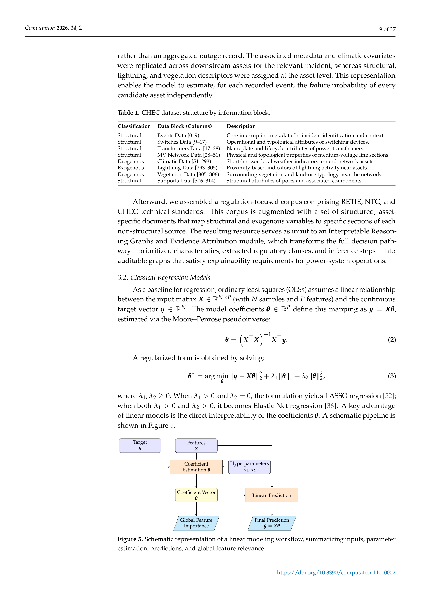

### Extraction assessment
- **Confidence:** 0.65 (below the configured 0.85 threshold; human review required).
- One or more equation candidates are ambiguous in raw extraction.

### Raw extracted text
```
Computation 2026, 14, 2
9 of 37
rather than an aggregated outage record. The associated metadata and climatic covariates
were replicated across downstream assets for the relevant incident, whereas structural,
lightning, and vegetation descriptors were assigned at the asset level. This representation
enables the model to estimate, for each recorded event, the failure probability of every
candidate asset independently.
Table 1. CHEC dataset structure by information block.
Classification
Data Block (Columns)
Description
Structural
Events Data [0–9)
Core interruption metadata for incident identification and context.
Structural
Switches Data [9–17)
Operational and typological attributes of switching devices.
Structural
Transformers Data [17–28)
Nameplate and lifecycle attributes of power transformers.
Structural
MV Network Data [28–51)
Physical and topological properties of medium-voltage line sections.
Exogenous
Climatic Data [51–293)
Short-horizon local weather indicators around network assets.
Exogenous
Lightning Data [293–305)
Proximity-based indicators of lightning activity near assets.
Exogenous
Vegetation Data [305–306)
Surrounding vegetation and land-use typology near the network.
Structural
Supports Data [306–314)
Structural attributes of poles and associated components.
Afterward, we assembled a regulation-focused corpus comprising RETIE, NTC, and
CHEC technical standards. This corpus is augmented with a set of structured, asset-
specific documents that map structural and exogenous variables to specific sections of each
non-structural source. The resulting resource serves as input to an Interpretable Reason-
ing Graphs and Evidence Attribution module, which transforms the full decision path-
way—prioritized characteristics, extracted regulatory clauses, and inference steps—into
auditable graphs that satisfy explainability requirements for power-system operations.
3.2. Classical Regression Models
As a baseline for regression, ordinary least squares (OLSs) assumes a linear relationship
between the input matrix X ∈RN×P (with N samples and P features) and the continuous
target vector y ∈RN. The model coefficients θ ∈RP define this mapping as y = Xθ,
estimated via the Moore–Penrose pseudoinverse:
θ =

X⊤X
−1
X⊤y.
(2)
A regularized form is obtained by solving:
θ∗= arg min
θ
∥y −Xθ∥2
2 + λ1∥θ∥1 + λ2∥θ∥2
2,
(3)
where λ1, λ2 ≥0. When λ1 > 0 and λ2 = 0, the formulation yields LASSO regression [52];
when both λ1 > 0 and λ2 > 0, it becomes Elastic Net regression [36]. A key advantage
of linear models is the direct interpretability of the coefficients θ. A schematic pipeline is
shown in Figure 5.
Features
X
Target
y
Coefficient
Estimation θ
Hyperparameters
λ1, λ2
Coefficient Vector
θ
Linear Prediction
Final Prediction
ˆy = Xθ
Global Feature
Importance
Figure 5. Schematic representation of a linear modeling workflow, summarizing inputs, parameter
estimation, predictions, and global feature relevance.
https://doi.org/10.3390/computation14010002

```

### Textual figure-caption evidence
- Figure 5. Schematic representation of a linear modeling workflow, summarizing inputs, parameter
- Captions are page-level text evidence and are not associated with embedded images.

### Equation candidates
- `page-009-equation-001` — review_required (confidence 0.45; page 9).
```
between the input matrix X ∈RN×P (with N samples and P features) and the continuous
```
- `page-009-equation-002` — review_required (confidence 0.45; page 9).
```
target vector y ∈RN. The model coefficients θ ∈RP define this mapping as y = Xθ,
```
- `page-009-equation-003` — review_required (confidence 0.45; page 9).
```
θ =
```
- `page-009-equation-004` — review_required (confidence 0.45; page 9).
```
θ∗= arg min
```
- `page-009-equation-005` — review_required (confidence 0.45; page 9).
```
where λ1, λ2 ≥0. When λ1 > 0 and λ2 = 0, the formulation yields LASSO regression [52];
```
- `page-009-equation-006` — review_required (confidence 0.45; page 9).
```
ˆy = Xθ
```

## Page 10
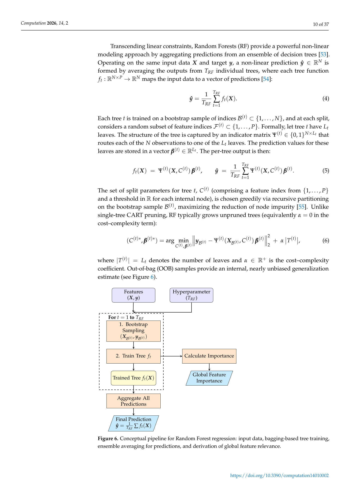

### Extraction assessment
- **Confidence:** 0.65 (below the configured 0.85 threshold; human review required).
- One or more equation candidates are ambiguous in raw extraction.

### Raw extracted text
```
Computation 2026, 14, 2
10 of 37
Transcending linear constraints, Random Forests (RF) provide a powerful non-linear
modeling approach by aggregating predictions from an ensemble of decision trees [53].
Operating on the same input data X and target y, a non-linear prediction ˆy ∈RN is
formed by averaging the outputs from TRF individual trees, where each tree function
ft : RN×P →RN maps the input data to a vector of predictions [54]:
ˆy =
1
TRF
TRF
∑
t=1
ft(X).
(4)
Each tree t is trained on a bootstrap sample of indices B(t) ⊂{1, . . . , N}, and at each split,
considers a random subset of feature indices F (t) ⊂{1, . . . , P}. Formally, let tree t have Lt
leaves. The structure of the tree is captured by an indicator matrix Ψ(t) ∈{0, 1}N×Lt that
routes each of the N observations to one of the Lt leaves. The prediction values for these
leaves are stored in a vector β(t) ∈RLt. The per-tree output is then:
ft(X) = Ψ(t)(X, C(t)) β(t),
ˆy =
1
TRF
TRF
∑
t=1
Ψ(t)(X, C(t)) β(t).
(5)
The set of split parameters for tree t, C(t) (comprising a feature index from {1, . . . , P}
and a threshold in R for each internal node), is chosen greedily via recursive partitioning
on the bootstrap sample B(t), maximizing the reduction of node impurity [55]. Unlike
single-tree CART pruning, RF typically grows unpruned trees (equivalently α = 0 in the
cost–complexity term):
(C(t)∗, β(t)∗) = arg min
C(t), β(t)



yB(t) −Ψ(t)(XB(t), C(t)) β(t)

2
2 + α
T(t),
(6)
where |T(t)| = Lt denotes the number of leaves and α ∈R+ is the cost–complexity
coefficient. Out-of-bag (OOB) samples provide an internal, nearly unbiased generalization
estimate (see Figure 6).
Features
(X, y)
Hyperparameter
(TRF)
1. Bootstrap
Sampling
(XB(t), yB(t))
2. Train Tree ft
Calculate Importance
Trained Tree ft(X)
For t = 1 to TRF
Aggregate All
Predictions
Final Prediction
ˆy =
1
TRF ∑ft(X)
Global Feature
Importance
Figure 6. Conceptual pipeline for Random Forest regression: input data, bagging-based tree training,
ensemble averaging for predictions, and derivation of global feature relevance.
https://doi.org/10.3390/computation14010002

```

### Textual figure-caption evidence
- Figure 6. Conceptual pipeline for Random Forest regression: input data, bagging-based tree training,
- Captions are page-level text evidence and are not associated with embedded images.

### Equation candidates
- `page-010-equation-001` — review_required (confidence 0.45; page 10).
```
Operating on the same input data X and target y, a non-linear prediction ˆy ∈RN is
```
- `page-010-equation-002` — review_required (confidence 0.45; page 10).
```
ft : RN×P →RN maps the input data to a vector of predictions [54]:
```
- `page-010-equation-003` — review_required (confidence 0.45; page 10).
```
ˆy =
```
- `page-010-equation-004` — review_required (confidence 0.45; page 10).
```
∑
```
- `page-010-equation-005` — raw_text_preserved (confidence 0.98; page 10).
```
t=1
```
- `page-010-equation-006` — review_required (confidence 0.45; page 10).
```
leaves. The structure of the tree is captured by an indicator matrix Ψ(t) ∈{0, 1}N×Lt that
```
- `page-010-equation-007` — review_required (confidence 0.45; page 10).
```
leaves are stored in a vector β(t) ∈RLt. The per-tree output is then:
```
- `page-010-equation-008` — review_required (confidence 0.45; page 10).
```
ft(X) = Ψ(t)(X, C(t)) β(t),
```
- `page-010-equation-009` — review_required (confidence 0.45; page 10).
```
ˆy =
```
- `page-010-equation-010` — review_required (confidence 0.45; page 10).
```
∑
```
- `page-010-equation-011` — raw_text_preserved (confidence 0.98; page 10).
```
t=1
```
- `page-010-equation-012` — review_required (confidence 0.45; page 10).
```
single-tree CART pruning, RF typically grows unpruned trees (equivalently α = 0 in the
```
- `page-010-equation-013` — review_required (confidence 0.45; page 10).
```
(C(t)∗, β(t)∗) = arg min
```
- `page-010-equation-014` — review_required (confidence 0.45; page 10).
```
where |T(t)| = Lt denotes the number of leaves and α ∈R+ is the cost–complexity
```
- `page-010-equation-015` — review_required (confidence 0.45; page 10).
```
For t = 1 to TRF
```
- `page-010-equation-016` — review_required (confidence 0.45; page 10).
```
ˆy =
```
- `page-010-equation-017` — review_required (confidence 0.45; page 10).
```
TRF ∑ft(X)
```

## Page 11
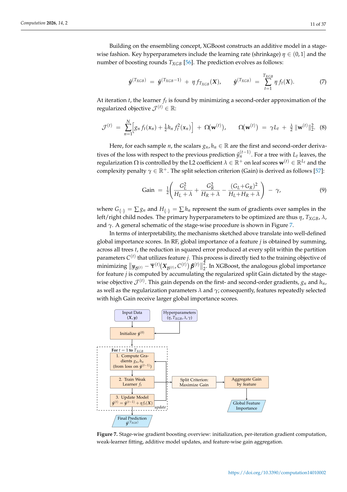

### Extraction assessment
- **Confidence:** 0.65 (below the configured 0.85 threshold; human review required).
- One or more equation candidates are ambiguous in raw extraction.

### Raw extracted text
```
Computation 2026, 14, 2
11 of 37
Building on the ensembling concept, XGBoost constructs an additive model in a stage-
wise fashion. Key hyperparameters include the learning rate (shrinkage) η ∈(0, 1] and the
number of boosting rounds TXGB [56]. The prediction evolves as follows:
ˆy(TXGB) = ˆy(TXGB−1) + η fTXGB(X),
ˆy(TXGB) =
TXGB
∑
t=1
η ft(X).
(7)
At iteration t, the learner ft is found by minimizing a second-order approximation of the
regularized objective J (t) ∈R:
J (t) =
N
∑
n=1
h
gn ft(xn) + 1
2hn f 2
t (xn)
i
+ Ω
w(t)
,
Ω
w(t) = γLt +
λ
2 ∥w(t)∥2
2. (8)
Here, for each sample n, the scalars gn, hn ∈R are the first and second-order deriva-
tives of the loss with respect to the previous prediction ˆy(t−1)
n
. For a tree with Lt leaves, the
regularization Ωis controlled by the L2 coefficient λ ∈R+ on leaf scores w(t) ∈RLt and the
complexity penalty γ ∈R+. The split selection criterion (Gain) is derived as follows [57]:
Gain =
1
2
 
G2
L
HL + λ +
G2
R
HR + λ −(GL+GR)2
HL+HR + λ
!
−γ,
(9)
where G{·} = ∑gn and H{·} = ∑hn represent the sum of gradients over samples in the
left/right child nodes. The primary hyperparameters to be optimized are thus η, TXGB, λ,
and γ. A general schematic of the stage-wise procedure is shown in Figure 7.
In terms of interpretability, the mechanisms sketched above translate into well-defined
global importance scores. In RF, global importance of a feature j is obtained by summing,
across all trees t, the reduction in squared error produced at every split within the partition
parameters C(t) that utilizes feature j. This process is directly tied to the training objective of
minimizing


yB(t) −Ψ(t)XB(t), C(t)
β(t)

2
2. In XGBoost, the analogous global importance
for feature j is computed by accumulating the regularized split Gain dictated by the stage-
wise objective J (t). This gain depends on the first- and second-order gradients, gn and hn,
as well as the regularization parameters λ and γ; consequently, features repeatedly selected
with high Gain receive larger global importance scores.
Input Data
(X, y)
Hyperparameters
(η, TXGB, λ, γ)
Initialize ˆy(0)
1. Compute Gra-
dients gn, hn
(from loss on ˆy(t−1))
2. Train Weak
Learner ft
Split Criterion:
Maximize Gain
3. Update Model
ˆy(t) = ˆy(t−1) + η ft(X)
Aggregate Gain
by feature
For t = 1 to TXGB
Final Prediction
ˆy(TXGB)
Global Feature
Importance
update
Figure 7. Stage-wise gradient boosting overview: initialization, per-iteration gradient computation,
weak-learner fitting, additive model updates, and feature-wise gain aggregation.
https://doi.org/10.3390/computation14010002

```

### Textual figure-caption evidence
- Figure 7. Stage-wise gradient boosting overview: initialization, per-iteration gradient computation,
- Captions are page-level text evidence and are not associated with embedded images.

### Equation candidates
- `page-011-equation-001` — review_required (confidence 0.45; page 11).
```
wise fashion. Key hyperparameters include the learning rate (shrinkage) η ∈(0, 1] and the
```
- `page-011-equation-002` — review_required (confidence 0.45; page 11).
```
ˆy(TXGB) = ˆy(TXGB−1) + η fTXGB(X),
```
- `page-011-equation-003` — review_required (confidence 0.45; page 11).
```
ˆy(TXGB) =
```
- `page-011-equation-004` — review_required (confidence 0.45; page 11).
```
∑
```
- `page-011-equation-005` — raw_text_preserved (confidence 0.98; page 11).
```
t=1
```
- `page-011-equation-006` — review_required (confidence 0.45; page 11).
```
regularized objective J (t) ∈R:
```
- `page-011-equation-007` — review_required (confidence 0.45; page 11).
```
J (t) =
```
- `page-011-equation-008` — review_required (confidence 0.45; page 11).
```
∑
```
- `page-011-equation-009` — raw_text_preserved (confidence 0.98; page 11).
```
n=1
```
- `page-011-equation-010` — review_required (confidence 0.45; page 11).
```
w(t) = γLt +
```
- `page-011-equation-011` — review_required (confidence 0.45; page 11).
```
Here, for each sample n, the scalars gn, hn ∈R are the first and second-order deriva-
```
- `page-011-equation-012` — review_required (confidence 0.45; page 11).
```
regularization Ωis controlled by the L2 coefficient λ ∈R+ on leaf scores w(t) ∈RLt and the
```
- `page-011-equation-013` — review_required (confidence 0.45; page 11).
```
complexity penalty γ ∈R+. The split selection criterion (Gain) is derived as follows [57]:
```
- `page-011-equation-014` — review_required (confidence 0.45; page 11).
```
Gain =
```
- `page-011-equation-015` — review_required (confidence 0.45; page 11).
```
where G{·} = ∑gn and H{·} = ∑hn represent the sum of gradients over samples in the
```
- `page-011-equation-016` — review_required (confidence 0.45; page 11).
```
ˆy(t) = ˆy(t−1) + η ft(X)
```
- `page-011-equation-017` — review_required (confidence 0.45; page 11).
```
For t = 1 to TXGB
```

## Page 12
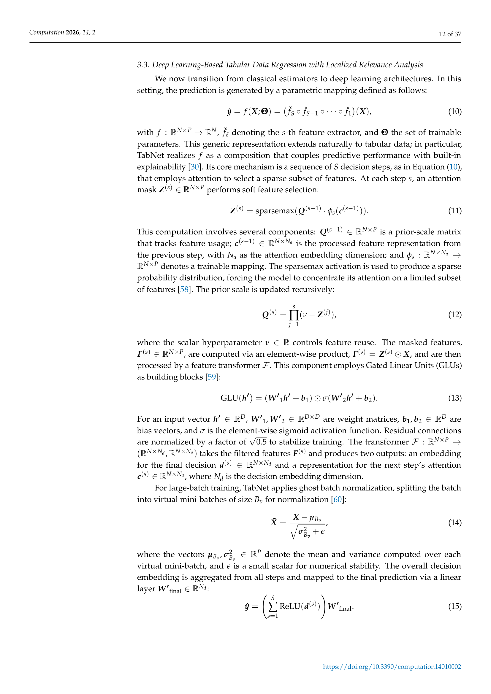

### Extraction assessment
- **Confidence:** 0.65 (below the configured 0.85 threshold; human review required).
- One or more equation candidates are ambiguous in raw extraction.

### Raw extracted text
```
Computation 2026, 14, 2
12 of 37
3.3. Deep Learning-Based Tabular Data Regression with Localized Relevance Analysis
We now transition from classical estimators to deep learning architectures. In this
setting, the prediction is generated by a parametric mapping defined as follows:
ˆy = f (X;Θ) =
 ˘fS ◦˘fS−1 ◦· · · ◦˘f1
(X),
(10)
with f : RN×P →RN, ˘fℓdenoting the s-th feature extractor, and Θ the set of trainable
parameters. This generic representation extends naturally to tabular data; in particular,
TabNet realizes f as a composition that couples predictive performance with built-in
explainability [30]. Its core mechanism is a sequence of S decision steps, as in Equation (10),
that employs attention to select a sparse subset of features. At each step s, an attention
mask Z(s) ∈RN×P performs soft feature selection:
Z(s) = sparsemax(Q(s−1) · ϕs(c(s−1))).
(11)
This computation involves several components: Q(s−1) ∈RN×P is a prior-scale matrix
that tracks feature usage; c(s−1) ∈RN×Na is the processed feature representation from
the previous step, with Na as the attention embedding dimension; and ϕs : RN×Na →
RN×P denotes a trainable mapping. The sparsemax activation is used to produce a sparse
probability distribution, forcing the model to concentrate its attention on a limited subset
of features [58]. The prior scale is updated recursively:
Q(s) =
s
∏
j=1
(ν −Z(j)),
(12)
where the scalar hyperparameter ν ∈R controls feature reuse. The masked features,
F(s) ∈RN×P, are computed via an element-wise product, F(s) = Z(s) ⊙X, and are then
processed by a feature transformer F. This component employs Gated Linear Units (GLUs)
as building blocks [59]:
GLU(h′) = (W′1h′ + b1) ⊙σ(W′2h′ + b2).
(13)
For an input vector h′ ∈RD, W′1, W′2 ∈RD×D are weight matrices, b1, b2 ∈RD are
bias vectors, and σ is the element-wise sigmoid activation function. Residual connections
are normalized by a factor of
√
0.5 to stabilize training. The transformer F : RN×P →
(RN×Nd, RN×Na) takes the filtered features F(s) and produces two outputs: an embedding
for the final decision d(s) ∈RN×Nd and a representation for the next step’s attention
c(s) ∈RN×Na, where Nd is the decision embedding dimension.
For large-batch training, TabNet applies ghost batch normalization, splitting the batch
into virtual mini-batches of size Bv for normalization [60]:
˜X =
X −µBv
q
σ2
Bv + ϵ
,
(14)
where the vectors µBv, σ2
Bv ∈RP denote the mean and variance computed over each
virtual mini-batch, and ϵ is a small scalar for numerical stability. The overall decision
embedding is aggregated from all steps and mapped to the final prediction via a linear
layer W′final ∈RNd:
ˆy =
 
S
∑
s=1
ReLU(d(s))
!
W′
final.
(15)
https://doi.org/10.3390/computation14010002

```

### Equation candidates
- `page-012-equation-001` — review_required (confidence 0.45; page 12).
```
ˆy = f (X;Θ) =
```
- `page-012-equation-002` — review_required (confidence 0.45; page 12).
```
with f : RN×P →RN, ˘fℓdenoting the s-th feature extractor, and Θ the set of trainable
```
- `page-012-equation-003` — review_required (confidence 0.45; page 12).
```
mask Z(s) ∈RN×P performs soft feature selection:
```
- `page-012-equation-004` — raw_text_preserved (confidence 0.98; page 12).
```
Z(s) = sparsemax(Q(s−1) · ϕs(c(s−1))).
```
- `page-012-equation-005` — review_required (confidence 0.45; page 12).
```
This computation involves several components: Q(s−1) ∈RN×P is a prior-scale matrix
```
- `page-012-equation-006` — review_required (confidence 0.45; page 12).
```
that tracks feature usage; c(s−1) ∈RN×Na is the processed feature representation from
```
- `page-012-equation-007` — review_required (confidence 0.45; page 12).
```
the previous step, with Na as the attention embedding dimension; and ϕs : RN×Na →
```
- `page-012-equation-008` — review_required (confidence 0.45; page 12).
```
RN×P denotes a trainable mapping. The sparsemax activation is used to produce a sparse
```
- `page-012-equation-009` — review_required (confidence 0.45; page 12).
```
Q(s) =
```
- `page-012-equation-010` — review_required (confidence 0.45; page 12).
```
∏
```
- `page-012-equation-011` — raw_text_preserved (confidence 0.98; page 12).
```
j=1
```
- `page-012-equation-012` — review_required (confidence 0.45; page 12).
```
where the scalar hyperparameter ν ∈R controls feature reuse. The masked features,
```
- `page-012-equation-013` — raw_text_preserved (confidence 0.98; page 12).
```
F(s) ∈RN×P, are computed via an element-wise product, F(s) = Z(s) ⊙X, and are then
```
- `page-012-equation-014` — raw_text_preserved (confidence 0.98; page 12).
```
GLU(h′) = (W′1h′ + b1) ⊙σ(W′2h′ + b2).
```
- `page-012-equation-015` — review_required (confidence 0.45; page 12).
```
For an input vector h′ ∈RD, W′1, W′2 ∈RD×D are weight matrices, b1, b2 ∈RD are
```
- `page-012-equation-016` — review_required (confidence 0.45; page 12).
```
√
```
- `page-012-equation-017` — review_required (confidence 0.45; page 12).
```
0.5 to stabilize training. The transformer F : RN×P →
```
- `page-012-equation-018` — review_required (confidence 0.45; page 12).
```
(RN×Nd, RN×Na) takes the filtered features F(s) and produces two outputs: an embedding
```
- `page-012-equation-019` — review_required (confidence 0.45; page 12).
```
for the final decision d(s) ∈RN×Nd and a representation for the next step’s attention
```
- `page-012-equation-020` — raw_text_preserved (confidence 0.98; page 12).
```
c(s) ∈RN×Na, where Nd is the decision embedding dimension.
```
- `page-012-equation-021` — review_required (confidence 0.45; page 12).
```
˜X =
```
- `page-012-equation-022` — raw_text_preserved (confidence 0.98; page 12).
```
Bv ∈RP denote the mean and variance computed over each
```
- `page-012-equation-023` — review_required (confidence 0.45; page 12).
```
layer W′final ∈RNd:
```
- `page-012-equation-024` — review_required (confidence 0.45; page 12).
```
ˆy =
```
- `page-012-equation-025` — review_required (confidence 0.45; page 12).
```
∑
```
- `page-012-equation-026` — raw_text_preserved (confidence 0.98; page 12).
```
s=1
```

## Page 13
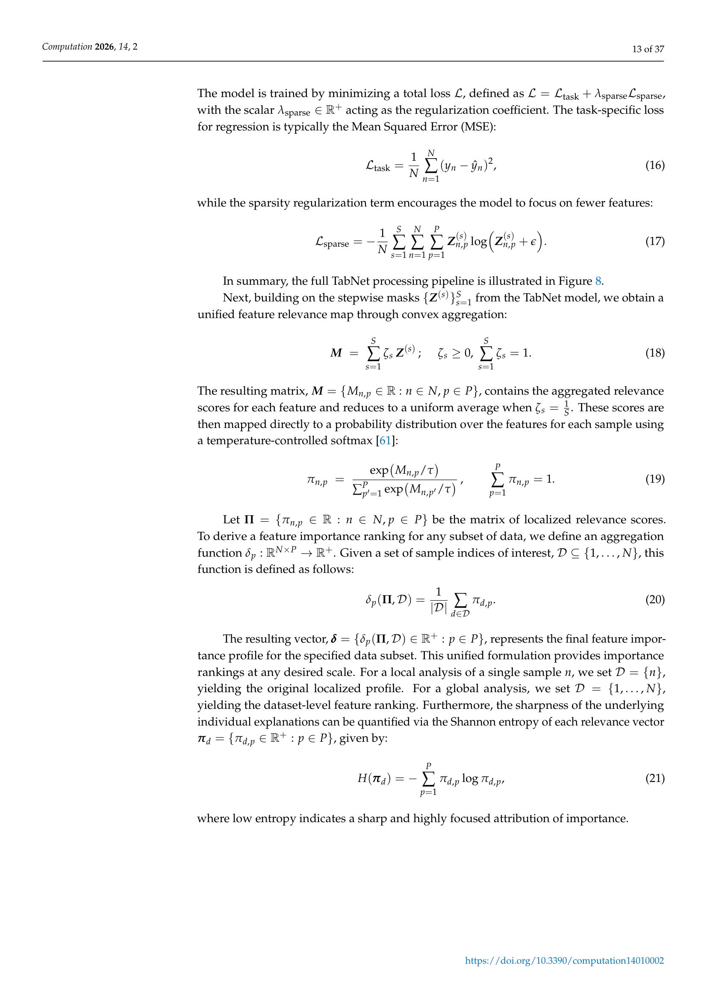

### Extraction assessment
- **Confidence:** 0.65 (below the configured 0.85 threshold; human review required).
- One or more equation candidates are ambiguous in raw extraction.

### Raw extracted text
```
Computation 2026, 14, 2
13 of 37
The model is trained by minimizing a total loss L, defined as L = Ltask + λsparseLsparse,
with the scalar λsparse ∈R+ acting as the regularization coefficient. The task-specific loss
for regression is typically the Mean Squared Error (MSE):
Ltask = 1
N
N
∑
n=1
(yn −ˆyn)2,
(16)
while the sparsity regularization term encourages the model to focus on fewer features:
Lsparse = −1
N
S
∑
s=1
N
∑
n=1
P
∑
p=1
Z(s)
n,p log

Z(s)
n,p + ϵ

.
(17)
In summary, the full TabNet processing pipeline is illustrated in Figure 8.
Next, building on the stepwise masks {Z(s)}S
s=1 from the TabNet model, we obtain a
unified feature relevance map through convex aggregation:
M =
S
∑
s=1
ζs Z(s) ;
ζs ≥0,
S
∑
s=1
ζs = 1.
(18)
The resulting matrix, M = {Mn,p ∈R : n ∈N, p ∈P}, contains the aggregated relevance
scores for each feature and reduces to a uniform average when ζs = 1
S. These scores are
then mapped directly to a probability distribution over the features for each sample using
a temperature-controlled softmax [61]:
πn,p =
exp
Mn,p/τ

∑P
p′=1 exp
Mn,p′/τ
 ,
P
∑
p=1
πn,p = 1.
(19)
Let Π = {πn,p ∈R : n ∈N, p ∈P} be the matrix of localized relevance scores.
To derive a feature importance ranking for any subset of data, we define an aggregation
function δp : RN×P →R+. Given a set of sample indices of interest, D ⊆{1, . . . , N}, this
function is defined as follows:
δp(Π, D) =
1
|D| ∑
d∈D
πd,p.
(20)
The resulting vector, δ = {δp(Π, D) ∈R+ : p ∈P}, represents the final feature impor-
tance profile for the specified data subset. This unified formulation provides importance
rankings at any desired scale. For a local analysis of a single sample n, we set D = {n},
yielding the original localized profile. For a global analysis, we set D = {1, . . . , N},
yielding the dataset-level feature ranking. Furthermore, the sharpness of the underlying
individual explanations can be quantified via the Shannon entropy of each relevance vector
πd = {πd,p ∈R+ : p ∈P}, given by:
H(πd) = −
P
∑
p=1
πd,p log πd,p,
(21)
where low entropy indicates a sharp and highly focused attribution of importance.
https://doi.org/10.3390/computation14010002

```

### Equation candidates
- `page-013-equation-001` — review_required (confidence 0.45; page 13).
```
The model is trained by minimizing a total loss L, defined as L = Ltask + λsparseLsparse,
```
- `page-013-equation-002` — review_required (confidence 0.45; page 13).
```
with the scalar λsparse ∈R+ acting as the regularization coefficient. The task-specific loss
```
- `page-013-equation-003` — raw_text_preserved (confidence 0.98; page 13).
```
Ltask = 1
```
- `page-013-equation-004` — review_required (confidence 0.45; page 13).
```
∑
```
- `page-013-equation-005` — raw_text_preserved (confidence 0.98; page 13).
```
n=1
```
- `page-013-equation-006` — raw_text_preserved (confidence 0.98; page 13).
```
Lsparse = −1
```
- `page-013-equation-007` — review_required (confidence 0.45; page 13).
```
∑
```
- `page-013-equation-008` — raw_text_preserved (confidence 0.98; page 13).
```
s=1
```
- `page-013-equation-009` — review_required (confidence 0.45; page 13).
```
∑
```
- `page-013-equation-010` — raw_text_preserved (confidence 0.98; page 13).
```
n=1
```
- `page-013-equation-011` — review_required (confidence 0.45; page 13).
```
∑
```
- `page-013-equation-012` — raw_text_preserved (confidence 0.98; page 13).
```
p=1
```
- `page-013-equation-013` — raw_text_preserved (confidence 0.98; page 13).
```
s=1 from the TabNet model, we obtain a
```
- `page-013-equation-014` — review_required (confidence 0.45; page 13).
```
M =
```
- `page-013-equation-015` — review_required (confidence 0.45; page 13).
```
∑
```
- `page-013-equation-016` — raw_text_preserved (confidence 0.98; page 13).
```
s=1
```
- `page-013-equation-017` — review_required (confidence 0.45; page 13).
```
ζs ≥0,
```
- `page-013-equation-018` — review_required (confidence 0.45; page 13).
```
∑
```
- `page-013-equation-019` — raw_text_preserved (confidence 0.98; page 13).
```
s=1
```
- `page-013-equation-020` — raw_text_preserved (confidence 0.98; page 13).
```
ζs = 1.
```
- `page-013-equation-021` — review_required (confidence 0.45; page 13).
```
The resulting matrix, M = {Mn,p ∈R : n ∈N, p ∈P}, contains the aggregated relevance
```
- `page-013-equation-022` — review_required (confidence 0.45; page 13).
```
scores for each feature and reduces to a uniform average when ζs = 1
```
- `page-013-equation-023` — review_required (confidence 0.45; page 13).
```
πn,p =
```
- `page-013-equation-024` — review_required (confidence 0.45; page 13).
```
∑P
```
- `page-013-equation-025` — review_required (confidence 0.45; page 13).
```
p′=1 exp
```
- `page-013-equation-026` — review_required (confidence 0.45; page 13).
```
∑
```
- `page-013-equation-027` — raw_text_preserved (confidence 0.98; page 13).
```
p=1
```
- `page-013-equation-028` — review_required (confidence 0.45; page 13).
```
πn,p = 1.
```
- `page-013-equation-029` — review_required (confidence 0.45; page 13).
```
Let Π = {πn,p ∈R : n ∈N, p ∈P} be the matrix of localized relevance scores.
```
- `page-013-equation-030` — review_required (confidence 0.45; page 13).
```
function δp : RN×P →R+. Given a set of sample indices of interest, D ⊆{1, . . . , N}, this
```
- `page-013-equation-031` — review_required (confidence 0.45; page 13).
```
δp(Π, D) =
```
- `page-013-equation-032` — review_required (confidence 0.45; page 13).
```
|D| ∑
```
- `page-013-equation-033` — raw_text_preserved (confidence 0.98; page 13).
```
d∈D
```
- `page-013-equation-034` — review_required (confidence 0.45; page 13).
```
The resulting vector, δ = {δp(Π, D) ∈R+ : p ∈P}, represents the final feature impor-
```
- `page-013-equation-035` — review_required (confidence 0.45; page 13).
```
rankings at any desired scale. For a local analysis of a single sample n, we set D = {n},
```
- `page-013-equation-036` — review_required (confidence 0.45; page 13).
```
yielding the original localized profile. For a global analysis, we set D = {1, . . . , N},
```
- `page-013-equation-037` — raw_text_preserved (confidence 0.98; page 13).
```
πd = {πd,p ∈R+ : p ∈P}, given by:
```
- `page-013-equation-038` — raw_text_preserved (confidence 0.98; page 13).
```
H(πd) = −
```
- `page-013-equation-039` — review_required (confidence 0.45; page 13).
```
∑
```
- `page-013-equation-040` — raw_text_preserved (confidence 0.98; page 13).
```
p=1
```

## Page 14
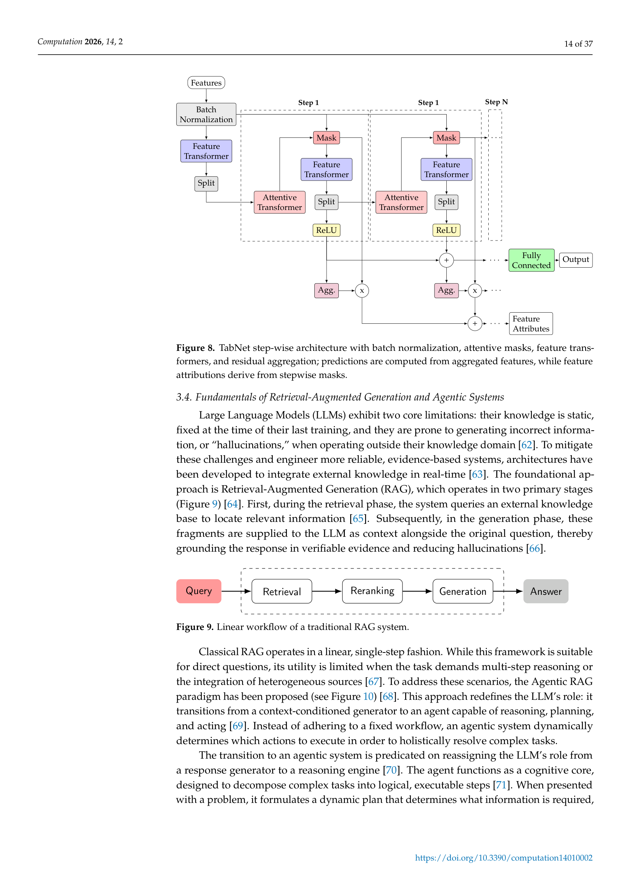

### Extraction assessment
- **Confidence:** 0.95 (meets the configured threshold).
- Machine-readable text was preserved with page-image provenance.

### Raw extracted text
```
Computation 2026, 14, 2
14 of 37
Features
Batch
Normalization
Feature
Transformer
Split
Mask
Feature
Transformer
Split
Attentive
Transformer
ReLU
Agg.
x
Attentive
Transformer
Mask
Feature
Transformer
Split
ReLU
Agg.
x
+
+
· · ·
· · ·
· · ·
· · ·
Fully
Connected
Output
Feature
Attributes
Step 1
Step 1
Step N
Figure 8. TabNet step-wise architecture with batch normalization, attentive masks, feature trans-
formers, and residual aggregation; predictions are computed from aggregated features, while feature
attributions derive from stepwise masks.
3.4. Fundamentals of Retrieval-Augmented Generation and Agentic Systems
Large Language Models (LLMs) exhibit two core limitations: their knowledge is static,
fixed at the time of their last training, and they are prone to generating incorrect informa-
tion, or “hallucinations,” when operating outside their knowledge domain [62]. To mitigate
these challenges and engineer more reliable, evidence-based systems, architectures have
been developed to integrate external knowledge in real-time [63]. The foundational ap-
proach is Retrieval-Augmented Generation (RAG), which operates in two primary stages
(Figure 9) [64]. First, during the retrieval phase, the system queries an external knowledge
base to locate relevant information [65]. Subsequently, in the generation phase, these
fragments are supplied to the LLM as context alongside the original question, thereby
grounding the response in verifiable evidence and reducing hallucinations [66].
Query
Retrieval
Reranking
Generation
Answer
Figure 9. Linear workflow of a traditional RAG system.
Classical RAG operates in a linear, single-step fashion. While this framework is suitable
for direct questions, its utility is limited when the task demands multi-step reasoning or
the integration of heterogeneous sources [67]. To address these scenarios, the Agentic RAG
paradigm has been proposed (see Figure 10) [68]. This approach redefines the LLM’s role: it
transitions from a context-conditioned generator to an agent capable of reasoning, planning,
and acting [69]. Instead of adhering to a fixed workflow, an agentic system dynamically
determines which actions to execute in order to holistically resolve complex tasks.
The transition to an agentic system is predicated on reassigning the LLM’s role from
a response generator to a reasoning engine [70]. The agent functions as a cognitive core,
designed to decompose complex tasks into logical, executable steps [71]. When presented
with a problem, it formulates a dynamic plan that determines what information is required,
https://doi.org/10.3390/computation14010002

```

### Textual figure-caption evidence
- Figure 8. TabNet step-wise architecture with batch normalization, attentive masks, feature trans-
- Figure 9. Linear workflow of a traditional RAG system.
- Captions are page-level text evidence and are not associated with embedded images.

## Page 15
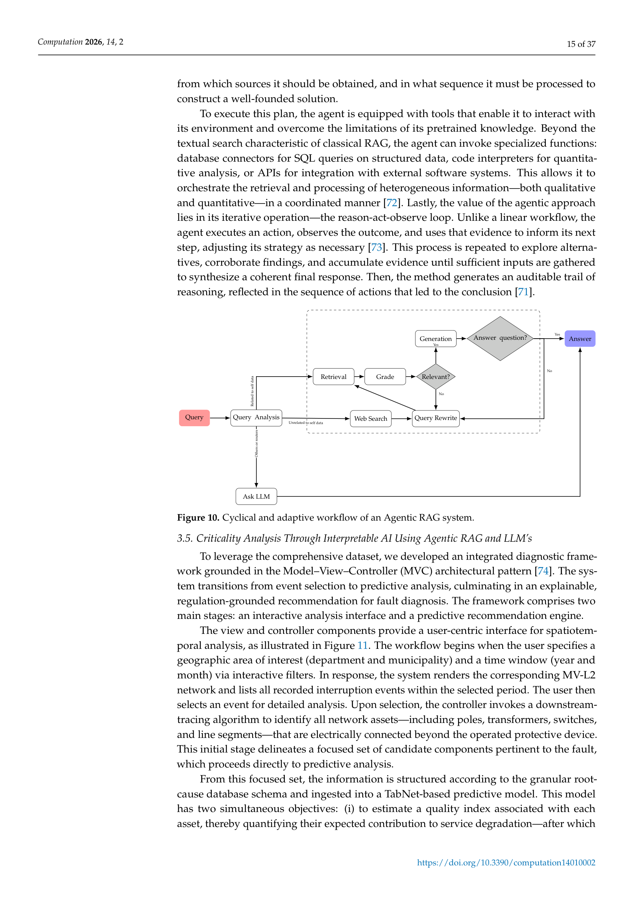

### Extraction assessment
- **Confidence:** 0.95 (meets the configured threshold).
- Machine-readable text was preserved with page-image provenance.

### Raw extracted text
```
Computation 2026, 14, 2
15 of 37
from which sources it should be obtained, and in what sequence it must be processed to
construct a well-founded solution.
To execute this plan, the agent is equipped with tools that enable it to interact with
its environment and overcome the limitations of its pretrained knowledge. Beyond the
textual search characteristic of classical RAG, the agent can invoke specialized functions:
database connectors for SQL queries on structured data, code interpreters for quantita-
tive analysis, or APIs for integration with external software systems. This allows it to
orchestrate the retrieval and processing of heterogeneous information—both qualitative
and quantitative—in a coordinated manner [72]. Lastly, the value of the agentic approach
lies in its iterative operation—the reason-act-observe loop. Unlike a linear workflow, the
agent executes an action, observes the outcome, and uses that evidence to inform its next
step, adjusting its strategy as necessary [73]. This process is repeated to explore alterna-
tives, corroborate findings, and accumulate evidence until sufficient inputs are gathered
to synthesize a coherent final response. Then, the method generates an auditable trail of
reasoning, reflected in the sequence of actions that led to the conclusion [71].
Query
Query Analysis
Retrieval
Grade
Relevant?
Generation
Answer question?
Answer
Query Rewrite
Web Search
Ask LLM
Related to self data
Yes
Yes
No
No
Unrelated to self data
Others or routers
Figure 10. Cyclical and adaptive workflow of an Agentic RAG system.
3.5. Criticality Analysis Through Interpretable AI Using Agentic RAG and LLM’s
To leverage the comprehensive dataset, we developed an integrated diagnostic frame-
work grounded in the Model–View–Controller (MVC) architectural pattern [74]. The sys-
tem transitions from event selection to predictive analysis, culminating in an explainable,
regulation-grounded recommendation for fault diagnosis. The framework comprises two
main stages: an interactive analysis interface and a predictive recommendation engine.
The view and controller components provide a user-centric interface for spatiotem-
poral analysis, as illustrated in Figure 11. The workflow begins when the user specifies a
geographic area of interest (department and municipality) and a time window (year and
month) via interactive filters. In response, the system renders the corresponding MV-L2
network and lists all recorded interruption events within the selected period. The user then
selects an event for detailed analysis. Upon selection, the controller invokes a downstream-
tracing algorithm to identify all network assets—including poles, transformers, switches,
and line segments—that are electrically connected beyond the operated protective device.
This initial stage delineates a focused set of candidate components pertinent to the fault,
which proceeds directly to predictive analysis.
From this focused set, the information is structured according to the granular root-
cause database schema and ingested into a TabNet-based predictive model. This model
has two simultaneous objectives: (i) to estimate a quality index associated with each
asset, thereby quantifying their expected contribution to service degradation—after which
https://doi.org/10.3390/computation14010002

```

### Textual figure-caption evidence
- Figure 10. Cyclical and adaptive workflow of an Agentic RAG system.
- Captions are page-level text evidence and are not associated with embedded images.

## Page 16
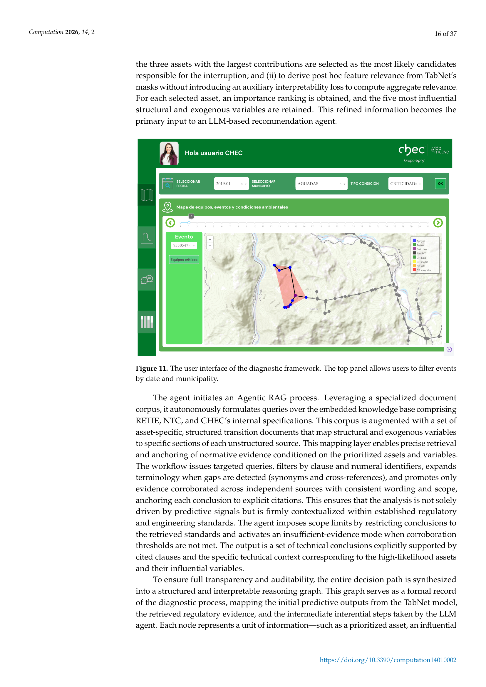

### Extraction assessment
- **Confidence:** 0.65 (below the configured 0.85 threshold; human review required).
- One or more equation candidates are ambiguous in raw extraction. Embedded images require visual review; captions remain page-level text evidence only.

### Raw extracted text
```
Computation 2026, 14, 2
16 of 37
the three assets with the largest contributions are selected as the most likely candidates
responsible for the interruption; and (ii) to derive post hoc feature relevance from TabNet’s
masks without introducing an auxiliary interpretability loss to compute aggregate relevance.
For each selected asset, an importance ranking is obtained, and the five most influential
structural and exogenous variables are retained. This refined information becomes the
primary input to an LLM-based recommendation agent.
Hola usuario CHEC
Mapa de equipos, eventos y condiciones ambientales
1
2
3
4
5
6
7
8
9
10
11
12
13
14
15
16
17
18
19
20
21
22
23
24
25
26
27
28
29
30
31
2
Equipos críticos
7550547×
Evento
Make this Notebook Trusted to load map: File -> Trust Notebook
+
−
 Apoyos
 Trafos
 Switches
 Red MT
 CR baja
 CR media
 CR alta
 CR muy alta
SELECCIONAR
FECHA
SELECCIONAR
MUNICIPIO
TIPO CONDICIÓN
OK
2019-01
×
AGUADAS
×
CRITICIDAD×
Figure 11. The user interface of the diagnostic framework. The top panel allows users to filter events
by date and municipality.
The agent initiates an Agentic RAG process. Leveraging a specialized document
corpus, it autonomously formulates queries over the embedded knowledge base comprising
RETIE, NTC, and CHEC’s internal specifications. This corpus is augmented with a set of
asset-specific, structured transition documents that map structural and exogenous variables
to specific sections of each unstructured source. This mapping layer enables precise retrieval
and anchoring of normative evidence conditioned on the prioritized assets and variables.
The workflow issues targeted queries, filters by clause and numeral identifiers, expands
terminology when gaps are detected (synonyms and cross-references), and promotes only
evidence corroborated across independent sources with consistent wording and scope,
anchoring each conclusion to explicit citations. This ensures that the analysis is not solely
driven by predictive signals but is firmly contextualized within established regulatory
and engineering standards. The agent imposes scope limits by restricting conclusions to
the retrieved standards and activates an insufficient-evidence mode when corroboration
thresholds are not met. The output is a set of technical conclusions explicitly supported by
cited clauses and the specific technical context corresponding to the high-likelihood assets
and their influential variables.
To ensure full transparency and auditability, the entire decision path is synthesized
into a structured and interpretable reasoning graph. This graph serves as a formal record
of the diagnostic process, mapping the initial predictive outputs from the TabNet model,
the retrieved regulatory evidence, and the intermediate inferential steps taken by the LLM
agent. Each node represents a unit of information—such as a prioritized asset, an influential
https://doi.org/10.3390/computation14010002

```

### Textual figure-caption evidence
- Figure 11. The user interface of the diagnostic framework. The top panel allows users to filter events
- Captions are page-level text evidence and are not associated with embedded images.

### Equation candidates
- `page-016-equation-001` — review_required (confidence 0.45; page 16).
```
7550547×
```
- `page-016-equation-002` — review_required (confidence 0.45; page 16).
```
×
```
- `page-016-equation-003` — review_required (confidence 0.45; page 16).
```
×
```
- `page-016-equation-004` — review_required (confidence 0.45; page 16).
```
CRITICIDAD×
```

### Embedded images
- `page-016-image-001` — embedded image metadata: 114 × 141 px, xref 599; visual review required.
- `page-016-image-002` — embedded image metadata: 17 × 17 px, xref 600; visual review required.
- `page-016-image-003` — embedded image metadata: 256 × 256 px, xref 601; visual review required.
- `page-016-image-004` — embedded image metadata: 17 × 17 px, xref 602; visual review required.
- `page-016-image-005` — embedded image metadata: 256 × 256 px, xref 603; visual review required.
- `page-016-image-006` — embedded image metadata: 256 × 256 px, xref 604; visual review required.
- `page-016-image-007` — embedded image metadata: 256 × 256 px, xref 605; visual review required.
- `page-016-image-008` — embedded image metadata: 256 × 256 px, xref 606; visual review required.
- `page-016-image-009` — embedded image metadata: 256 × 256 px, xref 607; visual review required.
- `page-016-image-010` — embedded image metadata: 256 × 256 px, xref 608; visual review required.
- `page-016-image-011` — embedded image metadata: 256 × 256 px, xref 609; visual review required.
- `page-016-image-012` — embedded image metadata: 256 × 256 px, xref 610; visual review required.
- `page-016-image-013` — embedded image metadata: 67 × 68 px, xref 611; visual review required.
- `page-016-image-014` — embedded image metadata: 256 × 256 px, xref 612; visual review required.
- `page-016-image-015` — embedded image metadata: 17 × 17 px, xref 615; visual review required.
- `page-016-image-016` — embedded image metadata: 256 × 256 px, xref 616; visual review required.
- `page-016-image-017` — embedded image metadata: 256 × 256 px, xref 617; visual review required.
- `page-016-image-018` — embedded image metadata: 256 × 256 px, xref 618; visual review required.
- `page-016-image-019` — embedded image metadata: 38 × 48 px, xref 619; visual review required.
- `page-016-image-020` — embedded image metadata: 40 × 50 px, xref 620; visual review required.
- `page-016-image-021` — embedded image metadata: 17 × 17 px, xref 621; visual review required.
- `page-016-image-022` — embedded image metadata: 256 × 256 px, xref 622; visual review required.
- `page-016-image-023` — embedded image metadata: 256 × 256 px, xref 623; visual review required.
- `page-016-image-024` — embedded image metadata: 61 × 60 px, xref 624; visual review required.
- `page-016-image-025` — embedded image metadata: 256 × 256 px, xref 625; visual review required.
- `page-016-image-026` — embedded image metadata: 475 × 181 px, xref 626; visual review required.
- `page-016-image-027` — embedded image metadata: 256 × 256 px, xref 627; visual review required.
- `page-016-image-028` — embedded image metadata: 103 × 79 px, xref 628; visual review required.
- `page-016-image-029` — embedded image metadata: 256 × 256 px, xref 629; visual review required.
- `page-016-image-030` — embedded image metadata: 87 × 88 px, xref 630; visual review required.
- `page-016-image-031` — embedded image metadata: 256 × 256 px, xref 631; visual review required.
- `page-016-image-032` — embedded image metadata: 94 × 93 px, xref 632; visual review required.
- `page-016-image-033` — embedded image metadata: 256 × 256 px, xref 633; visual review required.

## Page 17
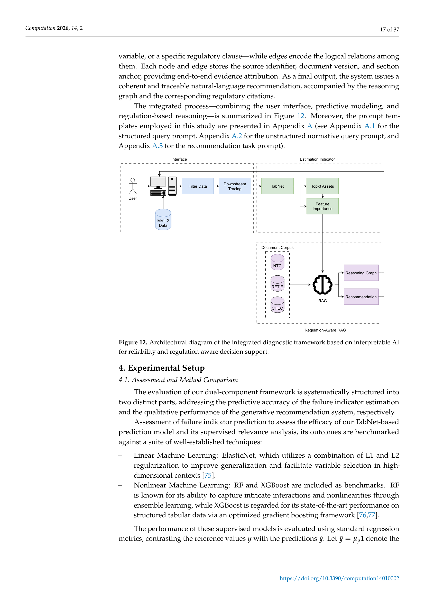

### Extraction assessment
- **Confidence:** 0.65 (below the configured 0.85 threshold; human review required).
- One or more equation candidates are ambiguous in raw extraction.

### Raw extracted text
```
Computation 2026, 14, 2
17 of 37
variable, or a specific regulatory clause—while edges encode the logical relations among
them. Each node and edge stores the source identifier, document version, and section
anchor, providing end-to-end evidence attribution. As a final output, the system issues a
coherent and traceable natural-language recommendation, accompanied by the reasoning
graph and the corresponding regulatory citations.
The integrated process—combining the user interface, predictive modeling, and
regulation-based reasoning—is summarized in Figure 12. Moreover, the prompt tem-
plates employed in this study are presented in Appendix A (see Appendix A.1 for the
structured query prompt, Appendix A.2 for the unstructured normative query prompt, and
Appendix A.3 for the recommendation task prompt).
MV-L2
Data
User
Filter Data
TabNet
Feature
Importance
Top-3 Assets
NTC
RAG
Reasoning Graph
Recommendation
Downstream
Tracing
RETIE
CHEC
Interface
Estimation Indicator
Regulation-Aware RAG
Document Corpus
Figure 12. Architectural diagram of the integrated diagnostic framework based on interpretable AI
for reliability and regulation-aware decision support.
4. Experimental Setup
4.1. Assessment and Method Comparison
The evaluation of our dual-component framework is systematically structured into
two distinct parts, addressing the predictive accuracy of the failure indicator estimation
and the qualitative performance of the generative recommendation system, respectively.
Assessment of failure indicator prediction to assess the efficacy of our TabNet-based
prediction model and its supervised relevance analysis, its outcomes are benchmarked
against a suite of well-established techniques:
–
Linear Machine Learning: ElasticNet, which utilizes a combination of L1 and L2
regularization to improve generalization and facilitate variable selection in high-
dimensional contexts [75].
–
Nonlinear Machine Learning: RF and XGBoost are included as benchmarks. RF
is known for its ability to capture intricate interactions and nonlinearities through
ensemble learning, while XGBoost is regarded for its state-of-the-art performance on
structured tabular data via an optimized gradient boosting framework [76,77].
The performance of these supervised models is evaluated using standard regression
metrics, contrasting the reference values y with the predictions ˆy. Let ¯y = µy1 denote the
https://doi.org/10.3390/computation14010002

```

### Textual figure-caption evidence
- Figure 12. Architectural diagram of the integrated diagnostic framework based on interpretable AI
- Captions are page-level text evidence and are not associated with embedded images.

### Equation candidates
- `page-017-equation-001` — review_required (confidence 0.45; page 17).
```
metrics, contrasting the reference values y with the predictions ˆy. Let ¯y = µy1 denote the
```

## Page 18
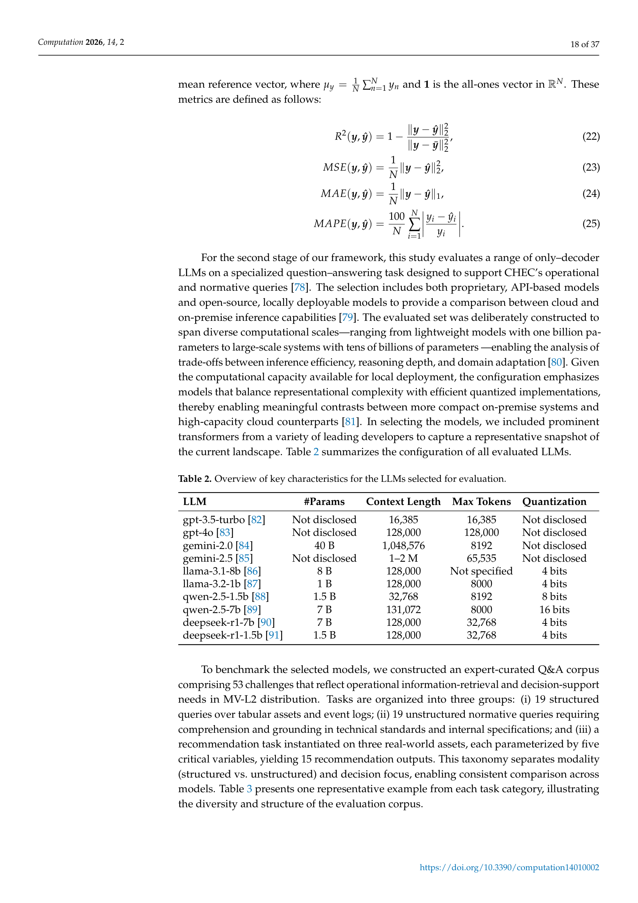

### Extraction assessment
- **Confidence:** 0.65 (below the configured 0.85 threshold; human review required).
- One or more equation candidates are ambiguous in raw extraction.

### Raw extracted text
```
Computation 2026, 14, 2
18 of 37
mean reference vector, where µy =
1
N ∑N
n=1 yn and 1 is the all-ones vector in RN. These
metrics are defined as follows:
R2(y, ˆy) = 1 −∥y −ˆy∥2
2
∥y −¯y∥2
2
,
(22)
MSE(y, ˆy) = 1
N ∥y −ˆy∥2
2,
(23)
MAE(y, ˆy) = 1
N ∥y −ˆy∥1,
(24)
MAPE(y, ˆy) = 100
N
N
∑
i=1

yi −ˆyi
yi
.
(25)
For the second stage of our framework, this study evaluates a range of only–decoder
LLMs on a specialized question–answering task designed to support CHEC’s operational
and normative queries [78]. The selection includes both proprietary, API-based models
and open-source, locally deployable models to provide a comparison between cloud and
on-premise inference capabilities [79]. The evaluated set was deliberately constructed to
span diverse computational scales—ranging from lightweight models with one billion pa-
rameters to large-scale systems with tens of billions of parameters —enabling the analysis of
trade-offs between inference efficiency, reasoning depth, and domain adaptation [80]. Given
the computational capacity available for local deployment, the configuration emphasizes
models that balance representational complexity with efficient quantized implementations,
thereby enabling meaningful contrasts between more compact on-premise systems and
high-capacity cloud counterparts [81]. In selecting the models, we included prominent
transformers from a variety of leading developers to capture a representative snapshot of
the current landscape. Table 2 summarizes the configuration of all evaluated LLMs.
Table 2. Overview of key characteristics for the LLMs selected for evaluation.
LLM
#Params
Context Length
Max Tokens
Quantization
gpt-3.5-turbo [82]
Not disclosed
16,385
16,385
Not disclosed
gpt-4o [83]
Not disclosed
128,000
128,000
Not disclosed
gemini-2.0 [84]
40 B
1,048,576
8192
Not disclosed
gemini-2.5 [85]
Not disclosed
1–2 M
65,535
Not disclosed
llama-3.1-8b [86]
8 B
128,000
Not specified
4 bits
llama-3.2-1b [87]
1 B
128,000
8000
4 bits
qwen-2.5-1.5b [88]
1.5 B
32,768
8192
8 bits
qwen-2.5-7b [89]
7 B
131,072
8000
16 bits
deepseek-r1-7b [90]
7 B
128,000
32,768
4 bits
deepseek-r1-1.5b [91]
1.5 B
128,000
32,768
4 bits
To benchmark the selected models, we constructed an expert-curated Q&A corpus
comprising 53 challenges that reflect operational information-retrieval and decision-support
needs in MV-L2 distribution. Tasks are organized into three groups: (i) 19 structured
queries over tabular assets and event logs; (ii) 19 unstructured normative queries requiring
comprehension and grounding in technical standards and internal specifications; and (iii) a
recommendation task instantiated on three real-world assets, each parameterized by five
critical variables, yielding 15 recommendation outputs. This taxonomy separates modality
(structured vs. unstructured) and decision focus, enabling consistent comparison across
models. Table 3 presents one representative example from each task category, illustrating
the diversity and structure of the evaluation corpus.
https://doi.org/10.3390/computation14010002

```

### Equation candidates
- `page-018-equation-001` — review_required (confidence 0.45; page 18).
```
mean reference vector, where µy =
```
- `page-018-equation-002` — review_required (confidence 0.45; page 18).
```
N ∑N
```
- `page-018-equation-003` — raw_text_preserved (confidence 0.98; page 18).
```
n=1 yn and 1 is the all-ones vector in RN. These
```
- `page-018-equation-004` — raw_text_preserved (confidence 0.98; page 18).
```
R2(y, ˆy) = 1 −∥y −ˆy∥2
```
- `page-018-equation-005` — raw_text_preserved (confidence 0.98; page 18).
```
MSE(y, ˆy) = 1
```
- `page-018-equation-006` — raw_text_preserved (confidence 0.98; page 18).
```
MAE(y, ˆy) = 1
```
- `page-018-equation-007` — raw_text_preserved (confidence 0.98; page 18).
```
MAPE(y, ˆy) = 100
```
- `page-018-equation-008` — review_required (confidence 0.45; page 18).
```
∑
```
- `page-018-equation-009` — raw_text_preserved (confidence 0.98; page 18).
```
i=1
```

## Page 19
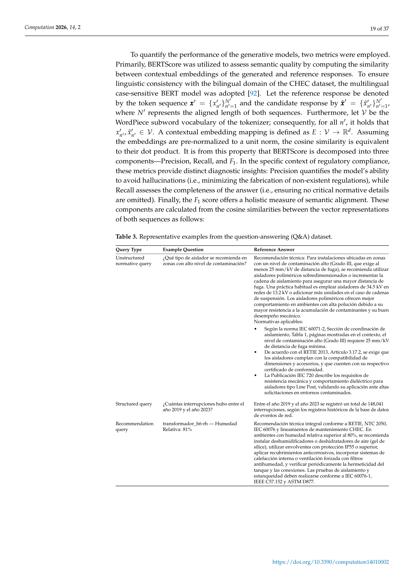

### Extraction assessment
- **Confidence:** 0.65 (below the configured 0.85 threshold; human review required).
- One or more equation candidates are ambiguous in raw extraction.

### Raw extracted text
```
Computation 2026, 14, 2
19 of 37
To quantify the performance of the generative models, two metrics were employed.
Primarily, BERTScore was utilized to assess semantic quality by computing the similarity
between contextual embeddings of the generated and reference responses. To ensure
linguistic consistency with the bilingual domain of the CHEC dataset, the multilingual
case-sensitive BERT model was adopted [92]. Let the reference response be denoted
by the token sequence x′ = {x′
n′}N′
n′=1 and the candidate response by ˆx′ = { ˆx′
n′}N′
n′=1,
where N′ represents the aligned length of both sequences. Furthermore, let V be the
WordPiece subword vocabulary of the tokenizer; consequently, for all n′, it holds that
x′
n′, ˆx′
n′ ∈V. A contextual embedding mapping is defined as E : V →Rd. Assuming
the embeddings are pre-normalized to a unit norm, the cosine similarity is equivalent
to their dot product. It is from this property that BERTScore is decomposed into three
components—Precision, Recall, and F1. In the specific context of regulatory compliance,
these metrics provide distinct diagnostic insights: Precision quantifies the model’s ability
to avoid hallucinations (i.e., minimizing the fabrication of non-existent regulations), while
Recall assesses the completeness of the answer (i.e., ensuring no critical normative details
are omitted). Finally, the F1 score offers a holistic measure of semantic alignment. These
components are calculated from the cosine similarities between the vector representations
of both sequences as follows:
Table 3. Representative examples from the question-answering (Q&A) dataset.
Query Type
Example Question
Reference Answer
Unstructured
normative query
¿Qué tipo de aislador se recomienda en
zonas con alto nivel de contaminación?
Recomendación técnica: Para instalaciones ubicadas en zonas
con un nivel de contaminación alto (Grado III, que exige al
menos 25 mm/kV de distancia de fuga), se recomienda utilizar
aisladores poliméricos sobredimensionados o incrementar la
cadena de aislamiento para asegurar una mayor distancia de
fuga. Una práctica habitual es emplear aisladores de 34.5 kV en
redes de 13.2 kV o adicionar más unidades en el caso de cadenas
de suspensión. Los aisladores poliméricos ofrecen mejor
comportamiento en ambientes con alta polución debido a su
mayor resistencia a la acumulación de contaminantes y su buen
desempeño mecánico.
Normativas aplicables:
•
Según la norma IEC 60071-2, Sección de coordinación de
aislamiento, Tabla 1, páginas mostradas en el contexto, el
nivel de contaminación alto (Grado III) requiere 25 mm/kV
de distancia de fuga mínima.
•
De acuerdo con el RETIE 2013, Artículo 3.17.2, se exige que
los aisladores cumplan con la compatibilidad de
dimensiones y accesorios, y que cuenten con su respectivo
certificado de conformidad.
•
La Publicación IEC 720 describe los requisitos de
resistencia mecánica y comportamiento dieléctrico para
aisladores tipo Line Post, validando su aplicación ante altas
solicitaciones en entornos contaminados.
Structured query
¿Cuántas interrupciones hubo entre el
año 2019 y el año 2023?
Entre el año 2019 y el año 2023 se registró un total de 148,041
interrupciones, según los registros históricos de la base de datos
de eventos de red.
Recommendation
query
transformador_h6-rh — Humedad
Relativa: 81%
Recomendación técnica integral conforme a RETIE, NTC 2050,
IEC 60076 y lineamientos de mantenimiento CHEC. En
ambientes con humedad relativa superior al 80%, se recomienda
instalar deshumidificadores o deshidratadores de aire (gel de
sílice), utilizar envolventes con protección IP55 o superior,
aplicar recubrimientos anticorrosivos, incorporar sistemas de
calefacción interna o ventilación forzada con filtros
antihumedad, y verificar periódicamente la hermeticidad del
tanque y las conexiones. Las pruebas de aislamiento y
estanqueidad deben realizarse conforme a IEC 60076-1,
IEEE C57.152 y ASTM D877.
https://doi.org/10.3390/computation14010002

```

### Equation candidates
- `page-019-equation-001` — review_required (confidence 0.45; page 19).
```
by the token sequence x′ = {x′
```
- `page-019-equation-002` — review_required (confidence 0.45; page 19).
```
n′=1 and the candidate response by ˆx′ = { ˆx′
```
- `page-019-equation-003` — review_required (confidence 0.45; page 19).
```
n′=1,
```
- `page-019-equation-004` — review_required (confidence 0.45; page 19).
```
n′ ∈V. A contextual embedding mapping is defined as E : V →Rd. Assuming
```
- `page-019-equation-005` — review_required (confidence 0.45; page 19).
```
transformador_h6-rh — Humedad
```

## Page 20
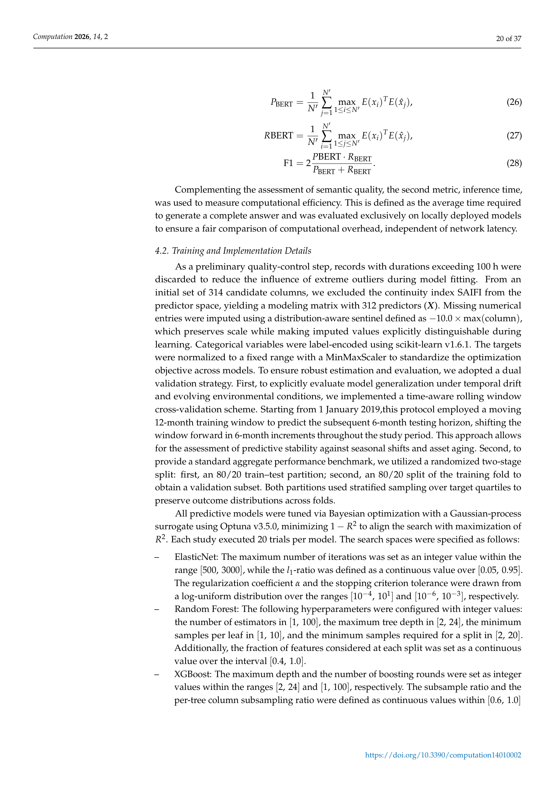

### Extraction assessment
- **Confidence:** 0.65 (below the configured 0.85 threshold; human review required).
- One or more equation candidates are ambiguous in raw extraction.

### Raw extracted text
```
Computation 2026, 14, 2
20 of 37
PBERT = 1
N′
N′
∑
j=1
max
1≤i≤N′ E(xi)TE( ˆxj),
(26)
RBERT = 1
N′
N′
∑
i=1
max
1≤j≤N′ E(xi)TE( ˆxj),
(27)
F1 = 2 PBERT · RBERT
PBERT + RBERT
.
(28)
Complementing the assessment of semantic quality, the second metric, inference time,
was used to measure computational efficiency. This is defined as the average time required
to generate a complete answer and was evaluated exclusively on locally deployed models
to ensure a fair comparison of computational overhead, independent of network latency.
4.2. Training and Implementation Details
As a preliminary quality-control step, records with durations exceeding 100 h were
discarded to reduce the influence of extreme outliers during model fitting. From an
initial set of 314 candidate columns, we excluded the continuity index SAIFI from the
predictor space, yielding a modeling matrix with 312 predictors (X). Missing numerical
entries were imputed using a distribution-aware sentinel defined as −10.0 × max(column),
which preserves scale while making imputed values explicitly distinguishable during
learning. Categorical variables were label-encoded using scikit-learn v1.6.1. The targets
were normalized to a fixed range with a MinMaxScaler to standardize the optimization
objective across models. To ensure robust estimation and evaluation, we adopted a dual
validation strategy. First, to explicitly evaluate model generalization under temporal drift
and evolving environmental conditions, we implemented a time-aware rolling window
cross-validation scheme. Starting from 1 January 2019,this protocol employed a moving
12-month training window to predict the subsequent 6-month testing horizon, shifting the
window forward in 6-month increments throughout the study period. This approach allows
for the assessment of predictive stability against seasonal shifts and asset aging. Second, to
provide a standard aggregate performance benchmark, we utilized a randomized two-stage
split: first, an 80/20 train–test partition; second, an 80/20 split of the training fold to
obtain a validation subset. Both partitions used stratified sampling over target quartiles to
preserve outcome distributions across folds.
All predictive models were tuned via Bayesian optimization with a Gaussian-process
surrogate using Optuna v3.5.0, minimizing 1 −R2 to align the search with maximization of
R2. Each study executed 20 trials per model. The search spaces were specified as follows:
–
ElasticNet: The maximum number of iterations was set as an integer value within the
range [500, 3000], while the l1-ratio was defined as a continuous value over [0.05, 0.95].
The regularization coefficient α and the stopping criterion tolerance were drawn from
a log-uniform distribution over the ranges [10−4, 101] and [10−6, 10−3], respectively.
–
Random Forest: The following hyperparameters were configured with integer values:
the number of estimators in [1, 100], the maximum tree depth in [2, 24], the minimum
samples per leaf in [1, 10], and the minimum samples required for a split in [2, 20].
Additionally, the fraction of features considered at each split was set as a continuous
value over the interval [0.4, 1.0].
–
XGBoost: The maximum depth and the number of boosting rounds were set as integer
values within the ranges [2, 24] and [1, 100], respectively. The subsample ratio and the
per-tree column subsampling ratio were defined as continuous values within [0.6, 1.0]
https://doi.org/10.3390/computation14010002

```

### Equation candidates
- `page-020-equation-001` — raw_text_preserved (confidence 0.98; page 20).
```
PBERT = 1
```
- `page-020-equation-002` — review_required (confidence 0.45; page 20).
```
∑
```
- `page-020-equation-003` — raw_text_preserved (confidence 0.98; page 20).
```
j=1
```
- `page-020-equation-004` — review_required (confidence 0.45; page 20).
```
1≤i≤N′ E(xi)TE( ˆxj),
```
- `page-020-equation-005` — raw_text_preserved (confidence 0.98; page 20).
```
RBERT = 1
```
- `page-020-equation-006` — review_required (confidence 0.45; page 20).
```
∑
```
- `page-020-equation-007` — raw_text_preserved (confidence 0.98; page 20).
```
i=1
```
- `page-020-equation-008` — review_required (confidence 0.45; page 20).
```
1≤j≤N′ E(xi)TE( ˆxj),
```
- `page-020-equation-009` — raw_text_preserved (confidence 0.98; page 20).
```
F1 = 2 PBERT · RBERT
```
- `page-020-equation-010` — review_required (confidence 0.45; page 20).
```
entries were imputed using a distribution-aware sentinel defined as −10.0 × max(column),
```

## Page 21
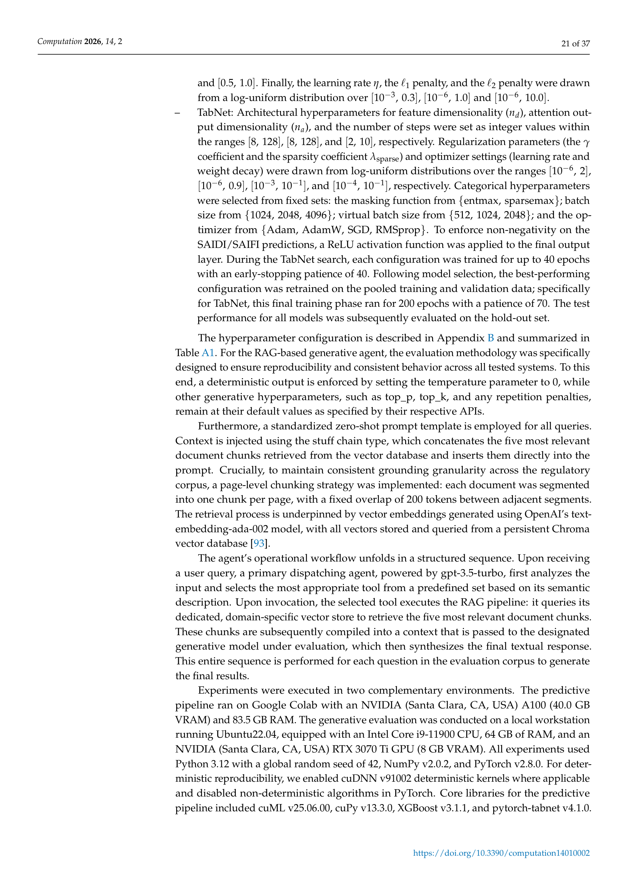

### Extraction assessment
- **Confidence:** 0.65 (below the configured 0.85 threshold; human review required).
- One or more equation candidates are ambiguous in raw extraction.

### Raw extracted text
```
Computation 2026, 14, 2
21 of 37
and [0.5, 1.0]. Finally, the learning rate η, the ℓ1 penalty, and the ℓ2 penalty were drawn
from a log-uniform distribution over [10−3, 0.3], [10−6, 1.0] and [10−6, 10.0].
–
TabNet: Architectural hyperparameters for feature dimensionality (nd), attention out-
put dimensionality (na), and the number of steps were set as integer values within
the ranges [8, 128], [8, 128], and [2, 10], respectively. Regularization parameters (the γ
coefficient and the sparsity coefficient λsparse) and optimizer settings (learning rate and
weight decay) were drawn from log-uniform distributions over the ranges [10−6, 2],
[10−6, 0.9], [10−3, 10−1], and [10−4, 10−1], respectively. Categorical hyperparameters
were selected from fixed sets: the masking function from {entmax, sparsemax}; batch
size from {1024, 2048, 4096}; virtual batch size from {512, 1024, 2048}; and the op-
timizer from {Adam, AdamW, SGD, RMSprop}. To enforce non-negativity on the
SAIDI/SAIFI predictions, a ReLU activation function was applied to the final output
layer. During the TabNet search, each configuration was trained for up to 40 epochs
with an early-stopping patience of 40. Following model selection, the best-performing
configuration was retrained on the pooled training and validation data; specifically
for TabNet, this final training phase ran for 200 epochs with a patience of 70. The test
performance for all models was subsequently evaluated on the hold-out set.
The hyperparameter configuration is described in Appendix B and summarized in
Table A1. For the RAG-based generative agent, the evaluation methodology was specifically
designed to ensure reproducibility and consistent behavior across all tested systems. To this
end, a deterministic output is enforced by setting the temperature parameter to 0, while
other generative hyperparameters, such as top_p, top_k, and any repetition penalties,
remain at their default values as specified by their respective APIs.
Furthermore, a standardized zero-shot prompt template is employed for all queries.
Context is injected using the stuff chain type, which concatenates the five most relevant
document chunks retrieved from the vector database and inserts them directly into the
prompt. Crucially, to maintain consistent grounding granularity across the regulatory
corpus, a page-level chunking strategy was implemented: each document was segmented
into one chunk per page, with a fixed overlap of 200 tokens between adjacent segments.
The retrieval process is underpinned by vector embeddings generated using OpenAI’s text-
embedding-ada-002 model, with all vectors stored and queried from a persistent Chroma
vector database [93].
The agent’s operational workflow unfolds in a structured sequence. Upon receiving
a user query, a primary dispatching agent, powered by gpt-3.5-turbo, first analyzes the
input and selects the most appropriate tool from a predefined set based on its semantic
description. Upon invocation, the selected tool executes the RAG pipeline: it queries its
dedicated, domain-specific vector store to retrieve the five most relevant document chunks.
These chunks are subsequently compiled into a context that is passed to the designated
generative model under evaluation, which then synthesizes the final textual response.
This entire sequence is performed for each question in the evaluation corpus to generate
the final results.
Experiments were executed in two complementary environments. The predictive
pipeline ran on Google Colab with an NVIDIA (Santa Clara, CA, USA) A100 (40.0 GB
VRAM) and 83.5 GB RAM. The generative evaluation was conducted on a local workstation
running Ubuntu22.04, equipped with an Intel Core i9-11900 CPU, 64 GB of RAM, and an
NVIDIA (Santa Clara, CA, USA) RTX 3070 Ti GPU (8 GB VRAM). All experiments used
Python 3.12 with a global random seed of 42, NumPy v2.0.2, and PyTorch v2.8.0. For deter-
ministic reproducibility, we enabled cuDNN v91002 deterministic kernels where applicable
and disabled non-deterministic algorithms in PyTorch. Core libraries for the predictive
pipeline included cuML v25.06.00, cuPy v13.3.0, XGBoost v3.1.1, and pytorch-tabnet v4.1.0.
https://doi.org/10.3390/computation14010002

```

### Equation candidates
- `page-021-equation-001` — review_required (confidence 0.45; page 21).
```
other generative hyperparameters, such as top_p, top_k, and any repetition penalties,
```

## Page 22
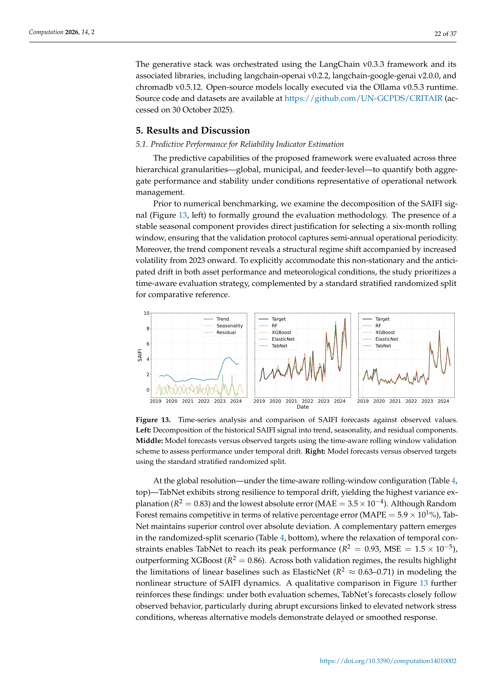

### Extraction assessment
- **Confidence:** 0.65 (below the configured 0.85 threshold; human review required).
- One or more equation candidates are ambiguous in raw extraction.

### Raw extracted text
```
Computation 2026, 14, 2
22 of 37
The generative stack was orchestrated using the LangChain v0.3.3 framework and its
associated libraries, including langchain-openai v0.2.2, langchain-google-genai v2.0.0, and
chromadb v0.5.12. Open-source models locally executed via the Ollama v0.5.3 runtime.
Source code and datasets are available at https://github.com/UN-GCPDS/CRITAIR (ac-
cessed on 30 October 2025).
5. Results and Discussion
5.1. Predictive Performance for Reliability Indicator Estimation
The predictive capabilities of the proposed framework were evaluated across three
hierarchical granularities—global, municipal, and feeder-level—to quantify both aggre-
gate performance and stability under conditions representative of operational network
management.
Prior to numerical benchmarking, we examine the decomposition of the SAIFI sig-
nal (Figure 13, left) to formally ground the evaluation methodology. The presence of a
stable seasonal component provides direct justification for selecting a six-month rolling
window, ensuring that the validation protocol captures semi-annual operational periodicity.
Moreover, the trend component reveals a structural regime shift accompanied by increased
volatility from 2023 onward. To explicitly accommodate this non-stationary and the antici-
pated drift in both asset performance and meteorological conditions, the study prioritizes a
time-aware evaluation strategy, complemented by a standard stratified randomized split
for comparative reference.
2019
2020
2021
2022
2023
2024
0
2
4
6
8
10
SAIFI
Trend
Seasonality
Residual
2019
2020
2021
2022
2023
2024
Date
Target
RF
XGBoost
ElasticNet
TabNet
2019
2020
2021
2022
2023
2024
Target
RF
XGBoost
ElasticNet
TabNet
Figure 13.
Time-series analysis and comparison of SAIFI forecasts against observed values.
Left: Decomposition of the historical SAIFI signal into trend, seasonality, and residual components.
Middle: Model forecasts versus observed targets using the time-aware rolling window validation
scheme to assess performance under temporal drift. Right: Model forecasts versus observed targets
using the standard stratified randomized split.
At the global resolution—under the time-aware rolling-window configuration (Table 4,
top)—TabNet exhibits strong resilience to temporal drift, yielding the highest variance ex-
planation (R2 = 0.83) and the lowest absolute error (MAE = 3.5 × 10−4). Although Random
Forest remains competitive in terms of relative percentage error (MAPE = 5.9 × 101%), Tab-
Net maintains superior control over absolute deviation. A complementary pattern emerges
in the randomized-split scenario (Table 4, bottom), where the relaxation of temporal con-
straints enables TabNet to reach its peak performance (R2 = 0.93, MSE = 1.5 × 10−5),
outperforming XGBoost (R2 = 0.86). Across both validation regimes, the results highlight
the limitations of linear baselines such as ElasticNet (R2 ≈0.63–0.71) in modeling the
nonlinear structure of SAIFI dynamics. A qualitative comparison in Figure 13 further
reinforces these findings: under both evaluation schemes, TabNet’s forecasts closely follow
observed behavior, particularly during abrupt excursions linked to elevated network stress
conditions, whereas alternative models demonstrate delayed or smoothed response.
https://doi.org/10.3390/computation14010002

```

### Equation candidates
- `page-022-equation-001` — review_required (confidence 0.45; page 22).
```
planation (R2 = 0.83) and the lowest absolute error (MAE = 3.5 × 10−4). Although Random
```
- `page-022-equation-002` — review_required (confidence 0.45; page 22).
```
Forest remains competitive in terms of relative percentage error (MAPE = 5.9 × 101%), Tab-
```
- `page-022-equation-003` — review_required (confidence 0.45; page 22).
```
straints enables TabNet to reach its peak performance (R2 = 0.93, MSE = 1.5 × 10−5),
```
- `page-022-equation-004` — review_required (confidence 0.45; page 22).
```
outperforming XGBoost (R2 = 0.86). Across both validation regimes, the results highlight
```
- `page-022-equation-005` — review_required (confidence 0.45; page 22).
```
the limitations of linear baselines such as ElasticNet (R2 ≈0.63–0.71) in modeling the
```

## Page 23
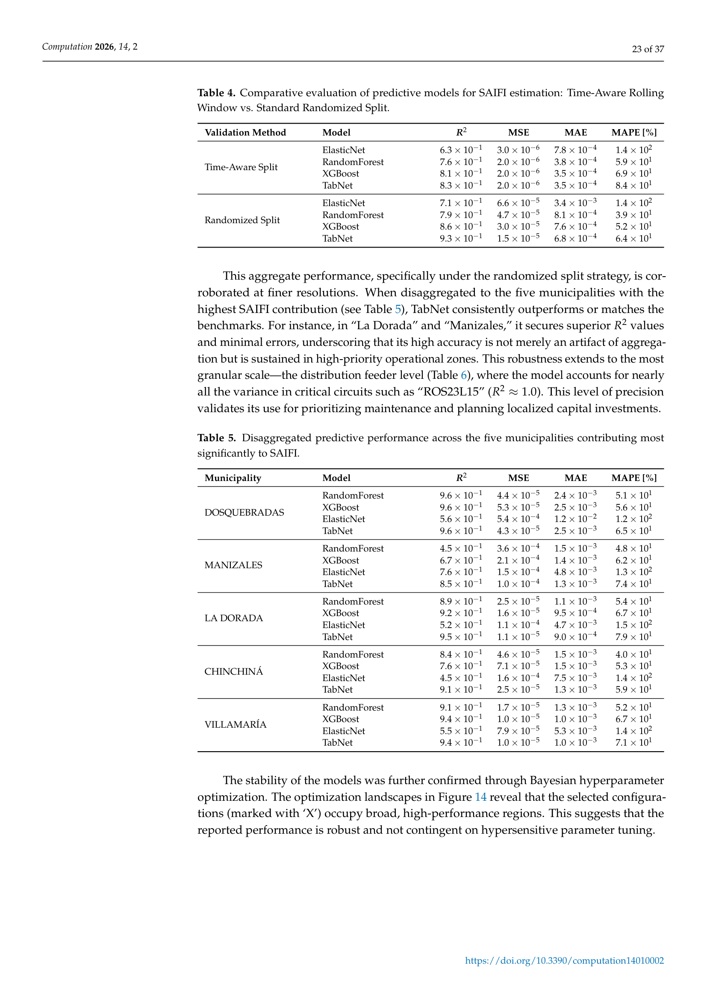

### Extraction assessment
- **Confidence:** 0.65 (below the configured 0.85 threshold; human review required).
- One or more equation candidates are ambiguous in raw extraction.

### Raw extracted text
```
Computation 2026, 14, 2
23 of 37
Table 4. Comparative evaluation of predictive models for SAIFI estimation: Time-Aware Rolling
Window vs. Standard Randomized Split.
Validation Method
Model
R2
MSE
MAE
MAPE [%]
Time-Aware Split
ElasticNet
6.3 × 10−1
3.0 × 10−6
7.8 × 10−4
1.4 × 102
RandomForest
7.6 × 10−1
2.0 × 10−6
3.8 × 10−4
5.9 × 101
XGBoost
8.1 × 10−1
2.0 × 10−6
3.5 × 10−4
6.9 × 101
TabNet
8.3 × 10−1
2.0 × 10−6
3.5 × 10−4
8.4 × 101
Randomized Split
ElasticNet
7.1 × 10−1
6.6 × 10−5
3.4 × 10−3
1.4 × 102
RandomForest
7.9 × 10−1
4.7 × 10−5
8.1 × 10−4
3.9 × 101
XGBoost
8.6 × 10−1
3.0 × 10−5
7.6 × 10−4
5.2 × 101
TabNet
9.3 × 10−1
1.5 × 10−5
6.8 × 10−4
6.4 × 101
This aggregate performance, specifically under the randomized split strategy, is cor-
roborated at finer resolutions. When disaggregated to the five municipalities with the
highest SAIFI contribution (see Table 5), TabNet consistently outperforms or matches the
benchmarks. For instance, in “La Dorada” and “Manizales,” it secures superior R2 values
and minimal errors, underscoring that its high accuracy is not merely an artifact of aggrega-
tion but is sustained in high-priority operational zones. This robustness extends to the most
granular scale—the distribution feeder level (Table 6), where the model accounts for nearly
all the variance in critical circuits such as “ROS23L15” (R2 ≈1.0). This level of precision
validates its use for prioritizing maintenance and planning localized capital investments.
Table 5. Disaggregated predictive performance across the five municipalities contributing most
significantly to SAIFI.
Municipality
Model
R2
MSE
MAE
MAPE [%]
DOSQUEBRADAS
RandomForest
9.6 × 10−1
4.4 × 10−5
2.4 × 10−3
5.1 × 101
XGBoost
9.6 × 10−1
5.3 × 10−5
2.5 × 10−3
5.6 × 101
ElasticNet
5.6 × 10−1
5.4 × 10−4
1.2 × 10−2
1.2 × 102
TabNet
9.6 × 10−1
4.3 × 10−5
2.5 × 10−3
6.5 × 101
MANIZALES
RandomForest
4.5 × 10−1
3.6 × 10−4
1.5 × 10−3
4.8 × 101
XGBoost
6.7 × 10−1
2.1 × 10−4
1.4 × 10−3
6.2 × 101
ElasticNet
7.6 × 10−1
1.5 × 10−4
4.8 × 10−3
1.3 × 102
TabNet
8.5 × 10−1
1.0 × 10−4
1.3 × 10−3
7.4 × 101
LA DORADA
RandomForest
8.9 × 10−1
2.5 × 10−5
1.1 × 10−3
5.4 × 101
XGBoost
9.2 × 10−1
1.6 × 10−5
9.5 × 10−4
6.7 × 101
ElasticNet
5.2 × 10−1
1.1 × 10−4
4.7 × 10−3
1.5 × 102
TabNet
9.5 × 10−1
1.1 × 10−5
9.0 × 10−4
7.9 × 101
CHINCHINÁ
RandomForest
8.4 × 10−1
4.6 × 10−5
1.5 × 10−3
4.0 × 101
XGBoost
7.6 × 10−1
7.1 × 10−5
1.5 × 10−3
5.3 × 101
ElasticNet
4.5 × 10−1
1.6 × 10−4
7.5 × 10−3
1.4 × 102
TabNet
9.1 × 10−1
2.5 × 10−5
1.3 × 10−3
5.9 × 101
VILLAMARÍA
RandomForest
9.1 × 10−1
1.7 × 10−5
1.3 × 10−3
5.2 × 101
XGBoost
9.4 × 10−1
1.0 × 10−5
1.0 × 10−3
6.7 × 101
ElasticNet
5.5 × 10−1
7.9 × 10−5
5.3 × 10−3
1.4 × 102
TabNet
9.4 × 10−1
1.0 × 10−5
1.0 × 10−3
7.1 × 101
The stability of the models was further confirmed through Bayesian hyperparameter
optimization. The optimization landscapes in Figure 14 reveal that the selected configura-
tions (marked with ‘X’) occupy broad, high-performance regions. This suggests that the
reported performance is robust and not contingent on hypersensitive parameter tuning.
https://doi.org/10.3390/computation14010002

```

### Equation candidates
- `page-023-equation-001` — review_required (confidence 0.45; page 23).
```
6.3 × 10−1
```
- `page-023-equation-002` — review_required (confidence 0.45; page 23).
```
3.0 × 10−6
```
- `page-023-equation-003` — review_required (confidence 0.45; page 23).
```
7.8 × 10−4
```
- `page-023-equation-004` — review_required (confidence 0.45; page 23).
```
1.4 × 102
```
- `page-023-equation-005` — review_required (confidence 0.45; page 23).
```
7.6 × 10−1
```
- `page-023-equation-006` — review_required (confidence 0.45; page 23).
```
2.0 × 10−6
```
- `page-023-equation-007` — review_required (confidence 0.45; page 23).
```
3.8 × 10−4
```
- `page-023-equation-008` — review_required (confidence 0.45; page 23).
```
5.9 × 101
```
- `page-023-equation-009` — review_required (confidence 0.45; page 23).
```
8.1 × 10−1
```
- `page-023-equation-010` — review_required (confidence 0.45; page 23).
```
2.0 × 10−6
```
- `page-023-equation-011` — review_required (confidence 0.45; page 23).
```
3.5 × 10−4
```
- `page-023-equation-012` — review_required (confidence 0.45; page 23).
```
6.9 × 101
```
- `page-023-equation-013` — review_required (confidence 0.45; page 23).
```
8.3 × 10−1
```
- `page-023-equation-014` — review_required (confidence 0.45; page 23).
```
2.0 × 10−6
```
- `page-023-equation-015` — review_required (confidence 0.45; page 23).
```
3.5 × 10−4
```
- `page-023-equation-016` — review_required (confidence 0.45; page 23).
```
8.4 × 101
```
- `page-023-equation-017` — review_required (confidence 0.45; page 23).
```
7.1 × 10−1
```
- `page-023-equation-018` — review_required (confidence 0.45; page 23).
```
6.6 × 10−5
```
- `page-023-equation-019` — review_required (confidence 0.45; page 23).
```
3.4 × 10−3
```
- `page-023-equation-020` — review_required (confidence 0.45; page 23).
```
1.4 × 102
```
- `page-023-equation-021` — review_required (confidence 0.45; page 23).
```
7.9 × 10−1
```
- `page-023-equation-022` — review_required (confidence 0.45; page 23).
```
4.7 × 10−5
```
- `page-023-equation-023` — review_required (confidence 0.45; page 23).
```
8.1 × 10−4
```
- `page-023-equation-024` — review_required (confidence 0.45; page 23).
```
3.9 × 101
```
- `page-023-equation-025` — review_required (confidence 0.45; page 23).
```
8.6 × 10−1
```
- `page-023-equation-026` — review_required (confidence 0.45; page 23).
```
3.0 × 10−5
```
- `page-023-equation-027` — review_required (confidence 0.45; page 23).
```
7.6 × 10−4
```
- `page-023-equation-028` — review_required (confidence 0.45; page 23).
```
5.2 × 101
```
- `page-023-equation-029` — review_required (confidence 0.45; page 23).
```
9.3 × 10−1
```
- `page-023-equation-030` — review_required (confidence 0.45; page 23).
```
1.5 × 10−5
```
- `page-023-equation-031` — review_required (confidence 0.45; page 23).
```
6.8 × 10−4
```
- `page-023-equation-032` — review_required (confidence 0.45; page 23).
```
6.4 × 101
```
- `page-023-equation-033` — review_required (confidence 0.45; page 23).
```
all the variance in critical circuits such as “ROS23L15” (R2 ≈1.0). This level of precision
```
- `page-023-equation-034` — review_required (confidence 0.45; page 23).
```
9.6 × 10−1
```
- `page-023-equation-035` — review_required (confidence 0.45; page 23).
```
4.4 × 10−5
```
- `page-023-equation-036` — review_required (confidence 0.45; page 23).
```
2.4 × 10−3
```
- `page-023-equation-037` — review_required (confidence 0.45; page 23).
```
5.1 × 101
```
- `page-023-equation-038` — review_required (confidence 0.45; page 23).
```
9.6 × 10−1
```
- `page-023-equation-039` — review_required (confidence 0.45; page 23).
```
5.3 × 10−5
```
- `page-023-equation-040` — review_required (confidence 0.45; page 23).
```
2.5 × 10−3
```
- `page-023-equation-041` — review_required (confidence 0.45; page 23).
```
5.6 × 101
```
- `page-023-equation-042` — review_required (confidence 0.45; page 23).
```
5.6 × 10−1
```
- `page-023-equation-043` — review_required (confidence 0.45; page 23).
```
5.4 × 10−4
```
- `page-023-equation-044` — review_required (confidence 0.45; page 23).
```
1.2 × 10−2
```
- `page-023-equation-045` — review_required (confidence 0.45; page 23).
```
1.2 × 102
```
- `page-023-equation-046` — review_required (confidence 0.45; page 23).
```
9.6 × 10−1
```
- `page-023-equation-047` — review_required (confidence 0.45; page 23).
```
4.3 × 10−5
```
- `page-023-equation-048` — review_required (confidence 0.45; page 23).
```
2.5 × 10−3
```
- `page-023-equation-049` — review_required (confidence 0.45; page 23).
```
6.5 × 101
```
- `page-023-equation-050` — review_required (confidence 0.45; page 23).
```
4.5 × 10−1
```
- `page-023-equation-051` — review_required (confidence 0.45; page 23).
```
3.6 × 10−4
```
- `page-023-equation-052` — review_required (confidence 0.45; page 23).
```
1.5 × 10−3
```
- `page-023-equation-053` — review_required (confidence 0.45; page 23).
```
4.8 × 101
```
- `page-023-equation-054` — review_required (confidence 0.45; page 23).
```
6.7 × 10−1
```
- `page-023-equation-055` — review_required (confidence 0.45; page 23).
```
2.1 × 10−4
```
- `page-023-equation-056` — review_required (confidence 0.45; page 23).
```
1.4 × 10−3
```
- `page-023-equation-057` — review_required (confidence 0.45; page 23).
```
6.2 × 101
```
- `page-023-equation-058` — review_required (confidence 0.45; page 23).
```
7.6 × 10−1
```
- `page-023-equation-059` — review_required (confidence 0.45; page 23).
```
1.5 × 10−4
```
- `page-023-equation-060` — review_required (confidence 0.45; page 23).
```
4.8 × 10−3
```
- `page-023-equation-061` — review_required (confidence 0.45; page 23).
```
1.3 × 102
```
- `page-023-equation-062` — review_required (confidence 0.45; page 23).
```
8.5 × 10−1
```
- `page-023-equation-063` — review_required (confidence 0.45; page 23).
```
1.0 × 10−4
```
- `page-023-equation-064` — review_required (confidence 0.45; page 23).
```
1.3 × 10−3
```
- `page-023-equation-065` — review_required (confidence 0.45; page 23).
```
7.4 × 101
```
- `page-023-equation-066` — review_required (confidence 0.45; page 23).
```
8.9 × 10−1
```
- `page-023-equation-067` — review_required (confidence 0.45; page 23).
```
2.5 × 10−5
```
- `page-023-equation-068` — review_required (confidence 0.45; page 23).
```
1.1 × 10−3
```
- `page-023-equation-069` — review_required (confidence 0.45; page 23).
```
5.4 × 101
```
- `page-023-equation-070` — review_required (confidence 0.45; page 23).
```
9.2 × 10−1
```
- `page-023-equation-071` — review_required (confidence 0.45; page 23).
```
1.6 × 10−5
```
- `page-023-equation-072` — review_required (confidence 0.45; page 23).
```
9.5 × 10−4
```
- `page-023-equation-073` — review_required (confidence 0.45; page 23).
```
6.7 × 101
```
- `page-023-equation-074` — review_required (confidence 0.45; page 23).
```
5.2 × 10−1
```
- `page-023-equation-075` — review_required (confidence 0.45; page 23).
```
1.1 × 10−4
```
- `page-023-equation-076` — review_required (confidence 0.45; page 23).
```
4.7 × 10−3
```
- `page-023-equation-077` — review_required (confidence 0.45; page 23).
```
1.5 × 102
```
- `page-023-equation-078` — review_required (confidence 0.45; page 23).
```
9.5 × 10−1
```
- `page-023-equation-079` — review_required (confidence 0.45; page 23).
```
1.1 × 10−5
```
- `page-023-equation-080` — review_required (confidence 0.45; page 23).
```
9.0 × 10−4
```
- `page-023-equation-081` — review_required (confidence 0.45; page 23).
```
7.9 × 101
```
- `page-023-equation-082` — review_required (confidence 0.45; page 23).
```
8.4 × 10−1
```
- `page-023-equation-083` — review_required (confidence 0.45; page 23).
```
4.6 × 10−5
```
- `page-023-equation-084` — review_required (confidence 0.45; page 23).
```
1.5 × 10−3
```
- `page-023-equation-085` — review_required (confidence 0.45; page 23).
```
4.0 × 101
```
- `page-023-equation-086` — review_required (confidence 0.45; page 23).
```
7.6 × 10−1
```
- `page-023-equation-087` — review_required (confidence 0.45; page 23).
```
7.1 × 10−5
```
- `page-023-equation-088` — review_required (confidence 0.45; page 23).
```
1.5 × 10−3
```
- `page-023-equation-089` — review_required (confidence 0.45; page 23).
```
5.3 × 101
```
- `page-023-equation-090` — review_required (confidence 0.45; page 23).
```
4.5 × 10−1
```
- `page-023-equation-091` — review_required (confidence 0.45; page 23).
```
1.6 × 10−4
```
- `page-023-equation-092` — review_required (confidence 0.45; page 23).
```
7.5 × 10−3
```
- `page-023-equation-093` — review_required (confidence 0.45; page 23).
```
1.4 × 102
```
- `page-023-equation-094` — review_required (confidence 0.45; page 23).
```
9.1 × 10−1
```
- `page-023-equation-095` — review_required (confidence 0.45; page 23).
```
2.5 × 10−5
```
- `page-023-equation-096` — review_required (confidence 0.45; page 23).
```
1.3 × 10−3
```
- `page-023-equation-097` — review_required (confidence 0.45; page 23).
```
5.9 × 101
```
- `page-023-equation-098` — review_required (confidence 0.45; page 23).
```
9.1 × 10−1
```
- `page-023-equation-099` — review_required (confidence 0.45; page 23).
```
1.7 × 10−5
```
- `page-023-equation-100` — review_required (confidence 0.45; page 23).
```
1.3 × 10−3
```
- `page-023-equation-101` — review_required (confidence 0.45; page 23).
```
5.2 × 101
```
- `page-023-equation-102` — review_required (confidence 0.45; page 23).
```
9.4 × 10−1
```
- `page-023-equation-103` — review_required (confidence 0.45; page 23).
```
1.0 × 10−5
```
- `page-023-equation-104` — review_required (confidence 0.45; page 23).
```
1.0 × 10−3
```
- `page-023-equation-105` — review_required (confidence 0.45; page 23).
```
6.7 × 101
```
- `page-023-equation-106` — review_required (confidence 0.45; page 23).
```
5.5 × 10−1
```
- `page-023-equation-107` — review_required (confidence 0.45; page 23).
```
7.9 × 10−5
```
- `page-023-equation-108` — review_required (confidence 0.45; page 23).
```
5.3 × 10−3
```
- `page-023-equation-109` — review_required (confidence 0.45; page 23).
```
1.4 × 102
```
- `page-023-equation-110` — review_required (confidence 0.45; page 23).
```
9.4 × 10−1
```
- `page-023-equation-111` — review_required (confidence 0.45; page 23).
```
1.0 × 10−5
```
- `page-023-equation-112` — review_required (confidence 0.45; page 23).
```
1.0 × 10−3
```
- `page-023-equation-113` — review_required (confidence 0.45; page 23).
```
7.1 × 101
```

## Page 24
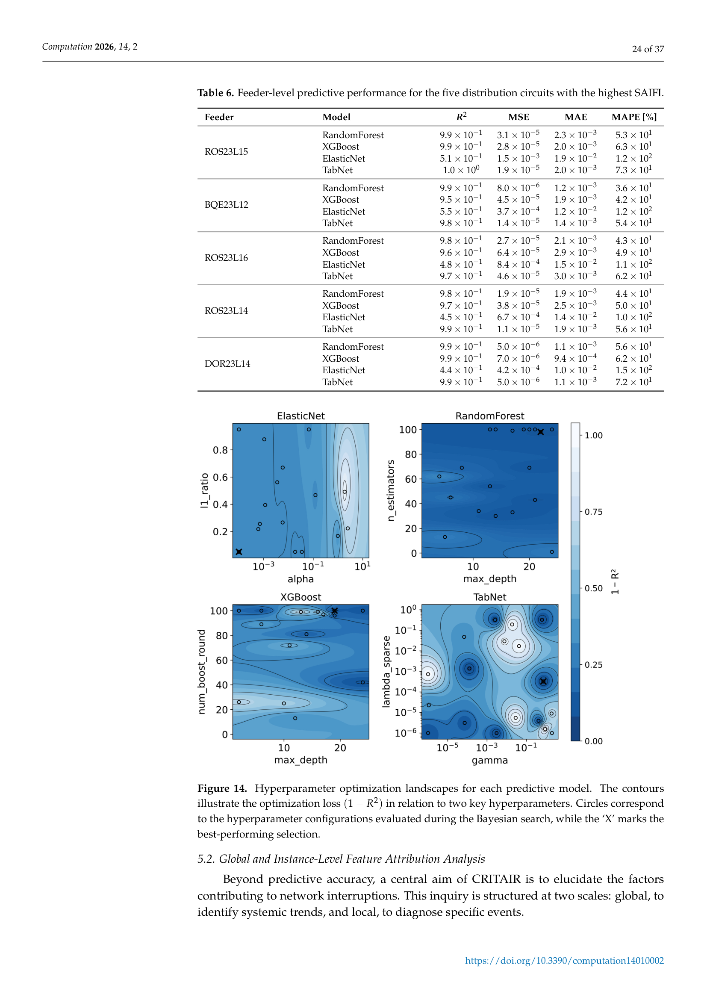

### Extraction assessment
- **Confidence:** 0.65 (below the configured 0.85 threshold; human review required).
- One or more equation candidates are ambiguous in raw extraction. Embedded images require visual review; captions remain page-level text evidence only.

### Raw extracted text
```
Computation 2026, 14, 2
24 of 37
Table 6. Feeder-level predictive performance for the five distribution circuits with the highest SAIFI.
Feeder
Model
R2
MSE
MAE
MAPE [%]
ROS23L15
RandomForest
9.9 × 10−1
3.1 × 10−5
2.3 × 10−3
5.3 × 101
XGBoost
9.9 × 10−1
2.8 × 10−5
2.0 × 10−3
6.3 × 101
ElasticNet
5.1 × 10−1
1.5 × 10−3
1.9 × 10−2
1.2 × 102
TabNet
1.0 × 100
1.9 × 10−5
2.0 × 10−3
7.3 × 101
BQE23L12
RandomForest
9.9 × 10−1
8.0 × 10−6
1.2 × 10−3
3.6 × 101
XGBoost
9.5 × 10−1
4.5 × 10−5
1.9 × 10−3
4.2 × 101
ElasticNet
5.5 × 10−1
3.7 × 10−4
1.2 × 10−2
1.2 × 102
TabNet
9.8 × 10−1
1.4 × 10−5
1.4 × 10−3
5.4 × 101
ROS23L16
RandomForest
9.8 × 10−1
2.7 × 10−5
2.1 × 10−3
4.3 × 101
XGBoost
9.6 × 10−1
6.4 × 10−5
2.9 × 10−3
4.9 × 101
ElasticNet
4.8 × 10−1
8.4 × 10−4
1.5 × 10−2
1.1 × 102
TabNet
9.7 × 10−1
4.6 × 10−5
3.0 × 10−3
6.2 × 101
ROS23L14
RandomForest
9.8 × 10−1
1.9 × 10−5
1.9 × 10−3
4.4 × 101
XGBoost
9.7 × 10−1
3.8 × 10−5
2.5 × 10−3
5.0 × 101
ElasticNet
4.5 × 10−1
6.7 × 10−4
1.4 × 10−2
1.0 × 102
TabNet
9.9 × 10−1
1.1 × 10−5
1.9 × 10−3
5.6 × 101
DOR23L14
RandomForest
9.9 × 10−1
5.0 × 10−6
1.1 × 10−3
5.6 × 101
XGBoost
9.9 × 10−1
7.0 × 10−6
9.4 × 10−4
6.2 × 101
ElasticNet
4.4 × 10−1
4.2 × 10−4
1.0 × 10−2
1.5 × 102
TabNet
9.9 × 10−1
5.0 × 10−6
1.1 × 10−3
7.2 × 101
Figure 14. Hyperparameter optimization landscapes for each predictive model. The contours
illustrate the optimization loss (1 −R2) in relation to two key hyperparameters. Circles correspond
to the hyperparameter configurations evaluated during the Bayesian search, while the ‘X’ marks the
best-performing selection.
5.2. Global and Instance-Level Feature Attribution Analysis
Beyond predictive accuracy, a central aim of CRITAIR is to elucidate the factors
contributing to network interruptions. This inquiry is structured at two scales: global, to
identify systemic trends, and local, to diagnose specific events.
https://doi.org/10.3390/computation14010002

```

### Textual figure-caption evidence
- Figure 14. Hyperparameter optimization landscapes for each predictive model. The contours
- Captions are page-level text evidence and are not associated with embedded images.

### Equation candidates
- `page-024-equation-001` — review_required (confidence 0.45; page 24).
```
9.9 × 10−1
```
- `page-024-equation-002` — review_required (confidence 0.45; page 24).
```
3.1 × 10−5
```
- `page-024-equation-003` — review_required (confidence 0.45; page 24).
```
2.3 × 10−3
```
- `page-024-equation-004` — review_required (confidence 0.45; page 24).
```
5.3 × 101
```
- `page-024-equation-005` — review_required (confidence 0.45; page 24).
```
9.9 × 10−1
```
- `page-024-equation-006` — review_required (confidence 0.45; page 24).
```
2.8 × 10−5
```
- `page-024-equation-007` — review_required (confidence 0.45; page 24).
```
2.0 × 10−3
```
- `page-024-equation-008` — review_required (confidence 0.45; page 24).
```
6.3 × 101
```
- `page-024-equation-009` — review_required (confidence 0.45; page 24).
```
5.1 × 10−1
```
- `page-024-equation-010` — review_required (confidence 0.45; page 24).
```
1.5 × 10−3
```
- `page-024-equation-011` — review_required (confidence 0.45; page 24).
```
1.9 × 10−2
```
- `page-024-equation-012` — review_required (confidence 0.45; page 24).
```
1.2 × 102
```
- `page-024-equation-013` — review_required (confidence 0.45; page 24).
```
1.0 × 100
```
- `page-024-equation-014` — review_required (confidence 0.45; page 24).
```
1.9 × 10−5
```
- `page-024-equation-015` — review_required (confidence 0.45; page 24).
```
2.0 × 10−3
```
- `page-024-equation-016` — review_required (confidence 0.45; page 24).
```
7.3 × 101
```
- `page-024-equation-017` — review_required (confidence 0.45; page 24).
```
9.9 × 10−1
```
- `page-024-equation-018` — review_required (confidence 0.45; page 24).
```
8.0 × 10−6
```
- `page-024-equation-019` — review_required (confidence 0.45; page 24).
```
1.2 × 10−3
```
- `page-024-equation-020` — review_required (confidence 0.45; page 24).
```
3.6 × 101
```
- `page-024-equation-021` — review_required (confidence 0.45; page 24).
```
9.5 × 10−1
```
- `page-024-equation-022` — review_required (confidence 0.45; page 24).
```
4.5 × 10−5
```
- `page-024-equation-023` — review_required (confidence 0.45; page 24).
```
1.9 × 10−3
```
- `page-024-equation-024` — review_required (confidence 0.45; page 24).
```
4.2 × 101
```
- `page-024-equation-025` — review_required (confidence 0.45; page 24).
```
5.5 × 10−1
```
- `page-024-equation-026` — review_required (confidence 0.45; page 24).
```
3.7 × 10−4
```
- `page-024-equation-027` — review_required (confidence 0.45; page 24).
```
1.2 × 10−2
```
- `page-024-equation-028` — review_required (confidence 0.45; page 24).
```
1.2 × 102
```
- `page-024-equation-029` — review_required (confidence 0.45; page 24).
```
9.8 × 10−1
```
- `page-024-equation-030` — review_required (confidence 0.45; page 24).
```
1.4 × 10−5
```
- `page-024-equation-031` — review_required (confidence 0.45; page 24).
```
1.4 × 10−3
```
- `page-024-equation-032` — review_required (confidence 0.45; page 24).
```
5.4 × 101
```
- `page-024-equation-033` — review_required (confidence 0.45; page 24).
```
9.8 × 10−1
```
- `page-024-equation-034` — review_required (confidence 0.45; page 24).
```
2.7 × 10−5
```
- `page-024-equation-035` — review_required (confidence 0.45; page 24).
```
2.1 × 10−3
```
- `page-024-equation-036` — review_required (confidence 0.45; page 24).
```
4.3 × 101
```
- `page-024-equation-037` — review_required (confidence 0.45; page 24).
```
9.6 × 10−1
```
- `page-024-equation-038` — review_required (confidence 0.45; page 24).
```
6.4 × 10−5
```
- `page-024-equation-039` — review_required (confidence 0.45; page 24).
```
2.9 × 10−3
```
- `page-024-equation-040` — review_required (confidence 0.45; page 24).
```
4.9 × 101
```
- `page-024-equation-041` — review_required (confidence 0.45; page 24).
```
4.8 × 10−1
```
- `page-024-equation-042` — review_required (confidence 0.45; page 24).
```
8.4 × 10−4
```
- `page-024-equation-043` — review_required (confidence 0.45; page 24).
```
1.5 × 10−2
```
- `page-024-equation-044` — review_required (confidence 0.45; page 24).
```
1.1 × 102
```
- `page-024-equation-045` — review_required (confidence 0.45; page 24).
```
9.7 × 10−1
```
- `page-024-equation-046` — review_required (confidence 0.45; page 24).
```
4.6 × 10−5
```
- `page-024-equation-047` — review_required (confidence 0.45; page 24).
```
3.0 × 10−3
```
- `page-024-equation-048` — review_required (confidence 0.45; page 24).
```
6.2 × 101
```
- `page-024-equation-049` — review_required (confidence 0.45; page 24).
```
9.8 × 10−1
```
- `page-024-equation-050` — review_required (confidence 0.45; page 24).
```
1.9 × 10−5
```
- `page-024-equation-051` — review_required (confidence 0.45; page 24).
```
1.9 × 10−3
```
- `page-024-equation-052` — review_required (confidence 0.45; page 24).
```
4.4 × 101
```
- `page-024-equation-053` — review_required (confidence 0.45; page 24).
```
9.7 × 10−1
```
- `page-024-equation-054` — review_required (confidence 0.45; page 24).
```
3.8 × 10−5
```
- `page-024-equation-055` — review_required (confidence 0.45; page 24).
```
2.5 × 10−3
```
- `page-024-equation-056` — review_required (confidence 0.45; page 24).
```
5.0 × 101
```
- `page-024-equation-057` — review_required (confidence 0.45; page 24).
```
4.5 × 10−1
```
- `page-024-equation-058` — review_required (confidence 0.45; page 24).
```
6.7 × 10−4
```
- `page-024-equation-059` — review_required (confidence 0.45; page 24).
```
1.4 × 10−2
```
- `page-024-equation-060` — review_required (confidence 0.45; page 24).
```
1.0 × 102
```
- `page-024-equation-061` — review_required (confidence 0.45; page 24).
```
9.9 × 10−1
```
- `page-024-equation-062` — review_required (confidence 0.45; page 24).
```
1.1 × 10−5
```
- `page-024-equation-063` — review_required (confidence 0.45; page 24).
```
1.9 × 10−3
```
- `page-024-equation-064` — review_required (confidence 0.45; page 24).
```
5.6 × 101
```
- `page-024-equation-065` — review_required (confidence 0.45; page 24).
```
9.9 × 10−1
```
- `page-024-equation-066` — review_required (confidence 0.45; page 24).
```
5.0 × 10−6
```
- `page-024-equation-067` — review_required (confidence 0.45; page 24).
```
1.1 × 10−3
```
- `page-024-equation-068` — review_required (confidence 0.45; page 24).
```
5.6 × 101
```
- `page-024-equation-069` — review_required (confidence 0.45; page 24).
```
9.9 × 10−1
```
- `page-024-equation-070` — review_required (confidence 0.45; page 24).
```
7.0 × 10−6
```
- `page-024-equation-071` — review_required (confidence 0.45; page 24).
```
9.4 × 10−4
```
- `page-024-equation-072` — review_required (confidence 0.45; page 24).
```
6.2 × 101
```
- `page-024-equation-073` — review_required (confidence 0.45; page 24).
```
4.4 × 10−1
```
- `page-024-equation-074` — review_required (confidence 0.45; page 24).
```
4.2 × 10−4
```
- `page-024-equation-075` — review_required (confidence 0.45; page 24).
```
1.0 × 10−2
```
- `page-024-equation-076` — review_required (confidence 0.45; page 24).
```
1.5 × 102
```
- `page-024-equation-077` — review_required (confidence 0.45; page 24).
```
9.9 × 10−1
```
- `page-024-equation-078` — review_required (confidence 0.45; page 24).
```
5.0 × 10−6
```
- `page-024-equation-079` — review_required (confidence 0.45; page 24).
```
1.1 × 10−3
```
- `page-024-equation-080` — review_required (confidence 0.45; page 24).
```
7.2 × 101
```

### Embedded images
- `page-024-image-001` — embedded image metadata: 2700 × 2250 px, xref 856; visual review required.

## Page 25
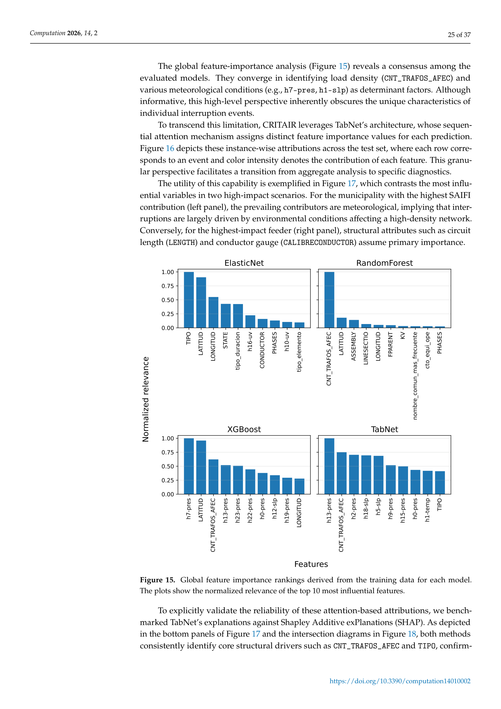

### Extraction assessment
- **Confidence:** 0.65 (below the configured 0.85 threshold; human review required).
- One or more equation candidates are ambiguous in raw extraction.

### Raw extracted text
```
Computation 2026, 14, 2
25 of 37
The global feature-importance analysis (Figure 15) reveals a consensus among the
evaluated models. They converge in identifying load density (CNT_TRAFOS_AFEC) and
various meteorological conditions (e.g., h7-pres, h1-slp) as determinant factors. Although
informative, this high-level perspective inherently obscures the unique characteristics of
individual interruption events.
To transcend this limitation, CRITAIR leverages TabNet’s architecture, whose sequen-
tial attention mechanism assigns distinct feature importance values for each prediction.
Figure 16 depicts these instance-wise attributions across the test set, where each row corre-
sponds to an event and color intensity denotes the contribution of each feature. This granu-
lar perspective facilitates a transition from aggregate analysis to specific diagnostics.
The utility of this capability is exemplified in Figure 17, which contrasts the most influ-
ential variables in two high-impact scenarios. For the municipality with the highest SAIFI
contribution (left panel), the prevailing contributors are meteorological, implying that inter-
ruptions are largely driven by environmental conditions affecting a high-density network.
Conversely, for the highest-impact feeder (right panel), structural attributes such as circuit
length (LENGTH) and conductor gauge (CALIBRECONDUCTOR) assume primary importance.
TIPO
LATITUD
LONGITUD
STATE
tipo_duracion
h16-uv
CONDUCTOR
PHASES
h10-uv
tipo_elemento
0.00
0.25
0.50
0.75
1.00
ElasticNet
CNT_TRAFOS_AFEC
LATITUD
ASSEMBLY
LINESECTIO
LONGITUD
FPARENT
KV
nombre_comun_mas_frecuente
cto_equi_ope
PHASES
RandomForest
h7-pres
LATITUD
CNT_TRAFOS_AFEC
h13-pres
h23-pres
h22-pres
h0-pres
h12-slp
h19-pres
LONGITUD
0.00
0.25
0.50
0.75
1.00
XGBoost
h13-pres
CNT_TRAFOS_AFEC
h2-pres
h18-slp
h5-slp
h9-pres
h15-pres
h0-pres
h1-temp
TIPO
TabNet
Features
Normalized relevance
Figure 15. Global feature importance rankings derived from the training data for each model.
The plots show the normalized relevance of the top 10 most influential features.
To explicitly validate the reliability of these attention-based attributions, we bench-
marked TabNet’s explanations against Shapley Additive exPlanations (SHAP). As depicted
in the bottom panels of Figure 17 and the intersection diagrams in Figure 18, both methods
consistently identify core structural drivers such as CNT_TRAFOS_AFEC and TIPO, confirm-
https://doi.org/10.3390/computation14010002

```

### Textual figure-caption evidence
- Figure 15. Global feature importance rankings derived from the training data for each model.
- Captions are page-level text evidence and are not associated with embedded images.

### Equation candidates
- `page-025-equation-001` — review_required (confidence 0.45; page 25).
```
evaluated models. They converge in identifying load density (CNT_TRAFOS_AFEC) and
```
- `page-025-equation-002` — review_required (confidence 0.45; page 25).
```
tipo_duracion
```
- `page-025-equation-003` — review_required (confidence 0.45; page 25).
```
tipo_elemento
```
- `page-025-equation-004` — review_required (confidence 0.45; page 25).
```
CNT_TRAFOS_AFEC
```
- `page-025-equation-005` — review_required (confidence 0.45; page 25).
```
nombre_comun_mas_frecuente
```
- `page-025-equation-006` — review_required (confidence 0.45; page 25).
```
cto_equi_ope
```
- `page-025-equation-007` — review_required (confidence 0.45; page 25).
```
CNT_TRAFOS_AFEC
```
- `page-025-equation-008` — review_required (confidence 0.45; page 25).
```
CNT_TRAFOS_AFEC
```
- `page-025-equation-009` — review_required (confidence 0.45; page 25).
```
consistently identify core structural drivers such as CNT_TRAFOS_AFEC and TIPO, confirm-
```

## Page 26
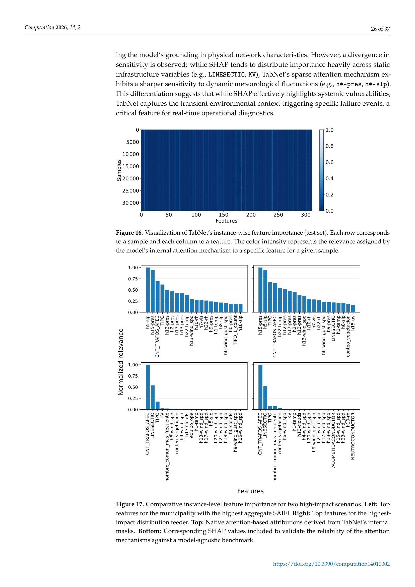

### Extraction assessment
- **Confidence:** 0.65 (below the configured 0.85 threshold; human review required).
- One or more equation candidates are ambiguous in raw extraction. Embedded images require visual review; captions remain page-level text evidence only.

### Raw extracted text
```
Computation 2026, 14, 2
26 of 37
ing the model’s grounding in physical network characteristics. However, a divergence in
sensitivity is observed: while SHAP tends to distribute importance heavily across static
infrastructure variables (e.g., LINESECTIO, KV), TabNet’s sparse attention mechanism ex-
hibits a sharper sensitivity to dynamic meteorological fluctuations (e.g., h*-pres, h*-slp).
This differentiation suggests that while SHAP effectively highlights systemic vulnerabilities,
TabNet captures the transient environmental context triggering specific failure events, a
critical feature for real-time operational diagnostics.
Figure 16. Visualization of TabNet’s instance-wise feature importance (test set). Each row corresponds
to a sample and each column to a feature. The color intensity represents the relevance assigned by
the model’s internal attention mechanism to a specific feature for a given sample.
h5-slp
h15-pres
CNT_TRAFOS_AFEC
TIPO
h12-pres
h2-pres
h17-pres
h13-pres
h22-temp
h13-wind_spd
h10-rh
h7-vis
h22-rh
h9-pres
h1-temp
h8-slp
h6-wind_gust_spd
h0-pres
TIPO_1_count
h18-slp
0.00
0.25
0.50
0.75
1.00
h15-pres
h5-slp
TIPO
CNT_TRAFOS_AFEC
h22-temp
h12-pres
h17-pres
h2-pres
h13-pres
h13-wind_spd
h10-rh
h7-vis
h22-rh
h6-wind_gust_spd
h9-pres
LINESECTIO
h1-temp
h8-slp
conteo_vegetacion
h15-uv
CNT_TRAFOS_AFEC
LINESECTIO
TIPO
KV
nombre_comun_mas_frecuente
h6-wind_spd
conteo_vegetacion
h4-wind_spd
h13-clouds
equipo_ope
h1-temp
h13-wind_spd
h17-wind_spd
h5-slp
h20-wind_spd
h21-wind_spd
h18-wind_spd
h0-clouds
h9-wind_gust_spd
h15-wind_spd
0.00
0.25
0.50
0.75
1.00
CNT_TRAFOS_AFEC
LINESECTIO
TIPO
nombre_comun_mas_frecuente
conteo_vegetacion
h6-wind_spd
KV
h1-temp
h13-clouds
h4-wind_spd
h20-wind_spd
h9-wind_gust_spd
h21-wind_spd
h17-wind_spd
h13-wind_spd
ACOMETIDACONDUCTOR
h15-wind_spd
h23-wind_spd
h10-rh
NEUTROCONDUCTOR
Normalized relevance
Features
Figure 17. Comparative instance-level feature importance for two high-impact scenarios. Left: Top
features for the municipality with the highest aggregate SAIFI. Right: Top features for the highest-
impact distribution feeder. Top: Native attention-based attributions derived from TabNet’s internal
masks. Bottom: Corresponding SHAP values included to validate the reliability of the attention
mechanisms against a model-agnostic benchmark.
https://doi.org/10.3390/computation14010002

```

### Textual figure-caption evidence
- Figure 16. Visualization of TabNet’s instance-wise feature importance (test set). Each row corresponds
- Figure 17. Comparative instance-level feature importance for two high-impact scenarios. Left: Top
- Captions are page-level text evidence and are not associated with embedded images.

### Equation candidates
- `page-026-equation-001` — review_required (confidence 0.45; page 26).
```
CNT_TRAFOS_AFEC
```
- `page-026-equation-002` — review_required (confidence 0.45; page 26).
```
h13-wind_spd
```
- `page-026-equation-003` — review_required (confidence 0.45; page 26).
```
h6-wind_gust_spd
```
- `page-026-equation-004` — review_required (confidence 0.45; page 26).
```
TIPO_1_count
```
- `page-026-equation-005` — review_required (confidence 0.45; page 26).
```
CNT_TRAFOS_AFEC
```
- `page-026-equation-006` — review_required (confidence 0.45; page 26).
```
h13-wind_spd
```
- `page-026-equation-007` — review_required (confidence 0.45; page 26).
```
h6-wind_gust_spd
```
- `page-026-equation-008` — review_required (confidence 0.45; page 26).
```
conteo_vegetacion
```
- `page-026-equation-009` — review_required (confidence 0.45; page 26).
```
CNT_TRAFOS_AFEC
```
- `page-026-equation-010` — review_required (confidence 0.45; page 26).
```
nombre_comun_mas_frecuente
```
- `page-026-equation-011` — review_required (confidence 0.45; page 26).
```
h6-wind_spd
```
- `page-026-equation-012` — review_required (confidence 0.45; page 26).
```
conteo_vegetacion
```
- `page-026-equation-013` — review_required (confidence 0.45; page 26).
```
h4-wind_spd
```
- `page-026-equation-014` — review_required (confidence 0.45; page 26).
```
equipo_ope
```
- `page-026-equation-015` — review_required (confidence 0.45; page 26).
```
h13-wind_spd
```
- `page-026-equation-016` — review_required (confidence 0.45; page 26).
```
h17-wind_spd
```
- `page-026-equation-017` — review_required (confidence 0.45; page 26).
```
h20-wind_spd
```
- `page-026-equation-018` — review_required (confidence 0.45; page 26).
```
h21-wind_spd
```
- `page-026-equation-019` — review_required (confidence 0.45; page 26).
```
h18-wind_spd
```
- `page-026-equation-020` — review_required (confidence 0.45; page 26).
```
h9-wind_gust_spd
```
- `page-026-equation-021` — review_required (confidence 0.45; page 26).
```
h15-wind_spd
```
- `page-026-equation-022` — review_required (confidence 0.45; page 26).
```
CNT_TRAFOS_AFEC
```
- `page-026-equation-023` — review_required (confidence 0.45; page 26).
```
nombre_comun_mas_frecuente
```
- `page-026-equation-024` — review_required (confidence 0.45; page 26).
```
conteo_vegetacion
```
- `page-026-equation-025` — review_required (confidence 0.45; page 26).
```
h6-wind_spd
```
- `page-026-equation-026` — review_required (confidence 0.45; page 26).
```
h4-wind_spd
```
- `page-026-equation-027` — review_required (confidence 0.45; page 26).
```
h20-wind_spd
```
- `page-026-equation-028` — review_required (confidence 0.45; page 26).
```
h9-wind_gust_spd
```
- `page-026-equation-029` — review_required (confidence 0.45; page 26).
```
h21-wind_spd
```
- `page-026-equation-030` — review_required (confidence 0.45; page 26).
```
h17-wind_spd
```
- `page-026-equation-031` — review_required (confidence 0.45; page 26).
```
h13-wind_spd
```
- `page-026-equation-032` — review_required (confidence 0.45; page 26).
```
h15-wind_spd
```
- `page-026-equation-033` — review_required (confidence 0.45; page 26).
```
h23-wind_spd
```

### Embedded images
- `page-026-image-001` — embedded image metadata: 3300 × 1500 px, xref 948; visual review required.

## Page 27
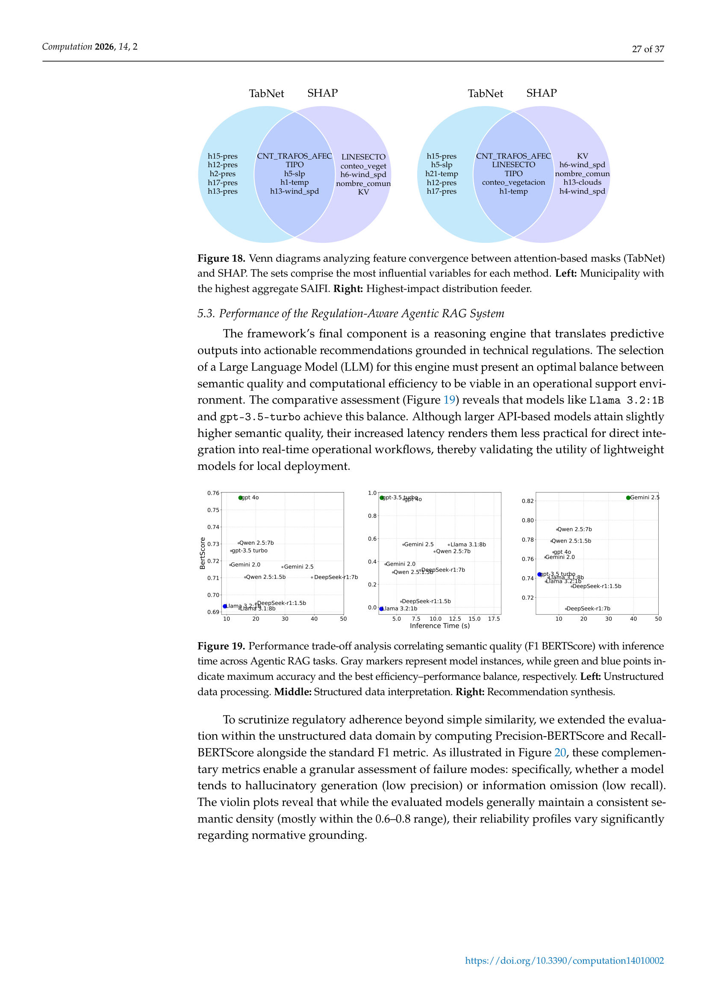

### Extraction assessment
- **Confidence:** 0.65 (below the configured 0.85 threshold; human review required).
- One or more equation candidates are ambiguous in raw extraction.

### Raw extracted text
```
Computation 2026, 14, 2
27 of 37
TabNet
SHAP
h15-pres
h12-pres
h2-pres
h17-pres
h13-pres
LINESECTO
conteo_veget
h6-wind_spd
nombre_comun
KV
CNT_TRAFOS_AFEC
TIPO
h5-slp
h1-temp
h13-wind_spd
TabNet
SHAP
h15-pres
h5-slp
h21-temp
h12-pres
h17-pres
KV
h6-wind_spd
nombre_comun
h13-clouds
h4-wind_spd
CNT_TRAFOS_AFEC
LINESECTO
TIPO
conteo_vegetacion
h1-temp
Figure 18. Venn diagrams analyzing feature convergence between attention-based masks (TabNet)
and SHAP. The sets comprise the most influential variables for each method. Left: Municipality with
the highest aggregate SAIFI. Right: Highest-impact distribution feeder.
5.3. Performance of the Regulation-Aware Agentic RAG System
The framework’s final component is a reasoning engine that translates predictive
outputs into actionable recommendations grounded in technical regulations. The selection
of a Large Language Model (LLM) for this engine must present an optimal balance between
semantic quality and computational efficiency to be viable in an operational support envi-
ronment. The comparative assessment (Figure 19) reveals that models like Llama 3.2:1B
and gpt-3.5-turbo achieve this balance. Although larger API-based models attain slightly
higher semantic quality, their increased latency renders them less practical for direct inte-
gration into real-time operational workflows, thereby validating the utility of lightweight
models for local deployment.
10
20
30
40
50
0.69
0.70
0.71
0.72
0.73
0.74
0.75
0.76
BertScore
gpt-3.5 turbo
gpt 4o
Gemini 2.0
Gemini 2.5
Llama 3.1:8b
Llama 3.2:1b
Qwen 2.5:1.5b
Qwen 2.5:7b
DeepSeek-r1:7b
DeepSeek-r1:1.5b
5.0
7.5
10.0
12.5
15.0
17.5
Inference Time (s)
0.0
0.2
0.4
0.6
0.8
1.0
gpt-3.5 turbo
gpt 4o
Gemini 2.0
Gemini 2.5
Llama 3.1:8b
Llama 3.2:1b
Qwen 2.5:1.5b
Qwen 2.5:7b
DeepSeek-r1:7b
DeepSeek-r1:1.5b
10
20
30
40
50
0.72
0.74
0.76
0.78
0.80
0.82
gpt-3.5 turbo
gpt 4o
Gemini 2.0
Gemini 2.5
Llama 3.1:8b
Llama 3.2:1b
Qwen 2.5:1.5b
Qwen 2.5:7b
DeepSeek-r1:7b
DeepSeek-r1:1.5b
Figure 19. Performance trade-off analysis correlating semantic quality (F1 BERTScore) with inference
time across Agentic RAG tasks. Gray markers represent model instances, while green and blue points in-
dicate maximum accuracy and the best efficiency–performance balance, respectively. Left: Unstructured
data processing. Middle: Structured data interpretation. Right: Recommendation synthesis.
To scrutinize regulatory adherence beyond simple similarity, we extended the evalua-
tion within the unstructured data domain by computing Precision-BERTScore and Recall-
BERTScore alongside the standard F1 metric. As illustrated in Figure 20, these complemen-
tary metrics enable a granular assessment of failure modes: specifically, whether a model
tends to hallucinatory generation (low precision) or information omission (low recall).
The violin plots reveal that while the evaluated models generally maintain a consistent se-
mantic density (mostly within the 0.6–0.8 range), their reliability profiles vary significantly
regarding normative grounding.
https://doi.org/10.3390/computation14010002

```

### Textual figure-caption evidence
- Figure 18. Venn diagrams analyzing feature convergence between attention-based masks (TabNet)
- Figure 19. Performance trade-off analysis correlating semantic quality (F1 BERTScore) with inference
- Captions are page-level text evidence and are not associated with embedded images.

### Equation candidates
- `page-027-equation-001` — review_required (confidence 0.45; page 27).
```
conteo_veget
```
- `page-027-equation-002` — review_required (confidence 0.45; page 27).
```
h6-wind_spd
```
- `page-027-equation-003` — review_required (confidence 0.45; page 27).
```
nombre_comun
```
- `page-027-equation-004` — review_required (confidence 0.45; page 27).
```
CNT_TRAFOS_AFEC
```
- `page-027-equation-005` — review_required (confidence 0.45; page 27).
```
h13-wind_spd
```
- `page-027-equation-006` — review_required (confidence 0.45; page 27).
```
h6-wind_spd
```
- `page-027-equation-007` — review_required (confidence 0.45; page 27).
```
nombre_comun
```
- `page-027-equation-008` — review_required (confidence 0.45; page 27).
```
h4-wind_spd
```
- `page-027-equation-009` — review_required (confidence 0.45; page 27).
```
CNT_TRAFOS_AFEC
```
- `page-027-equation-010` — review_required (confidence 0.45; page 27).
```
conteo_vegetacion
```

## Page 28
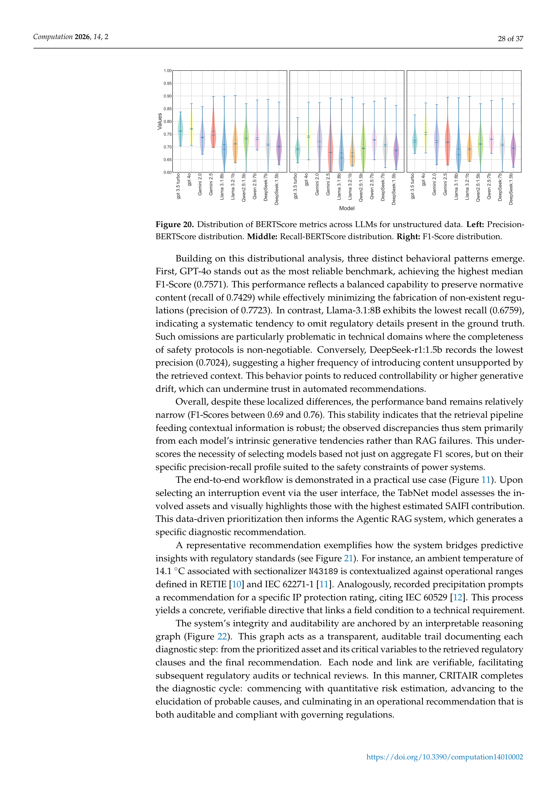

### Extraction assessment
- **Confidence:** 0.95 (meets the configured threshold).
- Machine-readable text was preserved with page-image provenance.

### Raw extracted text
```
Computation 2026, 14, 2
28 of 37
gpt 3.5 turbo
gpt 4o
Gemini 2.0
Gemini 2.5
Llama 3.1:8b
Llama 3.2:1b
Qwen2.5:1.5b
Qwen 2.5:7b
DeepSeek:7b
DeepSeek:1.5b
0.60
0.65
0.70
0.75
0.80
0.85
0.90
0.95
1.00
Values
gpt 3.5 turbo
gpt 4o
Gemini 2.0
Gemini 2.5
Llama 3.1:8b
Llama 3.2:1b
Qwen2.5:1.5b
Qwen 2.5:7b
DeepSeek:7b
DeepSeek:1.5b
Model
gpt 3.5 turbo
gpt 4o
Gemini 2.0
Gemini 2.5
Llama 3.1:8b
Llama 3.2:1b
Qwen2.5:1.5b
Qwen 2.5:7b
DeepSeek:7b
DeepSeek:1.5b
Figure 20. Distribution of BERTScore metrics across LLMs for unstructured data. Left: Precision-
BERTScore distribution. Middle: Recall-BERTScore distribution. Right: F1-Score distribution.
Building on this distributional analysis, three distinct behavioral patterns emerge.
First, GPT-4o stands out as the most reliable benchmark, achieving the highest median
F1-Score (0.7571). This performance reflects a balanced capability to preserve normative
content (recall of 0.7429) while effectively minimizing the fabrication of non-existent regu-
lations (precision of 0.7723). In contrast, Llama-3.1:8B exhibits the lowest recall (0.6759),
indicating a systematic tendency to omit regulatory details present in the ground truth.
Such omissions are particularly problematic in technical domains where the completeness
of safety protocols is non-negotiable. Conversely, DeepSeek-r1:1.5b records the lowest
precision (0.7024), suggesting a higher frequency of introducing content unsupported by
the retrieved context. This behavior points to reduced controllability or higher generative
drift, which can undermine trust in automated recommendations.
Overall, despite these localized differences, the performance band remains relatively
narrow (F1-Scores between 0.69 and 0.76). This stability indicates that the retrieval pipeline
feeding contextual information is robust; the observed discrepancies thus stem primarily
from each model’s intrinsic generative tendencies rather than RAG failures. This under-
scores the necessity of selecting models based not just on aggregate F1 scores, but on their
specific precision-recall profile suited to the safety constraints of power systems.
The end-to-end workflow is demonstrated in a practical use case (Figure 11). Upon
selecting an interruption event via the user interface, the TabNet model assesses the in-
volved assets and visually highlights those with the highest estimated SAIFI contribution.
This data-driven prioritization then informs the Agentic RAG system, which generates a
specific diagnostic recommendation.
A representative recommendation exemplifies how the system bridges predictive
insights with regulatory standards (see Figure 21). For instance, an ambient temperature of
14.1 ◦C associated with sectionalizer N43189 is contextualized against operational ranges
defined in RETIE [10] and IEC 62271-1 [11]. Analogously, recorded precipitation prompts
a recommendation for a specific IP protection rating, citing IEC 60529 [12]. This process
yields a concrete, verifiable directive that links a field condition to a technical requirement.
The system’s integrity and auditability are anchored by an interpretable reasoning
graph (Figure 22). This graph acts as a transparent, auditable trail documenting each
diagnostic step: from the prioritized asset and its critical variables to the retrieved regulatory
clauses and the final recommendation. Each node and link are verifiable, facilitating
subsequent regulatory audits or technical reviews. In this manner, CRITAIR completes
the diagnostic cycle: commencing with quantitative risk estimation, advancing to the
elucidation of probable causes, and culminating in an operational recommendation that is
both auditable and compliant with governing regulations.
https://doi.org/10.3390/computation14010002

```

### Textual figure-caption evidence
- Figure 20. Distribution of BERTScore metrics across LLMs for unstructured data. Left: Precision-
- Captions are page-level text evidence and are not associated with embedded images.

## Page 29
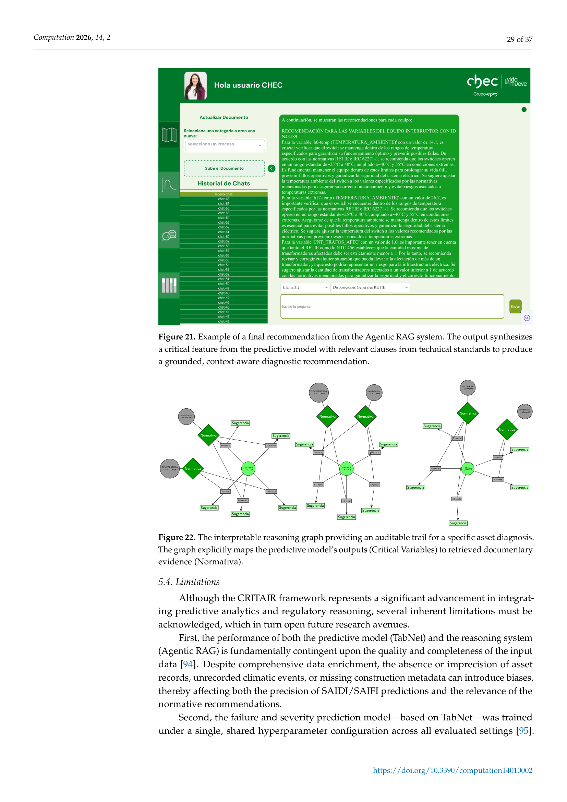

### Extraction assessment
- **Confidence:** 0.65 (below the configured 0.85 threshold; human review required).
- One or more equation candidates are ambiguous in raw extraction. Embedded images require visual review; captions remain page-level text evidence only.

### Raw extracted text
```
Computation 2026, 14, 2
29 of 37
Figure 21. Example of a final recommendation from the Agentic RAG system. The output synthesizes
a critical feature from the predictive model with relevant clauses from technical standards to produce
a grounded, context-aware diagnostic recommendation.
interruptor
_N43189
h0-precip
h19-precip
h17-temp
h6-temp
h6-precip
Normativa
precipitacion
_SWITCHES
Normativa
TEMPERATURA
_SWITCHES
Sugerencia
Sugerencia
Sugerencia
Sugerencia
Sugerencia
interruptor
_N43812
h17-temp
h6-temp
h0-precip
h19-precip
h6-precip
Normativa
TEMPERATURA
_SWITCHES
Normativa
precipitacion
_SWITCHES
Sugerencia
Sugerencia
Sugerencia
Sugerencia
Sugerencia
apoyo
_N43267
h19-precip
h0-precip
h6-precip
h6-temp
h17-temp
Normativa
precipitacion
_APOYOS
Normativa
temperatura
_APOYOS
Sugerencia
Sugerencia
Sugerencia
Sugerencia
Sugerencia
Figure 22. The interpretable reasoning graph providing an auditable trail for a specific asset diagnosis.
The graph explicitly maps the predictive model’s outputs (Critical Variables) to retrieved documentary
evidence (Normativa).
5.4. Limitations
Although the CRITAIR framework represents a significant advancement in integrat-
ing predictive analytics and regulatory reasoning, several inherent limitations must be
acknowledged, which in turn open future research avenues.
First, the performance of both the predictive model (TabNet) and the reasoning system
(Agentic RAG) is fundamentally contingent upon the quality and completeness of the input
data [94]. Despite comprehensive data enrichment, the absence or imprecision of asset
records, unrecorded climatic events, or missing construction metadata can introduce biases,
thereby affecting both the precision of SAIDI/SAIFI predictions and the relevance of the
normative recommendations.
Second, the failure and severity prediction model—based on TabNet—was trained
under a single, shared hyperparameter configuration across all evaluated settings [95].
https://doi.org/10.3390/computation14010002

```

### Textual figure-caption evidence
- Figure 21. Example of a final recommendation from the Agentic RAG system. The output synthesizes
- Figure 22. The interpretable reasoning graph providing an auditable trail for a specific asset diagnosis.
- Captions are page-level text evidence and are not associated with embedded images.

### Equation candidates
- `page-029-equation-001` — review_required (confidence 0.45; page 29).
```
_N43189
```
- `page-029-equation-002` — review_required (confidence 0.45; page 29).
```
_SWITCHES
```
- `page-029-equation-003` — review_required (confidence 0.45; page 29).
```
_SWITCHES
```
- `page-029-equation-004` — review_required (confidence 0.45; page 29).
```
_N43812
```
- `page-029-equation-005` — review_required (confidence 0.45; page 29).
```
_SWITCHES
```
- `page-029-equation-006` — review_required (confidence 0.45; page 29).
```
_SWITCHES
```
- `page-029-equation-007` — review_required (confidence 0.45; page 29).
```
_N43267
```
- `page-029-equation-008` — review_required (confidence 0.45; page 29).
```
_APOYOS
```
- `page-029-equation-009` — review_required (confidence 0.45; page 29).
```
_APOYOS
```

### Embedded images
- `page-029-image-001` — embedded image metadata: 4637 × 3183 px, xref 1085; visual review required.

## Page 30
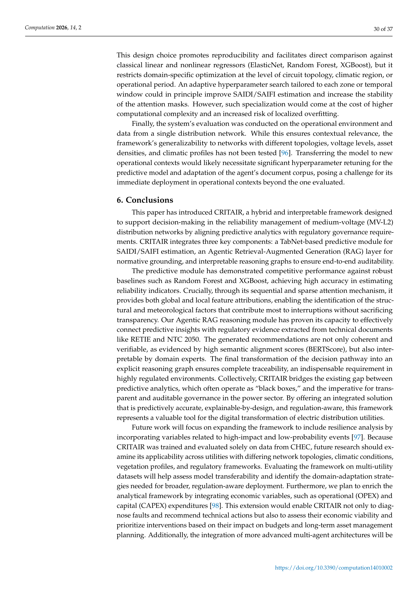

### Extraction assessment
- **Confidence:** 0.95 (meets the configured threshold).
- Machine-readable text was preserved with page-image provenance.

### Raw extracted text
```
Computation 2026, 14, 2
30 of 37
This design choice promotes reproducibility and facilitates direct comparison against
classical linear and nonlinear regressors (ElasticNet, Random Forest, XGBoost), but it
restricts domain-specific optimization at the level of circuit topology, climatic region, or
operational period. An adaptive hyperparameter search tailored to each zone or temporal
window could in principle improve SAIDI/SAIFI estimation and increase the stability
of the attention masks. However, such specialization would come at the cost of higher
computational complexity and an increased risk of localized overfitting.
Finally, the system’s evaluation was conducted on the operational environment and
data from a single distribution network. While this ensures contextual relevance, the
framework’s generalizability to networks with different topologies, voltage levels, asset
densities, and climatic profiles has not been tested [96]. Transferring the model to new
operational contexts would likely necessitate significant hyperparameter retuning for the
predictive model and adaptation of the agent’s document corpus, posing a challenge for its
immediate deployment in operational contexts beyond the one evaluated.
6. Conclusions
This paper has introduced CRITAIR, a hybrid and interpretable framework designed
to support decision-making in the reliability management of medium-voltage (MV-L2)
distribution networks by aligning predictive analytics with regulatory governance require-
ments. CRITAIR integrates three key components: a TabNet-based predictive module for
SAIDI/SAIFI estimation, an Agentic Retrieval-Augmented Generation (RAG) layer for
normative grounding, and interpretable reasoning graphs to ensure end-to-end auditability.
The predictive module has demonstrated competitive performance against robust
baselines such as Random Forest and XGBoost, achieving high accuracy in estimating
reliability indicators. Crucially, through its sequential and sparse attention mechanism, it
provides both global and local feature attributions, enabling the identification of the struc-
tural and meteorological factors that contribute most to interruptions without sacrificing
transparency. Our Agentic RAG reasoning module has proven its capacity to effectively
connect predictive insights with regulatory evidence extracted from technical documents
like RETIE and NTC 2050. The generated recommendations are not only coherent and
verifiable, as evidenced by high semantic alignment scores (BERTScore), but also inter-
pretable by domain experts. The final transformation of the decision pathway into an
explicit reasoning graph ensures complete traceability, an indispensable requirement in
highly regulated environments. Collectively, CRITAIR bridges the existing gap between
predictive analytics, which often operate as “black boxes,” and the imperative for trans-
parent and auditable governance in the power sector. By offering an integrated solution
that is predictively accurate, explainable-by-design, and regulation-aware, this framework
represents a valuable tool for the digital transformation of electric distribution utilities.
Future work will focus on expanding the framework to include resilience analysis by
incorporating variables related to high-impact and low-probability events [97]. Because
CRITAIR was trained and evaluated solely on data from CHEC, future research should ex-
amine its applicability across utilities with differing network topologies, climatic conditions,
vegetation profiles, and regulatory frameworks. Evaluating the framework on multi-utility
datasets will help assess model transferability and identify the domain-adaptation strate-
gies needed for broader, regulation-aware deployment. Furthermore, we plan to enrich the
analytical framework by integrating economic variables, such as operational (OPEX) and
capital (CAPEX) expenditures [98]. This extension would enable CRITAIR not only to diag-
nose faults and recommend technical actions but also to assess their economic viability and
prioritize interventions based on their impact on budgets and long-term asset management
planning. Additionally, the integration of more advanced multi-agent architectures will be
https://doi.org/10.3390/computation14010002

```

## Page 31
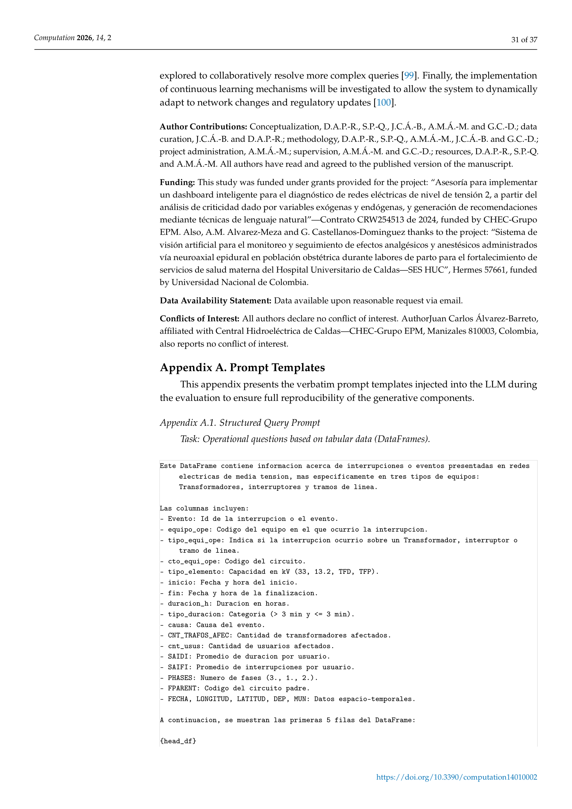

### Extraction assessment
- **Confidence:** 0.65 (below the configured 0.85 threshold; human review required).
- One or more equation candidates are ambiguous in raw extraction.

### Raw extracted text
```
Computation 2026, 14, 2
31 of 37
explored to collaboratively resolve more complex queries [99]. Finally, the implementation
of continuous learning mechanisms will be investigated to allow the system to dynamically
adapt to network changes and regulatory updates [100].
Author Contributions: Conceptualization, D.A.P.-R., S.P.-Q., J.C.Á.-B., A.M.Á.-M. and G.C.-D.; data
curation, J.C.Á.-B. and D.A.P.-R.; methodology, D.A.P.-R., S.P.-Q., A.M.Á.-M., J.C.Á.-B. and G.C.-D.;
project administration, A.M.Á.-M.; supervision, A.M.Á.-M. and G.C.-D.; resources, D.A.P.-R., S.P.-Q.
and A.M.Á.-M. All authors have read and agreed to the published version of the manuscript.
Funding: This study was funded under grants provided for the project: “Asesoría para implementar
un dashboard inteligente para el diagnóstico de redes eléctricas de nivel de tensión 2, a partir del
análisis de criticidad dado por variables exógenas y endógenas, y generación de recomendaciones
mediante técnicas de lenguaje natural”—Contrato CRW254513 de 2024, funded by CHEC-Grupo
EPM. Also, A.M. Alvarez-Meza and G. Castellanos-Dominguez thanks to the project: “Sistema de
visión artificial para el monitoreo y seguimiento de efectos analgésicos y anestésicos administrados
vía neuroaxial epidural en población obstétrica durante labores de parto para el fortalecimiento de
servicios de salud materna del Hospital Universitario de Caldas—SES HUC”, Hermes 57661, funded
by Universidad Nacional de Colombia.
Data Availability Statement: Data available upon reasonable request via email.
Conflicts of Interest: All authors declare no conflict of interest. AuthorJuan Carlos Álvarez-Barreto,
affiliated with Central Hidroeléctrica de Caldas—CHEC-Grupo EPM, Manizales 810003, Colombia,
also reports no conflict of interest.
Appendix A. Prompt Templates
This appendix presents the verbatim prompt templates injected into the LLM during
the evaluation to ensure full reproducibility of the generative components.
Appendix A.1. Structured Query Prompt
Task: Operational questions based on tabular data (DataFrames).
Este DataFrame contiene informacion acerca de interrupciones o eventos presentadas en redes
electricas de media tension, mas especificamente en tres tipos de equipos:
Transformadores, interruptores y tramos de linea.
Las columnas incluyen:
- Evento: Id de la interrupcion o el evento.
- equipo_ope: Codigo del equipo en el que ocurrio la interrupcion.
- tipo_equi_ope: Indica si la interrupcion ocurrio sobre un Transformador, interruptor o
tramo de linea.
- cto_equi_ope: Codigo del circuito.
- tipo_elemento: Capacidad en kV (33, 13.2, TFD, TFP).
- inicio: Fecha y hora del inicio.
- fin: Fecha y hora de la finalizacion.
- duracion_h: Duracion en horas.
- tipo_duracion: Categoria (> 3 min y <= 3 min).
- causa: Causa del evento.
- CNT_TRAFOS_AFEC: Cantidad de transformadores afectados.
- cnt_usus: Cantidad de usuarios afectados.
- SAIDI: Promedio de duracion por usuario.
- SAIFI: Promedio de interrupciones por usuario.
- PHASES: Numero de fases (3., 1., 2.).
- FPARENT: Codigo del circuito padre.
- FECHA, LONGITUD, LATITUD, DEP, MUN: Datos espacio-temporales.
A continuacion, se muestran las primeras 5 filas del DataFrame:
{head_df}
https://doi.org/10.3390/computation14010002

```

### Equation candidates
- `page-031-equation-001` — review_required (confidence 0.45; page 31).
```
- equipo_ope: Codigo del equipo en el que ocurrio la interrupcion.
```
- `page-031-equation-002` — review_required (confidence 0.45; page 31).
```
- tipo_equi_ope: Indica si la interrupcion ocurrio sobre un Transformador, interruptor o
```
- `page-031-equation-003` — review_required (confidence 0.45; page 31).
```
- cto_equi_ope: Codigo del circuito.
```
- `page-031-equation-004` — review_required (confidence 0.45; page 31).
```
- tipo_elemento: Capacidad en kV (33, 13.2, TFD, TFP).
```
- `page-031-equation-005` — review_required (confidence 0.45; page 31).
```
- duracion_h: Duracion en horas.
```
- `page-031-equation-006` — review_required (confidence 0.45; page 31).
```
- tipo_duracion: Categoria (> 3 min y <= 3 min).
```
- `page-031-equation-007` — review_required (confidence 0.45; page 31).
```
- CNT_TRAFOS_AFEC: Cantidad de transformadores afectados.
```
- `page-031-equation-008` — review_required (confidence 0.45; page 31).
```
- cnt_usus: Cantidad de usuarios afectados.
```
- `page-031-equation-009` — review_required (confidence 0.45; page 31).
```
{head_df}
```

## Page 32
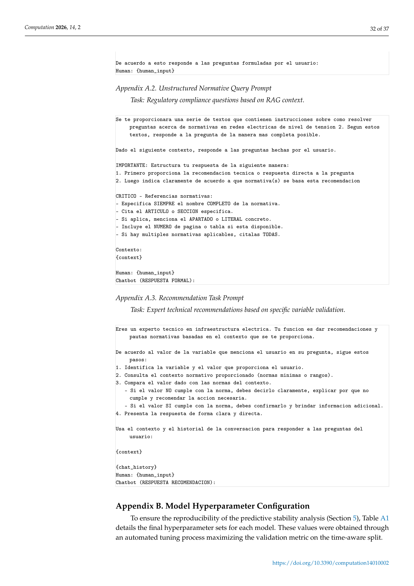

### Extraction assessment
- **Confidence:** 0.65 (below the configured 0.85 threshold; human review required).
- One or more equation candidates are ambiguous in raw extraction.

### Raw extracted text
```
Computation 2026, 14, 2
32 of 37
De acuerdo a esto responde a las preguntas formuladas por el usuario:
Human: {human_input}
Appendix A.2. Unstructured Normative Query Prompt
Task: Regulatory compliance questions based on RAG context.
Se te proporcionara una serie de textos que contienen instrucciones sobre como resolver
preguntas acerca de normativas en redes electricas de nivel de tension 2. Segun estos
textos, responde a la pregunta de la manera mas completa posible.
Dado el siguiente contexto, responde a las preguntas hechas por el usuario.
IMPORTANTE: Estructura tu respuesta de la siguiente manera:
1. Primero proporciona la recomendacion tecnica o respuesta directa a la pregunta
2. Luego indica claramente de acuerdo a que normativa(s) se basa esta recomendacion
CRITICO - Referencias normativas:
- Especifica SIEMPRE el nombre COMPLETO de la normativa.
- Cita el ARTICULO o SECCION especifica.
- Si aplica, menciona el APARTADO o LITERAL concreto.
- Incluye el NUMERO de pagina o tabla si esta disponible.
- Si hay multiples normativas aplicables, citalas TODAS.
Contexto:
{context}
Human: {human_input}
Chatbot (RESPUESTA FORMAL):
Appendix A.3. Recommendation Task Prompt
Task: Expert technical recommendations based on specific variable validation.
Eres un experto tecnico en infraestructura electrica. Tu funcion es dar recomendaciones y
pautas normativas basadas en el contexto que se te proporciona.
De acuerdo al valor de la variable que menciona el usuario en su pregunta, sigue estos
pasos:
1. Identifica la variable y el valor que proporciona el usuario.
2. Consulta el contexto normativo proporcionado (normas minimas o rangos).
3. Compara el valor dado con las normas del contexto.
- Si el valor NO cumple con la norma, debes decirlo claramente, explicar por que no
cumple y recomendar la accion necesaria.
- Si el valor SI cumple con la norma, debes confirmarlo y brindar informacion adicional.
4. Presenta la respuesta de forma clara y directa.
Usa el contexto y el historial de la conversacion para responder a las preguntas del
usuario:
{context}
{chat_history}
Human: {human_input}
Chatbot (RESPUESTA RECOMENDACION):
Appendix B. Model Hyperparameter Configuration
To ensure the reproducibility of the predictive stability analysis (Section 5), Table A1
details the final hyperparameter sets for each model. These values were obtained through
an automated tuning process maximizing the validation metric on the time-aware split.
https://doi.org/10.3390/computation14010002

```

### Equation candidates
- `page-032-equation-001` — review_required (confidence 0.45; page 32).
```
Human: {human_input}
```
- `page-032-equation-002` — review_required (confidence 0.45; page 32).
```
Human: {human_input}
```
- `page-032-equation-003` — review_required (confidence 0.45; page 32).
```
{chat_history}
```
- `page-032-equation-004` — review_required (confidence 0.45; page 32).
```
Human: {human_input}
```

## Page 33
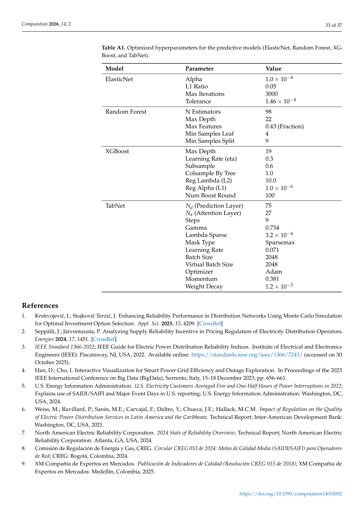

### Extraction assessment
- **Confidence:** 0.65 (below the configured 0.85 threshold; human review required).
- One or more equation candidates are ambiguous in raw extraction.

### Raw extracted text
```
Computation 2026, 14, 2
33 of 37
Table A1. Optimized hyperparameters for the predictive models (ElasticNet, Random Forest, XG-
Boost, and TabNet).
Model
Parameter
Value
ElasticNet
Alpha
1.0 × 10−4
L1 Ratio
0.05
Max Iterations
3000
Tolerance
1.46 × 10−4
Random Forest
N Estimators
98
Max Depth
22
Max Features
0.43 (Fraction)
Min Samples Leaf
4
Min Samples Split
9
XGBoost
Max Depth
19
Learning Rate (eta)
0.3
Subsample
0.6
Colsample By Tree
1.0
Reg Lambda (L2)
10.0
Reg Alpha (L1)
1.0 × 10−6
Num Boost Round
100
TabNet
Nd (Prediction Layer)
75
Na (Attention Layer)
27
Steps
9
Gamma
0.734
Lambda Sparse
3.2 × 10−4
Mask Type
Sparsemax
Learning Rate
0.071
Batch Size
2048
Virtual Batch Size
2048
Optimizer
Adam
Momentum
0.381
Weight Decay
1.2 × 10−3
References
1.
Krstivojevi´c, J.; Stojkovi´c Terzi´c, J. Enhancing Reliability Performance in Distribution Networks Using Monte Carlo Simulation
for Optimal Investment Option Selection. Appl. Sci. 2025, 15, 4209. [CrossRef]
2.
Seppälä, J.; Järventausta, P. Analyzing Supply Reliability Incentive in Pricing Regulation of Electricity Distribution Operators.
Energies 2024, 17, 1451. [CrossRef]
3.
IEEE Standard 1366-2022; IEEE Guide for Electric Power Distribution Reliability Indices. Institute of Electrical and Electronics
Engineers (IEEE): Piscataway, NJ, USA, 2022. Available online: https://standards.ieee.org/ieee/1366/7243/ (accessed on 30
October 2025).
4.
Han, D.; Cho, I. Interactive Visualization for Smart Power Grid Efficiency and Outage Exploration. In Proceedings of the 2023
IEEE International Conference on Big Data (BigData), Sorrento, Italy, 15–18 December 2023; pp. 656–661.
5.
U.S. Energy Information Administration. U.S. Electricity Customers Averaged Five and One-Half Hours of Power Interruptions in 2022;
Explains use of SAIDI/SAIFI and Major Event Days in U.S. reporting; U.S. Energy Information Administration: Washington, DC,
USA, 2024.
6.
Weiss, M.; Ravillard, P.; Sanin, M.E.; Carvajal, F.; Daltro, Y.; Chueca, J.E.; Hallack, M.C.M. Impact of Regulation on the Quality
of Electric Power Distribution Services in Latin America and the Caribbean; Technical Report; Inter-American Development Bank:
Washington, DC, USA, 2021.
7.
North American Electric Reliability Corporation. 2024 State of Reliability Overview; Technical Report; North American Electric
Reliability Corporation: Atlanta, GA, USA, 2024.
8.
Comisión de Regulación de Energía y Gas, CREG. Circular CREG 053 de 2024: Metas de Calidad Media (SAIDI/SAIFI) para Operadores
de Red; CREG: Bogotá, Colombia, 2024.
9.
XM Compañía de Expertos en Mercados. Publicación de Indicadores de Calidad (Resolución CREG 015 de 2018); XM Compañía de
Expertos en Mercados: Medellín, Colombia, 2025.
https://doi.org/10.3390/computation14010002

```

### Equation candidates
- `page-033-equation-001` — review_required (confidence 0.45; page 33).
```
1.0 × 10−4
```
- `page-033-equation-002` — review_required (confidence 0.45; page 33).
```
1.46 × 10−4
```
- `page-033-equation-003` — review_required (confidence 0.45; page 33).
```
1.0 × 10−6
```
- `page-033-equation-004` — review_required (confidence 0.45; page 33).
```
3.2 × 10−4
```
- `page-033-equation-005` — review_required (confidence 0.45; page 33).
```
1.2 × 10−3
```

## Page 34
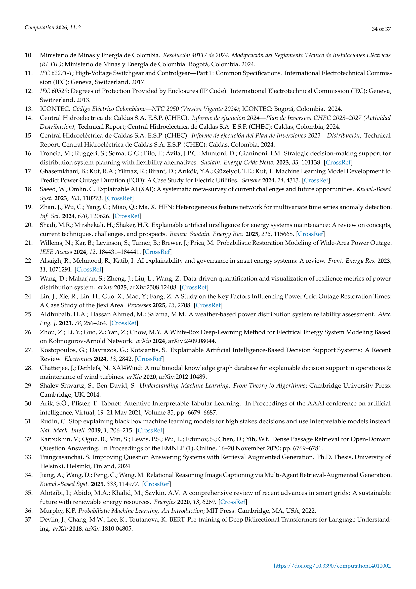

### Extraction assessment
- **Confidence:** 0.95 (meets the configured threshold).
- Machine-readable text was preserved with page-image provenance.

### Raw extracted text
```
Computation 2026, 14, 2
34 of 37
10.
Ministerio de Minas y Energía de Colombia. Resolución 40117 de 2024: Modificación del Reglamento Técnico de Instalaciones Eléctricas
(RETIE); Ministerio de Minas y Energía de Colombia: Bogotá, Colombia, 2024.
11.
IEC 62271-1; High-Voltage Switchgear and Controlgear—Part 1: Common Specifications. International Electrotechnical Commis-
sion (IEC): Geneva, Switzerland, 2017.
12.
IEC 60529; Degrees of Protection Provided by Enclosures (IP Code). International Electrotechnical Commission (IEC): Geneva,
Switzerland, 2013.
13.
ICONTEC. Código Eléctrico Colombiano—NTC 2050 (Versión Vigente 2024); ICONTEC: Bogotá, Colombia, 2024.
14.
Central Hidroeléctrica de Caldas S.A. E.S.P. (CHEC). Informe de ejecución 2024—Plan de Inversión CHEC 2023–2027 (Actividad
Distribución); Technical Report; Central Hidroeléctrica de Caldas S.A. E.S.P. (CHEC): Caldas, Colombia, 2024.
15.
Central Hidroeléctrica de Caldas S.A. E.S.P. (CHEC). Informe de ejecución del Plan de Inversiones 2023—Distribución; Technical
Report; Central Hidroeléctrica de Caldas S.A. E.S.P. (CHEC): Caldas, Colombia, 2024.
16.
Troncia, M.; Ruggeri, S.; Soma, G.G.; Pilo, F.; Ávila, J.P.C.; Muntoni, D.; Gianinoni, I.M. Strategic decision-making support for
distribution system planning with flexibility alternatives. Sustain. Energy Grids Netw. 2023, 35, 101138. [CrossRef]
17.
Ghasemkhani, B.; Kut, R.A.; Yilmaz, R.; Birant, D.; Arıkök, Y.A.; Güzelyol, T.E.; Kut, T. Machine Learning Model Development to
Predict Power Outage Duration (POD): A Case Study for Electric Utilities. Sensors 2024, 24, 4313. [CrossRef]
18.
Saeed, W.; Omlin, C. Explainable AI (XAI): A systematic meta-survey of current challenges and future opportunities. Knowl.-Based
Syst. 2023, 263, 110273. [CrossRef]
19.
Zhan, J.; Wu, C.; Yang, C.; Miao, Q.; Ma, X. HFN: Heterogeneous feature network for multivariate time series anomaly detection.
Inf. Sci. 2024, 670, 120626. [CrossRef]
20.
Shadi, M.R.; Mirshekali, H.; Shaker, H.R. Explainable artificial intelligence for energy systems maintenance: A review on concepts,
current techniques, challenges, and prospects. Renew. Sustain. Energy Rev. 2025, 216, 115668. [CrossRef]
21.
Willems, N.; Kar, B.; Levinson, S.; Turner, B.; Brewer, J.; Prica, M. Probabilistic Restoration Modeling of Wide-Area Power Outage.
IEEE Access 2024, 12, 184431–184441. [CrossRef]
22.
Alsaigh, R.; Mehmood, R.; Katib, I. AI explainability and governance in smart energy systems: A review. Front. Energy Res. 2023,
11, 1071291. [CrossRef]
23.
Wang, D.; Maharjan, S.; Zheng, J.; Liu, L.; Wang, Z. Data-driven quantification and visualization of resilience metrics of power
distribution system. arXiv 2025, arXiv:2508.12408. [CrossRef]
24.
Lin, J.; Xie, R.; Lin, H.; Guo, X.; Mao, Y.; Fang, Z. A Study on the Key Factors Influencing Power Grid Outage Restoration Times:
A Case Study of the Jiexi Area. Processes 2025, 13, 2708. [CrossRef]
25.
Aldhubaib, H.A.; Hassan Ahmed, M.; Salama, M.M. A weather-based power distribution system reliability assessment. Alex.
Eng. J. 2023, 78, 256–264. [CrossRef]
26.
Zhou, Z.; Li, Y.; Guo, Z.; Yan, Z.; Chow, M.Y. A White-Box Deep-Learning Method for Electrical Energy System Modeling Based
on Kolmogorov-Arnold Network. arXiv 2024, arXiv:2409.08044.
27.
Kostopoulos, G.; Davrazos, G.; Kotsiantis, S. Explainable Artificial Intelligence-Based Decision Support Systems: A Recent
Review. Electronics 2024, 13, 2842. [CrossRef]
28.
Chatterjee, J.; Dethlefs, N. XAI4Wind: A multimodal knowledge graph database for explainable decision support in operations &
maintenance of wind turbines. arXiv 2020, arXiv:2012.10489.
29.
Shalev-Shwartz, S.; Ben-David, S. Understanding Machine Learning: From Theory to Algorithms; Cambridge University Press:
Cambridge, UK, 2014.
30.
Arik, S.Ö.; Pfister, T. Tabnet: Attentive Interpretable Tabular Learning. In Proceedings of the AAAI conference on artificial
intelligence, Virtual, 19–21 May 2021; Volume 35, pp. 6679–6687.
31.
Rudin, C. Stop explaining black box machine learning models for high stakes decisions and use interpretable models instead.
Nat. Mach. Intell. 2019, 1, 206–215. [CrossRef]
32.
Karpukhin, V.; Oguz, B.; Min, S.; Lewis, P.S.; Wu, L.; Edunov, S.; Chen, D.; Yih, W.t. Dense Passage Retrieval for Open-Domain
Question Answering. In Proceedings of the EMNLP (1), Online, 16–20 November 2020; pp. 6769–6781.
33.
Trangcasanchai, S. Improving Question Answering Systems with Retrieval Augmented Generation. Ph.D. Thesis, University of
Helsinki, Helsinki, Finland, 2024.
34.
Jiang, A.; Wang, D.; Peng, C.; Wang, M. Relational Reasoning Image Captioning via Multi-Agent Retrieval-Augmented Generation.
Knowl.-Based Syst. 2025, 333, 114977. [CrossRef]
35.
Alotaibi, I.; Abido, M.A.; Khalid, M.; Savkin, A.V. A comprehensive review of recent advances in smart grids: A sustainable
future with renewable energy resources. Energies 2020, 13, 6269. [CrossRef]
36.
Murphy, K.P. Probabilistic Machine Learning: An Introduction; MIT Press: Cambridge, MA, USA, 2022.
37.
Devlin, J.; Chang, M.W.; Lee, K.; Toutanova, K. BERT: Pre-training of Deep Bidirectional Transformers for Language Understand-
ing. arXiv 2018, arXiv:1810.04805.
https://doi.org/10.3390/computation14010002

```

## Page 35
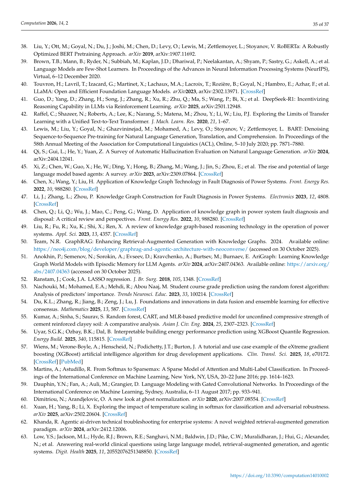

### Extraction assessment
- **Confidence:** 0.95 (meets the configured threshold).
- Machine-readable text was preserved with page-image provenance.

### Raw extracted text
```
Computation 2026, 14, 2
35 of 37
38.
Liu, Y.; Ott, M.; Goyal, N.; Du, J.; Joshi, M.; Chen, D.; Levy, O.; Lewis, M.; Zettlemoyer, L.; Stoyanov, V. RoBERTa: A Robustly
Optimized BERT Pretraining Approach. arXiv 2019, arXiv:1907.11692.
39.
Brown, T.B.; Mann, B.; Ryder, N.; Subbiah, M.; Kaplan, J.D.; Dhariwal, P.; Neelakantan, A.; Shyam, P.; Sastry, G.; Askell, A.; et al.
Language Models are Few-Shot Learners. In Proceedings of the Advances in Neural Information Processing Systems (NeurIPS),
Virtual, 6–12 December 2020.
40.
Touvron, H.; Lavril, T.; Izacard, G.; Martinet, X.; Lachaux, M.A.; Lacroix, T.; Rozière, B.; Goyal, N.; Hambro, E.; Azhar, F.; et al.
LLaMA: Open and Efficient Foundation Language Models. arXiv2023, arXiv:2302.13971. [CrossRef]
41.
Guo, D.; Yang, D.; Zhang, H.; Song, J.; Zhang, R.; Xu, R.; Zhu, Q.; Ma, S.; Wang, P.; Bi, X.; et al. DeepSeek-R1: Incentivizing
Reasoning Capability in LLMs via Reinforcement Learning. arXiv 2025, arXiv:2501.12948.
42.
Raffel, C.; Shazeer, N.; Roberts, A.; Lee, K.; Narang, S.; Matena, M.; Zhou, Y.; Li, W.; Liu, P.J. Exploring the Limits of Transfer
Learning with a Unified Text-to-Text Transformer. J. Mach. Learn. Res. 2020, 21, 1–67.
43.
Lewis, M.; Liu, Y.; Goyal, N.; Ghazvininejad, M.; Mohamed, A.; Levy, O.; Stoyanov, V.; Zettlemoyer, L. BART: Denoising
Sequence-to-Sequence Pre-training for Natural Language Generation, Translation, and Comprehension. In Proceedings of the
58th Annual Meeting of the Association for Computational Linguistics (ACL), Online, 5–10 July 2020; pp. 7871–7880.
44.
Qi, S.; Gui, L.; He, Y.; Yuan, Z. A Survey of Automatic Hallucination Evaluation on Natural Language Generation. arXiv 2024,
arXiv:2404.12041.
45.
Xi, Z.; Chen, W.; Guo, X.; He, W.; Ding, Y.; Hong, B.; Zhang, M.; Wang, J.; Jin, S.; Zhou, E.; et al. The rise and potential of large
language model based agents: A survey. arXiv 2023, arXiv:2309.07864. [CrossRef]
46.
Chen, X.; Wang, Y.; Liu, H. Application of Knowledge Graph Technology in Fault Diagnosis of Power Systems. Front. Energy Res.
2022, 10, 988280. [CrossRef]
47.
Li, J.; Zhang, L.; Zhou, P. Knowledge Graph Construction for Fault Diagnosis in Power Systems. Electronics 2023, 12, 4808.
[CrossRef]
48.
Chen, Q.; Li, Q.; Wu, J.; Mao, C.; Peng, G.; Wang, D. Application of knowledge graph in power system fault diagnosis and
disposal: A critical review and perspectives. Front. Energy Res. 2022, 10, 988280. [CrossRef]
49.
Liu, R.; Fu, R.; Xu, K.; Shi, X.; Ren, X. A review of knowledge graph-based reasoning technology in the operation of power
systems. Appl. Sci. 2023, 13, 4357. [CrossRef]
50.
Team, N.R. GraphRAG: Enhancing Retrieval-Augmented Generation with Knowledge Graphs. 2024.
Available online:
https://neo4j.com/blog/developer/graphrag-and-agentic-architecture-with-neoconverse/ (accessed on 30 October 2025).
51.
Anokhin, P.; Semenov, N.; Sorokin, A.; Evseev, D.; Kravchenko, A.; Burtsev, M.; Burnaev, E. AriGraph: Learning Knowledge
Graph World Models with Episodic Memory for LLM Agents. arXiv 2024, arXiv:2407.04363. Available online: https://arxiv.org/
abs/2407.04363 (accessed on 30 October 2025).
52.
Ranstam, J.; Cook, J.A. LASSO regression. J. Br. Surg. 2018, 105, 1348. [CrossRef]
53.
Nachouki, M.; Mohamed, E.A.; Mehdi, R.; Abou Naaj, M. Student course grade prediction using the random forest algorithm:
Analysis of predictors’ importance. Trends Neurosci. Educ. 2023, 33, 100214. [CrossRef]
54.
Du, K.L.; Zhang, R.; Jiang, B.; Zeng, J.; Lu, J. Foundations and innovations in data fusion and ensemble learning for effective
consensus. Mathematics 2025, 13, 587. [CrossRef]
55.
Kumar, A.; Sinha, S.; Saurav, S. Random forest, CART, and MLR-based predictive model for unconfined compressive strength of
cement reinforced clayey soil: A comparative analysis. Asian J. Civ. Eng. 2024, 25, 2307–2323. [CrossRef]
56.
Uyar, S.G.K.; Ozbay, B.K.; Dal, B. Interpretable building energy performance prediction using XGBoost Quantile Regression.
Energy Build. 2025, 340, 115815. [CrossRef]
57.
Wiens, M.; Verone-Boyle, A.; Henscheid, N.; Podichetty, J.T.; Burton, J. A tutorial and use case example of the eXtreme gradient
boosting (XGBoost) artificial intelligence algorithm for drug development applications.
Clin. Transl. Sci. 2025, 18, e70172.
[CrossRef] [PubMed]
58.
Martins, A.; Astudillo, R. From Softmax to Sparsemax: A Sparse Model of Attention and Multi-Label Classification. In Proceed-
ings of the International Conference on Machine Learning, New York, NY, USA, 20–22 June 2016; pp. 1614–1623.
59.
Dauphin, Y.N.; Fan, A.; Auli, M.; Grangier, D. Language Modeling with Gated Convolutional Networks. In Proceedings of the
International Conference on Machine Learning, Sydney, Australia, 6–11 August 2017; pp. 933–941.
60.
Dimitriou, N.; Arandjelovic, O. A new look at ghost normalization. arXiv 2020, arXiv:2007.08554. [CrossRef]
61.
Xuan, H.; Yang, B.; Li, X. Exploring the impact of temperature scaling in softmax for classification and adversarial robustness.
arXiv 2025, arXiv:2502.20604. [CrossRef]
62.
Khanda, R. Agentic ai-driven technical troubleshooting for enterprise systems: A novel weighted retrieval-augmented generation
paradigm. arXiv 2024, arXiv:2412.12006.
63.
Low, Y.S.; Jackson, M.L.; Hyde, R.J.; Brown, R.E.; Sanghavi, N.M.; Baldwin, J.D.; Pike, C.W.; Muralidharan, J.; Hui, G.; Alexander,
N.; et al. Answering real-world clinical questions using large language model, retrieval-augmented generation, and agentic
systems. Digit. Health 2025, 11, 20552076251348850. [CrossRef]
https://doi.org/10.3390/computation14010002

```

## Page 36
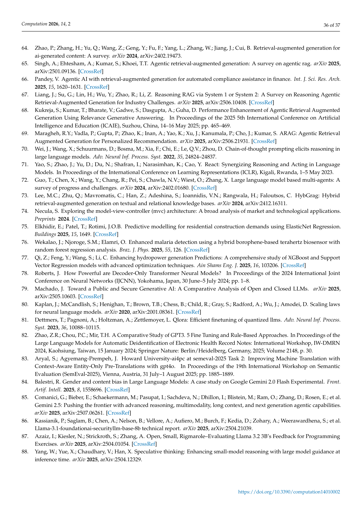

### Extraction assessment
- **Confidence:** 0.95 (meets the configured threshold).
- Machine-readable text was preserved with page-image provenance.

### Raw extracted text
```
Computation 2026, 14, 2
36 of 37
64.
Zhao, P.; Zhang, H.; Yu, Q.; Wang, Z.; Geng, Y.; Fu, F.; Yang, L.; Zhang, W.; Jiang, J.; Cui, B. Retrieval-augmented generation for
ai-generated content: A survey. arXiv 2024, arXiv:2402.19473.
65.
Singh, A.; Ehtesham, A.; Kumar, S.; Khoei, T.T. Agentic retrieval-augmented generation: A survey on agentic rag. arXiv 2025,
arXiv:2501.09136. [CrossRef]
66.
Pandey, V. Agentic AI with retrieval-augmented generation for automated compliance assistance in finance. Int. J. Sci. Res. Arch.
2025, 15, 1620–1631. [CrossRef]
67.
Liang, J.; Su, G.; Lin, H.; Wu, Y.; Zhao, R.; Li, Z. Reasoning RAG via System 1 or System 2: A Survey on Reasoning Agentic
Retrieval-Augmented Generation for Industry Challenges. arXiv 2025, arXiv:2506.10408. [CrossRef]
68.
Kukreja, S.; Kumar, T.; Bharate, V.; Gadwe, S.; Dasgupta, A.; Guha, D. Performance Enhancement of Agentic Retrieval Augmented
Generation Using Relevance Generative Answering.
In Proceedings of the 2025 5th International Conference on Artificial
Intelligence and Education (ICAIE), Suzhou, China, 14–16 May 2025; pp. 465–469.
69.
Maragheh, R.Y.; Vadla, P.; Gupta, P.; Zhao, K.; Inan, A.; Yao, K.; Xu, J.; Kanumala, P.; Cho, J.; Kumar, S. ARAG: Agentic Retrieval
Augmented Generation for Personalized Recommendation. arXiv 2025, arXiv:2506.21931. [CrossRef]
70.
Wei, J.; Wang, X.; Schuurmans, D.; Bosma, M.; Xia, F.; Chi, E.; Le, Q.V.; Zhou, D. Chain-of-thought prompting elicits reasoning in
large language models. Adv. Neural Inf. Process. Syst. 2022, 35, 24824–24837.
71.
Yao, S.; Zhao, J.; Yu, D.; Du, N.; Shafran, I.; Narasimhan, K.; Cao, Y. React: Synergizing Reasoning and Acting in Language
Models. In Proceedings of the International Conference on Learning Representations (ICLR), Kigali, Rwanda, 1–5 May 2023.
72.
Guo, T.; Chen, X.; Wang, Y.; Chang, R.; Pei, S.; Chawla, N.V.; Wiest, O.; Zhang, X. Large language model based multi-agents: A
survey of progress and challenges. arXiv 2024, arXiv:2402.01680. [CrossRef]
73.
Lee, M.C.; Zhu, Q.; Mavromatis, C.; Han, Z.; Adeshina, S.; Ioannidis, V.N.; Rangwala, H.; Faloutsos, C. HybGrag: Hybrid
retrieval-augmented generation on textual and relational knowledge bases. arXiv 2024, arXiv:2412.16311.
74.
Necula, S. Exploring the model-view-controller (mvc) architecture: A broad analysis of market and technological applications.
Preprints 2024. [CrossRef]
75.
Elkhidir, E.; Patel, T.; Rotimi, J.O.B. Predictive modelling for residential construction demands using ElasticNet Regression.
Buildings 2025, 15, 1649. [CrossRef]
76.
Wekalao, J.; Njoroge, S.M.; Elamri, O. Enhanced malaria detection using a hybrid borophene-based terahertz biosensor with
random forest regression analysis. Braz. J. Phys. 2025, 55, 126. [CrossRef]
77.
Qi, Z.; Feng, Y.; Wang, S.; Li, C. Enhancing hydropower generation Predictions: A comprehensive study of XGBoost and Support
Vector Regression models with advanced optimization techniques. Ain Shams Eng. J. 2025, 16, 103206. [CrossRef]
78.
Roberts, J. How Powerful are Decoder-Only Transformer Neural Models?
In Proceedings of the 2024 International Joint
Conference on Neural Networks (IJCNN), Yokohama, Japan, 30 June–5 July 2024; pp. 1–8.
79.
Machado, J. Toward a Public and Secure Generative AI: A Comparative Analysis of Open and Closed LLMs.
arXiv 2025,
arXiv:2505.10603. [CrossRef]
80.
Kaplan, J.; McCandlish, S.; Henighan, T.; Brown, T.B.; Chess, B.; Child, R.; Gray, S.; Radford, A.; Wu, J.; Amodei, D. Scaling laws
for neural language models. arXiv 2020, arXiv:2001.08361. [CrossRef]
81.
Dettmers, T.; Pagnoni, A.; Holtzman, A.; Zettlemoyer, L. Qlora: Efficient finetuning of quantized llms. Adv. Neural Inf. Process.
Syst. 2023, 36, 10088–10115.
82.
Zhao, Z.R.; Chou, P.C.; Mir, T.H. A Comparative Study of GPT3. 5 Fine Tuning and Rule-Based Approaches. In Proceedings of the
Large Language Models for Automatic Deidentification of Electronic Health Record Notes: International Workshop, IW-DMRN
2024, Kaohsiung, Taiwan, 15 January 2024; Springer Nature: Berlin/Heidelberg, Germany, 2025; Volume 2148, p. 30.
83.
Aryal, S.; Agyemang-Prempeh, J. Howard University-ai4pc at semeval-2025 Task 2: Improving Machine Translation with
Context-Aware Entity-Only Pre-Translations with gpt4o.
In Proceedings of the 19th International Workshop on Semantic
Evaluation (SemEval-2025), Vienna, Austria, 31 July–1 August 2025; pp. 1885–1889.
84.
Balestri, R. Gender and content bias in Large Language Models: A case study on Google Gemini 2.0 Flash Experimental. Front.
Artif. Intell. 2025, 8, 1558696. [CrossRef]
85.
Comanici, G.; Bieber, E.; Schaekermann, M.; Pasupat, I.; Sachdeva, N.; Dhillon, I.; Blistein, M.; Ram, O.; Zhang, D.; Rosen, E.; et al.
Gemini 2.5: Pushing the frontier with advanced reasoning, multimodality, long context, and next generation agentic capabilities.
arXiv 2025, arXiv:2507.06261. [CrossRef]
86.
Kassianik, P.; Saglam, B.; Chen, A.; Nelson, B.; Vellore, A.; Aufiero, M.; Burch, F.; Kedia, D.; Zohary, A.; Weerawardhena, S.; et al.
Llama-3.1-foundationai-securityllm-base-8b technical report. arXiv 2025, arXiv:2504.21039.
87.
Azaiz, I.; Kiesler, N.; Strickroth, S.; Zhang, A. Open, Small, Rigmarole–Evaluating Llama 3.2 3B’s Feedback for Programming
Exercises. arXiv 2025, arXiv:2504.01054. [CrossRef]
88.
Yang, W.; Yue, X.; Chaudhary, V.; Han, X. Speculative thinking: Enhancing small-model reasoning with large model guidance at
inference time. arXiv 2025, arXiv:2504.12329.
https://doi.org/10.3390/computation14010002

```

## Page 37
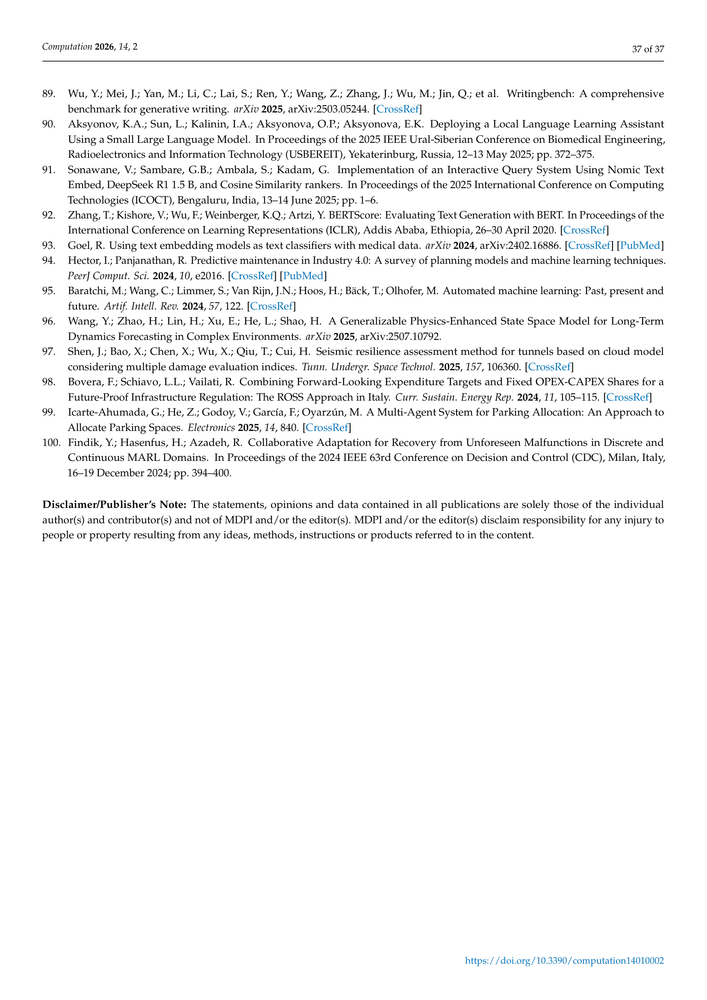

### Extraction assessment
- **Confidence:** 0.95 (meets the configured threshold).
- Machine-readable text was preserved with page-image provenance.

### Raw extracted text
```
Computation 2026, 14, 2
37 of 37
89.
Wu, Y.; Mei, J.; Yan, M.; Li, C.; Lai, S.; Ren, Y.; Wang, Z.; Zhang, J.; Wu, M.; Jin, Q.; et al. Writingbench: A comprehensive
benchmark for generative writing. arXiv 2025, arXiv:2503.05244. [CrossRef]
90.
Aksyonov, K.A.; Sun, L.; Kalinin, I.A.; Aksyonova, O.P.; Aksyonova, E.K. Deploying a Local Language Learning Assistant
Using a Small Large Language Model. In Proceedings of the 2025 IEEE Ural-Siberian Conference on Biomedical Engineering,
Radioelectronics and Information Technology (USBEREIT), Yekaterinburg, Russia, 12–13 May 2025; pp. 372–375.
91.
Sonawane, V.; Sambare, G.B.; Ambala, S.; Kadam, G. Implementation of an Interactive Query System Using Nomic Text
Embed, DeepSeek R1 1.5 B, and Cosine Similarity rankers. In Proceedings of the 2025 International Conference on Computing
Technologies (ICOCT), Bengaluru, India, 13–14 June 2025; pp. 1–6.
92.
Zhang, T.; Kishore, V.; Wu, F.; Weinberger, K.Q.; Artzi, Y. BERTScore: Evaluating Text Generation with BERT. In Proceedings of the
International Conference on Learning Representations (ICLR), Addis Ababa, Ethiopia, 26–30 April 2020. [CrossRef]
93.
Goel, R. Using text embedding models as text classifiers with medical data. arXiv 2024, arXiv:2402.16886. [CrossRef] [PubMed]
94.
Hector, I.; Panjanathan, R. Predictive maintenance in Industry 4.0: A survey of planning models and machine learning techniques.
PeerJ Comput. Sci. 2024, 10, e2016. [CrossRef] [PubMed]
95.
Baratchi, M.; Wang, C.; Limmer, S.; Van Rijn, J.N.; Hoos, H.; Bäck, T.; Olhofer, M. Automated machine learning: Past, present and
future. Artif. Intell. Rev. 2024, 57, 122. [CrossRef]
96.
Wang, Y.; Zhao, H.; Lin, H.; Xu, E.; He, L.; Shao, H. A Generalizable Physics-Enhanced State Space Model for Long-Term
Dynamics Forecasting in Complex Environments. arXiv 2025, arXiv:2507.10792.
97.
Shen, J.; Bao, X.; Chen, X.; Wu, X.; Qiu, T.; Cui, H. Seismic resilience assessment method for tunnels based on cloud model
considering multiple damage evaluation indices. Tunn. Undergr. Space Technol. 2025, 157, 106360. [CrossRef]
98.
Bovera, F.; Schiavo, L.L.; Vailati, R. Combining Forward-Looking Expenditure Targets and Fixed OPEX-CAPEX Shares for a
Future-Proof Infrastructure Regulation: The ROSS Approach in Italy. Curr. Sustain. Energy Rep. 2024, 11, 105–115. [CrossRef]
99.
Icarte-Ahumada, G.; He, Z.; Godoy, V.; García, F.; Oyarzún, M. A Multi-Agent System for Parking Allocation: An Approach to
Allocate Parking Spaces. Electronics 2025, 14, 840. [CrossRef]
100. Findik, Y.; Hasenfus, H.; Azadeh, R. Collaborative Adaptation for Recovery from Unforeseen Malfunctions in Discrete and
Continuous MARL Domains. In Proceedings of the 2024 IEEE 63rd Conference on Decision and Control (CDC), Milan, Italy,
16–19 December 2024; pp. 394–400.
Disclaimer/Publisher’s Note: The statements, opinions and data contained in all publications are solely those of the individual
author(s) and contributor(s) and not of MDPI and/or the editor(s). MDPI and/or the editor(s) disclaim responsibility for any injury to
people or property resulting from any ideas, methods, instructions or products referred to in the content.
https://doi.org/10.3390/computation14010002

```
