# computers-13-00176-v2-1

## Source
- PDF: `/Users/diego/Desktop/Proyectos/papersmith-ai/guidance/reference-papers/source/computers-13-00176-v2-1.pdf`
- Source SHA-256: `bd2de7872439c68553de68a8888cd2c73e26e3329f80eda438bc891d81746c91`
- Rendered pages: 19 at 200 DPI (PyMuPDF).
- Confidence threshold: 0.85.
- Table policy: lite evidence only. Possible tables are retained only as exact raw page text and rendered page images; no rows, columns, cells, or inferred values are extracted.
- Equation policy: equation candidates retain exact raw extracted text; this extractor does not synthesize LaTeX.

## Page 1
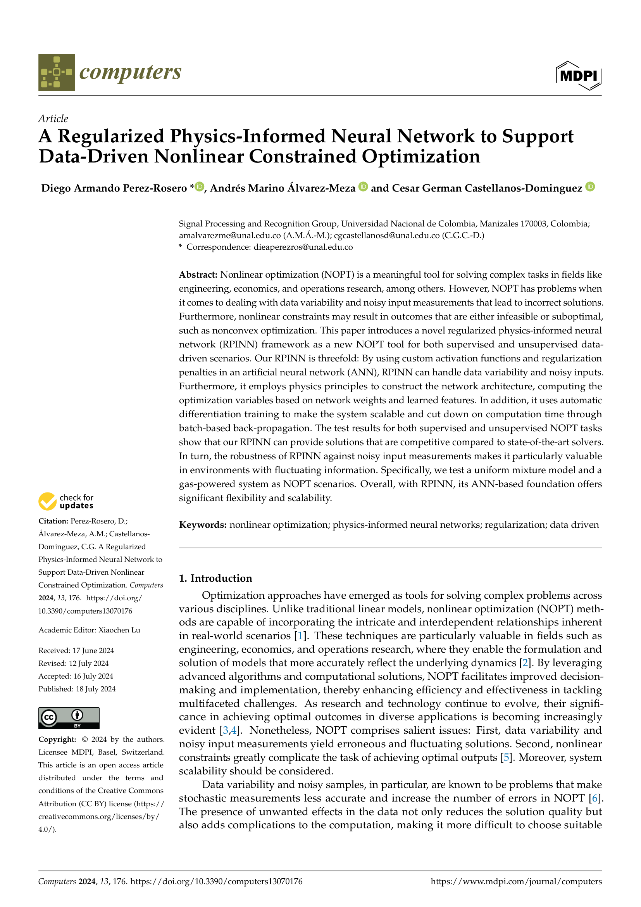

### Extraction assessment
- **Confidence:** 0.75 (below the configured 0.85 threshold; human review required).
- Embedded images require visual review; captions remain page-level text evidence only.

### Raw extracted text
```
Citation: Perez-Rosero, D.;
Álvarez-Meza, A.M.; Castellanos-
Dominguez, C.G. A Regularized
Physics-Informed Neural Network to
Support Data-Driven Nonlinear
Constrained Optimization. Computers
2024, 13, 176. https://doi.org/
10.3390/computers13070176
Academic Editor: Xiaochen Lu
Received: 17 June 2024
Revised: 12 July 2024
Accepted: 16 July 2024
Published: 18 July 2024
Copyright: © 2024 by the authors.
Licensee MDPI, Basel, Switzerland.
This article is an open access article
distributed
under
the
terms
and
conditions of the Creative Commons
Attribution (CC BY) license (https://
creativecommons.org/licenses/by/
4.0/).
computers
Article
A Regularized Physics-Informed Neural Network to Support
Data-Driven Nonlinear Constrained Optimization
Diego Armando Perez-Rosero *
, Andrés Marino Álvarez-Meza
and Cesar German Castellanos-Dominguez
Signal Processing and Recognition Group, Universidad Nacional de Colombia, Manizales 170003, Colombia;
amalvarezme@unal.edu.co (A.M.Á.-M.); cgcastellanosd@unal.edu.co (C.G.C.-D.)
* Correspondence: dieaperezros@unal.edu.co
Abstract: Nonlinear optimization (NOPT) is a meaningful tool for solving complex tasks in fields like
engineering, economics, and operations research, among others. However, NOPT has problems when
it comes to dealing with data variability and noisy input measurements that lead to incorrect solutions.
Furthermore, nonlinear constraints may result in outcomes that are either infeasible or suboptimal,
such as nonconvex optimization. This paper introduces a novel regularized physics-informed neural
network (RPINN) framework as a new NOPT tool for both supervised and unsupervised data-
driven scenarios. Our RPINN is threefold: By using custom activation functions and regularization
penalties in an artificial neural network (ANN), RPINN can handle data variability and noisy inputs.
Furthermore, it employs physics principles to construct the network architecture, computing the
optimization variables based on network weights and learned features. In addition, it uses automatic
differentiation training to make the system scalable and cut down on computation time through
batch-based back-propagation. The test results for both supervised and unsupervised NOPT tasks
show that our RPINN can provide solutions that are competitive compared to state-of-the-art solvers.
In turn, the robustness of RPINN against noisy input measurements makes it particularly valuable
in environments with fluctuating information. Specifically, we test a uniform mixture model and a
gas-powered system as NOPT scenarios. Overall, with RPINN, its ANN-based foundation offers
significant flexibility and scalability.
Keywords: nonlinear optimization; physics-informed neural networks; regularization; data driven
1. Introduction
Optimization approaches have emerged as tools for solving complex problems across
various disciplines. Unlike traditional linear models, nonlinear optimization (NOPT) meth-
ods are capable of incorporating the intricate and interdependent relationships inherent
in real-world scenarios [1]. These techniques are particularly valuable in fields such as
engineering, economics, and operations research, where they enable the formulation and
solution of models that more accurately reflect the underlying dynamics [2]. By leveraging
advanced algorithms and computational solutions, NOPT facilitates improved decision-
making and implementation, thereby enhancing efficiency and effectiveness in tackling
multifaceted challenges. As research and technology continue to evolve, their signifi-
cance in achieving optimal outcomes in diverse applications is becoming increasingly
evident [3,4]. Nonetheless, NOPT comprises salient issues: First, data variability and
noisy input measurements yield erroneous and fluctuating solutions. Second, nonlinear
constraints greatly complicate the task of achieving optimal outputs [5]. Moreover, system
scalability should be considered.
Data variability and noisy samples, in particular, are known to be problems that make
stochastic measurements less accurate and increase the number of errors in NOPT [6].
The presence of unwanted effects in the data not only reduces the solution quality but
also adds complications to the computation, making it more difficult to choose suitable
Computers 2024, 13, 176. https://doi.org/10.3390/computers13070176
https://www.mdpi.com/journal/computers

```

### Embedded images
- `page-001-image-001` — embedded image metadata: 500 × 175 px, xref 35; visual review required.

## Page 2
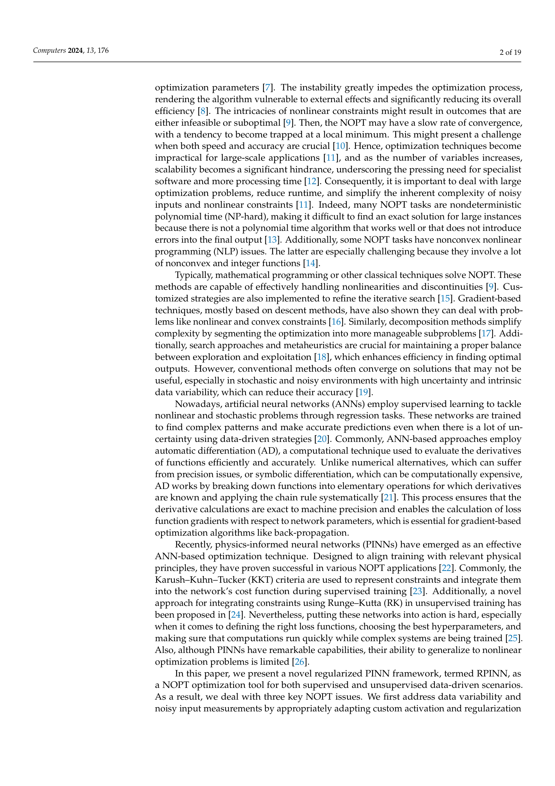

### Extraction assessment
- **Confidence:** 0.95 (meets the configured threshold).
- Machine-readable text was preserved with page-image provenance.

### Raw extracted text
```
Computers 2024, 13, 176
2 of 19
optimization parameters [7]. The instability greatly impedes the optimization process,
rendering the algorithm vulnerable to external effects and significantly reducing its overall
efficiency [8]. The intricacies of nonlinear constraints might result in outcomes that are
either infeasible or suboptimal [9]. Then, the NOPT may have a slow rate of convergence,
with a tendency to become trapped at a local minimum. This might present a challenge
when both speed and accuracy are crucial [10]. Hence, optimization techniques become
impractical for large-scale applications [11], and as the number of variables increases,
scalability becomes a significant hindrance, underscoring the pressing need for specialist
software and more processing time [12]. Consequently, it is important to deal with large
optimization problems, reduce runtime, and simplify the inherent complexity of noisy
inputs and nonlinear constraints [11]. Indeed, many NOPT tasks are nondeterministic
polynomial time (NP-hard), making it difficult to find an exact solution for large instances
because there is not a polynomial time algorithm that works well or that does not introduce
errors into the final output [13]. Additionally, some NOPT tasks have nonconvex nonlinear
programming (NLP) issues. The latter are especially challenging because they involve a lot
of nonconvex and integer functions [14].
Typically, mathematical programming or other classical techniques solve NOPT. These
methods are capable of effectively handling nonlinearities and discontinuities [9]. Cus-
tomized strategies are also implemented to refine the iterative search [15]. Gradient-based
techniques, mostly based on descent methods, have also shown they can deal with prob-
lems like nonlinear and convex constraints [16]. Similarly, decomposition methods simplify
complexity by segmenting the optimization into more manageable subproblems [17]. Addi-
tionally, search approaches and metaheuristics are crucial for maintaining a proper balance
between exploration and exploitation [18], which enhances efficiency in finding optimal
outputs. However, conventional methods often converge on solutions that may not be
useful, especially in stochastic and noisy environments with high uncertainty and intrinsic
data variability, which can reduce their accuracy [19].
Nowadays, artificial neural networks (ANNs) employ supervised learning to tackle
nonlinear and stochastic problems through regression tasks. These networks are trained
to find complex patterns and make accurate predictions even when there is a lot of un-
certainty using data-driven strategies [20]. Commonly, ANN-based approaches employ
automatic differentiation (AD), a computational technique used to evaluate the derivatives
of functions efficiently and accurately. Unlike numerical alternatives, which can suffer
from precision issues, or symbolic differentiation, which can be computationally expensive,
AD works by breaking down functions into elementary operations for which derivatives
are known and applying the chain rule systematically [21]. This process ensures that the
derivative calculations are exact to machine precision and enables the calculation of loss
function gradients with respect to network parameters, which is essential for gradient-based
optimization algorithms like back-propagation.
Recently, physics-informed neural networks (PINNs) have emerged as an effective
ANN-based optimization technique. Designed to align training with relevant physical
principles, they have proven successful in various NOPT applications [22]. Commonly, the
Karush–Kuhn–Tucker (KKT) criteria are used to represent constraints and integrate them
into the network’s cost function during supervised training [23]. Additionally, a novel
approach for integrating constraints using Runge–Kutta (RK) in unsupervised training has
been proposed in [24]. Nevertheless, putting these networks into action is hard, especially
when it comes to defining the right loss functions, choosing the best hyperparameters, and
making sure that computations run quickly while complex systems are being trained [25].
Also, although PINNs have remarkable capabilities, their ability to generalize to nonlinear
optimization problems is limited [26].
In this paper, we present a novel regularized PINN framework, termed RPINN, as
a NOPT optimization tool for both supervised and unsupervised data-driven scenarios.
As a result, we deal with three key NOPT issues. We first address data variability and
noisy input measurements by appropriately adapting custom activation and regularization

```

## Page 3
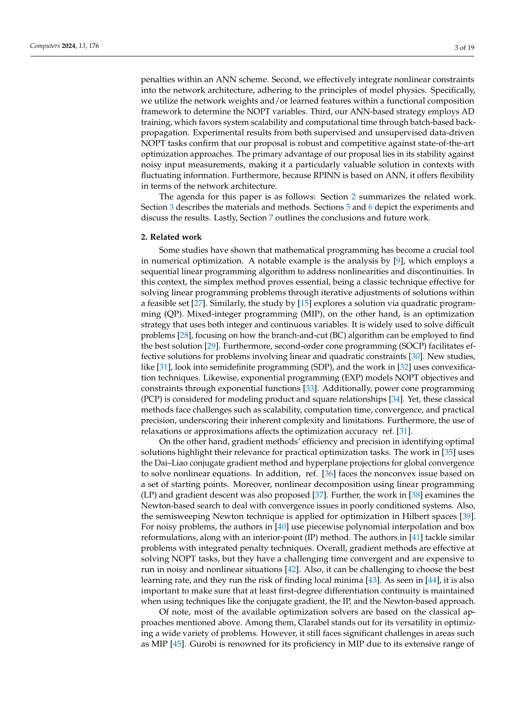

### Extraction assessment
- **Confidence:** 0.95 (meets the configured threshold).
- Machine-readable text was preserved with page-image provenance.

### Raw extracted text
```
Computers 2024, 13, 176
3 of 19
penalties within an ANN scheme. Second, we effectively integrate nonlinear constraints
into the network architecture, adhering to the principles of model physics. Specifically,
we utilize the network weights and/or learned features within a functional composition
framework to determine the NOPT variables. Third, our ANN-based strategy employs AD
training, which favors system scalability and computational time through batch-based back-
propagation. Experimental results from both supervised and unsupervised data-driven
NOPT tasks confirm that our proposal is robust and competitive against state-of-the-art
optimization approaches. The primary advantage of our proposal lies in its stability against
noisy input measurements, making it a particularly valuable solution in contexts with
fluctuating information. Furthermore, because RPINN is based on ANN, it offers flexibility
in terms of the network architecture.
The agenda for this paper is as follows: Section 2 summarizes the related work.
Section 3 describes the materials and methods. Sections 5 and 6 depict the experiments and
discuss the results. Lastly, Section 7 outlines the conclusions and future work.
2. Related work
Some studies have shown that mathematical programming has become a crucial tool
in numerical optimization. A notable example is the analysis by [9], which employs a
sequential linear programming algorithm to address nonlinearities and discontinuities. In
this context, the simplex method proves essential, being a classic technique effective for
solving linear programming problems through iterative adjustments of solutions within
a feasible set [27]. Similarly, the study by [15] explores a solution via quadratic program-
ming (QP). Mixed-integer programming (MIP), on the other hand, is an optimization
strategy that uses both integer and continuous variables. It is widely used to solve difficult
problems [28], focusing on how the branch-and-cut (BC) algorithm can be employed to find
the best solution [29]. Furthermore, second-order cone programming (SOCP) facilitates ef-
fective solutions for problems involving linear and quadratic constraints [30]. New studies,
like [31], look into semidefinite programming (SDP), and the work in [32] uses convexifica-
tion techniques. Likewise, exponential programming (EXP) models NOPT objectives and
constraints through exponential functions [33]. Additionally, power cone programming
(PCP) is considered for modeling product and square relationships [34]. Yet, these classical
methods face challenges such as scalability, computation time, convergence, and practical
precision, underscoring their inherent complexity and limitations. Furthermore, the use of
relaxations or approximations affects the optimization accuracy ref. [31].
On the other hand, gradient methods’ efficiency and precision in identifying optimal
solutions highlight their relevance for practical optimization tasks. The work in [35] uses
the Dai–Liao conjugate gradient method and hyperplane projections for global convergence
to solve nonlinear equations. In addition, ref. [36] faces the nonconvex issue based on
a set of starting points. Moreover, nonlinear decomposition using linear programming
(LP) and gradient descent was also proposed [37]. Further, the work in [38] examines the
Newton-based search to deal with convergence issues in poorly conditioned systems. Also,
the semisweeping Newton technique is applied for optimization in Hilbert spaces [39].
For noisy problems, the authors in [40] use piecewise polynomial interpolation and box
reformulations, along with an interior-point (IP) method. The authors in [41] tackle similar
problems with integrated penalty techniques. Overall, gradient methods are effective at
solving NOPT tasks, but they have a challenging time convergent and are expensive to
run in noisy and nonlinear situations [42]. Also, it can be challenging to choose the best
learning rate, and they run the risk of finding local minima [43]. As seen in [44], it is also
important to make sure that at least first-degree differentiation continuity is maintained
when using techniques like the conjugate gradient, the IP, and the Newton-based approach.
Of note, most of the available optimization solvers are based on the classical ap-
proaches mentioned above. Among them, Clarabel stands out for its versatility in optimiz-
ing a wide variety of problems. However, it still faces significant challenges in areas such
as MIP [45]. Gurobi is renowned for its proficiency in MIP due to its extensive range of

```

## Page 4
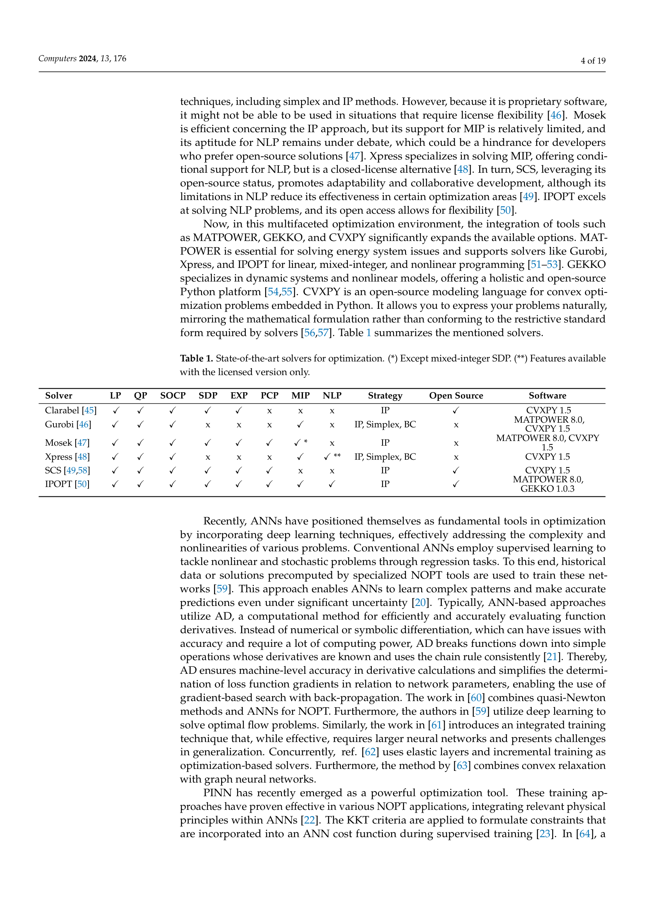

### Extraction assessment
- **Confidence:** 0.95 (meets the configured threshold).
- Machine-readable text was preserved with page-image provenance.

### Raw extracted text
```
Computers 2024, 13, 176
4 of 19
techniques, including simplex and IP methods. However, because it is proprietary software,
it might not be able to be used in situations that require license flexibility [46]. Mosek
is efficient concerning the IP approach, but its support for MIP is relatively limited, and
its aptitude for NLP remains under debate, which could be a hindrance for developers
who prefer open-source solutions [47]. Xpress specializes in solving MIP, offering condi-
tional support for NLP, but is a closed-license alternative [48]. In turn, SCS, leveraging its
open-source status, promotes adaptability and collaborative development, although its
limitations in NLP reduce its effectiveness in certain optimization areas [49]. IPOPT excels
at solving NLP problems, and its open access allows for flexibility [50].
Now, in this multifaceted optimization environment, the integration of tools such
as MATPOWER, GEKKO, and CVXPY significantly expands the available options. MAT-
POWER is essential for solving energy system issues and supports solvers like Gurobi,
Xpress, and IPOPT for linear, mixed-integer, and nonlinear programming [51–53]. GEKKO
specializes in dynamic systems and nonlinear models, offering a holistic and open-source
Python platform [54,55]. CVXPY is an open-source modeling language for convex opti-
mization problems embedded in Python. It allows you to express your problems naturally,
mirroring the mathematical formulation rather than conforming to the restrictive standard
form required by solvers [56,57]. Table 1 summarizes the mentioned solvers.
Table 1. State-of-the-art solvers for optimization. (*) Except mixed-integer SDP. (**) Features available
with the licensed version only.
Solver
LP
QP
SOCP
SDP
EXP
PCP
MIP
NLP
Strategy
Open Source
Software
Clarabel [45]
✓
✓
✓
✓
✓
x
x
x
IP
✓
CVXPY 1.5
Gurobi [46]
✓
✓
✓
x
x
x
✓
x
IP, Simplex, BC
x
MATPOWER 8.0,
CVXPY 1.5
Mosek [47]
✓
✓
✓
✓
✓
✓
✓*
x
IP
x
MATPOWER 8.0, CVXPY
1.5
Xpress [48]
✓
✓
✓
x
x
x
✓
✓**
IP, Simplex, BC
x
CVXPY 1.5
SCS [49,58]
✓
✓
✓
✓
✓
✓
x
x
IP
✓
CVXPY 1.5
IPOPT [50]
✓
✓
✓
✓
✓
✓
✓
✓
IP
✓
MATPOWER 8.0,
GEKKO 1.0.3
Recently, ANNs have positioned themselves as fundamental tools in optimization
by incorporating deep learning techniques, effectively addressing the complexity and
nonlinearities of various problems. Conventional ANNs employ supervised learning to
tackle nonlinear and stochastic problems through regression tasks. To this end, historical
data or solutions precomputed by specialized NOPT tools are used to train these net-
works [59]. This approach enables ANNs to learn complex patterns and make accurate
predictions even under significant uncertainty [20]. Typically, ANN-based approaches
utilize AD, a computational method for efficiently and accurately evaluating function
derivatives. Instead of numerical or symbolic differentiation, which can have issues with
accuracy and require a lot of computing power, AD breaks functions down into simple
operations whose derivatives are known and uses the chain rule consistently [21]. Thereby,
AD ensures machine-level accuracy in derivative calculations and simplifies the determi-
nation of loss function gradients in relation to network parameters, enabling the use of
gradient-based search with back-propagation. The work in [60] combines quasi-Newton
methods and ANNs for NOPT. Furthermore, the authors in [59] utilize deep learning to
solve optimal flow problems. Similarly, the work in [61] introduces an integrated training
technique that, while effective, requires larger neural networks and presents challenges
in generalization. Concurrently, ref. [62] uses elastic layers and incremental training as
optimization-based solvers. Furthermore, the method by [63] combines convex relaxation
with graph neural networks.
PINN has recently emerged as a powerful optimization tool. These training ap-
proaches have proven effective in various NOPT applications, integrating relevant physical
principles within ANNs [22]. The KKT criteria are applied to formulate constraints that
are incorporated into an ANN cost function during supervised training [23]. In [64], a

```

## Page 5
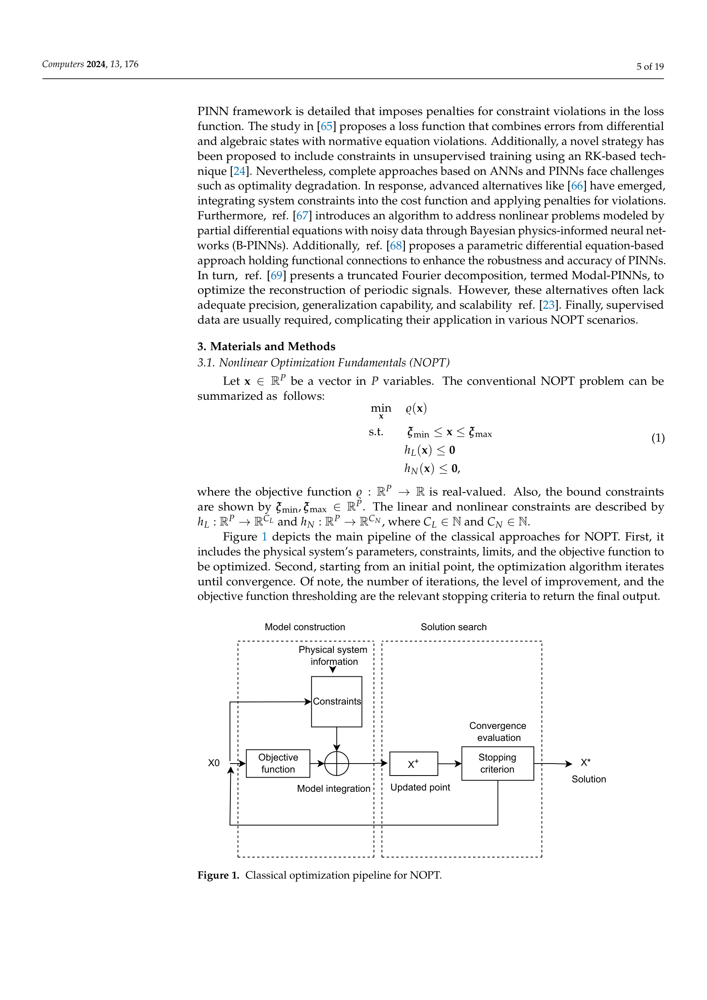

### Extraction assessment
- **Confidence:** 0.65 (below the configured 0.85 threshold; human review required).
- One or more equation candidates are ambiguous in raw extraction.

### Raw extracted text
```
Computers 2024, 13, 176
5 of 19
PINN framework is detailed that imposes penalties for constraint violations in the loss
function. The study in [65] proposes a loss function that combines errors from differential
and algebraic states with normative equation violations. Additionally, a novel strategy has
been proposed to include constraints in unsupervised training using an RK-based tech-
nique [24]. Nevertheless, complete approaches based on ANNs and PINNs face challenges
such as optimality degradation. In response, advanced alternatives like [66] have emerged,
integrating system constraints into the cost function and applying penalties for violations.
Furthermore, ref. [67] introduces an algorithm to address nonlinear problems modeled by
partial differential equations with noisy data through Bayesian physics-informed neural net-
works (B-PINNs). Additionally, ref. [68] proposes a parametric differential equation-based
approach holding functional connections to enhance the robustness and accuracy of PINNs.
In turn, ref. [69] presents a truncated Fourier decomposition, termed Modal-PINNs, to
optimize the reconstruction of periodic signals. However, these alternatives often lack
adequate precision, generalization capability, and scalability ref. [23]. Finally, supervised
data are usually required, complicating their application in various NOPT scenarios.
3. Materials and Methods
3.1. Nonlinear Optimization Fundamentals (NOPT)
Let x ∈RP be a vector in P variables. The conventional NOPT problem can be
summarized as follows:
min
x
ϱ(x)
s.t.
ξmin ≤x ≤ξmax
hL(x) ≤0
hN(x) ≤0,
(1)
where the objective function ϱ : RP →R is real-valued. Also, the bound constraints
are shown by ξmin, ξmax ∈RP. The linear and nonlinear constraints are described by
hL : RP →RCL and hN : RP →RCN, where CL ∈N and CN ∈N.
Figure 1 depicts the main pipeline of the classical approaches for NOPT. First, it
includes the physical system’s parameters, constraints, limits, and the objective function to
be optimized. Second, starting from an initial point, the optimization algorithm iterates
until convergence. Of note, the number of iterations, the level of improvement, and the
objective function thresholding are the relevant stopping criteria to return the final output.
X0
X+
Stopping
criterion
X*
Constraints
Physical system
 information
Model integration
Updated point
Convergence
 evaluation
Objective
function
Model construction
Solution search
Solution
Figure 1. Classical optimization pipeline for NOPT.

```

### Textual figure-caption evidence
- Figure 1. Classical optimization pipeline for NOPT.
- Captions are page-level text evidence and are not associated with embedded images.

### Equation candidates
- `page-005-equation-001` — review_required (confidence 0.45; page 5).
```
Let x ∈RP be a vector in P variables. The conventional NOPT problem can be
```
- `page-005-equation-002` — raw_text_preserved (confidence 0.98; page 5).
```
ξmin ≤x ≤ξmax
```
- `page-005-equation-003` — raw_text_preserved (confidence 0.98; page 5).
```
hL(x) ≤0
```
- `page-005-equation-004` — review_required (confidence 0.45; page 5).
```
hN(x) ≤0,
```
- `page-005-equation-005` — review_required (confidence 0.45; page 5).
```
are shown by ξmin, ξmax ∈RP. The linear and nonlinear constraints are described by
```
- `page-005-equation-006` — review_required (confidence 0.45; page 5).
```
hL : RP →RCL and hN : RP →RCN, where CL ∈N and CN ∈N.
```

## Page 6
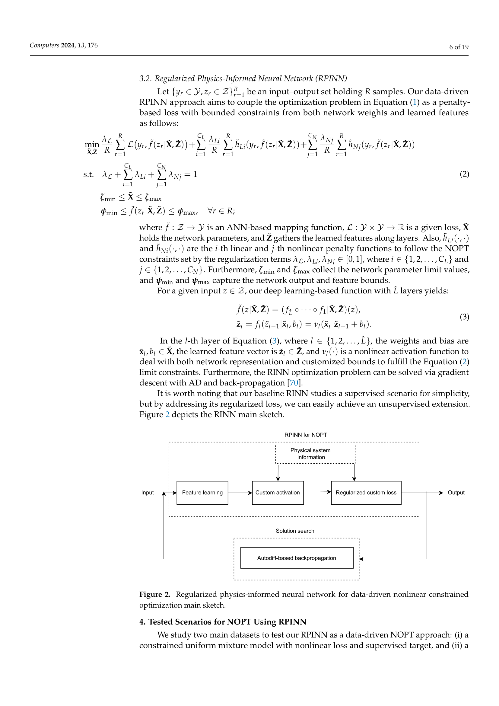

### Extraction assessment
- **Confidence:** 0.65 (below the configured 0.85 threshold; human review required).
- One or more equation candidates are ambiguous in raw extraction.

### Raw extracted text
```
Computers 2024, 13, 176
6 of 19
3.2. Regularized Physics-Informed Neural Network (RPINN)
Let {yr ∈Y, zr ∈Z}R
r=1 be an input–output set holding R samples. Our data-driven
RPINN approach aims to couple the optimization problem in Equation (1) as a penalty-
based loss with bounded constraints from both network weights and learned features
as follows:
min
˜X, ˜Z
λL
R
R
∑
r=1
L
yr, ˜f (zr| ˜X, ˜Z)
+
CL
∑
i=1
λLi
R
R
∑
r=1
˜hLi(yr, ˜f (zr| ˜X, ˜Z))+
CN
∑
j=1
λNj
R
R
∑
r=1
˜hNj(yr, ˜f (zr| ˜X, ˜Z))
s.t.
λL +
CL
∑
i=1
λLi +
CN
∑
j=1
λNj = 1
ζmin ≤˜X ≤ζmax
ψmin ≤˜f (zr| ˜X, ˜Z) ≤ψmax,
∀r ∈R;
(2)
where ˜f : Z →Y is an ANN-based mapping function, L : Y × Y →R is a given loss, ˜X
holds the network parameters, and ˜Z gathers the learned features along layers. Also, ˜hLi(·, ·)
and ˜hNi(·, ·) are the i-th linear and j-th nonlinear penalty functions to follow the NOPT
constraints set by the regularization terms λL, λLi, λNj ∈[0, 1], where i ∈{1, 2, . . . , CL} and
j ∈{1, 2, . . . , CN}. Furthermore, ζmin and ζmax collect the network parameter limit values,
and ψmin and ψmax capture the network output and feature bounds.
For a given input z ∈Z, our deep learning-based function with ˆL layers yields:
˜f (z| ˜X, ˜Z) = ( f ˆL ◦· · · ◦f1| ˜X, ˜Z)(z),
˜zl = fl(˜zl−1|˜xl, bl) = νl(˜x⊤
l ˜zl−1 + bl).
(3)
In the l-th layer of Equation (3), where l ∈{1, 2, . . . , ˆL}, the weights and bias are
˜xl, bl ∈˜X, the learned feature vector is ˜zl ∈˜Z, and νl(·) is a nonlinear activation function to
deal with both network representation and customized bounds to fulfill the Equation (2)
limit constraints. Furthermore, the RINN optimization problem can be solved via gradient
descent with AD and back-propagation [70].
It is worth noting that our baseline RINN studies a supervised scenario for simplicity,
but by addressing its regularized loss, we can easily achieve an unsupervised extension.
Figure 2 depicts the RINN main sketch.
Feature learning
Autodiff-based backpropagation
Solution search
Input
Output
RPINN for NOPT
Physical system
 information
Custom activation
Regularized custom loss
Figure 2. Regularized physics-informed neural network for data-driven nonlinear constrained
optimization main sketch.
4. Tested Scenarios for NOPT Using RPINN
We study two main datasets to test our RPINN as a data-driven NOPT approach: (i) a
constrained uniform mixture model with nonlinear loss and supervised target, and (ii) a

```

### Textual figure-caption evidence
- Figure 2. Regularized physics-informed neural network for data-driven nonlinear constrained
- Captions are page-level text evidence and are not associated with embedded images.

### Equation candidates
- `page-006-equation-001` — review_required (confidence 0.45; page 6).
```
Let {yr ∈Y, zr ∈Z}R
```
- `page-006-equation-002` — raw_text_preserved (confidence 0.98; page 6).
```
r=1 be an input–output set holding R samples. Our data-driven
```
- `page-006-equation-003` — review_required (confidence 0.45; page 6).
```
∑
```
- `page-006-equation-004` — raw_text_preserved (confidence 0.98; page 6).
```
r=1
```
- `page-006-equation-005` — review_required (confidence 0.45; page 6).
```
∑
```
- `page-006-equation-006` — raw_text_preserved (confidence 0.98; page 6).
```
i=1
```
- `page-006-equation-007` — review_required (confidence 0.45; page 6).
```
∑
```
- `page-006-equation-008` — raw_text_preserved (confidence 0.98; page 6).
```
r=1
```
- `page-006-equation-009` — review_required (confidence 0.45; page 6).
```
∑
```
- `page-006-equation-010` — raw_text_preserved (confidence 0.98; page 6).
```
j=1
```
- `page-006-equation-011` — review_required (confidence 0.45; page 6).
```
∑
```
- `page-006-equation-012` — raw_text_preserved (confidence 0.98; page 6).
```
r=1
```
- `page-006-equation-013` — review_required (confidence 0.45; page 6).
```
∑
```
- `page-006-equation-014` — raw_text_preserved (confidence 0.98; page 6).
```
i=1
```
- `page-006-equation-015` — review_required (confidence 0.45; page 6).
```
∑
```
- `page-006-equation-016` — raw_text_preserved (confidence 0.98; page 6).
```
j=1
```
- `page-006-equation-017` — raw_text_preserved (confidence 0.98; page 6).
```
λNj = 1
```
- `page-006-equation-018` — raw_text_preserved (confidence 0.98; page 6).
```
ζmin ≤˜X ≤ζmax
```
- `page-006-equation-019` — review_required (confidence 0.45; page 6).
```
ψmin ≤˜f (zr| ˜X, ˜Z) ≤ψmax,
```
- `page-006-equation-020` — review_required (confidence 0.45; page 6).
```
∀r ∈R;
```
- `page-006-equation-021` — review_required (confidence 0.45; page 6).
```
where ˜f : Z →Y is an ANN-based mapping function, L : Y × Y →R is a given loss, ˜X
```
- `page-006-equation-022` — review_required (confidence 0.45; page 6).
```
constraints set by the regularization terms λL, λLi, λNj ∈[0, 1], where i ∈{1, 2, . . . , CL} and
```
- `page-006-equation-023` — review_required (confidence 0.45; page 6).
```
j ∈{1, 2, . . . , CN}. Furthermore, ζmin and ζmax collect the network parameter limit values,
```
- `page-006-equation-024` — review_required (confidence 0.45; page 6).
```
For a given input z ∈Z, our deep learning-based function with ˆL layers yields:
```
- `page-006-equation-025` — review_required (confidence 0.45; page 6).
```
˜f (z| ˜X, ˜Z) = ( f ˆL ◦· · · ◦f1| ˜X, ˜Z)(z),
```
- `page-006-equation-026` — review_required (confidence 0.45; page 6).
```
˜zl = fl(˜zl−1|˜xl, bl) = νl(˜x⊤
```
- `page-006-equation-027` — review_required (confidence 0.45; page 6).
```
In the l-th layer of Equation (3), where l ∈{1, 2, . . . , ˆL}, the weights and bias are
```
- `page-006-equation-028` — review_required (confidence 0.45; page 6).
```
˜xl, bl ∈˜X, the learned feature vector is ˜zl ∈˜Z, and νl(·) is a nonlinear activation function to
```

## Page 7
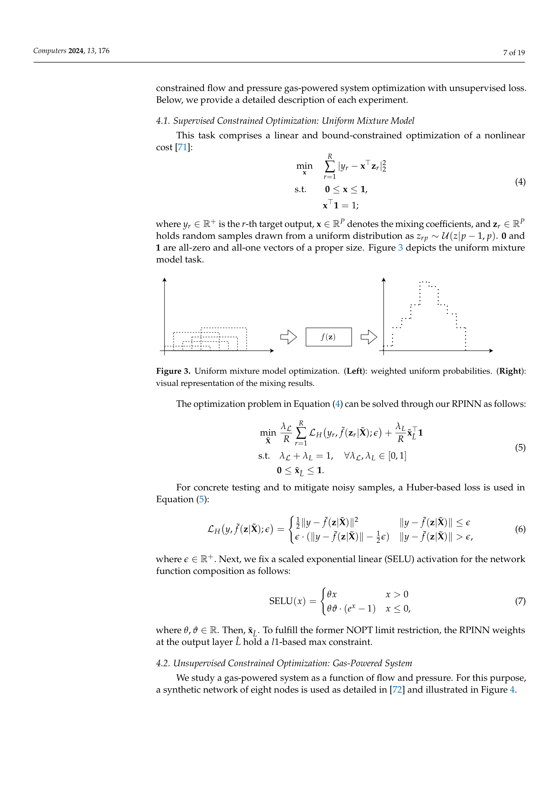

### Extraction assessment
- **Confidence:** 0.65 (below the configured 0.85 threshold; human review required).
- One or more equation candidates are ambiguous in raw extraction.

### Raw extracted text
```
Computers 2024, 13, 176
7 of 19
constrained flow and pressure gas-powered system optimization with unsupervised loss.
Below, we provide a detailed description of each experiment.
4.1. Supervised Constrained Optimization: Uniform Mixture Model
This task comprises a linear and bound-constrained optimization of a nonlinear
cost [71]:
min
x
R
∑
r=1
|yr −x⊤zr|2
2
s.t.
0 ≤x ≤1,
x⊤1 = 1;
(4)
where yr ∈R+ is the r-th target output, x ∈RP denotes the mixing coefficients, and zr ∈RP
holds random samples drawn from a uniform distribution as zrp ∼U(z|p −1, p). 0 and
1 are all-zero and all-one vectors of a proper size. Figure 3 depicts the uniform mixture
model task.
     
Figure 3. Uniform mixture model optimization. (Left): weighted uniform probabilities. (Right):
visual representation of the mixing results.
The optimization problem in Equation (4) can be solved through our RPINN as follows:
min
˜X
λL
R
R
∑
r=1
LH
yr, ˜f (zr| ˜X); ϵ
 + λL
R ˜x⊤
ˆL 1
s.t.
λL + λL = 1,
∀λL, λL ∈[0, 1]
0 ≤˜xˆL ≤1.
(5)
For concrete testing and to mitigate noisy samples, a Huber-based loss is used in
Equation (5):
LH
y, ˜f (z| ˜X); ϵ
 =
(
1
2∥y −˜f (z| ˜X)∥2
∥y −˜f (z| ˜X)∥≤ϵ
ϵ · (∥y −˜f (z| ˜X)∥−1
2ϵ)
∥y −˜f (z| ˜X)∥> ϵ,
(6)
where ϵ ∈R+. Next, we fix a scaled exponential linear (SELU) activation for the network
function composition as follows:
SELU(x) =
(
θx
x > 0
θϑ · (ex −1)
x ≤0,
(7)
where θ, ϑ ∈R. Then, ˜xˆL. To fulfill the former NOPT limit restriction, the RPINN weights
at the output layer ˆL hold a l1-based max constraint.
4.2. Unsupervised Constrained Optimization: Gas-Powered System
We study a gas-powered system as a function of flow and pressure. For this purpose,
a synthetic network of eight nodes is used as detailed in [72] and illustrated in Figure 4.

```

### Textual figure-caption evidence
- Figure 3. Uniform mixture model optimization. (Left): weighted uniform probabilities. (Right):
- Captions are page-level text evidence and are not associated with embedded images.

### Equation candidates
- `page-007-equation-001` — review_required (confidence 0.45; page 7).
```
∑
```
- `page-007-equation-002` — raw_text_preserved (confidence 0.98; page 7).
```
r=1
```
- `page-007-equation-003` — review_required (confidence 0.45; page 7).
```
0 ≤x ≤1,
```
- `page-007-equation-004` — review_required (confidence 0.45; page 7).
```
x⊤1 = 1;
```
- `page-007-equation-005` — review_required (confidence 0.45; page 7).
```
where yr ∈R+ is the r-th target output, x ∈RP denotes the mixing coefficients, and zr ∈RP
```
- `page-007-equation-006` — review_required (confidence 0.45; page 7).
```
∑
```
- `page-007-equation-007` — raw_text_preserved (confidence 0.98; page 7).
```
r=1
```
- `page-007-equation-008` — review_required (confidence 0.45; page 7).
```
λL + λL = 1,
```
- `page-007-equation-009` — review_required (confidence 0.45; page 7).
```
∀λL, λL ∈[0, 1]
```
- `page-007-equation-010` — review_required (confidence 0.45; page 7).
```
0 ≤˜xˆL ≤1.
```
- `page-007-equation-011` — review_required (confidence 0.45; page 7).
```
 =
```
- `page-007-equation-012` — review_required (confidence 0.45; page 7).
```
∥y −˜f (z| ˜X)∥≤ϵ
```
- `page-007-equation-013` — review_required (confidence 0.45; page 7).
```
where ϵ ∈R+. Next, we fix a scaled exponential linear (SELU) activation for the network
```
- `page-007-equation-014` — review_required (confidence 0.45; page 7).
```
SELU(x) =
```
- `page-007-equation-015` — review_required (confidence 0.45; page 7).
```
x ≤0,
```
- `page-007-equation-016` — review_required (confidence 0.45; page 7).
```
where θ, ϑ ∈R. Then, ˜xˆL. To fulfill the former NOPT limit restriction, the RPINN weights
```

## Page 8
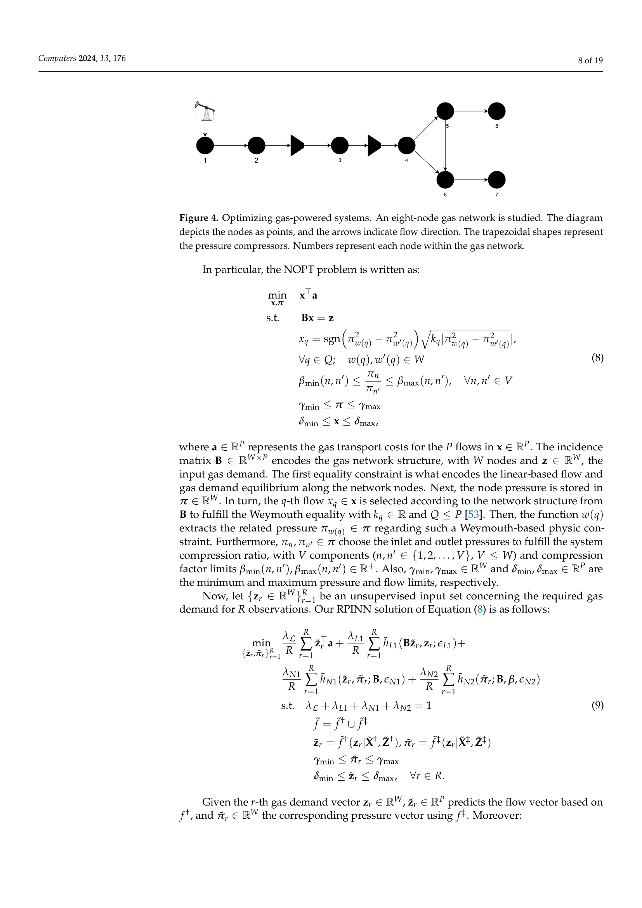

### Extraction assessment
- **Confidence:** 0.65 (below the configured 0.85 threshold; human review required).
- One or more equation candidates are ambiguous in raw extraction. Embedded images require visual review; captions remain page-level text evidence only.

### Raw extracted text
```
Computers 2024, 13, 176
8 of 19
1
2
3
4
5
6
7
8
Figure 4. Optimizing gas-powered systems. An eight-node gas network is studied. The diagram
depicts the nodes as points, and the arrows indicate flow direction. The trapezoidal shapes represent
the pressure compressors. Numbers represent each node within the gas network.
In particular, the NOPT problem is written as:
min
x,π
x⊤a
s.t.
Bx = z
xq = sgn

π2
w(q) −π2
w′(q)
q
kq|π2
w(q) −π2
w′(q)|,
∀q ∈Q;
w(q), w′(q) ∈W
βmin(n, n′) ≤πn
πn′ ≤βmax(n, n′),
∀n, n′ ∈V
γmin ≤π ≤γmax
δmin ≤x ≤δmax,
(8)
where a ∈RP represents the gas transport costs for the P flows in x ∈RP. The incidence
matrix B ∈RW×P encodes the gas network structure, with W nodes and z ∈RW, the
input gas demand. The first equality constraint is what encodes the linear-based flow and
gas demand equilibrium along the network nodes. Next, the node pressure is stored in
π ∈RW. In turn, the q-th flow xq ∈x is selected according to the network structure from
B to fulfill the Weymouth equality with kq ∈R and Q ≤P [53]. Then, the function w(q)
extracts the related pressure πw(q) ∈π regarding such a Weymouth-based physic con-
straint. Furthermore, πn, πn′ ∈π choose the inlet and outlet pressures to fulfill the system
compression ratio, with V components (n, n′ ∈{1, 2, . . . , V}, V ≤W) and compression
factor limits βmin(n, n′), βmax(n, n′) ∈R+. Also, γmin, γmax ∈RW and δmin, δmax ∈RP are
the minimum and maximum pressure and flow limits, respectively.
Now, let {zr ∈RW}R
r=1 be an unsupervised input set concerning the required gas
demand for R observations. Our RPINN solution of Equation (8) is as follows:
min
{˜zr, ˜πr}R
r=1
λL
R
R
∑
r=1
˜z⊤
r a + λL1
R
R
∑
r=1
˜hL1(B˜zr, zr; ϵL1)+
λN1
R
R
∑
r=1
˜hN1(˜zr, ˜πr; B, ϵN1) + λN2
R
R
∑
r=1
˜hN2( ˜πr; B, β, ϵN2)
s.t.
λL + λL1 + λN1 + λN2 = 1
˜f = ˜f † ∪˜f ‡
˜zr = ˜f †(zr| ˜X†, ˜Z†), ˜πr = ˜f ‡(zr| ˜X‡, ˜Z‡)
γmin ≤˜πr ≤γmax
δmin ≤˜zr ≤δmax,
∀r ∈R.
(9)
Given the r-th gas demand vector zr ∈RW, ˜zr ∈RP predicts the flow vector based on
f †, and ˜πr ∈RW the corresponding pressure vector using f ‡. Moreover:

```

### Textual figure-caption evidence
- Figure 4. Optimizing gas-powered systems. An eight-node gas network is studied. The diagram
- Captions are page-level text evidence and are not associated with embedded images.

### Equation candidates
- `page-008-equation-001` — raw_text_preserved (confidence 0.98; page 8).
```
Bx = z
```
- `page-008-equation-002` — raw_text_preserved (confidence 0.98; page 8).
```
xq = sgn
```
- `page-008-equation-003` — review_required (confidence 0.45; page 8).
```
∀q ∈Q;
```
- `page-008-equation-004` — review_required (confidence 0.45; page 8).
```
w(q), w′(q) ∈W
```
- `page-008-equation-005` — raw_text_preserved (confidence 0.98; page 8).
```
βmin(n, n′) ≤πn
```
- `page-008-equation-006` — review_required (confidence 0.45; page 8).
```
πn′ ≤βmax(n, n′),
```
- `page-008-equation-007` — review_required (confidence 0.45; page 8).
```
∀n, n′ ∈V
```
- `page-008-equation-008` — raw_text_preserved (confidence 0.98; page 8).
```
γmin ≤π ≤γmax
```
- `page-008-equation-009` — review_required (confidence 0.45; page 8).
```
δmin ≤x ≤δmax,
```
- `page-008-equation-010` — review_required (confidence 0.45; page 8).
```
where a ∈RP represents the gas transport costs for the P flows in x ∈RP. The incidence
```
- `page-008-equation-011` — review_required (confidence 0.45; page 8).
```
matrix B ∈RW×P encodes the gas network structure, with W nodes and z ∈RW, the
```
- `page-008-equation-012` — raw_text_preserved (confidence 0.98; page 8).
```
π ∈RW. In turn, the q-th flow xq ∈x is selected according to the network structure from
```
- `page-008-equation-013` — review_required (confidence 0.45; page 8).
```
B to fulfill the Weymouth equality with kq ∈R and Q ≤P [53]. Then, the function w(q)
```
- `page-008-equation-014` — review_required (confidence 0.45; page 8).
```
extracts the related pressure πw(q) ∈π regarding such a Weymouth-based physic con-
```
- `page-008-equation-015` — review_required (confidence 0.45; page 8).
```
straint. Furthermore, πn, πn′ ∈π choose the inlet and outlet pressures to fulfill the system
```
- `page-008-equation-016` — review_required (confidence 0.45; page 8).
```
compression ratio, with V components (n, n′ ∈{1, 2, . . . , V}, V ≤W) and compression
```
- `page-008-equation-017` — review_required (confidence 0.45; page 8).
```
factor limits βmin(n, n′), βmax(n, n′) ∈R+. Also, γmin, γmax ∈RW and δmin, δmax ∈RP are
```
- `page-008-equation-018` — review_required (confidence 0.45; page 8).
```
Now, let {zr ∈RW}R
```
- `page-008-equation-019` — raw_text_preserved (confidence 0.98; page 8).
```
r=1 be an unsupervised input set concerning the required gas
```
- `page-008-equation-020` — raw_text_preserved (confidence 0.98; page 8).
```
r=1
```
- `page-008-equation-021` — review_required (confidence 0.45; page 8).
```
∑
```
- `page-008-equation-022` — raw_text_preserved (confidence 0.98; page 8).
```
r=1
```
- `page-008-equation-023` — review_required (confidence 0.45; page 8).
```
∑
```
- `page-008-equation-024` — raw_text_preserved (confidence 0.98; page 8).
```
r=1
```
- `page-008-equation-025` — review_required (confidence 0.45; page 8).
```
∑
```
- `page-008-equation-026` — raw_text_preserved (confidence 0.98; page 8).
```
r=1
```
- `page-008-equation-027` — review_required (confidence 0.45; page 8).
```
∑
```
- `page-008-equation-028` — raw_text_preserved (confidence 0.98; page 8).
```
r=1
```
- `page-008-equation-029` — review_required (confidence 0.45; page 8).
```
λL + λL1 + λN1 + λN2 = 1
```
- `page-008-equation-030` — review_required (confidence 0.45; page 8).
```
˜f = ˜f † ∪˜f ‡
```
- `page-008-equation-031` — review_required (confidence 0.45; page 8).
```
˜zr = ˜f †(zr| ˜X†, ˜Z†), ˜πr = ˜f ‡(zr| ˜X‡, ˜Z‡)
```
- `page-008-equation-032` — raw_text_preserved (confidence 0.98; page 8).
```
γmin ≤˜πr ≤γmax
```
- `page-008-equation-033` — review_required (confidence 0.45; page 8).
```
δmin ≤˜zr ≤δmax,
```
- `page-008-equation-034` — review_required (confidence 0.45; page 8).
```
∀r ∈R.
```
- `page-008-equation-035` — review_required (confidence 0.45; page 8).
```
Given the r-th gas demand vector zr ∈RW, ˜zr ∈RP predicts the flow vector based on
```
- `page-008-equation-036` — review_required (confidence 0.45; page 8).
```
f †, and ˜πr ∈RW the corresponding pressure vector using f ‡. Moreover:
```

### Embedded images
- `page-008-image-001` — embedded image metadata: 225 × 225 px, xref 159; visual review required.

## Page 9
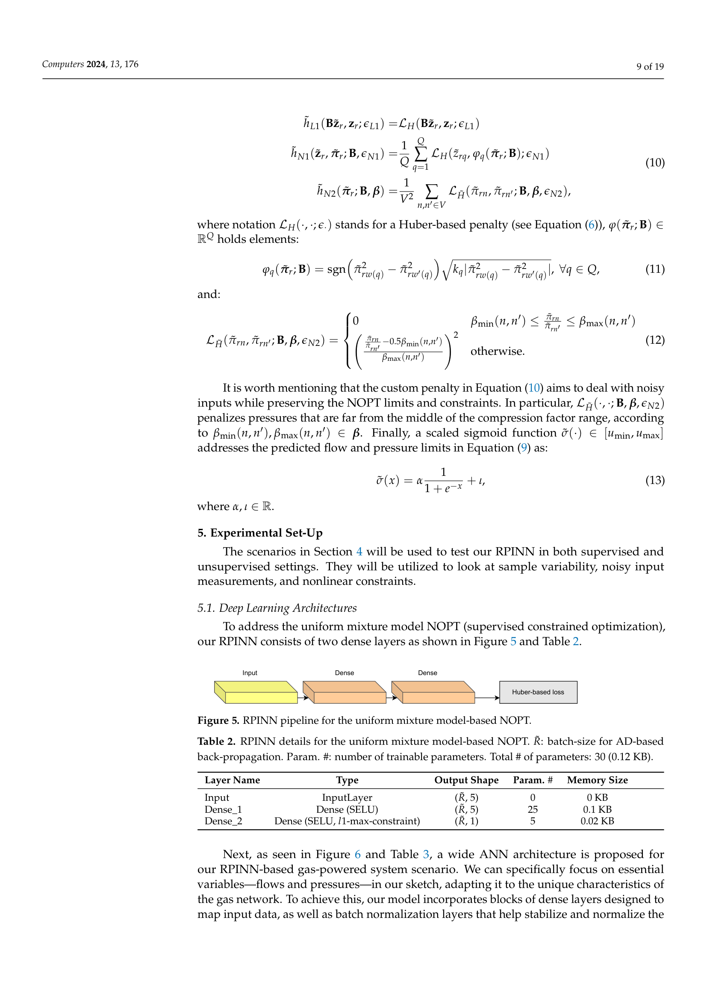

### Extraction assessment
- **Confidence:** 0.65 (below the configured 0.85 threshold; human review required).
- One or more equation candidates are ambiguous in raw extraction.

### Raw extracted text
```
Computers 2024, 13, 176
9 of 19
˜hL1(B˜zr, zr; ϵL1) =LH(B˜zr, zr; ϵL1)
˜hN1(˜zr, ˜πr; B, ϵN1) = 1
Q
Q
∑
q=1
LH(˜zrq, φq( ˜πr; B); ϵN1)
˜hN2( ˜πr; B, β) = 1
V2 ∑
n,n′∈V
L ˜H( ˜πrn, ˜πrn′; B, β, ϵN2),
(10)
where notation LH(·, ·; ϵ·) stands for a Huber-based penalty (see Equation (6)), φ( ˜πr; B) ∈
RQ holds elements:
φq( ˜πr; B) = sgn

˜π2
rw(q) −˜π2
rw′(q)
q
kq| ˜π2
rw(q) −˜π2
rw′(q)|, ∀q ∈Q,
(11)
and:
L ˜H( ˜πrn, ˜πrn′; B, β, ϵN2) =







0
βmin(n, n′) ≤
˜πrn
˜πrn′ ≤βmax(n, n′)
 
˜πrn
˜πrn′ −0.5βmin(n,n′)
βmax(n,n′)
!2
otherwise.
(12)
It is worth mentioning that the custom penalty in Equation (10) aims to deal with noisy
inputs while preserving the NOPT limits and constraints. In particular, L ˜H(·, ·; B, β, ϵN2)
penalizes pressures that are far from the middle of the compression factor range, according
to βmin(n, n′), βmax(n, n′) ∈β. Finally, a scaled sigmoid function ˜σ(·) ∈[umin, umax]
addresses the predicted flow and pressure limits in Equation (9) as:
˜σ(x) = α
1
1 + e−x + ι,
(13)
where α, ι ∈R.
5. Experimental Set-Up
The scenarios in Section 4 will be used to test our RPINN in both supervised and
unsupervised settings. They will be utilized to look at sample variability, noisy input
measurements, and nonlinear constraints.
5.1. Deep Learning Architectures
To address the uniform mixture model NOPT (supervised constrained optimization),
our RPINN consists of two dense layers as shown in Figure 5 and Table 2.
Input
Dense
Dense
Huber-based loss
Figure 5. RPINN pipeline for the uniform mixture model-based NOPT.
Table 2. RPINN details for the uniform mixture model-based NOPT. ˜R: batch-size for AD-based
back-propagation. Param. #: number of trainable parameters. Total # of parameters: 30 (0.12 KB).
Layer Name
Type
Output Shape
Param. #
Memory Size
Input
InputLayer
( ˜R, 5)
0
0 KB
Dense_1
Dense (SELU)
( ˜R, 5)
25
0.1 KB
Dense_2
Dense (SELU, l1-max-constraint)
( ˜R, 1)
5
0.02 KB
Next, as seen in Figure 6 and Table 3, a wide ANN architecture is proposed for
our RPINN-based gas-powered system scenario. We can specifically focus on essential
variables—flows and pressures—in our sketch, adapting it to the unique characteristics of
the gas network. To achieve this, our model incorporates blocks of dense layers designed to
map input data, as well as batch normalization layers that help stabilize and normalize the

```

### Textual figure-caption evidence
- Figure 5. RPINN pipeline for the uniform mixture model-based NOPT.
- Captions are page-level text evidence and are not associated with embedded images.

### Equation candidates
- `page-009-equation-001` — review_required (confidence 0.45; page 9).
```
˜hL1(B˜zr, zr; ϵL1) =LH(B˜zr, zr; ϵL1)
```
- `page-009-equation-002` — review_required (confidence 0.45; page 9).
```
˜hN1(˜zr, ˜πr; B, ϵN1) = 1
```
- `page-009-equation-003` — review_required (confidence 0.45; page 9).
```
∑
```
- `page-009-equation-004` — raw_text_preserved (confidence 0.98; page 9).
```
q=1
```
- `page-009-equation-005` — review_required (confidence 0.45; page 9).
```
˜hN2( ˜πr; B, β) = 1
```
- `page-009-equation-006` — review_required (confidence 0.45; page 9).
```
V2 ∑
```
- `page-009-equation-007` — review_required (confidence 0.45; page 9).
```
n,n′∈V
```
- `page-009-equation-008` — review_required (confidence 0.45; page 9).
```
where notation LH(·, ·; ϵ·) stands for a Huber-based penalty (see Equation (6)), φ( ˜πr; B) ∈
```
- `page-009-equation-009` — raw_text_preserved (confidence 0.98; page 9).
```
φq( ˜πr; B) = sgn
```
- `page-009-equation-010` — review_required (confidence 0.45; page 9).
```
rw′(q)|, ∀q ∈Q,
```
- `page-009-equation-011` — review_required (confidence 0.45; page 9).
```
L ˜H( ˜πrn, ˜πrn′; B, β, ϵN2) =
```
- `page-009-equation-012` — review_required (confidence 0.45; page 9).
```
βmin(n, n′) ≤
```
- `page-009-equation-013` — review_required (confidence 0.45; page 9).
```
˜πrn′ ≤βmax(n, n′)
```
- `page-009-equation-014` — review_required (confidence 0.45; page 9).
```
to βmin(n, n′), βmax(n, n′) ∈β. Finally, a scaled sigmoid function ˜σ(·) ∈[umin, umax]
```
- `page-009-equation-015` — review_required (confidence 0.45; page 9).
```
˜σ(x) = α
```
- `page-009-equation-016` — review_required (confidence 0.45; page 9).
```
where α, ι ∈R.
```
- `page-009-equation-017` — review_required (confidence 0.45; page 9).
```
Dense_1
```
- `page-009-equation-018` — review_required (confidence 0.45; page 9).
```
Dense_2
```

## Page 10
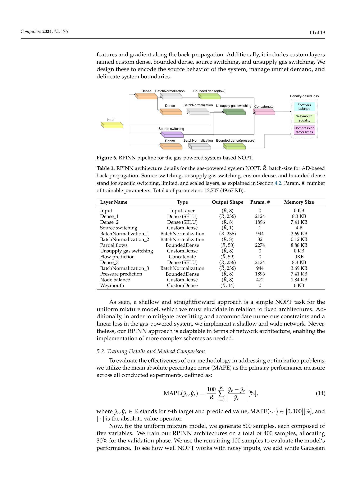

### Extraction assessment
- **Confidence:** 0.65 (below the configured 0.85 threshold; human review required).
- One or more equation candidates are ambiguous in raw extraction.

### Raw extracted text
```
Computers 2024, 13, 176
10 of 19
features and gradient along the back-propagation. Additionally, it includes custom layers
named custom dense, bounded dense, source switching, and unsupply gas switching. We
design these to encode the source behavior of the system, manage unmet demand, and
delineate system boundaries.
Input
Dense
BatchNormalization
Source switching
Bounded dense(flow)
Unsupply gas switching
Concatenate
Dense
BatchNormalization
Bounded dense(pressure)
BatchNormalization
Dense
Penalty-based loss
Flow-gas
balance
Weymouth
equality
Compression
factor limits
Figure 6. RPINN pipeline for the gas-powered system-based NOPT.
Table 3. RPINN architecture details for the gas-powered system NOPT. ˜R: batch-size for AD-based
back-propagation. Source switching, unsupply gas switching, custom dense, and bounded dense
stand for specific switching, limited, and scaled layers, as explained in Section 4.2. Param. #: number
of trainable parameters. Total # of parameters: 12,707 (49.67 KB).
Layer Name
Type
Output Shape
Param. #
Memory Size
Input
InputLayer
( ˜R, 8)
0
0 KB
Dense_1
Dense (SELU)
( ˜R, 236)
2124
8.3 KB
Dense_2
Dense (SELU)
( ˜R, 8)
1896
7.41 KB
Source switching
CustomDense
( ˜R, 1)
1
4 B
BatchNormalization_1
BatchNormalization
( ˜R, 236)
944
3.69 KB
BatchNormalization_2
BatchNormalization
( ˜R, 8)
32
0.12 KB
Partial flows
BoundedDense
( ˜R, 50)
2274
8.88 KB
Unsupply gas switching
CustomDense
( ˜R, 8)
0
0 KB
Flow prediction
Concatenate
( ˜R, 59)
0
0KB
Dense_3
Dense (SELU)
( ˜R, 236)
2124
8.3 KB
BatchNormalization_3
BatchNormalization
( ˜R, 236)
944
3.69 KB
Pressure prediction
BoundedDense
( ˜R, 8)
1896
7.41 KB
Node balance
CustomDense
( ˜R, 8)
472
1.84 KB
Weymouth
CustomDense
( ˜R, 14)
0
0 KB
As seen, a shallow and straightforward approach is a simple NOPT task for the
uniform mixture model, which we must elucidate in relation to fixed architectures. Ad-
ditionally, in order to mitigate overfitting and accommodate numerous constraints and a
linear loss in the gas-powered system, we implement a shallow and wide network. Never-
theless, our RPINN approach is adaptable in terms of network architecture, enabling the
implementation of more complex schemes as needed.
5.2. Training Details and Method Comparison
To evaluate the effectiveness of our methodology in addressing optimization problems,
we utilize the mean absolute percentage error (MAPE) as the primary performance measure
across all conducted experiments, defined as:
MAPE( ˜yr, ˆyr) = 100
R
R
∑
r=1

˜yr −ˆyr
˜yr
[%],
(14)
where ˜yr, ˆyr ∈R stands for r-th target and predicted value, MAPE(·, ·) ∈[0, 100][%], and
| · | is the absolute value operator.
Now, for the uniform mixture model, we generate 500 samples, each composed of
five variables. We train our RPINN architectures on a total of 400 samples, allocating
30% for the validation phase. We use the remaining 100 samples to evaluate the model’s
performance. To see how well NOPT works with noisy inputs, we add white Gaussian

```

### Textual figure-caption evidence
- Figure 6. RPINN pipeline for the gas-powered system-based NOPT.
- Captions are page-level text evidence and are not associated with embedded images.

### Equation candidates
- `page-010-equation-001` — review_required (confidence 0.45; page 10).
```
Dense_1
```
- `page-010-equation-002` — review_required (confidence 0.45; page 10).
```
Dense_2
```
- `page-010-equation-003` — review_required (confidence 0.45; page 10).
```
BatchNormalization_1
```
- `page-010-equation-004` — review_required (confidence 0.45; page 10).
```
BatchNormalization_2
```
- `page-010-equation-005` — review_required (confidence 0.45; page 10).
```
Dense_3
```
- `page-010-equation-006` — review_required (confidence 0.45; page 10).
```
BatchNormalization_3
```
- `page-010-equation-007` — raw_text_preserved (confidence 0.98; page 10).
```
MAPE( ˜yr, ˆyr) = 100
```
- `page-010-equation-008` — review_required (confidence 0.45; page 10).
```
∑
```
- `page-010-equation-009` — raw_text_preserved (confidence 0.98; page 10).
```
r=1
```
- `page-010-equation-010` — review_required (confidence 0.45; page 10).
```
where ˜yr, ˆyr ∈R stands for r-th target and predicted value, MAPE(·, ·) ∈[0, 100][%], and
```

## Page 11
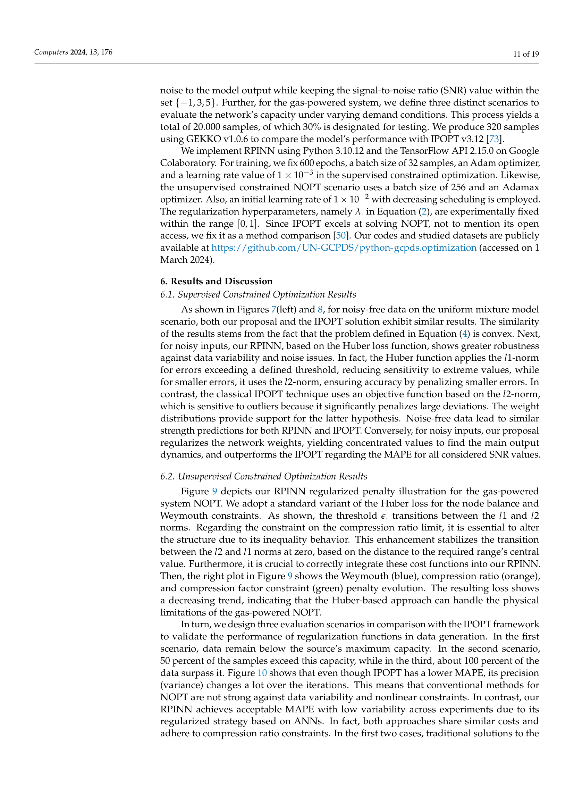

### Extraction assessment
- **Confidence:** 0.65 (below the configured 0.85 threshold; human review required).
- One or more equation candidates are ambiguous in raw extraction.

### Raw extracted text
```
Computers 2024, 13, 176
11 of 19
noise to the model output while keeping the signal-to-noise ratio (SNR) value within the
set {−1, 3, 5}. Further, for the gas-powered system, we define three distinct scenarios to
evaluate the network’s capacity under varying demand conditions. This process yields a
total of 20.000 samples, of which 30% is designated for testing. We produce 320 samples
using GEKKO v1.0.6 to compare the model’s performance with IPOPT v3.12 [73].
We implement RPINN using Python 3.10.12 and the TensorFlow API 2.15.0 on Google
Colaboratory. For training, we fix 600 epochs, a batch size of 32 samples, an Adam optimizer,
and a learning rate value of 1 × 10−3 in the supervised constrained optimization. Likewise,
the unsupervised constrained NOPT scenario uses a batch size of 256 and an Adamax
optimizer. Also, an initial learning rate of 1 × 10−2 with decreasing scheduling is employed.
The regularization hyperparameters, namely λ· in Equation (2), are experimentally fixed
within the range [0, 1]. Since IPOPT excels at solving NOPT, not to mention its open
access, we fix it as a method comparison [50]. Our codes and studied datasets are publicly
available at https://github.com/UN-GCPDS/python-gcpds.optimization (accessed on 1
March 2024).
6. Results and Discussion
6.1. Supervised Constrained Optimization Results
As shown in Figures 7(left) and 8, for noisy-free data on the uniform mixture model
scenario, both our proposal and the IPOPT solution exhibit similar results. The similarity
of the results stems from the fact that the problem defined in Equation (4) is convex. Next,
for noisy inputs, our RPINN, based on the Huber loss function, shows greater robustness
against data variability and noise issues. In fact, the Huber function applies the l1-norm
for errors exceeding a defined threshold, reducing sensitivity to extreme values, while
for smaller errors, it uses the l2-norm, ensuring accuracy by penalizing smaller errors. In
contrast, the classical IPOPT technique uses an objective function based on the l2-norm,
which is sensitive to outliers because it significantly penalizes large deviations. The weight
distributions provide support for the latter hypothesis. Noise-free data lead to similar
strength predictions for both RPINN and IPOPT. Conversely, for noisy inputs, our proposal
regularizes the network weights, yielding concentrated values to find the main output
dynamics, and outperforms the IPOPT regarding the MAPE for all considered SNR values.
6.2. Unsupervised Constrained Optimization Results
Figure 9 depicts our RPINN regularized penalty illustration for the gas-powered
system NOPT. We adopt a standard variant of the Huber loss for the node balance and
Weymouth constraints. As shown, the threshold ϵ· transitions between the l1 and l2
norms. Regarding the constraint on the compression ratio limit, it is essential to alter
the structure due to its inequality behavior. This enhancement stabilizes the transition
between the l2 and l1 norms at zero, based on the distance to the required range’s central
value. Furthermore, it is crucial to correctly integrate these cost functions into our RPINN.
Then, the right plot in Figure 9 shows the Weymouth (blue), compression ratio (orange),
and compression factor constraint (green) penalty evolution. The resulting loss shows
a decreasing trend, indicating that the Huber-based approach can handle the physical
limitations of the gas-powered NOPT.
In turn, we design three evaluation scenarios in comparison with the IPOPT framework
to validate the performance of regularization functions in data generation. In the first
scenario, data remain below the source’s maximum capacity. In the second scenario,
50 percent of the samples exceed this capacity, while in the third, about 100 percent of the
data surpass it. Figure 10 shows that even though IPOPT has a lower MAPE, its precision
(variance) changes a lot over the iterations. This means that conventional methods for
NOPT are not strong against data variability and nonlinear constraints. In contrast, our
RPINN achieves acceptable MAPE with low variability across experiments due to its
regularized strategy based on ANNs. In fact, both approaches share similar costs and
adhere to compression ratio constraints. In the first two cases, traditional solutions to the

```

### Equation candidates
- `page-011-equation-001` — review_required (confidence 0.45; page 11).
```
and a learning rate value of 1 × 10−3 in the supervised constrained optimization. Likewise,
```
- `page-011-equation-002` — review_required (confidence 0.45; page 11).
```
optimizer. Also, an initial learning rate of 1 × 10−2 with decreasing scheduling is employed.
```

## Page 12
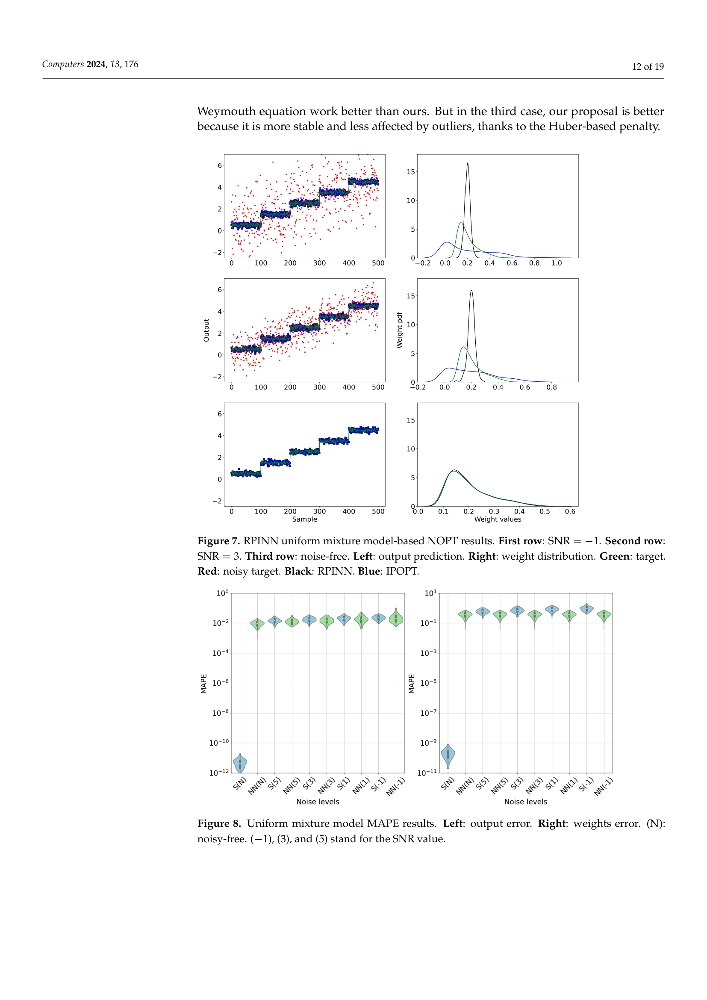

### Extraction assessment
- **Confidence:** 0.65 (below the configured 0.85 threshold; human review required).
- One or more equation candidates are ambiguous in raw extraction. Embedded images require visual review; captions remain page-level text evidence only.

### Raw extracted text
```
Computers 2024, 13, 176
12 of 19
Weymouth equation work better than ours. But in the third case, our proposal is better
because it is more stable and less affected by outliers, thanks to the Huber-based penalty.
0
100
200
300
400
500
2
0
2
4
6
0
100
200
300
400
500
2
0
2
4
6
0
100
200
300
400
500
2
0
2
4
6
0.2
0.0
0.2
0.4
0.6
0.8
1.0
0
5
10
15
0.2
0.0
0.2
0.4
0.6
0.8
0
5
10
15
0.0
0.1
0.2
0.3
0.4
0.5
0.6
0
5
10
15
0.0
0.2
0.4
0.6
0.8
1.0
Sample
0.0
0.2
0.4
0.6
0.8
1.0
Output
0.0
0.2
0.4
0.6
0.8
1.0
Weight values
0.0
0.2
0.4
0.6
0.8
1.0
Weight pdf
Figure 7. RPINN uniform mixture model-based NOPT results. First row: SNR = −1. Second row:
SNR = 3. Third row: noise-free. Left: output prediction. Right: weight distribution. Green: target.
Red: noisy target. Black: RPINN. Blue: IPOPT.
Figure 8. Uniform mixture model MAPE results. Left: output error. Right: weights error. (N):
noisy-free. (−1), (3), and (5) stand for the SNR value.

```

### Textual figure-caption evidence
- Figure 7. RPINN uniform mixture model-based NOPT results. First row: SNR = −1. Second row:
- Figure 8. Uniform mixture model MAPE results. Left: output error. Right: weights error. (N):
- Captions are page-level text evidence and are not associated with embedded images.

### Equation candidates
- `page-012-equation-001` — review_required (confidence 0.45; page 12).
```
Figure 7. RPINN uniform mixture model-based NOPT results. First row: SNR = −1. Second row:
```
- `page-012-equation-002` — raw_text_preserved (confidence 0.98; page 12).
```
SNR = 3. Third row: noise-free. Left: output prediction. Right: weight distribution. Green: target.
```

### Embedded images
- `page-012-image-001` — embedded image metadata: 1621 × 852 px, xref 305; visual review required.

## Page 13
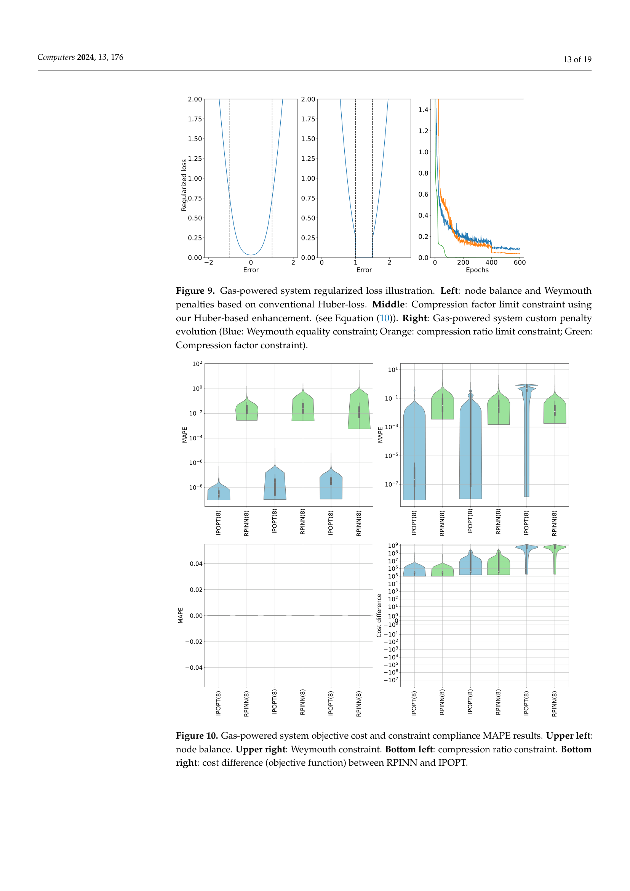

### Extraction assessment
- **Confidence:** 0.95 (meets the configured threshold).
- Machine-readable text was preserved with page-image provenance.

### Raw extracted text
```
Computers 2024, 13, 176
13 of 19
2
0
2
Error
0.00
0.25
0.50
0.75
1.00
1.25
1.50
1.75
2.00
0
1
2
Error
0.00
0.25
0.50
0.75
1.00
1.25
1.50
1.75
2.00
0
200
400
600
Epochs
0.0
0.2
0.4
0.6
0.8
1.0
1.2
1.4
Regularized loss
Figure 9. Gas-powered system regularized loss illustration. Left: node balance and Weymouth
penalties based on conventional Huber-loss. Middle: Compression factor limit constraint using
our Huber-based enhancement. (see Equation (10)). Right: Gas-powered system custom penalty
evolution (Blue: Weymouth equality constraint; Orange: compression ratio limit constraint; Green:
Compression factor constraint).
  IPOPT(8) 
  RPINN(8) 
 IPOPT(8)
 RPINN(8)
IPOPT(8) 
RPINN(8) 
10
8
10
6
10
4
10
2
100
102
MAPE
  IPOPT(8) 
  RPINN(8) 
 IPOPT(8)
 RPINN(8)
IPOPT(8) 
RPINN(8) 
10
7
10
5
10
3
10
1
101
MAPE
  IPOPT(8) 
  RPINN(8) 
 IPOPT(8)
 RPINN(8)
IPOPT(8) 
RPINN(8) 
0.04
0.02
0.00
0.02
0.04
MAPE
  IPOPT(8) 
  RPINN(8)
 IPOPT(8)
 RPINN(8)
IPOPT(8) 
 RPINN(8) 
107
106
105
104
103
102
101
1000
100
101
102
103
104
105
106
107
108
109
Cost difference
Figure 10. Gas-powered system objective cost and constraint compliance MAPE results. Upper left:
node balance. Upper right: Weymouth constraint. Bottom left: compression ratio constraint. Bottom
right: cost difference (objective function) between RPINN and IPOPT.

```

### Textual figure-caption evidence
- Figure 9. Gas-powered system regularized loss illustration. Left: node balance and Weymouth
- Figure 10. Gas-powered system objective cost and constraint compliance MAPE results. Upper left:
- Captions are page-level text evidence and are not associated with embedded images.

## Page 14
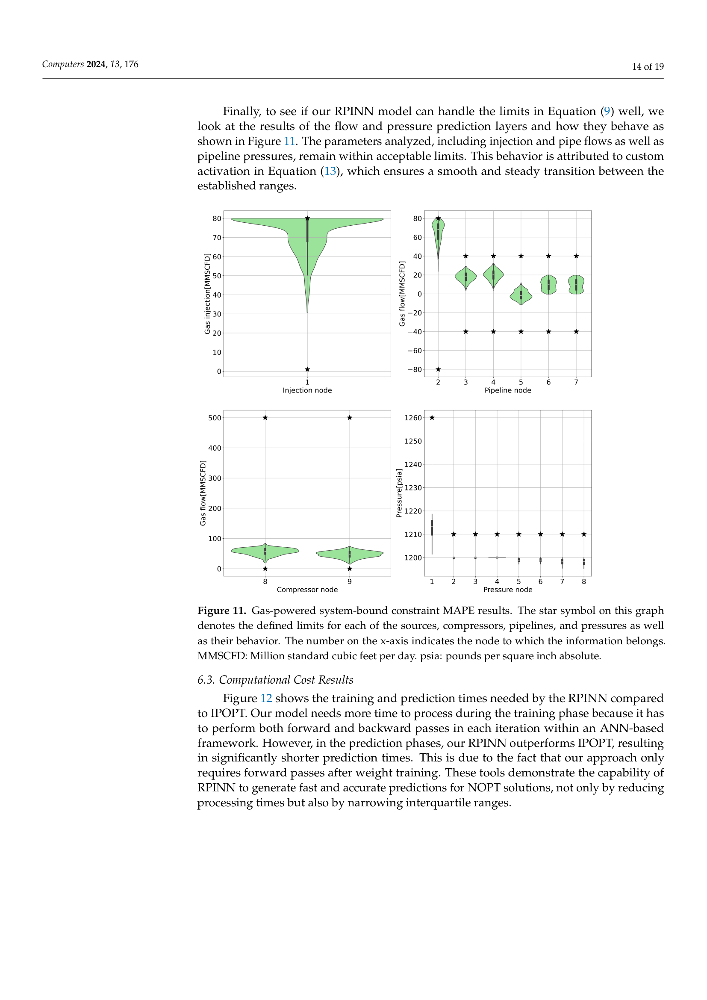

### Extraction assessment
- **Confidence:** 0.95 (meets the configured threshold).
- Machine-readable text was preserved with page-image provenance.

### Raw extracted text
```
Computers 2024, 13, 176
14 of 19
Finally, to see if our RPINN model can handle the limits in Equation (9) well, we
look at the results of the flow and pressure prediction layers and how they behave as
shown in Figure 11. The parameters analyzed, including injection and pipe flows as well as
pipeline pressures, remain within acceptable limits. This behavior is attributed to custom
activation in Equation (13), which ensures a smooth and steady transition between the
established ranges.
1
Injection node
0
10
20
30
40
50
60
70
80
Gas injection[MMSCFD]
2
3
4
5
6
7
Pipeline node
80
60
40
20
0
20
40
60
80
Gas flow[MMSCFD]
8
9
Compressor node
0
100
200
300
400
500
Gas flow[MMSCFD]
1
2
3
4
5
6
7
8
Pressure node
1200
1210
1220
1230
1240
1250
1260
Pressure[psia]
Figure 11. Gas-powered system-bound constraint MAPE results. The star symbol on this graph
denotes the defined limits for each of the sources, compressors, pipelines, and pressures as well
as their behavior. The number on the x-axis indicates the node to which the information belongs.
MMSCFD: Million standard cubic feet per day. psia: pounds per square inch absolute.
6.3. Computational Cost Results
Figure 12 shows the training and prediction times needed by the RPINN compared
to IPOPT. Our model needs more time to process during the training phase because it has
to perform both forward and backward passes in each iteration within an ANN-based
framework. However, in the prediction phases, our RPINN outperforms IPOPT, resulting
in significantly shorter prediction times. This is due to the fact that our approach only
requires forward passes after weight training. These tools demonstrate the capability of
RPINN to generate fast and accurate predictions for NOPT solutions, not only by reducing
processing times but also by narrowing interquartile ranges.

```

### Textual figure-caption evidence
- Figure 11. Gas-powered system-bound constraint MAPE results. The star symbol on this graph
- Captions are page-level text evidence and are not associated with embedded images.

## Page 15
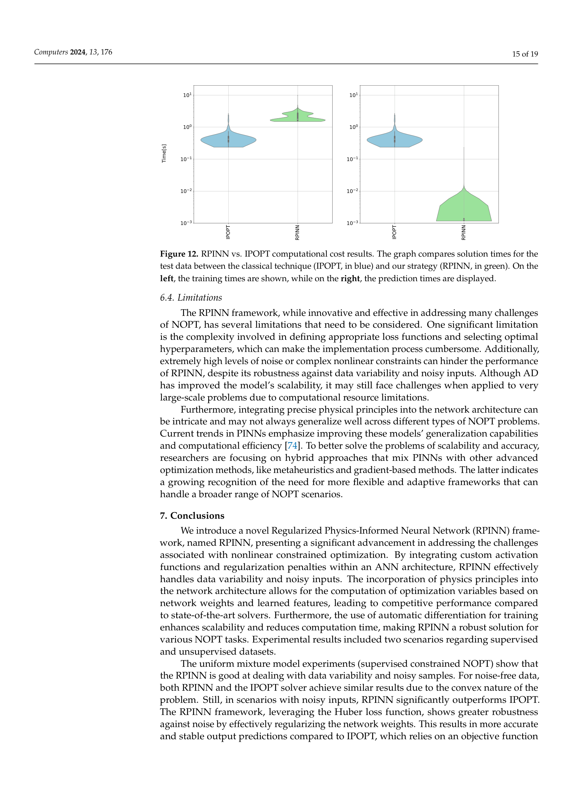

### Extraction assessment
- **Confidence:** 0.95 (meets the configured threshold).
- Machine-readable text was preserved with page-image provenance.

### Raw extracted text
```
Computers 2024, 13, 176
15 of 19
IPOPT
RPINN
10
3
10
2
10
1
100
101
IPOPT
RPINN
10
3
10
2
10
1
100
101
Time[s]
Figure 12. RPINN vs. IPOPT computational cost results. The graph compares solution times for the
test data between the classical technique (IPOPT, in blue) and our strategy (RPINN, in green). On the
left, the training times are shown, while on the right, the prediction times are displayed.
6.4. Limitations
The RPINN framework, while innovative and effective in addressing many challenges
of NOPT, has several limitations that need to be considered. One significant limitation
is the complexity involved in defining appropriate loss functions and selecting optimal
hyperparameters, which can make the implementation process cumbersome. Additionally,
extremely high levels of noise or complex nonlinear constraints can hinder the performance
of RPINN, despite its robustness against data variability and noisy inputs. Although AD
has improved the model’s scalability, it may still face challenges when applied to very
large-scale problems due to computational resource limitations.
Furthermore, integrating precise physical principles into the network architecture can
be intricate and may not always generalize well across different types of NOPT problems.
Current trends in PINNs emphasize improving these models’ generalization capabilities
and computational efficiency [74]. To better solve the problems of scalability and accuracy,
researchers are focusing on hybrid approaches that mix PINNs with other advanced
optimization methods, like metaheuristics and gradient-based methods. The latter indicates
a growing recognition of the need for more flexible and adaptive frameworks that can
handle a broader range of NOPT scenarios.
7. Conclusions
We introduce a novel Regularized Physics-Informed Neural Network (RPINN) frame-
work, named RPINN, presenting a significant advancement in addressing the challenges
associated with nonlinear constrained optimization. By integrating custom activation
functions and regularization penalties within an ANN architecture, RPINN effectively
handles data variability and noisy inputs. The incorporation of physics principles into
the network architecture allows for the computation of optimization variables based on
network weights and learned features, leading to competitive performance compared
to state-of-the-art solvers. Furthermore, the use of automatic differentiation for training
enhances scalability and reduces computation time, making RPINN a robust solution for
various NOPT tasks. Experimental results included two scenarios regarding supervised
and unsupervised datasets.
The uniform mixture model experiments (supervised constrained NOPT) show that
the RPINN is good at dealing with data variability and noisy samples. For noise-free data,
both RPINN and the IPOPT solver achieve similar results due to the convex nature of the
problem. Still, in scenarios with noisy inputs, RPINN significantly outperforms IPOPT.
The RPINN framework, leveraging the Huber loss function, shows greater robustness
against noise by effectively regularizing the network weights. This results in more accurate
and stable output predictions compared to IPOPT, which relies on an objective function

```

### Textual figure-caption evidence
- Figure 12. RPINN vs. IPOPT computational cost results. The graph compares solution times for the
- Captions are page-level text evidence and are not associated with embedded images.

## Page 16
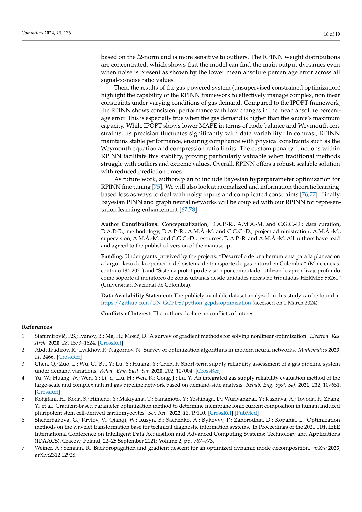

### Extraction assessment
- **Confidence:** 0.95 (meets the configured threshold).
- Machine-readable text was preserved with page-image provenance.

### Raw extracted text
```
Computers 2024, 13, 176
16 of 19
based on the l2-norm and is more sensitive to outliers. The RPINN weight distributions
are concentrated, which shows that the model can find the main output dynamics even
when noise is present as shown by the lower mean absolute percentage error across all
signal-to-noise ratio values.
Then, the results of the gas-powered system (unsupervised constrained optimization)
highlight the capability of the RPINN framework to effectively manage complex, nonlinear
constraints under varying conditions of gas demand. Compared to the IPOPT framework,
the RPINN shows consistent performance with low changes in the mean absolute percent-
age error. This is especially true when the gas demand is higher than the source’s maximum
capacity. While IPOPT shows lower MAPE in terms of node balance and Weymouth con-
straints, its precision fluctuates significantly with data variability. In contrast, RPINN
maintains stable performance, ensuring compliance with physical constraints such as the
Weymouth equation and compression ratio limits. The custom penalty functions within
RPINN facilitate this stability, proving particularly valuable when traditional methods
struggle with outliers and extreme values. Overall, RPINN offers a robust, scalable solution
with reduced prediction times.
As future work, authors plan to include Bayesian hyperparameter optimization for
RPINN fine tuning [75]. We will also look at normalized and information theoretic learning-
based loss as ways to deal with noisy inputs and complicated constraints [76,77]. Finally,
Bayesian PINN and graph neural networks will be coupled with our RPINN for represen-
tation learning enhancement [67,78].
Author Contributions: Conceptualization, D.A.P.-R., A.M.Á.-M. and C.G.C.-D.; data curation,
D.A.P.-R.; methodology, D.A.P.-R., A.M.Á.-M. and C.G.C.-D.; project administration, A.M.Á.-M.;
supervision, A.M.Á.-M. and C.G.C.-D.; resources, D.A.P.-R. and A.M.Á.-M. All authors have read
and agreed to the published version of the manuscript.
Funding: Under grants provived by the projects: “Desarrollo de una herramienta para la planeación
a largo plazo de la operación del sistema de transporte de gas natural en Colombia” (Minciencias-
contrato 184-2021) and “Sistema prototipo de visión por computador utilizando aprendizaje profundo
como soporte al monitoreo de zonas urbanas desde unidades aéreas no tripuladas-HERMES 55261”
(Universidad Nacional de Colombia).
Data Availability Statement: The publicly available dataset analyzed in this study can be found at
https://github.com/UN-GCPDS/python-gcpds.optimization (accessed on 1 March 2024).
Conflicts of Interest: The authors declare no conflicts of interest.
References
1.
Stanimirovi´c, P.S.; Ivanov, B.; Ma, H.; Mosi´c, D. A survey of gradient methods for solving nonlinear optimization. Electron. Res.
Arch. 2020, 28, 1573–1624. [CrossRef]
2.
Abdulkadirov, R.; Lyakhov, P.; Nagornov, N. Survey of optimization algorithms in modern neural networks. Mathematics 2023,
11, 2466. [CrossRef]
3.
Chen, Q.; Zuo, L.; Wu, C.; Bu, Y.; Lu, Y.; Huang, Y.; Chen, F. Short-term supply reliability assessment of a gas pipeline system
under demand variations. Reliab. Eng. Syst. Saf. 2020, 202, 107004. [CrossRef]
4.
Yu, W.; Huang, W.; Wen, Y.; Li, Y.; Liu, H.; Wen, K.; Gong, J.; Lu, Y. An integrated gas supply reliability evaluation method of the
large-scale and complex natural gas pipeline network based on demand-side analysis. Reliab. Eng. Syst. Saf. 2021, 212, 107651.
[CrossRef]
5.
Kohjitani, H.; Koda, S.; Himeno, Y.; Makiyama, T.; Yamamoto, Y.; Yoshinaga, D.; Wuriyanghai, Y.; Kashiwa, A.; Toyoda, F.; Zhang,
Y.; et al. Gradient-based parameter optimization method to determine membrane ionic current composition in human induced
pluripotent stem cell-derived cardiomyocytes. Sci. Rep. 2022, 12, 19110. [CrossRef] [PubMed]
6.
Shcherbakova, G.; Krylov, V.; Qianqi, W.; Rusyn, B.; Sachenko, A.; Bykovyy, P.; Zahorodnia, D.; Kopania, L. Optimization
methods on the wavelet transformation base for technical diagnostic information systems. In Proceedings of the 2021 11th IEEE
International Conference on Intelligent Data Acquisition and Advanced Computing Systems: Technology and Applications
(IDAACS), Cracow, Poland, 22–25 September 2021; Volume 2, pp. 767–773.
7.
Weiner, A.; Semaan, R. Backpropagation and gradient descent for an optimized dynamic mode decomposition. arXiv 2023,
arXiv:2312.12928.

```

## Page 17
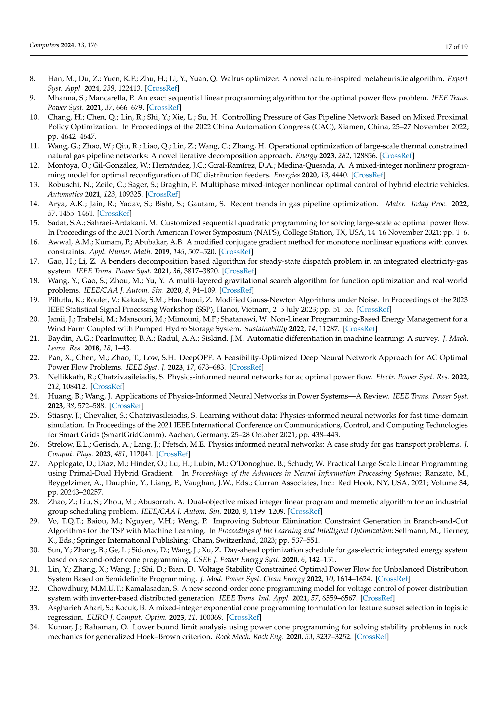

### Extraction assessment
- **Confidence:** 0.95 (meets the configured threshold).
- Machine-readable text was preserved with page-image provenance.

### Raw extracted text
```
Computers 2024, 13, 176
17 of 19
8.
Han, M.; Du, Z.; Yuen, K.F.; Zhu, H.; Li, Y.; Yuan, Q. Walrus optimizer: A novel nature-inspired metaheuristic algorithm. Expert
Syst. Appl. 2024, 239, 122413. [CrossRef]
9.
Mhanna, S.; Mancarella, P. An exact sequential linear programming algorithm for the optimal power flow problem. IEEE Trans.
Power Syst. 2021, 37, 666–679. [CrossRef]
10.
Chang, H.; Chen, Q.; Lin, R.; Shi, Y.; Xie, L.; Su, H. Controlling Pressure of Gas Pipeline Network Based on Mixed Proximal
Policy Optimization. In Proceedings of the 2022 China Automation Congress (CAC), Xiamen, China, 25–27 November 2022;
pp. 4642–4647.
11.
Wang, G.; Zhao, W.; Qiu, R.; Liao, Q.; Lin, Z.; Wang, C.; Zhang, H. Operational optimization of large-scale thermal constrained
natural gas pipeline networks: A novel iterative decomposition approach. Energy 2023, 282, 128856. [CrossRef]
12.
Montoya, O.; Gil-González, W.; Hernández, J.C.; Giral-Ramírez, D.A.; Medina-Quesada, A. A mixed-integer nonlinear program-
ming model for optimal reconfiguration of DC distribution feeders. Energies 2020, 13, 4440. [CrossRef]
13.
Robuschi, N.; Zeile, C.; Sager, S.; Braghin, F. Multiphase mixed-integer nonlinear optimal control of hybrid electric vehicles.
Automatica 2021, 123, 109325. [CrossRef]
14.
Arya, A.K.; Jain, R.; Yadav, S.; Bisht, S.; Gautam, S. Recent trends in gas pipeline optimization.
Mater. Today Proc. 2022,
57, 1455–1461. [CrossRef]
15.
Sadat, S.A.; Sahraei-Ardakani, M. Customized sequential quadratic programming for solving large-scale ac optimal power flow.
In Proceedings of the 2021 North American Power Symposium (NAPS), College Station, TX, USA, 14–16 November 2021; pp. 1–6.
16.
Awwal, A.M.; Kumam, P.; Abubakar, A.B. A modified conjugate gradient method for monotone nonlinear equations with convex
constraints. Appl. Numer. Math. 2019, 145, 507–520. [CrossRef]
17.
Gao, H.; Li, Z. A benders decomposition based algorithm for steady-state dispatch problem in an integrated electricity-gas
system. IEEE Trans. Power Syst. 2021, 36, 3817–3820. [CrossRef]
18.
Wang, Y.; Gao, S.; Zhou, M.; Yu, Y. A multi-layered gravitational search algorithm for function optimization and real-world
problems. IEEE/CAA J. Autom. Sin. 2020, 8, 94–109. [CrossRef]
19.
Pillutla, K.; Roulet, V.; Kakade, S.M.; Harchaoui, Z. Modified Gauss-Newton Algorithms under Noise. In Proceedings of the 2023
IEEE Statistical Signal Processing Workshop (SSP), Hanoi, Vietnam, 2–5 July 2023; pp. 51–55. [CrossRef]
20.
Jamii, J.; Trabelsi, M.; Mansouri, M.; Mimouni, M.F.; Shatanawi, W. Non-Linear Programming-Based Energy Management for a
Wind Farm Coupled with Pumped Hydro Storage System. Sustainability 2022, 14, 11287. [CrossRef]
21.
Baydin, A.G.; Pearlmutter, B.A.; Radul, A.A.; Siskind, J.M. Automatic differentiation in machine learning: A survey. J. Mach.
Learn. Res. 2018, 18, 1–43.
22.
Pan, X.; Chen, M.; Zhao, T.; Low, S.H. DeepOPF: A Feasibility-Optimized Deep Neural Network Approach for AC Optimal
Power Flow Problems. IEEE Syst. J. 2023, 17, 673–683. [CrossRef]
23.
Nellikkath, R.; Chatzivasileiadis, S. Physics-informed neural networks for ac optimal power flow. Electr. Power Syst. Res. 2022,
212, 108412. [CrossRef]
24.
Huang, B.; Wang, J. Applications of Physics-Informed Neural Networks in Power Systems—A Review. IEEE Trans. Power Syst.
2023, 38, 572–588. [CrossRef]
25.
Stiasny, J.; Chevalier, S.; Chatzivasileiadis, S. Learning without data: Physics-informed neural networks for fast time-domain
simulation. In Proceedings of the 2021 IEEE International Conference on Communications, Control, and Computing Technologies
for Smart Grids (SmartGridComm), Aachen, Germany, 25–28 October 2021; pp. 438–443.
26.
Strelow, E.L.; Gerisch, A.; Lang, J.; Pfetsch, M.E. Physics informed neural networks: A case study for gas transport problems. J.
Comput. Phys. 2023, 481, 112041. [CrossRef]
27.
Applegate, D.; Diaz, M.; Hinder, O.; Lu, H.; Lubin, M.; O’Donoghue, B.; Schudy, W. Practical Large-Scale Linear Programming
using Primal-Dual Hybrid Gradient.
In Proceedings of the Advances in Neural Information Processing Systems; Ranzato, M.,
Beygelzimer, A., Dauphin, Y., Liang, P., Vaughan, J.W., Eds.; Curran Associates, Inc.: Red Hook, NY, USA, 2021; Volume 34,
pp. 20243–20257.
28.
Zhao, Z.; Liu, S.; Zhou, M.; Abusorrah, A. Dual-objective mixed integer linear program and memetic algorithm for an industrial
group scheduling problem. IEEE/CAA J. Autom. Sin. 2020, 8, 1199–1209. [CrossRef]
29.
Vo, T.Q.T.; Baiou, M.; Nguyen, V.H.; Weng, P. Improving Subtour Elimination Constraint Generation in Branch-and-Cut
Algorithms for the TSP with Machine Learning. In Proceedings of the Learning and Intelligent Optimization; Sellmann, M., Tierney,
K., Eds.; Springer International Publishing: Cham, Switzerland, 2023; pp. 537–551.
30.
Sun, Y.; Zhang, B.; Ge, L.; Sidorov, D.; Wang, J.; Xu, Z. Day-ahead optimization schedule for gas-electric integrated energy system
based on second-order cone programming. CSEE J. Power Energy Syst. 2020, 6, 142–151.
31.
Lin, Y.; Zhang, X.; Wang, J.; Shi, D.; Bian, D. Voltage Stability Constrained Optimal Power Flow for Unbalanced Distribution
System Based on Semidefinite Programming. J. Mod. Power Syst. Clean Energy 2022, 10, 1614–1624. [CrossRef]
32.
Chowdhury, M.M.U.T.; Kamalasadan, S. A new second-order cone programming model for voltage control of power distribution
system with inverter-based distributed generation. IEEE Trans. Ind. Appl. 2021, 57, 6559–6567. [CrossRef]
33.
Asgharieh Ahari, S.; Kocuk, B. A mixed-integer exponential cone programming formulation for feature subset selection in logistic
regression. EURO J. Comput. Optim. 2023, 11, 100069. [CrossRef]
34.
Kumar, J.; Rahaman, O. Lower bound limit analysis using power cone programming for solving stability problems in rock
mechanics for generalized Hoek–Brown criterion. Rock Mech. Rock Eng. 2020, 53, 3237–3252. [CrossRef]

```

## Page 18
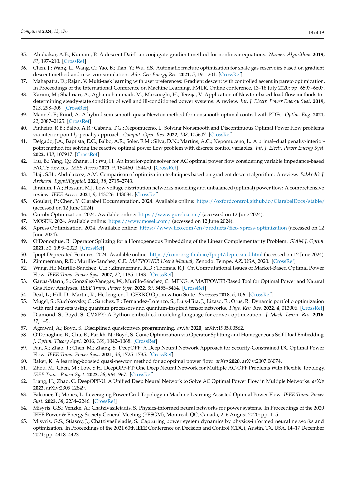

### Extraction assessment
- **Confidence:** 0.95 (meets the configured threshold).
- Machine-readable text was preserved with page-image provenance.

### Raw extracted text
```
Computers 2024, 13, 176
18 of 19
35.
Abubakar, A.B.; Kumam, P. A descent Dai-Liao conjugate gradient method for nonlinear equations. Numer. Algorithms 2019,
81, 197–210. [CrossRef]
36.
Chen, J.; Wang, L.; Wang, C.; Yao, B.; Tian, Y.; Wu, Y.S. Automatic fracture optimization for shale gas reservoirs based on gradient
descent method and reservoir simulation. Adv. Geo-Energy Res. 2021, 5, 191–201. [CrossRef]
37.
Mahapatra, D.; Rajan, V. Multi-task learning with user preferences: Gradient descent with controlled ascent in pareto optimization.
In Proceedings of the International Conference on Machine Learning, PMLR, Online conference, 13–18 July 2020; pp. 6597–6607.
38.
Karimi, M.; Shahriari, A.; Aghamohammadi, M.; Marzooghi, H.; Terzija, V. Application of Newton-based load flow methods for
determining steady-state condition of well and ill-conditioned power systems: A review. Int. J. Electr. Power Energy Syst. 2019,
113, 298–309. [CrossRef]
39.
Mannel, F.; Rund, A. A hybrid semismooth quasi-Newton method for nonsmooth optimal control with PDEs. Optim. Eng. 2021,
22, 2087–2125. [CrossRef]
40.
Pinheiro, R.B.; Balbo, A.R.; Cabana, T.G.; Nepomuceno, L. Solving Nonsmooth and Discontinuous Optimal Power Flow problems
via interior-point lp-penalty approach. Comput. Oper. Res. 2022, 138, 105607. [CrossRef]
41.
Delgado, J.A.; Baptista, E.C.; Balbo, A.R.; Soler, E.M.; Silva, D.N.; Martins, A.C.; Nepomuceno, L. A primal–dual penalty-interior-
point method for solving the reactive optimal power flow problem with discrete control variables. Int. J. Electr. Power Energy Syst.
2022, 138, 107917. [CrossRef]
42.
Liu, B.; Yang, Q.; Zhang, H.; Wu, H. An interior-point solver for AC optimal power flow considering variable impedance-based
FACTS devices. IEEE Access 2021, 9, 154460–154470. [CrossRef]
43.
Haji, S.H.; Abdulazeez, A.M. Comparison of optimization techniques based on gradient descent algorithm: A review. PalArch’s J.
Archaeol. Egypt/Egyptol. 2021, 18, 2715–2743.
44.
Ibrahim, I.A.; Hossain, M.J. Low voltage distribution networks modeling and unbalanced (optimal) power flow: A comprehensive
review. IEEE Access 2021, 9, 143026–143084. [CrossRef]
45.
Goulart, P.; Chen, Y. Clarabel Documentation. 2024. Available online: https://oxfordcontrol.github.io/ClarabelDocs/stable/
(accessed on 12 June 2024).
46.
Gurobi Optimization. 2024. Available online: https://www.gurobi.com/ (accessed on 12 June 2024).
47.
MOSEK. 2024. Available online: https://www.mosek.com/ (accessed on 12 June 2024).
48.
Xpress Optimization. 2024. Available online: https://www.fico.com/en/products/fico-xpress-optimization (accessed on 12
June 2024).
49.
O’Donoghue, B. Operator Splitting for a Homogeneous Embedding of the Linear Complementarity Problem. SIAM J. Optim.
2021, 31, 1999–2023. [CrossRef]
50.
Ipopt Deprecated Features. 2024. Available online: https://coin-or.github.io/Ipopt/deprecated.html (accessed on 12 June 2024).
51.
Zimmerman, R.D.; Murillo-Sánchez, C.E. MATPOWER User’s Manual; Zenodo: Tempe, AZ, USA, 2020. [CrossRef]
52.
Wang, H.; Murillo-Sanchez, C.E.; Zimmerman, R.D.; Thomas, R.J. On Computational Issues of Market-Based Optimal Power
Flow. IEEE Trans. Power Syst. 2007, 22, 1185–1193. [CrossRef]
53.
García-Marín, S.; González-Vanegas, W.; Murillo-Sánchez, C. MPNG: A MATPOWER-Based Tool for Optimal Power and Natural
Gas Flow Analyses. IEEE Trans. Power Syst. 2022, 39, 5455–5464. [CrossRef]
54.
Beal, L.; Hill, D.; Martin, R.; Hedengren, J. GEKKO Optimization Suite. Processes 2018, 6, 106. [CrossRef]
55.
Mugel, S.; Kuchkovsky, C.; Sanchez, E.; Fernandez-Lorenzo, S.; Luis-Hita, J.; Lizaso, E.; Orus, R. Dynamic portfolio optimization
with real datasets using quantum processors and quantum-inspired tensor networks. Phys. Rev. Res. 2022, 4, 013006. [CrossRef]
56.
Diamond, S.; Boyd, S. CVXPY: A Python-embedded modeling language for convex optimization. J. Mach. Learn. Res. 2016,
17, 1–5.
57.
Agrawal, A.; Boyd, S. Disciplined quasiconvex programming. arXiv 2020, arXiv:1905.00562.
58.
O’Donoghue, B.; Chu, E.; Parikh, N.; Boyd, S. Conic Optimization via Operator Splitting and Homogeneous Self-Dual Embedding.
J. Optim. Theory Appl. 2016, 169, 1042–1068. [CrossRef]
59.
Pan, X.; Zhao, T.; Chen, M.; Zhang, S. DeepOPF: A Deep Neural Network Approach for Security-Constrained DC Optimal Power
Flow. IEEE Trans. Power Syst. 2021, 36, 1725–1735. [CrossRef]
60.
Baker, K. A learning-boosted quasi-newton method for ac optimal power flow. arXiv 2020, arXiv:2007.06074.
61.
Zhou, M.; Chen, M.; Low, S.H. DeepOPF-FT: One Deep Neural Network for Multiple AC-OPF Problems With Flexible Topology.
IEEE Trans. Power Syst. 2023, 38, 964–967. [CrossRef]
62.
Liang, H.; Zhao, C. DeepOPF-U: A Unified Deep Neural Network to Solve AC Optimal Power Flow in Multiple Networks. arXiv
2023, arXiv:2309.12849.
63.
Falconer, T.; Mones, L. Leveraging Power Grid Topology in Machine Learning Assisted Optimal Power Flow. IEEE Trans. Power
Syst. 2023, 38, 2234–2246. [CrossRef]
64.
Misyris, G.S.; Venzke, A.; Chatzivasileiadis, S. Physics-informed neural networks for power systems. In Proceedings of the 2020
IEEE Power & Energy Society General Meeting (PESGM), Montreal, QC, Canada, 2–6 August 2020; pp. 1–5.
65.
Misyris, G.S.; Stiasny, J.; Chatzivasileiadis, S. Capturing power system dynamics by physics-informed neural networks and
optimization. In Proceedings of the 2021 60th IEEE Conference on Decision and Control (CDC), Austin, TX, USA, 14–17 December
2021; pp. 4418–4423.

```

## Page 19
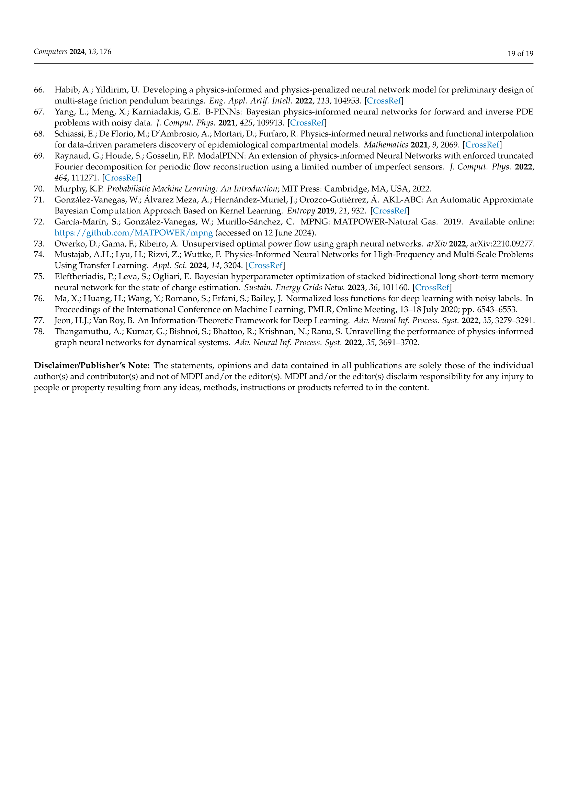

### Extraction assessment
- **Confidence:** 0.95 (meets the configured threshold).
- Machine-readable text was preserved with page-image provenance.

### Raw extracted text
```
Computers 2024, 13, 176
19 of 19
66.
Habib, A.; Yildirim, U. Developing a physics-informed and physics-penalized neural network model for preliminary design of
multi-stage friction pendulum bearings. Eng. Appl. Artif. Intell. 2022, 113, 104953. [CrossRef]
67.
Yang, L.; Meng, X.; Karniadakis, G.E. B-PINNs: Bayesian physics-informed neural networks for forward and inverse PDE
problems with noisy data. J. Comput. Phys. 2021, 425, 109913. [CrossRef]
68.
Schiassi, E.; De Florio, M.; D’Ambrosio, A.; Mortari, D.; Furfaro, R. Physics-informed neural networks and functional interpolation
for data-driven parameters discovery of epidemiological compartmental models. Mathematics 2021, 9, 2069. [CrossRef]
69.
Raynaud, G.; Houde, S.; Gosselin, F.P. ModalPINN: An extension of physics-informed Neural Networks with enforced truncated
Fourier decomposition for periodic flow reconstruction using a limited number of imperfect sensors. J. Comput. Phys. 2022,
464, 111271. [CrossRef]
70.
Murphy, K.P. Probabilistic Machine Learning: An Introduction; MIT Press: Cambridge, MA, USA, 2022.
71.
González-Vanegas, W.; Álvarez Meza, A.; Hernández-Muriel, J.; Orozco-Gutiérrez, Á. AKL-ABC: An Automatic Approximate
Bayesian Computation Approach Based on Kernel Learning. Entropy 2019, 21, 932. [CrossRef]
72.
García-Marín, S.; González-Vanegas, W.; Murillo-Sánchez, C. MPNG: MATPOWER-Natural Gas. 2019. Available online:
https://github.com/MATPOWER/mpng (accessed on 12 June 2024).
73.
Owerko, D.; Gama, F.; Ribeiro, A. Unsupervised optimal power flow using graph neural networks. arXiv 2022, arXiv:2210.09277.
74.
Mustajab, A.H.; Lyu, H.; Rizvi, Z.; Wuttke, F. Physics-Informed Neural Networks for High-Frequency and Multi-Scale Problems
Using Transfer Learning. Appl. Sci. 2024, 14, 3204. [CrossRef]
75.
Eleftheriadis, P.; Leva, S.; Ogliari, E. Bayesian hyperparameter optimization of stacked bidirectional long short-term memory
neural network for the state of charge estimation. Sustain. Energy Grids Netw. 2023, 36, 101160. [CrossRef]
76.
Ma, X.; Huang, H.; Wang, Y.; Romano, S.; Erfani, S.; Bailey, J. Normalized loss functions for deep learning with noisy labels. In
Proceedings of the International Conference on Machine Learning, PMLR, Online Meeting, 13–18 July 2020; pp. 6543–6553.
77.
Jeon, H.J.; Van Roy, B. An Information-Theoretic Framework for Deep Learning. Adv. Neural Inf. Process. Syst. 2022, 35, 3279–3291.
78.
Thangamuthu, A.; Kumar, G.; Bishnoi, S.; Bhattoo, R.; Krishnan, N.; Ranu, S. Unravelling the performance of physics-informed
graph neural networks for dynamical systems. Adv. Neural Inf. Process. Syst. 2022, 35, 3691–3702.
Disclaimer/Publisher’s Note: The statements, opinions and data contained in all publications are solely those of the individual
author(s) and contributor(s) and not of MDPI and/or the editor(s). MDPI and/or the editor(s) disclaim responsibility for any injury to
people or property resulting from any ideas, methods, instructions or products referred to in the content.

```
