# computers-15-00428

## Source
- PDF: `/Users/diego/Desktop/Proyectos/papersmith-ai/guidance/reference-papers/source/computers-15-00428.pdf`
- Source SHA-256: `ed28d0acdde873628a5913bc4695e1a531e60da5aebb0054b010807139dcb9b7`
- Rendered pages: 32 at 200 DPI (PyMuPDF).
- Confidence threshold: 0.85.
- Table policy: lite evidence only. Possible tables are retained only as exact raw page text and rendered page images; no rows, columns, cells, or inferred values are extracted.
- Equation policy: equation candidates retain exact raw extracted text; this extractor does not synthesize LaTeX.

## Page 1
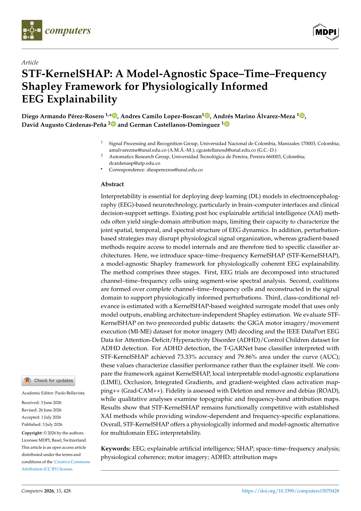

### Extraction assessment
- **Confidence:** 0.95 (meets the configured threshold).
- Machine-readable text was preserved with page-image provenance.

### Raw extracted text
```
Academic Editor: Paolo Bellavista
Received: 3 June 2026
Revised: 26 June 2026
Accepted: 1 July 2026
Published: 3 July 2026
Copyright: © 2026 by the authors.
Licensee MDPI, Basel, Switzerland.
This article is an open access article
distributed under the terms and
conditions of the Creative Commons
Attribution (CC BY) license.
Article
STF-KernelSHAP: A Model-Agnostic Space–Time–Frequency
Shapley Framework for Physiologically Informed
EEG Explainability
Diego Armando Pérez-Rosero 1,*
, Andres Camilo Lopez-Boscan1
, Andrés Marino Álvarez-Meza 1
,
David Augusto Cárdenas-Peña 2
and German Castellanos-Dominguez 1
1
Signal Processing and Recognition Group, Universidad Nacional de Colombia, Manizales 170003, Colombia;
amalvarezme@unal.edu.co (A.M.Á.-M.); cgcastellanosd@unal.edu.co (G.C.-D.)
2
Automatics Research Group, Universidad Tecnológica de Pereira, Pereira 660003, Colombia;
dcardenasp@utp.edu.co
*
Correspondence: dieaperezros@unal.edu.co
Abstract
Interpretability is essential for deploying deep learning (DL) models in electroencephalog-
raphy (EEG)-based neurotechnology, particularly in brain–computer interfaces and clinical
decision-support settings. Existing post hoc explainable artificial intelligence (XAI) meth-
ods often yield single-domain attribution maps, limiting their capacity to characterize the
joint spatial, temporal, and spectral structure of EEG dynamics. In addition, perturbation-
based strategies may disrupt physiological signal organization, whereas gradient-based
methods require access to model internals and are therefore tied to specific classifier ar-
chitectures. Here, we introduce space–time–frequency KernelSHAP (STF-KernelSHAP),
a model-agnostic Shapley framework for physiologically coherent EEG explainability.
The method comprises three stages. First, EEG trials are decomposed into structured
channel–time–frequency cells using segment-wise spectral analysis. Second, coalitions
are formed over complete channel–time–frequency cells and reconstructed in the signal
domain to support physiologically informed perturbations. Third, class-conditional rel-
evance is estimated with a KernelSHAP-based weighted surrogate model that uses only
model outputs, enabling architecture-independent Shapley estimation. We evaluate STF-
KernelSHAP on two prerecorded public datasets: the GIGA motor imagery/movement
execution (MI-ME) dataset for motor imagery (MI) decoding and the IEEE DataPort EEG
Data for Attention-Deficit/Hyperactivity Disorder (ADHD)/Control Children dataset for
ADHD detection. For ADHD detection, the T-GARNet base classifier interpreted with
STF-KernelSHAP achieved 73.33% accuracy and 79.86% area under the curve (AUC);
these values characterize classifier performance rather than the explainer itself. We com-
pare the framework against KernelSHAP, local interpretable model-agnostic explanations
(LIME), Occlusion, Integrated Gradients, and gradient-weighted class activation map-
ping++ (Grad-CAM++). Fidelity is assessed with Deletion and remove and debias (ROAD),
while qualitative analyses examine topographic and frequency-band attribution maps.
Results show that STF-KernelSHAP remains functionally competitive with established
XAI methods while providing window-dependent and frequency-specific explanations.
Overall, STF-KernelSHAP offers a physiologically informed and model-agnostic alternative
for multidomain EEG interpretability.
Keywords: EEG; explainable artificial intelligence; SHAP; space–time–frequency analysis;
physiological coherence; motor imagery; ADHD; attribution maps
Computers 2026, 15, 428
https://doi.org/10.3390/computers15070428

```

## Page 2
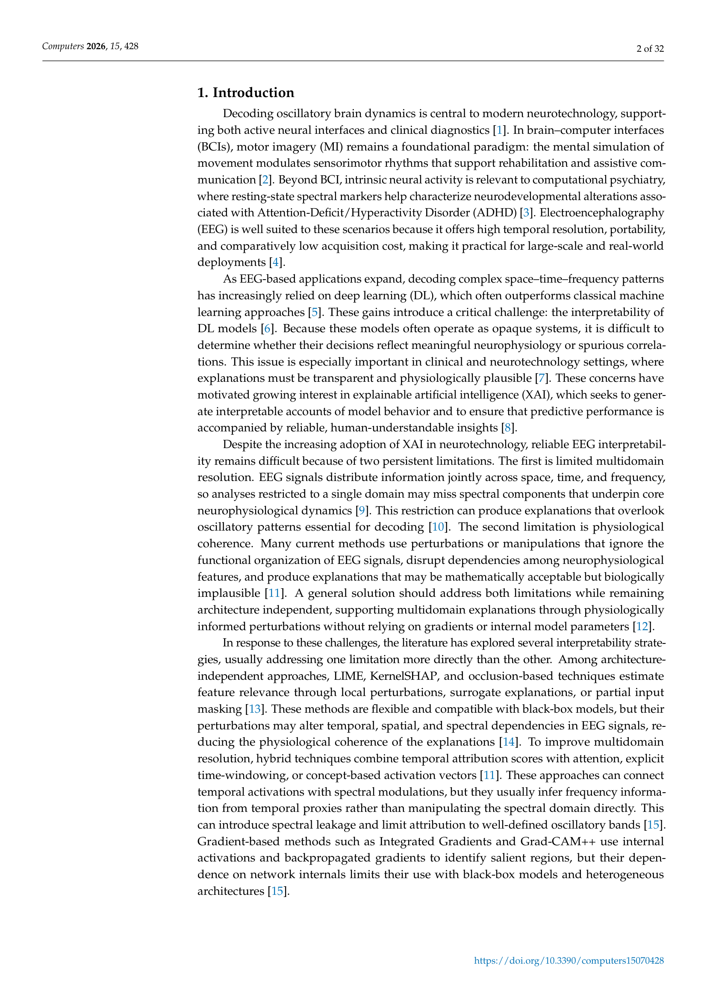

### Extraction assessment
- **Confidence:** 0.95 (meets the configured threshold).
- Machine-readable text was preserved with page-image provenance.

### Raw extracted text
```
Computers 2026, 15, 428
2 of 32
1. Introduction
Decoding oscillatory brain dynamics is central to modern neurotechnology, support-
ing both active neural interfaces and clinical diagnostics [1]. In brain–computer interfaces
(BCIs), motor imagery (MI) remains a foundational paradigm: the mental simulation of
movement modulates sensorimotor rhythms that support rehabilitation and assistive com-
munication [2]. Beyond BCI, intrinsic neural activity is relevant to computational psychiatry,
where resting-state spectral markers help characterize neurodevelopmental alterations asso-
ciated with Attention-Deficit/Hyperactivity Disorder (ADHD) [3]. Electroencephalography
(EEG) is well suited to these scenarios because it offers high temporal resolution, portability,
and comparatively low acquisition cost, making it practical for large-scale and real-world
deployments [4].
As EEG-based applications expand, decoding complex space–time–frequency patterns
has increasingly relied on deep learning (DL), which often outperforms classical machine
learning approaches [5]. These gains introduce a critical challenge: the interpretability of
DL models [6]. Because these models often operate as opaque systems, it is difficult to
determine whether their decisions reflect meaningful neurophysiology or spurious correla-
tions. This issue is especially important in clinical and neurotechnology settings, where
explanations must be transparent and physiologically plausible [7]. These concerns have
motivated growing interest in explainable artificial intelligence (XAI), which seeks to gener-
ate interpretable accounts of model behavior and to ensure that predictive performance is
accompanied by reliable, human-understandable insights [8].
Despite the increasing adoption of XAI in neurotechnology, reliable EEG interpretabil-
ity remains difficult because of two persistent limitations. The first is limited multidomain
resolution. EEG signals distribute information jointly across space, time, and frequency,
so analyses restricted to a single domain may miss spectral components that underpin core
neurophysiological dynamics [9]. This restriction can produce explanations that overlook
oscillatory patterns essential for decoding [10]. The second limitation is physiological
coherence. Many current methods use perturbations or manipulations that ignore the
functional organization of EEG signals, disrupt dependencies among neurophysiological
features, and produce explanations that may be mathematically acceptable but biologically
implausible [11]. A general solution should address both limitations while remaining
architecture independent, supporting multidomain explanations through physiologically
informed perturbations without relying on gradients or internal model parameters [12].
In response to these challenges, the literature has explored several interpretability strate-
gies, usually addressing one limitation more directly than the other. Among architecture-
independent approaches, LIME, KernelSHAP, and occlusion-based techniques estimate
feature relevance through local perturbations, surrogate explanations, or partial input
masking [13]. These methods are flexible and compatible with black-box models, but their
perturbations may alter temporal, spatial, and spectral dependencies in EEG signals, re-
ducing the physiological coherence of the explanations [14]. To improve multidomain
resolution, hybrid techniques combine temporal attribution scores with attention, explicit
time-windowing, or concept-based activation vectors [11]. These approaches can connect
temporal activations with spectral modulations, but they usually infer frequency informa-
tion from temporal proxies rather than manipulating the spectral domain directly. This
can introduce spectral leakage and limit attribution to well-defined oscillatory bands [15].
Gradient-based methods such as Integrated Gradients and Grad-CAM++ use internal
activations and backpropagated gradients to identify salient regions, but their depen-
dence on network internals limits their use with black-box models and heterogeneous
architectures [15].
https://doi.org/10.3390/computers15070428

```

## Page 3
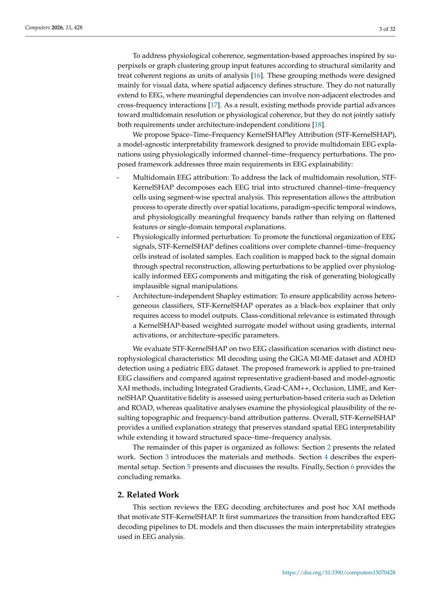

### Extraction assessment
- **Confidence:** 0.95 (meets the configured threshold).
- Machine-readable text was preserved with page-image provenance.

### Raw extracted text
```
Computers 2026, 15, 428
3 of 32
To address physiological coherence, segmentation-based approaches inspired by su-
perpixels or graph clustering group input features according to structural similarity and
treat coherent regions as units of analysis [16]. These grouping methods were designed
mainly for visual data, where spatial adjacency defines structure. They do not naturally
extend to EEG, where meaningful dependencies can involve non-adjacent electrodes and
cross-frequency interactions [17]. As a result, existing methods provide partial advances
toward multidomain resolution or physiological coherence, but they do not jointly satisfy
both requirements under architecture-independent conditions [18].
We propose Space–Time–Frequency KernelSHAPley Attribution (STF-KernelSHAP),
a model-agnostic interpretability framework designed to provide multidomain EEG expla-
nations using physiologically informed channel–time–frequency perturbations. The pro-
posed framework addresses three main requirements in EEG explainability:
-
Multidomain EEG attribution: To address the lack of multidomain resolution, STF-
KernelSHAP decomposes each EEG trial into structured channel–time–frequency
cells using segment-wise spectral analysis. This representation allows the attribution
process to operate directly over spatial locations, paradigm-specific temporal windows,
and physiologically meaningful frequency bands rather than relying on flattened
features or single-domain temporal explanations.
-
Physiologically informed perturbation: To promote the functional organization of EEG
signals, STF-KernelSHAP defines coalitions over complete channel–time–frequency
cells instead of isolated samples. Each coalition is mapped back to the signal domain
through spectral reconstruction, allowing perturbations to be applied over physiolog-
ically informed EEG components and mitigating the risk of generating biologically
implausible signal manipulations.
-
Architecture-independent Shapley estimation: To ensure applicability across hetero-
geneous classifiers, STF-KernelSHAP operates as a black-box explainer that only
requires access to model outputs. Class-conditional relevance is estimated through
a KernelSHAP-based weighted surrogate model without using gradients, internal
activations, or architecture-specific parameters.
We evaluate STF-KernelSHAP on two EEG classification scenarios with distinct neu-
rophysiological characteristics: MI decoding using the GIGA MI-ME dataset and ADHD
detection using a pediatric EEG dataset. The proposed framework is applied to pre-trained
EEG classifiers and compared against representative gradient-based and model-agnostic
XAI methods, including Integrated Gradients, Grad-CAM++, Occlusion, LIME, and Ker-
nelSHAP. Quantitative fidelity is assessed using perturbation-based criteria such as Deletion
and ROAD, whereas qualitative analyses examine the physiological plausibility of the re-
sulting topographic and frequency-band attribution patterns. Overall, STF-KernelSHAP
provides a unified explanation strategy that preserves standard spatial EEG interpretability
while extending it toward structured space–time–frequency analysis.
The remainder of this paper is organized as follows: Section 2 presents the related
work. Section 3 introduces the materials and methods. Section 4 describes the experi-
mental setup. Section 5 presents and discusses the results. Finally, Section 6 provides the
concluding remarks.
2. Related Work
This section reviews the EEG decoding architectures and post hoc XAI methods
that motivate STF-KernelSHAP. It first summarizes the transition from handcrafted EEG
decoding pipelines to DL models and then discusses the main interpretability strategies
used in EEG analysis.
https://doi.org/10.3390/computers15070428

```

## Page 4
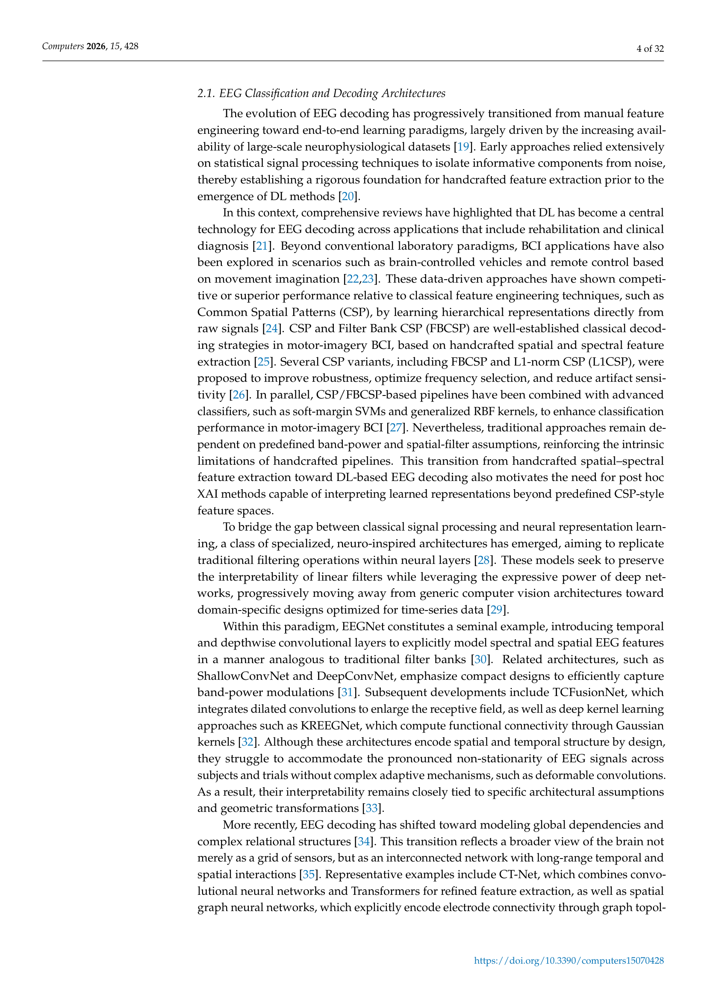

### Extraction assessment
- **Confidence:** 0.95 (meets the configured threshold).
- Machine-readable text was preserved with page-image provenance.

### Raw extracted text
```
Computers 2026, 15, 428
4 of 32
2.1. EEG Classification and Decoding Architectures
The evolution of EEG decoding has progressively transitioned from manual feature
engineering toward end-to-end learning paradigms, largely driven by the increasing avail-
ability of large-scale neurophysiological datasets [19]. Early approaches relied extensively
on statistical signal processing techniques to isolate informative components from noise,
thereby establishing a rigorous foundation for handcrafted feature extraction prior to the
emergence of DL methods [20].
In this context, comprehensive reviews have highlighted that DL has become a central
technology for EEG decoding across applications that include rehabilitation and clinical
diagnosis [21]. Beyond conventional laboratory paradigms, BCI applications have also
been explored in scenarios such as brain-controlled vehicles and remote control based
on movement imagination [22,23]. These data-driven approaches have shown competi-
tive or superior performance relative to classical feature engineering techniques, such as
Common Spatial Patterns (CSP), by learning hierarchical representations directly from
raw signals [24]. CSP and Filter Bank CSP (FBCSP) are well-established classical decod-
ing strategies in motor-imagery BCI, based on handcrafted spatial and spectral feature
extraction [25]. Several CSP variants, including FBCSP and L1-norm CSP (L1CSP), were
proposed to improve robustness, optimize frequency selection, and reduce artifact sensi-
tivity [26]. In parallel, CSP/FBCSP-based pipelines have been combined with advanced
classifiers, such as soft-margin SVMs and generalized RBF kernels, to enhance classification
performance in motor-imagery BCI [27]. Nevertheless, traditional approaches remain de-
pendent on predefined band-power and spatial-filter assumptions, reinforcing the intrinsic
limitations of handcrafted pipelines. This transition from handcrafted spatial–spectral
feature extraction toward DL-based EEG decoding also motivates the need for post hoc
XAI methods capable of interpreting learned representations beyond predefined CSP-style
feature spaces.
To bridge the gap between classical signal processing and neural representation learn-
ing, a class of specialized, neuro-inspired architectures has emerged, aiming to replicate
traditional filtering operations within neural layers [28]. These models seek to preserve
the interpretability of linear filters while leveraging the expressive power of deep net-
works, progressively moving away from generic computer vision architectures toward
domain-specific designs optimized for time-series data [29].
Within this paradigm, EEGNet constitutes a seminal example, introducing temporal
and depthwise convolutional layers to explicitly model spectral and spatial EEG features
in a manner analogous to traditional filter banks [30]. Related architectures, such as
ShallowConvNet and DeepConvNet, emphasize compact designs to efficiently capture
band-power modulations [31]. Subsequent developments include TCFusionNet, which
integrates dilated convolutions to enlarge the receptive field, as well as deep kernel learning
approaches such as KREEGNet, which compute functional connectivity through Gaussian
kernels [32]. Although these architectures encode spatial and temporal structure by design,
they struggle to accommodate the pronounced non-stationarity of EEG signals across
subjects and trials without complex adaptive mechanisms, such as deformable convolutions.
As a result, their interpretability remains closely tied to specific architectural assumptions
and geometric transformations [33].
More recently, EEG decoding has shifted toward modeling global dependencies and
complex relational structures [34]. This transition reflects a broader view of the brain not
merely as a grid of sensors, but as an interconnected network with long-range temporal and
spatial interactions [35]. Representative examples include CT-Net, which combines convo-
lutional neural networks and Transformers for refined feature extraction, as well as spatial
graph neural networks, which explicitly encode electrode connectivity through graph topol-
https://doi.org/10.3390/computers15070428

```

## Page 5
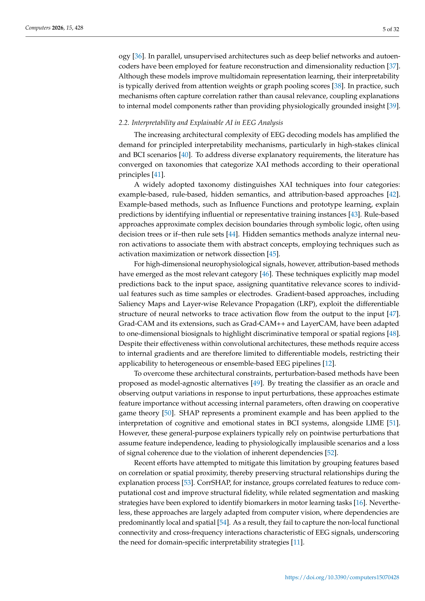

### Extraction assessment
- **Confidence:** 0.95 (meets the configured threshold).
- Machine-readable text was preserved with page-image provenance.

### Raw extracted text
```
Computers 2026, 15, 428
5 of 32
ogy [36]. In parallel, unsupervised architectures such as deep belief networks and autoen-
coders have been employed for feature reconstruction and dimensionality reduction [37].
Although these models improve multidomain representation learning, their interpretability
is typically derived from attention weights or graph pooling scores [38]. In practice, such
mechanisms often capture correlation rather than causal relevance, coupling explanations
to internal model components rather than providing physiologically grounded insight [39].
2.2. Interpretability and Explainable AI in EEG Analysis
The increasing architectural complexity of EEG decoding models has amplified the
demand for principled interpretability mechanisms, particularly in high-stakes clinical
and BCI scenarios [40]. To address diverse explanatory requirements, the literature has
converged on taxonomies that categorize XAI methods according to their operational
principles [41].
A widely adopted taxonomy distinguishes XAI techniques into four categories:
example-based, rule-based, hidden semantics, and attribution-based approaches [42].
Example-based methods, such as Influence Functions and prototype learning, explain
predictions by identifying influential or representative training instances [43]. Rule-based
approaches approximate complex decision boundaries through symbolic logic, often using
decision trees or if–then rule sets [44]. Hidden semantics methods analyze internal neu-
ron activations to associate them with abstract concepts, employing techniques such as
activation maximization or network dissection [45].
For high-dimensional neurophysiological signals, however, attribution-based methods
have emerged as the most relevant category [46]. These techniques explicitly map model
predictions back to the input space, assigning quantitative relevance scores to individ-
ual features such as time samples or electrodes. Gradient-based approaches, including
Saliency Maps and Layer-wise Relevance Propagation (LRP), exploit the differentiable
structure of neural networks to trace activation flow from the output to the input [47].
Grad-CAM and its extensions, such as Grad-CAM++ and LayerCAM, have been adapted
to one-dimensional biosignals to highlight discriminative temporal or spatial regions [48].
Despite their effectiveness within convolutional architectures, these methods require access
to internal gradients and are therefore limited to differentiable models, restricting their
applicability to heterogeneous or ensemble-based EEG pipelines [12].
To overcome these architectural constraints, perturbation-based methods have been
proposed as model-agnostic alternatives [49]. By treating the classifier as an oracle and
observing output variations in response to input perturbations, these approaches estimate
feature importance without accessing internal parameters, often drawing on cooperative
game theory [50]. SHAP represents a prominent example and has been applied to the
interpretation of cognitive and emotional states in BCI systems, alongside LIME [51].
However, these general-purpose explainers typically rely on pointwise perturbations that
assume feature independence, leading to physiologically implausible scenarios and a loss
of signal coherence due to the violation of inherent dependencies [52].
Recent efforts have attempted to mitigate this limitation by grouping features based
on correlation or spatial proximity, thereby preserving structural relationships during the
explanation process [53]. CorrSHAP, for instance, groups correlated features to reduce com-
putational cost and improve structural fidelity, while related segmentation and masking
strategies have been explored to identify biomarkers in motor learning tasks [16]. Neverthe-
less, these approaches are largely adapted from computer vision, where dependencies are
predominantly local and spatial [54]. As a result, they fail to capture the non-local functional
connectivity and cross-frequency interactions characteristic of EEG signals, underscoring
the need for domain-specific interpretability strategies [11].
https://doi.org/10.3390/computers15070428

```

## Page 6
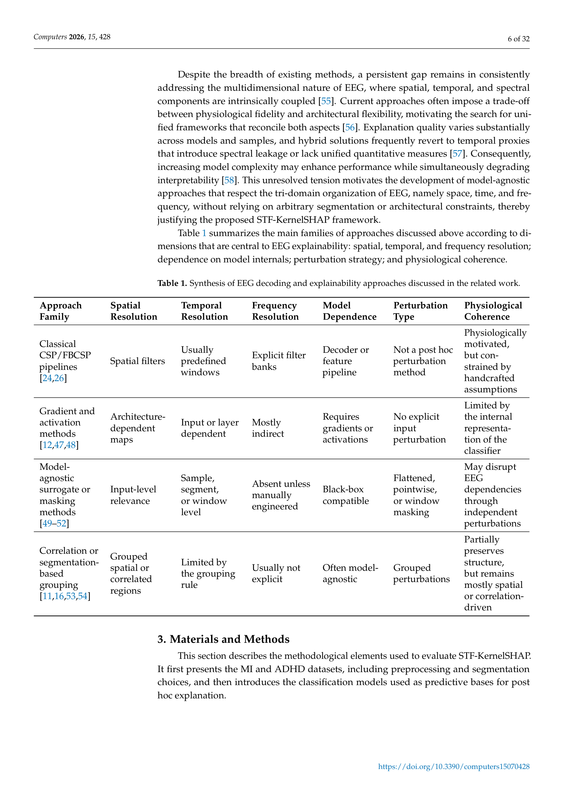

### Extraction assessment
- **Confidence:** 0.95 (meets the configured threshold).
- Machine-readable text was preserved with page-image provenance.

### Raw extracted text
```
Computers 2026, 15, 428
6 of 32
Despite the breadth of existing methods, a persistent gap remains in consistently
addressing the multidimensional nature of EEG, where spatial, temporal, and spectral
components are intrinsically coupled [55]. Current approaches often impose a trade-off
between physiological fidelity and architectural flexibility, motivating the search for uni-
fied frameworks that reconcile both aspects [56]. Explanation quality varies substantially
across models and samples, and hybrid solutions frequently revert to temporal proxies
that introduce spectral leakage or lack unified quantitative measures [57]. Consequently,
increasing model complexity may enhance performance while simultaneously degrading
interpretability [58]. This unresolved tension motivates the development of model-agnostic
approaches that respect the tri-domain organization of EEG, namely space, time, and fre-
quency, without relying on arbitrary segmentation or architectural constraints, thereby
justifying the proposed STF-KernelSHAP framework.
Table 1 summarizes the main families of approaches discussed above according to di-
mensions that are central to EEG explainability: spatial, temporal, and frequency resolution;
dependence on model internals; perturbation strategy; and physiological coherence.
Table 1. Synthesis of EEG decoding and explainability approaches discussed in the related work.
Approach
Family
Spatial
Resolution
Temporal
Resolution
Frequency
Resolution
Model
Dependence
Perturbation
Type
Physiological
Coherence
Classical
CSP/FBCSP
pipelines
[24,26]
Spatial filters
Usually
predefined
windows
Explicit filter
banks
Decoder or
feature
pipeline
Not a post hoc
perturbation
method
Physiologically
motivated,
but con-
strained by
handcrafted
assumptions
Gradient and
activation
methods
[12,47,48]
Architecture-
dependent
maps
Input or layer
dependent
Mostly
indirect
Requires
gradients or
activations
No explicit
input
perturbation
Limited by
the internal
representa-
tion of the
classifier
Model-
agnostic
surrogate or
masking
methods
[49–52]
Input-level
relevance
Sample,
segment,
or window
level
Absent unless
manually
engineered
Black-box
compatible
Flattened,
pointwise,
or window
masking
May disrupt
EEG
dependencies
through
independent
perturbations
Correlation or
segmentation-
based
grouping
[11,16,53,54]
Grouped
spatial or
correlated
regions
Limited by
the grouping
rule
Usually not
explicit
Often model-
agnostic
Grouped
perturbations
Partially
preserves
structure,
but remains
mostly spatial
or correlation-
driven
3. Materials and Methods
This section describes the methodological elements used to evaluate STF-KernelSHAP.
It first presents the MI and ADHD datasets, including preprocessing and segmentation
choices, and then introduces the classification models used as predictive bases for post
hoc explanation.
https://doi.org/10.3390/computers15070428

```

## Page 7
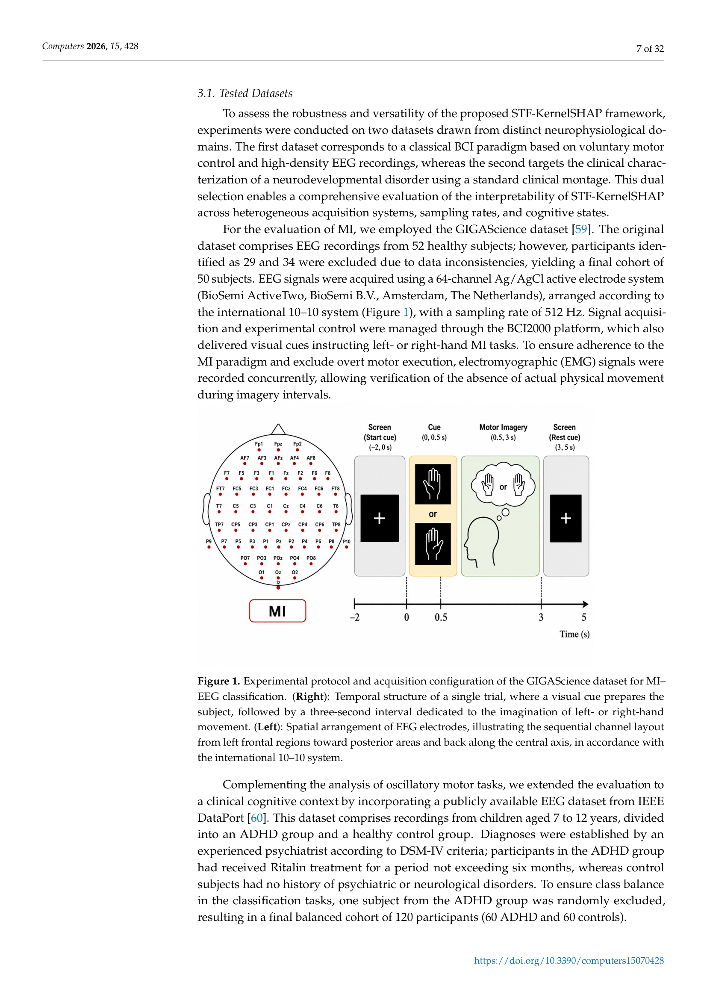

### Extraction assessment
- **Confidence:** 0.75 (below the configured 0.85 threshold; human review required).
- Embedded images require visual review; captions remain page-level text evidence only.

### Raw extracted text
```
Computers 2026, 15, 428
7 of 32
3.1. Tested Datasets
To assess the robustness and versatility of the proposed STF-KernelSHAP framework,
experiments were conducted on two datasets drawn from distinct neurophysiological do-
mains. The first dataset corresponds to a classical BCI paradigm based on voluntary motor
control and high-density EEG recordings, whereas the second targets the clinical charac-
terization of a neurodevelopmental disorder using a standard clinical montage. This dual
selection enables a comprehensive evaluation of the interpretability of STF-KernelSHAP
across heterogeneous acquisition systems, sampling rates, and cognitive states.
For the evaluation of MI, we employed the GIGAScience dataset [59]. The original
dataset comprises EEG recordings from 52 healthy subjects; however, participants iden-
tified as 29 and 34 were excluded due to data inconsistencies, yielding a final cohort of
50 subjects. EEG signals were acquired using a 64-channel Ag/AgCl active electrode system
(BioSemi ActiveTwo, BioSemi B.V., Amsterdam, The Netherlands), arranged according to
the international 10–10 system (Figure 1), with a sampling rate of 512 Hz. Signal acquisi-
tion and experimental control were managed through the BCI2000 platform, which also
delivered visual cues instructing left- or right-hand MI tasks. To ensure adherence to the
MI paradigm and exclude overt motor execution, electromyographic (EMG) signals were
recorded concurrently, allowing verification of the absence of actual physical movement
during imagery intervals.
Figure 1. Experimental protocol and acquisition configuration of the GIGAScience dataset for MI–
EEG classification. (Right): Temporal structure of a single trial, where a visual cue prepares the
subject, followed by a three-second interval dedicated to the imagination of left- or right-hand
movement. (Left): Spatial arrangement of EEG electrodes, illustrating the sequential channel layout
from left frontal regions toward posterior areas and back along the central axis, in accordance with
the international 10–10 system.
Complementing the analysis of oscillatory motor tasks, we extended the evaluation to
a clinical cognitive context by incorporating a publicly available EEG dataset from IEEE
DataPort [60]. This dataset comprises recordings from children aged 7 to 12 years, divided
into an ADHD group and a healthy control group. Diagnoses were established by an
experienced psychiatrist according to DSM-IV criteria; participants in the ADHD group
had received Ritalin treatment for a period not exceeding six months, whereas control
subjects had no history of psychiatric or neurological disorders. To ensure class balance
in the classification tasks, one subject from the ADHD group was randomly excluded,
resulting in a final balanced cohort of 120 participants (60 ADHD and 60 controls).
https://doi.org/10.3390/computers15070428

```

### Textual figure-caption evidence
- Figure 1. Experimental protocol and acquisition configuration of the GIGAScience dataset for MI–
- Captions are page-level text evidence and are not associated with embedded images.

### Embedded images
- `page-007-image-001` — embedded image metadata: 1536 × 1024 px, xref 311; visual review required.

## Page 8
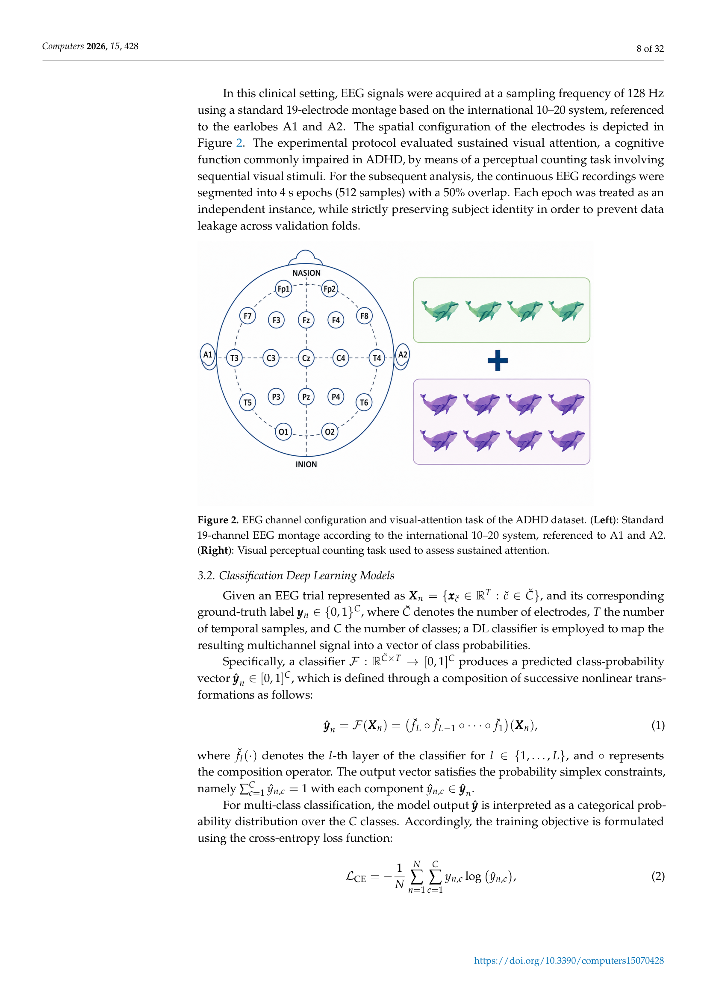

### Extraction assessment
- **Confidence:** 0.65 (below the configured 0.85 threshold; human review required).
- One or more equation candidates are ambiguous in raw extraction. Embedded images require visual review; captions remain page-level text evidence only.

### Raw extracted text
```
Computers 2026, 15, 428
8 of 32
In this clinical setting, EEG signals were acquired at a sampling frequency of 128 Hz
using a standard 19-electrode montage based on the international 10–20 system, referenced
to the earlobes A1 and A2. The spatial configuration of the electrodes is depicted in
Figure 2. The experimental protocol evaluated sustained visual attention, a cognitive
function commonly impaired in ADHD, by means of a perceptual counting task involving
sequential visual stimuli. For the subsequent analysis, the continuous EEG recordings were
segmented into 4 s epochs (512 samples) with a 50% overlap. Each epoch was treated as an
independent instance, while strictly preserving subject identity in order to prevent data
leakage across validation folds.
Figure 2. EEG channel configuration and visual-attention task of the ADHD dataset. (Left): Standard
19-channel EEG montage according to the international 10–20 system, referenced to A1 and A2.
(Right): Visual perceptual counting task used to assess sustained attention.
3.2. Classification Deep Learning Models
Given an EEG trial represented as Xn = {x ˘c ∈RT : ˘c ∈˘C}, and its corresponding
ground-truth label yn ∈{0, 1}C, where ˘C denotes the number of electrodes, T the number
of temporal samples, and C the number of classes; a DL classifier is employed to map the
resulting multichannel signal into a vector of class probabilities.
Specifically, a classifier F : R ˘C×T →[0, 1]C produces a predicted class-probability
vector ˆyn ∈[0, 1]C, which is defined through a composition of successive nonlinear trans-
formations as follows:
ˆyn = F(Xn) =
 ˘fL ◦˘fL−1 ◦· · · ◦˘f1
(Xn),
(1)
where ˘fl(·) denotes the l-th layer of the classifier for l ∈{1, . . . , L}, and ◦represents
the composition operator. The output vector satisfies the probability simplex constraints,
namely ∑C
c=1 ˆyn,c = 1 with each component ˆyn,c ∈ˆyn.
For multi-class classification, the model output ˆy is interpreted as a categorical prob-
ability distribution over the C classes. Accordingly, the training objective is formulated
using the cross-entropy loss function:
LCE = −1
N
N
∑
n=1
C
∑
c=1
yn,c log
 ˆyn,c

,
(2)
https://doi.org/10.3390/computers15070428

```

### Textual figure-caption evidence
- Figure 2. The experimental protocol evaluated sustained visual attention, a cognitive
- Figure 2. EEG channel configuration and visual-attention task of the ADHD dataset. (Left): Standard
- Captions are page-level text evidence and are not associated with embedded images.

### Equation candidates
- `page-008-equation-001` — review_required (confidence 0.45; page 8).
```
Given an EEG trial represented as Xn = {x ˘c ∈RT : ˘c ∈˘C}, and its corresponding
```
- `page-008-equation-002` — review_required (confidence 0.45; page 8).
```
ground-truth label yn ∈{0, 1}C, where ˘C denotes the number of electrodes, T the number
```
- `page-008-equation-003` — review_required (confidence 0.45; page 8).
```
Specifically, a classifier F : R ˘C×T →[0, 1]C produces a predicted class-probability
```
- `page-008-equation-004` — review_required (confidence 0.45; page 8).
```
vector ˆyn ∈[0, 1]C, which is defined through a composition of successive nonlinear trans-
```
- `page-008-equation-005` — review_required (confidence 0.45; page 8).
```
ˆyn = F(Xn) =
```
- `page-008-equation-006` — review_required (confidence 0.45; page 8).
```
where ˘fl(·) denotes the l-th layer of the classifier for l ∈{1, . . . , L}, and ◦represents
```
- `page-008-equation-007` — review_required (confidence 0.45; page 8).
```
namely ∑C
```
- `page-008-equation-008` — raw_text_preserved (confidence 0.98; page 8).
```
c=1 ˆyn,c = 1 with each component ˆyn,c ∈ˆyn.
```
- `page-008-equation-009` — raw_text_preserved (confidence 0.98; page 8).
```
LCE = −1
```
- `page-008-equation-010` — review_required (confidence 0.45; page 8).
```
∑
```
- `page-008-equation-011` — raw_text_preserved (confidence 0.98; page 8).
```
n=1
```
- `page-008-equation-012` — review_required (confidence 0.45; page 8).
```
∑
```
- `page-008-equation-013` — raw_text_preserved (confidence 0.98; page 8).
```
c=1
```

### Embedded images
- `page-008-image-001` — embedded image metadata: 1536 × 1024 px, xref 323; visual review required.

## Page 9
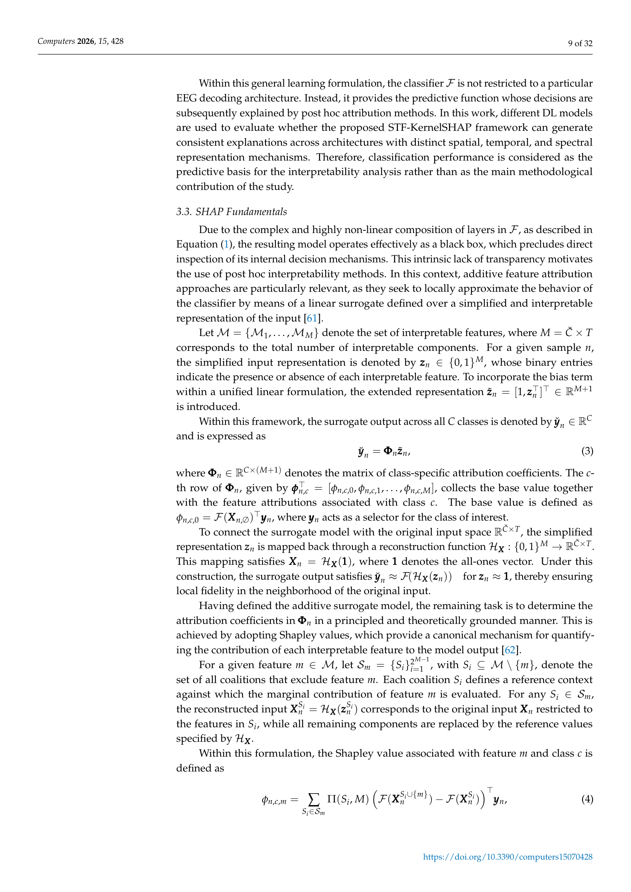

### Extraction assessment
- **Confidence:** 0.65 (below the configured 0.85 threshold; human review required).
- One or more equation candidates are ambiguous in raw extraction.

### Raw extracted text
```
Computers 2026, 15, 428
9 of 32
Within this general learning formulation, the classifier F is not restricted to a particular
EEG decoding architecture. Instead, it provides the predictive function whose decisions are
subsequently explained by post hoc attribution methods. In this work, different DL models
are used to evaluate whether the proposed STF-KernelSHAP framework can generate
consistent explanations across architectures with distinct spatial, temporal, and spectral
representation mechanisms. Therefore, classification performance is considered as the
predictive basis for the interpretability analysis rather than as the main methodological
contribution of the study.
3.3. SHAP Fundamentals
Due to the complex and highly non-linear composition of layers in F, as described in
Equation (1), the resulting model operates effectively as a black box, which precludes direct
inspection of its internal decision mechanisms. This intrinsic lack of transparency motivates
the use of post hoc interpretability methods. In this context, additive feature attribution
approaches are particularly relevant, as they seek to locally approximate the behavior of
the classifier by means of a linear surrogate defined over a simplified and interpretable
representation of the input [61].
Let M = {M1, . . . , MM} denote the set of interpretable features, where M = ˘C × T
corresponds to the total number of interpretable components. For a given sample n,
the simplified input representation is denoted by zn ∈{0, 1}M, whose binary entries
indicate the presence or absence of each interpretable feature. To incorporate the bias term
within a unified linear formulation, the extended representation ˜zn = [1,z⊤
n ]⊤∈RM+1
is introduced.
Within this framework, the surrogate output across all C classes is denoted by ˘yn ∈RC
and is expressed as
˘yn = Φn˜zn,
(3)
where Φn ∈RC×(M+1) denotes the matrix of class-specific attribution coefficients. The c-
th row of Φn, given by ϕ⊤
n,c = [ϕn,c,0, ϕn,c,1, . . . , ϕn,c,M], collects the base value together
with the feature attributions associated with class c.
The base value is defined as
ϕn,c,0 = F(Xn,∅)⊤yn, where yn acts as a selector for the class of interest.
To connect the surrogate model with the original input space R ˘C×T, the simplified
representation zn is mapped back through a reconstruction function HX : {0, 1}M →R ˘C×T.
This mapping satisfies Xn = HX(1), where 1 denotes the all-ones vector. Under this
construction, the surrogate output satisfies ˘yn ≈F(HX(zn))
for zn ≈1, thereby ensuring
local fidelity in the neighborhood of the original input.
Having defined the additive surrogate model, the remaining task is to determine the
attribution coefficients in Φn in a principled and theoretically grounded manner. This is
achieved by adopting Shapley values, which provide a canonical mechanism for quantify-
ing the contribution of each interpretable feature to the model output [62].
For a given feature m ∈M, let Sm = {Si}2M−1
i=1 , with Si ⊆M \ {m}, denote the
set of all coalitions that exclude feature m. Each coalition Si defines a reference context
against which the marginal contribution of feature m is evaluated. For any Si ∈Sm,
the reconstructed input XSin = HX(zSin ) corresponds to the original input Xn restricted to
the features in Si, while all remaining components are replaced by the reference values
specified by HX.
Within this formulation, the Shapley value associated with feature m and class c is
defined as
ϕn,c,m = ∑
Si∈Sm
Π(Si, M)

F(XSi∪{m}
n
) −F(XSin )
⊤
yn,
(4)
https://doi.org/10.3390/computers15070428

```

### Equation candidates
- `page-009-equation-001` — review_required (confidence 0.45; page 9).
```
Let M = {M1, . . . , MM} denote the set of interpretable features, where M = ˘C × T
```
- `page-009-equation-002` — review_required (confidence 0.45; page 9).
```
the simplified input representation is denoted by zn ∈{0, 1}M, whose binary entries
```
- `page-009-equation-003` — review_required (confidence 0.45; page 9).
```
within a unified linear formulation, the extended representation ˜zn = [1,z⊤
```
- `page-009-equation-004` — review_required (confidence 0.45; page 9).
```
n ]⊤∈RM+1
```
- `page-009-equation-005` — review_required (confidence 0.45; page 9).
```
Within this framework, the surrogate output across all C classes is denoted by ˘yn ∈RC
```
- `page-009-equation-006` — review_required (confidence 0.45; page 9).
```
˘yn = Φn˜zn,
```
- `page-009-equation-007` — review_required (confidence 0.45; page 9).
```
where Φn ∈RC×(M+1) denotes the matrix of class-specific attribution coefficients. The c-
```
- `page-009-equation-008` — review_required (confidence 0.45; page 9).
```
n,c = [ϕn,c,0, ϕn,c,1, . . . , ϕn,c,M], collects the base value together
```
- `page-009-equation-009` — review_required (confidence 0.45; page 9).
```
ϕn,c,0 = F(Xn,∅)⊤yn, where yn acts as a selector for the class of interest.
```
- `page-009-equation-010` — review_required (confidence 0.45; page 9).
```
To connect the surrogate model with the original input space R ˘C×T, the simplified
```
- `page-009-equation-011` — review_required (confidence 0.45; page 9).
```
representation zn is mapped back through a reconstruction function HX : {0, 1}M →R ˘C×T.
```
- `page-009-equation-012` — review_required (confidence 0.45; page 9).
```
This mapping satisfies Xn = HX(1), where 1 denotes the all-ones vector. Under this
```
- `page-009-equation-013` — review_required (confidence 0.45; page 9).
```
construction, the surrogate output satisfies ˘yn ≈F(HX(zn))
```
- `page-009-equation-014` — review_required (confidence 0.45; page 9).
```
for zn ≈1, thereby ensuring
```
- `page-009-equation-015` — review_required (confidence 0.45; page 9).
```
For a given feature m ∈M, let Sm = {Si}2M−1
```
- `page-009-equation-016` — raw_text_preserved (confidence 0.98; page 9).
```
i=1 , with Si ⊆M \ {m}, denote the
```
- `page-009-equation-017` — review_required (confidence 0.45; page 9).
```
against which the marginal contribution of feature m is evaluated. For any Si ∈Sm,
```
- `page-009-equation-018` — review_required (confidence 0.45; page 9).
```
the reconstructed input XSin = HX(zSin ) corresponds to the original input Xn restricted to
```
- `page-009-equation-019` — review_required (confidence 0.45; page 9).
```
ϕn,c,m = ∑
```
- `page-009-equation-020` — raw_text_preserved (confidence 0.98; page 9).
```
Si∈Sm
```

## Page 10
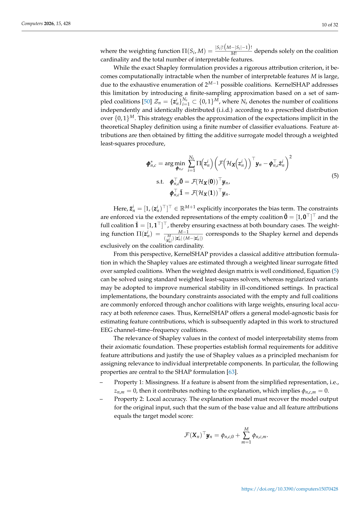

### Extraction assessment
- **Confidence:** 0.65 (below the configured 0.85 threshold; human review required).
- One or more equation candidates are ambiguous in raw extraction.

### Raw extracted text
```
Computers 2026, 15, 428
10 of 32
where the weighting function Π(Si, M) =
|Si|!
M−|Si|−1

!
M!
depends solely on the coalition
cardinality and the total number of interpretable features.
While the exact Shapley formulation provides a rigorous attribution criterion, it be-
comes computationally intractable when the number of interpretable features M is large,
due to the exhaustive enumeration of 2M−1 possible coalitions. KernelSHAP addresses
this limitation by introducing a finite-sampling approximation based on a set of sam-
pled coalitions [50] Zn = {zi
n}Ns
i=1 ⊂{0, 1}M, where Ns denotes the number of coalitions
independently and identically distributed (i.i.d.) according to a prescribed distribution
over {0, 1}M. This strategy enables the approximation of the expectations implicit in the
theoretical Shapley definition using a finite number of classifier evaluations. Feature at-
tributions are then obtained by fitting the additive surrogate model through a weighted
least-squares procedure,
ϕ∗
n,c = arg min
ϕn,c
Ns
∑
i=1
Π

zi
n

F

HX

zi
n
⊤
yn −ϕ⊤
n,c˜zi
n
2
s.t.
ϕ⊤
n,c˜0 = F(HX(0))⊤yn,
ϕ⊤
n,c˜1 = F(HX(1))⊤yn.
(5)
Here, ˜zi
n = [1, (zi
n)⊤]⊤∈RM+1 explicitly incorporates the bias term. The constraints
are enforced via the extended representations of the empty coalition ˜0 = [1,0⊤]⊤and the
full coalition ˜1 = [1,1⊤]⊤, thereby ensuring exactness at both boundary cases. The weight-
ing function Π(zi
n) =
M−1
( M
|zin|) |zin| (M−|zin|) corresponds to the Shapley kernel and depends
exclusively on the coalition cardinality.
From this perspective, KernelSHAP provides a classical additive attribution formula-
tion in which the Shapley values are estimated through a weighted linear surrogate fitted
over sampled coalitions. When the weighted design matrix is well conditioned, Equation (5)
can be solved using standard weighted least-squares solvers, whereas regularized variants
may be adopted to improve numerical stability in ill-conditioned settings. In practical
implementations, the boundary constraints associated with the empty and full coalitions
are commonly enforced through anchor coalitions with large weights, ensuring local accu-
racy at both reference cases. Thus, KernelSHAP offers a general model-agnostic basis for
estimating feature contributions, which is subsequently adapted in this work to structured
EEG channel–time–frequency coalitions.
The relevance of Shapley values in the context of model interpretability stems from
their axiomatic foundation. These properties establish formal requirements for additive
feature attributions and justify the use of Shapley values as a principled mechanism for
assigning relevance to individual interpretable components. In particular, the following
properties are central to the SHAP formulation [63].
–
Property 1: Missingness. If a feature is absent from the simplified representation, i.e.,
zn,m = 0, then it contributes nothing to the explanation, which implies ϕn,c,m = 0.
–
Property 2: Local accuracy. The explanation model must recover the model output
for the original input, such that the sum of the base value and all feature attributions
equals the target model score:
F(Xn)⊤yn = ϕn,c,0 +
M
∑
m=1
ϕn,c,m.
https://doi.org/10.3390/computers15070428

```

### Equation candidates
- `page-010-equation-001` — review_required (confidence 0.45; page 10).
```
where the weighting function Π(Si, M) =
```
- `page-010-equation-002` — review_required (confidence 0.45; page 10).
```
pled coalitions [50] Zn = {zi
```
- `page-010-equation-003` — raw_text_preserved (confidence 0.98; page 10).
```
i=1 ⊂{0, 1}M, where Ns denotes the number of coalitions
```
- `page-010-equation-004` — review_required (confidence 0.45; page 10).
```
n,c = arg min
```
- `page-010-equation-005` — review_required (confidence 0.45; page 10).
```
∑
```
- `page-010-equation-006` — raw_text_preserved (confidence 0.98; page 10).
```
i=1
```
- `page-010-equation-007` — review_required (confidence 0.45; page 10).
```
n,c˜0 = F(HX(0))⊤yn,
```
- `page-010-equation-008` — review_required (confidence 0.45; page 10).
```
n,c˜1 = F(HX(1))⊤yn.
```
- `page-010-equation-009` — review_required (confidence 0.45; page 10).
```
n = [1, (zi
```
- `page-010-equation-010` — review_required (confidence 0.45; page 10).
```
n)⊤]⊤∈RM+1 explicitly incorporates the bias term. The constraints
```
- `page-010-equation-011` — review_required (confidence 0.45; page 10).
```
are enforced via the extended representations of the empty coalition ˜0 = [1,0⊤]⊤and the
```
- `page-010-equation-012` — review_required (confidence 0.45; page 10).
```
full coalition ˜1 = [1,1⊤]⊤, thereby ensuring exactness at both boundary cases. The weight-
```
- `page-010-equation-013` — review_required (confidence 0.45; page 10).
```
n) =
```
- `page-010-equation-014` — review_required (confidence 0.45; page 10).
```
zn,m = 0, then it contributes nothing to the explanation, which implies ϕn,c,m = 0.
```
- `page-010-equation-015` — review_required (confidence 0.45; page 10).
```
F(Xn)⊤yn = ϕn,c,0 +
```
- `page-010-equation-016` — review_required (confidence 0.45; page 10).
```
∑
```
- `page-010-equation-017` — raw_text_preserved (confidence 0.98; page 10).
```
m=1
```

## Page 11
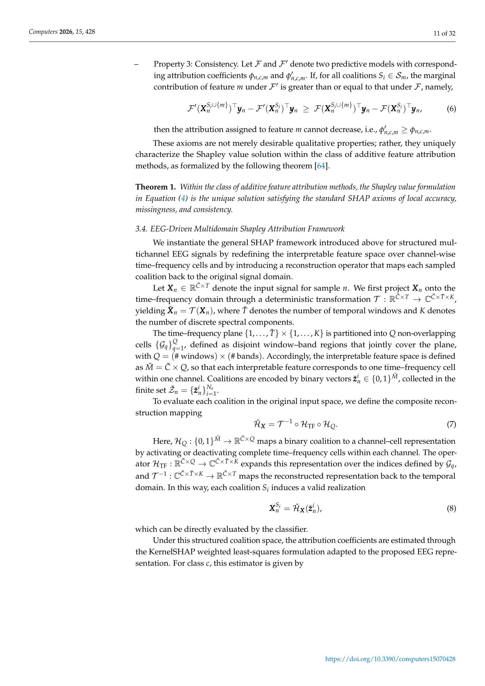

### Extraction assessment
- **Confidence:** 0.65 (below the configured 0.85 threshold; human review required).
- One or more equation candidates are ambiguous in raw extraction.

### Raw extracted text
```
Computers 2026, 15, 428
11 of 32
–
Property 3: Consistency. Let F and F ′ denote two predictive models with correspond-
ing attribution coefficients ϕn,c,m and ϕ′
n,c,m. If, for all coalitions Si ∈Sm, the marginal
contribution of feature m under F ′ is greater than or equal to that under F, namely,
F ′(XSi∪{m}
n
)⊤yn −F ′(XSin )⊤yn ≥F(XSi∪{m}
n
)⊤yn −F(XSin )⊤yn,
(6)
then the attribution assigned to feature m cannot decrease, i.e., ϕ′
n,c,m ≥ϕn,c,m.
These axioms are not merely desirable qualitative properties; rather, they uniquely
characterize the Shapley value solution within the class of additive feature attribution
methods, as formalized by the following theorem [64].
Theorem 1. Within the class of additive feature attribution methods, the Shapley value formulation
in Equation (4) is the unique solution satisfying the standard SHAP axioms of local accuracy,
missingness, and consistency.
3.4. EEG-Driven Multidomain Shapley Attribution Framework
We instantiate the general SHAP framework introduced above for structured mul-
tichannel EEG signals by redefining the interpretable feature space over channel-wise
time–frequency cells and by introducing a reconstruction operator that maps each sampled
coalition back to the original signal domain.
Let Xn ∈R ˘C×T denote the input signal for sample n. We first project Xn onto the
time–frequency domain through a deterministic transformation T : R ˘C×T →C ˘C× ˘T×K,
yielding ˘Xn = T (Xn), where ˘T denotes the number of temporal windows and K denotes
the number of discrete spectral components.
The time–frequency plane {1, . . . , ˘T} × {1, . . . , K} is partitioned into Q non-overlapping
cells {Gq}Q
q=1, defined as disjoint window–band regions that jointly cover the plane,
with Q = (# windows) × (# bands). Accordingly, the interpretable feature space is defined
as ˘M = ˘C × Q, so that each interpretable feature corresponds to one time–frequency cell
within one channel. Coalitions are encoded by binary vectors ˘zi
n ∈{0, 1} ˘M, collected in the
finite set ˘Zn = {˘zi
n}Ns
i=1.
To evaluate each coalition in the original input space, we define the composite recon-
struction mapping
˘HX = T −1 ◦HTF ◦HQ.
(7)
Here, HQ : {0, 1} ˘M →R ˘C×Q maps a binary coalition to a channel–cell representation
by activating or deactivating complete time–frequency cells within each channel. The oper-
ator HTF : R ˘C×Q →C ˘C× ˘T×K expands this representation over the indices defined by Gq,
and T −1 : C ˘C× ˘T×K →R ˘C×T maps the reconstructed representation back to the temporal
domain. In this way, each coalition Si induces a valid realization
XSin = ˘HX(˘zi
n),
(8)
which can be directly evaluated by the classifier.
Under this structured coalition space, the attribution coefficients are estimated through
the KernelSHAP weighted least-squares formulation adapted to the proposed EEG repre-
sentation. For class c, this estimator is given by
https://doi.org/10.3390/computers15070428

```

### Equation candidates
- `page-011-equation-001` — review_required (confidence 0.45; page 11).
```
n,c,m. If, for all coalitions Si ∈Sm, the marginal
```
- `page-011-equation-002` — review_required (confidence 0.45; page 11).
```
)⊤yn −F ′(XSin )⊤yn ≥F(XSi∪{m}
```
- `page-011-equation-003` — review_required (confidence 0.45; page 11).
```
n,c,m ≥ϕn,c,m.
```
- `page-011-equation-004` — review_required (confidence 0.45; page 11).
```
Let Xn ∈R ˘C×T denote the input signal for sample n. We first project Xn onto the
```
- `page-011-equation-005` — review_required (confidence 0.45; page 11).
```
time–frequency domain through a deterministic transformation T : R ˘C×T →C ˘C× ˘T×K,
```
- `page-011-equation-006` — review_required (confidence 0.45; page 11).
```
yielding ˘Xn = T (Xn), where ˘T denotes the number of temporal windows and K denotes
```
- `page-011-equation-007` — review_required (confidence 0.45; page 11).
```
The time–frequency plane {1, . . . , ˘T} × {1, . . . , K} is partitioned into Q non-overlapping
```
- `page-011-equation-008` — review_required (confidence 0.45; page 11).
```
q=1, defined as disjoint window–band regions that jointly cover the plane,
```
- `page-011-equation-009` — review_required (confidence 0.45; page 11).
```
with Q = (# windows) × (# bands). Accordingly, the interpretable feature space is defined
```
- `page-011-equation-010` — review_required (confidence 0.45; page 11).
```
as ˘M = ˘C × Q, so that each interpretable feature corresponds to one time–frequency cell
```
- `page-011-equation-011` — raw_text_preserved (confidence 0.98; page 11).
```
n ∈{0, 1} ˘M, collected in the
```
- `page-011-equation-012` — review_required (confidence 0.45; page 11).
```
finite set ˘Zn = {˘zi
```
- `page-011-equation-013` — raw_text_preserved (confidence 0.98; page 11).
```
i=1.
```
- `page-011-equation-014` — review_required (confidence 0.45; page 11).
```
˘HX = T −1 ◦HTF ◦HQ.
```
- `page-011-equation-015` — review_required (confidence 0.45; page 11).
```
Here, HQ : {0, 1} ˘M →R ˘C×Q maps a binary coalition to a channel–cell representation
```
- `page-011-equation-016` — review_required (confidence 0.45; page 11).
```
ator HTF : R ˘C×Q →C ˘C× ˘T×K expands this representation over the indices defined by Gq,
```
- `page-011-equation-017` — review_required (confidence 0.45; page 11).
```
and T −1 : C ˘C× ˘T×K →R ˘C×T maps the reconstructed representation back to the temporal
```
- `page-011-equation-018` — review_required (confidence 0.45; page 11).
```
XSin = ˘HX(˘zi
```

## Page 12
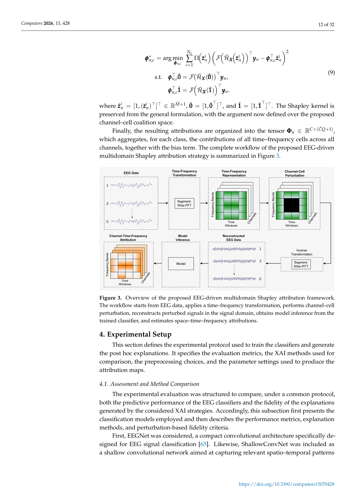

### Extraction assessment
- **Confidence:** 0.65 (below the configured 0.85 threshold; human review required).
- One or more equation candidates are ambiguous in raw extraction. Embedded images require visual review; captions remain page-level text evidence only.

### Raw extracted text
```
Computers 2026, 15, 428
12 of 32
ϕ∗
n,c = arg min
ϕn,c
Ns
∑
i=1
Π

˘zi
n

F

˘HX

˘zi
n
⊤
yn −ϕ⊤
n,cˆzi
n
2
s.t.
ϕ⊤
n,cˆ0 = F
 ˘HX(˘0)
⊤yn,
ϕ⊤
n,cˆ1 = F

˘HX(˘1)
⊤
yn.
(9)
where ˆzi
n = [1, (˘zi
n)⊤]⊤∈R ˘M+1, ˆ0 = [1, ˘0⊤]⊤, and ˆ1 = [1, ˘1
⊤]⊤. The Shapley kernel is
preserved from the general formulation, with the argument now defined over the proposed
channel–cell coalition space.
Finally, the resulting attributions are organized into the tensor Φn ∈RC×( ˘CQ+1),
which aggregates, for each class, the contributions of all time–frequency cells across all
channels, together with the bias term. The complete workflow of the proposed EEG-driven
multidomain Shapley attribution strategy is summarized in Figure 3.
Figure 3. Overview of the proposed EEG-driven multidomain Shapley attribution framework.
The workflow starts from EEG data, applies a time–frequency transformation, performs channel–cell
perturbation, reconstructs perturbed signals in the signal domain, obtains model inference from the
trained classifier, and estimates space–time–frequency attributions.
4. Experimental Setup
This section defines the experimental protocol used to train the classifiers and generate
the post hoc explanations. It specifies the evaluation metrics, the XAI methods used for
comparison, the preprocessing choices, and the parameter settings used to produce the
attribution maps.
4.1. Assessment and Method Comparison
The experimental evaluation was structured to compare, under a common protocol,
both the predictive performance of the EEG classifiers and the fidelity of the explanations
generated by the considered XAI strategies. Accordingly, this subsection first presents the
classification models employed and then describes the performance metrics, explanation
methods, and perturbation-based fidelity criteria.
First, EEGNet was considered, a compact convolutional architecture specifically de-
signed for EEG signal classification [65]. Likewise, ShallowConvNet was included as
a shallow convolutional network aimed at capturing relevant spatio–temporal patterns
https://doi.org/10.3390/computers15070428

```

### Textual figure-caption evidence
- Figure 3. Overview of the proposed EEG-driven multidomain Shapley attribution framework.
- Captions are page-level text evidence and are not associated with embedded images.

### Equation candidates
- `page-012-equation-001` — review_required (confidence 0.45; page 12).
```
n,c = arg min
```
- `page-012-equation-002` — review_required (confidence 0.45; page 12).
```
∑
```
- `page-012-equation-003` — raw_text_preserved (confidence 0.98; page 12).
```
i=1
```
- `page-012-equation-004` — review_required (confidence 0.45; page 12).
```
n,cˆ0 = F
```
- `page-012-equation-005` — review_required (confidence 0.45; page 12).
```
n,cˆ1 = F
```
- `page-012-equation-006` — review_required (confidence 0.45; page 12).
```
n = [1, (˘zi
```
- `page-012-equation-007` — review_required (confidence 0.45; page 12).
```
n)⊤]⊤∈R ˘M+1, ˆ0 = [1, ˘0⊤]⊤, and ˆ1 = [1, ˘1
```
- `page-012-equation-008` — review_required (confidence 0.45; page 12).
```
Finally, the resulting attributions are organized into the tensor Φn ∈RC×( ˘CQ+1),
```

### Embedded images
- `page-012-image-001` — embedded image metadata: 1732 × 908 px, xref 387; visual review required.

## Page 13
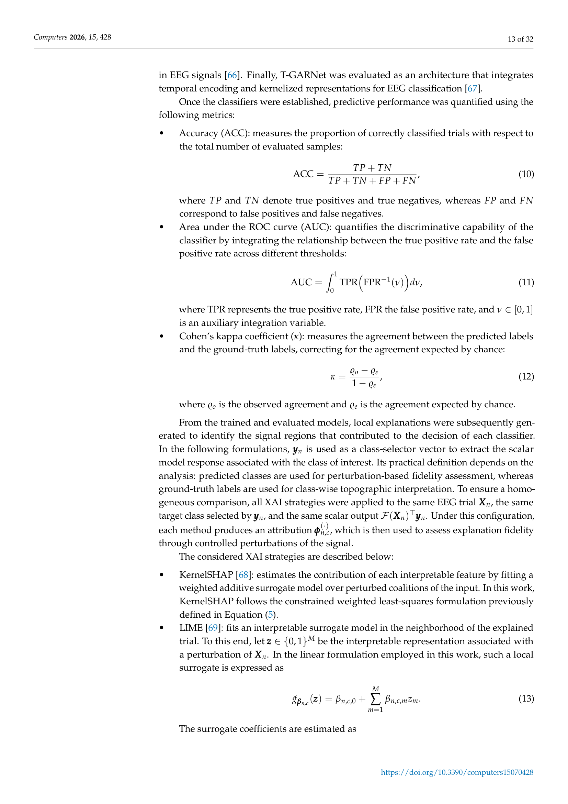

### Extraction assessment
- **Confidence:** 0.65 (below the configured 0.85 threshold; human review required).
- One or more equation candidates are ambiguous in raw extraction.

### Raw extracted text
```
Computers 2026, 15, 428
13 of 32
in EEG signals [66]. Finally, T-GARNet was evaluated as an architecture that integrates
temporal encoding and kernelized representations for EEG classification [67].
Once the classifiers were established, predictive performance was quantified using the
following metrics:
•
Accuracy (ACC): measures the proportion of correctly classified trials with respect to
the total number of evaluated samples:
ACC =
TP + TN
TP + TN + FP + FN ,
(10)
where TP and TN denote true positives and true negatives, whereas FP and FN
correspond to false positives and false negatives.
•
Area under the ROC curve (AUC): quantifies the discriminative capability of the
classifier by integrating the relationship between the true positive rate and the false
positive rate across different thresholds:
AUC =
Z 1
0 TPR

FPR−1(ν)

dν,
(11)
where TPR represents the true positive rate, FPR the false positive rate, and ν ∈[0, 1]
is an auxiliary integration variable.
•
Cohen’s kappa coefficient (κ): measures the agreement between the predicted labels
and the ground-truth labels, correcting for the agreement expected by chance:
κ = ϱo −ϱe
1 −ϱe
,
(12)
where ϱo is the observed agreement and ϱe is the agreement expected by chance.
From the trained and evaluated models, local explanations were subsequently gen-
erated to identify the signal regions that contributed to the decision of each classifier.
In the following formulations, yn is used as a class-selector vector to extract the scalar
model response associated with the class of interest. Its practical definition depends on the
analysis: predicted classes are used for perturbation-based fidelity assessment, whereas
ground-truth labels are used for class-wise topographic interpretation. To ensure a homo-
geneous comparison, all XAI strategies were applied to the same EEG trial Xn, the same
target class selected by yn, and the same scalar output F(Xn)⊤yn. Under this configuration,
each method produces an attribution ϕ(·)
n,c, which is then used to assess explanation fidelity
through controlled perturbations of the signal.
The considered XAI strategies are described below:
•
KernelSHAP [68]: estimates the contribution of each interpretable feature by fitting a
weighted additive surrogate model over perturbed coalitions of the input. In this work,
KernelSHAP follows the constrained weighted least-squares formulation previously
defined in Equation (5).
•
LIME [69]: fits an interpretable surrogate model in the neighborhood of the explained
trial. To this end, let z ∈{0, 1}M be the interpretable representation associated with
a perturbation of Xn. In the linear formulation employed in this work, such a local
surrogate is expressed as
˘gβn,c(z) = βn,c,0 +
M
∑
m=1
βn,c,mzm.
(13)
The surrogate coefficients are estimated as
https://doi.org/10.3390/computers15070428

```

### Equation candidates
- `page-013-equation-001` — review_required (confidence 0.45; page 13).
```
ACC =
```
- `page-013-equation-002` — review_required (confidence 0.45; page 13).
```
AUC =
```
- `page-013-equation-003` — review_required (confidence 0.45; page 13).
```
where TPR represents the true positive rate, FPR the false positive rate, and ν ∈[0, 1]
```
- `page-013-equation-004` — raw_text_preserved (confidence 0.98; page 13).
```
κ = ϱo −ϱe
```
- `page-013-equation-005` — review_required (confidence 0.45; page 13).
```
trial. To this end, let z ∈{0, 1}M be the interpretable representation associated with
```
- `page-013-equation-006` — review_required (confidence 0.45; page 13).
```
˘gβn,c(z) = βn,c,0 +
```
- `page-013-equation-007` — review_required (confidence 0.45; page 13).
```
∑
```
- `page-013-equation-008` — raw_text_preserved (confidence 0.98; page 13).
```
m=1
```

## Page 14
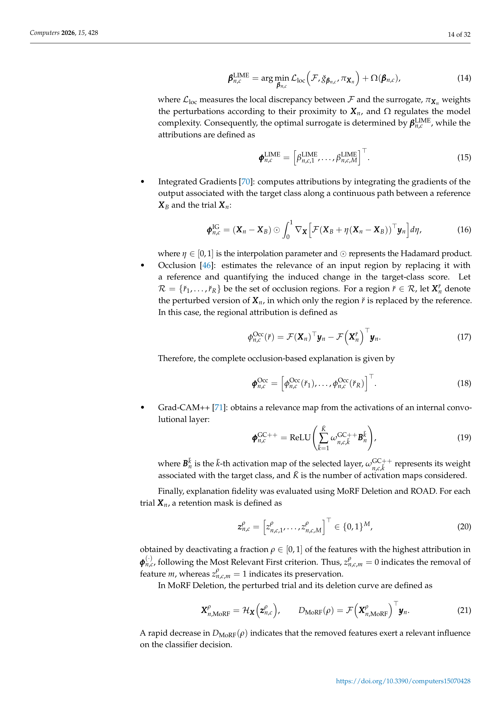

### Extraction assessment
- **Confidence:** 0.65 (below the configured 0.85 threshold; human review required).
- One or more equation candidates are ambiguous in raw extraction.

### Raw extracted text
```
Computers 2026, 15, 428
14 of 32
βLIME
n,c
= arg min
βn,c
Lloc

F, ˘gβn,c, πXn

+ Ω(βn,c),
(14)
where Lloc measures the local discrepancy between F and the surrogate, πXn weights
the perturbations according to their proximity to Xn, and Ωregulates the model
complexity. Consequently, the optimal surrogate is determined by βLIME
n,c
, while the
attributions are defined as
ϕLIME
n,c
=
h
βLIME
n,c,1 , . . . , βLIME
n,c,M
i⊤
.
(15)
•
Integrated Gradients [70]: computes attributions by integrating the gradients of the
output associated with the target class along a continuous path between a reference
XB and the trial Xn:
ϕIG
n,c = (Xn −XB) ⊙
Z 1
0 ∇X
h
F(XB + η(Xn −XB))⊤yn
i
dη,
(16)
where η ∈[0, 1] is the interpolation parameter and ⊙represents the Hadamard product.
•
Occlusion [46]: estimates the relevance of an input region by replacing it with
a reference and quantifying the induced change in the target-class score.
Let
R = {˘r1, . . . , ˘rR} be the set of occlusion regions. For a region ˘r ∈R, let X ˘r
n denote
the perturbed version of Xn, in which only the region ˘r is replaced by the reference.
In this case, the regional attribution is defined as
ϕOcc
n,c (˘r) = F(Xn)⊤yn −F

X ˘r
n
⊤
yn.
(17)
Therefore, the complete occlusion-based explanation is given by
ϕOcc
n,c =
h
ϕOcc
n,c (˘r1), . . . , ϕOcc
n,c (˘rR)
i⊤
.
(18)
•
Grad-CAM++ [71]: obtains a relevance map from the activations of an internal convo-
lutional layer:
ϕGC++
n,c
= ReLU
 
¯K
∑
¯k=1
ωGC++
n,c,¯k
B
¯k
n
!
,
(19)
where B¯k
n is the ¯k-th activation map of the selected layer, ωGC++
n,c,¯k
represents its weight
associated with the target class, and ¯K is the number of activation maps considered.
Finally, explanation fidelity was evaluated using MoRF Deletion and ROAD. For each
trial Xn, a retention mask is defined as
zρ
n,c =
h
zρ
n,c,1, . . . , zρ
n,c,M
i⊤
∈{0, 1}M,
(20)
obtained by deactivating a fraction ρ ∈[0, 1] of the features with the highest attribution in
ϕ(·)
n,c, following the Most Relevant First criterion. Thus, zρ
n,c,m = 0 indicates the removal of
feature m, whereas zρ
n,c,m = 1 indicates its preservation.
In MoRF Deletion, the perturbed trial and its deletion curve are defined as
Xρ
n,MoRF = HX

zρ
n,c

,
DMoRF(ρ) = F

Xρ
n,MoRF
⊤
yn.
(21)
A rapid decrease in DMoRF(ρ) indicates that the removed features exert a relevant influence
on the classifier decision.
https://doi.org/10.3390/computers15070428

```

### Equation candidates
- `page-014-equation-001` — review_required (confidence 0.45; page 14).
```
= arg min
```
- `page-014-equation-002` — review_required (confidence 0.45; page 14).
```
=
```
- `page-014-equation-003` — review_required (confidence 0.45; page 14).
```
n,c = (Xn −XB) ⊙
```
- `page-014-equation-004` — review_required (confidence 0.45; page 14).
```
where η ∈[0, 1] is the interpolation parameter and ⊙represents the Hadamard product.
```
- `page-014-equation-005` — raw_text_preserved (confidence 0.98; page 14).
```
R = {˘r1, . . . , ˘rR} be the set of occlusion regions. For a region ˘r ∈R, let X ˘r
```
- `page-014-equation-006` — review_required (confidence 0.45; page 14).
```
n,c (˘r) = F(Xn)⊤yn −F
```
- `page-014-equation-007` — review_required (confidence 0.45; page 14).
```
n,c =
```
- `page-014-equation-008` — review_required (confidence 0.45; page 14).
```
= ReLU
```
- `page-014-equation-009` — review_required (confidence 0.45; page 14).
```
∑
```
- `page-014-equation-010` — review_required (confidence 0.45; page 14).
```
¯k=1
```
- `page-014-equation-011` — review_required (confidence 0.45; page 14).
```
n,c =
```
- `page-014-equation-012` — review_required (confidence 0.45; page 14).
```
∈{0, 1}M,
```
- `page-014-equation-013` — review_required (confidence 0.45; page 14).
```
obtained by deactivating a fraction ρ ∈[0, 1] of the features with the highest attribution in
```
- `page-014-equation-014` — review_required (confidence 0.45; page 14).
```
n,c,m = 0 indicates the removal of
```
- `page-014-equation-015` — review_required (confidence 0.45; page 14).
```
n,c,m = 1 indicates its preservation.
```
- `page-014-equation-016` — review_required (confidence 0.45; page 14).
```
n,MoRF = HX
```
- `page-014-equation-017` — raw_text_preserved (confidence 0.98; page 14).
```
DMoRF(ρ) = F
```

## Page 15
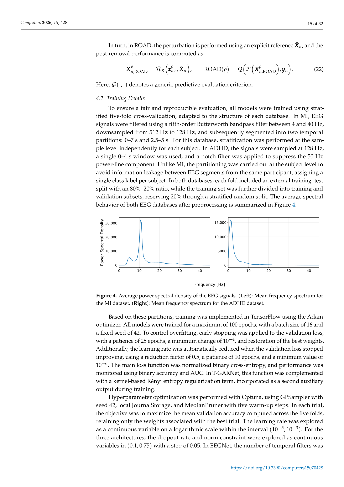

### Extraction assessment
- **Confidence:** 0.65 (below the configured 0.85 threshold; human review required).
- One or more equation candidates are ambiguous in raw extraction.

### Raw extracted text
```
Computers 2026, 15, 428
15 of 32
In turn, in ROAD, the perturbation is performed using an explicit reference ¯Xn, and the
post-removal performance is computed as
Xρ
n,ROAD = ¯HX

zρ
n,c, ¯Xn

,
ROAD(ρ) = Q

F

Xρ
n,ROAD

,yn

.
(22)
Here, Q(·, ·) denotes a generic predictive evaluation criterion.
4.2. Training Details
To ensure a fair and reproducible evaluation, all models were trained using strat-
ified five-fold cross-validation, adapted to the structure of each database. In MI, EEG
signals were filtered using a fifth-order Butterworth bandpass filter between 4 and 40 Hz,
downsampled from 512 Hz to 128 Hz, and subsequently segmented into two temporal
partitions: 0–7 s and 2.5–5 s. For this database, stratification was performed at the sam-
ple level independently for each subject. In ADHD, the signals were sampled at 128 Hz,
a single 0–4 s window was used, and a notch filter was applied to suppress the 50 Hz
power-line component. Unlike MI, the partitioning was carried out at the subject level to
avoid information leakage between EEG segments from the same participant, assigning a
single class label per subject. In both databases, each fold included an external training–test
split with an 80%–20% ratio, while the training set was further divided into training and
validation subsets, reserving 20% through a stratified random split. The average spectral
behavior of both EEG databases after preprocessing is summarized in Figure 4.
0
10
20
30
40
0
10,000
20,000
30,000
Power Spectral Density
0
10
20
30
40
0
5000
10,000
15,000
Frequency [Hz]
Figure 4. Average power spectral density of the EEG signals. (Left): Mean frequency spectrum for
the MI dataset. (Right): Mean frequency spectrum for the ADHD dataset.
Based on these partitions, training was implemented in TensorFlow using the Adam
optimizer. All models were trained for a maximum of 100 epochs, with a batch size of 16 and
a fixed seed of 42. To control overfitting, early stopping was applied to the validation loss,
with a patience of 25 epochs, a minimum change of 10−4, and restoration of the best weights.
Additionally, the learning rate was automatically reduced when the validation loss stopped
improving, using a reduction factor of 0.5, a patience of 10 epochs, and a minimum value of
10−6. The main loss function was normalized binary cross-entropy, and performance was
monitored using binary accuracy and AUC. In T-GARNet, this function was complemented
with a kernel-based Rényi entropy regularization term, incorporated as a second auxiliary
output during training.
Hyperparameter optimization was performed with Optuna, using GPSampler with
seed 42, local JournalStorage, and MedianPruner with five warm-up steps. In each trial,
the objective was to maximize the mean validation accuracy computed across the five folds,
retaining only the weights associated with the best trial. The learning rate was explored
as a continuous variable on a logarithmic scale within the interval (10−5, 10−3). For the
three architectures, the dropout rate and norm constraint were explored as continuous
variables in (0.1, 0.75) with a step of 0.05. In EEGNet, the number of temporal filters was
https://doi.org/10.3390/computers15070428

```

### Textual figure-caption evidence
- Figure 4. Average power spectral density of the EEG signals. (Left): Mean frequency spectrum for
- Captions are page-level text evidence and are not associated with embedded images.

### Equation candidates
- `page-015-equation-001` — review_required (confidence 0.45; page 15).
```
n,ROAD = ¯HX
```
- `page-015-equation-002` — raw_text_preserved (confidence 0.98; page 15).
```
ROAD(ρ) = Q
```

## Page 16
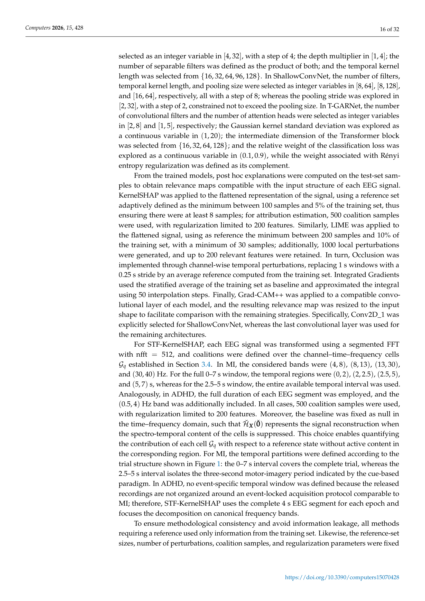

### Extraction assessment
- **Confidence:** 0.65 (below the configured 0.85 threshold; human review required).
- One or more equation candidates are ambiguous in raw extraction.

### Raw extracted text
```
Computers 2026, 15, 428
16 of 32
selected as an integer variable in [4, 32], with a step of 4; the depth multiplier in [1, 4]; the
number of separable filters was defined as the product of both; and the temporal kernel
length was selected from {16, 32, 64, 96, 128}. In ShallowConvNet, the number of filters,
temporal kernel length, and pooling size were selected as integer variables in [8, 64], [8, 128],
and [16, 64], respectively, all with a step of 8; whereas the pooling stride was explored in
[2, 32], with a step of 2, constrained not to exceed the pooling size. In T-GARNet, the number
of convolutional filters and the number of attention heads were selected as integer variables
in [2, 8] and [1, 5], respectively; the Gaussian kernel standard deviation was explored as
a continuous variable in (1, 20); the intermediate dimension of the Transformer block
was selected from {16, 32, 64, 128}; and the relative weight of the classification loss was
explored as a continuous variable in (0.1, 0.9), while the weight associated with Rényi
entropy regularization was defined as its complement.
From the trained models, post hoc explanations were computed on the test-set sam-
ples to obtain relevance maps compatible with the input structure of each EEG signal.
KernelSHAP was applied to the flattened representation of the signal, using a reference set
adaptively defined as the minimum between 100 samples and 5% of the training set, thus
ensuring there were at least 8 samples; for attribution estimation, 500 coalition samples
were used, with regularization limited to 200 features. Similarly, LIME was applied to
the flattened signal, using as reference the minimum between 200 samples and 10% of
the training set, with a minimum of 30 samples; additionally, 1000 local perturbations
were generated, and up to 200 relevant features were retained. In turn, Occlusion was
implemented through channel-wise temporal perturbations, replacing 1 s windows with a
0.25 s stride by an average reference computed from the training set. Integrated Gradients
used the stratified average of the training set as baseline and approximated the integral
using 50 interpolation steps. Finally, Grad-CAM++ was applied to a compatible convo-
lutional layer of each model, and the resulting relevance map was resized to the input
shape to facilitate comparison with the remaining strategies. Specifically, Conv2D_1 was
explicitly selected for ShallowConvNet, whereas the last convolutional layer was used for
the remaining architectures.
For STF-KernelSHAP, each EEG signal was transformed using a segmented FFT
with nfft = 512, and coalitions were defined over the channel–time–frequency cells
Gq established in Section 3.4. In MI, the considered bands were (4, 8), (8, 13), (13, 30),
and (30, 40) Hz. For the full 0–7 s window, the temporal regions were (0, 2), (2, 2.5), (2.5, 5),
and (5, 7) s, whereas for the 2.5–5 s window, the entire available temporal interval was used.
Analogously, in ADHD, the full duration of each EEG segment was employed, and the
(0.5, 4) Hz band was additionally included. In all cases, 500 coalition samples were used,
with regularization limited to 200 features. Moreover, the baseline was fixed as null in
the time–frequency domain, such that ˘HX(˘0) represents the signal reconstruction when
the spectro-temporal content of the cells is suppressed. This choice enables quantifying
the contribution of each cell Gq with respect to a reference state without active content in
the corresponding region. For MI, the temporal partitions were defined according to the
trial structure shown in Figure 1: the 0–7 s interval covers the complete trial, whereas the
2.5–5 s interval isolates the three-second motor-imagery period indicated by the cue-based
paradigm. In ADHD, no event-specific temporal window was defined because the released
recordings are not organized around an event-locked acquisition protocol comparable to
MI; therefore, STF-KernelSHAP uses the complete 4 s EEG segment for each epoch and
focuses the decomposition on canonical frequency bands.
To ensure methodological consistency and avoid information leakage, all methods
requiring a reference used only information from the training set. Likewise, the reference-set
sizes, number of perturbations, coalition samples, and regularization parameters were fixed
https://doi.org/10.3390/computers15070428

```

### Equation candidates
- `page-016-equation-001` — review_required (confidence 0.45; page 16).
```
shape to facilitate comparison with the remaining strategies. Specifically, Conv2D_1 was
```
- `page-016-equation-002` — review_required (confidence 0.45; page 16).
```
with nfft = 512, and coalitions were defined over the channel–time–frequency cells
```

## Page 17
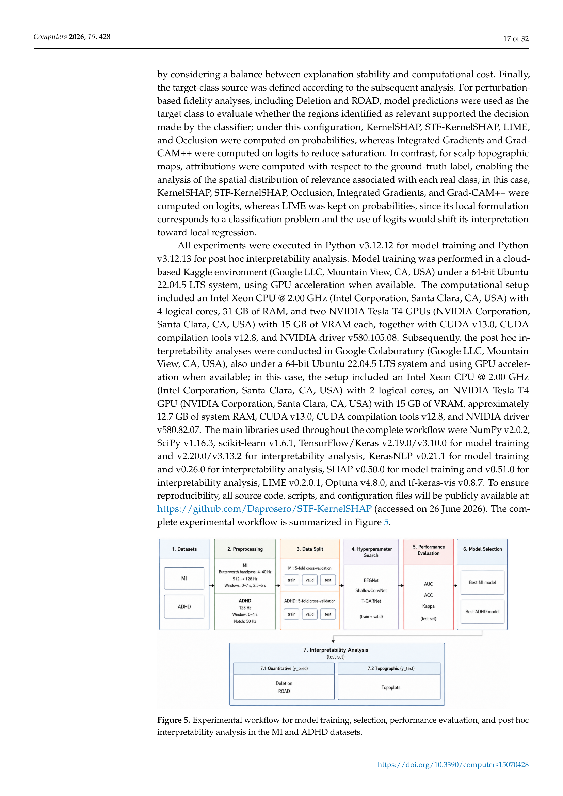

### Extraction assessment
- **Confidence:** 0.75 (below the configured 0.85 threshold; human review required).
- Embedded images require visual review; captions remain page-level text evidence only.

### Raw extracted text
```
Computers 2026, 15, 428
17 of 32
by considering a balance between explanation stability and computational cost. Finally,
the target-class source was defined according to the subsequent analysis. For perturbation-
based fidelity analyses, including Deletion and ROAD, model predictions were used as the
target class to evaluate whether the regions identified as relevant supported the decision
made by the classifier; under this configuration, KernelSHAP, STF-KernelSHAP, LIME,
and Occlusion were computed on probabilities, whereas Integrated Gradients and Grad-
CAM++ were computed on logits to reduce saturation. In contrast, for scalp topographic
maps, attributions were computed with respect to the ground-truth label, enabling the
analysis of the spatial distribution of relevance associated with each real class; in this case,
KernelSHAP, STF-KernelSHAP, Occlusion, Integrated Gradients, and Grad-CAM++ were
computed on logits, whereas LIME was kept on probabilities, since its local formulation
corresponds to a classification problem and the use of logits would shift its interpretation
toward local regression.
All experiments were executed in Python v3.12.12 for model training and Python
v3.12.13 for post hoc interpretability analysis. Model training was performed in a cloud-
based Kaggle environment (Google LLC, Mountain View, CA, USA) under a 64-bit Ubuntu
22.04.5 LTS system, using GPU acceleration when available. The computational setup
included an Intel Xeon CPU @ 2.00 GHz (Intel Corporation, Santa Clara, CA, USA) with
4 logical cores, 31 GB of RAM, and two NVIDIA Tesla T4 GPUs (NVIDIA Corporation,
Santa Clara, CA, USA) with 15 GB of VRAM each, together with CUDA v13.0, CUDA
compilation tools v12.8, and NVIDIA driver v580.105.08. Subsequently, the post hoc in-
terpretability analyses were conducted in Google Colaboratory (Google LLC, Mountain
View, CA, USA), also under a 64-bit Ubuntu 22.04.5 LTS system and using GPU acceler-
ation when available; in this case, the setup included an Intel Xeon CPU @ 2.00 GHz
(Intel Corporation, Santa Clara, CA, USA) with 2 logical cores, an NVIDIA Tesla T4
GPU (NVIDIA Corporation, Santa Clara, CA, USA) with 15 GB of VRAM, approximately
12.7 GB of system RAM, CUDA v13.0, CUDA compilation tools v12.8, and NVIDIA driver
v580.82.07. The main libraries used throughout the complete workflow were NumPy v2.0.2,
SciPy v1.16.3, scikit-learn v1.6.1, TensorFlow/Keras v2.19.0/v3.10.0 for model training
and v2.20.0/v3.13.2 for interpretability analysis, KerasNLP v0.21.1 for model training
and v0.26.0 for interpretability analysis, SHAP v0.50.0 for model training and v0.51.0 for
interpretability analysis, LIME v0.2.0.1, Optuna v4.8.0, and tf-keras-vis v0.8.7. To ensure
reproducibility, all source code, scripts, and configuration files will be publicly available at:
https://github.com/Daprosero/STF-KernelSHAP (accessed on 26 June 2026). The com-
plete experimental workflow is summarized in Figure 5.
Figure 5. Experimental workflow for model training, selection, performance evaluation, and post hoc
interpretability analysis in the MI and ADHD datasets.
https://doi.org/10.3390/computers15070428

```

### Textual figure-caption evidence
- Figure 5. Experimental workflow for model training, selection, performance evaluation, and post hoc
- Captions are page-level text evidence and are not associated with embedded images.

### Embedded images
- `page-017-image-001` — embedded image metadata: 1658 × 806 px, xref 460; visual review required.

## Page 18
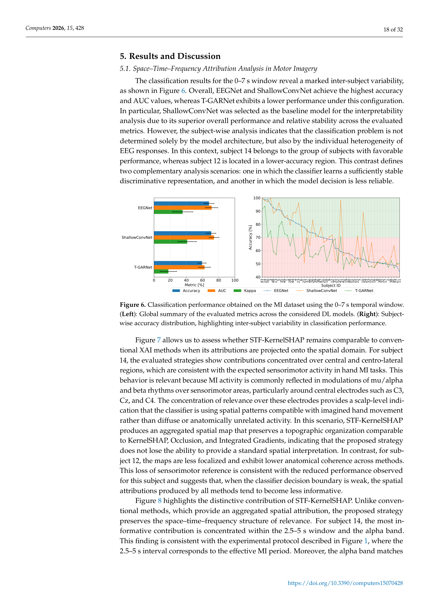

### Extraction assessment
- **Confidence:** 0.95 (meets the configured threshold).
- Machine-readable text was preserved with page-image provenance.

### Raw extracted text
```
Computers 2026, 15, 428
18 of 32
5. Results and Discussion
5.1. Space–Time–Frequency Attribution Analysis in Motor Imagery
The classification results for the 0–7 s window reveal a marked inter-subject variability,
as shown in Figure 6. Overall, EEGNet and ShallowConvNet achieve the highest accuracy
and AUC values, whereas T-GARNet exhibits a lower performance under this configuration.
In particular, ShallowConvNet was selected as the baseline model for the interpretability
analysis due to its superior overall performance and relative stability across the evaluated
metrics. However, the subject-wise analysis indicates that the classification problem is not
determined solely by the model architecture, but also by the individual heterogeneity of
EEG responses. In this context, subject 14 belongs to the group of subjects with favorable
performance, whereas subject 12 is located in a lower-accuracy region. This contrast defines
two complementary analysis scenarios: one in which the classifier learns a sufficiently stable
discriminative representation, and another in which the model decision is less reliable.
0
20
40
60
80
100
Metric [%]
EEGNet
ShallowConvNet
T-GARNet
43
14
50
3
48
13
5
35
49
1
28
44
4
23
6
21
37
46
26
39
36
47
20
18
9
12
31
52
41
42
19
40
51
25
22
7
10
24
33
15
16
8
30
32
17
2
38
45
27
11
Subject ID
40
50
60
70
80
90
100
Accuracy [%]
Accuracy
AUC
Kappa
EEGNet
ShallowConvNet
T-GARNet
Figure 6. Classification performance obtained on the MI dataset using the 0–7 s temporal window.
(Left): Global summary of the evaluated metrics across the considered DL models. (Right): Subject-
wise accuracy distribution, highlighting inter-subject variability in classification performance.
Figure 7 allows us to assess whether STF-KernelSHAP remains comparable to conven-
tional XAI methods when its attributions are projected onto the spatial domain. For subject
14, the evaluated strategies show contributions concentrated over central and centro-lateral
regions, which are consistent with the expected sensorimotor activity in hand MI tasks. This
behavior is relevant because MI activity is commonly reflected in modulations of mu/alpha
and beta rhythms over sensorimotor areas, particularly around central electrodes such as C3,
Cz, and C4. The concentration of relevance over these electrodes provides a scalp-level indi-
cation that the classifier is using spatial patterns compatible with imagined hand movement
rather than diffuse or anatomically unrelated activity. In this scenario, STF-KernelSHAP
produces an aggregated spatial map that preserves a topographic organization comparable
to KernelSHAP, Occlusion, and Integrated Gradients, indicating that the proposed strategy
does not lose the ability to provide a standard spatial interpretation. In contrast, for sub-
ject 12, the maps are less focalized and exhibit lower anatomical coherence across methods.
This loss of sensorimotor reference is consistent with the reduced performance observed
for this subject and suggests that, when the classifier decision boundary is weak, the spatial
attributions produced by all methods tend to become less informative.
Figure 8 highlights the distinctive contribution of STF-KernelSHAP. Unlike conven-
tional methods, which provide an aggregated spatial attribution, the proposed strategy
preserves the space–time–frequency structure of relevance. For subject 14, the most in-
formative contribution is concentrated within the 2.5–5 s window and the alpha band.
This finding is consistent with the experimental protocol described in Figure 1, where the
2.5–5 s interval corresponds to the effective MI period. Moreover, the alpha band matches
https://doi.org/10.3390/computers15070428

```

### Textual figure-caption evidence
- Figure 6. Classification performance obtained on the MI dataset using the 0–7 s temporal window.
- Captions are page-level text evidence and are not associated with embedded images.

## Page 19
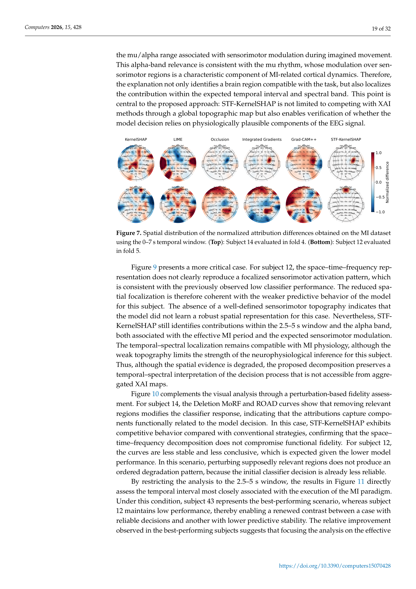

### Extraction assessment
- **Confidence:** 0.75 (below the configured 0.85 threshold; human review required).
- Embedded images require visual review; captions remain page-level text evidence only.

### Raw extracted text
```
Computers 2026, 15, 428
19 of 32
the mu/alpha range associated with sensorimotor modulation during imagined movement.
This alpha-band relevance is consistent with the mu rhythm, whose modulation over sen-
sorimotor regions is a characteristic component of MI-related cortical dynamics. Therefore,
the explanation not only identifies a brain region compatible with the task, but also localizes
the contribution within the expected temporal interval and spectral band. This point is
central to the proposed approach: STF-KernelSHAP is not limited to competing with XAI
methods through a global topographic map but also enables verification of whether the
model decision relies on physiologically plausible components of the EEG signal.
Fp1
Fpz
Fp2
AF7 AF3
AFz
AF4 AF8
F7F5 F3 F1
Fz
F2 F4 F6F8
FT7FC5FC3 FC1 FCz FC2 FC4FC6
FT8
T7C5 C3
C1
Cz
C2
C4 C6T8
TP7CP5CP3 CP1 CPz CP2 CP4CP6
TP8
P9
P7P5P3 P1
Pz
P2 P4P6P8
P10
PO7PO3 POz PO4PO8
O1
Oz
O2
Iz
KernelSHAP
Fp1
Fpz
Fp2
AF7 AF3
AFz
AF4 AF8
F7F5 F3 F1
Fz
F2 F4 F6F8
FT7FC5FC3 FC1 FCz FC2 FC4FC6
FT8
T7C5 C3
C1
Cz
C2
C4 C6T8
TP7CP5CP3 CP1 CPz CP2 CP4CP6
TP8
P9
P7P5P3 P1
Pz
P2 P4P6P8
P10
PO7PO3 POz PO4PO8
O1
Oz
O2
Iz
LIME
Fp1
Fpz
Fp2
AF7 AF3
AFz
AF4 AF8
F7F5 F3 F1
Fz
F2 F4 F6F8
FT7FC5FC3 FC1 FCz FC2 FC4FC6
FT8
T7C5 C3
C1
Cz
C2
C4 C6T8
TP7CP5CP3 CP1 CPz CP2 CP4CP6
TP8
P9
P7P5P3 P1
Pz
P2 P4P6P8
P10
PO7PO3 POz PO4PO8
O1
Oz
O2
Iz
Occlusion
Fp1
Fpz
Fp2
AF7 AF3
AFz
AF4 AF8
F7F5 F3 F1
Fz
F2 F4 F6F8
FT7FC5FC3 FC1 FCz FC2 FC4FC6
FT8
T7C5 C3
C1
Cz
C2
C4 C6T8
TP7CP5CP3 CP1 CPz CP2 CP4CP6
TP8
P9
P7P5P3 P1
Pz
P2 P4P6P8
P10
PO7PO3 POz PO4PO8
O1
Oz
O2
Iz
Integrated Gradients
Fp1
Fpz
Fp2
AF7 AF3
AFz
AF4 AF8
F7F5 F3 F1
Fz
F2 F4 F6F8
FT7FC5FC3 FC1 FCz FC2 FC4FC6
FT8
T7C5 C3
C1
Cz
C2
C4 C6T8
TP7CP5CP3 CP1 CPz CP2 CP4CP6
TP8
P9
P7P5P3 P1
Pz
P2 P4P6P8
P10
PO7PO3 POz PO4PO8
O1
Oz
O2
Iz
Grad-CAM++
Fp1
Fpz
Fp2
AF7 AF3
AFz
AF4 AF8
F7F5 F3 F1
Fz
F2 F4 F6F8
FT7FC5FC3 FC1 FCz FC2 FC4FC6
FT8
T7C5 C3
C1
Cz
C2
C4 C6T8
TP7CP5CP3 CP1 CPz CP2 CP4CP6
TP8
P9
P7P5P3 P1
Pz
P2 P4P6P8
P10
PO7PO3 POz PO4PO8
O1
Oz
O2
Iz
STF-KernelSHAP
Fp1
Fpz
Fp2
AF7 AF3
AFz
AF4 AF8
F7F5 F3 F1
Fz
F2 F4 F6F8
FT7FC5FC3 FC1 FCz FC2 FC4FC6
FT8
T7C5 C3
C1
Cz
C2
C4 C6T8
TP7CP5CP3 CP1 CPz CP2 CP4CP6
TP8
P9
P7P5P3 P1
Pz
P2 P4P6P8
P10
PO7PO3 POz PO4PO8
O1
Oz
O2
Iz
Fp1
Fpz
Fp2
AF7 AF3
AFz
AF4 AF8
F7F5 F3 F1
Fz
F2 F4 F6F8
FT7FC5FC3 FC1 FCz FC2 FC4FC6
FT8
T7C5 C3
C1
Cz
C2
C4 C6T8
TP7CP5CP3 CP1 CPz CP2 CP4CP6
TP8
P9
P7P5P3 P1
Pz
P2 P4P6P8
P10
PO7PO3 POz PO4PO8
O1
Oz
O2
Iz
Fp1
Fpz
Fp2
AF7 AF3
AFz
AF4 AF8
F7F5 F3 F1
Fz
F2 F4 F6F8
FT7FC5FC3 FC1 FCz FC2 FC4FC6
FT8
T7C5 C3
C1
Cz
C2
C4 C6T8
TP7CP5CP3 CP1 CPz CP2 CP4CP6
TP8
P9
P7P5P3 P1
Pz
P2 P4P6P8
P10
PO7PO3 POz PO4PO8
O1
Oz
O2
Iz
Fp1
Fpz
Fp2
AF7 AF3
AFz
AF4 AF8
F7F5 F3 F1
Fz
F2 F4 F6F8
FT7FC5FC3 FC1 FCz FC2 FC4FC6
FT8
T7C5 C3
C1
Cz
C2
C4 C6T8
TP7CP5CP3 CP1 CPz CP2 CP4CP6
TP8
P9
P7P5P3 P1
Pz
P2 P4P6P8
P10
PO7PO3 POz PO4PO8
O1
Oz
O2
Iz
Fp1
Fpz
Fp2
AF7 AF3
AFz
AF4 AF8
F7F5 F3 F1
Fz
F2 F4 F6F8
FT7FC5FC3 FC1 FCz FC2 FC4FC6
FT8
T7C5 C3
C1
Cz
C2
C4 C6T8
TP7CP5CP3 CP1 CPz CP2 CP4CP6
TP8
P9
P7P5P3 P1
Pz
P2 P4P6P8
P10
PO7PO3 POz PO4PO8
O1
Oz
O2
Iz
Fp1
Fpz
Fp2
AF7 AF3
AFz
AF4 AF8
F7F5 F3 F1
Fz
F2 F4 F6F8
FT7FC5FC3 FC1 FCz FC2 FC4FC6
FT8
T7C5 C3
C1
Cz
C2
C4 C6T8
TP7CP5CP3 CP1 CPz CP2 CP4CP6
TP8
P9
P7P5P3 P1
Pz
P2 P4P6P8
P10
PO7PO3 POz PO4PO8
O1
Oz
O2
Iz
−1.0
−0.5
0.0
0.5
1.0
Normalized difference
Figure 7. Spatial distribution of the normalized attribution differences obtained on the MI dataset
using the 0–7 s temporal window. (Top): Subject 14 evaluated in fold 4. (Bottom): Subject 12 evaluated
in fold 5.
Figure 9 presents a more critical case. For subject 12, the space–time–frequency rep-
resentation does not clearly reproduce a focalized sensorimotor activation pattern, which
is consistent with the previously observed low classifier performance. The reduced spa-
tial focalization is therefore coherent with the weaker predictive behavior of the model
for this subject. The absence of a well-defined sensorimotor topography indicates that
the model did not learn a robust spatial representation for this case. Nevertheless, STF-
KernelSHAP still identifies contributions within the 2.5–5 s window and the alpha band,
both associated with the effective MI period and the expected sensorimotor modulation.
The temporal–spectral localization remains compatible with MI physiology, although the
weak topography limits the strength of the neurophysiological inference for this subject.
Thus, although the spatial evidence is degraded, the proposed decomposition preserves a
temporal–spectral interpretation of the decision process that is not accessible from aggre-
gated XAI maps.
Figure 10 complements the visual analysis through a perturbation-based fidelity assess-
ment. For subject 14, the Deletion MoRF and ROAD curves show that removing relevant
regions modifies the classifier response, indicating that the attributions capture compo-
nents functionally related to the model decision. In this case, STF-KernelSHAP exhibits
competitive behavior compared with conventional strategies, confirming that the space–
time–frequency decomposition does not compromise functional fidelity. For subject 12,
the curves are less stable and less conclusive, which is expected given the lower model
performance. In this scenario, perturbing supposedly relevant regions does not produce an
ordered degradation pattern, because the initial classifier decision is already less reliable.
By restricting the analysis to the 2.5–5 s window, the results in Figure 11 directly
assess the temporal interval most closely associated with the execution of the MI paradigm.
Under this condition, subject 43 represents the best-performing scenario, whereas subject
12 maintains low performance, thereby enabling a renewed contrast between a case with
reliable decisions and another with lower predictive stability. The relative improvement
observed in the best-performing subjects suggests that focusing the analysis on the effective
https://doi.org/10.3390/computers15070428

```

### Textual figure-caption evidence
- Figure 7. Spatial distribution of the normalized attribution differences obtained on the MI dataset
- Captions are page-level text evidence and are not associated with embedded images.

### Embedded images
- `page-019-image-001` — embedded image metadata: 56 × 1191 px, xref 478; visual review required.
- `page-019-image-002` — embedded image metadata: 735 × 735 px, xref 479; visual review required.
- `page-019-image-003` — embedded image metadata: 735 × 735 px, xref 480; visual review required.
- `page-019-image-004` — embedded image metadata: 735 × 735 px, xref 481; visual review required.
- `page-019-image-005` — embedded image metadata: 735 × 735 px, xref 493; visual review required.
- `page-019-image-006` — embedded image metadata: 735 × 735 px, xref 495; visual review required.
- `page-019-image-007` — embedded image metadata: 735 × 735 px, xref 496; visual review required.
- `page-019-image-008` — embedded image metadata: 735 × 735 px, xref 497; visual review required.
- `page-019-image-009` — embedded image metadata: 735 × 735 px, xref 498; visual review required.
- `page-019-image-010` — embedded image metadata: 735 × 735 px, xref 499; visual review required.
- `page-019-image-011` — embedded image metadata: 735 × 735 px, xref 500; visual review required.
- `page-019-image-012` — embedded image metadata: 735 × 735 px, xref 501; visual review required.
- `page-019-image-013` — embedded image metadata: 735 × 735 px, xref 502; visual review required.

## Page 20
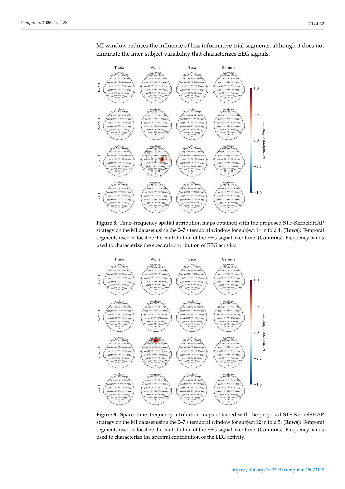

### Extraction assessment
- **Confidence:** 0.75 (below the configured 0.85 threshold; human review required).
- Embedded images require visual review; captions remain page-level text evidence only.

### Raw extracted text
```
Computers 2026, 15, 428
20 of 32
MI window reduces the influence of less informative trial segments, although it does not
eliminate the inter-subject variability that characterizes EEG signals.
0–2 s
Fp1
Fpz
Fp2
AF7 AF3
AFz
AF4 AF8
F7F5 F3 F1
Fz
F2 F4 F6F8
FT7FC5FC3FC1 FCz FC2 FC4FC6
FT8
T7C5 C3
C1
Cz
C2
C4 C6T8
TP7CP5CP3CP1 CPz CP2CP4CP6
TP8
P9
P7P5P3 P1 Pz
P2 P4P6P8
P10
PO7PO3 POz PO4PO8
O1
Oz
O2
Iz
Theta
Fp1
Fpz
Fp2
AF7 AF3
AFz
AF4 AF8
F7F5 F3 F1
Fz
F2 F4 F6F8
FT7FC5FC3FC1 FCz FC2 FC4FC6
FT8
T7C5 C3
C1
Cz
C2
C4 C6T8
TP7CP5CP3CP1 CPz CP2CP4CP6
TP8
P9
P7P5P3 P1 Pz
P2 P4P6P8
P10
PO7PO3 POz PO4PO8
O1
Oz
O2
Iz
Alpha
Fp1
Fpz
Fp2
AF7 AF3
AFz
AF4 AF8
F7F5 F3 F1
Fz
F2 F4 F6F8
FT7FC5FC3FC1 FCz FC2 FC4FC6
FT8
T7C5 C3
C1
Cz
C2
C4 C6T8
TP7CP5CP3CP1 CPz CP2CP4CP6
TP8
P9
P7P5P3 P1 Pz
P2 P4P6P8
P10
PO7PO3 POz PO4PO8
O1
Oz
O2
Iz
Beta
Fp1
Fpz
Fp2
AF7 AF3
AFz
AF4 AF8
F7F5 F3 F1
Fz
F2 F4 F6F8
FT7FC5FC3FC1 FCz FC2 FC4FC6
FT8
T7C5 C3
C1
Cz
C2
C4 C6T8
TP7CP5CP3CP1 CPz CP2CP4CP6
TP8
P9
P7P5P3 P1 Pz
P2 P4P6P8
P10
PO7PO3 POz PO4PO8
O1
Oz
O2
Iz
Gamma
2–2.5 s
Fp1
Fpz
Fp2
AF7 AF3
AFz
AF4 AF8
F7F5 F3 F1
Fz
F2 F4 F6F8
FT7FC5FC3FC1 FCz FC2 FC4FC6
FT8
T7C5 C3
C1
Cz
C2
C4 C6T8
TP7CP5CP3CP1 CPz CP2CP4CP6
TP8
P9
P7P5P3 P1 Pz
P2 P4P6P8
P10
PO7PO3 POz PO4PO8
O1
Oz
O2
Iz
Fp1
Fpz
Fp2
AF7 AF3
AFz
AF4 AF8
F7F5 F3 F1
Fz
F2 F4 F6F8
FT7FC5FC3FC1 FCz FC2 FC4FC6
FT8
T7C5 C3
C1
Cz
C2
C4 C6T8
TP7CP5CP3CP1 CPz CP2CP4CP6
TP8
P9
P7P5P3 P1 Pz
P2 P4P6P8
P10
PO7PO3 POz PO4PO8
O1
Oz
O2
Iz
Fp1
Fpz
Fp2
AF7 AF3
AFz
AF4 AF8
F7F5 F3 F1
Fz
F2 F4 F6F8
FT7FC5FC3FC1 FCz FC2 FC4FC6
FT8
T7C5 C3
C1
Cz
C2
C4 C6T8
TP7CP5CP3CP1 CPz CP2CP4CP6
TP8
P9
P7P5P3 P1 Pz
P2 P4P6P8
P10
PO7PO3 POz PO4PO8
O1
Oz
O2
Iz
Fp1
Fpz
Fp2
AF7 AF3
AFz
AF4 AF8
F7F5 F3 F1
Fz
F2 F4 F6F8
FT7FC5FC3FC1 FCz FC2 FC4FC6
FT8
T7C5 C3
C1
Cz
C2
C4 C6T8
TP7CP5CP3CP1 CPz CP2CP4CP6
TP8
P9
P7P5P3 P1 Pz
P2 P4P6P8
P10
PO7PO3 POz PO4PO8
O1
Oz
O2
Iz
2.5–5 s
Fp1
Fpz
Fp2
AF7 AF3
AFz
AF4 AF8
F7F5 F3 F1
Fz
F2 F4 F6F8
FT7FC5FC3FC1 FCz FC2 FC4FC6
FT8
T7C5 C3
C1
Cz
C2
C4 C6T8
TP7CP5CP3CP1 CPz CP2CP4CP6
TP8
P9
P7P5P3 P1 Pz
P2 P4P6P8
P10
PO7PO3 POz PO4PO8
O1
Oz
O2
Iz
Fp1
Fpz
Fp2
AF7 AF3
AFz
AF4 AF8
F7F5 F3 F1
Fz
F2 F4 F6F8
FT7FC5FC3FC1 FCz FC2 FC4FC6
FT8
T7C5 C3
C1
Cz
C2
C4 C6T8
TP7CP5CP3CP1 CPz CP2CP4CP6
TP8
P9
P7P5P3 P1 Pz
P2 P4P6P8
P10
PO7PO3 POz PO4PO8
O1
Oz
O2
Iz
Fp1
Fpz
Fp2
AF7 AF3
AFz
AF4 AF8
F7F5 F3 F1
Fz
F2 F4 F6F8
FT7FC5FC3FC1 FCz FC2 FC4FC6
FT8
T7C5 C3
C1
Cz
C2
C4 C6T8
TP7CP5CP3CP1 CPz CP2CP4CP6
TP8
P9
P7P5P3 P1 Pz
P2 P4P6P8
P10
PO7PO3 POz PO4PO8
O1
Oz
O2
Iz
Fp1
Fpz
Fp2
AF7 AF3
AFz
AF4 AF8
F7F5 F3 F1
Fz
F2 F4 F6F8
FT7FC5FC3FC1 FCz FC2 FC4FC6
FT8
T7C5 C3
C1
Cz
C2
C4 C6T8
TP7CP5CP3CP1 CPz CP2CP4CP6
TP8
P9
P7P5P3 P1 Pz
P2 P4P6P8
P10
PO7PO3 POz PO4PO8
O1
Oz
O2
Iz
5–7 s
Fp1
Fpz
Fp2
AF7 AF3
AFz
AF4 AF8
F7F5 F3 F1
Fz
F2 F4 F6F8
FT7FC5FC3FC1 FCz FC2 FC4FC6
FT8
T7C5 C3
C1
Cz
C2
C4 C6T8
TP7CP5CP3CP1 CPz CP2CP4CP6
TP8
P9
P7P5P3 P1 Pz
P2 P4P6P8
P10
PO7PO3 POz PO4PO8
O1
Oz
O2
Iz
Fp1
Fpz
Fp2
AF7 AF3
AFz
AF4 AF8
F7F5 F3 F1
Fz
F2 F4 F6F8
FT7FC5FC3FC1 FCz FC2 FC4FC6
FT8
T7C5 C3
C1
Cz
C2
C4 C6T8
TP7CP5CP3CP1 CPz CP2CP4CP6
TP8
P9
P7P5P3 P1 Pz
P2 P4P6P8
P10
PO7PO3 POz PO4PO8
O1
Oz
O2
Iz
Fp1
Fpz
Fp2
AF7 AF3
AFz
AF4 AF8
F7F5 F3 F1
Fz
F2 F4 F6F8
FT7FC5FC3FC1 FCz FC2 FC4FC6
FT8
T7C5 C3
C1
Cz
C2
C4 C6T8
TP7CP5CP3CP1 CPz CP2CP4CP6
TP8
P9
P7P5P3 P1 Pz
P2 P4P6P8
P10
PO7PO3 POz PO4PO8
O1
Oz
O2
Iz
Fp1
Fpz
Fp2
AF7 AF3
AFz
AF4 AF8
F7F5 F3 F1
Fz
F2 F4 F6F8
FT7FC5FC3FC1 FCz FC2 FC4FC6
FT8
T7C5 C3
C1
Cz
C2
C4 C6T8
TP7CP5CP3CP1 CPz CP2CP4CP6
TP8
P9
P7P5P3 P1 Pz
P2 P4P6P8
P10
PO7PO3 POz PO4PO8
O1
Oz
O2
Iz
−1.0
−0.5
0.0
0.5
1.0
Normalized difference
Figure 8. Time–frequency spatial attribution maps obtained with the proposed STF-KernelSHAP
strategy on the MI dataset using the 0–7 s temporal window for subject 14 in fold 4. (Rows): Temporal
segments used to localize the contribution of the EEG signal over time. (Columns): Frequency bands
used to characterize the spectral contribution of EEG activity.
0–2 s
Fp1
Fpz
Fp2
AF7 AF3
AFz
AF4 AF8
F7F5 F3 F1
Fz
F2 F4 F6F8
FT7FC5FC3FC1 FCz FC2 FC4FC6
FT8
T7C5 C3
C1
Cz
C2
C4 C6T8
TP7CP5CP3CP1 CPz CP2CP4CP6
TP8
P9
P7P5P3 P1 Pz
P2 P4P6P8
P10
PO7PO3 POz PO4PO8
O1
Oz
O2
Iz
Theta
Fp1
Fpz
Fp2
AF7 AF3
AFz
AF4 AF8
F7F5 F3 F1
Fz
F2 F4 F6F8
FT7FC5FC3FC1 FCz FC2 FC4FC6
FT8
T7C5 C3
C1
Cz
C2
C4 C6T8
TP7CP5CP3CP1 CPz CP2CP4CP6
TP8
P9
P7P5P3 P1 Pz
P2 P4P6P8
P10
PO7PO3 POz PO4PO8
O1
Oz
O2
Iz
Alpha
Fp1
Fpz
Fp2
AF7 AF3
AFz
AF4 AF8
F7F5 F3 F1
Fz
F2 F4 F6F8
FT7FC5FC3FC1 FCz FC2 FC4FC6
FT8
T7C5 C3
C1
Cz
C2
C4 C6T8
TP7CP5CP3CP1 CPz CP2CP4CP6
TP8
P9
P7P5P3 P1 Pz
P2 P4P6P8
P10
PO7PO3 POz PO4PO8
O1
Oz
O2
Iz
Beta
Fp1
Fpz
Fp2
AF7 AF3
AFz
AF4 AF8
F7F5 F3 F1
Fz
F2 F4 F6F8
FT7FC5FC3FC1 FCz FC2 FC4FC6
FT8
T7C5 C3
C1
Cz
C2
C4 C6T8
TP7CP5CP3CP1 CPz CP2CP4CP6
TP8
P9
P7P5P3 P1 Pz
P2 P4P6P8
P10
PO7PO3 POz PO4PO8
O1
Oz
O2
Iz
Gamma
2–2.5 s
Fp1
Fpz
Fp2
AF7 AF3
AFz
AF4 AF8
F7F5 F3 F1
Fz
F2 F4 F6F8
FT7FC5FC3FC1 FCz FC2 FC4FC6
FT8
T7C5 C3
C1
Cz
C2
C4 C6T8
TP7CP5CP3CP1 CPz CP2CP4CP6
TP8
P9
P7P5P3 P1 Pz
P2 P4P6P8
P10
PO7PO3 POz PO4PO8
O1
Oz
O2
Iz
Fp1
Fpz
Fp2
AF7 AF3
AFz
AF4 AF8
F7F5 F3 F1
Fz
F2 F4 F6F8
FT7FC5FC3FC1 FCz FC2 FC4FC6
FT8
T7C5 C3
C1
Cz
C2
C4 C6T8
TP7CP5CP3CP1 CPz CP2CP4CP6
TP8
P9
P7P5P3 P1 Pz
P2 P4P6P8
P10
PO7PO3 POz PO4PO8
O1
Oz
O2
Iz
Fp1
Fpz
Fp2
AF7 AF3
AFz
AF4 AF8
F7F5 F3 F1
Fz
F2 F4 F6F8
FT7FC5FC3FC1 FCz FC2 FC4FC6
FT8
T7C5 C3
C1
Cz
C2
C4 C6T8
TP7CP5CP3CP1 CPz CP2CP4CP6
TP8
P9
P7P5P3 P1 Pz
P2 P4P6P8
P10
PO7PO3 POz PO4PO8
O1
Oz
O2
Iz
Fp1
Fpz
Fp2
AF7 AF3
AFz
AF4 AF8
F7F5 F3 F1
Fz
F2 F4 F6F8
FT7FC5FC3FC1 FCz FC2 FC4FC6
FT8
T7C5 C3
C1
Cz
C2
C4 C6T8
TP7CP5CP3CP1 CPz CP2CP4CP6
TP8
P9
P7P5P3 P1 Pz
P2 P4P6P8
P10
PO7PO3 POz PO4PO8
O1
Oz
O2
Iz
2.5–5 s
Fp1
Fpz
Fp2
AF7 AF3
AFz
AF4 AF8
F7F5 F3 F1
Fz
F2 F4 F6F8
FT7FC5FC3FC1 FCz FC2 FC4FC6
FT8
T7C5 C3
C1
Cz
C2
C4 C6T8
TP7CP5CP3CP1 CPz CP2CP4CP6
TP8
P9
P7P5P3 P1 Pz
P2 P4P6P8
P10
PO7PO3 POz PO4PO8
O1
Oz
O2
Iz
Fp1
Fpz
Fp2
AF7 AF3
AFz
AF4 AF8
F7F5 F3 F1
Fz
F2 F4 F6F8
FT7FC5FC3FC1 FCz FC2 FC4FC6
FT8
T7C5 C3
C1
Cz
C2
C4 C6T8
TP7CP5CP3CP1 CPz CP2CP4CP6
TP8
P9
P7P5P3 P1 Pz
P2 P4P6P8
P10
PO7PO3 POz PO4PO8
O1
Oz
O2
Iz
Fp1
Fpz
Fp2
AF7 AF3
AFz
AF4 AF8
F7F5 F3 F1
Fz
F2 F4 F6F8
FT7FC5FC3FC1 FCz FC2 FC4FC6
FT8
T7C5 C3
C1
Cz
C2
C4 C6T8
TP7CP5CP3CP1 CPz CP2CP4CP6
TP8
P9
P7P5P3 P1 Pz
P2 P4P6P8
P10
PO7PO3 POz PO4PO8
O1
Oz
O2
Iz
Fp1
Fpz
Fp2
AF7 AF3
AFz
AF4 AF8
F7F5 F3 F1
Fz
F2 F4 F6F8
FT7FC5FC3FC1 FCz FC2 FC4FC6
FT8
T7C5 C3
C1
Cz
C2
C4 C6T8
TP7CP5CP3CP1 CPz CP2CP4CP6
TP8
P9
P7P5P3 P1 Pz
P2 P4P6P8
P10
PO7PO3 POz PO4PO8
O1
Oz
O2
Iz
5–7 s
Fp1
Fpz
Fp2
AF7 AF3
AFz
AF4 AF8
F7F5 F3 F1
Fz
F2 F4 F6F8
FT7FC5FC3FC1 FCz FC2 FC4FC6
FT8
T7C5 C3
C1
Cz
C2
C4 C6T8
TP7CP5CP3CP1 CPz CP2CP4CP6
TP8
P9
P7P5P3 P1 Pz
P2 P4P6P8
P10
PO7PO3 POz PO4PO8
O1
Oz
O2
Iz
Fp1
Fpz
Fp2
AF7 AF3
AFz
AF4 AF8
F7F5 F3 F1
Fz
F2 F4 F6F8
FT7FC5FC3FC1 FCz FC2 FC4FC6
FT8
T7C5 C3
C1
Cz
C2
C4 C6T8
TP7CP5CP3CP1 CPz CP2CP4CP6
TP8
P9
P7P5P3 P1 Pz
P2 P4P6P8
P10
PO7PO3 POz PO4PO8
O1
Oz
O2
Iz
Fp1
Fpz
Fp2
AF7 AF3
AFz
AF4 AF8
F7F5 F3 F1
Fz
F2 F4 F6F8
FT7FC5FC3FC1 FCz FC2 FC4FC6
FT8
T7C5 C3
C1
Cz
C2
C4 C6T8
TP7CP5CP3CP1 CPz CP2CP4CP6
TP8
P9
P7P5P3 P1 Pz
P2 P4P6P8
P10
PO7PO3 POz PO4PO8
O1
Oz
O2
Iz
Fp1
Fpz
Fp2
AF7 AF3
AFz
AF4 AF8
F7F5 F3 F1
Fz
F2 F4 F6F8
FT7FC5FC3FC1 FCz FC2 FC4FC6
FT8
T7C5 C3
C1
Cz
C2
C4 C6T8
TP7CP5CP3CP1 CPz CP2CP4CP6
TP8
P9
P7P5P3 P1 Pz
P2 P4P6P8
P10
PO7PO3 POz PO4PO8
O1
Oz
O2
Iz
−1.0
−0.5
0.0
0.5
1.0
Normalized difference
Figure 9. Space–time–frequency attribution maps obtained with the proposed STF-KernelSHAP
strategy on the MI dataset using the 0–7 s temporal window for subject 12 in fold 5. (Rows): Temporal
segments used to localize the contribution of the EEG signal over time. (Columns): Frequency bands
used to characterize the spectral contribution of the EEG activity.
https://doi.org/10.3390/computers15070428

```

### Textual figure-caption evidence
- Figure 8. Time–frequency spatial attribution maps obtained with the proposed STF-KernelSHAP
- Figure 9. Space–time–frequency attribution maps obtained with the proposed STF-KernelSHAP
- Captions are page-level text evidence and are not associated with embedded images.

### Embedded images
- `page-020-image-001` — embedded image metadata: 713 × 713 px, xref 589; visual review required.
- `page-020-image-002` — embedded image metadata: 713 × 713 px, xref 590; visual review required.
- `page-020-image-003` — embedded image metadata: 713 × 713 px, xref 591; visual review required.
- `page-020-image-004` — embedded image metadata: 713 × 713 px, xref 592; visual review required.
- `page-020-image-005` — embedded image metadata: 713 × 713 px, xref 593; visual review required.
- `page-020-image-006` — embedded image metadata: 713 × 713 px, xref 594; visual review required.
- `page-020-image-007` — embedded image metadata: 713 × 713 px, xref 595; visual review required.
- `page-020-image-008` — embedded image metadata: 45 × 2304 px, xref 610; visual review required.
- `page-020-image-009` — embedded image metadata: 713 × 713 px, xref 612; visual review required.
- `page-020-image-010` — embedded image metadata: 713 × 713 px, xref 614; visual review required.
- `page-020-image-011` — embedded image metadata: 713 × 713 px, xref 615; visual review required.
- `page-020-image-012` — embedded image metadata: 713 × 713 px, xref 616; visual review required.
- `page-020-image-013` — embedded image metadata: 713 × 713 px, xref 617; visual review required.
- `page-020-image-014` — embedded image metadata: 713 × 713 px, xref 618; visual review required.
- `page-020-image-015` — embedded image metadata: 713 × 713 px, xref 619; visual review required.
- `page-020-image-016` — embedded image metadata: 713 × 713 px, xref 620; visual review required.
- `page-020-image-017` — embedded image metadata: 713 × 713 px, xref 621; visual review required.
- `page-020-image-018` — embedded image metadata: 713 × 713 px, xref 524; visual review required.
- `page-020-image-019` — embedded image metadata: 713 × 713 px, xref 525; visual review required.
- `page-020-image-020` — embedded image metadata: 713 × 713 px, xref 526; visual review required.
- `page-020-image-021` — embedded image metadata: 713 × 713 px, xref 527; visual review required.
- `page-020-image-022` — embedded image metadata: 713 × 713 px, xref 528; visual review required.
- `page-020-image-023` — embedded image metadata: 713 × 713 px, xref 529; visual review required.
- `page-020-image-024` — embedded image metadata: 713 × 713 px, xref 530; visual review required.
- `page-020-image-025` — embedded image metadata: 45 × 2304 px, xref 545; visual review required.
- `page-020-image-026` — embedded image metadata: 713 × 713 px, xref 547; visual review required.
- `page-020-image-027` — embedded image metadata: 713 × 713 px, xref 549; visual review required.
- `page-020-image-028` — embedded image metadata: 713 × 713 px, xref 550; visual review required.
- `page-020-image-029` — embedded image metadata: 713 × 713 px, xref 551; visual review required.
- `page-020-image-030` — embedded image metadata: 713 × 713 px, xref 552; visual review required.
- `page-020-image-031` — embedded image metadata: 713 × 713 px, xref 553; visual review required.
- `page-020-image-032` — embedded image metadata: 713 × 713 px, xref 554; visual review required.
- `page-020-image-033` — embedded image metadata: 713 × 713 px, xref 555; visual review required.
- `page-020-image-034` — embedded image metadata: 713 × 713 px, xref 556; visual review required.

## Page 21
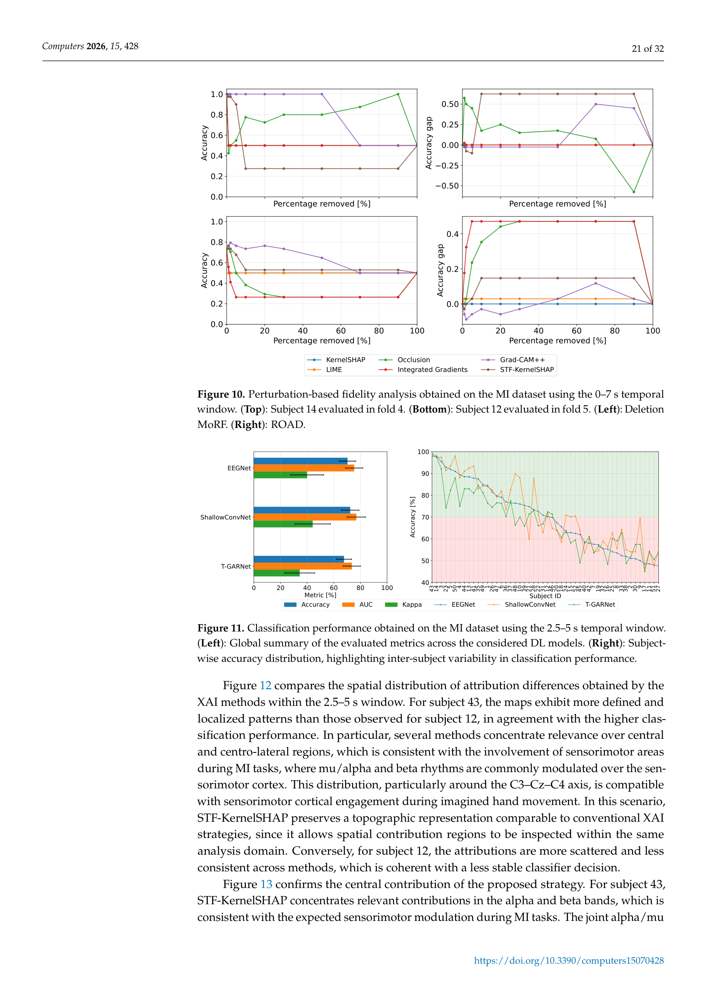

### Extraction assessment
- **Confidence:** 0.95 (meets the configured threshold).
- Machine-readable text was preserved with page-image provenance.

### Raw extracted text
```
Computers 2026, 15, 428
21 of 32
Percentage removed [%]
0.0
0.2
0.4
0.6
0.8
1.0
Accuracy
Percentage removed [%]
−0.50
−0.25
0.00
0.25
0.50
Accuracy gap
0
20
40
60
80
100
Percentage removed [%]
0.0
0.2
0.4
0.6
0.8
1.0
Accuracy
0
20
40
60
80
100
Percentage removed [%]
0.0
0.2
0.4
Accuracy gap
KernelSHAP
LIME
Occlusion
Integrated Gradients
Grad-CAM++
STF-KernelSHAP
Figure 10. Perturbation-based fidelity analysis obtained on the MI dataset using the 0–7 s temporal
window. (Top): Subject 14 evaluated in fold 4. (Bottom): Subject 12 evaluated in fold 5. (Left): Deletion
MoRF. (Right): ROAD.
0
20
40
60
80
100
Metric [%]
EEGNet
ShallowConvNet
T-GARNet
43
14
3
23
5
50
4
44
13
41
35
49
1
26
47
6
36
37
48
10
39
21
28
22
31
12
46
20
18
24
15
52
45
40
42
7
19
32
16
25
8
33
38
2
30
9
17
11
51
27
Subject ID
40
50
60
70
80
90
100
Accuracy [%]
Accuracy
AUC
Kappa
EEGNet
ShallowConvNet
T-GARNet
Figure 11. Classification performance obtained on the MI dataset using the 2.5–5 s temporal window.
(Left): Global summary of the evaluated metrics across the considered DL models. (Right): Subject-
wise accuracy distribution, highlighting inter-subject variability in classification performance.
Figure 12 compares the spatial distribution of attribution differences obtained by the
XAI methods within the 2.5–5 s window. For subject 43, the maps exhibit more defined and
localized patterns than those observed for subject 12, in agreement with the higher clas-
sification performance. In particular, several methods concentrate relevance over central
and centro-lateral regions, which is consistent with the involvement of sensorimotor areas
during MI tasks, where mu/alpha and beta rhythms are commonly modulated over the sen-
sorimotor cortex. This distribution, particularly around the C3–Cz–C4 axis, is compatible
with sensorimotor cortical engagement during imagined hand movement. In this scenario,
STF-KernelSHAP preserves a topographic representation comparable to conventional XAI
strategies, since it allows spatial contribution regions to be inspected within the same
analysis domain. Conversely, for subject 12, the attributions are more scattered and less
consistent across methods, which is coherent with a less stable classifier decision.
Figure 13 confirms the central contribution of the proposed strategy. For subject 43,
STF-KernelSHAP concentrates relevant contributions in the alpha and beta bands, which is
consistent with the expected sensorimotor modulation during MI tasks. The joint alpha/mu
https://doi.org/10.3390/computers15070428

```

### Textual figure-caption evidence
- Figure 10. Perturbation-based fidelity analysis obtained on the MI dataset using the 0–7 s temporal
- Figure 11. Classification performance obtained on the MI dataset using the 2.5–5 s temporal window.
- Captions are page-level text evidence and are not associated with embedded images.

## Page 22
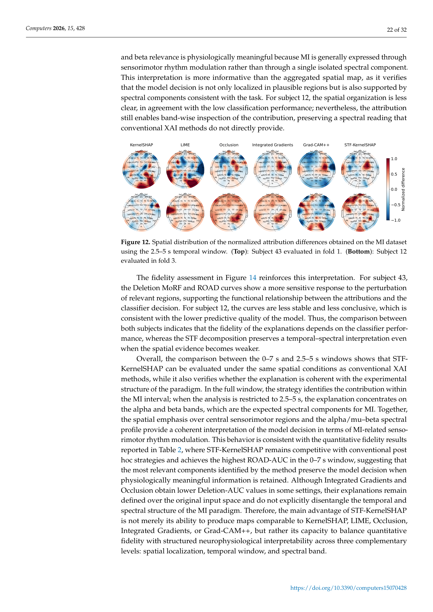

### Extraction assessment
- **Confidence:** 0.75 (below the configured 0.85 threshold; human review required).
- Embedded images require visual review; captions remain page-level text evidence only.

### Raw extracted text
```
Computers 2026, 15, 428
22 of 32
and beta relevance is physiologically meaningful because MI is generally expressed through
sensorimotor rhythm modulation rather than through a single isolated spectral component.
This interpretation is more informative than the aggregated spatial map, as it verifies
that the model decision is not only localized in plausible regions but is also supported by
spectral components consistent with the task. For subject 12, the spatial organization is less
clear, in agreement with the low classification performance; nevertheless, the attribution
still enables band-wise inspection of the contribution, preserving a spectral reading that
conventional XAI methods do not directly provide.
Fp1
Fpz
Fp2
AF7 AF3
AFz
AF4 AF8
F7F5 F3 F1
Fz
F2 F4 F6F8
FT7FC5FC3 FC1 FCz FC2 FC4FC6
FT8
T7C5 C3
C1
Cz
C2
C4 C6T8
TP7CP5CP3 CP1 CPz CP2 CP4CP6
TP8
P9
P7P5P3 P1
Pz
P2 P4P6P8
P10
PO7PO3 POz PO4PO8
O1
Oz
O2
Iz
KernelSHAP
Fp1
Fpz
Fp2
AF7 AF3
AFz
AF4 AF8
F7F5 F3 F1
Fz
F2 F4 F6F8
FT7FC5FC3 FC1 FCz FC2 FC4FC6
FT8
T7C5 C3
C1
Cz
C2
C4 C6T8
TP7CP5CP3 CP1 CPz CP2 CP4CP6
TP8
P9
P7P5P3 P1
Pz
P2 P4P6P8
P10
PO7PO3 POz PO4PO8
O1
Oz
O2
Iz
LIME
Fp1
Fpz
Fp2
AF7 AF3
AFz
AF4 AF8
F7F5 F3 F1
Fz
F2 F4 F6F8
FT7FC5FC3 FC1 FCz FC2 FC4FC6
FT8
T7C5 C3
C1
Cz
C2
C4 C6T8
TP7CP5CP3 CP1 CPz CP2 CP4CP6
TP8
P9
P7P5P3 P1
Pz
P2 P4P6P8
P10
PO7PO3 POz PO4PO8
O1
Oz
O2
Iz
Occlusion
Fp1
Fpz
Fp2
AF7 AF3
AFz
AF4 AF8
F7F5 F3 F1
Fz
F2 F4 F6F8
FT7FC5FC3 FC1 FCz FC2 FC4FC6
FT8
T7C5 C3
C1
Cz
C2
C4 C6T8
TP7CP5CP3 CP1 CPz CP2 CP4CP6
TP8
P9
P7P5P3 P1
Pz
P2 P4P6P8
P10
PO7PO3 POz PO4PO8
O1
Oz
O2
Iz
Integrated Gradients
Fp1
Fpz
Fp2
AF7 AF3
AFz
AF4 AF8
F7F5 F3 F1
Fz
F2 F4 F6F8
FT7FC5FC3 FC1 FCz FC2 FC4FC6
FT8
T7C5 C3
C1
Cz
C2
C4 C6T8
TP7CP5CP3 CP1 CPz CP2 CP4CP6
TP8
P9
P7P5P3 P1
Pz
P2 P4P6P8
P10
PO7PO3 POz PO4PO8
O1
Oz
O2
Iz
Grad-CAM++
Fp1
Fpz
Fp2
AF7 AF3
AFz
AF4 AF8
F7F5 F3 F1
Fz
F2 F4 F6F8
FT7FC5FC3 FC1 FCz FC2 FC4FC6
FT8
T7C5 C3
C1
Cz
C2
C4 C6T8
TP7CP5CP3 CP1 CPz CP2 CP4CP6
TP8
P9
P7P5P3 P1
Pz
P2 P4P6P8
P10
PO7PO3 POz PO4PO8
O1
Oz
O2
Iz
STF-KernelSHAP
Fp1
Fpz
Fp2
AF7 AF3
AFz
AF4 AF8
F7F5 F3 F1
Fz
F2 F4 F6F8
FT7FC5FC3 FC1 FCz FC2 FC4FC6
FT8
T7C5 C3
C1
Cz
C2
C4 C6T8
TP7CP5CP3 CP1 CPz CP2 CP4CP6
TP8
P9
P7P5P3 P1
Pz
P2 P4P6P8
P10
PO7PO3 POz PO4PO8
O1
Oz
O2
Iz
Fp1
Fpz
Fp2
AF7 AF3
AFz
AF4 AF8
F7F5 F3 F1
Fz
F2 F4 F6F8
FT7FC5FC3 FC1 FCz FC2 FC4FC6
FT8
T7C5 C3
C1
Cz
C2
C4 C6T8
TP7CP5CP3 CP1 CPz CP2 CP4CP6
TP8
P9
P7P5P3 P1
Pz
P2 P4P6P8
P10
PO7PO3 POz PO4PO8
O1
Oz
O2
Iz
Fp1
Fpz
Fp2
AF7 AF3
AFz
AF4 AF8
F7F5 F3 F1
Fz
F2 F4 F6F8
FT7FC5FC3 FC1 FCz FC2 FC4FC6
FT8
T7C5 C3
C1
Cz
C2
C4 C6T8
TP7CP5CP3 CP1 CPz CP2 CP4CP6
TP8
P9
P7P5P3 P1
Pz
P2 P4P6P8
P10
PO7PO3 POz PO4PO8
O1
Oz
O2
Iz
Fp1
Fpz
Fp2
AF7 AF3
AFz
AF4 AF8
F7F5 F3 F1
Fz
F2 F4 F6F8
FT7FC5FC3 FC1 FCz FC2 FC4FC6
FT8
T7C5 C3
C1
Cz
C2
C4 C6T8
TP7CP5CP3 CP1 CPz CP2 CP4CP6
TP8
P9
P7P5P3 P1
Pz
P2 P4P6P8
P10
PO7PO3 POz PO4PO8
O1
Oz
O2
Iz
Fp1
Fpz
Fp2
AF7 AF3
AFz
AF4 AF8
F7F5 F3 F1
Fz
F2 F4 F6F8
FT7FC5FC3 FC1 FCz FC2 FC4FC6
FT8
T7C5 C3
C1
Cz
C2
C4 C6T8
TP7CP5CP3 CP1 CPz CP2 CP4CP6
TP8
P9
P7P5P3 P1
Pz
P2 P4P6P8
P10
PO7PO3 POz PO4PO8
O1
Oz
O2
Iz
Fp1
Fpz
Fp2
AF7 AF3
AFz
AF4 AF8
F7F5 F3 F1
Fz
F2 F4 F6F8
FT7FC5FC3 FC1 FCz FC2 FC4FC6
FT8
T7C5 C3
C1
Cz
C2
C4 C6T8
TP7CP5CP3 CP1 CPz CP2 CP4CP6
TP8
P9
P7P5P3 P1
Pz
P2 P4P6P8
P10
PO7PO3 POz PO4PO8
O1
Oz
O2
Iz
−1.0
−0.5
0.0
0.5
1.0
Normalized difference
Figure 12. Spatial distribution of the normalized attribution differences obtained on the MI dataset
using the 2.5–5 s temporal window. (Top): Subject 43 evaluated in fold 1. (Bottom): Subject 12
evaluated in fold 3.
The fidelity assessment in Figure 14 reinforces this interpretation. For subject 43,
the Deletion MoRF and ROAD curves show a more sensitive response to the perturbation
of relevant regions, supporting the functional relationship between the attributions and the
classifier decision. For subject 12, the curves are less stable and less conclusive, which is
consistent with the lower predictive quality of the model. Thus, the comparison between
both subjects indicates that the fidelity of the explanations depends on the classifier perfor-
mance, whereas the STF decomposition preserves a temporal–spectral interpretation even
when the spatial evidence becomes weaker.
Overall, the comparison between the 0–7 s and 2.5–5 s windows shows that STF-
KernelSHAP can be evaluated under the same spatial conditions as conventional XAI
methods, while it also verifies whether the explanation is coherent with the experimental
structure of the paradigm. In the full window, the strategy identifies the contribution within
the MI interval; when the analysis is restricted to 2.5–5 s, the explanation concentrates on
the alpha and beta bands, which are the expected spectral components for MI. Together,
the spatial emphasis over central sensorimotor regions and the alpha/mu–beta spectral
profile provide a coherent interpretation of the model decision in terms of MI-related senso-
rimotor rhythm modulation. This behavior is consistent with the quantitative fidelity results
reported in Table 2, where STF-KernelSHAP remains competitive with conventional post
hoc strategies and achieves the highest ROAD-AUC in the 0–7 s window, suggesting that
the most relevant components identified by the method preserve the model decision when
physiologically meaningful information is retained. Although Integrated Gradients and
Occlusion obtain lower Deletion-AUC values in some settings, their explanations remain
defined over the original input space and do not explicitly disentangle the temporal and
spectral structure of the MI paradigm. Therefore, the main advantage of STF-KernelSHAP
is not merely its ability to produce maps comparable to KernelSHAP, LIME, Occlusion,
Integrated Gradients, or Grad-CAM++, but rather its capacity to balance quantitative
fidelity with structured neurophysiological interpretability across three complementary
levels: spatial localization, temporal window, and spectral band.
https://doi.org/10.3390/computers15070428

```

### Textual figure-caption evidence
- Figure 12. Spatial distribution of the normalized attribution differences obtained on the MI dataset
- Captions are page-level text evidence and are not associated with embedded images.

### Embedded images
- `page-022-image-001` — embedded image metadata: 56 × 1191 px, xref 708; visual review required.
- `page-022-image-002` — embedded image metadata: 735 × 735 px, xref 709; visual review required.
- `page-022-image-003` — embedded image metadata: 735 × 735 px, xref 710; visual review required.
- `page-022-image-004` — embedded image metadata: 735 × 735 px, xref 711; visual review required.
- `page-022-image-005` — embedded image metadata: 735 × 735 px, xref 723; visual review required.
- `page-022-image-006` — embedded image metadata: 735 × 735 px, xref 725; visual review required.
- `page-022-image-007` — embedded image metadata: 735 × 735 px, xref 726; visual review required.
- `page-022-image-008` — embedded image metadata: 735 × 735 px, xref 727; visual review required.
- `page-022-image-009` — embedded image metadata: 735 × 735 px, xref 728; visual review required.
- `page-022-image-010` — embedded image metadata: 735 × 735 px, xref 729; visual review required.
- `page-022-image-011` — embedded image metadata: 735 × 735 px, xref 730; visual review required.
- `page-022-image-012` — embedded image metadata: 735 × 735 px, xref 731; visual review required.
- `page-022-image-013` — embedded image metadata: 735 × 735 px, xref 732; visual review required.

## Page 23
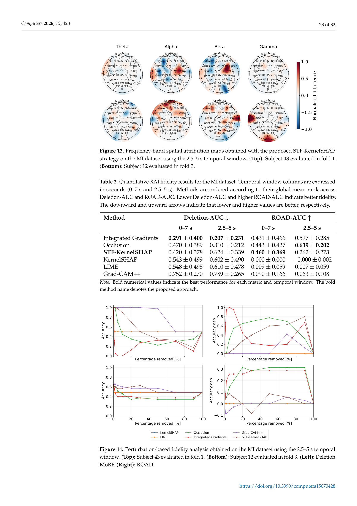

### Extraction assessment
- **Confidence:** 0.65 (below the configured 0.85 threshold; human review required).
- One or more equation candidates are ambiguous in raw extraction. Embedded images require visual review; captions remain page-level text evidence only.

### Raw extracted text
```
Computers 2026, 15, 428
23 of 32
Fp1
Fpz
Fp2
AF7 AF3
AFz
AF4 AF8
F7F5 F3 F1
Fz
F2 F4 F6F8
FT7FC5FC3FC1 FCz FC2 FC4FC6
FT8
T7C5 C3
C1
Cz
C2
C4 C6T8
TP7CP5CP3CP1 CPz CP2CP4CP6
TP8
P9
P7P5P3 P1 Pz
P2 P4P6P8
P10
PO7PO3 POz PO4PO8
O1
Oz
O2
Iz
Theta
Fp1
Fpz
Fp2
AF7 AF3
AFz
AF4 AF8
F7F5 F3 F1
Fz
F2 F4 F6F8
FT7FC5FC3FC1 FCz FC2 FC4FC6
FT8
T7C5 C3
C1
Cz
C2
C4 C6T8
TP7CP5CP3CP1 CPz CP2CP4CP6
TP8
P9
P7P5P3 P1 Pz
P2 P4P6P8
P10
PO7PO3 POz PO4PO8
O1
Oz
O2
Iz
Alpha
Fp1
Fpz
Fp2
AF7 AF3
AFz
AF4 AF8
F7F5 F3 F1
Fz
F2 F4 F6F8
FT7FC5FC3FC1 FCz FC2 FC4FC6
FT8
T7C5 C3
C1
Cz
C2
C4 C6T8
TP7CP5CP3CP1 CPz CP2CP4CP6
TP8
P9
P7P5P3 P1 Pz
P2 P4P6P8
P10
PO7PO3 POz PO4PO8
O1
Oz
O2
Iz
Beta
Fp1
Fpz
Fp2
AF7 AF3
AFz
AF4 AF8
F7F5 F3 F1
Fz
F2 F4 F6F8
FT7FC5FC3FC1 FCz FC2 FC4FC6
FT8
T7C5 C3
C1
Cz
C2
C4 C6T8
TP7CP5CP3CP1 CPz CP2CP4CP6
TP8
P9
P7P5P3 P1 Pz
P2 P4P6P8
P10
PO7PO3 POz PO4PO8
O1
Oz
O2
Iz
Gamma
Fp1
Fpz
Fp2
AF7 AF3
AFz
AF4 AF8
F7F5 F3 F1
Fz
F2 F4 F6F8
FT7FC5FC3FC1 FCz FC2 FC4FC6
FT8
T7C5 C3
C1
Cz
C2
C4 C6T8
TP7CP5CP3CP1 CPz CP2CP4CP6
TP8
P9
P7P5P3 P1 Pz
P2 P4P6P8
P10
PO7PO3 POz PO4PO8
O1
Oz
O2
Iz
Fp1
Fpz
Fp2
AF7 AF3
AFz
AF4 AF8
F7F5 F3 F1
Fz
F2 F4 F6F8
FT7FC5FC3FC1 FCz FC2 FC4FC6
FT8
T7C5 C3
C1
Cz
C2
C4 C6T8
TP7CP5CP3CP1 CPz CP2CP4CP6
TP8
P9
P7P5P3 P1 Pz
P2 P4P6P8
P10
PO7PO3 POz PO4PO8
O1
Oz
O2
Iz
Fp1
Fpz
Fp2
AF7 AF3
AFz
AF4 AF8
F7F5 F3 F1
Fz
F2 F4 F6F8
FT7FC5FC3FC1 FCz FC2 FC4FC6
FT8
T7C5 C3
C1
Cz
C2
C4 C6T8
TP7CP5CP3CP1 CPz CP2CP4CP6
TP8
P9
P7P5P3 P1 Pz
P2 P4P6P8
P10
PO7PO3 POz PO4PO8
O1
Oz
O2
Iz
Fp1
Fpz
Fp2
AF7 AF3
AFz
AF4 AF8
F7F5 F3 F1
Fz
F2 F4 F6F8
FT7FC5FC3FC1 FCz FC2 FC4FC6
FT8
T7C5 C3
C1
Cz
C2
C4 C6T8
TP7CP5CP3CP1 CPz CP2CP4CP6
TP8
P9
P7P5P3 P1 Pz
P2 P4P6P8
P10
PO7PO3 POz PO4PO8
O1
Oz
O2
Iz
−1.0
−0.5
0.0
0.5
1.0
Normalized difference
Figure 13. Frequency-band spatial attribution maps obtained with the proposed STF-KernelSHAP
strategy on the MI dataset using the 2.5–5 s temporal window. (Top): Subject 43 evaluated in fold 1.
(Bottom): Subject 12 evaluated in fold 3.
Table 2. Quantitative XAI fidelity results for the MI dataset. Temporal-window columns are expressed
in seconds (0–7 s and 2.5–5 s). Methods are ordered according to their global mean rank across
Deletion-AUC and ROAD-AUC. Lower Deletion-AUC and higher ROAD-AUC indicate better fidelity.
The downward and upward arrows indicate that lower and higher values are better, respectively.
Method
Deletion-AUC ↓
ROAD-AUC ↑
0–7 s
2.5–5 s
0–7 s
2.5–5 s
Integrated Gradients
0.291 ± 0.400
0.207 ± 0.231
0.431 ± 0.466
0.597 ± 0.285
Occlusion
0.470 ± 0.389
0.310 ± 0.212
0.443 ± 0.427
0.639 ± 0.202
STF-KernelSHAP
0.420 ± 0.378
0.624 ± 0.339
0.460 ± 0.369
0.262 ± 0.273
KernelSHAP
0.543 ± 0.499
0.602 ± 0.490
0.000 ± 0.000
−0.000 ± 0.002
LIME
0.548 ± 0.495
0.610 ± 0.478
0.009 ± 0.059
0.007 ± 0.059
Grad-CAM++
0.752 ± 0.270
0.789 ± 0.265
0.090 ± 0.166
0.063 ± 0.108
Note: Bold numerical values indicate the best performance for each metric and temporal window. The bold
method name denotes the proposed approach.
Percentage removed [%]
0.0
0.2
0.4
0.6
0.8
1.0
Accuracy
Percentage removed [%]
0.0
0.2
0.4
0.6
0.8
1.0
Accuracy gap
0
20
40
60
80
100
Percentage removed [%]
0.0
0.2
0.4
0.6
0.8
1.0
Accuracy
0
20
40
60
80
100
Percentage removed [%]
−0.1
0.0
0.1
0.2
0.3
Accuracy gap
KernelSHAP
LIME
Occlusion
Integrated Gradients
Grad-CAM++
STF-KernelSHAP
Figure 14. Perturbation-based fidelity analysis obtained on the MI dataset using the 2.5–5 s temporal
window. (Top): Subject 43 evaluated in fold 1. (Bottom): Subject 12 evaluated in fold 3. (Left): Deletion
MoRF. (Right): ROAD.
https://doi.org/10.3390/computers15070428

```

### Textual figure-caption evidence
- Figure 13. Frequency-band spatial attribution maps obtained with the proposed STF-KernelSHAP
- Figure 14. Perturbation-based fidelity analysis obtained on the MI dataset using the 2.5–5 s temporal
- Captions are page-level text evidence and are not associated with embedded images.

### Equation candidates
- `page-023-equation-001` — review_required (confidence 0.45; page 23).
```
0.291 ± 0.400
```
- `page-023-equation-002` — review_required (confidence 0.45; page 23).
```
0.207 ± 0.231
```
- `page-023-equation-003` — review_required (confidence 0.45; page 23).
```
0.431 ± 0.466
```
- `page-023-equation-004` — review_required (confidence 0.45; page 23).
```
0.597 ± 0.285
```
- `page-023-equation-005` — review_required (confidence 0.45; page 23).
```
0.470 ± 0.389
```
- `page-023-equation-006` — review_required (confidence 0.45; page 23).
```
0.310 ± 0.212
```
- `page-023-equation-007` — review_required (confidence 0.45; page 23).
```
0.443 ± 0.427
```
- `page-023-equation-008` — review_required (confidence 0.45; page 23).
```
0.639 ± 0.202
```
- `page-023-equation-009` — review_required (confidence 0.45; page 23).
```
0.420 ± 0.378
```
- `page-023-equation-010` — review_required (confidence 0.45; page 23).
```
0.624 ± 0.339
```
- `page-023-equation-011` — review_required (confidence 0.45; page 23).
```
0.460 ± 0.369
```
- `page-023-equation-012` — review_required (confidence 0.45; page 23).
```
0.262 ± 0.273
```
- `page-023-equation-013` — review_required (confidence 0.45; page 23).
```
0.543 ± 0.499
```
- `page-023-equation-014` — review_required (confidence 0.45; page 23).
```
0.602 ± 0.490
```
- `page-023-equation-015` — review_required (confidence 0.45; page 23).
```
0.000 ± 0.000
```
- `page-023-equation-016` — review_required (confidence 0.45; page 23).
```
−0.000 ± 0.002
```
- `page-023-equation-017` — review_required (confidence 0.45; page 23).
```
0.548 ± 0.495
```
- `page-023-equation-018` — review_required (confidence 0.45; page 23).
```
0.610 ± 0.478
```
- `page-023-equation-019` — review_required (confidence 0.45; page 23).
```
0.009 ± 0.059
```
- `page-023-equation-020` — review_required (confidence 0.45; page 23).
```
0.007 ± 0.059
```
- `page-023-equation-021` — review_required (confidence 0.45; page 23).
```
0.752 ± 0.270
```
- `page-023-equation-022` — review_required (confidence 0.45; page 23).
```
0.789 ± 0.265
```
- `page-023-equation-023` — review_required (confidence 0.45; page 23).
```
0.090 ± 0.166
```
- `page-023-equation-024` — review_required (confidence 0.45; page 23).
```
0.063 ± 0.108
```

### Embedded images
- `page-023-image-001` — embedded image metadata: 711 × 711 px, xref 764; visual review required.
- `page-023-image-002` — embedded image metadata: 711 × 711 px, xref 765; visual review required.
- `page-023-image-003` — embedded image metadata: 711 × 711 px, xref 766; visual review required.
- `page-023-image-004` — embedded image metadata: 711 × 711 px, xref 767; visual review required.
- `page-023-image-005` — embedded image metadata: 711 × 711 px, xref 768; visual review required.
- `page-023-image-006` — embedded image metadata: 711 × 711 px, xref 769; visual review required.
- `page-023-image-007` — embedded image metadata: 711 × 711 px, xref 770; visual review required.
- `page-023-image-008` — embedded image metadata: 711 × 711 px, xref 771; visual review required.
- `page-023-image-009` — embedded image metadata: 44 × 1152 px, xref 772; visual review required.

## Page 24
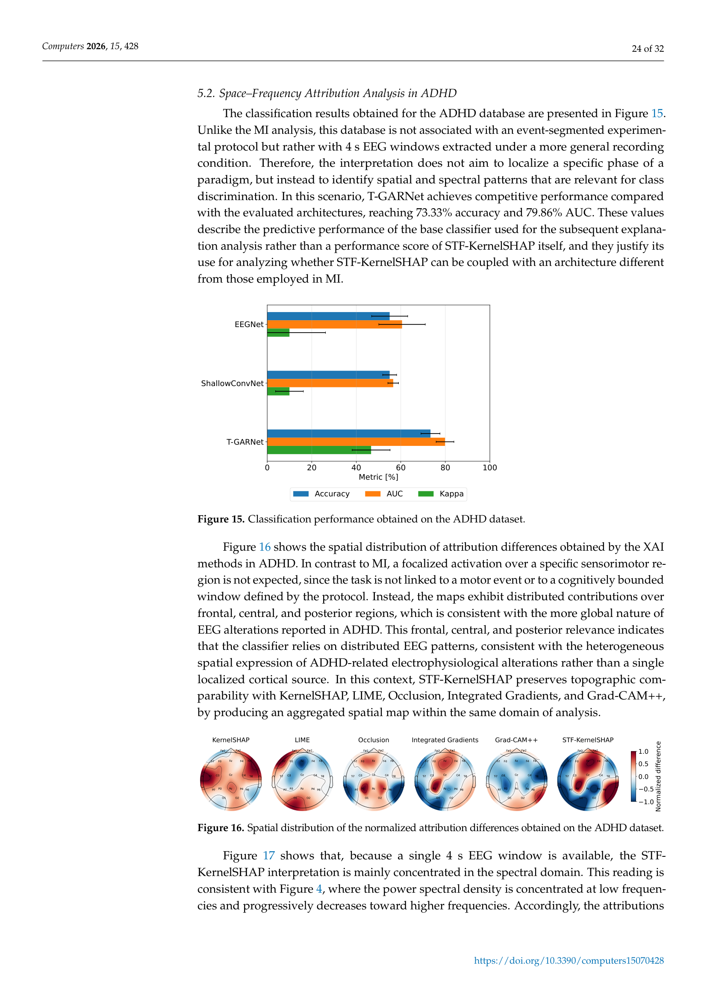

### Extraction assessment
- **Confidence:** 0.75 (below the configured 0.85 threshold; human review required).
- Embedded images require visual review; captions remain page-level text evidence only.

### Raw extracted text
```
Computers 2026, 15, 428
24 of 32
5.2. Space–Frequency Attribution Analysis in ADHD
The classification results obtained for the ADHD database are presented in Figure 15.
Unlike the MI analysis, this database is not associated with an event-segmented experimen-
tal protocol but rather with 4 s EEG windows extracted under a more general recording
condition. Therefore, the interpretation does not aim to localize a specific phase of a
paradigm, but instead to identify spatial and spectral patterns that are relevant for class
discrimination. In this scenario, T-GARNet achieves competitive performance compared
with the evaluated architectures, reaching 73.33% accuracy and 79.86% AUC. These values
describe the predictive performance of the base classifier used for the subsequent explana-
tion analysis rather than a performance score of STF-KernelSHAP itself, and they justify its
use for analyzing whether STF-KernelSHAP can be coupled with an architecture different
from those employed in MI.
0
20
40
60
80
100
Metric [%]
EEGNet
ShallowConvNet
T-GARNet
Accuracy
AUC
Kappa
Figure 15. Classification performance obtained on the ADHD dataset.
Figure 16 shows the spatial distribution of attribution differences obtained by the XAI
methods in ADHD. In contrast to MI, a focalized activation over a specific sensorimotor re-
gion is not expected, since the task is not linked to a motor event or to a cognitively bounded
window defined by the protocol. Instead, the maps exhibit distributed contributions over
frontal, central, and posterior regions, which is consistent with the more global nature of
EEG alterations reported in ADHD. This frontal, central, and posterior relevance indicates
that the classifier relies on distributed EEG patterns, consistent with the heterogeneous
spatial expression of ADHD-related electrophysiological alterations rather than a single
localized cortical source. In this context, STF-KernelSHAP preserves topographic com-
parability with KernelSHAP, LIME, Occlusion, Integrated Gradients, and Grad-CAM++,
by producing an aggregated spatial map within the same domain of analysis.
Fp1
Fp2
F3
F4
C3
C4
P3
P4
O1
O2
F7
F8
T7
T8
P7
P8
Fz
Cz
Pz
KernelSHAP
Fp1
Fp2
F3
F4
C3
C4
P3
P4
O1
O2
F7
F8
T7
T8
P7
P8
Fz
Cz
Pz
LIME
Fp1
Fp2
F3
F4
C3
C4
P3
P4
O1
O2
F7
F8
T7
T8
P7
P8
Fz
Cz
Pz
Occlusion
Fp1
Fp2
F3
F4
C3
C4
P3
P4
O1
O2
F7
F8
T7
T8
P7
P8
Fz
Cz
Pz
Integrated Gradients
Fp1
Fp2
F3
F4
C3
C4
P3
P4
O1
O2
F7
F8
T7
T8
P7
P8
Fz
Cz
Pz
Grad-CAM++
Fp1
Fp2
F3
F4
C3
C4
P3
P4
O1
O2
F7
F8
T7
T8
P7
P8
Fz
Cz
Pz
STF-KernelSHAP
−1.0
−0.5
0.0
0.5
1.0
Normalized difference
Figure 16. Spatial distribution of the normalized attribution differences obtained on the ADHD dataset.
Figure 17 shows that, because a single 4 s EEG window is available, the STF-
KernelSHAP interpretation is mainly concentrated in the spectral domain. This reading is
consistent with Figure 4, where the power spectral density is concentrated at low frequen-
cies and progressively decreases toward higher frequencies. Accordingly, the attributions
https://doi.org/10.3390/computers15070428

```

### Textual figure-caption evidence
- Figure 15. Classification performance obtained on the ADHD dataset.
- Figure 16. Spatial distribution of the normalized attribution differences obtained on the ADHD dataset.
- Captions are page-level text evidence and are not associated with embedded images.

### Embedded images
- `page-024-image-001` — embedded image metadata: 731 × 731 px, xref 866; visual review required.
- `page-024-image-002` — embedded image metadata: 731 × 731 px, xref 867; visual review required.
- `page-024-image-003` — embedded image metadata: 731 × 731 px, xref 868; visual review required.
- `page-024-image-004` — embedded image metadata: 731 × 731 px, xref 869; visual review required.
- `page-024-image-005` — embedded image metadata: 731 × 731 px, xref 870; visual review required.
- `page-024-image-006` — embedded image metadata: 731 × 731 px, xref 871; visual review required.
- `page-024-image-007` — embedded image metadata: 56 × 595 px, xref 872; visual review required.

## Page 25
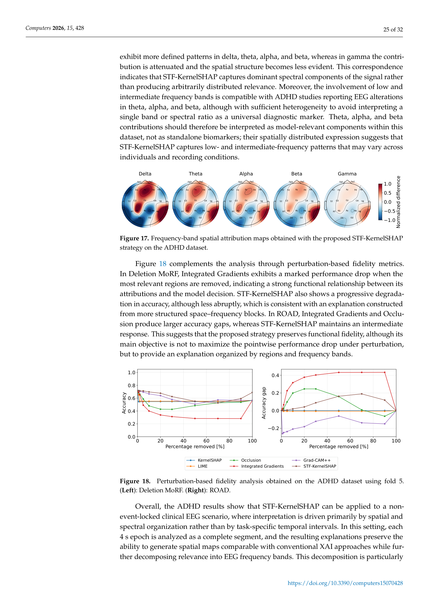

### Extraction assessment
- **Confidence:** 0.75 (below the configured 0.85 threshold; human review required).
- Embedded images require visual review; captions remain page-level text evidence only.

### Raw extracted text
```
Computers 2026, 15, 428
25 of 32
exhibit more defined patterns in delta, theta, alpha, and beta, whereas in gamma the contri-
bution is attenuated and the spatial structure becomes less evident. This correspondence
indicates that STF-KernelSHAP captures dominant spectral components of the signal rather
than producing arbitrarily distributed relevance. Moreover, the involvement of low and
intermediate frequency bands is compatible with ADHD studies reporting EEG alterations
in theta, alpha, and beta, although with sufficient heterogeneity to avoid interpreting a
single band or spectral ratio as a universal diagnostic marker. Theta, alpha, and beta
contributions should therefore be interpreted as model-relevant components within this
dataset, not as standalone biomarkers; their spatially distributed expression suggests that
STF-KernelSHAP captures low- and intermediate-frequency patterns that may vary across
individuals and recording conditions.
Fp1
Fp2
F3
F4
C3
C4
P3
P4
O1
O2
F7
F8
T7
T8
P7
P8
Fz
Cz
Pz
Delta
Fp1
Fp2
F3
F4
C3
C4
P3
P4
O1
O2
F7
F8
T7
T8
P7
P8
Fz
Cz
Pz
Theta
Fp1
Fp2
F3
F4
C3
C4
P3
P4
O1
O2
F7
F8
T7
T8
P7
P8
Fz
Cz
Pz
Alpha
Fp1
Fp2
F3
F4
C3
C4
P3
P4
O1
O2
F7
F8
T7
T8
P7
P8
Fz
Cz
Pz
Beta
Fp1
Fp2
F3
F4
C3
C4
P3
P4
O1
O2
F7
F8
T7
T8
P7
P8
Fz
Cz
Pz
Gamma
−1.0
−0.5
0.0
0.5
1.0
Normalized difference
Figure 17. Frequency-band spatial attribution maps obtained with the proposed STF-KernelSHAP
strategy on the ADHD dataset.
Figure 18 complements the analysis through perturbation-based fidelity metrics.
In Deletion MoRF, Integrated Gradients exhibits a marked performance drop when the
most relevant regions are removed, indicating a strong functional relationship between its
attributions and the model decision. STF-KernelSHAP also shows a progressive degrada-
tion in accuracy, although less abruptly, which is consistent with an explanation constructed
from more structured space–frequency blocks. In ROAD, Integrated Gradients and Occlu-
sion produce larger accuracy gaps, whereas STF-KernelSHAP maintains an intermediate
response. This suggests that the proposed strategy preserves functional fidelity, although its
main objective is not to maximize the pointwise performance drop under perturbation,
but to provide an explanation organized by regions and frequency bands.
0
20
40
60
80
100
Percentage removed [%]
0.0
0.2
0.4
0.6
0.8
1.0
Accuracy
0
20
40
60
80
100
Percentage removed [%]
−0.2
0.0
0.2
0.4
Accuracy gap
KernelSHAP
LIME
Occlusion
Integrated Gradients
Grad-CAM++
STF-KernelSHAP
Figure 18.
Perturbation-based fidelity analysis obtained on the ADHD dataset using fold 5.
(Left): Deletion MoRF. (Right): ROAD.
Overall, the ADHD results show that STF-KernelSHAP can be applied to a non-
event-locked clinical EEG scenario, where interpretation is driven primarily by spatial and
spectral organization rather than by task-specific temporal intervals. In this setting, each
4 s epoch is analyzed as a complete segment, and the resulting explanations preserve the
ability to generate spatial maps comparable with conventional XAI approaches while fur-
ther decomposing relevance into EEG frequency bands. This decomposition is particularly
https://doi.org/10.3390/computers15070428

```

### Textual figure-caption evidence
- Figure 17. Frequency-band spatial attribution maps obtained with the proposed STF-KernelSHAP
- Captions are page-level text evidence and are not associated with embedded images.

### Embedded images
- `page-025-image-001` — embedded image metadata: 745 × 745 px, xref 902; visual review required.
- `page-025-image-002` — embedded image metadata: 745 × 745 px, xref 903; visual review required.
- `page-025-image-003` — embedded image metadata: 745 × 745 px, xref 904; visual review required.
- `page-025-image-004` — embedded image metadata: 745 × 745 px, xref 905; visual review required.
- `page-025-image-005` — embedded image metadata: 745 × 745 px, xref 906; visual review required.
- `page-025-image-006` — embedded image metadata: 56 × 576 px, xref 907; visual review required.

## Page 26
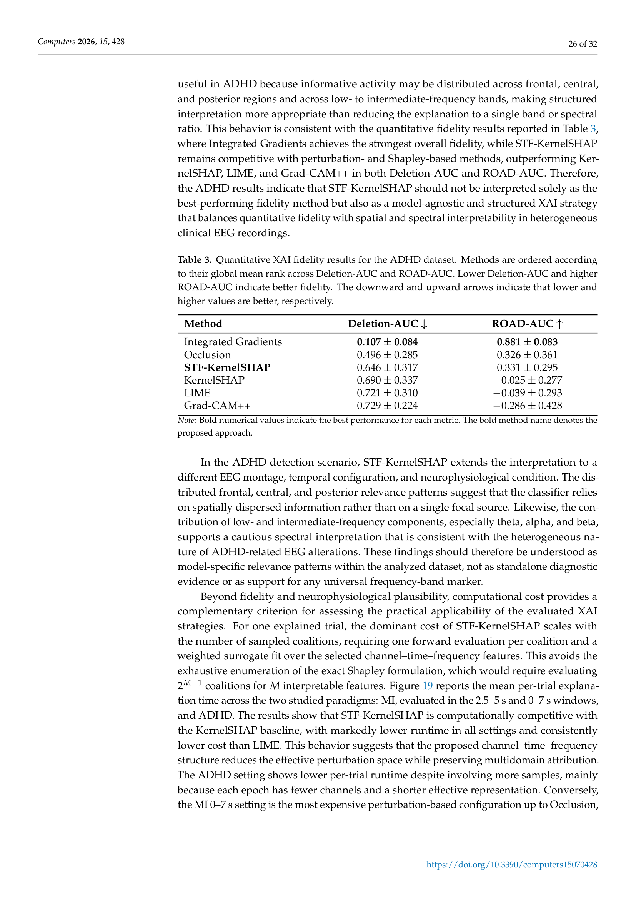

### Extraction assessment
- **Confidence:** 0.65 (below the configured 0.85 threshold; human review required).
- One or more equation candidates are ambiguous in raw extraction.

### Raw extracted text
```
Computers 2026, 15, 428
26 of 32
useful in ADHD because informative activity may be distributed across frontal, central,
and posterior regions and across low- to intermediate-frequency bands, making structured
interpretation more appropriate than reducing the explanation to a single band or spectral
ratio. This behavior is consistent with the quantitative fidelity results reported in Table 3,
where Integrated Gradients achieves the strongest overall fidelity, while STF-KernelSHAP
remains competitive with perturbation- and Shapley-based methods, outperforming Ker-
nelSHAP, LIME, and Grad-CAM++ in both Deletion-AUC and ROAD-AUC. Therefore,
the ADHD results indicate that STF-KernelSHAP should not be interpreted solely as the
best-performing fidelity method but also as a model-agnostic and structured XAI strategy
that balances quantitative fidelity with spatial and spectral interpretability in heterogeneous
clinical EEG recordings.
Table 3. Quantitative XAI fidelity results for the ADHD dataset. Methods are ordered according
to their global mean rank across Deletion-AUC and ROAD-AUC. Lower Deletion-AUC and higher
ROAD-AUC indicate better fidelity. The downward and upward arrows indicate that lower and
higher values are better, respectively.
Method
Deletion-AUC ↓
ROAD-AUC ↑
Integrated Gradients
0.107 ± 0.084
0.881 ± 0.083
Occlusion
0.496 ± 0.285
0.326 ± 0.361
STF-KernelSHAP
0.646 ± 0.317
0.331 ± 0.295
KernelSHAP
0.690 ± 0.337
−0.025 ± 0.277
LIME
0.721 ± 0.310
−0.039 ± 0.293
Grad-CAM++
0.729 ± 0.224
−0.286 ± 0.428
Note: Bold numerical values indicate the best performance for each metric. The bold method name denotes the
proposed approach.
In the ADHD detection scenario, STF-KernelSHAP extends the interpretation to a
different EEG montage, temporal configuration, and neurophysiological condition. The dis-
tributed frontal, central, and posterior relevance patterns suggest that the classifier relies
on spatially dispersed information rather than on a single focal source. Likewise, the con-
tribution of low- and intermediate-frequency components, especially theta, alpha, and beta,
supports a cautious spectral interpretation that is consistent with the heterogeneous na-
ture of ADHD-related EEG alterations. These findings should therefore be understood as
model-specific relevance patterns within the analyzed dataset, not as standalone diagnostic
evidence or as support for any universal frequency-band marker.
Beyond fidelity and neurophysiological plausibility, computational cost provides a
complementary criterion for assessing the practical applicability of the evaluated XAI
strategies. For one explained trial, the dominant cost of STF-KernelSHAP scales with
the number of sampled coalitions, requiring one forward evaluation per coalition and a
weighted surrogate fit over the selected channel–time–frequency features. This avoids the
exhaustive enumeration of the exact Shapley formulation, which would require evaluating
2M−1 coalitions for M interpretable features. Figure 19 reports the mean per-trial explana-
tion time across the two studied paradigms: MI, evaluated in the 2.5–5 s and 0–7 s windows,
and ADHD. The results show that STF-KernelSHAP is computationally competitive with
the KernelSHAP baseline, with markedly lower runtime in all settings and consistently
lower cost than LIME. This behavior suggests that the proposed channel–time–frequency
structure reduces the effective perturbation space while preserving multidomain attribution.
The ADHD setting shows lower per-trial runtime despite involving more samples, mainly
because each epoch has fewer channels and a shorter effective representation. Conversely,
the MI 0–7 s setting is the most expensive perturbation-based configuration up to Occlusion,
https://doi.org/10.3390/computers15070428

```

### Equation candidates
- `page-026-equation-001` — review_required (confidence 0.45; page 26).
```
0.107 ± 0.084
```
- `page-026-equation-002` — review_required (confidence 0.45; page 26).
```
0.881 ± 0.083
```
- `page-026-equation-003` — review_required (confidence 0.45; page 26).
```
0.496 ± 0.285
```
- `page-026-equation-004` — review_required (confidence 0.45; page 26).
```
0.326 ± 0.361
```
- `page-026-equation-005` — review_required (confidence 0.45; page 26).
```
0.646 ± 0.317
```
- `page-026-equation-006` — review_required (confidence 0.45; page 26).
```
0.331 ± 0.295
```
- `page-026-equation-007` — review_required (confidence 0.45; page 26).
```
0.690 ± 0.337
```
- `page-026-equation-008` — review_required (confidence 0.45; page 26).
```
−0.025 ± 0.277
```
- `page-026-equation-009` — review_required (confidence 0.45; page 26).
```
0.721 ± 0.310
```
- `page-026-equation-010` — review_required (confidence 0.45; page 26).
```
−0.039 ± 0.293
```
- `page-026-equation-011` — review_required (confidence 0.45; page 26).
```
0.729 ± 0.224
```
- `page-026-equation-012` — review_required (confidence 0.45; page 26).
```
−0.286 ± 0.428
```

## Page 27
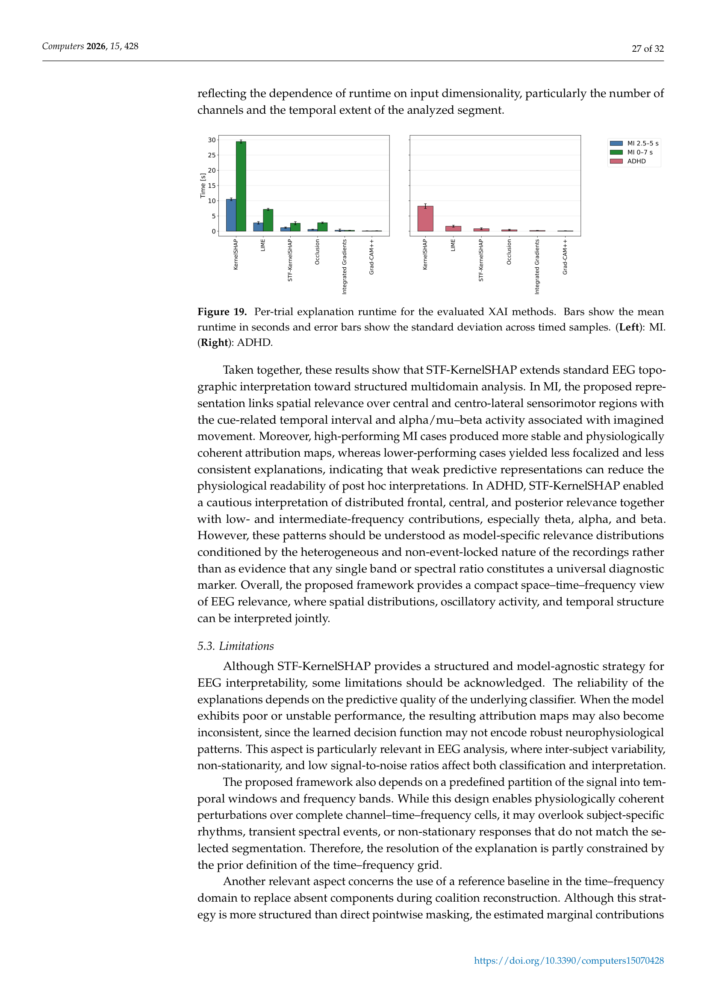

### Extraction assessment
- **Confidence:** 0.95 (meets the configured threshold).
- Machine-readable text was preserved with page-image provenance.

### Raw extracted text
```
Computers 2026, 15, 428
27 of 32
reflecting the dependence of runtime on input dimensionality, particularly the number of
channels and the temporal extent of the analyzed segment.
KernelSHAP
LIME
STF-KernelSHAP
Occlusion
Integrated Gradients
Grad-CAM++
0
5
10
15
20
25
30
Time [s]
KernelSHAP
LIME
STF-KernelSHAP
Occlusion
Integrated Gradients
Grad-CAM++
MI 2.5 5 s
MI 0 7 s
ADHD
Figure 19. Per-trial explanation runtime for the evaluated XAI methods. Bars show the mean
runtime in seconds and error bars show the standard deviation across timed samples. (Left): MI.
(Right): ADHD.
Taken together, these results show that STF-KernelSHAP extends standard EEG topo-
graphic interpretation toward structured multidomain analysis. In MI, the proposed repre-
sentation links spatial relevance over central and centro-lateral sensorimotor regions with
the cue-related temporal interval and alpha/mu–beta activity associated with imagined
movement. Moreover, high-performing MI cases produced more stable and physiologically
coherent attribution maps, whereas lower-performing cases yielded less focalized and less
consistent explanations, indicating that weak predictive representations can reduce the
physiological readability of post hoc interpretations. In ADHD, STF-KernelSHAP enabled
a cautious interpretation of distributed frontal, central, and posterior relevance together
with low- and intermediate-frequency contributions, especially theta, alpha, and beta.
However, these patterns should be understood as model-specific relevance distributions
conditioned by the heterogeneous and non-event-locked nature of the recordings rather
than as evidence that any single band or spectral ratio constitutes a universal diagnostic
marker. Overall, the proposed framework provides a compact space–time–frequency view
of EEG relevance, where spatial distributions, oscillatory activity, and temporal structure
can be interpreted jointly.
5.3. Limitations
Although STF-KernelSHAP provides a structured and model-agnostic strategy for
EEG interpretability, some limitations should be acknowledged. The reliability of the
explanations depends on the predictive quality of the underlying classifier. When the model
exhibits poor or unstable performance, the resulting attribution maps may also become
inconsistent, since the learned decision function may not encode robust neurophysiological
patterns. This aspect is particularly relevant in EEG analysis, where inter-subject variability,
non-stationarity, and low signal-to-noise ratios affect both classification and interpretation.
The proposed framework also depends on a predefined partition of the signal into tem-
poral windows and frequency bands. While this design enables physiologically coherent
perturbations over complete channel–time–frequency cells, it may overlook subject-specific
rhythms, transient spectral events, or non-stationary responses that do not match the se-
lected segmentation. Therefore, the resolution of the explanation is partly constrained by
the prior definition of the time–frequency grid.
Another relevant aspect concerns the use of a reference baseline in the time–frequency
domain to replace absent components during coalition reconstruction. Although this strat-
egy is more structured than direct pointwise masking, the estimated marginal contributions
https://doi.org/10.3390/computers15070428

```

### Textual figure-caption evidence
- Figure 19. Per-trial explanation runtime for the evaluated XAI methods. Bars show the mean
- Captions are page-level text evidence and are not associated with embedded images.

## Page 28
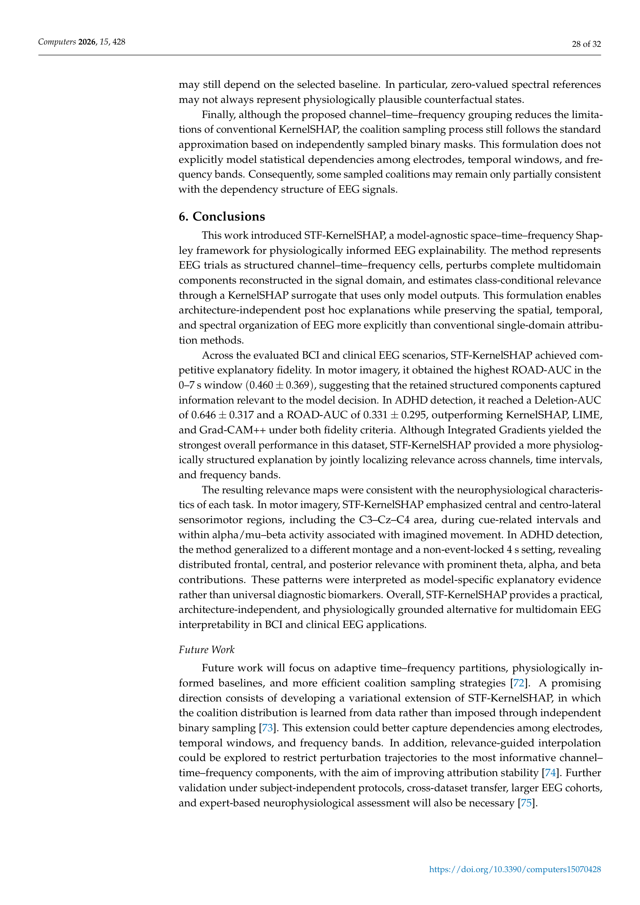

### Extraction assessment
- **Confidence:** 0.65 (below the configured 0.85 threshold; human review required).
- One or more equation candidates are ambiguous in raw extraction.

### Raw extracted text
```
Computers 2026, 15, 428
28 of 32
may still depend on the selected baseline. In particular, zero-valued spectral references
may not always represent physiologically plausible counterfactual states.
Finally, although the proposed channel–time–frequency grouping reduces the limita-
tions of conventional KernelSHAP, the coalition sampling process still follows the standard
approximation based on independently sampled binary masks. This formulation does not
explicitly model statistical dependencies among electrodes, temporal windows, and fre-
quency bands. Consequently, some sampled coalitions may remain only partially consistent
with the dependency structure of EEG signals.
6. Conclusions
This work introduced STF-KernelSHAP, a model-agnostic space–time–frequency Shap-
ley framework for physiologically informed EEG explainability. The method represents
EEG trials as structured channel–time–frequency cells, perturbs complete multidomain
components reconstructed in the signal domain, and estimates class-conditional relevance
through a KernelSHAP surrogate that uses only model outputs. This formulation enables
architecture-independent post hoc explanations while preserving the spatial, temporal,
and spectral organization of EEG more explicitly than conventional single-domain attribu-
tion methods.
Across the evaluated BCI and clinical EEG scenarios, STF-KernelSHAP achieved com-
petitive explanatory fidelity. In motor imagery, it obtained the highest ROAD-AUC in the
0–7 s window (0.460 ± 0.369), suggesting that the retained structured components captured
information relevant to the model decision. In ADHD detection, it reached a Deletion-AUC
of 0.646 ± 0.317 and a ROAD-AUC of 0.331 ± 0.295, outperforming KernelSHAP, LIME,
and Grad-CAM++ under both fidelity criteria. Although Integrated Gradients yielded the
strongest overall performance in this dataset, STF-KernelSHAP provided a more physiolog-
ically structured explanation by jointly localizing relevance across channels, time intervals,
and frequency bands.
The resulting relevance maps were consistent with the neurophysiological characteris-
tics of each task. In motor imagery, STF-KernelSHAP emphasized central and centro-lateral
sensorimotor regions, including the C3–Cz–C4 area, during cue-related intervals and
within alpha/mu–beta activity associated with imagined movement. In ADHD detection,
the method generalized to a different montage and a non-event-locked 4 s setting, revealing
distributed frontal, central, and posterior relevance with prominent theta, alpha, and beta
contributions. These patterns were interpreted as model-specific explanatory evidence
rather than universal diagnostic biomarkers. Overall, STF-KernelSHAP provides a practical,
architecture-independent, and physiologically grounded alternative for multidomain EEG
interpretability in BCI and clinical EEG applications.
Future Work
Future work will focus on adaptive time–frequency partitions, physiologically in-
formed baselines, and more efficient coalition sampling strategies [72]. A promising
direction consists of developing a variational extension of STF-KernelSHAP, in which
the coalition distribution is learned from data rather than imposed through independent
binary sampling [73]. This extension could better capture dependencies among electrodes,
temporal windows, and frequency bands. In addition, relevance-guided interpolation
could be explored to restrict perturbation trajectories to the most informative channel–
time–frequency components, with the aim of improving attribution stability [74]. Further
validation under subject-independent protocols, cross-dataset transfer, larger EEG cohorts,
and expert-based neurophysiological assessment will also be necessary [75].
https://doi.org/10.3390/computers15070428

```

### Equation candidates
- `page-028-equation-001` — review_required (confidence 0.45; page 28).
```
0–7 s window (0.460 ± 0.369), suggesting that the retained structured components captured
```
- `page-028-equation-002` — review_required (confidence 0.45; page 28).
```
of 0.646 ± 0.317 and a ROAD-AUC of 0.331 ± 0.295, outperforming KernelSHAP, LIME,
```

## Page 29
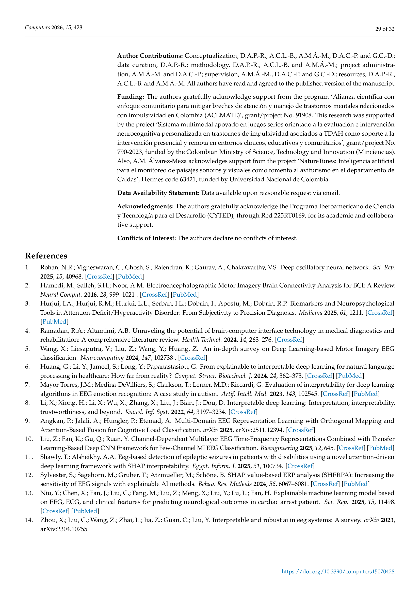

### Extraction assessment
- **Confidence:** 0.95 (meets the configured threshold).
- Machine-readable text was preserved with page-image provenance.

### Raw extracted text
```
Computers 2026, 15, 428
29 of 32
Author Contributions: Conceptualization, D.A.P.-R., A.C.L.-B., A.M.Á.-M., D.A.C.-P. and G.C.-D.;
data curation, D.A.P.-R.; methodology, D.A.P.-R., A.C.L.-B. and A.M.Á.-M.; project administra-
tion, A.M.Á.-M. and D.A.C.-P.; supervision, A.M.Á.-M., D.A.C.-P. and G.C.-D.; resources, D.A.P.-R.,
A.C.L.-B. and A.M.Á.-M. All authors have read and agreed to the published version of the manuscript.
Funding: The authors gratefully acknowledge support from the program ‘Alianza científica con
enfoque comunitario para mitigar brechas de atención y manejo de trastornos mentales relacionados
con impulsividad en Colombia (ACEMATE)’, grant/project No. 91908. This research was supported
by the project ‘Sistema multimodal apoyado en juegos serios orientado a la evaluación e intervención
neurocognitiva personalizada en trastornos de impulsividad asociados a TDAH como soporte a la
intervención presencial y remota en entornos clínicos, educativos y comunitarios’, grant/project No.
790-2023, funded by the Colombian Ministry of Science, Technology and Innovation (Minciencias).
Also, A.M. Álvarez-Meza acknowledges support from the project ‘NatureTunes: Inteligencia artificial
para el monitoreo de paisajes sonoros y visuales como fomento al aviturismo en el departamento de
Caldas’, Hermes code 63421, funded by Universidad Nacional de Colombia.
Data Availability Statement: Data available upon reasonable request via email.
Acknowledgments: The authors gratefully acknowledge the Programa Iberoamericano de Ciencia
y Tecnología para el Desarrollo (CYTED), through Red 225RT0169, for its academic and collabora-
tive support.
Conflicts of Interest: The authors declare no conflicts of interest.
References
1.
Rohan, N.R.; Vigneswaran, C.; Ghosh, S.; Rajendran, K.; Gaurav, A.; Chakravarthy, V.S. Deep oscillatory neural network. Sci. Rep.
2025, 15, 40968. [CrossRef] [PubMed]
2.
Hamedi, M.; Salleh, S.H.; Noor, A.M. Electroencephalographic Motor Imagery Brain Connectivity Analysis for BCI: A Review.
Neural Comput. 2016, 28, 999–1021 . [CrossRef] [PubMed]
3.
Hurjui, I.A.; Hurjui, R.M.; Hurjui, L.L.; Serban, I.L.; Dobrin, I.; Apostu, M.; Dobrin, R.P. Biomarkers and Neuropsychological
Tools in Attention-Deficit/Hyperactivity Disorder: From Subjectivity to Precision Diagnosis. Medicina 2025, 61, 1211. [CrossRef]
[PubMed]
4.
Ramadan, R.A.; Altamimi, A.B. Unraveling the potential of brain-computer interface technology in medical diagnostics and
rehabilitation: A comprehensive literature review. Health Technol. 2024, 14, 263–276. [CrossRef]
5.
Wang, X.; Liesaputra, V.; Liu, Z.; Wang, Y.; Huang, Z. An in-depth survey on Deep Learning-based Motor Imagery EEG
classification. Neurocomputing 2024, 147, 102738 . [CrossRef]
6.
Huang, G.; Li, Y.; Jameel, S.; Long, Y.; Papanastasiou, G. From explainable to interpretable deep learning for natural language
processing in healthcare: How far from reality? Comput. Struct. Biotechnol. J. 2024, 24, 362–373. [CrossRef] [PubMed]
7.
Mayor Torres, J.M.; Medina-DeVilliers, S.; Clarkson, T.; Lerner, M.D.; Riccardi, G. Evaluation of interpretability for deep learning
algorithms in EEG emotion recognition: A case study in autism. Artif. Intell. Med. 2023, 143, 102545. [CrossRef] [PubMed]
8.
Li, X.; Xiong, H.; Li, X.; Wu, X.; Zhang, X.; Liu, J.; Bian, J.; Dou, D. Interpretable deep learning: Interpretation, interpretability,
trustworthiness, and beyond. Knowl. Inf. Syst. 2022, 64, 3197–3234. [CrossRef]
9.
Angkan, P.; Jalali, A.; Hungler, P.; Etemad, A. Multi-Domain EEG Representation Learning with Orthogonal Mapping and
Attention-Based Fusion for Cognitive Load Classification. arXiv 2025, arXiv:2511.12394. [CrossRef]
10.
Liu, Z.; Fan, K.; Gu, Q.; Ruan, Y. Channel-Dependent Multilayer EEG Time-Frequency Representations Combined with Transfer
Learning-Based Deep CNN Framework for Few-Channel MI EEG Classification. Bioengineering 2025, 12, 645. [CrossRef] [PubMed]
11.
Shawly, T.; Alsheikhy, A.A. Eeg-based detection of epileptic seizures in patients with disabilities using a novel attention-driven
deep learning framework with SHAP interpretability. Egypt. Inform. J. 2025, 31, 100734. [CrossRef]
12.
Sylvester, S.; Sagehorn, M.; Gruber, T.; Atzmueller, M.; Schöne, B. SHAP value-based ERP analysis (SHERPA): Increasing the
sensitivity of EEG signals with explainable AI methods. Behav. Res. Methods 2024, 56, 6067–6081. [CrossRef] [PubMed]
13.
Niu, Y.; Chen, X.; Fan, J.; Liu, C.; Fang, M.; Liu, Z.; Meng, X.; Liu, Y.; Lu, L.; Fan, H. Explainable machine learning model based
on EEG, ECG, and clinical features for predicting neurological outcomes in cardiac arrest patient. Sci. Rep. 2025, 15, 11498.
[CrossRef] [PubMed]
14.
Zhou, X.; Liu, C.; Wang, Z.; Zhai, L.; Jia, Z.; Guan, C.; Liu, Y. Interpretable and robust ai in eeg systems: A survey. arXiv 2023,
arXiv:2304.10755.
https://doi.org/10.3390/computers15070428

```

## Page 30


### Extraction assessment
- **Confidence:** 0.95 (meets the configured threshold).
- Machine-readable text was preserved with page-image provenance.

### Raw extracted text
```
Computers 2026, 15, 428
30 of 32
15.
Raab, D.; Theissler, A.; Spiliopoulou, M. XAI4EEG: Spectral and spatio-temporal explanation of deep learning-based seizure
detection in EEG time series. Neural Comput. Appl. 2023, 35, 10051–10068.
16.
Hasi´c, V.; Halilovi´c, A.; Krivi´c, S. Superpixel Correlation for Explainable Image Classification; Springer: Cham, Switzerland , 2025;
pp. 27–44. [CrossRef]
17.
Gallego-Molina, N.J.; Ortiz, A.; Arco, J.E.; Martinez-Murcia, F.J.; Woo, W.L. Unraveling brain synchronisation dynamics by
explainable neural networks using EEG signals: Application to dyslexia diagnosis. Interdiscip. Sci. Comput. Life Sci. 2024,
16, 1005–1018. [CrossRef]
18.
Presacan, O.; Ojha, J.; Yazidi, A.; Monteiro, E.; Lind, P.G. A Comprehensive Review of Explainable AI in Deep Learning
Algorithms for EEG Analysis. Acm Trans. Comput. Healthc. 2025, 7, 1–28. [CrossRef]
19.
Ma, W.; Zheng, Y.; Li, T.; Li, Z.; Li, Y.; Wang, L. A comprehensive review of deep learning in EEG-based emotion recognition:
Classifications, trends, and practical implications. PeerJ Comput. Sci. 2024, 10, e2065. [CrossRef] [PubMed]
20.
Zhang, S.; Zhu, Z.; Zhang, B.; Feng, B.; Yu, T.; Li, Z.; Zhang, Z.; Huang, G.; Liang, Z. Overall optimization of CSP based on
ensemble learning for motor imagery EEG decoding. Biomed. Signal Process. Control 2022, 77, 103825. [CrossRef]
21.
Elashmawi, W.H.; Ayman, A.; Antoun, M.; Mohamed, H.; Mohamed, S.E.; Amr, H.; Talaat, Y.; Ali, A. A Comprehensive Review
on Brain–Computer Interface (BCI)-Based Machine and Deep Learning Algorithms for Stroke Rehabilitation. Appl. Sci. 2024, 14,
6347. [CrossRef]
22.
Hekmatmanesh, A.; Nardelli, P.H.; Handroos, H. Review of the state-of-the-art of brain-controlled vehicles. IEEE Access 2021,
9, 110173–110193.
23.
Hekmatmanesh, A.; Wu, H.; Li, M.; Handroos, H. A combined projection for remote control of a vehicle based on movement
imagination: A single trial brain computer interface study. IEEE Access 2022, 10, 6165–6174. [CrossRef]
24.
Miao, Y.; Jin, J.; Daly, I.; Zuo, C.; Wang, X.; Cichocki, A.; Jung, T.P. Learning Common Time-Frequency-Spatial Patterns for Motor
Imagery Classification. IEEE Trans. Neural Syst. Rehabil. Eng. 2021, 29, 699–707 . [CrossRef] [PubMed]
25.
Liang, W.; Jin, J.; Xu, R.; Wang, X.; Cichocki, A. Variance characteristic preserving common spatial pattern for motor imagery BCI.
Front. Hum. Neurosci. 2023, 17, 1243750. [CrossRef] [PubMed]
26.
Saha, P.K.; Rahman, M.A.; Alam, M.K.; Ferdowsi, A.; Mollah, M.N. Common spatial pattern in frequency domain for feature
extraction and classification of multichannel EEG signals. SN Comput. Sci. 2021, 2, 149. [CrossRef]
27.
Hekmatmanesh, A.; Wu, H.; Jamaloo, F.; Li, M.; Handroos, H. A combination of CSP-based method with soft margin SVM
classifier and generalized RBF kernel for imagery-based brain computer interface applications. Multimed. Tools Appl. 2020,
79, 17521–17549. [CrossRef]
28.
Liu, K.; Yang, M.; Yu, Z.; Wang, G.; Wu, W. FBMSNet: A filter-bank multi-scale convolutional neural network for EEG-based
motor imagery decoding. IEEE Trans. Biomed. Eng. 2022, 70, 436–445.
29.
Hong, X.; Du, C.; He, H. Adaptive Domain Alignment Neural Networks for Cross-Domain EEG Emotion Recognition. IEEE
Trans. Affect. Comput. 2024, 16, 903–914. [CrossRef]
30.
Lawhern, V.J.; Solon, A.J.; Waytowich, N.R.; Gordon, S.M.; Hung, C.P.; Lance, B.J. EEGNet: A compact convolutional neural
network for EEG-based brain–computer interfaces. J. Neural Eng. 2018, 15, 056013. [CrossRef] [PubMed]
31.
Kim, S.J.; Lee, D.H.; Lee, S.W. Rethinking CNN Architecture for Enhancing Decoding Performance of Motor Imagery-based EEG
Signals. IEEE Access 2022, 10, 96984–96996. [CrossRef]
32.
Tobón-Henao, M.; Álvarez Meza, A.M.; Castellanos-Dominguez, C.G. Kernel-Based Regularized EEGNet Using Centered
Alignment and Gaussian Connectivity for Motor Imagery Discrimination. Computers 2023, 12, 145. [CrossRef]
33.
Luo, J.; Wang, Y.; Xia, S.; Lu, N.; Ren, X.; Shi, Z.; Hei, X. A shallow mirror transformer for subject-independent motor imagery
BCI. Comput. Biol. Med. 2023, 164, 107254. [CrossRef] [PubMed]
34.
Xiao, T.; Wang, Z.; Zhang, Y.; Wang, S.; Feng, H.; Zhao, Y. Self-supervised learning with attention mechanism for EEG-based
seizure detection. Biomed. Signal Process. Control 2024, 87, 105464. [CrossRef]
35.
Xie, J.; Zhang, J.; Sun, J.; Ma, Z.; Qin, L.; Li, G.; Zhou, H.; Zhan, Y. A transformer-based approach combining deep learning
network and spatial-temporal information for raw EEG classification. IEEE Trans. Neural Syst. Rehabil. Eng. 2022, 30, 2126–2136.
[CrossRef] [PubMed]
36.
Liao, L.; Lu, J.; Wang, L.; Zhang, Y.; Gao, D.; Wang, M. CT-Net: An interpretable CNN-Transformer fusion network for fNIRS
classification. Med Biol. Eng. Comput. 2024, 62, 3233–3247. [CrossRef] [PubMed]
37.
Mirzaei, S.; Ghasemi, P. EEG motor imagery classification using dynamic connectivity patterns and convolutional autoencoder.
Biomed. Signal Process. Control 2021, 68, 102584. [CrossRef]
38.
Khare, S.K.; Acharya, U.R. An explainable and interpretable model for attention deficit hyperactivity disorder in children using
EEG signals. Comput. Biol. Med. 2023, 155, 106676. [CrossRef] [PubMed]
39.
Rahman, A.U.; Tubaishat, A.; Al-Obeidat, F.; Halim, Z.; Tahir, M.; Qayum, F. Extended ICA and M-CSP with BiLSTM towards
improved classification of EEG signals. Soft Comput. 2022, 26, 10687–10698. [CrossRef]
https://doi.org/10.3390/computers15070428

```

## Page 31
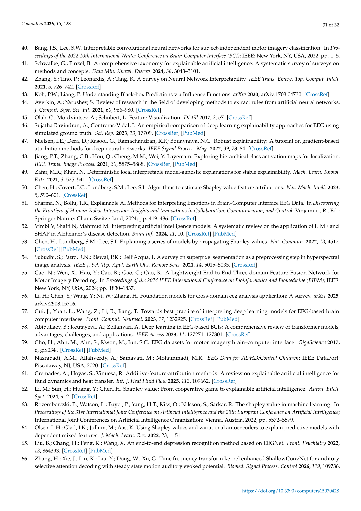

### Extraction assessment
- **Confidence:** 0.95 (meets the configured threshold).
- Machine-readable text was preserved with page-image provenance.

### Raw extracted text
```
Computers 2026, 15, 428
31 of 32
40.
Bang, J.S.; Lee, S.W. Interpretable convolutional neural networks for subject-independent motor imagery classification. In Pro-
ceedings of the 2022 10th International Winter Conference on Brain-Computer Interface (BCI); IEEE: New York, NY, USA, 2022; pp. 1–5.
41.
Schwalbe, G.; Finzel, B. A comprehensive taxonomy for explainable artificial intelligence: A systematic survey of surveys on
methods and concepts. Data Min. Knowl. Discov. 2024, 38, 3043–3101.
42.
Zhang, Y.; Tino, P.; Leonardis, A.; Tang, K. A Survey on Neural Network Interpretability. IEEE Trans. Emerg. Top. Comput. Intell.
2021, 5, 726–742. [CrossRef]
43.
Koh, P.W.; Liang, P. Understanding Black-box Predictions via Influence Functions. arXiv 2020, arXiv:1703.04730. [CrossRef]
44.
Averkin, A.; Yarushev, S. Review of research in the field of developing methods to extract rules from artificial neural networks.
J. Comput. Syst. Sci. Int. 2021, 60, 966–980. [CrossRef]
45.
Olah, C.; Mordvintsev, A.; Schubert, L. Feature Visualization. Distill 2017, 2, e7. [CrossRef]
46.
Sujatha Ravindran, A.; Contreras-Vidal, J. An empirical comparison of deep learning explainability approaches for EEG using
simulated ground truth. Sci. Rep. 2023, 13, 17709. [CrossRef] [PubMed]
47.
Nielsen, I.E.; Dera, D.; Rasool, G.; Ramachandran, R.P.; Bouaynaya, N.C. Robust explainability: A tutorial on gradient-based
attribution methods for deep neural networks. IEEE Signal Process. Mag. 2022, 39, 73–84. [CrossRef]
48.
Jiang, P.T.; Zhang, C.B.; Hou, Q.; Cheng, M.M.; Wei, Y. Layercam: Exploring hierarchical class activation maps for localization.
IEEE Trans. Image Process. 2021, 30, 5875–5888. [CrossRef] [PubMed]
49.
Zafar, M.R.; Khan, N. Deterministic local interpretable model-agnostic explanations for stable explainability. Mach. Learn. Knowl.
Extr. 2021, 3, 525–541. [CrossRef]
50.
Chen, H.; Covert, I.C.; Lundberg, S.M.; Lee, S.I. Algorithms to estimate Shapley value feature attributions. Nat. Mach. Intell. 2023,
5, 590–601. [CrossRef]
51.
Sharma, N.; Bollu, T.R., Explainable AI Methods for Interpreting Emotions in Brain–Computer Interface EEG Data. In Discovering
the Frontiers of Human-Robot Interaction: Insights and Innovations in Collaboration, Communication, and Control; Vinjamuri, R., Ed.;
Springer Nature: Cham, Switzerland, 2024; pp. 419–436. [CrossRef]
52.
Vimbi V, Shaffi N, Mahmud M. Interpreting artificial intelligence models: A systematic review on the application of LIME and
SHAP in Alzheimer’s disease detection. Brain Inf. 2024, 11, 10. [CrossRef] [PubMed]
53.
Chen, H.; Lundberg, S.M.; Lee, S.I. Explaining a series of models by propagating Shapley values. Nat. Commun. 2022, 13, 4512.
[CrossRef] [PubMed]
54.
Subudhi, S.; Patro, R.N.; Biswal, P.K.; Dell’Acqua, F. A survey on superpixel segmentation as a preprocessing step in hyperspectral
image analysis. IEEE J. Sel. Top. Appl. Earth Obs. Remote Sens. 2021, 14, 5015–5035. [CrossRef]
55.
Cao, N.; Wen, X.; Hao, Y.; Cao, R.; Gao, C.; Cao, R. A Lightweight End-to-End Three-domain Feature Fusion Network for
Motor Imagery Decoding. In Proceedings of the 2024 IEEE International Conference on Bioinformatics and Biomedicine (BIBM); IEEE:
New York, NY, USA, 2024; pp. 1830–1837.
56.
Li, H.; Chen, Y.; Wang, Y.; Ni, W.; Zhang, H. Foundation models for cross-domain eeg analysis application: A survey. arXiv 2025,
arXiv:2508.15716.
57.
Cui, J.; Yuan, L.; Wang, Z.; Li, R.; Jiang, T. Towards best practice of interpreting deep learning models for EEG-based brain
computer interfaces. Front. Comput. Neurosci. 2023, 17, 1232925. [CrossRef] [PubMed]
58.
Abibullaev, B.; Keutayeva, A.; Zollanvari, A. Deep learning in EEG-based BCIs: A comprehensive review of transformer models,
advantages, challenges, and applications. IEEE Access 2023, 11, 127271–127301. [CrossRef]
59.
Cho, H.; Ahn, M.; Ahn, S.; Kwon, M.; Jun, S.C. EEG datasets for motor imagery brain–computer interface. GigaScience 2017,
6, gix034 . [CrossRef] [PubMed]
60.
Nasrabadi, A.M.; Allahverdy, A.; Samavati, M.; Mohammadi, M.R. EEG Data for ADHD/Control Children; IEEE DataPort:
Piscataway, NJ, USA, 2020. [CrossRef]
61.
Cremades, A.; Hoyas, S.; Vinuesa, R. Additive-feature-attribution methods: A review on explainable artificial intelligence for
fluid dynamics and heat transfer. Int. J. Heat Fluid Flow 2025, 112, 109662. [CrossRef]
62.
Li, M.; Sun, H.; Huang, Y.; Chen, H. Shapley value: From cooperative game to explainable artificial intelligence. Auton. Intell.
Syst. 2024, 4, 2. [CrossRef]
63.
Rozemberczki, B.; Watson, L.; Bayer, P.; Yang, H.T.; Kiss, O.; Nilsson, S.; Sarkar, R. The shapley value in machine learning. In
Proceedings of the 31st International Joint Conference on Artificial Intelligence and the 25th European Conference on Artificial Intelligence;
International Joint Conferences on Artificial Intelligence Organization: Vienna, Austria, 2022; pp. 5572–5579.
64.
Olsen, L.H.; Glad, I.K.; Jullum, M.; Aas, K. Using Shapley values and variational autoencoders to explain predictive models with
dependent mixed features. J. Mach. Learn. Res. 2022, 23, 1–51.
65.
Liu, B.; Chang, H.; Peng, K.; Wang, X. An end-to-end depression recognition method based on EEGNet. Front. Psychiatry 2022,
13, 864393. [CrossRef] [PubMed]
66.
Zhang, H.; Xie, J.; Liu, K.; Liu, Y.; Dong, W.; Xu, G. Time frequency transform kernel enhanced ShallowConvNet for auditory
selective attention decoding with steady state motion auditory evoked potential. Biomed. Signal Process. Control 2026, 119, 109736.
https://doi.org/10.3390/computers15070428

```

## Page 32


### Extraction assessment
- **Confidence:** 0.95 (meets the configured threshold).
- Machine-readable text was preserved with page-image provenance.

### Raw extracted text
```
Computers 2026, 15, 428
32 of 32
67.
Salazar-Dubois, D.V.; Álvarez-Meza, A.M.; Castellanos-Dominguez, G. T-GARNet: A Transformer and Multi-Scale Gaussian
Kernel Connectivity Network with Alpha-Rényi Regularization for EEG-Based ADHD Detection. Mathematics 2025, 13, 4026.
[CrossRef]
68.
Roshan, K.; Zafar, A. Using kernel shap xai method to optimize the network anomaly detection model. In Proceedings of the
2022 9th International Conference on Computing for Sustainable Global Development (INDIACom); IEEE: New York, NY, USA, 2022;
pp. 74–80.
69.
Raptis, S.; Ilioudis, C.; Theodorou, K. From pixels to prognosis: Unveiling radiomics models with SHAP and LIME for enhanced
interpretability. Biomed. Phys. Eng. Express 2024, 10, 035016. [CrossRef]
70.
Lundstrom, D.D.; Huang, T.; Razaviyayn, M. A rigorous study of integrated gradients method and extensions to internal neuron
attributions. In Proceedings of the International Conference on Machine Learning; PMLR: Brookline, MA, USA, 2022; pp. 14485–14508.
71.
Tripathi, S.; Arya, N.; Kaur, S.; Gupta, T.; Gupta, E. Grad-CAM++ Enhanced Hybrid CNN-Random Forest Model for Accurate
and Transparent Brain Tumor Detection. In Proceedings of the 2025 5th International Conference on Intelligent Technologies (CONIT);
IEEE: New York, NY, USA, 2025; pp. 1–6.
72.
Saranya, S.; Menaka, R. An explainable machine learning network for classification of autism spectrum disorder using optimal
frequency band identification from brain EEG. IEEE Access 2025, 13, 32016–32030. [CrossRef]
73.
Xiao, C.; Dou, J.; Lin, Z.; Ke, Z.; Hou, L. From points to coalitions: Hierarchical contrastive shapley values for prioritizing
data samples. In Proceedings of the AAAI Conference on Artificial Intelligence; AAAI Press: Palo Alto, CA, USA, 2026; Volume 40,
pp. 15995–16003.
74.
Reuter, A.; Thielmann, A.; Saefken, B. Neural additive image model: Interpretation through interpolation.
arXiv 2024,
arXiv:2405.02295.
75.
Lasfar, R.; Tóth, G. The difference of model robustness assessment using cross-validation and bootstrap methods. J. Chemom.
2024, 38, e3530. [CrossRef]
Disclaimer/Publisher’s Note: The statements, opinions and data contained in all publications are solely those of the individual
author(s) and contributor(s) and not of MDPI and/or the editor(s). MDPI and/or the editor(s) disclaim responsibility for any injury to
people or property resulting from any ideas, methods, instructions or products referred to in the content.
https://doi.org/10.3390/computers15070428

```
