# mathematics-13-02602

## Source
- PDF: `/Users/diego/Desktop/Proyectos/papersmith-ai/guidance/reference-papers/source/mathematics-13-02602.pdf`
- Source SHA-256: `ad8e9ea9f966922bb14d4c0cd80dc17a0f9aaf9e2790e44a2223956884f723d2`
- Rendered pages: 29 at 200 DPI (PyMuPDF).
- Confidence threshold: 0.85.
- Table policy: lite evidence only. Possible tables are retained only as exact raw page text and rendered page images; no rows, columns, cells, or inferred values are extracted.
- Equation policy: equation candidates retain exact raw extracted text; this extractor does not synthesize LaTeX.

## Page 1
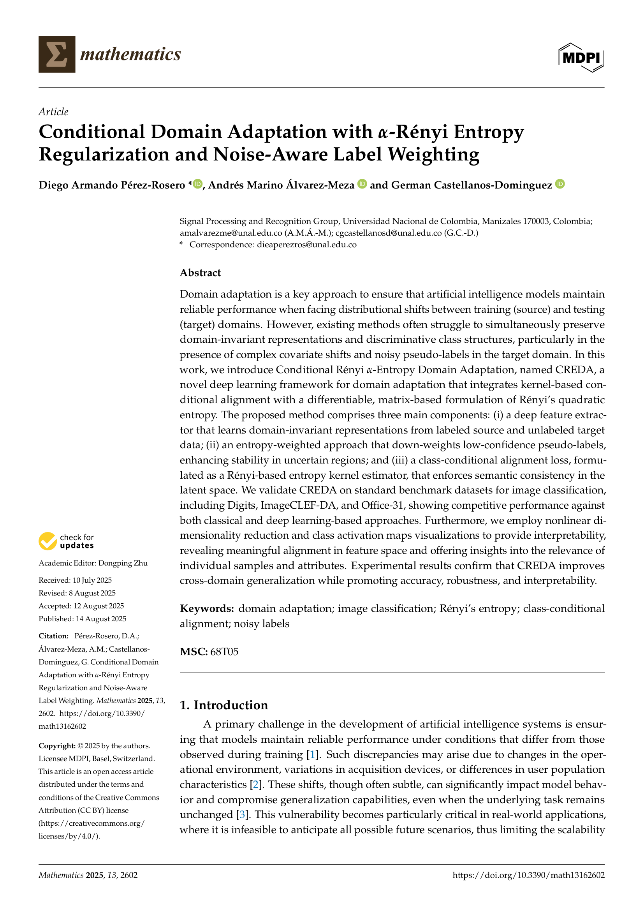

### Extraction assessment
- **Confidence:** 0.95 (meets the configured threshold).
- Machine-readable text was preserved with page-image provenance.

### Raw extracted text
```
Academic Editor: Dongping Zhu
Received: 10 July 2025
Revised: 8 August 2025
Accepted: 12 August 2025
Published: 14 August 2025
Citation: Pérez-Rosero, D.A.;
Álvarez-Meza, A.M.; Castellanos-
Dominguez, G. Conditional Domain
Adaptation with α-Rényi Entropy
Regularization and Noise-Aware
Label Weighting. Mathematics 2025, 13,
2602. https://doi.org/10.3390/
math13162602
Copyright: © 2025 by the authors.
Licensee MDPI, Basel, Switzerland.
This article is an open access article
distributed under the terms and
conditions of the Creative Commons
Attribution (CC BY) license
(https://creativecommons.org/
licenses/by/4.0/).
Article
Conditional Domain Adaptation with α-Rényi Entropy
Regularization and Noise-Aware Label Weighting
Diego Armando Pérez-Rosero *
, Andrés Marino Álvarez-Meza
and German Castellanos-Dominguez
Signal Processing and Recognition Group, Universidad Nacional de Colombia, Manizales 170003, Colombia;
amalvarezme@unal.edu.co (A.M.Á.-M.); cgcastellanosd@unal.edu.co (G.C.-D.)
* Correspondence: dieaperezros@unal.edu.co
Abstract
Domain adaptation is a key approach to ensure that artificial intelligence models maintain
reliable performance when facing distributional shifts between training (source) and testing
(target) domains. However, existing methods often struggle to simultaneously preserve
domain-invariant representations and discriminative class structures, particularly in the
presence of complex covariate shifts and noisy pseudo-labels in the target domain. In this
work, we introduce Conditional Rényi α-Entropy Domain Adaptation, named CREDA, a
novel deep learning framework for domain adaptation that integrates kernel-based con-
ditional alignment with a differentiable, matrix-based formulation of Rényi’s quadratic
entropy. The proposed method comprises three main components: (i) a deep feature extrac-
tor that learns domain-invariant representations from labeled source and unlabeled target
data; (ii) an entropy-weighted approach that down-weights low-confidence pseudo-labels,
enhancing stability in uncertain regions; and (iii) a class-conditional alignment loss, formu-
lated as a Rényi-based entropy kernel estimator, that enforces semantic consistency in the
latent space. We validate CREDA on standard benchmark datasets for image classification,
including Digits, ImageCLEF-DA, and Office-31, showing competitive performance against
both classical and deep learning-based approaches. Furthermore, we employ nonlinear di-
mensionality reduction and class activation maps visualizations to provide interpretability,
revealing meaningful alignment in feature space and offering insights into the relevance of
individual samples and attributes. Experimental results confirm that CREDA improves
cross-domain generalization while promoting accuracy, robustness, and interpretability.
Keywords: domain adaptation; image classification; Rényi’s entropy; class-conditional
alignment; noisy labels
MSC: 68T05
1. Introduction
A primary challenge in the development of artificial intelligence systems is ensur-
ing that models maintain reliable performance under conditions that differ from those
observed during training [1]. Such discrepancies may arise due to changes in the oper-
ational environment, variations in acquisition devices, or differences in user population
characteristics [2]. These shifts, though often subtle, can significantly impact model behav-
ior and compromise generalization capabilities, even when the underlying task remains
unchanged [3]. This vulnerability becomes particularly critical in real-world applications,
where it is infeasible to anticipate all possible future scenarios, thus limiting the scalability
Mathematics 2025, 13, 2602
https://doi.org/10.3390/math13162602

```

## Page 2
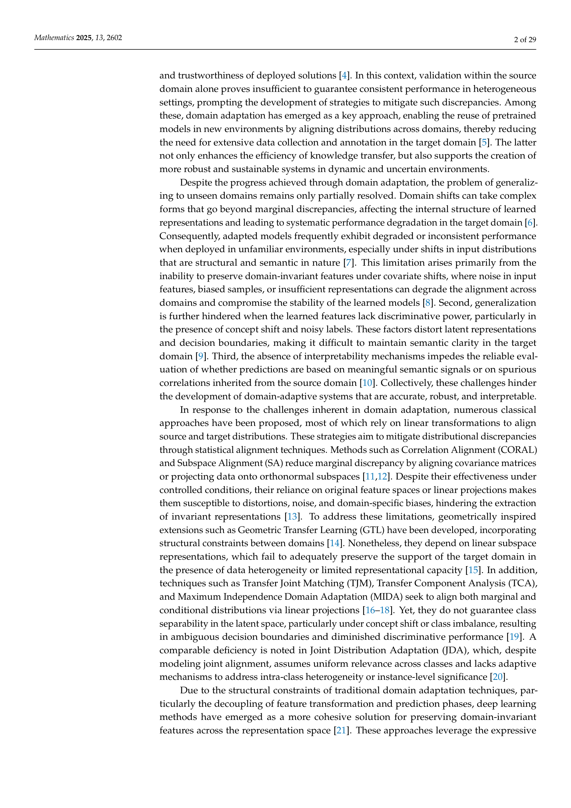

### Extraction assessment
- **Confidence:** 0.95 (meets the configured threshold).
- Machine-readable text was preserved with page-image provenance.

### Raw extracted text
```
Mathematics 2025, 13, 2602
2 of 29
and trustworthiness of deployed solutions [4]. In this context, validation within the source
domain alone proves insufficient to guarantee consistent performance in heterogeneous
settings, prompting the development of strategies to mitigate such discrepancies. Among
these, domain adaptation has emerged as a key approach, enabling the reuse of pretrained
models in new environments by aligning distributions across domains, thereby reducing
the need for extensive data collection and annotation in the target domain [5]. The latter
not only enhances the efficiency of knowledge transfer, but also supports the creation of
more robust and sustainable systems in dynamic and uncertain environments.
Despite the progress achieved through domain adaptation, the problem of generaliz-
ing to unseen domains remains only partially resolved. Domain shifts can take complex
forms that go beyond marginal discrepancies, affecting the internal structure of learned
representations and leading to systematic performance degradation in the target domain [6].
Consequently, adapted models frequently exhibit degraded or inconsistent performance
when deployed in unfamiliar environments, especially under shifts in input distributions
that are structural and semantic in nature [7]. This limitation arises primarily from the
inability to preserve domain-invariant features under covariate shifts, where noise in input
features, biased samples, or insufficient representations can degrade the alignment across
domains and compromise the stability of the learned models [8]. Second, generalization
is further hindered when the learned features lack discriminative power, particularly in
the presence of concept shift and noisy labels. These factors distort latent representations
and decision boundaries, making it difficult to maintain semantic clarity in the target
domain [9]. Third, the absence of interpretability mechanisms impedes the reliable eval-
uation of whether predictions are based on meaningful semantic signals or on spurious
correlations inherited from the source domain [10]. Collectively, these challenges hinder
the development of domain-adaptive systems that are accurate, robust, and interpretable.
In response to the challenges inherent in domain adaptation, numerous classical
approaches have been proposed, most of which rely on linear transformations to align
source and target distributions. These strategies aim to mitigate distributional discrepancies
through statistical alignment techniques. Methods such as Correlation Alignment (CORAL)
and Subspace Alignment (SA) reduce marginal discrepancy by aligning covariance matrices
or projecting data onto orthonormal subspaces [11,12]. Despite their effectiveness under
controlled conditions, their reliance on original feature spaces or linear projections makes
them susceptible to distortions, noise, and domain-specific biases, hindering the extraction
of invariant representations [13]. To address these limitations, geometrically inspired
extensions such as Geometric Transfer Learning (GTL) have been developed, incorporating
structural constraints between domains [14]. Nonetheless, they depend on linear subspace
representations, which fail to adequately preserve the support of the target domain in
the presence of data heterogeneity or limited representational capacity [15]. In addition,
techniques such as Transfer Joint Matching (TJM), Transfer Component Analysis (TCA),
and Maximum Independence Domain Adaptation (MIDA) seek to align both marginal and
conditional distributions via linear projections [16–18]. Yet, they do not guarantee class
separability in the latent space, particularly under concept shift or class imbalance, resulting
in ambiguous decision boundaries and diminished discriminative performance [19]. A
comparable deficiency is noted in Joint Distribution Adaptation (JDA), which, despite
modeling joint alignment, assumes uniform relevance across classes and lacks adaptive
mechanisms to address intra-class heterogeneity or instance-level significance [20].
Due to the structural constraints of traditional domain adaptation techniques, par-
ticularly the decoupling of feature transformation and prediction phases, deep learning
methods have emerged as a more cohesive solution for preserving domain-invariant
features across the representation space [21]. These approaches leverage the expressive

```

## Page 3
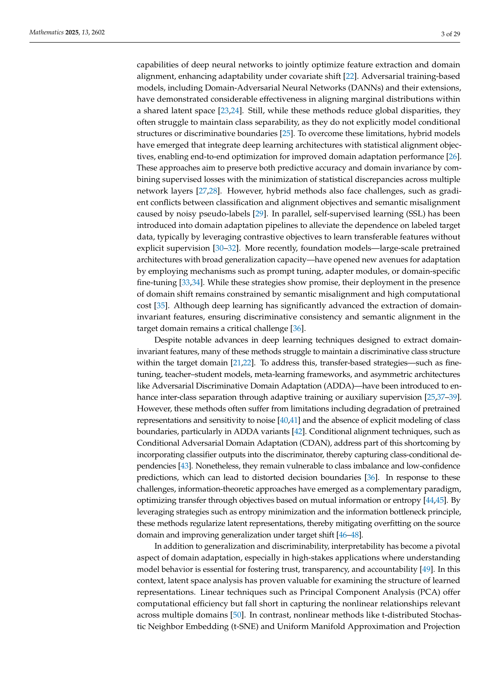

### Extraction assessment
- **Confidence:** 0.95 (meets the configured threshold).
- Machine-readable text was preserved with page-image provenance.

### Raw extracted text
```
Mathematics 2025, 13, 2602
3 of 29
capabilities of deep neural networks to jointly optimize feature extraction and domain
alignment, enhancing adaptability under covariate shift [22]. Adversarial training-based
models, including Domain-Adversarial Neural Networks (DANNs) and their extensions,
have demonstrated considerable effectiveness in aligning marginal distributions within
a shared latent space [23,24]. Still, while these methods reduce global disparities, they
often struggle to maintain class separability, as they do not explicitly model conditional
structures or discriminative boundaries [25]. To overcome these limitations, hybrid models
have emerged that integrate deep learning architectures with statistical alignment objec-
tives, enabling end-to-end optimization for improved domain adaptation performance [26].
These approaches aim to preserve both predictive accuracy and domain invariance by com-
bining supervised losses with the minimization of statistical discrepancies across multiple
network layers [27,28]. However, hybrid methods also face challenges, such as gradi-
ent conflicts between classification and alignment objectives and semantic misalignment
caused by noisy pseudo-labels [29]. In parallel, self-supervised learning (SSL) has been
introduced into domain adaptation pipelines to alleviate the dependence on labeled target
data, typically by leveraging contrastive objectives to learn transferable features without
explicit supervision [30–32]. More recently, foundation models—large-scale pretrained
architectures with broad generalization capacity—have opened new avenues for adaptation
by employing mechanisms such as prompt tuning, adapter modules, or domain-specific
fine-tuning [33,34]. While these strategies show promise, their deployment in the presence
of domain shift remains constrained by semantic misalignment and high computational
cost [35]. Although deep learning has significantly advanced the extraction of domain-
invariant features, ensuring discriminative consistency and semantic alignment in the
target domain remains a critical challenge [36].
Despite notable advances in deep learning techniques designed to extract domain-
invariant features, many of these methods struggle to maintain a discriminative class structure
within the target domain [21,22]. To address this, transfer-based strategies—such as fine-
tuning, teacher–student models, meta-learning frameworks, and asymmetric architectures
like Adversarial Discriminative Domain Adaptation (ADDA)—have been introduced to en-
hance inter-class separation through adaptive training or auxiliary supervision [25,37–39].
However, these methods often suffer from limitations including degradation of pretrained
representations and sensitivity to noise [40,41] and the absence of explicit modeling of class
boundaries, particularly in ADDA variants [42]. Conditional alignment techniques, such as
Conditional Adversarial Domain Adaptation (CDAN), address part of this shortcoming by
incorporating classifier outputs into the discriminator, thereby capturing class-conditional de-
pendencies [43]. Nonetheless, they remain vulnerable to class imbalance and low-confidence
predictions, which can lead to distorted decision boundaries [36]. In response to these
challenges, information-theoretic approaches have emerged as a complementary paradigm,
optimizing transfer through objectives based on mutual information or entropy [44,45]. By
leveraging strategies such as entropy minimization and the information bottleneck principle,
these methods regularize latent representations, thereby mitigating overfitting on the source
domain and improving generalization under target shift [46–48].
In addition to generalization and discriminability, interpretability has become a pivotal
aspect of domain adaptation, especially in high-stakes applications where understanding
model behavior is essential for fostering trust, transparency, and accountability [49]. In this
context, latent space analysis has proven valuable for examining the structure of learned
representations. Linear techniques such as Principal Component Analysis (PCA) offer
computational efficiency but fall short in capturing the nonlinear relationships relevant
across multiple domains [50]. In contrast, nonlinear methods like t-distributed Stochas-
tic Neighbor Embedding (t-SNE) and Uniform Manifold Approximation and Projection

```

## Page 4
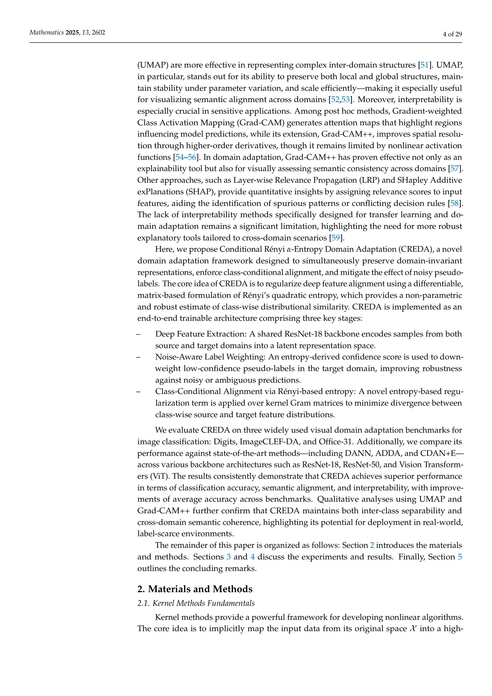

### Extraction assessment
- **Confidence:** 0.95 (meets the configured threshold).
- Machine-readable text was preserved with page-image provenance.

### Raw extracted text
```
Mathematics 2025, 13, 2602
4 of 29
(UMAP) are more effective in representing complex inter-domain structures [51]. UMAP,
in particular, stands out for its ability to preserve both local and global structures, main-
tain stability under parameter variation, and scale efficiently—making it especially useful
for visualizing semantic alignment across domains [52,53]. Moreover, interpretability is
especially crucial in sensitive applications. Among post hoc methods, Gradient-weighted
Class Activation Mapping (Grad-CAM) generates attention maps that highlight regions
influencing model predictions, while its extension, Grad-CAM++, improves spatial resolu-
tion through higher-order derivatives, though it remains limited by nonlinear activation
functions [54–56]. In domain adaptation, Grad-CAM++ has proven effective not only as an
explainability tool but also for visually assessing semantic consistency across domains [57].
Other approaches, such as Layer-wise Relevance Propagation (LRP) and SHapley Additive
exPlanations (SHAP), provide quantitative insights by assigning relevance scores to input
features, aiding the identification of spurious patterns or conflicting decision rules [58].
The lack of interpretability methods specifically designed for transfer learning and do-
main adaptation remains a significant limitation, highlighting the need for more robust
explanatory tools tailored to cross-domain scenarios [59].
Here, we propose Conditional Rényi α-Entropy Domain Adaptation (CREDA), a novel
domain adaptation framework designed to simultaneously preserve domain-invariant
representations, enforce class-conditional alignment, and mitigate the effect of noisy pseudo-
labels. The core idea of CREDA is to regularize deep feature alignment using a differentiable,
matrix-based formulation of Rényi’s quadratic entropy, which provides a non-parametric
and robust estimate of class-wise distributional similarity. CREDA is implemented as an
end-to-end trainable architecture comprising three key stages:
–
Deep Feature Extraction: A shared ResNet-18 backbone encodes samples from both
source and target domains into a latent representation space.
–
Noise-Aware Label Weighting: An entropy-derived confidence score is used to down-
weight low-confidence pseudo-labels in the target domain, improving robustness
against noisy or ambiguous predictions.
–
Class-Conditional Alignment via Rényi-based entropy: A novel entropy-based regu-
larization term is applied over kernel Gram matrices to minimize divergence between
class-wise source and target feature distributions.
We evaluate CREDA on three widely used visual domain adaptation benchmarks for
image classification: Digits, ImageCLEF-DA, and Office-31. Additionally, we compare its
performance against state-of-the-art methods—including DANN, ADDA, and CDAN+E—
across various backbone architectures such as ResNet-18, ResNet-50, and Vision Transform-
ers (ViT). The results consistently demonstrate that CREDA achieves superior performance
in terms of classification accuracy, semantic alignment, and interpretability, with improve-
ments of average accuracy across benchmarks. Qualitative analyses using UMAP and
Grad-CAM++ further confirm that CREDA maintains both inter-class separability and
cross-domain semantic coherence, highlighting its potential for deployment in real-world,
label-scarce environments.
The remainder of this paper is organized as follows: Section 2 introduces the materials
and methods. Sections 3 and 4 discuss the experiments and results. Finally, Section 5
outlines the concluding remarks.
2. Materials and Methods
2.1. Kernel Methods Fundamentals
Kernel methods provide a powerful framework for developing nonlinear algorithms.
The core idea is to implicitly map the input data from its original space X into a high-

```

## Page 5
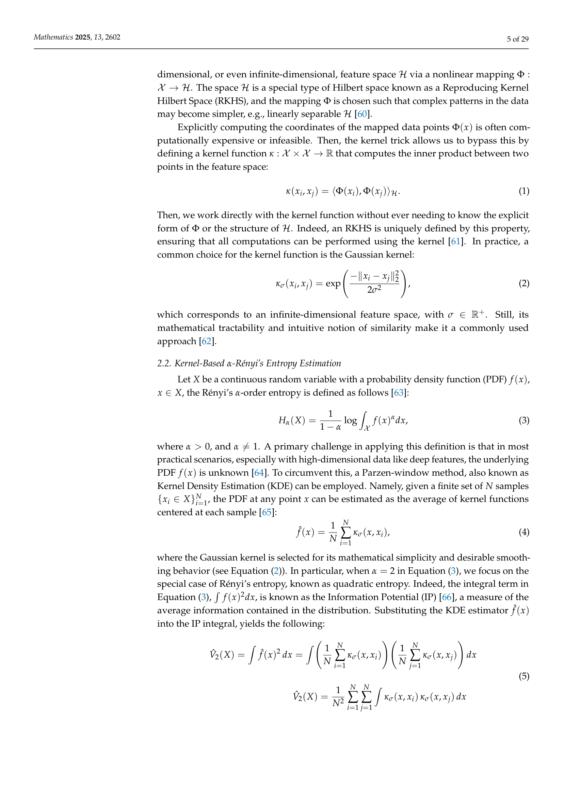

### Extraction assessment
- **Confidence:** 0.65 (below the configured 0.85 threshold; human review required).
- One or more equation candidates are ambiguous in raw extraction.

### Raw extracted text
```
Mathematics 2025, 13, 2602
5 of 29
dimensional, or even infinite-dimensional, feature space H via a nonlinear mapping Φ :
X →H. The space H is a special type of Hilbert space known as a Reproducing Kernel
Hilbert Space (RKHS), and the mapping Φ is chosen such that complex patterns in the data
may become simpler, e.g., linearly separable H [60].
Explicitly computing the coordinates of the mapped data points Φ(x) is often com-
putationally expensive or infeasible. Then, the kernel trick allows us to bypass this by
defining a kernel function κ : X × X →R that computes the inner product between two
points in the feature space:
κ(xi, xj) = ⟨Φ(xi), Φ(xj)⟩H.
(1)
Then, we work directly with the kernel function without ever needing to know the explicit
form of Φ or the structure of H. Indeed, an RKHS is uniquely defined by this property,
ensuring that all computations can be performed using the kernel [61]. In practice, a
common choice for the kernel function is the Gaussian kernel:
κσ(xi, xj) = exp
 
−∥xi −xj∥2
2
2σ2
!
,
(2)
which corresponds to an infinite-dimensional feature space, with σ ∈R+.
Still, its
mathematical tractability and intuitive notion of similarity make it a commonly used
approach [62].
2.2. Kernel-Based α-Rényi’s Entropy Estimation
Let X be a continuous random variable with a probability density function (PDF) f (x),
x ∈X, the Rényi’s α-order entropy is defined as follows [63]:
Hα(X) =
1
1 −α log
Z
X f (x)αdx,
(3)
where α > 0, and α ̸= 1. A primary challenge in applying this definition is that in most
practical scenarios, especially with high-dimensional data like deep features, the underlying
PDF f (x) is unknown [64]. To circumvent this, a Parzen-window method, also known as
Kernel Density Estimation (KDE) can be employed. Namely, given a finite set of N samples
{xi ∈X}N
i=1, the PDF at any point x can be estimated as the average of kernel functions
centered at each sample [65]:
ˆf (x) = 1
N
N
∑
i=1
κσ(x, xi),
(4)
where the Gaussian kernel is selected for its mathematical simplicity and desirable smooth-
ing behavior (see Equation (2)). In particular, when α = 2 in Equation (3), we focus on the
special case of Rényi’s entropy, known as quadratic entropy. Indeed, the integral term in
Equation (3), R
f (x)2dx, is known as the Information Potential (IP) [66], a measure of the
average information contained in the distribution. Substituting the KDE estimator ˆf (x)
into the IP integral, yields the following:
ˆV2(X) =
Z
ˆf (x)2 dx =
Z  
1
N
N
∑
i=1
κσ(x, xi)
! 
1
N
N
∑
j=1
κσ(x, xj)
!
dx
ˆV2(X) =
1
N2
N
∑
i=1
N
∑
j=1
Z
κσ(x, xi) κσ(x, xj) dx
(5)

```

### Equation candidates
- `page-005-equation-001` — review_required (confidence 0.45; page 5).
```
defining a kernel function κ : X × X →R that computes the inner product between two
```
- `page-005-equation-002` — raw_text_preserved (confidence 0.98; page 5).
```
κ(xi, xj) = ⟨Φ(xi), Φ(xj)⟩H.
```
- `page-005-equation-003` — raw_text_preserved (confidence 0.98; page 5).
```
κσ(xi, xj) = exp
```
- `page-005-equation-004` — review_required (confidence 0.45; page 5).
```
which corresponds to an infinite-dimensional feature space, with σ ∈R+.
```
- `page-005-equation-005` — raw_text_preserved (confidence 0.98; page 5).
```
x ∈X, the Rényi’s α-order entropy is defined as follows [63]:
```
- `page-005-equation-006` — review_required (confidence 0.45; page 5).
```
Hα(X) =
```
- `page-005-equation-007` — review_required (confidence 0.45; page 5).
```
where α > 0, and α ̸= 1. A primary challenge in applying this definition is that in most
```
- `page-005-equation-008` — review_required (confidence 0.45; page 5).
```
{xi ∈X}N
```
- `page-005-equation-009` — raw_text_preserved (confidence 0.98; page 5).
```
i=1, the PDF at any point x can be estimated as the average of kernel functions
```
- `page-005-equation-010` — review_required (confidence 0.45; page 5).
```
ˆf (x) = 1
```
- `page-005-equation-011` — review_required (confidence 0.45; page 5).
```
∑
```
- `page-005-equation-012` — raw_text_preserved (confidence 0.98; page 5).
```
i=1
```
- `page-005-equation-013` — review_required (confidence 0.45; page 5).
```
ing behavior (see Equation (2)). In particular, when α = 2 in Equation (3), we focus on the
```
- `page-005-equation-014` — review_required (confidence 0.45; page 5).
```
ˆV2(X) =
```
- `page-005-equation-015` — review_required (confidence 0.45; page 5).
```
ˆf (x)2 dx =
```
- `page-005-equation-016` — review_required (confidence 0.45; page 5).
```
∑
```
- `page-005-equation-017` — raw_text_preserved (confidence 0.98; page 5).
```
i=1
```
- `page-005-equation-018` — review_required (confidence 0.45; page 5).
```
∑
```
- `page-005-equation-019` — raw_text_preserved (confidence 0.98; page 5).
```
j=1
```
- `page-005-equation-020` — review_required (confidence 0.45; page 5).
```
ˆV2(X) =
```
- `page-005-equation-021` — review_required (confidence 0.45; page 5).
```
∑
```
- `page-005-equation-022` — raw_text_preserved (confidence 0.98; page 5).
```
i=1
```
- `page-005-equation-023` — review_required (confidence 0.45; page 5).
```
∑
```
- `page-005-equation-024` — raw_text_preserved (confidence 0.98; page 5).
```
j=1
```

## Page 6
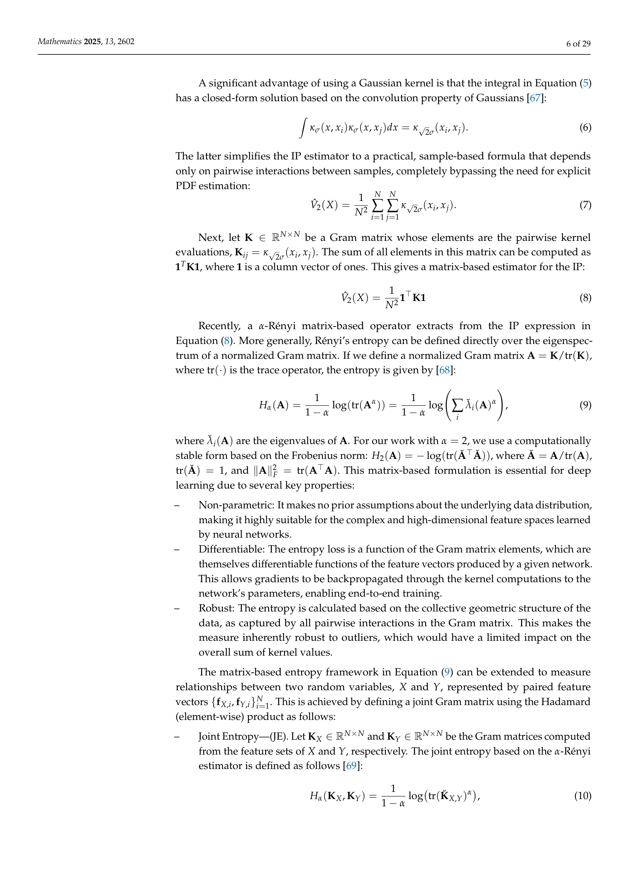

### Extraction assessment
- **Confidence:** 0.65 (below the configured 0.85 threshold; human review required).
- One or more equation candidates are ambiguous in raw extraction.

### Raw extracted text
```
Mathematics 2025, 13, 2602
6 of 29
A significant advantage of using a Gaussian kernel is that the integral in Equation (5)
has a closed-form solution based on the convolution property of Gaussians [67]:
Z
κσ(x, xi)κσ(x, xj)dx = κ√
2σ(xi, xj).
(6)
The latter simplifies the IP estimator to a practical, sample-based formula that depends
only on pairwise interactions between samples, completely bypassing the need for explicit
PDF estimation:
ˆV2(X) =
1
N2
N
∑
i=1
N
∑
j=1
κ√
2σ(xi, xj).
(7)
Next, let K ∈RN×N be a Gram matrix whose elements are the pairwise kernel
evaluations, Kij = κ√
2σ(xi, xj). The sum of all elements in this matrix can be computed as
1TK1, where 1 is a column vector of ones. This gives a matrix-based estimator for the IP:
ˆV2(X) =
1
N2 1⊤K1
(8)
Recently, a α-Rényi matrix-based operator extracts from the IP expression in
Equation (8). More generally, Rényi’s entropy can be defined directly over the eigenspec-
trum of a normalized Gram matrix. If we define a normalized Gram matrix A = K/tr(K),
where tr(·) is the trace operator, the entropy is given by [68]:
Hα(A) =
1
1 −α log(tr(Aα)) =
1
1 −α log
 
∑
i
˘λi(A)α
!
,
(9)
where ˘λi(A) are the eigenvalues of A. For our work with α = 2, we use a computationally
stable form based on the Frobenius norm: H2(A) = −log(tr( ˘A⊤˘A)), where ˘A = A/tr(A),
tr( ˘A) = 1, and ∥A∥2
F = tr(A⊤A). This matrix-based formulation is essential for deep
learning due to several key properties:
–
Non-parametric: It makes no prior assumptions about the underlying data distribution,
making it highly suitable for the complex and high-dimensional feature spaces learned
by neural networks.
–
Differentiable: The entropy loss is a function of the Gram matrix elements, which are
themselves differentiable functions of the feature vectors produced by a given network.
This allows gradients to be backpropagated through the kernel computations to the
network’s parameters, enabling end-to-end training.
–
Robust: The entropy is calculated based on the collective geometric structure of the
data, as captured by all pairwise interactions in the Gram matrix. This makes the
measure inherently robust to outliers, which would have a limited impact on the
overall sum of kernel values.
The matrix-based entropy framework in Equation (9) can be extended to measure
relationships between two random variables, X and Y, represented by paired feature
vectors {fX,i, fY,i}N
i=1. This is achieved by defining a joint Gram matrix using the Hadamard
(element-wise) product as follows:
–
Joint Entropy—(JE). Let KX ∈RN×N and KY ∈RN×N be the Gram matrices computed
from the feature sets of X and Y, respectively. The joint entropy based on the α-Rényi
estimator is defined as follows [69]:
Hα(KX, KY) =
1
1 −α log
tr( ˘KX,Y)α
,
(10)

```

### Equation candidates
- `page-006-equation-001` — review_required (confidence 0.45; page 6).
```
κσ(x, xi)κσ(x, xj)dx = κ√
```
- `page-006-equation-002` — review_required (confidence 0.45; page 6).
```
ˆV2(X) =
```
- `page-006-equation-003` — review_required (confidence 0.45; page 6).
```
∑
```
- `page-006-equation-004` — raw_text_preserved (confidence 0.98; page 6).
```
i=1
```
- `page-006-equation-005` — review_required (confidence 0.45; page 6).
```
∑
```
- `page-006-equation-006` — raw_text_preserved (confidence 0.98; page 6).
```
j=1
```
- `page-006-equation-007` — review_required (confidence 0.45; page 6).
```
κ√
```
- `page-006-equation-008` — review_required (confidence 0.45; page 6).
```
Next, let K ∈RN×N be a Gram matrix whose elements are the pairwise kernel
```
- `page-006-equation-009` — review_required (confidence 0.45; page 6).
```
evaluations, Kij = κ√
```
- `page-006-equation-010` — review_required (confidence 0.45; page 6).
```
ˆV2(X) =
```
- `page-006-equation-011` — review_required (confidence 0.45; page 6).
```
trum of a normalized Gram matrix. If we define a normalized Gram matrix A = K/tr(K),
```
- `page-006-equation-012` — review_required (confidence 0.45; page 6).
```
Hα(A) =
```
- `page-006-equation-013` — review_required (confidence 0.45; page 6).
```
1 −α log(tr(Aα)) =
```
- `page-006-equation-014` — review_required (confidence 0.45; page 6).
```
∑
```
- `page-006-equation-015` — review_required (confidence 0.45; page 6).
```
where ˘λi(A) are the eigenvalues of A. For our work with α = 2, we use a computationally
```
- `page-006-equation-016` — review_required (confidence 0.45; page 6).
```
stable form based on the Frobenius norm: H2(A) = −log(tr( ˘A⊤˘A)), where ˘A = A/tr(A),
```
- `page-006-equation-017` — raw_text_preserved (confidence 0.98; page 6).
```
tr( ˘A) = 1, and ∥A∥2
```
- `page-006-equation-018` — raw_text_preserved (confidence 0.98; page 6).
```
F = tr(A⊤A). This matrix-based formulation is essential for deep
```
- `page-006-equation-019` — raw_text_preserved (confidence 0.98; page 6).
```
i=1. This is achieved by defining a joint Gram matrix using the Hadamard
```
- `page-006-equation-020` — review_required (confidence 0.45; page 6).
```
Joint Entropy—(JE). Let KX ∈RN×N and KY ∈RN×N be the Gram matrices computed
```
- `page-006-equation-021` — review_required (confidence 0.45; page 6).
```
Hα(KX, KY) =
```

## Page 7
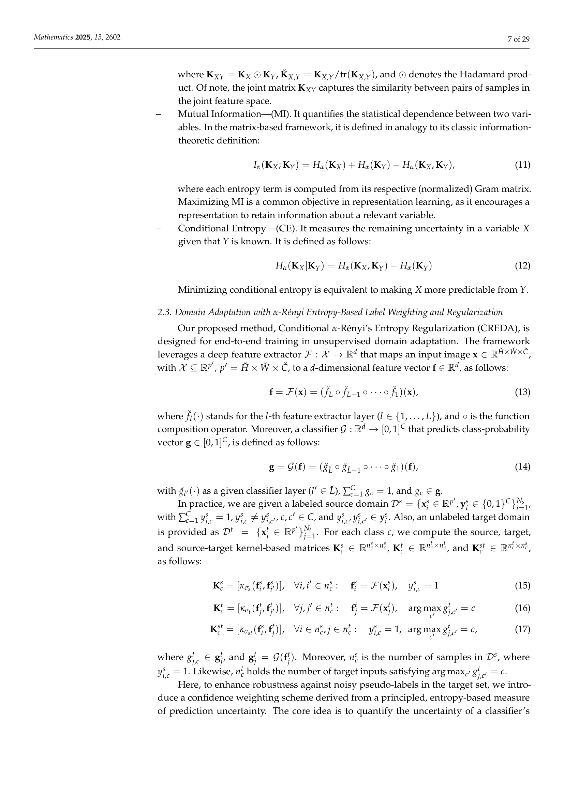

### Extraction assessment
- **Confidence:** 0.65 (below the configured 0.85 threshold; human review required).
- One or more equation candidates are ambiguous in raw extraction.

### Raw extracted text
```
Mathematics 2025, 13, 2602
7 of 29
where KXY = KX ⊙KY, ˘KX,Y = KX,Y/tr(KX,Y), and ⊙denotes the Hadamard prod-
uct. Of note, the joint matrix KXY captures the similarity between pairs of samples in
the joint feature space.
–
Mutual Information—(MI). It quantifies the statistical dependence between two vari-
ables. In the matrix-based framework, it is defined in analogy to its classic information-
theoretic definition:
Iα(KX; KY) = Hα(KX) + Hα(KY) −Hα(KX, KY),
(11)
where each entropy term is computed from its respective (normalized) Gram matrix.
Maximizing MI is a common objective in representation learning, as it encourages a
representation to retain information about a relevant variable.
–
Conditional Entropy—(CE). It measures the remaining uncertainty in a variable X
given that Y is known. It is defined as follows:
Hα(KX|KY) = Hα(KX, KY) −Hα(KY)
(12)
Minimizing conditional entropy is equivalent to making X more predictable from Y.
2.3. Domain Adaptation with α-Rényi Entropy-Based Label Weighting and Regularization
Our proposed method, Conditional α-Rényi’s Entropy Regularization (CREDA), is
designed for end-to-end training in unsupervised domain adaptation. The framework
leverages a deep feature extractor F : X →Rd that maps an input image x ∈R ˘H× ˘W× ˘C,
with X ⊆Rp′, p′ = ˘H × ˘W × ˘C, to a d-dimensional feature vector f ∈Rd, as follows:
f = F(x) = ( ˘fL ◦˘fL−1 ◦· · · ◦˘f1)(x),
(13)
where ˘fl(·) stands for the l-th feature extractor layer (l ∈{1, . . . , L}), and ◦is the function
composition operator. Moreover, a classifier G : Rd →[0, 1]C that predicts class-probability
vector g ∈[0, 1]C, is defined as follows:
g = G(f) = ( ˘g˘L ◦˘g˘L−1 ◦· · · ◦˘g1)(f),
(14)
with ˘gl′(·) as a given classifier layer (l′ ∈˘L), ∑C
c=1 gc = 1, and gc ∈g.
In practice, we are given a labeled source domain Ds = {xs
i ∈Rp′, ys
i ∈{0, 1}C}Ns
i=1,
with ∑C
c=1 ys
i,c = 1, ys
i,c ̸= ys
i,c′, c, c′ ∈C, and ys
i,c, ys
i,c′ ∈ys
i . Also, an unlabeled target domain
is provided as Dt
= {xt
j ∈Rp′}Nt
j=1. For each class c, we compute the source, target,
and source-target kernel-based matrices Ks
c ∈Rnsc×nsc, Kt
c ∈Rntc×ntc, and Kst
c ∈Rntc×nsc,
as follows:
Ks
c = [κσs(fs
i, fs
i′)],
∀i, i′ ∈ns
c :
fs
i = F(xs
i ),
ys
i,c = 1
(15)
Kt
c = [κσt(ft
j, ft
j′)],
∀j, j′ ∈nt
c :
ft
j = F(xt
j),
arg max
c′
gt
j,c′ = c
(16)
Kst
c = [κσst(fs
i, ft
j)],
∀i ∈ns
c, j ∈nt
c :
ys
i,c = 1, arg max
c′
gt
j,c′ = c,
(17)
where gt
j,c ∈gt
j, and gt
j = G(ft
j). Moreover, ns
c is the number of samples in Ds, where
ys
i,c = 1. Likewise, nt
c holds the number of target inputs satisfying arg maxc′ gt
j,c′ = c.
Here, to enhance robustness against noisy pseudo-labels in the target set, we intro-
duce a confidence weighting scheme derived from a principled, entropy-based measure
of prediction uncertainty. The core idea is to quantify the uncertainty of a classifier’s

```

### Equation candidates
- `page-007-equation-001` — review_required (confidence 0.45; page 7).
```
where KXY = KX ⊙KY, ˘KX,Y = KX,Y/tr(KX,Y), and ⊙denotes the Hadamard prod-
```
- `page-007-equation-002` — review_required (confidence 0.45; page 7).
```
Iα(KX; KY) = Hα(KX) + Hα(KY) −Hα(KX, KY),
```
- `page-007-equation-003` — raw_text_preserved (confidence 0.98; page 7).
```
Hα(KX|KY) = Hα(KX, KY) −Hα(KY)
```
- `page-007-equation-004` — review_required (confidence 0.45; page 7).
```
leverages a deep feature extractor F : X →Rd that maps an input image x ∈R ˘H× ˘W× ˘C,
```
- `page-007-equation-005` — review_required (confidence 0.45; page 7).
```
with X ⊆Rp′, p′ = ˘H × ˘W × ˘C, to a d-dimensional feature vector f ∈Rd, as follows:
```
- `page-007-equation-006` — review_required (confidence 0.45; page 7).
```
f = F(x) = ( ˘fL ◦˘fL−1 ◦· · · ◦˘f1)(x),
```
- `page-007-equation-007` — review_required (confidence 0.45; page 7).
```
where ˘fl(·) stands for the l-th feature extractor layer (l ∈{1, . . . , L}), and ◦is the function
```
- `page-007-equation-008` — review_required (confidence 0.45; page 7).
```
vector g ∈[0, 1]C, is defined as follows:
```
- `page-007-equation-009` — review_required (confidence 0.45; page 7).
```
g = G(f) = ( ˘g˘L ◦˘g˘L−1 ◦· · · ◦˘g1)(f),
```
- `page-007-equation-010` — review_required (confidence 0.45; page 7).
```
with ˘gl′(·) as a given classifier layer (l′ ∈˘L), ∑C
```
- `page-007-equation-011` — raw_text_preserved (confidence 0.98; page 7).
```
c=1 gc = 1, and gc ∈g.
```
- `page-007-equation-012` — review_required (confidence 0.45; page 7).
```
In practice, we are given a labeled source domain Ds = {xs
```
- `page-007-equation-013` — raw_text_preserved (confidence 0.98; page 7).
```
i ∈Rp′, ys
```
- `page-007-equation-014` — raw_text_preserved (confidence 0.98; page 7).
```
i ∈{0, 1}C}Ns
```
- `page-007-equation-015` — review_required (confidence 0.45; page 7).
```
i=1,
```
- `page-007-equation-016` — review_required (confidence 0.45; page 7).
```
with ∑C
```
- `page-007-equation-017` — raw_text_preserved (confidence 0.98; page 7).
```
c=1 ys
```
- `page-007-equation-018` — review_required (confidence 0.45; page 7).
```
i,c = 1, ys
```
- `page-007-equation-019` — review_required (confidence 0.45; page 7).
```
i,c ̸= ys
```
- `page-007-equation-020` — review_required (confidence 0.45; page 7).
```
i,c′, c, c′ ∈C, and ys
```
- `page-007-equation-021` — review_required (confidence 0.45; page 7).
```
i,c′ ∈ys
```
- `page-007-equation-022` — review_required (confidence 0.45; page 7).
```
= {xt
```
- `page-007-equation-023` — raw_text_preserved (confidence 0.98; page 7).
```
j ∈Rp′}Nt
```
- `page-007-equation-024` — review_required (confidence 0.45; page 7).
```
j=1. For each class c, we compute the source, target,
```
- `page-007-equation-025` — raw_text_preserved (confidence 0.98; page 7).
```
c ∈Rnsc×nsc, Kt
```
- `page-007-equation-026` — raw_text_preserved (confidence 0.98; page 7).
```
c ∈Rntc×ntc, and Kst
```
- `page-007-equation-027` — review_required (confidence 0.45; page 7).
```
c ∈Rntc×nsc,
```
- `page-007-equation-028` — review_required (confidence 0.45; page 7).
```
c = [κσs(fs
```
- `page-007-equation-029` — review_required (confidence 0.45; page 7).
```
∀i, i′ ∈ns
```
- `page-007-equation-030` — review_required (confidence 0.45; page 7).
```
i = F(xs
```
- `page-007-equation-031` — review_required (confidence 0.45; page 7).
```
i,c = 1
```
- `page-007-equation-032` — review_required (confidence 0.45; page 7).
```
c = [κσt(ft
```
- `page-007-equation-033` — review_required (confidence 0.45; page 7).
```
∀j, j′ ∈nt
```
- `page-007-equation-034` — review_required (confidence 0.45; page 7).
```
j = F(xt
```
- `page-007-equation-035` — review_required (confidence 0.45; page 7).
```
j,c′ = c
```
- `page-007-equation-036` — review_required (confidence 0.45; page 7).
```
c = [κσst(fs
```
- `page-007-equation-037` — review_required (confidence 0.45; page 7).
```
∀i ∈ns
```
- `page-007-equation-038` — review_required (confidence 0.45; page 7).
```
c, j ∈nt
```
- `page-007-equation-039` — review_required (confidence 0.45; page 7).
```
i,c = 1, arg max
```
- `page-007-equation-040` — review_required (confidence 0.45; page 7).
```
j,c′ = c,
```
- `page-007-equation-041` — review_required (confidence 0.45; page 7).
```
j,c ∈gt
```
- `page-007-equation-042` — review_required (confidence 0.45; page 7).
```
j = G(ft
```
- `page-007-equation-043` — review_required (confidence 0.45; page 7).
```
i,c = 1. Likewise, nt
```
- `page-007-equation-044` — review_required (confidence 0.45; page 7).
```
j,c′ = c.
```

## Page 8
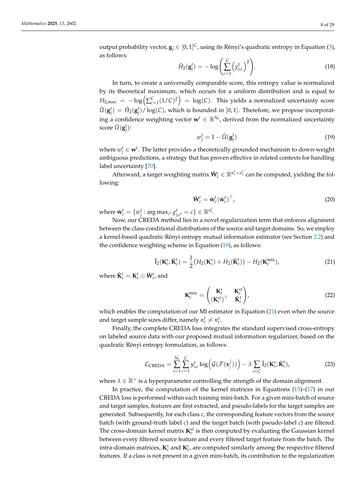

### Extraction assessment
- **Confidence:** 0.65 (below the configured 0.85 threshold; human review required).
- One or more equation candidates are ambiguous in raw extraction.

### Raw extracted text
```
Mathematics 2025, 13, 2602
8 of 29
output probability vector, gj ∈[0, 1]C, using its Rényi’s quadratic entropy in Equation (3),
as follows:
ˆH2(gt
j) = −log
 
C
∑
c=1

gt
j,c
2
!
.
(18)
In turn, to create a universally comparable score, this entropy value is normalized
by its theoretical maximum, which occurs for a uniform distribution and is equal to
H2,max = −log

∑C
c=1(1/C)2
= log(C). This yields a normalized uncertainty score
ˆU(gt
j) = ˆH2(gt
j)/ log(C), which is bounded in [0, 1]. Therefore, we propose incorporat-
ing a confidence weighting vector wt ∈RNt, derived from the normalized uncertainty
score ˆU(gt
j):
wt
j = 1 −ˆU(gt
j)
(19)
where wt
j ∈wt. The latter provides a theoretically grounded mechanism to down-weight
ambiguous predictions, a strategy that has proven effective in related contexts for handling
label uncertainty [70].
Afterward, a target weighting matrix ˜Wc
t ∈Rntc×ntc can be computed, yielding the fol-
lowing:
˜Wt
c = ˜wt
c( ˜wt
c)⊤,
(20)
where ˜wt
c = {wt
j : arg maxc′ gt
j,c′ = c} ∈Rntc.
Now, our CREDA method lies in a novel regularization term that enforces alignment
between the class-conditional distributions of the source and target domains. So, we employ
a kernel-based quadratic Rényi entropy mutual information estimator (see Section 2.2) and
the confidence weighting scheme in Equation (19), as follows:
˜I2(Ks
c; ˜Kt
c) = 1
2
H2(Ks
c) + H2( ˜Kt
c)
 −H2(Kmix
c
),
(21)
where ˜Kt
c = Kt
c ⊙˜Wt
c, and
Kmix
c
=
 
Ks
c
Kst
c
(Kst
c )⊤
˜Kt
c
!
,
(22)
which enables the computation of our MI estimator in Equation (21) even when the source
and target sample sizes differ, namely nt
c ̸= ns
c.
Finally, the complete CREDA loss integrates the standard supervised cross-entropy
on labeled source data with our proposed mutual information regularizer, based on the
quadratic Rényi entropy formulation, as follows:
LCREDA =
Ns
∑
i=1
C
∑
c=1
ys
i,c log

G(F(x∫
⟩))

−λ ∑
c∈C
˜I2(Ks
c; ˜Kt
c),
(23)
where λ ∈R+ is a hyperparameter controlling the strength of the domain alignment.
In practice, the computation of the kernel matrices in Equations (15)–(17) in our
CREDA loss is performed within each training mini-batch. For a given mini-batch of source
and target samples, features are first extracted, and pseudo-labels for the target samples are
generated. Subsequently, for each class c, the corresponding feature vectors from the source
batch (with ground-truth label c) and the target batch (with pseudo-label c) are filtered.
The cross-domain kernel matrix Kst
c is then computed by evaluating the Gaussian kernel
between every filtered source feature and every filtered target feature from the batch. The
intra-domain matrices, Ks
c and Kc
t, are computed similarly among the respective filtered
features. If a class is not present in a given mini-batch, its contribution to the regularization

```

### Equation candidates
- `page-008-equation-001` — review_required (confidence 0.45; page 8).
```
output probability vector, gj ∈[0, 1]C, using its Rényi’s quadratic entropy in Equation (3),
```
- `page-008-equation-002` — review_required (confidence 0.45; page 8).
```
j) = −log
```
- `page-008-equation-003` — review_required (confidence 0.45; page 8).
```
∑
```
- `page-008-equation-004` — raw_text_preserved (confidence 0.98; page 8).
```
c=1
```
- `page-008-equation-005` — review_required (confidence 0.45; page 8).
```
H2,max = −log
```
- `page-008-equation-006` — review_required (confidence 0.45; page 8).
```
∑C
```
- `page-008-equation-007` — raw_text_preserved (confidence 0.98; page 8).
```
c=1(1/C)2
```
- `page-008-equation-008` — review_required (confidence 0.45; page 8).
```
= log(C). This yields a normalized uncertainty score
```
- `page-008-equation-009` — review_required (confidence 0.45; page 8).
```
j) = ˆH2(gt
```
- `page-008-equation-010` — review_required (confidence 0.45; page 8).
```
ing a confidence weighting vector wt ∈RNt, derived from the normalized uncertainty
```
- `page-008-equation-011` — review_required (confidence 0.45; page 8).
```
j = 1 −ˆU(gt
```
- `page-008-equation-012` — raw_text_preserved (confidence 0.98; page 8).
```
j ∈wt. The latter provides a theoretically grounded mechanism to down-weight
```
- `page-008-equation-013` — review_required (confidence 0.45; page 8).
```
t ∈Rntc×ntc can be computed, yielding the fol-
```
- `page-008-equation-014` — raw_text_preserved (confidence 0.98; page 8).
```
c = ˜wt
```
- `page-008-equation-015` — raw_text_preserved (confidence 0.98; page 8).
```
c = {wt
```
- `page-008-equation-016` — review_required (confidence 0.45; page 8).
```
j,c′ = c} ∈Rntc.
```
- `page-008-equation-017` — review_required (confidence 0.45; page 8).
```
c) = 1
```
- `page-008-equation-018` — raw_text_preserved (confidence 0.98; page 8).
```
c = Kt
```
- `page-008-equation-019` — review_required (confidence 0.45; page 8).
```
=
```
- `page-008-equation-020` — review_required (confidence 0.45; page 8).
```
c ̸= ns
```
- `page-008-equation-021` — review_required (confidence 0.45; page 8).
```
LCREDA =
```
- `page-008-equation-022` — review_required (confidence 0.45; page 8).
```
∑
```
- `page-008-equation-023` — raw_text_preserved (confidence 0.98; page 8).
```
i=1
```
- `page-008-equation-024` — review_required (confidence 0.45; page 8).
```
∑
```
- `page-008-equation-025` — raw_text_preserved (confidence 0.98; page 8).
```
c=1
```
- `page-008-equation-026` — review_required (confidence 0.45; page 8).
```
−λ ∑
```
- `page-008-equation-027` — raw_text_preserved (confidence 0.98; page 8).
```
c∈C
```
- `page-008-equation-028` — review_required (confidence 0.45; page 8).
```
where λ ∈R+ is a hyperparameter controlling the strength of the domain alignment.
```

## Page 9
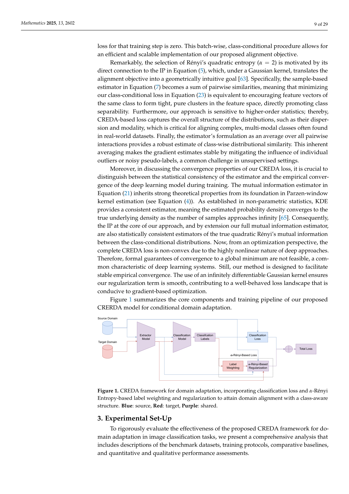

### Extraction assessment
- **Confidence:** 0.65 (below the configured 0.85 threshold; human review required).
- One or more equation candidates are ambiguous in raw extraction.

### Raw extracted text
```
Mathematics 2025, 13, 2602
9 of 29
loss for that training step is zero. This batch-wise, class-conditional procedure allows for
an efficient and scalable implementation of our proposed alignment objective.
Remarkably, the selection of Rényi’s quadratic entropy (α = 2) is motivated by its
direct connection to the IP in Equation (5), which, under a Gaussian kernel, translates the
alignment objective into a geometrically intuitive goal [63]. Specifically, the sample-based
estimator in Equation (7) becomes a sum of pairwise similarities, meaning that minimizing
our class-conditional loss in Equation (23) is equivalent to encouraging feature vectors of
the same class to form tight, pure clusters in the feature space, directly promoting class
separability. Furthermore, our approach is sensitive to higher-order statistics; thereby,
CREDA-based loss captures the overall structure of the distributions, such as their disper-
sion and modality, which is critical for aligning complex, multi-modal classes often found
in real-world datasets. Finally, the estimator’s formulation as an average over all pairwise
interactions provides a robust estimate of class-wise distributional similarity. This inherent
averaging makes the gradient estimates stable by mitigating the influence of individual
outliers or noisy pseudo-labels, a common challenge in unsupervised settings.
Moreover, in discussing the convergence properties of our CREDA loss, it is crucial to
distinguish between the statistical consistency of the estimator and the empirical conver-
gence of the deep learning model during training. The mutual information estimator in
Equation (21) inherits strong theoretical properties from its foundation in Parzen-window
kernel estimation (see Equation (4)). As established in non-parametric statistics, KDE
provides a consistent estimator, meaning the estimated probability density converges to the
true underlying density as the number of samples approaches infinity [65]. Consequently,
the IP at the core of our approach, and by extension our full mutual information estimator,
are also statistically consistent estimators of the true quadratic Rényi’s mutual information
between the class-conditional distributions. Now, from an optimization perspective, the
complete CREDA loss is non-convex due to the highly nonlinear nature of deep approaches.
Therefore, formal guarantees of convergence to a global minimum are not feasible, a com-
mon characteristic of deep learning systems. Still, our method is designed to facilitate
stable empirical convergence. The use of an infinitely differentiable Gaussian kernel ensures
our regularization term is smooth, contributing to a well-behaved loss landscape that is
conducive to gradient-based optimization.
Figure 1 summarizes the core components and training pipeline of our proposed
CRERDA model for conditional domain adaptation.
Source Domain
Target Domain
Classification
Loss
Label
Weighting
Classifcation
Labels
Total Loss
Extractor
 Model
Classification 
Model
-Rényi-Based
Regularization
-Rényi-Based Loss
Figure 1. CREDA framework for domain adaptation, incorporating classification loss and α-Rényi
Entropy-based label weighting and regularization to attain domain alignment with a class-aware
structure. Blue: source, Red: target, Purple: shared.
3. Experimental Set-Up
To rigorously evaluate the effectiveness of the proposed CREDA framework for do-
main adaptation in image classification tasks, we present a comprehensive analysis that
includes descriptions of the benchmark datasets, training protocols, comparative baselines,
and quantitative and qualitative performance assessments.

```

### Textual figure-caption evidence
- Figure 1. CREDA framework for domain adaptation, incorporating classification loss and α-Rényi
- Captions are page-level text evidence and are not associated with embedded images.

### Equation candidates
- `page-009-equation-001` — review_required (confidence 0.45; page 9).
```
Remarkably, the selection of Rényi’s quadratic entropy (α = 2) is motivated by its
```

## Page 10
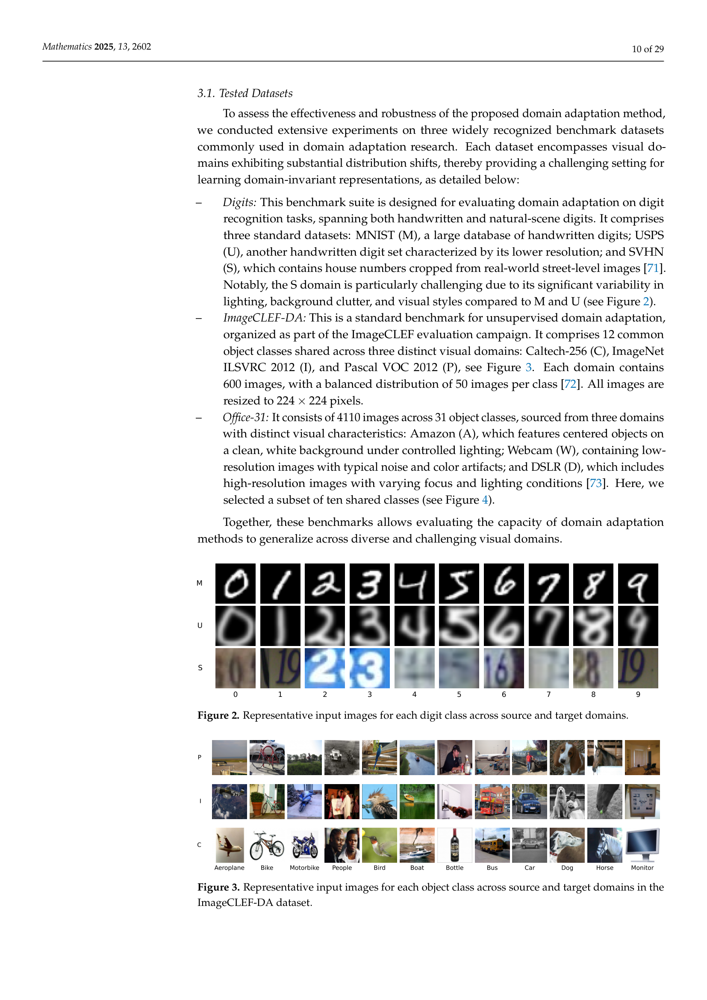

### Extraction assessment
- **Confidence:** 0.65 (below the configured 0.85 threshold; human review required).
- One or more equation candidates are ambiguous in raw extraction. Embedded images require visual review; captions remain page-level text evidence only.

### Raw extracted text
```
Mathematics 2025, 13, 2602
10 of 29
3.1. Tested Datasets
To assess the effectiveness and robustness of the proposed domain adaptation method,
we conducted extensive experiments on three widely recognized benchmark datasets
commonly used in domain adaptation research. Each dataset encompasses visual do-
mains exhibiting substantial distribution shifts, thereby providing a challenging setting for
learning domain-invariant representations, as detailed below:
–
Digits: This benchmark suite is designed for evaluating domain adaptation on digit
recognition tasks, spanning both handwritten and natural-scene digits. It comprises
three standard datasets: MNIST (M), a large database of handwritten digits; USPS
(U), another handwritten digit set characterized by its lower resolution; and SVHN
(S), which contains house numbers cropped from real-world street-level images [71].
Notably, the S domain is particularly challenging due to its significant variability in
lighting, background clutter, and visual styles compared to M and U (see Figure 2).
–
ImageCLEF-DA: This is a standard benchmark for unsupervised domain adaptation,
organized as part of the ImageCLEF evaluation campaign. It comprises 12 common
object classes shared across three distinct visual domains: Caltech-256 (C), ImageNet
ILSVRC 2012 (I), and Pascal VOC 2012 (P), see Figure 3. Each domain contains
600 images, with a balanced distribution of 50 images per class [72]. All images are
resized to 224 × 224 pixels.
–
Office-31: It consists of 4110 images across 31 object classes, sourced from three domains
with distinct visual characteristics: Amazon (A), which features centered objects on
a clean, white background under controlled lighting; Webcam (W), containing low-
resolution images with typical noise and color artifacts; and DSLR (D), which includes
high-resolution images with varying focus and lighting conditions [73]. Here, we
selected a subset of ten shared classes (see Figure 4).
Together, these benchmarks allows evaluating the capacity of domain adaptation
methods to generalize across diverse and challenging visual domains.
M
U
0
S
1
2
3
4
5
6
7
8
9
Figure 2. Representative input images for each digit class across source and target domains.
P
I
Aeroplane
C
Bike
Motorbike
People
Bird
Boat
Bottle
Bus
Car
Dog
Horse
Monitor
Figure 3. Representative input images for each object class across source and target domains in the
ImageCLEF-DA dataset.

```

### Textual figure-caption evidence
- Figure 2. Representative input images for each digit class across source and target domains.
- Figure 3. Representative input images for each object class across source and target domains in the
- Captions are page-level text evidence and are not associated with embedded images.

### Equation candidates
- `page-010-equation-001` — review_required (confidence 0.45; page 10).
```
resized to 224 × 224 pixels.
```

### Embedded images
- `page-010-image-001` — embedded image metadata: 178 × 178 px, xref 431; visual review required.
- `page-010-image-002` — embedded image metadata: 178 × 178 px, xref 432; visual review required.
- `page-010-image-003` — embedded image metadata: 178 × 178 px, xref 433; visual review required.
- `page-010-image-004` — embedded image metadata: 178 × 178 px, xref 434; visual review required.
- `page-010-image-005` — embedded image metadata: 178 × 178 px, xref 435; visual review required.
- `page-010-image-006` — embedded image metadata: 178 × 178 px, xref 436; visual review required.
- `page-010-image-007` — embedded image metadata: 178 × 178 px, xref 437; visual review required.
- `page-010-image-008` — embedded image metadata: 178 × 178 px, xref 438; visual review required.
- `page-010-image-009` — embedded image metadata: 178 × 178 px, xref 439; visual review required.
- `page-010-image-010` — embedded image metadata: 178 × 178 px, xref 440; visual review required.
- `page-010-image-011` — embedded image metadata: 178 × 178 px, xref 441; visual review required.
- `page-010-image-012` — embedded image metadata: 178 × 178 px, xref 442; visual review required.
- `page-010-image-013` — embedded image metadata: 178 × 178 px, xref 443; visual review required.
- `page-010-image-014` — embedded image metadata: 178 × 178 px, xref 444; visual review required.
- `page-010-image-015` — embedded image metadata: 178 × 178 px, xref 445; visual review required.
- `page-010-image-016` — embedded image metadata: 178 × 178 px, xref 446; visual review required.
- `page-010-image-017` — embedded image metadata: 178 × 178 px, xref 447; visual review required.
- `page-010-image-018` — embedded image metadata: 178 × 178 px, xref 448; visual review required.
- `page-010-image-019` — embedded image metadata: 178 × 178 px, xref 449; visual review required.
- `page-010-image-020` — embedded image metadata: 178 × 178 px, xref 450; visual review required.
- `page-010-image-021` — embedded image metadata: 178 × 178 px, xref 451; visual review required.
- `page-010-image-022` — embedded image metadata: 178 × 178 px, xref 452; visual review required.
- `page-010-image-023` — embedded image metadata: 178 × 178 px, xref 453; visual review required.
- `page-010-image-024` — embedded image metadata: 178 × 178 px, xref 454; visual review required.
- `page-010-image-025` — embedded image metadata: 178 × 178 px, xref 455; visual review required.
- `page-010-image-026` — embedded image metadata: 178 × 178 px, xref 456; visual review required.
- `page-010-image-027` — embedded image metadata: 178 × 178 px, xref 457; visual review required.
- `page-010-image-028` — embedded image metadata: 178 × 178 px, xref 458; visual review required.
- `page-010-image-029` — embedded image metadata: 178 × 178 px, xref 459; visual review required.
- `page-010-image-030` — embedded image metadata: 178 × 178 px, xref 460; visual review required.
- `page-010-image-031` — embedded image metadata: 178 × 178 px, xref 461; visual review required.
- `page-010-image-032` — embedded image metadata: 178 × 178 px, xref 462; visual review required.
- `page-010-image-033` — embedded image metadata: 178 × 178 px, xref 463; visual review required.
- `page-010-image-034` — embedded image metadata: 178 × 178 px, xref 464; visual review required.
- `page-010-image-035` — embedded image metadata: 178 × 178 px, xref 465; visual review required.
- `page-010-image-036` — embedded image metadata: 178 × 178 px, xref 466; visual review required.
- `page-010-image-037` — embedded image metadata: 1695 × 1695 px, xref 398; visual review required.
- `page-010-image-038` — embedded image metadata: 1695 × 1695 px, xref 399; visual review required.
- `page-010-image-039` — embedded image metadata: 1695 × 1695 px, xref 400; visual review required.
- `page-010-image-040` — embedded image metadata: 1695 × 1695 px, xref 401; visual review required.
- `page-010-image-041` — embedded image metadata: 1695 × 1695 px, xref 402; visual review required.
- `page-010-image-042` — embedded image metadata: 1695 × 1695 px, xref 403; visual review required.
- `page-010-image-043` — embedded image metadata: 1695 × 1695 px, xref 404; visual review required.
- `page-010-image-044` — embedded image metadata: 1695 × 1695 px, xref 405; visual review required.
- `page-010-image-045` — embedded image metadata: 1695 × 1695 px, xref 406; visual review required.
- `page-010-image-046` — embedded image metadata: 1695 × 1695 px, xref 407; visual review required.
- `page-010-image-047` — embedded image metadata: 1695 × 1695 px, xref 408; visual review required.
- `page-010-image-048` — embedded image metadata: 1695 × 1695 px, xref 409; visual review required.
- `page-010-image-049` — embedded image metadata: 1695 × 1695 px, xref 410; visual review required.
- `page-010-image-050` — embedded image metadata: 1695 × 1695 px, xref 411; visual review required.
- `page-010-image-051` — embedded image metadata: 1695 × 1695 px, xref 412; visual review required.
- `page-010-image-052` — embedded image metadata: 1695 × 1695 px, xref 413; visual review required.
- `page-010-image-053` — embedded image metadata: 1695 × 1695 px, xref 414; visual review required.
- `page-010-image-054` — embedded image metadata: 1695 × 1695 px, xref 415; visual review required.
- `page-010-image-055` — embedded image metadata: 1695 × 1695 px, xref 416; visual review required.
- `page-010-image-056` — embedded image metadata: 1695 × 1695 px, xref 417; visual review required.
- `page-010-image-057` — embedded image metadata: 1695 × 1695 px, xref 418; visual review required.
- `page-010-image-058` — embedded image metadata: 1695 × 1695 px, xref 419; visual review required.
- `page-010-image-059` — embedded image metadata: 1695 × 1695 px, xref 420; visual review required.
- `page-010-image-060` — embedded image metadata: 1695 × 1695 px, xref 421; visual review required.
- `page-010-image-061` — embedded image metadata: 1695 × 1695 px, xref 422; visual review required.
- `page-010-image-062` — embedded image metadata: 1695 × 1695 px, xref 423; visual review required.
- `page-010-image-063` — embedded image metadata: 1695 × 1695 px, xref 424; visual review required.
- `page-010-image-064` — embedded image metadata: 1695 × 1695 px, xref 425; visual review required.
- `page-010-image-065` — embedded image metadata: 1695 × 1695 px, xref 426; visual review required.
- `page-010-image-066` — embedded image metadata: 1695 × 1695 px, xref 427; visual review required.

## Page 11
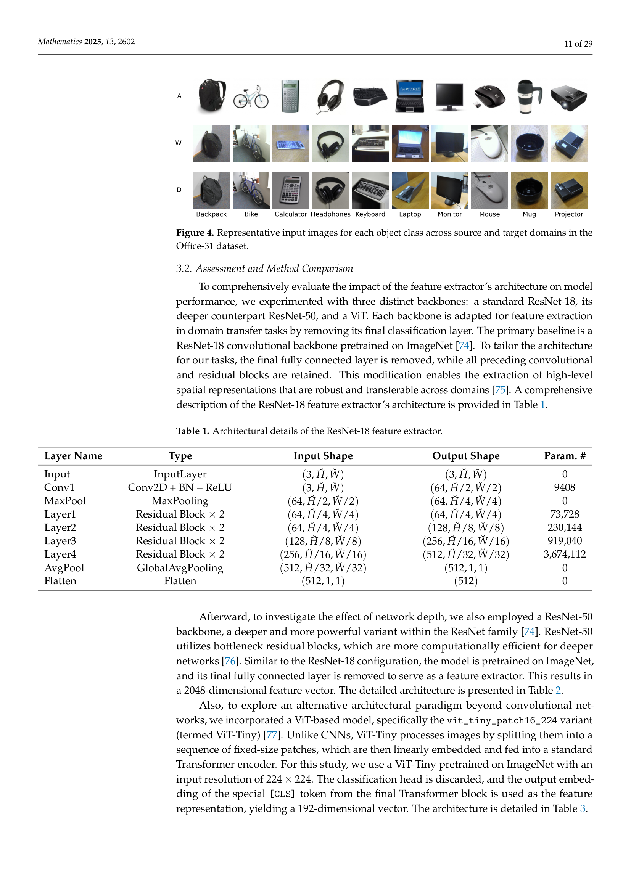

### Extraction assessment
- **Confidence:** 0.65 (below the configured 0.85 threshold; human review required).
- One or more equation candidates are ambiguous in raw extraction. Embedded images require visual review; captions remain page-level text evidence only.

### Raw extracted text
```
Mathematics 2025, 13, 2602
11 of 29
A
W
Backpack
D
Bike
Calculator Headphones Keyboard
Laptop
Monitor
Mouse
Mug
Projector
Figure 4. Representative input images for each object class across source and target domains in the
Office-31 dataset.
3.2. Assessment and Method Comparison
To comprehensively evaluate the impact of the feature extractor’s architecture on model
performance, we experimented with three distinct backbones: a standard ResNet-18, its
deeper counterpart ResNet-50, and a ViT. Each backbone is adapted for feature extraction
in domain transfer tasks by removing its final classification layer. The primary baseline is a
ResNet-18 convolutional backbone pretrained on ImageNet [74]. To tailor the architecture
for our tasks, the final fully connected layer is removed, while all preceding convolutional
and residual blocks are retained. This modification enables the extraction of high-level
spatial representations that are robust and transferable across domains [75]. A comprehensive
description of the ResNet-18 feature extractor’s architecture is provided in Table 1.
Table 1. Architectural details of the ResNet-18 feature extractor.
Layer Name
Type
Input Shape
Output Shape
Param. #
Input
InputLayer
(3, ˘H, ˘W)
(3, ˘H, ˘W)
0
Conv1
Conv2D + BN + ReLU
(3, ˘H, ˘W)
(64, ˘H/2, ˘W/2)
9408
MaxPool
MaxPooling
(64, ˘H/2, ˘W/2)
(64, ˘H/4, ˘W/4)
0
Layer1
Residual Block × 2
(64, ˘H/4, ˘W/4)
(64, ˘H/4, ˘W/4)
73,728
Layer2
Residual Block × 2
(64, ˘H/4, ˘W/4)
(128, ˘H/8, ˘W/8)
230,144
Layer3
Residual Block × 2
(128, ˘H/8, ˘W/8)
(256, ˘H/16, ˘W/16)
919,040
Layer4
Residual Block × 2
(256, ˘H/16, ˘W/16)
(512, ˘H/32, ˘W/32)
3,674,112
AvgPool
GlobalAvgPooling
(512, ˘H/32, ˘W/32)
(512, 1, 1)
0
Flatten
Flatten
(512, 1, 1)
(512)
0
Afterward, to investigate the effect of network depth, we also employed a ResNet-50
backbone, a deeper and more powerful variant within the ResNet family [74]. ResNet-50
utilizes bottleneck residual blocks, which are more computationally efficient for deeper
networks [76]. Similar to the ResNet-18 configuration, the model is pretrained on ImageNet,
and its final fully connected layer is removed to serve as a feature extractor. This results in
a 2048-dimensional feature vector. The detailed architecture is presented in Table 2.
Also, to explore an alternative architectural paradigm beyond convolutional net-
works, we incorporated a ViT-based model, specifically the vit_tiny_patch16_224 variant
(termed ViT-Tiny) [77]. Unlike CNNs, ViT-Tiny processes images by splitting them into a
sequence of fixed-size patches, which are then linearly embedded and fed into a standard
Transformer encoder. For this study, we use a ViT-Tiny pretrained on ImageNet with an
input resolution of 224 × 224. The classification head is discarded, and the output embed-
ding of the special [CLS] token from the final Transformer block is used as the feature
representation, yielding a 192-dimensional vector. The architecture is detailed in Table 3.

```

### Textual figure-caption evidence
- Figure 4. Representative input images for each object class across source and target domains in the
- Captions are page-level text evidence and are not associated with embedded images.

### Equation candidates
- `page-011-equation-001` — review_required (confidence 0.45; page 11).
```
Residual Block × 2
```
- `page-011-equation-002` — review_required (confidence 0.45; page 11).
```
Residual Block × 2
```
- `page-011-equation-003` — review_required (confidence 0.45; page 11).
```
Residual Block × 2
```
- `page-011-equation-004` — review_required (confidence 0.45; page 11).
```
Residual Block × 2
```
- `page-011-equation-005` — review_required (confidence 0.45; page 11).
```
works, we incorporated a ViT-based model, specifically the vit_tiny_patch16_224 variant
```
- `page-011-equation-006` — review_required (confidence 0.45; page 11).
```
input resolution of 224 × 224. The classification head is discarded, and the output embed-
```

### Embedded images
- `page-011-image-001` — embedded image metadata: 175 × 175 px, xref 470; visual review required.
- `page-011-image-002` — embedded image metadata: 175 × 175 px, xref 471; visual review required.
- `page-011-image-003` — embedded image metadata: 175 × 175 px, xref 472; visual review required.
- `page-011-image-004` — embedded image metadata: 175 × 175 px, xref 473; visual review required.
- `page-011-image-005` — embedded image metadata: 175 × 175 px, xref 474; visual review required.
- `page-011-image-006` — embedded image metadata: 175 × 175 px, xref 475; visual review required.
- `page-011-image-007` — embedded image metadata: 175 × 175 px, xref 476; visual review required.
- `page-011-image-008` — embedded image metadata: 175 × 175 px, xref 477; visual review required.
- `page-011-image-009` — embedded image metadata: 175 × 175 px, xref 478; visual review required.
- `page-011-image-010` — embedded image metadata: 175 × 175 px, xref 479; visual review required.
- `page-011-image-011` — embedded image metadata: 175 × 175 px, xref 480; visual review required.
- `page-011-image-012` — embedded image metadata: 175 × 175 px, xref 481; visual review required.
- `page-011-image-013` — embedded image metadata: 175 × 175 px, xref 482; visual review required.
- `page-011-image-014` — embedded image metadata: 175 × 175 px, xref 483; visual review required.
- `page-011-image-015` — embedded image metadata: 175 × 175 px, xref 484; visual review required.
- `page-011-image-016` — embedded image metadata: 175 × 175 px, xref 485; visual review required.
- `page-011-image-017` — embedded image metadata: 175 × 175 px, xref 486; visual review required.
- `page-011-image-018` — embedded image metadata: 175 × 175 px, xref 487; visual review required.
- `page-011-image-019` — embedded image metadata: 175 × 175 px, xref 488; visual review required.
- `page-011-image-020` — embedded image metadata: 175 × 175 px, xref 489; visual review required.
- `page-011-image-021` — embedded image metadata: 175 × 175 px, xref 490; visual review required.
- `page-011-image-022` — embedded image metadata: 175 × 175 px, xref 491; visual review required.
- `page-011-image-023` — embedded image metadata: 175 × 175 px, xref 492; visual review required.
- `page-011-image-024` — embedded image metadata: 175 × 175 px, xref 493; visual review required.
- `page-011-image-025` — embedded image metadata: 175 × 175 px, xref 494; visual review required.
- `page-011-image-026` — embedded image metadata: 175 × 175 px, xref 495; visual review required.
- `page-011-image-027` — embedded image metadata: 175 × 175 px, xref 496; visual review required.
- `page-011-image-028` — embedded image metadata: 175 × 175 px, xref 497; visual review required.
- `page-011-image-029` — embedded image metadata: 175 × 175 px, xref 498; visual review required.
- `page-011-image-030` — embedded image metadata: 175 × 175 px, xref 499; visual review required.

## Page 12
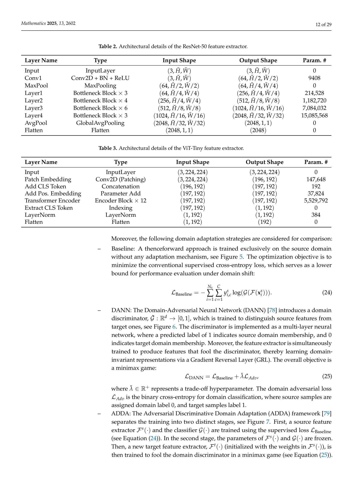

### Extraction assessment
- **Confidence:** 0.65 (below the configured 0.85 threshold; human review required).
- One or more equation candidates are ambiguous in raw extraction.

### Raw extracted text
```
Mathematics 2025, 13, 2602
12 of 29
Table 2. Architectural details of the ResNet-50 feature extractor.
Layer Name
Type
Input Shape
Output Shape
Param. #
Input
InputLayer
(3, ˘H, ˘W)
(3, ˘H, ˘W)
0
Conv1
Conv2D + BN + ReLU
(3, ˘H, ˘W)
(64, ˘H/2, ˘W/2)
9408
MaxPool
MaxPooling
(64, ˘H/2, ˘W/2)
(64, ˘H/4, ˘W/4)
0
Layer1
Bottleneck Block × 3
(64, ˘H/4, ˘W/4)
(256, ˘H/4, ˘W/4)
214,528
Layer2
Bottleneck Block × 4
(256, ˘H/4, ˘W/4)
(512, ˘H/8, ˘W/8)
1,182,720
Layer3
Bottleneck Block × 6
(512, ˘H/8, ˘W/8)
(1024, ˘H/16, ˘W/16)
7,084,032
Layer4
Bottleneck Block × 3
(1024, ˘H/16, ˘W/16)
(2048, ˘H/32, ˘W/32)
15,085,568
AvgPool
GlobalAvgPooling
(2048, ˘H/32, ˘W/32)
(2048, 1, 1)
0
Flatten
Flatten
(2048, 1, 1)
(2048)
0
Table 3. Architectural details of the ViT-Tiny feature extractor.
Layer Name
Type
Input Shape
Output Shape
Param. #
Input
InputLayer
(3, 224, 224)
(3, 224, 224)
0
Patch Embedding
Conv2D (Patching)
(3, 224, 224)
(196, 192)
147,648
Add CLS Token
Concatenation
(196, 192)
(197, 192)
192
Add Pos. Embedding
Parameter Add
(197, 192)
(197, 192)
37,824
Transformer Encoder
Encoder Block × 12
(197, 192)
(197, 192)
5,529,792
Extract CLS Token
Indexing
(197, 192)
(1, 192)
0
LayerNorm
LayerNorm
(1, 192)
(1, 192)
384
Flatten
Flatten
(1, 192)
(192)
0
Moreover, the following domain adaptation strategies are considered for comparison:
–
Baseline: A thenceforward approach is trained exclusively on the source domain
without any adaptation mechanism, see Figure 5. The optimization objective is to
minimize the conventional supervised cross-entropy loss, which serves as a lower
bound for performance evaluation under domain shift:
LBaseline = −
Ns
∑
i=1
C
∑
c=1
ys
i,c log(G(F(xs
i ))).
(24)
–
DANN: The Domain-Adversarial Neural Network (DANN) [78] introduces a domain
discriminator, ˜G : Rd →[0, 1], which is trained to distinguish source features from
target ones, see Figure 6. The discriminator is implemented as a multi-layer neural
network, where a predicted label of 1 indicates source domain membership, and 0
indicates target domain membership. Moreover, the feature extractor is simultaneously
trained to produce features that fool the discriminator, thereby learning domain-
invariant representations via a Gradient Reversal Layer (GRL). The overall objective is
a minimax game:
LDANN = LBaseline + ˘λLAdv,
(25)
where ˘λ ∈R+ represents a trade-off hyperparameter. The domain adversarial loss
LAdv is the binary cross-entropy for domain classification, where source samples are
assigned domain label 0, and target samples label 1.
–
ADDA: The Adversarial Discriminative Domain Adaptation (ADDA) framework [79]
separates the training into two distinct stages, see Figure 7. First, a source feature
extractor F s(·) and the classifier G(·) are trained using the supervised loss LBaseline
(see Equation (24)). In the second stage, the parameters of F s(·) and G(·) are frozen.
Then, a new target feature extractor, F t(·) (initialized with the weights in F s(·)), is
then trained to fool the domain discriminator in a minimax game (see Equation (25)).

```

### Equation candidates
- `page-012-equation-001` — review_required (confidence 0.45; page 12).
```
Bottleneck Block × 3
```
- `page-012-equation-002` — review_required (confidence 0.45; page 12).
```
Bottleneck Block × 4
```
- `page-012-equation-003` — review_required (confidence 0.45; page 12).
```
Bottleneck Block × 6
```
- `page-012-equation-004` — review_required (confidence 0.45; page 12).
```
Bottleneck Block × 3
```
- `page-012-equation-005` — review_required (confidence 0.45; page 12).
```
Encoder Block × 12
```
- `page-012-equation-006` — raw_text_preserved (confidence 0.98; page 12).
```
LBaseline = −
```
- `page-012-equation-007` — review_required (confidence 0.45; page 12).
```
∑
```
- `page-012-equation-008` — raw_text_preserved (confidence 0.98; page 12).
```
i=1
```
- `page-012-equation-009` — review_required (confidence 0.45; page 12).
```
∑
```
- `page-012-equation-010` — raw_text_preserved (confidence 0.98; page 12).
```
c=1
```
- `page-012-equation-011` — review_required (confidence 0.45; page 12).
```
LDANN = LBaseline + ˘λLAdv,
```
- `page-012-equation-012` — review_required (confidence 0.45; page 12).
```
where ˘λ ∈R+ represents a trade-off hyperparameter. The domain adversarial loss
```

## Page 13
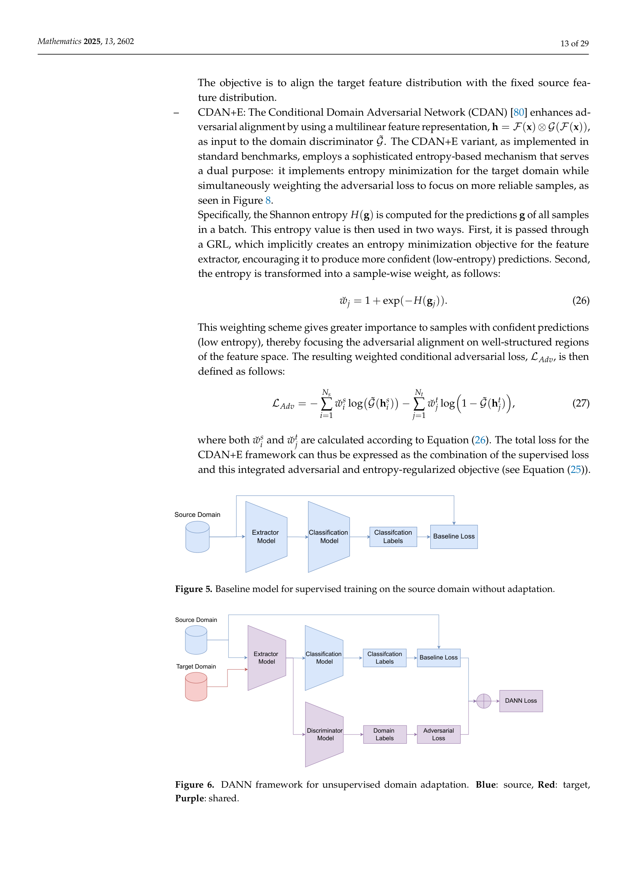

### Extraction assessment
- **Confidence:** 0.65 (below the configured 0.85 threshold; human review required).
- One or more equation candidates are ambiguous in raw extraction.

### Raw extracted text
```
Mathematics 2025, 13, 2602
13 of 29
The objective is to align the target feature distribution with the fixed source fea-
ture distribution.
–
CDAN+E: The Conditional Domain Adversarial Network (CDAN) [80] enhances ad-
versarial alignment by using a multilinear feature representation, h = F(x) ⊗G(F(x)),
as input to the domain discriminator ˜G. The CDAN+E variant, as implemented in
standard benchmarks, employs a sophisticated entropy-based mechanism that serves
a dual purpose: it implements entropy minimization for the target domain while
simultaneously weighting the adversarial loss to focus on more reliable samples, as
seen in Figure 8.
Specifically, the Shannon entropy H(g) is computed for the predictions g of all samples
in a batch. This entropy value is then used in two ways. First, it is passed through
a GRL, which implicitly creates an entropy minimization objective for the feature
extractor, encouraging it to produce more confident (low-entropy) predictions. Second,
the entropy is transformed into a sample-wise weight, as follows:
˘wj = 1 + exp(−H(gj)).
(26)
This weighting scheme gives greater importance to samples with confident predictions
(low entropy), thereby focusing the adversarial alignment on well-structured regions
of the feature space. The resulting weighted conditional adversarial loss, LAdv, is then
defined as follows:
LAdv = −
Ns
∑
i=1
˘ws
i log
 ˜G(hs
i )
 −
Nt
∑
j=1
˘wt
j log

1 −˜G(ht
j)

,
(27)
where both ˘ws
i and ˘wt
j are calculated according to Equation (26). The total loss for the
CDAN+E framework can thus be expressed as the combination of the supervised loss
and this integrated adversarial and entropy-regularized objective (see Equation (25)).
Source Domain
Baseline Loss
Classifcation
Labels
Extractor
 Model
Classification 
Model
Figure 5. Baseline model for supervised training on the source domain without adaptation.
Source Domain
Baseline Loss
Classifcation
Labels
Extractor
 Model
Classification 
Model
Target Domain
Discriminator 
Model
Domain 
Labels
Adversarial
Loss
DANN Loss
Figure 6. DANN framework for unsupervised domain adaptation. Blue: source, Red: target,
Purple: shared.

```

### Textual figure-caption evidence
- Figure 5. Baseline model for supervised training on the source domain without adaptation.
- Figure 6. DANN framework for unsupervised domain adaptation. Blue: source, Red: target,
- Captions are page-level text evidence and are not associated with embedded images.

### Equation candidates
- `page-013-equation-001` — review_required (confidence 0.45; page 13).
```
versarial alignment by using a multilinear feature representation, h = F(x) ⊗G(F(x)),
```
- `page-013-equation-002` — review_required (confidence 0.45; page 13).
```
˘wj = 1 + exp(−H(gj)).
```
- `page-013-equation-003` — raw_text_preserved (confidence 0.98; page 13).
```
LAdv = −
```
- `page-013-equation-004` — review_required (confidence 0.45; page 13).
```
∑
```
- `page-013-equation-005` — raw_text_preserved (confidence 0.98; page 13).
```
i=1
```
- `page-013-equation-006` — review_required (confidence 0.45; page 13).
```
∑
```
- `page-013-equation-007` — raw_text_preserved (confidence 0.98; page 13).
```
j=1
```

## Page 14
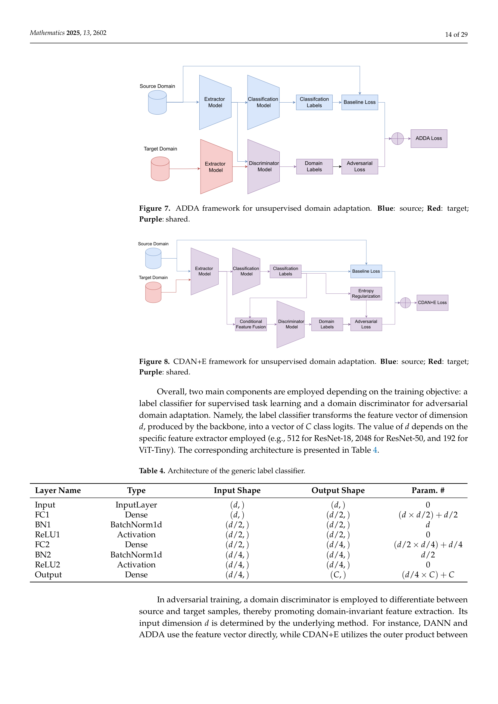

### Extraction assessment
- **Confidence:** 0.65 (below the configured 0.85 threshold; human review required).
- One or more equation candidates are ambiguous in raw extraction.

### Raw extracted text
```
Mathematics 2025, 13, 2602
14 of 29
Source Domain
Baseline Loss
Classifcation
Labels
Extractor
 Model
Classification 
Model
Target Domain
Discriminator 
Model
Domain 
Labels
Adversarial
Loss
ADDA Loss
Extractor
 Model
Figure 7. ADDA framework for unsupervised domain adaptation. Blue: source; Red: target;
Purple: shared.
Source Domain
Baseline Loss
Classifcation
Labels
Extractor
 Model
Classification 
Model
Target Domain
Discriminator 
Model
Domain 
Labels
Adversarial
Loss
CDAN+E Loss
Entropy
Regularization
Conditional
Feature Fusion
Figure 8. CDAN+E framework for unsupervised domain adaptation. Blue: source; Red: target;
Purple: shared.
Overall, two main components are employed depending on the training objective: a
label classifier for supervised task learning and a domain discriminator for adversarial
domain adaptation. Namely, the label classifier transforms the feature vector of dimension
d, produced by the backbone, into a vector of C class logits. The value of d depends on the
specific feature extractor employed (e.g., 512 for ResNet-18, 2048 for ResNet-50, and 192 for
ViT-Tiny). The corresponding architecture is presented in Table 4.
Table 4. Architecture of the generic label classifier.
Layer Name
Type
Input Shape
Output Shape
Param. #
Input
InputLayer
(d, )
(d, )
0
FC1
Dense
(d, )
(d/2, )
(d × d/2) + d/2
BN1
BatchNorm1d
(d/2, )
(d/2, )
d
ReLU1
Activation
(d/2, )
(d/2, )
0
FC2
Dense
(d/2, )
(d/4, )
(d/2 × d/4) + d/4
BN2
BatchNorm1d
(d/4, )
(d/4, )
d/2
ReLU2
Activation
(d/4, )
(d/4, )
0
Output
Dense
(d/4, )
(C, )
(d/4 × C) + C
In adversarial training, a domain discriminator is employed to differentiate between
source and target samples, thereby promoting domain-invariant feature extraction. Its
input dimension d is determined by the underlying method. For instance, DANN and
ADDA use the feature vector directly, while CDAN+E utilizes the outer product between

```

### Textual figure-caption evidence
- Figure 7. ADDA framework for unsupervised domain adaptation. Blue: source; Red: target;
- Figure 8. CDAN+E framework for unsupervised domain adaptation. Blue: source; Red: target;
- Captions are page-level text evidence and are not associated with embedded images.

### Equation candidates
- `page-014-equation-001` — review_required (confidence 0.45; page 14).
```
(d × d/2) + d/2
```
- `page-014-equation-002` — review_required (confidence 0.45; page 14).
```
(d/2 × d/4) + d/4
```
- `page-014-equation-003` — review_required (confidence 0.45; page 14).
```
(d/4 × C) + C
```

## Page 15
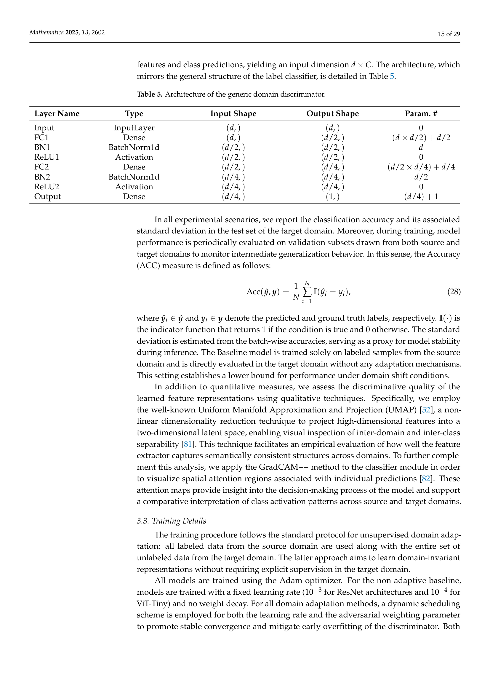

### Extraction assessment
- **Confidence:** 0.65 (below the configured 0.85 threshold; human review required).
- One or more equation candidates are ambiguous in raw extraction.

### Raw extracted text
```
Mathematics 2025, 13, 2602
15 of 29
features and class predictions, yielding an input dimension d × C. The architecture, which
mirrors the general structure of the label classifier, is detailed in Table 5.
Table 5. Architecture of the generic domain discriminator.
Layer Name
Type
Input Shape
Output Shape
Param. #
Input
InputLayer
(d, )
(d, )
0
FC1
Dense
(d, )
(d/2, )
(d × d/2) + d/2
BN1
BatchNorm1d
(d/2, )
(d/2, )
d
ReLU1
Activation
(d/2, )
(d/2, )
0
FC2
Dense
(d/2, )
(d/4, )
(d/2 × d/4) + d/4
BN2
BatchNorm1d
(d/4, )
(d/4, )
d/2
ReLU2
Activation
(d/4, )
(d/4, )
0
Output
Dense
(d/4, )
(1, )
(d/4) + 1
In all experimental scenarios, we report the classification accuracy and its associated
standard deviation in the test set of the target domain. Moreover, during training, model
performance is periodically evaluated on validation subsets drawn from both source and
target domains to monitor intermediate generalization behavior. In this sense, the Accuracy
(ACC) measure is defined as follows:
Acc( ˆy, y) = 1
N
N
∑
i=1
I( ˆyi = yi),
(28)
where ˆyi ∈ˆy and yi ∈y denote the predicted and ground truth labels, respectively. I(·) is
the indicator function that returns 1 if the condition is true and 0 otherwise. The standard
deviation is estimated from the batch-wise accuracies, serving as a proxy for model stability
during inference. The Baseline model is trained solely on labeled samples from the source
domain and is directly evaluated in the target domain without any adaptation mechanisms.
This setting establishes a lower bound for performance under domain shift conditions.
In addition to quantitative measures, we assess the discriminative quality of the
learned feature representations using qualitative techniques. Specifically, we employ
the well-known Uniform Manifold Approximation and Projection (UMAP) [52], a non-
linear dimensionality reduction technique to project high-dimensional features into a
two-dimensional latent space, enabling visual inspection of inter-domain and inter-class
separability [81]. This technique facilitates an empirical evaluation of how well the feature
extractor captures semantically consistent structures across domains. To further comple-
ment this analysis, we apply the GradCAM++ method to the classifier module in order
to visualize spatial attention regions associated with individual predictions [82]. These
attention maps provide insight into the decision-making process of the model and support
a comparative interpretation of class activation patterns across source and target domains.
3.3. Training Details
The training procedure follows the standard protocol for unsupervised domain adap-
tation: all labeled data from the source domain are used along with the entire set of
unlabeled data from the target domain. The latter approach aims to learn domain-invariant
representations without requiring explicit supervision in the target domain.
All models are trained using the Adam optimizer. For the non-adaptive baseline,
models are trained with a fixed learning rate (10−3 for ResNet architectures and 10−4 for
ViT-Tiny) and no weight decay. For all domain adaptation methods, a dynamic scheduling
scheme is employed for both the learning rate and the adversarial weighting parameter
to promote stable convergence and mitigate early overfitting of the discriminator. Both

```

### Equation candidates
- `page-015-equation-001` — review_required (confidence 0.45; page 15).
```
features and class predictions, yielding an input dimension d × C. The architecture, which
```
- `page-015-equation-002` — review_required (confidence 0.45; page 15).
```
(d × d/2) + d/2
```
- `page-015-equation-003` — review_required (confidence 0.45; page 15).
```
(d/2 × d/4) + d/4
```
- `page-015-equation-004` — raw_text_preserved (confidence 0.98; page 15).
```
Acc( ˆy, y) = 1
```
- `page-015-equation-005` — review_required (confidence 0.45; page 15).
```
∑
```
- `page-015-equation-006` — raw_text_preserved (confidence 0.98; page 15).
```
i=1
```
- `page-015-equation-007` — review_required (confidence 0.45; page 15).
```
I( ˆyi = yi),
```
- `page-015-equation-008` — review_required (confidence 0.45; page 15).
```
where ˆyi ∈ˆy and yi ∈y denote the predicted and ground truth labels, respectively. I(·) is
```

## Page 16
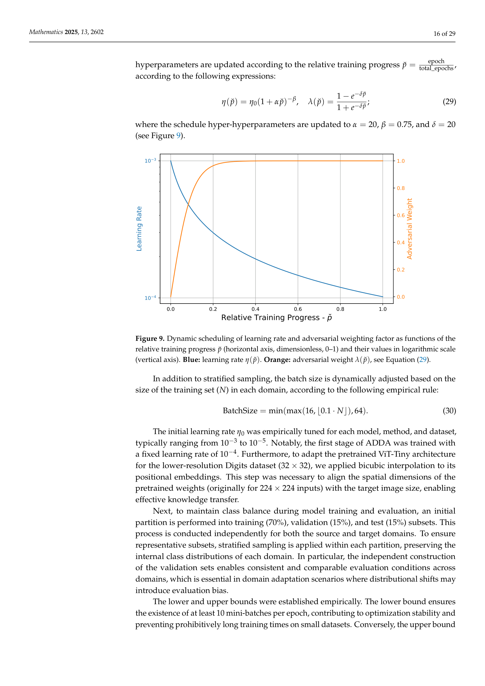

### Extraction assessment
- **Confidence:** 0.65 (below the configured 0.85 threshold; human review required).
- One or more equation candidates are ambiguous in raw extraction.

### Raw extracted text
```
Mathematics 2025, 13, 2602
16 of 29
hyperparameters are updated according to the relative training progress ˘p =
epoch
total_epochs,
according to the following expressions:
η( ˘p) = η0(1 + α ˘p)−β,
λ( ˘p) = 1 −e−δ ˘p
1 + e−δ ˘p ;
(29)
where the schedule hyper-hyperparameters are updated to α = 20, β = 0.75, and δ = 20
(see Figure 9).
0.0
0.2
0.4
0.6
0.8
1.0
Relative Training Progress - p
10
4
10
3
Learning Rate
0.0
0.2
0.4
0.6
0.8
1.0
Adversarial Weight
Figure 9. Dynamic scheduling of learning rate and adversarial weighting factor as functions of the
relative training progress ˘p (horizontal axis, dimensionless, 0–1) and their values in logarithmic scale
(vertical axis). Blue: learning rate η( ˘p). Orange: adversarial weight λ( ˘p), see Equation (29).
In addition to stratified sampling, the batch size is dynamically adjusted based on the
size of the training set (N) in each domain, according to the following empirical rule:
BatchSize = min(max(16, ⌊0.1 · N⌋), 64).
(30)
The initial learning rate η0 was empirically tuned for each model, method, and dataset,
typically ranging from 10−3 to 10−5. Notably, the first stage of ADDA was trained with
a fixed learning rate of 10−4. Furthermore, to adapt the pretrained ViT-Tiny architecture
for the lower-resolution Digits dataset (32 × 32), we applied bicubic interpolation to its
positional embeddings. This step was necessary to align the spatial dimensions of the
pretrained weights (originally for 224 × 224 inputs) with the target image size, enabling
effective knowledge transfer.
Next, to maintain class balance during model training and evaluation, an initial
partition is performed into training (70%), validation (15%), and test (15%) subsets. This
process is conducted independently for both the source and target domains. To ensure
representative subsets, stratified sampling is applied within each partition, preserving the
internal class distributions of each domain. In particular, the independent construction
of the validation sets enables consistent and comparable evaluation conditions across
domains, which is essential in domain adaptation scenarios where distributional shifts may
introduce evaluation bias.
The lower and upper bounds were established empirically. The lower bound ensures
the existence of at least 10 mini-batches per epoch, contributing to optimization stability and
preventing prohibitively long training times on small datasets. Conversely, the upper bound

```

### Textual figure-caption evidence
- Figure 9. Dynamic scheduling of learning rate and adversarial weighting factor as functions of the
- Captions are page-level text evidence and are not associated with embedded images.

### Equation candidates
- `page-016-equation-001` — review_required (confidence 0.45; page 16).
```
hyperparameters are updated according to the relative training progress ˘p =
```
- `page-016-equation-002` — review_required (confidence 0.45; page 16).
```
total_epochs,
```
- `page-016-equation-003` — review_required (confidence 0.45; page 16).
```
η( ˘p) = η0(1 + α ˘p)−β,
```
- `page-016-equation-004` — raw_text_preserved (confidence 0.98; page 16).
```
λ( ˘p) = 1 −e−δ ˘p
```
- `page-016-equation-005` — review_required (confidence 0.45; page 16).
```
where the schedule hyper-hyperparameters are updated to α = 20, β = 0.75, and δ = 20
```
- `page-016-equation-006` — raw_text_preserved (confidence 0.98; page 16).
```
BatchSize = min(max(16, ⌊0.1 · N⌋), 64).
```
- `page-016-equation-007` — review_required (confidence 0.45; page 16).
```
for the lower-resolution Digits dataset (32 × 32), we applied bicubic interpolation to its
```
- `page-016-equation-008` — review_required (confidence 0.45; page 16).
```
pretrained weights (originally for 224 × 224 inputs) with the target image size, enabling
```

## Page 17
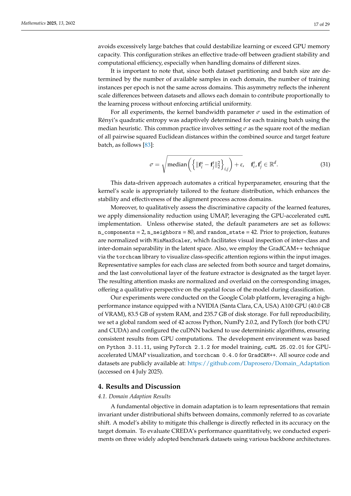

### Extraction assessment
- **Confidence:** 0.65 (below the configured 0.85 threshold; human review required).
- One or more equation candidates are ambiguous in raw extraction.

### Raw extracted text
```
Mathematics 2025, 13, 2602
17 of 29
avoids excessively large batches that could destabilize learning or exceed GPU memory
capacity. This configuration strikes an effective trade-off between gradient stability and
computational efficiency, especially when handling domains of different sizes.
It is important to note that, since both dataset partitioning and batch size are de-
termined by the number of available samples in each domain, the number of training
instances per epoch is not the same across domains. This asymmetry reflects the inherent
scale differences between datasets and allows each domain to contribute proportionally to
the learning process without enforcing artificial uniformity.
For all experiments, the kernel bandwidth parameter σ used in the estimation of
Rényi’s quadratic entropy was adaptively determined for each training batch using the
median heuristic. This common practice involves setting σ as the square root of the median
of all pairwise squared Euclidean distances within the combined source and target feature
batch, as follows [83]:
σ =
s
median
n
∥fs
i −ft
j∥2
2
o
i,j

+ ε,
fs
i, ft
j ∈Rd.
(31)
This data-driven approach automates a critical hyperparameter, ensuring that the
kernel’s scale is appropriately tailored to the feature distribution, which enhances the
stability and effectiveness of the alignment process across domains.
Moreover, to qualitatively assess the discriminative capacity of the learned features,
we apply dimensionality reduction using UMAP, leveraging the GPU-accelerated cuML
implementation.
Unless otherwise stated, the default parameters are set as follows:
n_components = 2, n_neighbors = 80, and random_state = 42. Prior to projection, features
are normalized with MinMaxScaler, which facilitates visual inspection of inter-class and
inter-domain separability in the latent space. Also, we employ the GradCAM++ technique
via the torchcam library to visualize class-specific attention regions within the input images.
Representative samples for each class are selected from both source and target domains,
and the last convolutional layer of the feature extractor is designated as the target layer.
The resulting attention masks are normalized and overlaid on the corresponding images,
offering a qualitative perspective on the spatial focus of the model during classification.
Our experiments were conducted on the Google Colab platform, leveraging a high-
performance instance equipped with a NVIDIA (Santa Clara, CA, USA) A100 GPU (40.0 GB
of VRAM), 83.5 GB of system RAM, and 235.7 GB of disk storage. For full reproducibility,
we set a global random seed of 42 across Python, NumPy 2.0.2, and PyTorch (for both CPU
and CUDA) and configured the cuDNN backend to use deterministic algorithms, ensuring
consistent results from GPU computations. The development environment was based
on Python 3.11.11, using PyTorch 2.1.2 for model training, cuML 25.02.01 for GPU-
accelerated UMAP visualization, and torchcam 0.4.0 for GradCAM++. All source code and
datasets are publicly available at: https://github.com/Daprosero/Domain_Adaptation
(accessed on 4 July 2025).
4. Results and Discussion
4.1. Domain Adaption Results
A fundamental objective in domain adaptation is to learn representations that remain
invariant under distributional shifts between domains, commonly referred to as covariate
shift. A model’s ability to mitigate this challenge is directly reflected in its accuracy on the
target domain. To evaluate CREDA’s performance quantitatively, we conducted experi-
ments on three widely adopted benchmark datasets using various backbone architectures.

```

### Equation candidates
- `page-017-equation-001` — review_required (confidence 0.45; page 17).
```
σ =
```
- `page-017-equation-002` — raw_text_preserved (confidence 0.98; page 17).
```
j ∈Rd.
```
- `page-017-equation-003` — raw_text_preserved (confidence 0.98; page 17).
```
n_components = 2, n_neighbors = 80, and random_state = 42. Prior to projection, features
```
- `page-017-equation-004` — review_required (confidence 0.45; page 17).
```
datasets are publicly available at: https://github.com/Daprosero/Domain_Adaptation
```

## Page 18
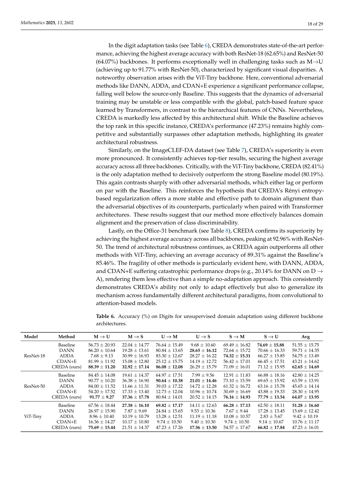

### Extraction assessment
- **Confidence:** 0.65 (below the configured 0.85 threshold; human review required).
- One or more equation candidates are ambiguous in raw extraction.

### Raw extracted text
```
Mathematics 2025, 13, 2602
18 of 29
In the digit adaptation tasks (see Table 6), CREDA demonstrates state-of-the-art perfor-
mance, achieving the highest average accuracy with both ResNet-18 (62.65%) and ResNet-50
(64.07%) backbones. It performs exceptionally well in challenging tasks such as M→U
(achieving up to 91.77% with ResNet-50), characterized by significant visual disparities. A
noteworthy observation arises with the ViT-Tiny backbone. Here, conventional adversarial
methods like DANN, ADDA, and CDAN+E experience a significant performance collapse,
falling well below the source-only Baseline. This suggests that the dynamics of adversarial
training may be unstable or less compatible with the global, patch-based feature space
learned by Transformers, in contrast to the hierarchical features of CNNs. Nevertheless,
CREDA is markedly less affected by this architectural shift. While the Baseline achieves
the top rank in this specific instance, CREDA’s performance (47.23%) remains highly com-
petitive and substantially surpasses other adaptation methods, highlighting its greater
architectural robustness.
Similarly, on the ImageCLEF-DA dataset (see Table 7), CREDA’s superiority is even
more pronounced. It consistently achieves top-tier results, securing the highest average
accuracy across all three backbones. Critically, with the ViT-Tiny backbone, CREDA (82.41%)
is the only adaptation method to decisively outperform the strong Baseline model (80.19%).
This again contrasts sharply with other adversarial methods, which either lag or perform
on par with the Baseline. This reinforces the hypothesis that CREDA’s Rényi entropy-
based regularization offers a more stable and effective path to domain alignment than
the adversarial objectives of its counterparts, particularly when paired with Transformer
architectures. These results suggest that our method more effectively balances domain
alignment and the preservation of class discriminability.
Lastly, on the Office-31 benchmark (see Table 8), CREDA confirms its superiority by
achieving the highest average accuracy across all backbones, peaking at 92.96% with ResNet-
50. The trend of architectural robustness continues, as CREDA again outperforms all other
methods with ViT-Tiny, achieving an average accuracy of 89.31% against the Baseline’s
85.46%. The fragility of other methods is particularly evident here, with DANN, ADDA,
and CDAN+E suffering catastrophic performance drops (e.g., 20.14% for DANN on D →
A), rendering them less effective than a simple no-adaptation approach. This consistently
demonstrates CREDA’s ability not only to adapt effectively but also to generalize its
mechanism across fundamentally different architectural paradigms, from convolutional to
attention-based models.
Table 6. Accuracy (%) on Digits for unsupervised domain adaptation using different backbone
architectures.
Model
Method
M →U
M →S
U →M
U →S
S →M
S →U
Avg
ResNet-18
Baseline
56.73 ± 20.93
22.04 ± 14.77
76.64 ± 15.49
9.68 ± 10.60
69.49 ± 16.82
74.69 ± 15.88
51.55 ± 15.75
DANN
86.20 ± 10.64
19.28 ± 13.61
80.84 ± 13.65
28.65 ± 16.12
72.64 ± 15.72
70.66 ± 16.33
59.71 ± 14.35
ADDA
7.68 ± 9.13
30.99 ± 16.93
83.30 ± 12.67
28.27 ± 16.22
74.32 ± 15.31
66.27 ± 15.85
54.75 ± 13.49
CDAN+E
81.99 ± 11.92
15.08 ± 12.80
25.12 ± 15.75
14.19 ± 12.72
56.42 ± 17.01
66.45 ± 17.51
43.21 ± 14.62
CREDA (ours)
88.39 ± 11.20
32.92 ± 17.14
86.08 ± 12.08
26.29 ± 15.79
71.09 ± 16.01
71.12 ± 15.95
62.65 ± 14.69
ResNet-50
Baseline
84.45 ± 14.08
19.61 ± 14.37
64.97 ± 17.51
7.99 ± 9.56
12.91 ± 11.83
66.88 ± 18.16
42.80 ± 14.25
DANN
90.77 ± 10.20
36.38 ± 16.90
90.64 ± 10.38
21.01 ± 14.46
73.10 ± 15.59
69.65 ± 15.92
63.59 ± 13.91
ADDA
84.00 ± 11.52
11.66 ± 11.31
39.03 ± 17.22
14.72 ± 12.28
61.32 ± 16.72
63.16 ± 15.78
45.65 ± 14.14
CDAN+E
54.20 ± 17.52
17.33 ± 13.40
12.73 ± 12.04
10.96 ± 10.74
30.69 ± 16.69
43.88 ± 19.33
28.30 ± 14.95
CREDA (ours)
91.77 ± 9.27
37.36 ± 17.78
80.84 ± 14.01
20.52 ± 14.15
76.16 ± 14.93
77.79 ± 13.54
64.07 ± 13.95
ViT-Tiny
Baseline
67.56 ± 18.44
27.38 ± 16.10
69.82 ± 17.17
14.11 ± 12.63
66.28 ± 17.13
62.50 ± 18.11
51.28 ± 16.60
DANN
26.97 ± 15.90
7.87 ± 9.69
24.84 ± 15.65
9.53 ± 10.36
7.67 ± 9.44
17.28 ± 13.45
15.69 ± 12.42
ADDA
8.96 ± 10.40
10.19 ± 10.79
13.28 ± 12.51
11.19 ± 11.18
10.08 ± 10.57
2.83 ± 5.67
9.42 ± 10.19
CDAN+E
16.36 ± 14.27
10.17 ± 10.80
9.74 ± 10.50
9.40 ± 10.30
9.74 ± 10.50
9.14 ± 10.67
10.76 ± 11.17
CREDA (ours)
75.69 ± 15.44
21.51 ± 14.37
47.23 ± 17.26
17.56 ± 13.50
54.57 ± 17.67
66.82 ± 17.84
47.23 ± 16.01

```

### Equation candidates
- `page-018-equation-001` — review_required (confidence 0.45; page 18).
```
56.73 ± 20.93
```
- `page-018-equation-002` — review_required (confidence 0.45; page 18).
```
22.04 ± 14.77
```
- `page-018-equation-003` — review_required (confidence 0.45; page 18).
```
76.64 ± 15.49
```
- `page-018-equation-004` — review_required (confidence 0.45; page 18).
```
9.68 ± 10.60
```
- `page-018-equation-005` — review_required (confidence 0.45; page 18).
```
69.49 ± 16.82
```
- `page-018-equation-006` — review_required (confidence 0.45; page 18).
```
74.69 ± 15.88
```
- `page-018-equation-007` — review_required (confidence 0.45; page 18).
```
51.55 ± 15.75
```
- `page-018-equation-008` — review_required (confidence 0.45; page 18).
```
86.20 ± 10.64
```
- `page-018-equation-009` — review_required (confidence 0.45; page 18).
```
19.28 ± 13.61
```
- `page-018-equation-010` — review_required (confidence 0.45; page 18).
```
80.84 ± 13.65
```
- `page-018-equation-011` — review_required (confidence 0.45; page 18).
```
28.65 ± 16.12
```
- `page-018-equation-012` — review_required (confidence 0.45; page 18).
```
72.64 ± 15.72
```
- `page-018-equation-013` — review_required (confidence 0.45; page 18).
```
70.66 ± 16.33
```
- `page-018-equation-014` — review_required (confidence 0.45; page 18).
```
59.71 ± 14.35
```
- `page-018-equation-015` — review_required (confidence 0.45; page 18).
```
7.68 ± 9.13
```
- `page-018-equation-016` — review_required (confidence 0.45; page 18).
```
30.99 ± 16.93
```
- `page-018-equation-017` — review_required (confidence 0.45; page 18).
```
83.30 ± 12.67
```
- `page-018-equation-018` — review_required (confidence 0.45; page 18).
```
28.27 ± 16.22
```
- `page-018-equation-019` — review_required (confidence 0.45; page 18).
```
74.32 ± 15.31
```
- `page-018-equation-020` — review_required (confidence 0.45; page 18).
```
66.27 ± 15.85
```
- `page-018-equation-021` — review_required (confidence 0.45; page 18).
```
54.75 ± 13.49
```
- `page-018-equation-022` — review_required (confidence 0.45; page 18).
```
81.99 ± 11.92
```
- `page-018-equation-023` — review_required (confidence 0.45; page 18).
```
15.08 ± 12.80
```
- `page-018-equation-024` — review_required (confidence 0.45; page 18).
```
25.12 ± 15.75
```
- `page-018-equation-025` — review_required (confidence 0.45; page 18).
```
14.19 ± 12.72
```
- `page-018-equation-026` — review_required (confidence 0.45; page 18).
```
56.42 ± 17.01
```
- `page-018-equation-027` — review_required (confidence 0.45; page 18).
```
66.45 ± 17.51
```
- `page-018-equation-028` — review_required (confidence 0.45; page 18).
```
43.21 ± 14.62
```
- `page-018-equation-029` — review_required (confidence 0.45; page 18).
```
88.39 ± 11.20
```
- `page-018-equation-030` — review_required (confidence 0.45; page 18).
```
32.92 ± 17.14
```
- `page-018-equation-031` — review_required (confidence 0.45; page 18).
```
86.08 ± 12.08
```
- `page-018-equation-032` — review_required (confidence 0.45; page 18).
```
26.29 ± 15.79
```
- `page-018-equation-033` — review_required (confidence 0.45; page 18).
```
71.09 ± 16.01
```
- `page-018-equation-034` — review_required (confidence 0.45; page 18).
```
71.12 ± 15.95
```
- `page-018-equation-035` — review_required (confidence 0.45; page 18).
```
62.65 ± 14.69
```
- `page-018-equation-036` — review_required (confidence 0.45; page 18).
```
84.45 ± 14.08
```
- `page-018-equation-037` — review_required (confidence 0.45; page 18).
```
19.61 ± 14.37
```
- `page-018-equation-038` — review_required (confidence 0.45; page 18).
```
64.97 ± 17.51
```
- `page-018-equation-039` — review_required (confidence 0.45; page 18).
```
7.99 ± 9.56
```
- `page-018-equation-040` — review_required (confidence 0.45; page 18).
```
12.91 ± 11.83
```
- `page-018-equation-041` — review_required (confidence 0.45; page 18).
```
66.88 ± 18.16
```
- `page-018-equation-042` — review_required (confidence 0.45; page 18).
```
42.80 ± 14.25
```
- `page-018-equation-043` — review_required (confidence 0.45; page 18).
```
90.77 ± 10.20
```
- `page-018-equation-044` — review_required (confidence 0.45; page 18).
```
36.38 ± 16.90
```
- `page-018-equation-045` — review_required (confidence 0.45; page 18).
```
90.64 ± 10.38
```
- `page-018-equation-046` — review_required (confidence 0.45; page 18).
```
21.01 ± 14.46
```
- `page-018-equation-047` — review_required (confidence 0.45; page 18).
```
73.10 ± 15.59
```
- `page-018-equation-048` — review_required (confidence 0.45; page 18).
```
69.65 ± 15.92
```
- `page-018-equation-049` — review_required (confidence 0.45; page 18).
```
63.59 ± 13.91
```
- `page-018-equation-050` — review_required (confidence 0.45; page 18).
```
84.00 ± 11.52
```
- `page-018-equation-051` — review_required (confidence 0.45; page 18).
```
11.66 ± 11.31
```
- `page-018-equation-052` — review_required (confidence 0.45; page 18).
```
39.03 ± 17.22
```
- `page-018-equation-053` — review_required (confidence 0.45; page 18).
```
14.72 ± 12.28
```
- `page-018-equation-054` — review_required (confidence 0.45; page 18).
```
61.32 ± 16.72
```
- `page-018-equation-055` — review_required (confidence 0.45; page 18).
```
63.16 ± 15.78
```
- `page-018-equation-056` — review_required (confidence 0.45; page 18).
```
45.65 ± 14.14
```
- `page-018-equation-057` — review_required (confidence 0.45; page 18).
```
54.20 ± 17.52
```
- `page-018-equation-058` — review_required (confidence 0.45; page 18).
```
17.33 ± 13.40
```
- `page-018-equation-059` — review_required (confidence 0.45; page 18).
```
12.73 ± 12.04
```
- `page-018-equation-060` — review_required (confidence 0.45; page 18).
```
10.96 ± 10.74
```
- `page-018-equation-061` — review_required (confidence 0.45; page 18).
```
30.69 ± 16.69
```
- `page-018-equation-062` — review_required (confidence 0.45; page 18).
```
43.88 ± 19.33
```
- `page-018-equation-063` — review_required (confidence 0.45; page 18).
```
28.30 ± 14.95
```
- `page-018-equation-064` — review_required (confidence 0.45; page 18).
```
91.77 ± 9.27
```
- `page-018-equation-065` — review_required (confidence 0.45; page 18).
```
37.36 ± 17.78
```
- `page-018-equation-066` — review_required (confidence 0.45; page 18).
```
80.84 ± 14.01
```
- `page-018-equation-067` — review_required (confidence 0.45; page 18).
```
20.52 ± 14.15
```
- `page-018-equation-068` — review_required (confidence 0.45; page 18).
```
76.16 ± 14.93
```
- `page-018-equation-069` — review_required (confidence 0.45; page 18).
```
77.79 ± 13.54
```
- `page-018-equation-070` — review_required (confidence 0.45; page 18).
```
64.07 ± 13.95
```
- `page-018-equation-071` — review_required (confidence 0.45; page 18).
```
67.56 ± 18.44
```
- `page-018-equation-072` — review_required (confidence 0.45; page 18).
```
27.38 ± 16.10
```
- `page-018-equation-073` — review_required (confidence 0.45; page 18).
```
69.82 ± 17.17
```
- `page-018-equation-074` — review_required (confidence 0.45; page 18).
```
14.11 ± 12.63
```
- `page-018-equation-075` — review_required (confidence 0.45; page 18).
```
66.28 ± 17.13
```
- `page-018-equation-076` — review_required (confidence 0.45; page 18).
```
62.50 ± 18.11
```
- `page-018-equation-077` — review_required (confidence 0.45; page 18).
```
51.28 ± 16.60
```
- `page-018-equation-078` — review_required (confidence 0.45; page 18).
```
26.97 ± 15.90
```
- `page-018-equation-079` — review_required (confidence 0.45; page 18).
```
7.87 ± 9.69
```
- `page-018-equation-080` — review_required (confidence 0.45; page 18).
```
24.84 ± 15.65
```
- `page-018-equation-081` — review_required (confidence 0.45; page 18).
```
9.53 ± 10.36
```
- `page-018-equation-082` — review_required (confidence 0.45; page 18).
```
7.67 ± 9.44
```
- `page-018-equation-083` — review_required (confidence 0.45; page 18).
```
17.28 ± 13.45
```
- `page-018-equation-084` — review_required (confidence 0.45; page 18).
```
15.69 ± 12.42
```
- `page-018-equation-085` — review_required (confidence 0.45; page 18).
```
8.96 ± 10.40
```
- `page-018-equation-086` — review_required (confidence 0.45; page 18).
```
10.19 ± 10.79
```
- `page-018-equation-087` — review_required (confidence 0.45; page 18).
```
13.28 ± 12.51
```
- `page-018-equation-088` — review_required (confidence 0.45; page 18).
```
11.19 ± 11.18
```
- `page-018-equation-089` — review_required (confidence 0.45; page 18).
```
10.08 ± 10.57
```
- `page-018-equation-090` — review_required (confidence 0.45; page 18).
```
2.83 ± 5.67
```
- `page-018-equation-091` — review_required (confidence 0.45; page 18).
```
9.42 ± 10.19
```
- `page-018-equation-092` — review_required (confidence 0.45; page 18).
```
16.36 ± 14.27
```
- `page-018-equation-093` — review_required (confidence 0.45; page 18).
```
10.17 ± 10.80
```
- `page-018-equation-094` — review_required (confidence 0.45; page 18).
```
9.74 ± 10.50
```
- `page-018-equation-095` — review_required (confidence 0.45; page 18).
```
9.40 ± 10.30
```
- `page-018-equation-096` — review_required (confidence 0.45; page 18).
```
9.74 ± 10.50
```
- `page-018-equation-097` — review_required (confidence 0.45; page 18).
```
9.14 ± 10.67
```
- `page-018-equation-098` — review_required (confidence 0.45; page 18).
```
10.76 ± 11.17
```
- `page-018-equation-099` — review_required (confidence 0.45; page 18).
```
75.69 ± 15.44
```
- `page-018-equation-100` — review_required (confidence 0.45; page 18).
```
21.51 ± 14.37
```
- `page-018-equation-101` — review_required (confidence 0.45; page 18).
```
47.23 ± 17.26
```
- `page-018-equation-102` — review_required (confidence 0.45; page 18).
```
17.56 ± 13.50
```
- `page-018-equation-103` — review_required (confidence 0.45; page 18).
```
54.57 ± 17.67
```
- `page-018-equation-104` — review_required (confidence 0.45; page 18).
```
66.82 ± 17.84
```
- `page-018-equation-105` — review_required (confidence 0.45; page 18).
```
47.23 ± 16.01
```

## Page 19
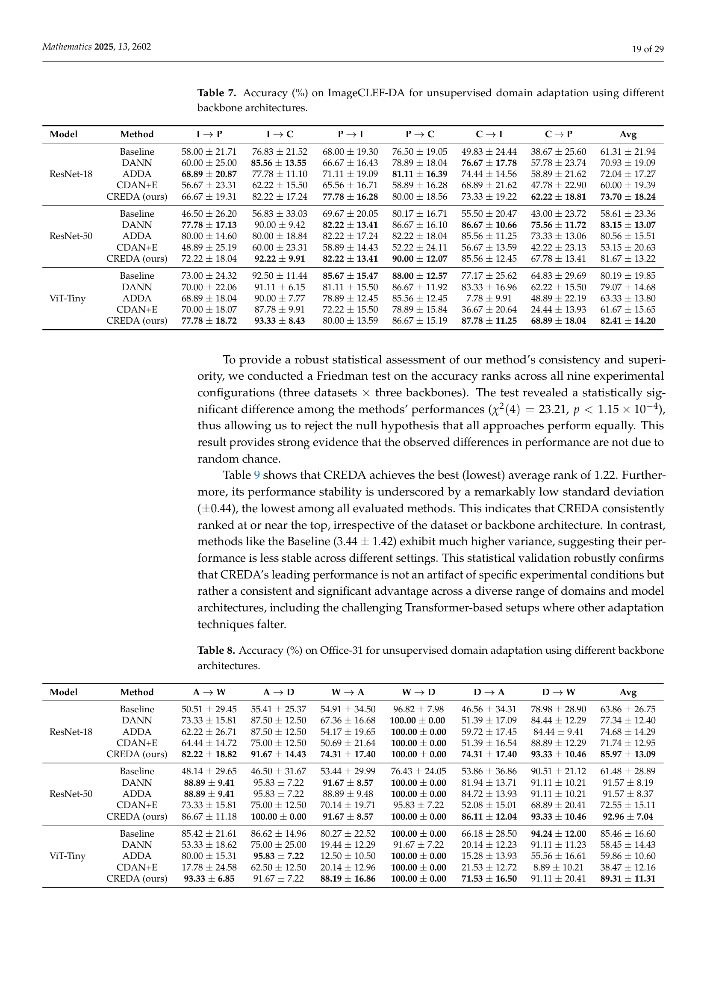

### Extraction assessment
- **Confidence:** 0.65 (below the configured 0.85 threshold; human review required).
- One or more equation candidates are ambiguous in raw extraction.

### Raw extracted text
```
Mathematics 2025, 13, 2602
19 of 29
Table 7. Accuracy (%) on ImageCLEF-DA for unsupervised domain adaptation using different
backbone architectures.
Model
Method
I →P
I →C
P →I
P →C
C →I
C →P
Avg
ResNet-18
Baseline
58.00 ± 21.71
76.83 ± 21.52
68.00 ± 19.30
76.50 ± 19.05
49.83 ± 24.44
38.67 ± 25.60
61.31 ± 21.94
DANN
60.00 ± 25.00
85.56 ± 13.55
66.67 ± 16.43
78.89 ± 18.04
76.67 ± 17.78
57.78 ± 23.74
70.93 ± 19.09
ADDA
68.89 ± 20.87
77.78 ± 11.10
71.11 ± 19.09
81.11 ± 16.39
74.44 ± 14.56
58.89 ± 21.62
72.04 ± 17.27
CDAN+E
56.67 ± 23.31
62.22 ± 15.50
65.56 ± 16.71
58.89 ± 16.28
68.89 ± 21.62
47.78 ± 22.90
60.00 ± 19.39
CREDA (ours)
66.67 ± 19.31
82.22 ± 17.24
77.78 ± 16.28
80.00 ± 18.56
73.33 ± 19.22
62.22 ± 18.81
73.70 ± 18.24
ResNet-50
Baseline
46.50 ± 26.20
56.83 ± 33.03
69.67 ± 20.05
80.17 ± 16.71
55.50 ± 20.47
43.00 ± 23.72
58.61 ± 23.36
DANN
77.78 ± 17.13
90.00 ± 9.42
82.22 ± 13.41
86.67 ± 16.10
86.67 ± 10.66
75.56 ± 11.72
83.15 ± 13.07
ADDA
80.00 ± 14.60
80.00 ± 18.84
82.22 ± 17.24
82.22 ± 18.04
85.56 ± 11.25
73.33 ± 13.06
80.56 ± 15.51
CDAN+E
48.89 ± 25.19
60.00 ± 23.31
58.89 ± 14.43
52.22 ± 24.11
56.67 ± 13.59
42.22 ± 23.13
53.15 ± 20.63
CREDA (ours)
72.22 ± 18.04
92.22 ± 9.91
82.22 ± 13.41
90.00 ± 12.07
85.56 ± 12.45
67.78 ± 13.41
81.67 ± 13.22
ViT-Tiny
Baseline
73.00 ± 24.32
92.50 ± 11.44
85.67 ± 15.47
88.00 ± 12.57
77.17 ± 25.62
64.83 ± 29.69
80.19 ± 19.85
DANN
70.00 ± 22.06
91.11 ± 6.15
81.11 ± 15.50
86.67 ± 11.92
83.33 ± 16.96
62.22 ± 15.50
79.07 ± 14.68
ADDA
68.89 ± 18.04
90.00 ± 7.77
78.89 ± 12.45
85.56 ± 12.45
7.78 ± 9.91
48.89 ± 22.19
63.33 ± 13.80
CDAN+E
70.00 ± 18.07
87.78 ± 9.91
72.22 ± 15.50
78.89 ± 15.84
36.67 ± 20.64
24.44 ± 13.93
61.67 ± 15.65
CREDA (ours)
77.78 ± 18.72
93.33 ± 8.43
80.00 ± 13.59
86.67 ± 15.19
87.78 ± 11.25
68.89 ± 18.04
82.41 ± 14.20
To provide a robust statistical assessment of our method’s consistency and superi-
ority, we conducted a Friedman test on the accuracy ranks across all nine experimental
configurations (three datasets × three backbones). The test revealed a statistically sig-
nificant difference among the methods’ performances (χ2(4) = 23.21, p < 1.15 × 10−4),
thus allowing us to reject the null hypothesis that all approaches perform equally. This
result provides strong evidence that the observed differences in performance are not due to
random chance.
Table 9 shows that CREDA achieves the best (lowest) average rank of 1.22. Further-
more, its performance stability is underscored by a remarkably low standard deviation
(±0.44), the lowest among all evaluated methods. This indicates that CREDA consistently
ranked at or near the top, irrespective of the dataset or backbone architecture. In contrast,
methods like the Baseline (3.44 ± 1.42) exhibit much higher variance, suggesting their per-
formance is less stable across different settings. This statistical validation robustly confirms
that CREDA’s leading performance is not an artifact of specific experimental conditions but
rather a consistent and significant advantage across a diverse range of domains and model
architectures, including the challenging Transformer-based setups where other adaptation
techniques falter.
Table 8. Accuracy (%) on Office-31 for unsupervised domain adaptation using different backbone
architectures.
Model
Method
A →W
A →D
W →A
W →D
D →A
D →W
Avg
ResNet-18
Baseline
50.51 ± 29.45
55.41 ± 25.37
54.91 ± 34.50
96.82 ± 7.98
46.56 ± 34.31
78.98 ± 28.90
63.86 ± 26.75
DANN
73.33 ± 15.81
87.50 ± 12.50
67.36 ± 16.68
100.00 ± 0.00
51.39 ± 17.09
84.44 ± 12.29
77.34 ± 12.40
ADDA
62.22 ± 26.71
87.50 ± 12.50
54.17 ± 19.65
100.00 ± 0.00
59.72 ± 17.45
84.44 ± 9.41
74.68 ± 14.29
CDAN+E
64.44 ± 14.72
75.00 ± 12.50
50.69 ± 21.64
100.00 ± 0.00
51.39 ± 16.54
88.89 ± 12.29
71.74 ± 12.95
CREDA (ours)
82.22 ± 18.82
91.67 ± 14.43
74.31 ± 17.40
100.00 ± 0.00
74.31 ± 17.40
93.33 ± 10.46
85.97 ± 13.09
ResNet-50
Baseline
48.14 ± 29.65
46.50 ± 31.67
53.44 ± 29.99
76.43 ± 24.05
53.86 ± 36.86
90.51 ± 21.12
61.48 ± 28.89
DANN
88.89 ± 9.41
95.83 ± 7.22
91.67 ± 8.57
100.00 ± 0.00
81.94 ± 13.71
91.11 ± 10.21
91.57 ± 8.19
ADDA
88.89 ± 9.41
95.83 ± 7.22
88.89 ± 9.48
100.00 ± 0.00
84.72 ± 13.93
91.11 ± 10.21
91.57 ± 8.37
CDAN+E
73.33 ± 15.81
75.00 ± 12.50
70.14 ± 19.71
95.83 ± 7.22
52.08 ± 15.01
68.89 ± 20.41
72.55 ± 15.11
CREDA (ours)
86.67 ± 11.18
100.00 ± 0.00
91.67 ± 8.57
100.00 ± 0.00
86.11 ± 12.04
93.33 ± 10.46
92.96 ± 7.04
ViT-Tiny
Baseline
85.42 ± 21.61
86.62 ± 14.96
80.27 ± 22.52
100.00 ± 0.00
66.18 ± 28.50
94.24 ± 12.00
85.46 ± 16.60
DANN
53.33 ± 18.62
75.00 ± 25.00
19.44 ± 12.29
91.67 ± 7.22
20.14 ± 12.23
91.11 ± 11.23
58.45 ± 14.43
ADDA
80.00 ± 15.31
95.83 ± 7.22
12.50 ± 10.50
100.00 ± 0.00
15.28 ± 13.93
55.56 ± 16.61
59.86 ± 10.60
CDAN+E
17.78 ± 24.58
62.50 ± 12.50
20.14 ± 12.96
100.00 ± 0.00
21.53 ± 12.72
8.89 ± 10.21
38.47 ± 12.16
CREDA (ours)
93.33 ± 6.85
91.67 ± 7.22
88.19 ± 16.86
100.00 ± 0.00
71.53 ± 16.50
91.11 ± 20.41
89.31 ± 11.31

```

### Equation candidates
- `page-019-equation-001` — review_required (confidence 0.45; page 19).
```
58.00 ± 21.71
```
- `page-019-equation-002` — review_required (confidence 0.45; page 19).
```
76.83 ± 21.52
```
- `page-019-equation-003` — review_required (confidence 0.45; page 19).
```
68.00 ± 19.30
```
- `page-019-equation-004` — review_required (confidence 0.45; page 19).
```
76.50 ± 19.05
```
- `page-019-equation-005` — review_required (confidence 0.45; page 19).
```
49.83 ± 24.44
```
- `page-019-equation-006` — review_required (confidence 0.45; page 19).
```
38.67 ± 25.60
```
- `page-019-equation-007` — review_required (confidence 0.45; page 19).
```
61.31 ± 21.94
```
- `page-019-equation-008` — review_required (confidence 0.45; page 19).
```
60.00 ± 25.00
```
- `page-019-equation-009` — review_required (confidence 0.45; page 19).
```
85.56 ± 13.55
```
- `page-019-equation-010` — review_required (confidence 0.45; page 19).
```
66.67 ± 16.43
```
- `page-019-equation-011` — review_required (confidence 0.45; page 19).
```
78.89 ± 18.04
```
- `page-019-equation-012` — review_required (confidence 0.45; page 19).
```
76.67 ± 17.78
```
- `page-019-equation-013` — review_required (confidence 0.45; page 19).
```
57.78 ± 23.74
```
- `page-019-equation-014` — review_required (confidence 0.45; page 19).
```
70.93 ± 19.09
```
- `page-019-equation-015` — review_required (confidence 0.45; page 19).
```
68.89 ± 20.87
```
- `page-019-equation-016` — review_required (confidence 0.45; page 19).
```
77.78 ± 11.10
```
- `page-019-equation-017` — review_required (confidence 0.45; page 19).
```
71.11 ± 19.09
```
- `page-019-equation-018` — review_required (confidence 0.45; page 19).
```
81.11 ± 16.39
```
- `page-019-equation-019` — review_required (confidence 0.45; page 19).
```
74.44 ± 14.56
```
- `page-019-equation-020` — review_required (confidence 0.45; page 19).
```
58.89 ± 21.62
```
- `page-019-equation-021` — review_required (confidence 0.45; page 19).
```
72.04 ± 17.27
```
- `page-019-equation-022` — review_required (confidence 0.45; page 19).
```
56.67 ± 23.31
```
- `page-019-equation-023` — review_required (confidence 0.45; page 19).
```
62.22 ± 15.50
```
- `page-019-equation-024` — review_required (confidence 0.45; page 19).
```
65.56 ± 16.71
```
- `page-019-equation-025` — review_required (confidence 0.45; page 19).
```
58.89 ± 16.28
```
- `page-019-equation-026` — review_required (confidence 0.45; page 19).
```
68.89 ± 21.62
```
- `page-019-equation-027` — review_required (confidence 0.45; page 19).
```
47.78 ± 22.90
```
- `page-019-equation-028` — review_required (confidence 0.45; page 19).
```
60.00 ± 19.39
```
- `page-019-equation-029` — review_required (confidence 0.45; page 19).
```
66.67 ± 19.31
```
- `page-019-equation-030` — review_required (confidence 0.45; page 19).
```
82.22 ± 17.24
```
- `page-019-equation-031` — review_required (confidence 0.45; page 19).
```
77.78 ± 16.28
```
- `page-019-equation-032` — review_required (confidence 0.45; page 19).
```
80.00 ± 18.56
```
- `page-019-equation-033` — review_required (confidence 0.45; page 19).
```
73.33 ± 19.22
```
- `page-019-equation-034` — review_required (confidence 0.45; page 19).
```
62.22 ± 18.81
```
- `page-019-equation-035` — review_required (confidence 0.45; page 19).
```
73.70 ± 18.24
```
- `page-019-equation-036` — review_required (confidence 0.45; page 19).
```
46.50 ± 26.20
```
- `page-019-equation-037` — review_required (confidence 0.45; page 19).
```
56.83 ± 33.03
```
- `page-019-equation-038` — review_required (confidence 0.45; page 19).
```
69.67 ± 20.05
```
- `page-019-equation-039` — review_required (confidence 0.45; page 19).
```
80.17 ± 16.71
```
- `page-019-equation-040` — review_required (confidence 0.45; page 19).
```
55.50 ± 20.47
```
- `page-019-equation-041` — review_required (confidence 0.45; page 19).
```
43.00 ± 23.72
```
- `page-019-equation-042` — review_required (confidence 0.45; page 19).
```
58.61 ± 23.36
```
- `page-019-equation-043` — review_required (confidence 0.45; page 19).
```
77.78 ± 17.13
```
- `page-019-equation-044` — review_required (confidence 0.45; page 19).
```
90.00 ± 9.42
```
- `page-019-equation-045` — review_required (confidence 0.45; page 19).
```
82.22 ± 13.41
```
- `page-019-equation-046` — review_required (confidence 0.45; page 19).
```
86.67 ± 16.10
```
- `page-019-equation-047` — review_required (confidence 0.45; page 19).
```
86.67 ± 10.66
```
- `page-019-equation-048` — review_required (confidence 0.45; page 19).
```
75.56 ± 11.72
```
- `page-019-equation-049` — review_required (confidence 0.45; page 19).
```
83.15 ± 13.07
```
- `page-019-equation-050` — review_required (confidence 0.45; page 19).
```
80.00 ± 14.60
```
- `page-019-equation-051` — review_required (confidence 0.45; page 19).
```
80.00 ± 18.84
```
- `page-019-equation-052` — review_required (confidence 0.45; page 19).
```
82.22 ± 17.24
```
- `page-019-equation-053` — review_required (confidence 0.45; page 19).
```
82.22 ± 18.04
```
- `page-019-equation-054` — review_required (confidence 0.45; page 19).
```
85.56 ± 11.25
```
- `page-019-equation-055` — review_required (confidence 0.45; page 19).
```
73.33 ± 13.06
```
- `page-019-equation-056` — review_required (confidence 0.45; page 19).
```
80.56 ± 15.51
```
- `page-019-equation-057` — review_required (confidence 0.45; page 19).
```
48.89 ± 25.19
```
- `page-019-equation-058` — review_required (confidence 0.45; page 19).
```
60.00 ± 23.31
```
- `page-019-equation-059` — review_required (confidence 0.45; page 19).
```
58.89 ± 14.43
```
- `page-019-equation-060` — review_required (confidence 0.45; page 19).
```
52.22 ± 24.11
```
- `page-019-equation-061` — review_required (confidence 0.45; page 19).
```
56.67 ± 13.59
```
- `page-019-equation-062` — review_required (confidence 0.45; page 19).
```
42.22 ± 23.13
```
- `page-019-equation-063` — review_required (confidence 0.45; page 19).
```
53.15 ± 20.63
```
- `page-019-equation-064` — review_required (confidence 0.45; page 19).
```
72.22 ± 18.04
```
- `page-019-equation-065` — review_required (confidence 0.45; page 19).
```
92.22 ± 9.91
```
- `page-019-equation-066` — review_required (confidence 0.45; page 19).
```
82.22 ± 13.41
```
- `page-019-equation-067` — review_required (confidence 0.45; page 19).
```
90.00 ± 12.07
```
- `page-019-equation-068` — review_required (confidence 0.45; page 19).
```
85.56 ± 12.45
```
- `page-019-equation-069` — review_required (confidence 0.45; page 19).
```
67.78 ± 13.41
```
- `page-019-equation-070` — review_required (confidence 0.45; page 19).
```
81.67 ± 13.22
```
- `page-019-equation-071` — review_required (confidence 0.45; page 19).
```
73.00 ± 24.32
```
- `page-019-equation-072` — review_required (confidence 0.45; page 19).
```
92.50 ± 11.44
```
- `page-019-equation-073` — review_required (confidence 0.45; page 19).
```
85.67 ± 15.47
```
- `page-019-equation-074` — review_required (confidence 0.45; page 19).
```
88.00 ± 12.57
```
- `page-019-equation-075` — review_required (confidence 0.45; page 19).
```
77.17 ± 25.62
```
- `page-019-equation-076` — review_required (confidence 0.45; page 19).
```
64.83 ± 29.69
```
- `page-019-equation-077` — review_required (confidence 0.45; page 19).
```
80.19 ± 19.85
```
- `page-019-equation-078` — review_required (confidence 0.45; page 19).
```
70.00 ± 22.06
```
- `page-019-equation-079` — review_required (confidence 0.45; page 19).
```
91.11 ± 6.15
```
- `page-019-equation-080` — review_required (confidence 0.45; page 19).
```
81.11 ± 15.50
```
- `page-019-equation-081` — review_required (confidence 0.45; page 19).
```
86.67 ± 11.92
```
- `page-019-equation-082` — review_required (confidence 0.45; page 19).
```
83.33 ± 16.96
```
- `page-019-equation-083` — review_required (confidence 0.45; page 19).
```
62.22 ± 15.50
```
- `page-019-equation-084` — review_required (confidence 0.45; page 19).
```
79.07 ± 14.68
```
- `page-019-equation-085` — review_required (confidence 0.45; page 19).
```
68.89 ± 18.04
```
- `page-019-equation-086` — review_required (confidence 0.45; page 19).
```
90.00 ± 7.77
```
- `page-019-equation-087` — review_required (confidence 0.45; page 19).
```
78.89 ± 12.45
```
- `page-019-equation-088` — review_required (confidence 0.45; page 19).
```
85.56 ± 12.45
```
- `page-019-equation-089` — review_required (confidence 0.45; page 19).
```
7.78 ± 9.91
```
- `page-019-equation-090` — review_required (confidence 0.45; page 19).
```
48.89 ± 22.19
```
- `page-019-equation-091` — review_required (confidence 0.45; page 19).
```
63.33 ± 13.80
```
- `page-019-equation-092` — review_required (confidence 0.45; page 19).
```
70.00 ± 18.07
```
- `page-019-equation-093` — review_required (confidence 0.45; page 19).
```
87.78 ± 9.91
```
- `page-019-equation-094` — review_required (confidence 0.45; page 19).
```
72.22 ± 15.50
```
- `page-019-equation-095` — review_required (confidence 0.45; page 19).
```
78.89 ± 15.84
```
- `page-019-equation-096` — review_required (confidence 0.45; page 19).
```
36.67 ± 20.64
```
- `page-019-equation-097` — review_required (confidence 0.45; page 19).
```
24.44 ± 13.93
```
- `page-019-equation-098` — review_required (confidence 0.45; page 19).
```
61.67 ± 15.65
```
- `page-019-equation-099` — review_required (confidence 0.45; page 19).
```
77.78 ± 18.72
```
- `page-019-equation-100` — review_required (confidence 0.45; page 19).
```
93.33 ± 8.43
```
- `page-019-equation-101` — review_required (confidence 0.45; page 19).
```
80.00 ± 13.59
```
- `page-019-equation-102` — review_required (confidence 0.45; page 19).
```
86.67 ± 15.19
```
- `page-019-equation-103` — review_required (confidence 0.45; page 19).
```
87.78 ± 11.25
```
- `page-019-equation-104` — review_required (confidence 0.45; page 19).
```
68.89 ± 18.04
```
- `page-019-equation-105` — review_required (confidence 0.45; page 19).
```
82.41 ± 14.20
```
- `page-019-equation-106` — review_required (confidence 0.45; page 19).
```
configurations (three datasets × three backbones). The test revealed a statistically sig-
```
- `page-019-equation-107` — review_required (confidence 0.45; page 19).
```
nificant difference among the methods’ performances (χ2(4) = 23.21, p < 1.15 × 10−4),
```
- `page-019-equation-108` — review_required (confidence 0.45; page 19).
```
(±0.44), the lowest among all evaluated methods. This indicates that CREDA consistently
```
- `page-019-equation-109` — review_required (confidence 0.45; page 19).
```
methods like the Baseline (3.44 ± 1.42) exhibit much higher variance, suggesting their per-
```
- `page-019-equation-110` — review_required (confidence 0.45; page 19).
```
50.51 ± 29.45
```
- `page-019-equation-111` — review_required (confidence 0.45; page 19).
```
55.41 ± 25.37
```
- `page-019-equation-112` — review_required (confidence 0.45; page 19).
```
54.91 ± 34.50
```
- `page-019-equation-113` — review_required (confidence 0.45; page 19).
```
96.82 ± 7.98
```
- `page-019-equation-114` — review_required (confidence 0.45; page 19).
```
46.56 ± 34.31
```
- `page-019-equation-115` — review_required (confidence 0.45; page 19).
```
78.98 ± 28.90
```
- `page-019-equation-116` — review_required (confidence 0.45; page 19).
```
63.86 ± 26.75
```
- `page-019-equation-117` — review_required (confidence 0.45; page 19).
```
73.33 ± 15.81
```
- `page-019-equation-118` — review_required (confidence 0.45; page 19).
```
87.50 ± 12.50
```
- `page-019-equation-119` — review_required (confidence 0.45; page 19).
```
67.36 ± 16.68
```
- `page-019-equation-120` — review_required (confidence 0.45; page 19).
```
100.00 ± 0.00
```
- `page-019-equation-121` — review_required (confidence 0.45; page 19).
```
51.39 ± 17.09
```
- `page-019-equation-122` — review_required (confidence 0.45; page 19).
```
84.44 ± 12.29
```
- `page-019-equation-123` — review_required (confidence 0.45; page 19).
```
77.34 ± 12.40
```
- `page-019-equation-124` — review_required (confidence 0.45; page 19).
```
62.22 ± 26.71
```
- `page-019-equation-125` — review_required (confidence 0.45; page 19).
```
87.50 ± 12.50
```
- `page-019-equation-126` — review_required (confidence 0.45; page 19).
```
54.17 ± 19.65
```
- `page-019-equation-127` — review_required (confidence 0.45; page 19).
```
100.00 ± 0.00
```
- `page-019-equation-128` — review_required (confidence 0.45; page 19).
```
59.72 ± 17.45
```
- `page-019-equation-129` — review_required (confidence 0.45; page 19).
```
84.44 ± 9.41
```
- `page-019-equation-130` — review_required (confidence 0.45; page 19).
```
74.68 ± 14.29
```
- `page-019-equation-131` — review_required (confidence 0.45; page 19).
```
64.44 ± 14.72
```
- `page-019-equation-132` — review_required (confidence 0.45; page 19).
```
75.00 ± 12.50
```
- `page-019-equation-133` — review_required (confidence 0.45; page 19).
```
50.69 ± 21.64
```
- `page-019-equation-134` — review_required (confidence 0.45; page 19).
```
100.00 ± 0.00
```
- `page-019-equation-135` — review_required (confidence 0.45; page 19).
```
51.39 ± 16.54
```
- `page-019-equation-136` — review_required (confidence 0.45; page 19).
```
88.89 ± 12.29
```
- `page-019-equation-137` — review_required (confidence 0.45; page 19).
```
71.74 ± 12.95
```
- `page-019-equation-138` — review_required (confidence 0.45; page 19).
```
82.22 ± 18.82
```
- `page-019-equation-139` — review_required (confidence 0.45; page 19).
```
91.67 ± 14.43
```
- `page-019-equation-140` — review_required (confidence 0.45; page 19).
```
74.31 ± 17.40
```
- `page-019-equation-141` — review_required (confidence 0.45; page 19).
```
100.00 ± 0.00
```
- `page-019-equation-142` — review_required (confidence 0.45; page 19).
```
74.31 ± 17.40
```
- `page-019-equation-143` — review_required (confidence 0.45; page 19).
```
93.33 ± 10.46
```
- `page-019-equation-144` — review_required (confidence 0.45; page 19).
```
85.97 ± 13.09
```
- `page-019-equation-145` — review_required (confidence 0.45; page 19).
```
48.14 ± 29.65
```
- `page-019-equation-146` — review_required (confidence 0.45; page 19).
```
46.50 ± 31.67
```
- `page-019-equation-147` — review_required (confidence 0.45; page 19).
```
53.44 ± 29.99
```
- `page-019-equation-148` — review_required (confidence 0.45; page 19).
```
76.43 ± 24.05
```
- `page-019-equation-149` — review_required (confidence 0.45; page 19).
```
53.86 ± 36.86
```
- `page-019-equation-150` — review_required (confidence 0.45; page 19).
```
90.51 ± 21.12
```
- `page-019-equation-151` — review_required (confidence 0.45; page 19).
```
61.48 ± 28.89
```
- `page-019-equation-152` — review_required (confidence 0.45; page 19).
```
88.89 ± 9.41
```
- `page-019-equation-153` — review_required (confidence 0.45; page 19).
```
95.83 ± 7.22
```
- `page-019-equation-154` — review_required (confidence 0.45; page 19).
```
91.67 ± 8.57
```
- `page-019-equation-155` — review_required (confidence 0.45; page 19).
```
100.00 ± 0.00
```
- `page-019-equation-156` — review_required (confidence 0.45; page 19).
```
81.94 ± 13.71
```
- `page-019-equation-157` — review_required (confidence 0.45; page 19).
```
91.11 ± 10.21
```
- `page-019-equation-158` — review_required (confidence 0.45; page 19).
```
91.57 ± 8.19
```
- `page-019-equation-159` — review_required (confidence 0.45; page 19).
```
88.89 ± 9.41
```
- `page-019-equation-160` — review_required (confidence 0.45; page 19).
```
95.83 ± 7.22
```
- `page-019-equation-161` — review_required (confidence 0.45; page 19).
```
88.89 ± 9.48
```
- `page-019-equation-162` — review_required (confidence 0.45; page 19).
```
100.00 ± 0.00
```
- `page-019-equation-163` — review_required (confidence 0.45; page 19).
```
84.72 ± 13.93
```
- `page-019-equation-164` — review_required (confidence 0.45; page 19).
```
91.11 ± 10.21
```
- `page-019-equation-165` — review_required (confidence 0.45; page 19).
```
91.57 ± 8.37
```
- `page-019-equation-166` — review_required (confidence 0.45; page 19).
```
73.33 ± 15.81
```
- `page-019-equation-167` — review_required (confidence 0.45; page 19).
```
75.00 ± 12.50
```
- `page-019-equation-168` — review_required (confidence 0.45; page 19).
```
70.14 ± 19.71
```
- `page-019-equation-169` — review_required (confidence 0.45; page 19).
```
95.83 ± 7.22
```
- `page-019-equation-170` — review_required (confidence 0.45; page 19).
```
52.08 ± 15.01
```
- `page-019-equation-171` — review_required (confidence 0.45; page 19).
```
68.89 ± 20.41
```
- `page-019-equation-172` — review_required (confidence 0.45; page 19).
```
72.55 ± 15.11
```
- `page-019-equation-173` — review_required (confidence 0.45; page 19).
```
86.67 ± 11.18
```
- `page-019-equation-174` — review_required (confidence 0.45; page 19).
```
100.00 ± 0.00
```
- `page-019-equation-175` — review_required (confidence 0.45; page 19).
```
91.67 ± 8.57
```
- `page-019-equation-176` — review_required (confidence 0.45; page 19).
```
100.00 ± 0.00
```
- `page-019-equation-177` — review_required (confidence 0.45; page 19).
```
86.11 ± 12.04
```
- `page-019-equation-178` — review_required (confidence 0.45; page 19).
```
93.33 ± 10.46
```
- `page-019-equation-179` — review_required (confidence 0.45; page 19).
```
92.96 ± 7.04
```
- `page-019-equation-180` — review_required (confidence 0.45; page 19).
```
85.42 ± 21.61
```
- `page-019-equation-181` — review_required (confidence 0.45; page 19).
```
86.62 ± 14.96
```
- `page-019-equation-182` — review_required (confidence 0.45; page 19).
```
80.27 ± 22.52
```
- `page-019-equation-183` — review_required (confidence 0.45; page 19).
```
100.00 ± 0.00
```
- `page-019-equation-184` — review_required (confidence 0.45; page 19).
```
66.18 ± 28.50
```
- `page-019-equation-185` — review_required (confidence 0.45; page 19).
```
94.24 ± 12.00
```
- `page-019-equation-186` — review_required (confidence 0.45; page 19).
```
85.46 ± 16.60
```
- `page-019-equation-187` — review_required (confidence 0.45; page 19).
```
53.33 ± 18.62
```
- `page-019-equation-188` — review_required (confidence 0.45; page 19).
```
75.00 ± 25.00
```
- `page-019-equation-189` — review_required (confidence 0.45; page 19).
```
19.44 ± 12.29
```
- `page-019-equation-190` — review_required (confidence 0.45; page 19).
```
91.67 ± 7.22
```
- `page-019-equation-191` — review_required (confidence 0.45; page 19).
```
20.14 ± 12.23
```
- `page-019-equation-192` — review_required (confidence 0.45; page 19).
```
91.11 ± 11.23
```
- `page-019-equation-193` — review_required (confidence 0.45; page 19).
```
58.45 ± 14.43
```
- `page-019-equation-194` — review_required (confidence 0.45; page 19).
```
80.00 ± 15.31
```
- `page-019-equation-195` — review_required (confidence 0.45; page 19).
```
95.83 ± 7.22
```
- `page-019-equation-196` — review_required (confidence 0.45; page 19).
```
12.50 ± 10.50
```
- `page-019-equation-197` — review_required (confidence 0.45; page 19).
```
100.00 ± 0.00
```
- `page-019-equation-198` — review_required (confidence 0.45; page 19).
```
15.28 ± 13.93
```
- `page-019-equation-199` — review_required (confidence 0.45; page 19).
```
55.56 ± 16.61
```
- `page-019-equation-200` — review_required (confidence 0.45; page 19).
```
59.86 ± 10.60
```
- `page-019-equation-201` — review_required (confidence 0.45; page 19).
```
17.78 ± 24.58
```
- `page-019-equation-202` — review_required (confidence 0.45; page 19).
```
62.50 ± 12.50
```
- `page-019-equation-203` — review_required (confidence 0.45; page 19).
```
20.14 ± 12.96
```
- `page-019-equation-204` — review_required (confidence 0.45; page 19).
```
100.00 ± 0.00
```
- `page-019-equation-205` — review_required (confidence 0.45; page 19).
```
21.53 ± 12.72
```
- `page-019-equation-206` — review_required (confidence 0.45; page 19).
```
8.89 ± 10.21
```
- `page-019-equation-207` — review_required (confidence 0.45; page 19).
```
38.47 ± 12.16
```
- `page-019-equation-208` — review_required (confidence 0.45; page 19).
```
93.33 ± 6.85
```
- `page-019-equation-209` — review_required (confidence 0.45; page 19).
```
91.67 ± 7.22
```
- `page-019-equation-210` — review_required (confidence 0.45; page 19).
```
88.19 ± 16.86
```
- `page-019-equation-211` — review_required (confidence 0.45; page 19).
```
100.00 ± 0.00
```
- `page-019-equation-212` — review_required (confidence 0.45; page 19).
```
71.53 ± 16.50
```
- `page-019-equation-213` — review_required (confidence 0.45; page 19).
```
91.11 ± 20.41
```
- `page-019-equation-214` — review_required (confidence 0.45; page 19).
```
89.31 ± 11.31
```

## Page 20
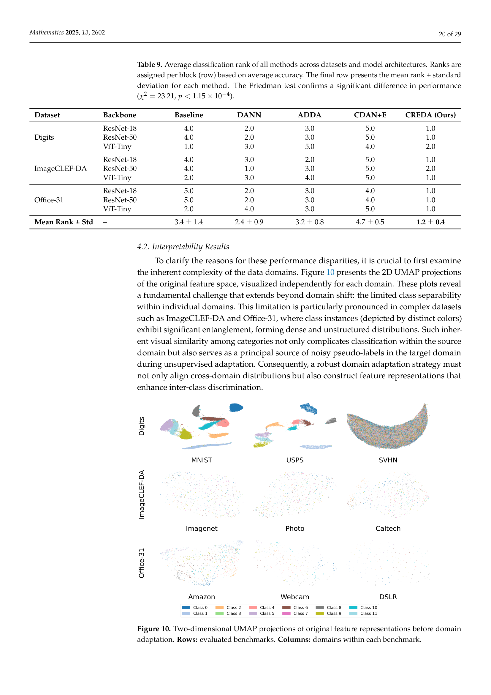

### Extraction assessment
- **Confidence:** 0.65 (below the configured 0.85 threshold; human review required).
- One or more equation candidates are ambiguous in raw extraction.

### Raw extracted text
```
Mathematics 2025, 13, 2602
20 of 29
Table 9. Average classification rank of all methods across datasets and model architectures. Ranks are
assigned per block (row) based on average accuracy. The final row presents the mean rank ± standard
deviation for each method. The Friedman test confirms a significant difference in performance
(χ2 = 23.21, p < 1.15 × 10−4).
Dataset
Backbone
Baseline
DANN
ADDA
CDAN+E
CREDA (Ours)
ResNet-18
4.0
2.0
3.0
5.0
1.0
Digits
ResNet-50
4.0
2.0
3.0
5.0
1.0
ViT-Tiny
1.0
3.0
5.0
4.0
2.0
ResNet-18
4.0
3.0
2.0
5.0
1.0
ImageCLEF-DA
ResNet-50
4.0
1.0
3.0
5.0
2.0
ViT-Tiny
2.0
3.0
4.0
5.0
1.0
ResNet-18
5.0
2.0
3.0
4.0
1.0
Office-31
ResNet-50
5.0
2.0
3.0
4.0
1.0
ViT-Tiny
2.0
4.0
3.0
5.0
1.0
Mean Rank ± Std
–
3.4 ± 1.4
2.4 ± 0.9
3.2 ± 0.8
4.7 ± 0.5
1.2 ± 0.4
4.2. Interpretability Results
To clarify the reasons for these performance disparities, it is crucial to first examine
the inherent complexity of the data domains. Figure 10 presents the 2D UMAP projections
of the original feature space, visualized independently for each domain. These plots reveal
a fundamental challenge that extends beyond domain shift: the limited class separability
within individual domains. This limitation is particularly pronounced in complex datasets
such as ImageCLEF-DA and Office-31, where class instances (depicted by distinct colors)
exhibit significant entanglement, forming dense and unstructured distributions. Such inher-
ent visual similarity among categories not only complicates classification within the source
domain but also serves as a principal source of noisy pseudo-labels in the target domain
during unsupervised adaptation. Consequently, a robust domain adaptation strategy must
not only align cross-domain distributions but also construct feature representations that
enhance inter-class discrimination.
MNIST
Digits
USPS
SVHN
Imagenet
ImageCLEF-DA
Photo
Caltech
Amazon
Office-31
Webcam
DSLR
Class 0
Class 1
Class 2
Class 3
Class 4
Class 5
Class 6
Class 7
Class 8
Class 9
Class 10
Class 11
Figure 10. Two-dimensional UMAP projections of original feature representations before domain
adaptation. Rows: evaluated benchmarks. Columns: domains within each benchmark.

```

### Textual figure-caption evidence
- Figure 10. Two-dimensional UMAP projections of original feature representations before domain
- Captions are page-level text evidence and are not associated with embedded images.

### Equation candidates
- `page-020-equation-001` — review_required (confidence 0.45; page 20).
```
assigned per block (row) based on average accuracy. The final row presents the mean rank ± standard
```
- `page-020-equation-002` — review_required (confidence 0.45; page 20).
```
(χ2 = 23.21, p < 1.15 × 10−4).
```
- `page-020-equation-003` — review_required (confidence 0.45; page 20).
```
Mean Rank ± Std
```
- `page-020-equation-004` — review_required (confidence 0.45; page 20).
```
3.4 ± 1.4
```
- `page-020-equation-005` — review_required (confidence 0.45; page 20).
```
2.4 ± 0.9
```
- `page-020-equation-006` — review_required (confidence 0.45; page 20).
```
3.2 ± 0.8
```
- `page-020-equation-007` — review_required (confidence 0.45; page 20).
```
4.7 ± 0.5
```
- `page-020-equation-008` — review_required (confidence 0.45; page 20).
```
1.2 ± 0.4
```

## Page 21
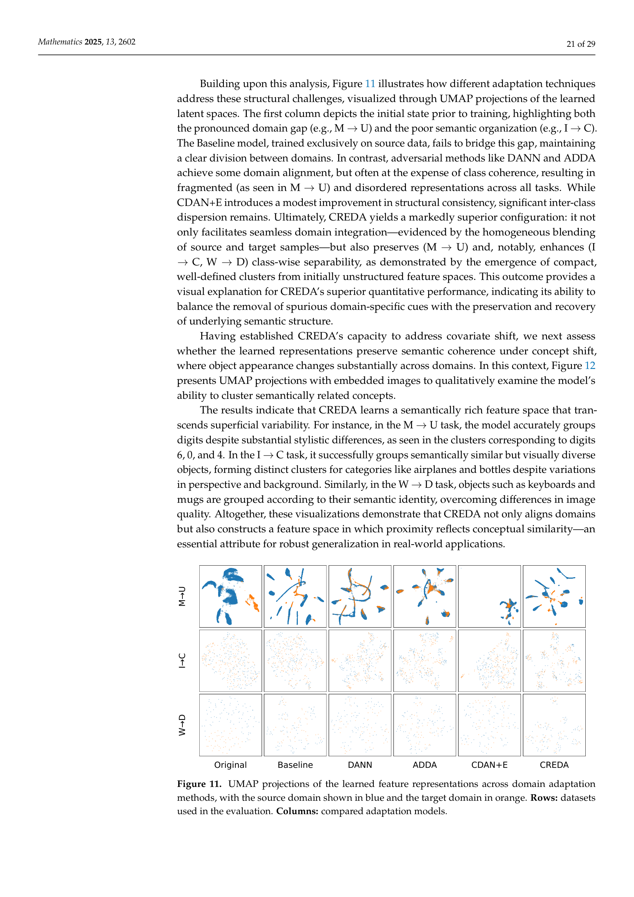

### Extraction assessment
- **Confidence:** 0.95 (meets the configured threshold).
- Machine-readable text was preserved with page-image provenance.

### Raw extracted text
```
Mathematics 2025, 13, 2602
21 of 29
Building upon this analysis, Figure 11 illustrates how different adaptation techniques
address these structural challenges, visualized through UMAP projections of the learned
latent spaces. The first column depicts the initial state prior to training, highlighting both
the pronounced domain gap (e.g., M →U) and the poor semantic organization (e.g., I →C).
The Baseline model, trained exclusively on source data, fails to bridge this gap, maintaining
a clear division between domains. In contrast, adversarial methods like DANN and ADDA
achieve some domain alignment, but often at the expense of class coherence, resulting in
fragmented (as seen in M →U) and disordered representations across all tasks. While
CDAN+E introduces a modest improvement in structural consistency, significant inter-class
dispersion remains. Ultimately, CREDA yields a markedly superior configuration: it not
only facilitates seamless domain integration—evidenced by the homogeneous blending
of source and target samples—but also preserves (M →U) and, notably, enhances (I
→C, W →D) class-wise separability, as demonstrated by the emergence of compact,
well-defined clusters from initially unstructured feature spaces. This outcome provides a
visual explanation for CREDA’s superior quantitative performance, indicating its ability to
balance the removal of spurious domain-specific cues with the preservation and recovery
of underlying semantic structure.
Having established CREDA’s capacity to address covariate shift, we next assess
whether the learned representations preserve semantic coherence under concept shift,
where object appearance changes substantially across domains. In this context, Figure 12
presents UMAP projections with embedded images to qualitatively examine the model’s
ability to cluster semantically related concepts.
The results indicate that CREDA learns a semantically rich feature space that tran-
scends superficial variability. For instance, in the M →U task, the model accurately groups
digits despite substantial stylistic differences, as seen in the clusters corresponding to digits
6, 0, and 4. In the I →C task, it successfully groups semantically similar but visually diverse
objects, forming distinct clusters for categories like airplanes and bottles despite variations
in perspective and background. Similarly, in the W →D task, objects such as keyboards and
mugs are grouped according to their semantic identity, overcoming differences in image
quality. Altogether, these visualizations demonstrate that CREDA not only aligns domains
but also constructs a feature space in which proximity reflects conceptual similarity—an
essential attribute for robust generalization in real-world applications.
M
U
I
C
W
D
Original
Baseline
DANN
ADDA
CDAN+E
CREDA
Figure 11. UMAP projections of the learned feature representations across domain adaptation
methods, with the source domain shown in blue and the target domain in orange. Rows: datasets
used in the evaluation. Columns: compared adaptation models.

```

### Textual figure-caption evidence
- Figure 11. UMAP projections of the learned feature representations across domain adaptation
- Captions are page-level text evidence and are not associated with embedded images.

## Page 22
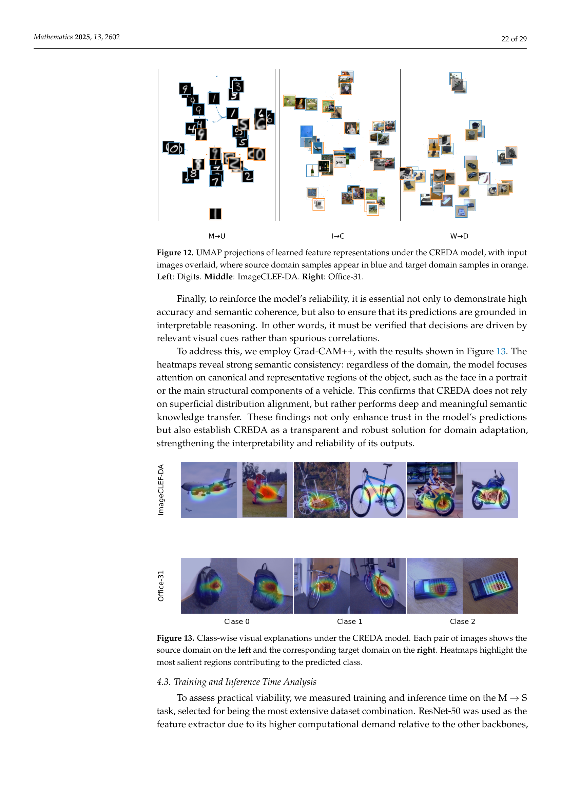

### Extraction assessment
- **Confidence:** 0.75 (below the configured 0.85 threshold; human review required).
- Embedded images require visual review; captions remain page-level text evidence only.

### Raw extracted text
```
Mathematics 2025, 13, 2602
22 of 29
M
U
I
C
W
D
Figure 12. UMAP projections of learned feature representations under the CREDA model, with input
images overlaid, where source domain samples appear in blue and target domain samples in orange.
Left: Digits. Middle: ImageCLEF-DA. Right: Office-31.
Finally, to reinforce the model’s reliability, it is essential not only to demonstrate high
accuracy and semantic coherence, but also to ensure that its predictions are grounded in
interpretable reasoning. In other words, it must be verified that decisions are driven by
relevant visual cues rather than spurious correlations.
To address this, we employ Grad-CAM++, with the results shown in Figure 13. The
heatmaps reveal strong semantic consistency: regardless of the domain, the model focuses
attention on canonical and representative regions of the object, such as the face in a portrait
or the main structural components of a vehicle. This confirms that CREDA does not rely
on superficial distribution alignment, but rather performs deep and meaningful semantic
knowledge transfer. These findings not only enhance trust in the model’s predictions
but also establish CREDA as a transparent and robust solution for domain adaptation,
strengthening the interpretability and reliability of its outputs.
ImageCLEF-DA
Clase 0
Office-31
Clase 1
Clase 2
Figure 13. Class-wise visual explanations under the CREDA model. Each pair of images shows the
source domain on the left and the corresponding target domain on the right. Heatmaps highlight the
most salient regions contributing to the predicted class.
4.3. Training and Inference Time Analysis
To assess practical viability, we measured training and inference time on the M →S
task, selected for being the most extensive dataset combination. ResNet-50 was used as the
feature extractor due to its higher computational demand relative to the other backbones,

```

### Textual figure-caption evidence
- Figure 12. UMAP projections of learned feature representations under the CREDA model, with input
- Figure 13. Class-wise visual explanations under the CREDA model. Each pair of images shows the
- Captions are page-level text evidence and are not associated with embedded images.

### Embedded images
- `page-022-image-001` — embedded image metadata: 892 × 446 px, xref 1019; visual review required.
- `page-022-image-002` — embedded image metadata: 892 × 446 px, xref 1020; visual review required.
- `page-022-image-003` — embedded image metadata: 892 × 446 px, xref 1021; visual review required.
- `page-022-image-004` — embedded image metadata: 892 × 446 px, xref 1022; visual review required.
- `page-022-image-005` — embedded image metadata: 892 × 446 px, xref 1023; visual review required.
- `page-022-image-006` — embedded image metadata: 892 × 446 px, xref 1024; visual review required.
- `page-022-image-007` — embedded image metadata: 84 × 84 px, xref 925; visual review required.
- `page-022-image-008` — embedded image metadata: 84 × 84 px, xref 950; visual review required.
- `page-022-image-009` — embedded image metadata: 84 × 84 px, xref 887; visual review required.
- `page-022-image-010` — embedded image metadata: 84 × 84 px, xref 870; visual review required.
- `page-022-image-011` — embedded image metadata: 84 × 84 px, xref 872; visual review required.
- `page-022-image-012` — embedded image metadata: 84 × 84 px, xref 873; visual review required.
- `page-022-image-013` — embedded image metadata: 84 × 84 px, xref 875; visual review required.
- `page-022-image-014` — embedded image metadata: 84 × 84 px, xref 876; visual review required.
- `page-022-image-015` — embedded image metadata: 84 × 84 px, xref 877; visual review required.
- `page-022-image-016` — embedded image metadata: 84 × 84 px, xref 878; visual review required.
- `page-022-image-017` — embedded image metadata: 84 × 84 px, xref 879; visual review required.
- `page-022-image-018` — embedded image metadata: 84 × 84 px, xref 927; visual review required.
- `page-022-image-019` — embedded image metadata: 84 × 84 px, xref 946; visual review required.
- `page-022-image-020` — embedded image metadata: 84 × 84 px, xref 922; visual review required.
- `page-022-image-021` — embedded image metadata: 84 × 84 px, xref 924; visual review required.
- `page-022-image-022` — embedded image metadata: 84 × 84 px, xref 912; visual review required.
- `page-022-image-023` — embedded image metadata: 84 × 84 px, xref 914; visual review required.
- `page-022-image-024` — embedded image metadata: 84 × 84 px, xref 948; visual review required.
- `page-022-image-025` — embedded image metadata: 84 × 84 px, xref 944; visual review required.
- `page-022-image-026` — embedded image metadata: 84 × 84 px, xref 945; visual review required.
- `page-022-image-027` — embedded image metadata: 84 × 84 px, xref 942; visual review required.
- `page-022-image-028` — embedded image metadata: 84 × 84 px, xref 943; visual review required.
- `page-022-image-029` — embedded image metadata: 84 × 84 px, xref 961; visual review required.
- `page-022-image-030` — embedded image metadata: 84 × 84 px, xref 962; visual review required.
- `page-022-image-031` — embedded image metadata: 84 × 84 px, xref 960; visual review required.
- `page-022-image-032` — embedded image metadata: 84 × 84 px, xref 926; visual review required.
- `page-022-image-033` — embedded image metadata: 84 × 84 px, xref 958; visual review required.
- `page-022-image-034` — embedded image metadata: 84 × 84 px, xref 959; visual review required.
- `page-022-image-035` — embedded image metadata: 84 × 84 px, xref 956; visual review required.
- `page-022-image-036` — embedded image metadata: 84 × 84 px, xref 957; visual review required.
- `page-022-image-037` — embedded image metadata: 84 × 84 px, xref 954; visual review required.
- `page-022-image-038` — embedded image metadata: 84 × 84 px, xref 955; visual review required.
- `page-022-image-039` — embedded image metadata: 84 × 84 px, xref 952; visual review required.
- `page-022-image-040` — embedded image metadata: 84 × 84 px, xref 953; visual review required.
- `page-022-image-041` — embedded image metadata: 84 × 84 px, xref 972; visual review required.
- `page-022-image-042` — embedded image metadata: 84 × 84 px, xref 973; visual review required.
- `page-022-image-043` — embedded image metadata: 84 × 84 px, xref 928; visual review required.
- `page-022-image-044` — embedded image metadata: 84 × 84 px, xref 963; visual review required.
- `page-022-image-045` — embedded image metadata: 84 × 84 px, xref 970; visual review required.
- `page-022-image-046` — embedded image metadata: 84 × 84 px, xref 971; visual review required.
- `page-022-image-047` — embedded image metadata: 84 × 84 px, xref 968; visual review required.
- `page-022-image-048` — embedded image metadata: 84 × 84 px, xref 969; visual review required.
- `page-022-image-049` — embedded image metadata: 84 × 84 px, xref 966; visual review required.
- `page-022-image-050` — embedded image metadata: 84 × 84 px, xref 967; visual review required.
- `page-022-image-051` — embedded image metadata: 84 × 84 px, xref 964; visual review required.
- `page-022-image-052` — embedded image metadata: 84 × 84 px, xref 965; visual review required.
- `page-022-image-053` — embedded image metadata: 84 × 84 px, xref 984; visual review required.
- `page-022-image-054` — embedded image metadata: 84 × 84 px, xref 929; visual review required.
- `page-022-image-055` — embedded image metadata: 84 × 84 px, xref 974; visual review required.
- `page-022-image-056` — embedded image metadata: 84 × 84 px, xref 975; visual review required.
- `page-022-image-057` — embedded image metadata: 84 × 84 px, xref 982; visual review required.
- `page-022-image-058` — embedded image metadata: 84 × 84 px, xref 983; visual review required.
- `page-022-image-059` — embedded image metadata: 84 × 84 px, xref 980; visual review required.
- `page-022-image-060` — embedded image metadata: 84 × 84 px, xref 981; visual review required.
- `page-022-image-061` — embedded image metadata: 84 × 84 px, xref 978; visual review required.
- `page-022-image-062` — embedded image metadata: 84 × 84 px, xref 979; visual review required.
- `page-022-image-063` — embedded image metadata: 84 × 84 px, xref 976; visual review required.
- `page-022-image-064` — embedded image metadata: 84 × 84 px, xref 977; visual review required.
- `page-022-image-065` — embedded image metadata: 84 × 84 px, xref 930; visual review required.
- `page-022-image-066` — embedded image metadata: 84 × 84 px, xref 874; visual review required.
- `page-022-image-067` — embedded image metadata: 84 × 84 px, xref 869; visual review required.
- `page-022-image-068` — embedded image metadata: 84 × 84 px, xref 871; visual review required.
- `page-022-image-069` — embedded image metadata: 84 × 84 px, xref 885; visual review required.
- `page-022-image-070` — embedded image metadata: 84 × 84 px, xref 886; visual review required.
- `page-022-image-071` — embedded image metadata: 84 × 84 px, xref 883; visual review required.
- `page-022-image-072` — embedded image metadata: 84 × 84 px, xref 884; visual review required.
- `page-022-image-073` — embedded image metadata: 84 × 84 px, xref 881; visual review required.
- `page-022-image-074` — embedded image metadata: 84 × 84 px, xref 882; visual review required.
- `page-022-image-075` — embedded image metadata: 84 × 84 px, xref 880; visual review required.
- `page-022-image-076` — embedded image metadata: 84 × 84 px, xref 931; visual review required.
- `page-022-image-077` — embedded image metadata: 84 × 84 px, xref 890; visual review required.
- `page-022-image-078` — embedded image metadata: 84 × 84 px, xref 891; visual review required.
- `page-022-image-079` — embedded image metadata: 84 × 84 px, xref 888; visual review required.
- `page-022-image-080` — embedded image metadata: 84 × 84 px, xref 889; visual review required.
- `page-022-image-081` — embedded image metadata: 84 × 84 px, xref 896; visual review required.
- `page-022-image-082` — embedded image metadata: 84 × 84 px, xref 897; visual review required.
- `page-022-image-083` — embedded image metadata: 84 × 84 px, xref 894; visual review required.
- `page-022-image-084` — embedded image metadata: 84 × 84 px, xref 895; visual review required.
- `page-022-image-085` — embedded image metadata: 84 × 84 px, xref 892; visual review required.
- `page-022-image-086` — embedded image metadata: 84 × 84 px, xref 893; visual review required.
- `page-022-image-087` — embedded image metadata: 84 × 84 px, xref 932; visual review required.
- `page-022-image-088` — embedded image metadata: 84 × 84 px, xref 902; visual review required.
- `page-022-image-089` — embedded image metadata: 84 × 84 px, xref 900; visual review required.
- `page-022-image-090` — embedded image metadata: 84 × 84 px, xref 901; visual review required.
- `page-022-image-091` — embedded image metadata: 84 × 84 px, xref 898; visual review required.
- `page-022-image-092` — embedded image metadata: 84 × 84 px, xref 899; visual review required.
- `page-022-image-093` — embedded image metadata: 84 × 84 px, xref 906; visual review required.
- `page-022-image-094` — embedded image metadata: 84 × 84 px, xref 907; visual review required.
- `page-022-image-095` — embedded image metadata: 84 × 84 px, xref 904; visual review required.
- `page-022-image-096` — embedded image metadata: 84 × 84 px, xref 905; visual review required.
- `page-022-image-097` — embedded image metadata: 84 × 84 px, xref 903; visual review required.
- `page-022-image-098` — embedded image metadata: 84 × 84 px, xref 933; visual review required.
- `page-022-image-099` — embedded image metadata: 84 × 84 px, xref 917; visual review required.
- `page-022-image-100` — embedded image metadata: 84 × 84 px, xref 918; visual review required.
- `page-022-image-101` — embedded image metadata: 84 × 84 px, xref 915; visual review required.
- `page-022-image-102` — embedded image metadata: 84 × 84 px, xref 916; visual review required.
- `page-022-image-103` — embedded image metadata: 84 × 84 px, xref 911; visual review required.
- `page-022-image-104` — embedded image metadata: 84 × 84 px, xref 913; visual review required.
- `page-022-image-105` — embedded image metadata: 84 × 84 px, xref 921; visual review required.
- `page-022-image-106` — embedded image metadata: 84 × 84 px, xref 923; visual review required.
- `page-022-image-107` — embedded image metadata: 84 × 84 px, xref 919; visual review required.
- `page-022-image-108` — embedded image metadata: 84 × 84 px, xref 920; visual review required.
- `page-022-image-109` — embedded image metadata: 84 × 84 px, xref 934; visual review required.
- `page-022-image-110` — embedded image metadata: 84 × 84 px, xref 941; visual review required.
- `page-022-image-111` — embedded image metadata: 84 × 84 px, xref 939; visual review required.
- `page-022-image-112` — embedded image metadata: 84 × 84 px, xref 940; visual review required.
- `page-022-image-113` — embedded image metadata: 84 × 84 px, xref 937; visual review required.
- `page-022-image-114` — embedded image metadata: 84 × 84 px, xref 938; visual review required.
- `page-022-image-115` — embedded image metadata: 84 × 84 px, xref 935; visual review required.
- `page-022-image-116` — embedded image metadata: 84 × 84 px, xref 936; visual review required.
- `page-022-image-117` — embedded image metadata: 84 × 84 px, xref 949; visual review required.
- `page-022-image-118` — embedded image metadata: 84 × 84 px, xref 951; visual review required.
- `page-022-image-119` — embedded image metadata: 84 × 84 px, xref 947; visual review required.

## Page 23
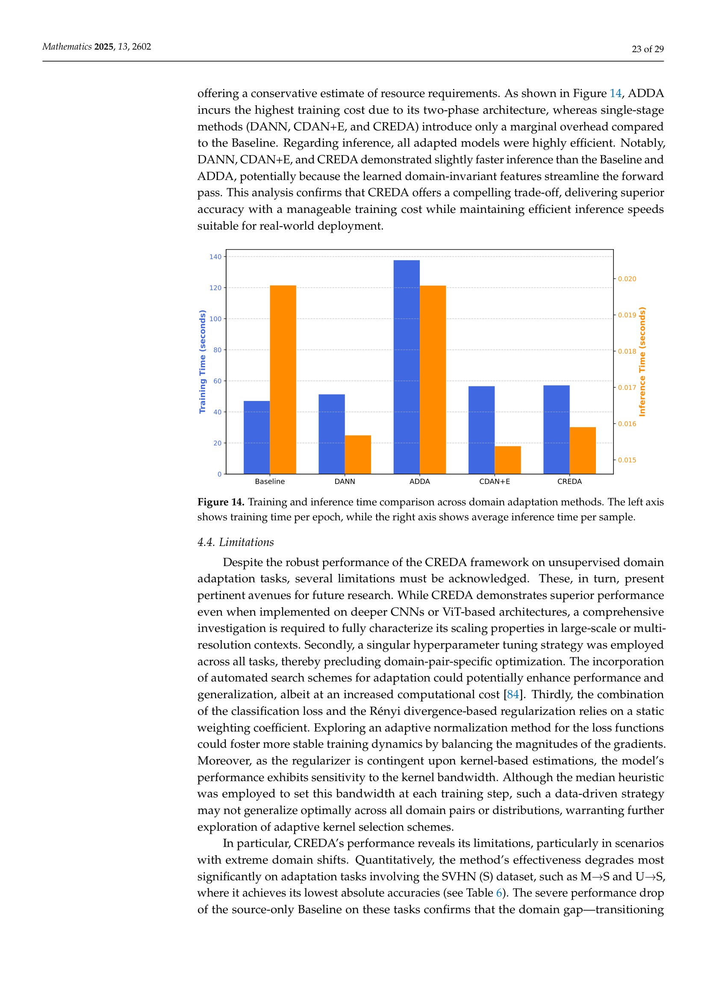

### Extraction assessment
- **Confidence:** 0.95 (meets the configured threshold).
- Machine-readable text was preserved with page-image provenance.

### Raw extracted text
```
Mathematics 2025, 13, 2602
23 of 29
offering a conservative estimate of resource requirements. As shown in Figure 14, ADDA
incurs the highest training cost due to its two-phase architecture, whereas single-stage
methods (DANN, CDAN+E, and CREDA) introduce only a marginal overhead compared
to the Baseline. Regarding inference, all adapted models were highly efficient. Notably,
DANN, CDAN+E, and CREDA demonstrated slightly faster inference than the Baseline and
ADDA, potentially because the learned domain-invariant features streamline the forward
pass. This analysis confirms that CREDA offers a compelling trade-off, delivering superior
accuracy with a manageable training cost while maintaining efficient inference speeds
suitable for real-world deployment.
Baseline
DANN
ADDA
CDAN+E
CREDA
0
20
40
60
80
100
120
140
Training Time (seconds)
0.015
0.016
0.017
0.018
0.019
0.020
Inference Time (seconds)
Figure 14. Training and inference time comparison across domain adaptation methods. The left axis
shows training time per epoch, while the right axis shows average inference time per sample.
4.4. Limitations
Despite the robust performance of the CREDA framework on unsupervised domain
adaptation tasks, several limitations must be acknowledged. These, in turn, present
pertinent avenues for future research. While CREDA demonstrates superior performance
even when implemented on deeper CNNs or ViT-based architectures, a comprehensive
investigation is required to fully characterize its scaling properties in large-scale or multi-
resolution contexts. Secondly, a singular hyperparameter tuning strategy was employed
across all tasks, thereby precluding domain-pair-specific optimization. The incorporation
of automated search schemes for adaptation could potentially enhance performance and
generalization, albeit at an increased computational cost [84]. Thirdly, the combination
of the classification loss and the Rényi divergence-based regularization relies on a static
weighting coefficient. Exploring an adaptive normalization method for the loss functions
could foster more stable training dynamics by balancing the magnitudes of the gradients.
Moreover, as the regularizer is contingent upon kernel-based estimations, the model’s
performance exhibits sensitivity to the kernel bandwidth. Although the median heuristic
was employed to set this bandwidth at each training step, such a data-driven strategy
may not generalize optimally across all domain pairs or distributions, warranting further
exploration of adaptive kernel selection schemes.
In particular, CREDA’s performance reveals its limitations, particularly in scenarios
with extreme domain shifts. Quantitatively, the method’s effectiveness degrades most
significantly on adaptation tasks involving the SVHN (S) dataset, such as M→S and U→S,
where it achieves its lowest absolute accuracies (see Table 6). The severe performance drop
of the source-only Baseline on these tasks confirms that the domain gap—transitioning

```

### Textual figure-caption evidence
- Figure 14. Training and inference time comparison across domain adaptation methods. The left axis
- Captions are page-level text evidence and are not associated with embedded images.

## Page 24
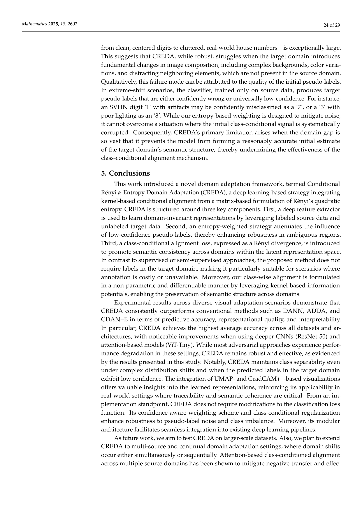

### Extraction assessment
- **Confidence:** 0.95 (meets the configured threshold).
- Machine-readable text was preserved with page-image provenance.

### Raw extracted text
```
Mathematics 2025, 13, 2602
24 of 29
from clean, centered digits to cluttered, real-world house numbers—is exceptionally large.
This suggests that CREDA, while robust, struggles when the target domain introduces
fundamental changes in image composition, including complex backgrounds, color varia-
tions, and distracting neighboring elements, which are not present in the source domain.
Qualitatively, this failure mode can be attributed to the quality of the initial pseudo-labels.
In extreme-shift scenarios, the classifier, trained only on source data, produces target
pseudo-labels that are either confidently wrong or universally low-confidence. For instance,
an SVHN digit ‘1’ with artifacts may be confidently misclassified as a ‘7’, or a ‘3’ with
poor lighting as an ‘8’. While our entropy-based weighting is designed to mitigate noise,
it cannot overcome a situation where the initial class-conditional signal is systematically
corrupted. Consequently, CREDA’s primary limitation arises when the domain gap is
so vast that it prevents the model from forming a reasonably accurate initial estimate
of the target domain’s semantic structure, thereby undermining the effectiveness of the
class-conditional alignment mechanism.
5. Conclusions
This work introduced a novel domain adaptation framework, termed Conditional
Rényi α-Entropy Domain Adaptation (CREDA), a deep learning-based strategy integrating
kernel-based conditional alignment from a matrix-based formulation of Rényi’s quadratic
entropy. CREDA is structured around three key components. First, a deep feature extractor
is used to learn domain-invariant representations by leveraging labeled source data and
unlabeled target data. Second, an entropy-weighted strategy attenuates the influence
of low-confidence pseudo-labels, thereby enhancing robustness in ambiguous regions.
Third, a class-conditional alignment loss, expressed as a Rényi divergence, is introduced
to promote semantic consistency across domains within the latent representation space.
In contrast to supervised or semi-supervised approaches, the proposed method does not
require labels in the target domain, making it particularly suitable for scenarios where
annotation is costly or unavailable. Moreover, our class-wise alignment is formulated
in a non-parametric and differentiable manner by leveraging kernel-based information
potentials, enabling the preservation of semantic structure across domains.
Experimental results across diverse visual adaptation scenarios demonstrate that
CREDA consistently outperforms conventional methods such as DANN, ADDA, and
CDAN+E in terms of predictive accuracy, representational quality, and interpretability.
In particular, CREDA achieves the highest average accuracy across all datasets and ar-
chitectures, with noticeable improvements when using deeper CNNs (ResNet-50) and
attention-based models (ViT-Tiny). While most adversarial approaches experience perfor-
mance degradation in these settings, CREDA remains robust and effective, as evidenced
by the results presented in this study. Notably, CREDA maintains class separability even
under complex distribution shifts and when the predicted labels in the target domain
exhibit low confidence. The integration of UMAP- and GradCAM++-based visualizations
offers valuable insights into the learned representations, reinforcing its applicability in
real-world settings where traceability and semantic coherence are critical. From an im-
plementation standpoint, CREDA does not require modifications to the classification loss
function. Its confidence-aware weighting scheme and class-conditional regularization
enhance robustness to pseudo-label noise and class imbalance. Moreover, its modular
architecture facilitates seamless integration into existing deep learning pipelines.
As future work, we aim to test CREDA on larger-scale datasets. Also, we plan to extend
CREDA to multi-source and continual domain adaptation settings, where domain shifts
occur either simultaneously or sequentially. Attention-based class-conditioned alignment
across multiple source domains has been shown to mitigate negative transfer and effec-

```

## Page 25
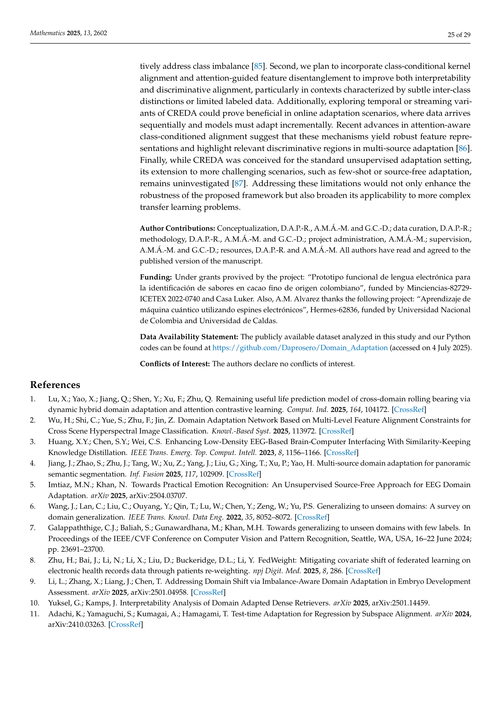

### Extraction assessment
- **Confidence:** 0.65 (below the configured 0.85 threshold; human review required).
- One or more equation candidates are ambiguous in raw extraction.

### Raw extracted text
```
Mathematics 2025, 13, 2602
25 of 29
tively address class imbalance [85]. Second, we plan to incorporate class-conditional kernel
alignment and attention-guided feature disentanglement to improve both interpretability
and discriminative alignment, particularly in contexts characterized by subtle inter-class
distinctions or limited labeled data. Additionally, exploring temporal or streaming vari-
ants of CREDA could prove beneficial in online adaptation scenarios, where data arrives
sequentially and models must adapt incrementally. Recent advances in attention-aware
class-conditioned alignment suggest that these mechanisms yield robust feature repre-
sentations and highlight relevant discriminative regions in multi-source adaptation [86].
Finally, while CREDA was conceived for the standard unsupervised adaptation setting,
its extension to more challenging scenarios, such as few-shot or source-free adaptation,
remains uninvestigated [87]. Addressing these limitations would not only enhance the
robustness of the proposed framework but also broaden its applicability to more complex
transfer learning problems.
Author Contributions: Conceptualization, D.A.P.-R., A.M.Á.-M. and G.C.-D.; data curation, D.A.P.-R.;
methodology, D.A.P.-R., A.M.Á.-M. and G.C.-D.; project administration, A.M.Á.-M.; supervision,
A.M.Á.-M. and G.C.-D.; resources, D.A.P.-R. and A.M.Á.-M. All authors have read and agreed to the
published version of the manuscript.
Funding: Under grants provived by the project: “Prototipo funcional de lengua electrónica para
la identificación de sabores en cacao fino de origen colombiano”, funded by Minciencias-82729-
ICETEX 2022-0740 and Casa Luker. Also, A.M. Alvarez thanks the following project: “Aprendizaje de
máquina cuántico utilizando espines electrónicos”, Hermes-62836, funded by Universidad Nacional
de Colombia and Universidad de Caldas.
Data Availability Statement: The publicly available dataset analyzed in this study and our Python
codes can be found at https://github.com/Daprosero/Domain_Adaptation (accessed on 4 July 2025).
Conflicts of Interest: The authors declare no conflicts of interest.
References
1.
Lu, X.; Yao, X.; Jiang, Q.; Shen, Y.; Xu, F.; Zhu, Q. Remaining useful life prediction model of cross-domain rolling bearing via
dynamic hybrid domain adaptation and attention contrastive learning. Comput. Ind. 2025, 164, 104172. [CrossRef]
2.
Wu, H.; Shi, C.; Yue, S.; Zhu, F.; Jin, Z. Domain Adaptation Network Based on Multi-Level Feature Alignment Constraints for
Cross Scene Hyperspectral Image Classification. Knowl.-Based Syst. 2025, 113972. [CrossRef]
3.
Huang, X.Y.; Chen, S.Y.; Wei, C.S. Enhancing Low-Density EEG-Based Brain-Computer Interfacing With Similarity-Keeping
Knowledge Distillation. IEEE Trans. Emerg. Top. Comput. Intell. 2023, 8, 1156–1166. [CrossRef]
4.
Jiang, J.; Zhao, S.; Zhu, J.; Tang, W.; Xu, Z.; Yang, J.; Liu, G.; Xing, T.; Xu, P.; Yao, H. Multi-source domain adaptation for panoramic
semantic segmentation. Inf. Fusion 2025, 117, 102909. [CrossRef]
5.
Imtiaz, M.N.; Khan, N. Towards Practical Emotion Recognition: An Unsupervised Source-Free Approach for EEG Domain
Adaptation. arXiv 2025, arXiv:2504.03707.
6.
Wang, J.; Lan, C.; Liu, C.; Ouyang, Y.; Qin, T.; Lu, W.; Chen, Y.; Zeng, W.; Yu, P.S. Generalizing to unseen domains: A survey on
domain generalization. IEEE Trans. Knowl. Data Eng. 2022, 35, 8052–8072. [CrossRef]
7.
Galappaththige, C.J.; Baliah, S.; Gunawardhana, M.; Khan, M.H. Towards generalizing to unseen domains with few labels. In
Proceedings of the IEEE/CVF Conference on Computer Vision and Pattern Recognition, Seattle, WA, USA, 16–22 June 2024;
pp. 23691–23700.
8.
Zhu, H.; Bai, J.; Li, N.; Li, X.; Liu, D.; Buckeridge, D.L.; Li, Y. FedWeight: Mitigating covariate shift of federated learning on
electronic health records data through patients re-weighting. npj Digit. Med. 2025, 8, 286. [CrossRef]
9.
Li, L.; Zhang, X.; Liang, J.; Chen, T. Addressing Domain Shift via Imbalance-Aware Domain Adaptation in Embryo Development
Assessment. arXiv 2025, arXiv:2501.04958. [CrossRef]
10.
Yuksel, G.; Kamps, J. Interpretability Analysis of Domain Adapted Dense Retrievers. arXiv 2025, arXiv:2501.14459.
11.
Adachi, K.; Yamaguchi, S.; Kumagai, A.; Hamagami, T. Test-time Adaptation for Regression by Subspace Alignment. arXiv 2024,
arXiv:2410.03263. [CrossRef]

```

### Equation candidates
- `page-025-equation-001` — review_required (confidence 0.45; page 25).
```
codes can be found at https://github.com/Daprosero/Domain_Adaptation (accessed on 4 July 2025).
```

## Page 26
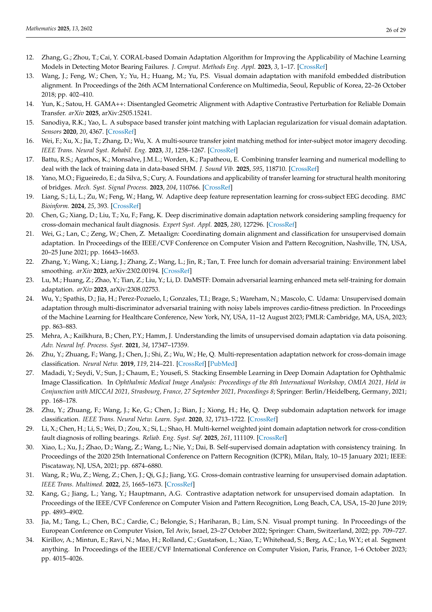

### Extraction assessment
- **Confidence:** 0.95 (meets the configured threshold).
- Machine-readable text was preserved with page-image provenance.

### Raw extracted text
```
Mathematics 2025, 13, 2602
26 of 29
12.
Zhang, G.; Zhou, T.; Cai, Y. CORAL-based Domain Adaptation Algorithm for Improving the Applicability of Machine Learning
Models in Detecting Motor Bearing Failures. J. Comput. Methods Eng. Appl. 2023, 3, 1–17. [CrossRef]
13.
Wang, J.; Feng, W.; Chen, Y.; Yu, H.; Huang, M.; Yu, P.S. Visual domain adaptation with manifold embedded distribution
alignment. In Proceedings of the 26th ACM International Conference on Multimedia, Seoul, Republic of Korea, 22–26 October
2018; pp. 402–410.
14.
Yun, K.; Satou, H. GAMA++: Disentangled Geometric Alignment with Adaptive Contrastive Perturbation for Reliable Domain
Transfer. arXiv 2025, arXiv:2505.15241.
15.
Sanodiya, R.K.; Yao, L. A subspace based transfer joint matching with Laplacian regularization for visual domain adaptation.
Sensors 2020, 20, 4367. [CrossRef]
16.
Wei, F.; Xu, X.; Jia, T.; Zhang, D.; Wu, X. A multi-source transfer joint matching method for inter-subject motor imagery decoding.
IEEE Trans. Neural Syst. Rehabil. Eng. 2023, 31, 1258–1267. [CrossRef]
17.
Battu, R.S.; Agathos, K.; Monsalve, J.M.L.; Worden, K.; Papatheou, E. Combining transfer learning and numerical modelling to
deal with the lack of training data in data-based SHM. J. Sound Vib. 2025, 595, 118710. [CrossRef]
18.
Yano, M.O.; Figueiredo, E.; da Silva, S.; Cury, A. Foundations and applicability of transfer learning for structural health monitoring
of bridges. Mech. Syst. Signal Process. 2023, 204, 110766. [CrossRef]
19.
Liang, S.; Li, L.; Zu, W.; Feng, W.; Hang, W. Adaptive deep feature representation learning for cross-subject EEG decoding. BMC
Bioinform. 2024, 25, 393. [CrossRef]
20.
Chen, G.; Xiang, D.; Liu, T.; Xu, F.; Fang, K. Deep discriminative domain adaptation network considering sampling frequency for
cross-domain mechanical fault diagnosis. Expert Syst. Appl. 2025, 280, 127296. [CrossRef]
21.
Wei, G.; Lan, C.; Zeng, W.; Chen, Z. Metaalign: Coordinating domain alignment and classification for unsupervised domain
adaptation. In Proceedings of the IEEE/CVF Conference on Computer Vision and Pattern Recognition, Nashville, TN, USA,
20–25 June 2021; pp. 16643–16653.
22.
Zhang, Y.; Wang, X.; Liang, J.; Zhang, Z.; Wang, L.; Jin, R.; Tan, T. Free lunch for domain adversarial training: Environment label
smoothing. arXiv 2023, arXiv:2302.00194. [CrossRef]
23.
Lu, M.; Huang, Z.; Zhao, Y.; Tian, Z.; Liu, Y.; Li, D. DaMSTF: Domain adversarial learning enhanced meta self-training for domain
adaptation. arXiv 2023, arXiv:2308.02753.
24.
Wu, Y.; Spathis, D.; Jia, H.; Perez-Pozuelo, I.; Gonzales, T.I.; Brage, S.; Wareham, N.; Mascolo, C. Udama: Unsupervised domain
adaptation through multi-discriminator adversarial training with noisy labels improves cardio-fitness prediction. In Proceedings
of the Machine Learning for Healthcare Conference, New York, NY, USA, 11–12 August 2023; PMLR: Cambridge, MA, USA, 2023;
pp. 863–883.
25.
Mehra, A.; Kailkhura, B.; Chen, P.Y.; Hamm, J. Understanding the limits of unsupervised domain adaptation via data poisoning.
Adv. Neural Inf. Process. Syst. 2021, 34, 17347–17359.
26.
Zhu, Y.; Zhuang, F.; Wang, J.; Chen, J.; Shi, Z.; Wu, W.; He, Q. Multi-representation adaptation network for cross-domain image
classification. Neural Netw. 2019, 119, 214–221. [CrossRef] [PubMed]
27.
Madadi, Y.; Seydi, V.; Sun, J.; Chaum, E.; Yousefi, S. Stacking Ensemble Learning in Deep Domain Adaptation for Ophthalmic
Image Classification. In Ophthalmic Medical Image Analysis: Proceedings of the 8th International Workshop, OMIA 2021, Held in
Conjunction with MICCAI 2021, Strasbourg, France, 27 September 2021, Proceedings 8; Springer: Berlin/Heidelberg, Germany, 2021;
pp. 168–178.
28.
Zhu, Y.; Zhuang, F.; Wang, J.; Ke, G.; Chen, J.; Bian, J.; Xiong, H.; He, Q. Deep subdomain adaptation network for image
classification. IEEE Trans. Neural Netw. Learn. Syst. 2020, 32, 1713–1722. [CrossRef]
29.
Li, X.; Chen, H.; Li, S.; Wei, D.; Zou, X.; Si, L.; Shao, H. Multi-kernel weighted joint domain adaptation network for cross-condition
fault diagnosis of rolling bearings. Reliab. Eng. Syst. Saf. 2025, 261, 111109. [CrossRef]
30.
Xiao, L.; Xu, J.; Zhao, D.; Wang, Z.; Wang, L.; Nie, Y.; Dai, B. Self-supervised domain adaptation with consistency training. In
Proceedings of the 2020 25th International Conference on Pattern Recognition (ICPR), Milan, Italy, 10–15 January 2021; IEEE:
Piscataway, NJ, USA, 2021; pp. 6874–6880.
31.
Wang, R.; Wu, Z.; Weng, Z.; Chen, J.; Qi, G.J.; Jiang, Y.G. Cross-domain contrastive learning for unsupervised domain adaptation.
IEEE Trans. Multimed. 2022, 25, 1665–1673. [CrossRef]
32.
Kang, G.; Jiang, L.; Yang, Y.; Hauptmann, A.G. Contrastive adaptation network for unsupervised domain adaptation.
In
Proceedings of the IEEE/CVF Conference on Computer Vision and Pattern Recognition, Long Beach, CA, USA, 15–20 June 2019;
pp. 4893–4902.
33.
Jia, M.; Tang, L.; Chen, B.C.; Cardie, C.; Belongie, S.; Hariharan, B.; Lim, S.N. Visual prompt tuning. In Proceedings of the
European Conference on Computer Vision, Tel Aviv, Israel, 23–27 October 2022; Springer: Cham, Switzerland, 2022; pp. 709–727.
34.
Kirillov, A.; Mintun, E.; Ravi, N.; Mao, H.; Rolland, C.; Gustafson, L.; Xiao, T.; Whitehead, S.; Berg, A.C.; Lo, W.Y.; et al. Segment
anything. In Proceedings of the IEEE/CVF International Conference on Computer Vision, Paris, France, 1–6 October 2023;
pp. 4015–4026.

```

## Page 27
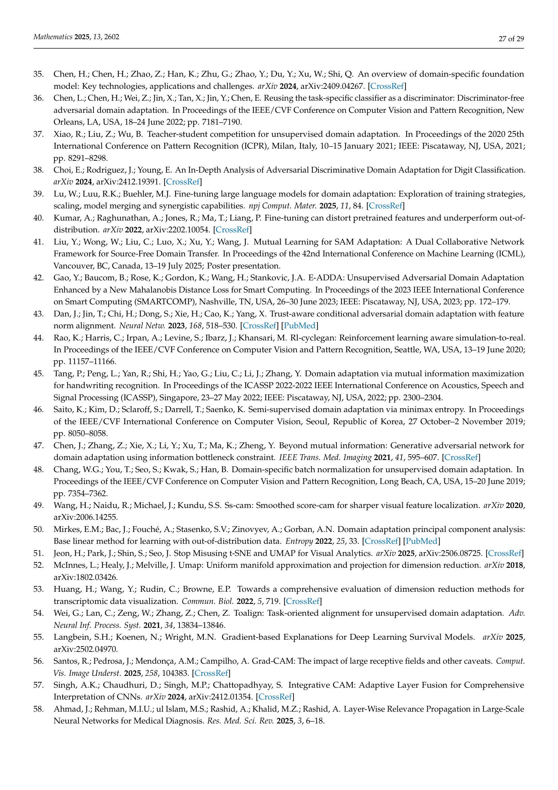

### Extraction assessment
- **Confidence:** 0.95 (meets the configured threshold).
- Machine-readable text was preserved with page-image provenance.

### Raw extracted text
```
Mathematics 2025, 13, 2602
27 of 29
35.
Chen, H.; Chen, H.; Zhao, Z.; Han, K.; Zhu, G.; Zhao, Y.; Du, Y.; Xu, W.; Shi, Q. An overview of domain-specific foundation
model: Key technologies, applications and challenges. arXiv 2024, arXiv:2409.04267. [CrossRef]
36.
Chen, L.; Chen, H.; Wei, Z.; Jin, X.; Tan, X.; Jin, Y.; Chen, E. Reusing the task-specific classifier as a discriminator: Discriminator-free
adversarial domain adaptation. In Proceedings of the IEEE/CVF Conference on Computer Vision and Pattern Recognition, New
Orleans, LA, USA, 18–24 June 2022; pp. 7181–7190.
37.
Xiao, R.; Liu, Z.; Wu, B. Teacher-student competition for unsupervised domain adaptation. In Proceedings of the 2020 25th
International Conference on Pattern Recognition (ICPR), Milan, Italy, 10–15 January 2021; IEEE: Piscataway, NJ, USA, 2021;
pp. 8291–8298.
38.
Choi, E.; Rodriguez, J.; Young, E. An In-Depth Analysis of Adversarial Discriminative Domain Adaptation for Digit Classification.
arXiv 2024, arXiv:2412.19391. [CrossRef]
39.
Lu, W.; Luu, R.K.; Buehler, M.J. Fine-tuning large language models for domain adaptation: Exploration of training strategies,
scaling, model merging and synergistic capabilities. npj Comput. Mater. 2025, 11, 84. [CrossRef]
40.
Kumar, A.; Raghunathan, A.; Jones, R.; Ma, T.; Liang, P. Fine-tuning can distort pretrained features and underperform out-of-
distribution. arXiv 2022, arXiv:2202.10054. [CrossRef]
41.
Liu, Y.; Wong, W.; Liu, C.; Luo, X.; Xu, Y.; Wang, J. Mutual Learning for SAM Adaptation: A Dual Collaborative Network
Framework for Source-Free Domain Transfer. In Proceedings of the 42nd International Conference on Machine Learning (ICML),
Vancouver, BC, Canada, 13–19 July 2025; Poster presentation.
42.
Gao, Y.; Baucom, B.; Rose, K.; Gordon, K.; Wang, H.; Stankovic, J.A. E-ADDA: Unsupervised Adversarial Domain Adaptation
Enhanced by a New Mahalanobis Distance Loss for Smart Computing. In Proceedings of the 2023 IEEE International Conference
on Smart Computing (SMARTCOMP), Nashville, TN, USA, 26–30 June 2023; IEEE: Piscataway, NJ, USA, 2023; pp. 172–179.
43.
Dan, J.; Jin, T.; Chi, H.; Dong, S.; Xie, H.; Cao, K.; Yang, X. Trust-aware conditional adversarial domain adaptation with feature
norm alignment. Neural Netw. 2023, 168, 518–530. [CrossRef] [PubMed]
44.
Rao, K.; Harris, C.; Irpan, A.; Levine, S.; Ibarz, J.; Khansari, M. Rl-cyclegan: Reinforcement learning aware simulation-to-real.
In Proceedings of the IEEE/CVF Conference on Computer Vision and Pattern Recognition, Seattle, WA, USA, 13–19 June 2020;
pp. 11157–11166.
45.
Tang, P.; Peng, L.; Yan, R.; Shi, H.; Yao, G.; Liu, C.; Li, J.; Zhang, Y. Domain adaptation via mutual information maximization
for handwriting recognition. In Proceedings of the ICASSP 2022-2022 IEEE International Conference on Acoustics, Speech and
Signal Processing (ICASSP), Singapore, 23–27 May 2022; IEEE: Piscataway, NJ, USA, 2022; pp. 2300–2304.
46.
Saito, K.; Kim, D.; Sclaroff, S.; Darrell, T.; Saenko, K. Semi-supervised domain adaptation via minimax entropy. In Proceedings
of the IEEE/CVF International Conference on Computer Vision, Seoul, Republic of Korea, 27 October–2 November 2019;
pp. 8050–8058.
47.
Chen, J.; Zhang, Z.; Xie, X.; Li, Y.; Xu, T.; Ma, K.; Zheng, Y. Beyond mutual information: Generative adversarial network for
domain adaptation using information bottleneck constraint. IEEE Trans. Med. Imaging 2021, 41, 595–607. [CrossRef]
48.
Chang, W.G.; You, T.; Seo, S.; Kwak, S.; Han, B. Domain-specific batch normalization for unsupervised domain adaptation. In
Proceedings of the IEEE/CVF Conference on Computer Vision and Pattern Recognition, Long Beach, CA, USA, 15–20 June 2019;
pp. 7354–7362.
49.
Wang, H.; Naidu, R.; Michael, J.; Kundu, S.S. Ss-cam: Smoothed score-cam for sharper visual feature localization. arXiv 2020,
arXiv:2006.14255.
50.
Mirkes, E.M.; Bac, J.; Fouché, A.; Stasenko, S.V.; Zinovyev, A.; Gorban, A.N. Domain adaptation principal component analysis:
Base linear method for learning with out-of-distribution data. Entropy 2022, 25, 33. [CrossRef] [PubMed]
51.
Jeon, H.; Park, J.; Shin, S.; Seo, J. Stop Misusing t-SNE and UMAP for Visual Analytics. arXiv 2025, arXiv:2506.08725. [CrossRef]
52.
McInnes, L.; Healy, J.; Melville, J. Umap: Uniform manifold approximation and projection for dimension reduction. arXiv 2018,
arXiv:1802.03426.
53.
Huang, H.; Wang, Y.; Rudin, C.; Browne, E.P. Towards a comprehensive evaluation of dimension reduction methods for
transcriptomic data visualization. Commun. Biol. 2022, 5, 719. [CrossRef]
54.
Wei, G.; Lan, C.; Zeng, W.; Zhang, Z.; Chen, Z. Toalign: Task-oriented alignment for unsupervised domain adaptation. Adv.
Neural Inf. Process. Syst. 2021, 34, 13834–13846.
55.
Langbein, S.H.; Koenen, N.; Wright, M.N. Gradient-based Explanations for Deep Learning Survival Models.
arXiv 2025,
arXiv:2502.04970.
56.
Santos, R.; Pedrosa, J.; Mendonça, A.M.; Campilho, A. Grad-CAM: The impact of large receptive fields and other caveats. Comput.
Vis. Image Underst. 2025, 258, 104383. [CrossRef]
57.
Singh, A.K.; Chaudhuri, D.; Singh, M.P.; Chattopadhyay, S. Integrative CAM: Adaptive Layer Fusion for Comprehensive
Interpretation of CNNs. arXiv 2024, arXiv:2412.01354. [CrossRef]
58.
Ahmad, J.; Rehman, M.I.U.; ul Islam, M.S.; Rashid, A.; Khalid, M.Z.; Rashid, A. Layer-Wise Relevance Propagation in Large-Scale
Neural Networks for Medical Diagnosis. Res. Med. Sci. Rev. 2025, 3, 6–18.

```

## Page 28
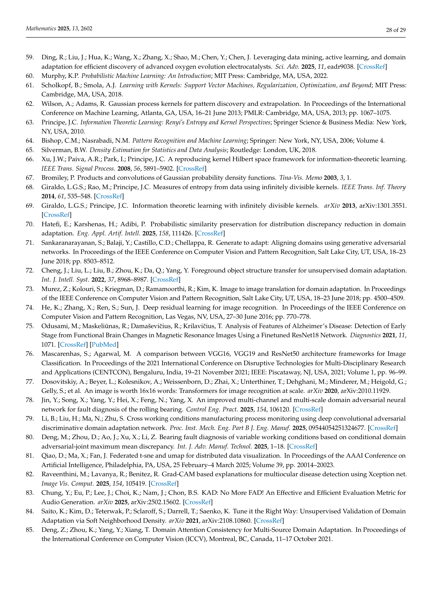

### Extraction assessment
- **Confidence:** 0.95 (meets the configured threshold).
- Machine-readable text was preserved with page-image provenance.

### Raw extracted text
```
Mathematics 2025, 13, 2602
28 of 29
59.
Ding, R.; Liu, J.; Hua, K.; Wang, X.; Zhang, X.; Shao, M.; Chen, Y.; Chen, J. Leveraging data mining, active learning, and domain
adaptation for efficient discovery of advanced oxygen evolution electrocatalysts. Sci. Adv. 2025, 11, eadr9038. [CrossRef]
60.
Murphy, K.P. Probabilistic Machine Learning: An Introduction; MIT Press: Cambridge, MA, USA, 2022.
61.
Scholkopf, B.; Smola, A.J. Learning with Kernels: Support Vector Machines, Regularization, Optimization, and Beyond; MIT Press:
Cambridge, MA, USA, 2018.
62.
Wilson, A.; Adams, R. Gaussian process kernels for pattern discovery and extrapolation. In Proceedings of the International
Conference on Machine Learning, Atlanta, GA, USA, 16–21 June 2013; PMLR: Cambridge, MA, USA, 2013; pp. 1067–1075.
63.
Principe, J.C. Information Theoretic Learning: Renyi’s Entropy and Kernel Perspectives; Springer Science & Business Media: New York,
NY, USA, 2010.
64.
Bishop, C.M.; Nasrabadi, N.M. Pattern Recognition and Machine Learning; Springer: New York, NY, USA, 2006; Volume 4.
65.
Silverman, B.W. Density Estimation for Statistics and Data Analysis; Routledge: London, UK, 2018.
66.
Xu, J.W.; Paiva, A.R.; Park, I.; Principe, J.C. A reproducing kernel Hilbert space framework for information-theoretic learning.
IEEE Trans. Signal Process. 2008, 56, 5891–5902. [CrossRef]
67.
Bromiley, P. Products and convolutions of Gaussian probability density functions. Tina-Vis. Memo 2003, 3, 1.
68.
Giraldo, L.G.S.; Rao, M.; Principe, J.C. Measures of entropy from data using infinitely divisible kernels. IEEE Trans. Inf. Theory
2014, 61, 535–548. [CrossRef]
69.
Giraldo, L.G.S.; Principe, J.C. Information theoretic learning with infinitely divisible kernels.
arXiv 2013, arXiv:1301.3551.
[CrossRef]
70.
Hatefi, E.; Karshenas, H.; Adibi, P. Probabilistic similarity preservation for distribution discrepancy reduction in domain
adaptation. Eng. Appl. Artif. Intell. 2025, 158, 111426. [CrossRef]
71.
Sankaranarayanan, S.; Balaji, Y.; Castillo, C.D.; Chellappa, R. Generate to adapt: Aligning domains using generative adversarial
networks. In Proceedings of the IEEE Conference on Computer Vision and Pattern Recognition, Salt Lake City, UT, USA, 18–23
June 2018; pp. 8503–8512.
72.
Cheng, J.; Liu, L.; Liu, B.; Zhou, K.; Da, Q.; Yang, Y. Foreground object structure transfer for unsupervised domain adaptation.
Int. J. Intell. Syst. 2022, 37, 8968–8987. [CrossRef]
73.
Murez, Z.; Kolouri, S.; Kriegman, D.; Ramamoorthi, R.; Kim, K. Image to image translation for domain adaptation. In Proceedings
of the IEEE Conference on Computer Vision and Pattern Recognition, Salt Lake City, UT, USA, 18–23 June 2018; pp. 4500–4509.
74.
He, K.; Zhang, X.; Ren, S.; Sun, J. Deep residual learning for image recognition. In Proceedings of the IEEE Conference on
Computer Vision and Pattern Recognition, Las Vegas, NV, USA, 27–30 June 2016; pp. 770–778.
75.
Odusami, M.; Maskeli¯unas, R.; Damaševiˇcius, R.; Krilaviˇcius, T. Analysis of Features of Alzheimer’s Disease: Detection of Early
Stage from Functional Brain Changes in Magnetic Resonance Images Using a Finetuned ResNet18 Network. Diagnostics 2021, 11,
1071. [CrossRef] [PubMed]
76.
Mascarenhas, S.; Agarwal, M. A comparison between VGG16, VGG19 and ResNet50 architecture frameworks for Image
Classification. In Proceedings of the 2021 International Conference on Disruptive Technologies for Multi-Disciplinary Research
and Applications (CENTCON), Bengaluru, India, 19–21 November 2021; IEEE: Piscataway, NJ, USA, 2021; Volume 1, pp. 96–99.
77.
Dosovitskiy, A.; Beyer, L.; Kolesnikov, A.; Weissenborn, D.; Zhai, X.; Unterthiner, T.; Dehghani, M.; Minderer, M.; Heigold, G.;
Gelly, S.; et al. An image is worth 16x16 words: Transformers for image recognition at scale. arXiv 2020, arXiv:2010.11929.
78.
Jin, Y.; Song, X.; Yang, Y.; Hei, X.; Feng, N.; Yang, X. An improved multi-channel and multi-scale domain adversarial neural
network for fault diagnosis of the rolling bearing. Control Eng. Pract. 2025, 154, 106120. [CrossRef]
79.
Li, B.; Liu, H.; Ma, N.; Zhu, S. Cross working conditions manufacturing process monitoring using deep convolutional adversarial
discriminative domain adaptation network. Proc. Inst. Mech. Eng. Part B J. Eng. Manuf. 2025, 09544054251324677. [CrossRef]
80.
Deng, M.; Zhou, D.; Ao, J.; Xu, X.; Li, Z. Bearing fault diagnosis of variable working conditions based on conditional domain
adversarial-joint maximum mean discrepancy. Int. J. Adv. Manuf. Technol. 2025, 1–18. [CrossRef]
81.
Qiao, D.; Ma, X.; Fan, J. Federated t-sne and umap for distributed data visualization. In Proceedings of the AAAI Conference on
Artificial Intelligence, Philadelphia, PA, USA, 25 February–4 March 2025; Volume 39, pp. 20014–20023.
82.
Raveenthini, M.; Lavanya, R.; Benitez, R. Grad-CAM based explanations for multiocular disease detection using Xception net.
Image Vis. Comput. 2025, 154, 105419. [CrossRef]
83.
Chung, Y.; Eu, P.; Lee, J.; Choi, K.; Nam, J.; Chon, B.S. KAD: No More FAD! An Effective and Efficient Evaluation Metric for
Audio Generation. arXiv 2025, arXiv:2502.15602. [CrossRef]
84.
Saito, K.; Kim, D.; Teterwak, P.; Sclaroff, S.; Darrell, T.; Saenko, K. Tune it the Right Way: Unsupervised Validation of Domain
Adaptation via Soft Neighborhood Density. arXiv 2021, arXiv:2108.10860. [CrossRef]
85.
Deng, Z.; Zhou, K.; Yang, Y.; Xiang, T. Domain Attention Consistency for Multi-Source Domain Adaptation. In Proceedings of
the International Conference on Computer Vision (ICCV), Montreal, BC, Canada, 11–17 October 2021.

```

## Page 29


### Extraction assessment
- **Confidence:** 0.95 (meets the configured threshold).
- Machine-readable text was preserved with page-image provenance.

### Raw extracted text
```
Mathematics 2025, 13, 2602
29 of 29
86.
Belal, A.; Meethal, A.; Romero, F.P.; Pedersoli, M.; Granger, E. Attention-based Class-Conditioned Alignment for Multi-Source
Domain Adaptation of Object Detectors. arXiv 2024, arXiv:2403.09918.
87.
Xu, Y.; Men, A.; Liu, Y.; Zhuang, X.; Chen, Q. Incorporating Pre-Training Data Matters in Unsupervised Domain Adaptation.
IEEE Trans. Pattern Anal. Mach. Intell. 2025, 47, 7930–7943. [CrossRef] [PubMed]
Disclaimer/Publisher’s Note: The statements, opinions and data contained in all publications are solely those of the individual
author(s) and contributor(s) and not of MDPI and/or the editor(s). MDPI and/or the editor(s) disclaim responsibility for any injury to
people or property resulting from any ideas, methods, instructions or products referred to in the content.

```
